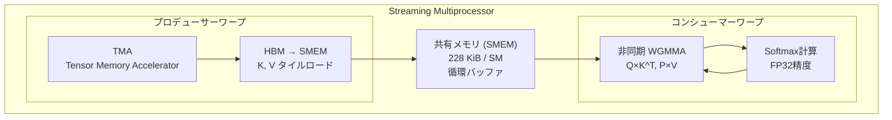
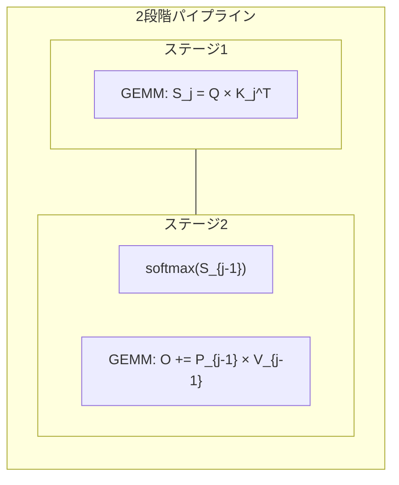

## 論文概要（Abstract）

本記事は [FlashAttention-3: Fast and Accurate Attention with Asynchrony and Low-precision](https://arxiv.org/abs/2407.08608)（Shah et al., NeurIPS 2024）の解説記事です。

FlashAttention-3は、NVIDIA Hopper GPU（H100）のハードウェア特性を活用してAttention計算を高速化する手法である。Shah et al.は、(1) Warp-Specializationによる計算とデータ移動の非同期オーバーラップ、(2) Softmax-Matmulインターリーブによるパイプライン実行、(3) FP8ブロック量子化による低精度演算の3技術を提案した。著者らは、H100 GPU上でFlashAttention-2比1.5-2.0倍の高速化を達成し、FP16で約740 TFLOPS/s（理論最大の75%活用率）、FP8で約1.2 PFLOPS/sの性能を報告している。

この記事は [Zenn記事: OllamaをDocker Composeで本番運用する GPU割当・監視・認証の実践構成](https://zenn.dev/0h_n0/articles/ffeb63bfe214b6) の深掘りです。

## 情報源

- **会議名**: NeurIPS 2024（Neural Information Processing Systems）
- **arXiv ID**: 2407.08608
- **URL**: [arXiv:2407.08608](https://arxiv.org/abs/2407.08608)
- **著者**: Jay Shah, Ganesh Bikshandi, Ying Zhang, Vijay Thakkar, Pradeep Ramani, Tri Dao
- **分野**: cs.LG (Machine Learning), cs.AI (Artificial Intelligence)
- **初版投稿日**: 2024年7月11日
- **コード**: [Dao-AILab/flash-attention](https://github.com/Dao-AILab/flash-attention)

## カンファレンス情報

**NeurIPS（Neural Information Processing Systems）** は、機械学習・計算神経科学分野の主要国際会議である。年間投稿数は15,000件を超え、採択率は約25%程度である。FlashAttention-3はNeurIPS 2024で採択された。FlashAttentionシリーズはNeurIPS 2022（FlashAttention-1）、ICLR 2024（FlashAttention-2）に続き3回連続でトップカンファレンスに採択されており、Attention高速化が継続的に重要なテーマとして認識されていることを示している。

## 背景と動機（Background & Motivation）

大規模言語モデル（LLM）の推論・学習において、Self-Attentionは系列長の2乗に比例する計算量とメモリ使用量がボトルネックとなる。FlashAttention-1（Dao et al., NeurIPS 2022）はHBMとSRAM間のI/Oを最小化するタイリングアルゴリズムにより、FlashAttention-2（Dao, ICLR 2024）はワークパーティショニングの最適化によりA100 GPU上で大幅な高速化を実現した。

しかし、Shah et al.は、FlashAttention-2がH100 GPU上でmatmulの理論最大FLOPSの35%しか活用できていない点を指摘している。この低い活用率の原因は、(1) matmulと非matmul演算（softmax等）の逐次実行、(2) Hopper世代で導入された非同期ハードウェア機能（TMA、非同期WGMMA）の未活用、(3) FP8等の低精度演算サポートの未利用にある。FlashAttention-3はこれら3つの課題に対応する最適化技術を提案した。

## 主要な貢献（Key Contributions）

- **Warp-Specialization**: ワープを「プロデューサー」（データロード）と「コンシューマー」（計算）に分業させ、Hopper GPUのTMAと非同期WGMMA命令を活用して計算とデータ移動のオーバーラップを実現
- **Softmax-Matmul Interleaving**: ブロック単位のmatmulとsoftmax演算を2段階パイプラインでインターリーブし、非matmul演算によるメモリレイテンシストールを削減
- **FP8 Block Quantization**: ブロック単位のスケーリングとincoherent processing（ランダム直交行列による前処理）を組み合わせ、FP8量子化の数値精度を改善しつつ高速化を達成
- **性能実績**: H100 GPU上でFP16 740 TFLOPS/s（75%活用率）、FP8 約1.2 PFLOPS/sを達成し、FlashAttention-2比1.5-2.0倍の高速化を報告

## 技術的詳細（Technical Details）

### Standard Attention

標準的なAttention計算は以下の式で表される。

$$
\text{Attention}(Q, K, V) = \text{softmax}\left(\frac{QK^T}{\sqrt{d_k}}\right)V
$$

ここで、
- $Q \in \mathbb{R}^{N \times d_k}$: Query行列
- $K \in \mathbb{R}^{N \times d_k}$: Key行列
- $V \in \mathbb{R}^{N \times d_v}$: Value行列
- $d_k$: Keyの次元数（スケーリング係数として$\sqrt{d_k}$を使用）
- $N$: 系列長

この計算量は$O(N^2 d)$であり、$N$が大きい場合にボトルネックとなる。FlashAttentionシリーズはタイリングにより中間結果をSRAM（共有メモリ）上で処理し、HBMへのI/Oを削減する。FlashAttention-3はさらにHopper GPUの非同期ハードウェアを活用してパイプライン効率を向上させている。

### Warp-Specialization

FlashAttention-3の中核となる最適化は、Hopper GPU（H100）固有のハードウェア機能を活用したワープの分業化である。



従来のFlashAttention-2では、全ワープが同じ処理（ロードと計算）を行い、同期バリアで待ち合わせていた。FlashAttention-3では`setmaxnreg`命令によりプロデューサーワープのレジスタ割り当てを減らしてコンシューマーワープに再配分し、役割を明確に分離する。

プロデューサーワープはTMA（Tensor Memory Accelerator）を使ってHBMからSMEM（共有メモリ）へK, Vタイルを非同期にロードする。コンシューマーワープは非同期WGMMA（Warp Group Matrix-Multiply-Accumulate）命令でSMEM上のデータを直接参照してGEMMを実行する。両者はロックフリーの循環バッファ（pingpongスケジューリング）で同期し、明示的なバリアを最小化する。

### Softmax-Matmul Interleaving

FlashAttentionのメインループでは各ブロックについてGEMM（$S = QK^T$）、softmax（$P = \text{softmax}(S)$）、GEMM（$O = PV$）の3演算を順次実行する。この逐次処理ではGEMM中にTensor Coreがsoftmax結果を待つストールが発生する。



Shah et al.は2段階パイプラインを導入した。反復$j$において、現在のブロックのGEMM（$S_j = QK_j^T$）を実行する間に、前ブロックのsoftmax（$P_{j-1} = \text{softmax}(S_{j-1})$）とGEMM（$O \mathrel{+}= P_{j-1}V_{j-1}$）を同時実行する。この方法ではsoftmaxの実行コストがGEMMの実行時間に隠蔽される。

Shah et al.は3段階パイプラインも検討したが、レジスタ圧迫とコンパイラの命令リオーダリングにより2段階と同等以上の性能は得られなかったと報告している（論文Section 3.2）。

### FP8 Block Quantization

Hopper GPUはFP8（E4M3/E5M2）のTensor Core演算をネイティブサポートしており、FP16比で理論上2倍のスループットを実現できる。しかし、FP8の狭いダイナミックレンジ（E4M3で最大値448）は量子化誤差を増大させる。

Shah et al.は2つの精度改善技術を提案している。

**ブロック量子化**: テンソル全体で1つのスケーリング係数を共有する代わりに、ブロック単位（$B_r \times d$または$B_c \times d$）で個別のスケーリング係数を維持する。これによりブロック内の値域に適応した量子化が可能となる。

**Incoherent Processing**: Attention計算の前に、$Q$と$K$にランダム直交行列$M$を右乗算する前処理を行う。

$$
\tilde{Q} = QM, \quad \tilde{K} = KM
$$

ここで、$M$はランダムな直交行列（$MM^T = I$）である。直交性により、Attentionスコアは変化しない。

$$
\tilde{Q}\tilde{K}^T = (QM)(KM)^T = QMM^TK^T = QK^T
$$

Shah et al.は$M$として、ランダム符号行列$D$（対角成分が$\pm 1$）とアダマール行列$H$の積$M = DH$を使用している。アダマール変換は$O(d \log d)$で計算可能であるため、前処理のオーバーヘッドは小さい。

この前処理により、$Q$, $K$の外れ値が各座標に分散されるため、FP8量子化誤差が低減される。著者らは、合成外れ値（0.1%のエントリに$\mathcal{N}(0, 100)$を加算）を含むデータで評価し、ベースラインFP8（per-tensor量子化）のRMSE 2.4e-2に対し、FlashAttention-3 FP8はRMSE 9.1e-3（約2.6倍の誤差低減）を報告している（論文Table/Figure参照）。

### Pythonによるincoherent processingの実装例

以下は、incoherent processingの概念を示すPythonコードである。実際のFlashAttention-3はCUDA/CUTLASS 3.5で実装されている。

```python
import torch
import torch.nn.functional as F
from scipy.linalg import hadamard


def apply_incoherent_processing(
    Q: torch.Tensor,
    K: torch.Tensor,
    d_k: int,
) -> tuple[torch.Tensor, torch.Tensor]:
    """Incoherent processingによるFP8量子化前処理

    Args:
        Q: Query行列 (batch_size, n_heads, seq_len, d_k), FP16/BF16
        K: Key行列 (batch_size, n_heads, seq_len, d_k), FP16/BF16
        d_k: Head dimension (2の冪乗である必要がある)

    Returns:
        変換後のQ, K (FP8量子化に適した値分布)
    """
    # ランダム符号行列 D: 対角成分が +1 or -1
    signs = torch.randint(0, 2, (d_k,), device=Q.device) * 2 - 1  # {-1, +1}
    D = torch.diag(signs.float())

    # アダマール行列 H (d_k x d_k), 正規化
    H = torch.tensor(hadamard(d_k), dtype=Q.dtype, device=Q.device)
    H = H / (d_k ** 0.5)  # 正規化して直交行列にする

    # M = D @ H (直交行列: M @ M^T = I)
    M = D @ H

    # Q, K に右乗算: QM(KM)^T = QMM^TK^T = QK^T (不変)
    Q_transformed = Q @ M
    K_transformed = K @ M

    return Q_transformed, K_transformed


def flash_attention_fp8_concept(
    Q: torch.Tensor,
    K: torch.Tensor,
    V: torch.Tensor,
) -> torch.Tensor:
    """FlashAttention-3 FP8の概念実装

    注: 実際のFlashAttention-3はCUDA kernelで実装されており、
    このコードは概念理解のためのリファレンス実装である。

    Args:
        Q: Query (batch, heads, seq_len, d_k)
        K: Key (batch, heads, seq_len, d_k)
        V: Value (batch, heads, seq_len, d_v)

    Returns:
        Attention出力 (batch, heads, seq_len, d_v)
    """
    d_k = Q.size(-1)

    # Step 1: Incoherent processing (外れ値の分散)
    Q_proc, K_proc = apply_incoherent_processing(Q, K, d_k)

    # Step 2: ブロック量子化 (ブロック単位でスケーリング)
    # 実際にはCUDA kernel内でタイル単位に実行される
    q_scale = Q_proc.abs().amax(dim=-1, keepdim=True).clamp(min=1e-12) / 448.0
    k_scale = K_proc.abs().amax(dim=-1, keepdim=True).clamp(min=1e-12) / 448.0

    Q_fp8 = (Q_proc / q_scale).clamp(-448, 448)
    K_fp8 = (K_proc / k_scale).clamp(-448, 448)

    # Step 3: Attention計算 (アキュムレータはFP32)
    scores = torch.matmul(Q_fp8, K_fp8.transpose(-2, -1))
    scores = scores * (q_scale * k_scale.transpose(-2, -1))  # デスケーリング
    scores = scores / (d_k ** 0.5)

    attn_weights = F.softmax(scores, dim=-1)  # softmaxはFP32で計算
    output = torch.matmul(attn_weights, V)

    return output
```

## 実装のポイント（Implementation）

### FlashAttention-3の利用方法

FlashAttention-3はCUTLASS 3.5をベースに実装されており、H100以降のHopper GPUが必須である。PyTorchからは`flash-attn`パッケージを通じて利用できる。

```bash
pip install flash-attn --no-build-isolation
```

### OllamaでのFlash Attention設定

関連Zenn記事で解説されているOllamaのDocker Compose環境では、Flash Attentionを以下の環境変数で有効化できる。

```yaml
# docker-compose.yml
services:
  ollama:
    image: ollama/ollama:latest
    environment:
      - OLLAMA_FLASH_ATTENTION=1   # Flash Attention有効化
      - OLLAMA_KV_CACHE_TYPE=q8_0  # KVキャッシュ量子化（FA前提）
    deploy:
      resources:
        reservations:
          devices:
            - driver: nvidia
              count: 1
              capabilities: [gpu]
```

`OLLAMA_FLASH_ATTENTION=1`を設定すると、OllamaはFlash Attentionカーネルを使用してAttention計算を実行する。これによりメモリ使用量が削減され、KVキャッシュの量子化（`OLLAMA_KV_CACHE_TYPE=q8_0`や`q4_0`）が利用可能になる。GPUがHopper世代（H100, H200）であればFlashAttention-3相当の最適化が適用される可能性があるが、実際の実装はOllamaが内部で使用するllama.cppのバックエンドに依存する。A100以前のGPUではFlashAttention-2相当のカーネルが使用される。

### 実装上の注意点

- **GPUアーキテクチャ依存**: Warp-SpecializationとTMAはHopper世代固有の機能であり、Ampere以前のGPUではFlashAttention-2が適用される
- **FP8レイアウト制約**: FP8 WGMMAはk-major（内側次元が連続）のオペランド配置を要求するため、カーネル内でLDSM/STSM命令によるレイアウト変換が必要
- **FP8の精度トレードオフ**: 学習時のFP8 Attentionの影響は未検証であると著者らは述べており、推論用途での利用が現時点では安全である

## Production Deployment Guide

### AWS実装パターン（コスト最適化重視）

FlashAttention-3を活用したLLM推論基盤をAWS上に構築する場合のトラフィック量別推奨構成を示す。コスト試算は2026年8月時点のap-northeast-1（東京）リージョン料金に基づく概算値であり、実際のコストはトラフィックパターン、バースト使用量により変動する。最新料金はAWS料金計算ツールで確認を推奨する。

**Small構成（~100 req/日）: Serverless** --- 月額$50-150

| サービス | 用途 | 月額概算 |
|----------|------|----------|
| Lambda | 前処理・後処理 | $5-15 |
| Bedrock (Claude Haiku) | LLM推論 | $20-60 |
| DynamoDB (On-Demand) | キャッシュ・セッション | $5-15 |
| API Gateway | エンドポイント | $5-10 |
| CloudWatch | 監視・ログ | $10-20 |
| S3 | モデル入出力保存 | $5-10 |

Serverless構成ではGPUインスタンスを保持しないため、Flash Attentionの恩恵はBedrock側のマネージド最適化に依存する。

**Medium構成（~1,000 req/日）: Hybrid** --- 月額$300-800

| サービス | 用途 | 月額概算 |
|----------|------|----------|
| ECS Fargate (2vCPU, 8GB) | アプリケーション | $80-150 |
| Bedrock (Claude Sonnet) | LLM推論 | $100-300 |
| ElastiCache (r7g.medium) | 推論キャッシュ | $50-100 |
| ALB | ロードバランシング | $25-40 |
| CloudWatch + X-Ray | 監視・トレース | $20-40 |

**Large構成（10,000+ req/日）: Container + GPU** --- 月額$2,000-5,000

| サービス | 用途 | 月額概算 |
|----------|------|----------|
| EKS (コントロールプレーン) | オーケストレーション | $75 |
| g5.xlarge Spot (A10G) x 2-4 | Ollama + Flash Attention | $400-1,200 |
| p5.48xlarge Spot (H100) x 1 | 高スループット推論 | $1,000-2,500 |
| Karpenter | GPUノード自動スケール | $0 (OSS) |
| ALB + NLB | L4/L7 ロードバランシング | $50-80 |
| Prometheus + Grafana | GPU監視 | $50-100 |

Large構成ではH100インスタンス上でFlashAttention-3のWarp-SpecializationとFP8演算を直接活用できる。Spot Instancesの活用により最大90%のコスト削減が可能である。

**コスト削減テクニック**:
- **Spot Instances**: g5/p5インスタンスでオンデマンド比最大90%削減。中断耐性のあるバッチ推論に適用
- **Reserved Instances**: 1年コミットで最大72%削減。常時稼働の推論サーバーに適用
- **Bedrock Batch API**: 非同期処理で50%削減。リアルタイム性が不要なワークロードに適用
- **Prompt Caching**: 同一プレフィックスの繰り返しリクエストで30-90%削減

### Terraformインフラコード

#### Small構成（Serverless）: Lambda + Bedrock + DynamoDB

```hcl
# Small構成: Serverless LLM推論基盤
# コスト目安: $50-150/月 (~100 req/日)

terraform {
  required_version = ">= 1.9"
  required_providers {
    aws = { source = "hashicorp/aws", version = "~> 5.60" }
  }
}

provider "aws" {
  region = "ap-northeast-1"
}

# --- IAM: 最小権限 ---
resource "aws_iam_role" "lambda_llm" {
  name = "llm-inference-lambda-role"
  assume_role_policy = jsonencode({
    Version = "2012-10-17"
    Statement = [{
      Action = "sts:AssumeRole"
      Effect = "Allow"
      Principal = { Service = "lambda.amazonaws.com" }
    }]
  })
}

resource "aws_iam_role_policy" "lambda_bedrock" {
  name = "bedrock-invoke"
  role = aws_iam_role.lambda_llm.id
  policy = jsonencode({
    Version = "2012-10-17"
    Statement = [
      {
        Effect   = "Allow"
        Action   = ["bedrock:InvokeModel", "bedrock:InvokeModelWithResponseStream"]
        Resource = "arn:aws:bedrock:ap-northeast-1::foundation-model/*"
      },
      {
        Effect   = "Allow"
        Action   = ["dynamodb:GetItem", "dynamodb:PutItem", "dynamodb:Query"]
        Resource = aws_dynamodb_table.cache.arn
      },
      {
        Effect = "Allow"
        Action = [
          "logs:CreateLogGroup", "logs:CreateLogStream", "logs:PutLogEvents"
        ]
        Resource = "arn:aws:logs:ap-northeast-1:*:*"
      }
    ]
  })
}

# --- DynamoDB: 推論キャッシュ (On-Demand) ---
resource "aws_dynamodb_table" "cache" {
  name         = "llm-inference-cache"
  billing_mode = "PAY_PER_REQUEST" # コスト最適化: On-Demand
  hash_key     = "cache_key"

  attribute {
    name = "cache_key"
    type = "S"
  }

  ttl {
    attribute_name = "expires_at"
    enabled        = true
  }

  server_side_encryption {
    enabled = true # KMS暗号化
  }
}

# --- Lambda: 推論エンドポイント ---
resource "aws_lambda_function" "inference" {
  function_name = "llm-inference"
  role          = aws_iam_role.lambda_llm.arn
  handler       = "handler.lambda_handler"
  runtime       = "python3.12"
  timeout       = 60
  memory_size   = 512 # コスト最適化: 最小限のメモリ

  filename         = "lambda.zip"
  source_code_hash = filebase64sha256("lambda.zip")

  environment {
    variables = {
      DYNAMODB_TABLE = aws_dynamodb_table.cache.name
      MODEL_ID       = "anthropic.claude-3-haiku-20240307-v1:0"
      MAX_TOKENS     = "1024"
    }
  }

  tracing_config {
    mode = "Active" # X-Ray トレーシング有効化
  }
}

# --- CloudWatch: コスト監視アラーム ---
resource "aws_cloudwatch_metric_alarm" "lambda_duration" {
  alarm_name          = "llm-lambda-high-duration"
  comparison_operator = "GreaterThanThreshold"
  evaluation_periods  = 3
  metric_name         = "Duration"
  namespace           = "AWS/Lambda"
  period              = 300
  statistic           = "p99"
  threshold           = 30000 # 30秒超過でアラート
  alarm_description   = "Lambda推論時間がP99 30秒を超過"

  dimensions = {
    FunctionName = aws_lambda_function.inference.function_name
  }
}
```

#### Large構成（Container）: EKS + Karpenter + Spot

```hcl
# Large構成: EKS + GPU Spot Instances
# コスト目安: $2,000-5,000/月 (10,000+ req/日)

module "eks" {
  source  = "terraform-aws-modules/eks/aws"
  version = "~> 20.24"

  cluster_name    = "llm-inference-cluster"
  cluster_version = "1.31"

  vpc_id     = module.vpc.vpc_id
  subnet_ids = module.vpc.private_subnets

  cluster_endpoint_public_access = false # セキュリティ: プライベートのみ

  eks_managed_node_groups = {
    system = {
      instance_types = ["m7i.large"]
      min_size       = 2
      max_size       = 3
      desired_size   = 2
    }
  }
}

# --- Karpenter: GPU Spot自動スケーリング ---
resource "kubectl_manifest" "karpenter_nodepool_gpu" {
  yaml_body = yamlencode({
    apiVersion = "karpenter.sh/v1"
    kind       = "NodePool"
    metadata   = { name = "gpu-spot" }
    spec = {
      template = {
        spec = {
          requirements = [
            { key = "karpenter.sh/capacity-type", operator = "In", values = ["spot"] },
            { key = "node.kubernetes.io/instance-type", operator = "In",
              values = ["g5.xlarge", "g5.2xlarge", "p5.48xlarge"] },
            { key = "kubernetes.io/arch", operator = "In", values = ["amd64"] }
          ]
          nodeClassRef = {
            group = "karpenter.k8s.aws"
            kind  = "EC2NodeClass"
            name  = "gpu-default"
          }
        }
      }
      limits = {
        cpu            = "128"
        memory         = "512Gi"
        "nvidia.com/gpu" = "8"
      }
      disruption = {
        consolidationPolicy = "WhenEmptyOrUnderutilized"
        consolidateAfter    = "60s" # コスト最適化: 空きノード即回収
      }
    }
  })
}

# --- Secrets Manager: Ollama設定 ---
resource "aws_secretsmanager_secret" "ollama_config" {
  name = "llm-inference/ollama-config"
}

resource "aws_secretsmanager_secret_version" "ollama_config" {
  secret_id = aws_secretsmanager_secret.ollama_config.id
  secret_string = jsonencode({
    OLLAMA_FLASH_ATTENTION = "1"
    OLLAMA_KV_CACHE_TYPE   = "q8_0"
    OLLAMA_NUM_PARALLEL    = "4"
  })
}

# --- AWS Budgets: コストアラート ---
resource "aws_budgets_budget" "monthly" {
  name         = "llm-inference-monthly"
  budget_type  = "COST"
  limit_amount = "5000"
  limit_unit   = "USD"
  time_unit    = "MONTHLY"

  notification {
    comparison_operator       = "GREATER_THAN"
    threshold                 = 80
    threshold_type            = "PERCENTAGE"
    notification_type         = "ACTUAL"
    subscriber_email_addresses = ["ops-team@example.com"]
  }

  notification {
    comparison_operator       = "GREATER_THAN"
    threshold                 = 100
    threshold_type            = "PERCENTAGE"
    notification_type         = "FORECASTED"
    subscriber_email_addresses = ["ops-team@example.com"]
  }
}
```

### 運用・監視設定

#### CloudWatch Logs Insights: コスト異常検知

```
# 1時間あたりのトークン使用量を集計
fields @timestamp, @message
| filter @message like /token_usage/
| stats sum(input_tokens) as total_input,
        sum(output_tokens) as total_output,
        count() as request_count
  by bin(1h)
| sort @timestamp desc
```

```
# P95/P99 レイテンシ分析
fields @timestamp, duration_ms
| filter event = "inference_complete"
| stats percentile(duration_ms, 95) as p95,
        percentile(duration_ms, 99) as p99,
        avg(duration_ms) as avg_ms
  by bin(5m)
```

#### CloudWatch アラーム設定（Python）

```python
import boto3


def create_inference_alarms(function_name: str, sns_topic_arn: str) -> None:
    """LLM推論用CloudWatchアラームを作成

    Args:
        function_name: Lambda関数名またはECSサービス名
        sns_topic_arn: 通知先SNSトピックARN
    """
    cw = boto3.client("cloudwatch", region_name="ap-northeast-1")

    # トークン使用量スパイク検知
    cw.put_metric_alarm(
        AlarmName=f"{function_name}-token-spike",
        MetricName="InputTokenCount",
        Namespace="AWS/Bedrock",
        Statistic="Sum",
        Period=3600,
        EvaluationPeriods=1,
        Threshold=100000,
        ComparisonOperator="GreaterThanThreshold",
        AlarmActions=[sns_topic_arn],
        AlarmDescription="Bedrockトークン使用量が1時間10万トークン超過",
    )

    # 推論レイテンシ異常検知
    cw.put_metric_alarm(
        AlarmName=f"{function_name}-high-latency",
        MetricName="Duration",
        Namespace="AWS/Lambda",
        ExtendedStatistic="p99",
        Period=300,
        EvaluationPeriods=3,
        Threshold=30000,
        ComparisonOperator="GreaterThanThreshold",
        AlarmActions=[sns_topic_arn],
        AlarmDescription="推論レイテンシP99が30秒超過",
    )
```

#### X-Ray トレーシング設定（Python）

```python
from aws_xray_sdk.core import xray_recorder, patch_all

# boto3自動計装
patch_all()


@xray_recorder.capture("llm_inference")
def invoke_model(prompt: str, model_id: str) -> dict:
    """X-Rayトレース付きLLM推論

    Args:
        prompt: 入力プロンプト
        model_id: Bedrockモデル ID

    Returns:
        推論結果の辞書
    """
    subsegment = xray_recorder.current_subsegment()
    subsegment.put_annotation("model_id", model_id)
    subsegment.put_metadata("prompt_length", len(prompt))

    # Bedrock呼び出し (自動計装でトレースされる)
    client = boto3.client("bedrock-runtime")
    response = client.invoke_model(
        modelId=model_id,
        body=json.dumps({"prompt": prompt, "max_tokens": 1024}),
    )

    result = json.loads(response["body"].read())
    subsegment.put_metadata("output_tokens", result.get("usage", {}).get("output_tokens", 0))
    return result
```

#### Cost Explorer 日次レポート（Python）

```python
import boto3
from datetime import datetime, timedelta


def get_daily_cost_report(sns_topic_arn: str, threshold_usd: float = 100.0) -> dict:
    """日次コストレポートを取得し、閾値超過時にSNS通知

    Args:
        sns_topic_arn: 通知先SNSトピックARN
        threshold_usd: 日次コスト閾値（USD）

    Returns:
        サービス別コストの辞書
    """
    ce = boto3.client("ce", region_name="us-east-1")
    today = datetime.utcnow().strftime("%Y-%m-%d")
    yesterday = (datetime.utcnow() - timedelta(days=1)).strftime("%Y-%m-%d")

    response = ce.get_cost_and_usage(
        TimePeriod={"Start": yesterday, "End": today},
        Granularity="DAILY",
        Metrics=["UnblendedCost"],
        GroupBy=[{"Type": "DIMENSION", "Key": "SERVICE"}],
    )

    costs = {}
    total = 0.0
    for group in response["ResultsByTime"][0]["Groups"]:
        service = group["Keys"][0]
        amount = float(group["Metrics"]["UnblendedCost"]["Amount"])
        if amount > 0.01:
            costs[service] = round(amount, 2)
            total += amount

    # 閾値超過でSNS通知
    if total > threshold_usd:
        sns = boto3.client("sns", region_name="ap-northeast-1")
        sns.publish(
            TopicArn=sns_topic_arn,
            Subject=f"[COST ALERT] 日次コスト ${total:.2f} > ${threshold_usd:.2f}",
            Message=json.dumps(costs, indent=2, ensure_ascii=False),
        )

    return costs
```

### コスト最適化チェックリスト

#### アーキテクチャ選択

- [ ] トラフィック量に応じた構成を選択（~100 req/日: Serverless、~1,000 req/日: Hybrid、10,000+ req/日: Container）
- [ ] GPU推論が必要な場合のみGPUインスタンスを使用（Bedrockで代替可能か検討）
- [ ] Flash Attention有効化でGPUメモリ効率を最大化

#### リソース最適化

- [ ] EC2/EKS: Spot Instances優先（g5/p5で最大90%削減）
- [ ] 常時稼働ノード: Reserved Instances 1年コミット（最大72%削減）
- [ ] Compute Savings Plans検討（柔軟性を維持しつつ最大66%削減）
- [ ] Lambda: Power Tuningでメモリサイズ最適化（512MB-1024MB推奨）
- [ ] ECS/EKS: Karpenterで未使用ノードの60秒自動回収
- [ ] NAT Gateway: 可能な限りVPCエンドポイントで置換（$0.045/GB削減）

#### LLMコスト削減

- [ ] Bedrock Batch API: 非同期処理で50%削減
- [ ] Prompt Caching有効化: 繰り返しプレフィックスで30-90%削減
- [ ] モデル選択ロジック: 簡単な質問はHaiku、複雑な質問はSonnetに振り分け
- [ ] トークン数制限: max_tokensを用途別に設定（要約: 256、生成: 1024）
- [ ] KVキャッシュ量子化: `OLLAMA_KV_CACHE_TYPE=q8_0`でメモリ使用量削減
- [ ] Flash Attention: `OLLAMA_FLASH_ATTENTION=1`でAttention計算高速化

#### 監視・アラート

- [ ] AWS Budgets: 月次予算アラート（80%/100%閾値）
- [ ] CloudWatch アラーム: トークン使用量スパイク、レイテンシ異常
- [ ] Cost Anomaly Detection: ML駆動のコスト異常検知有効化
- [ ] 日次コストレポート: Cost Explorer API + SNS通知
- [ ] GPU使用率監視: NVIDIA DCGM Exporter + Prometheus

#### リソース管理

- [ ] 未使用EBSボリューム・EIP定期削除
- [ ] タグ戦略: `Environment`, `Service`, `CostCenter`必須
- [ ] S3ライフサイクルポリシー: 30日後にIA、90日後にGlacier
- [ ] 開発環境: 夜間・週末の自動停止（EventBridge + Lambda）
- [ ] CloudTrail/Config: 監査ログ有効化

## 実験結果（Results）

Shah et al.は、H100 80GB SXM5（クロック1830 MHz固定）上でFlashAttention-3の性能を評価している。比較対象はFlashAttention-2 (v2.5.8)、cuDNN 9.1.1、Triton 3.0.0である。

**Forward pass性能（論文Figure/Tableより）**:

| 手法 | 構成 | TFLOPS/s | 理論最大比 |
|------|------|----------|-----------|
| FlashAttention-2 | FP16, hdim=128 | ~350 | ~35% |
| FlashAttention-3 | FP16, hdim=128 | ~740 | ~75% |
| FlashAttention-3 | FP8, hdim=128 | ~1,200 | - |

**Ablation study（batch=4, seqlen=8448, nheads=16, hdim=128、論文より）**:

| 構成 | TFLOPS/s |
|------|----------|
| FlashAttention-3（全最適化） | 661 |
| Warp-Specialization無し | 570 |
| GEMM-Softmax Interleaving無し | 582 |

**FP8数値精度（合成外れ値データ、論文より）**:

| 手法 | RMSE |
|------|------|
| 標準 FP16 Attention | 3.2e-4 |
| FlashAttention-2 FP16 | 1.9e-4 |
| FlashAttention-3 FP16 | 1.9e-4 |
| ベースライン FP8（per-tensor） | 2.4e-2 |
| FlashAttention-3 FP8 | 9.1e-3 |

FlashAttention-3 FP16はFlashAttention-2と同等の数値精度を維持している。これはsoftmax等の中間計算がFP32で実行されるためである。FP8ではincoherent processingにより、ベースラインFP8比で約2.6倍の誤差低減を達成している。

著者らは、FP8 FlashAttention-3がcausal maskingを伴う短い系列長ではcuDNNに劣る場合があると報告しており、persistent kernelデザインの未実装が原因と述べている。

## 実運用への応用（Practical Applications）

### Ollamaとの関連

関連Zenn記事で解説されているOllamaのDocker Compose環境において、`OLLAMA_FLASH_ATTENTION=1`設定はFlash Attentionカーネルの有効化を意味する。FlashAttention-3で提案された技術は以下の形で実運用に影響する。

1. **メモリ効率**: タイリングによるSRAM活用でGPUメモリ使用量が削減され、同一GPUでより大きなモデルやより長いコンテキスト長を処理可能になる
2. **KVキャッシュ量子化**: Flash Attentionの有効化はKVキャッシュの量子化（q8_0, q4_0）の前提条件であり、さらなるメモリ削減を実現する
3. **スループット向上**: 同一ハードウェアでのrequests/secが向上し、Docker Composeの`OLLAMA_NUM_PARALLEL`設定による並列処理の効率が上がる

### GPU選定への示唆

FlashAttention-3の性能差（FP16で75% vs 35%活用率）はH100固有の最適化に依存する。プロダクション環境でのGPU選定では、A100（FlashAttention-2）とH100（FlashAttention-3）のコストパフォーマンス比較が重要となる。Spot InstancesのH100（p5.48xlarge）は高額だが、FlashAttention-3によるスループット向上を考慮すると、高負荷環境ではrequest単価が逆転する可能性がある。

## 関連研究（Related Work）

- **FlashAttention-1**（Dao et al., NeurIPS 2022）: I/O-awareなタイリングアルゴリズムを提案し、HBMアクセスを削減。FlashAttention-3の基盤となる手法
- **FlashAttention-2**（Dao, ICLR 2024）: ワークパーティショニングの改善によりA100上で約2倍の高速化を達成。FlashAttention-3はこれをH100向けにさらに最適化
- **xformers**（Meta, 2022）: memory-efficient attentionの実装ライブラリ。FlashAttentionと同様のタイリング手法を採用するが、ハードウェア固有の最適化はFlashAttentionが先行
- **cuDNN FlashAttention**（NVIDIA）: NVIDIAがcuDNNライブラリに統合したFlash Attention実装。HeadDim 128/256のcausal maskingでは一部FlashAttention-3を上回る性能を示す

## まとめと今後の展望

FlashAttention-3は、Hopper GPUの非同期ハードウェア機能（TMA、非同期WGMMA）を活用した3つの最適化技術により、Attention計算のGPU活用率を35%から75%に引き上げた。FP8 Block QuantizationとIncoherent Processingの組み合わせにより、低精度演算でも実用的な数値精度を維持している。

著者らは今後の課題として、(1) FP8 Attentionの大規模学習への影響評価、(2) persistent kernelによる短系列長でのFP8性能改善、(3) Hopper以降のGPUアーキテクチャ（Blackwell等）への拡張を挙げている。Ollamaなどの推論フレームワークにおいても、Flash Attentionの有効化はメモリ効率とスループットの両面で重要な設定項目であり、バックエンドの進化に伴い本論文の技術がより広く適用されることが期待される。

## 参考文献

- **arXiv**: [https://arxiv.org/abs/2407.08608](https://arxiv.org/abs/2407.08608)
- **Code**: [https://github.com/Dao-AILab/flash-attention](https://github.com/Dao-AILab/flash-attention)
- **FlashAttention-1**: Dao et al., "FlashAttention: Fast and Memory-Efficient Exact Attention with IO-Awareness," NeurIPS 2022. [arXiv:2205.14135](https://arxiv.org/abs/2205.14135)
- **FlashAttention-2**: Dao, "FlashAttention-2: Faster Attention with Better Parallelism and Work Partitioning," ICLR 2024. [arXiv:2307.08691](https://arxiv.org/abs/2307.08691)
- **CUTLASS 3.5**: [https://github.com/NVIDIA/cutlass](https://github.com/NVIDIA/cutlass)
- **Related Zenn article**: [https://zenn.dev/0h_n0/articles/ffeb63bfe214b6](https://zenn.dev/0h_n0/articles/ffeb63bfe214b6)
