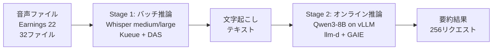

## 論文概要（Abstract）

本記事は [https://arxiv.org/abs/2602.04900](https://arxiv.org/abs/2602.04900) の解説記事です。

本論文は、Kubernetes上でGenAI推論ワークロードを効率的に実行するための3つのコンポーネントを評価している。Whisper音声認識とQwen3-8B LLM要約のマルチステージパイプラインを対象に、バッチジョブ管理（Kueue）、GPUスライシング（DAS）、リクエストルーティング（llm-d + GAIE）の性能を測定した。著者らは、makespan最大15%短縮、ジョブ完了時間36%改善、テールTTFTレイテンシ最大90%改善を報告している。

この記事は [Zenn記事: OllamaをDocker Composeで本番運用する GPU割当・監視・認証の実践構成](https://zenn.dev/0h_n0/articles/ffeb63bfe214b6) の深掘りです。

## 情報源

- **arXiv ID**: 2602.04900
- **URL**: [arXiv:2602.04900](https://arxiv.org/abs/2602.04900)
- **著者**: Sai Sindhur Malleni, Raul Sevilla, Aleksei Vasilevskii, et al.
- **発表年**: 2026年2月
- **分野**: cs.ET (Emerging Technologies), cs.AI, cs.DC
- **採択先**: 17th International Conference on Performance Engineering

## 背景と動機（Background & Motivation）

GenAIワークロードのインフラとして、Kubernetesが注目されている。単一ノードでのDocker Compose運用（関連Zenn記事で解説）は手軽だが、マルチノードへのスケールアウトや複数モデルの同時実行には限界がある。特に以下の課題が存在する。

1. **バッチジョブのスケジューリング**: 純粋なKubernetesスケジューラはGPUリソースの公平な配分やジョブ優先度を考慮しない。複数チームが同一クラスタを共有する場合、リソース競合が非決定的になる
2. **GPU利用率の低さ**: 推論ワークロードはGPUメモリの一部しか使わないケースが多い。1ジョブ1GPUの割り当てではハードウェアが遊ぶ
3. **オンライン推論のレイテンシ変動**: 複数レプリカへのランダムルーティングでは、prefix cacheのヒット率にばらつきが生じ、テールレイテンシが悪化する

著者らは、これらの課題に対しKubernetesネイティブな3コンポーネント（Kueue・DAS・GAIE）を統合評価する点で、従来の個別評価やマイクロベンチマーク中心の研究と差別化している。

## 主要な貢献（Key Contributions）

- **Kueue**: バッチジョブの公平なスケジューリングと優先度制御により、makespanを最大15%短縮しつつ、admission latencyはP99で25ms以下を維持
- **DAS（Dynamic Accelerator Slicer）**: NVIDIA MIGによるGPUスライシングで並列ジョブ数を8から25に増加させ、平均ジョブ完了時間を36%改善
- **llm-d + GAIE（Gateway API Inference Extension）**: prefix-cache-awareなリクエストルーティングにより、テールTTFTレイテンシを最大90%改善

## 技術的詳細（Technical Details）

### マルチステージパイプライン構成

著者らが評価に使用したパイプラインは2段構成である。第1段階でWhisperモデルによる音声認識（バッチ処理）、第2段階でQwen3-8B LLMによる要約（オンライン推論）を行う。



### Kueue: バッチジョブスケジューリング

KueueはKubernetesネイティブのジョブキューイングシステムである。LocalQueueからClusterQueueへジョブを送り、ResourceFlavorでGPUリソースプールを定義する。

評価した4構成を示す。

**構成1: 単一ClusterQueue + BestEffortFIFO**

ジョブを到着順に処理する。純粋なKubernetesジョブ（makespan 60.5分）と比較して、Kueueは62.5分とほぼ同等のmakespanで、かつ決定的な実行順序を保証する。

**構成2: 優先度 + プリエンプション**

大規模モデル（large）のジョブに高優先度を設定し、中規模モデル（medium）のジョブをプリエンプト可能にする。これにより、makespanが51.1分（約15%改善）に短縮された。

**構成3: 複数ClusterQueue + Borrowing**

2つのClusterQueue間でリソースを借用可能にし、公平性を保ちつつmakespan 55.0分を達成する。

**構成4: StrictFIFO**

ヘッドオブラインブロッキングが発生し、makespanが75.5分に悪化する。著者らはBestEffortFIFOを推奨している。

### DAS: Dynamic Accelerator Slicer

DASはNVIDIA MIG（Multi-Instance GPU）を動的に制御し、GPUを論理スライスに分割する。Whisperのmediumモデルには1g.5gbスライス、largeモデルには3g.20gbスライスを割り当てる。

スライシングのスケジューリングは以下の式で表現できる。

$$
\text{Throughput}_{\text{DAS}} = \sum_{i=1}^{S} \frac{1}{T_{\text{job}_i}}
$$

ここで、$S$はMIGスライス数、$T_{\text{job}_i}$は各スライスでのジョブ実行時間である。DASにより$S$が8から25に増加し、スループットが向上する。ただし、MIGスライスのパディングによりGPU利用率は44%から38%に低下する点を著者らは指摘している。

### llm-d + GAIE: リクエストルーティング

llm-dはKubernetes Gateway API Inference Extension（GAIE）と統合されたLLM推論ルーターである。InferencePoolリソースを通じてvLLMレプリカにリクエストをルーティングする。

**Precise Scheduling（prefix-cache-aware）** は、リクエストのプロンプトプレフィックスに基づいて、KVキャッシュを保持しているレプリカへルーティングする。これによりキャッシュヒット率が向上し、TTFT（Time To First Token）が大幅に改善される。

$$
\text{TTFT}_{\text{precise}} = T_{\text{prefill}} \cdot (1 - r_{\text{cache}}) + T_{\text{lookup}} \cdot r_{\text{cache}}
$$

ここで、$r_{\text{cache}}$はキャッシュヒット率、$T_{\text{prefill}}$はフルプレフィル時間、$T_{\text{lookup}}$はキャッシュ参照時間である。Precise Schedulingでは$r_{\text{cache}}$が高くなるため、TTFTが短縮される。

## 実装のポイント（Implementation）

### Kueueの設定

Kueueの導入には、ResourceFlavorでGPUタイプを定義し、ClusterQueueでquotaを設定する。

```yaml
apiVersion: kueue.x-k8s.io/v1beta1
kind: ResourceFlavor
metadata:
  name: gpu-a100
spec:
  nodeLabels:
    nvidia.com/gpu.product: A100-SXM4-40GB
---
apiVersion: kueue.x-k8s.io/v1beta1
kind: ClusterQueue
metadata:
  name: genai-queue
spec:
  queueingStrategy: BestEffortFIFO
  preemption:
    withinClusterQueue: LowerPriority
  resourceGroups:
    - coveredResources: ["nvidia.com/gpu"]
      flavors:
        - name: gpu-a100
          resources:
            - name: nvidia.com/gpu
              nominalQuota: 8
```

### DASの設定

DASではGPU Operatorとの連携が必要である。MIGプロファイルの定義とDaemonSetによる動的スライス管理を行う。論文ではNVIDIA A100上で1g.5gb（smallジョブ用）と3g.20gb（largeジョブ用）の2種類のスライスを使用している。

### GAIE InferencePoolの設定

```yaml
apiVersion: inference.networking.x-k8s.io/v1alpha2
kind: InferencePool
metadata:
  name: llm-pool
spec:
  targetPortNumber: 8000
  selector:
    app: vllm-qwen3
  extensionRef:
    name: llm-d-endpoint-picker
```

## Production Deployment Guide

### AWS実装パターン（コスト最適化重視）

本論文のKueueとDAS、GAIEを組み合わせたGenAI推論基盤をAWS上に構築する場合の構成例を示す。コスト試算は2026年8月時点のAWS東京リージョン（ap-northeast-1）の概算値であり、実際のコストはトラフィックパターンやリージョンにより変動する。最新料金はAWS料金計算ツールで確認を推奨する。

**トラフィック量別の推奨構成**:

| 構成 | トラフィック | 主要サービス | 月額概算 |
|------|-------------|-------------|---------|
| Small | ~100 req/日 | EKS + g5.xlarge (Spot) x1 | $300-600 |
| Medium | ~1,000 req/日 | EKS + g5.2xlarge x2 + Kueue | $1,500-2,500 |
| Large | 10,000+ req/日 | EKS + p4d.24xlarge + Karpenter + Kueue + DAS | $8,000-15,000 |

**Small構成 (~100 req/日)**: EKS($73) + g5.xlarge Spot($150-250) + ALB/NAT($50-80) + 監視($20-30)。GPU不要な前処理はCPUノードへオフロード。

**Large構成 (10,000+ req/日)**: EKS($73) + p4d.24xlarge Reserved($7,000-9,000、1年で最大40%削減) + g5.xlarge Spot x2($400)。Karpenter Spotフォールバック、DAS MIGスライシングで1 GPU最大7スライス同時実行、vLLM x8 + llm-d + GAIEルーティング。

**コスト削減テクニック**: Spot Instances(最大90%削減)、Reserved 1年(最大40%削減)、Savings Plans(最大66%削減)、DAS MIGスライシング(並列3倍以上)。

### Terraformインフラコード

**Small構成（EKS + Spot GPU）**:

```hcl
module "vpc" {
  source  = "terraform-aws-modules/vpc/aws"
  version = "~> 5.16"
  name    = "genai-inference-vpc"
  cidr    = "10.0.0.0/16"
  azs             = ["ap-northeast-1a", "ap-northeast-1c"]
  private_subnets = ["10.0.1.0/24", "10.0.2.0/24"]
  public_subnets  = ["10.0.101.0/24", "10.0.102.0/24"]
  enable_nat_gateway   = true
  single_nat_gateway   = true  # コスト削減: 1AZのみ
  enable_dns_hostnames = true
}

module "eks" {
  source          = "terraform-aws-modules/eks/aws"
  version         = "~> 20.31"
  cluster_name    = "genai-inference"
  cluster_version = "1.32"
  vpc_id          = module.vpc.vpc_id
  subnet_ids      = module.vpc.private_subnets
  cluster_endpoint_public_access = true

  eks_managed_node_groups = {
    system = {
      instance_types = ["m5.large"]
      capacity_type  = "SPOT"
      min_size = 1; max_size = 2; desired_size = 1
    }
    gpu-inference = {
      instance_types = ["g5.xlarge"]  # 1x A10G
      capacity_type  = "SPOT"
      min_size = 0; max_size = 2; desired_size = 1
      ami_type = "AL2_x86_64_GPU"
      labels = { "nvidia.com/gpu.present" = "true" }
      taints = [{ key = "nvidia.com/gpu", value = "present", effect = "NO_SCHEDULE" }]
    }
  }
}
```

**Large構成（EKS + Karpenter）**:

```hcl
resource "kubectl_manifest" "karpenter_nodepool" {
  yaml_body = yamlencode({
    apiVersion = "karpenter.sh/v1"
    kind       = "NodePool"
    metadata   = { name = "gpu-inference" }
    spec = {
      template = { spec = {
        requirements = [
          { key = "karpenter.sh/capacity-type", operator = "In", values = ["spot", "on-demand"] },
          { key = "node.kubernetes.io/instance-type", operator = "In",
            values = ["g5.2xlarge", "g5.4xlarge", "p4d.24xlarge"] },
        ]
        nodeClassRef = { name = "gpu-node-class" }
        taints = [{ key = "nvidia.com/gpu", value = "present", effect = "NoSchedule" }]
      }}
      limits     = { "nvidia.com/gpu" = 16 }
      disruption = { consolidationPolicy = "WhenEmptyOrUnderutilized", consolidateAfter = "60s" }
    }
  })
}

resource "aws_budgets_budget" "genai_monthly" {
  name         = "genai-inference-monthly"
  budget_type  = "COST"
  limit_amount = "5000"
  limit_unit   = "USD"
  time_unit    = "MONTHLY"
  notification {
    comparison_operator        = "GREATER_THAN"
    threshold                  = 80
    threshold_type             = "PERCENTAGE"
    notification_type          = "FORECASTED"
    subscriber_email_addresses = ["team@example.com"]
  }
}
```

### 運用・監視設定

**CloudWatch Logs Insights クエリ（推論レイテンシ分析）**:

```
fields @timestamp, @message
| filter @message like /ttft|latency/
| stats avg(ttft_ms) as avg_ttft,
        pct(ttft_ms, 95) as p95_ttft,
        pct(ttft_ms, 99) as p99_ttft,
        count(*) as request_count
  by bin(1h)
| sort @timestamp desc
```

**CloudWatch アラーム設定（Python）**:

```python
import boto3

cloudwatch = boto3.client("cloudwatch", region_name="ap-northeast-1")

def create_gpu_alarm(cluster_name: str, sns_topic_arn: str) -> None:
    """GPU利用率とTTFTレイテンシのアラームを作成する"""
    cloudwatch.put_metric_alarm(
        AlarmName=f"{cluster_name}-high-ttft-p99",
        MetricName="TTFT_P99",
        Namespace="GenAI/Inference",
        Statistic="Average",
        Period=300,
        EvaluationPeriods=2,
        Threshold=500,  # 500ms
        ComparisonOperator="GreaterThanThreshold",
        AlarmActions=[sns_topic_arn],
        AlarmDescription="P99 TTFT exceeds 500ms for 10 min",
    )
```

**Cost Explorer 日次レポート（Python）**:

```python
import boto3
from datetime import datetime, timedelta

ce = boto3.client("ce", region_name="us-east-1")

def daily_cost_report(sns_topic_arn: str) -> dict:
    """日次コストレポートを取得し閾値超過時にSNS通知する"""
    end = datetime.utcnow().strftime("%Y-%m-%d")
    start = (datetime.utcnow() - timedelta(days=1)).strftime("%Y-%m-%d")
    response = ce.get_cost_and_usage(
        TimePeriod={"Start": start, "End": end},
        Granularity="DAILY",
        Metrics=["UnblendedCost"],
        Filter={"Tags": {"Key": "Project", "Values": ["genai-inference"]}},
        GroupBy=[{"Type": "DIMENSION", "Key": "SERVICE"}],
    )
    total = sum(
        float(g["Metrics"]["UnblendedCost"]["Amount"])
        for r in response["ResultsByTime"] for g in r["Groups"]
    )
    if total > 300:
        boto3.client("sns", region_name="ap-northeast-1").publish(
            TopicArn=sns_topic_arn, Subject="GenAI Cost Alert",
            Message=f"Daily cost: ${total:.2f} exceeds $300",
        )
    return {"date": start, "total_cost": total}
```

### コスト最適化チェックリスト

**アーキテクチャ選択**:
- [ ] トラフィック量に応じた構成選択（Small: Spot GPU 1台 / Medium: Spot+OnDemand混合 / Large: Reserved+Karpenter）
- [ ] バッチ推論とオンライン推論でノードプールを分離

**リソース最適化**:
- [ ] EC2 Spot Instances優先（バッチ推論でオンデマンド比最大90%削減）
- [ ] Reserved Instances 1年コミット（常時稼働GPUで最大40%削減）
- [ ] Savings Plans（Compute）検討
- [ ] DASによるMIGスライシングで並列ジョブ数最大化
- [ ] Karpenter `WhenEmptyOrUnderutilized`で未使用ノード自動削除

**LLMコスト削減**:
- [ ] vLLM PagedAttentionでKVキャッシュメモリ効率化
- [ ] llm-d Precise Schedulingでprefix cacheヒット率最大化
- [ ] モデル量子化（AWQ/GPTQ）でGPUメモリ削減
- [ ] max_tokensの適切な制限

**監視・アラート**:
- [ ] AWS Budgets設定（月額上限の80%で予測アラート）
- [ ] CloudWatchアラーム（GPU利用率低下・TTFT P99超過）
- [ ] Cost Anomaly Detection有効化
- [ ] 日次コストレポート（SNS通知）
- [ ] DCGM Exporterによるノードレベル GPU監視

**リソース管理**:
- [ ] 未使用GPUノードの自動スケールダウン（Karpenter disruption）
- [ ] プロジェクトタグ戦略（`Project: genai-inference`）
- [ ] EBSボリューム・スナップショットのライフサイクルポリシー
- [ ] 開発環境の夜間・週末停止スケジュール

## 実験結果（Results）

### Kueue: バッチスケジューリング性能

著者らは32件のWhisperジョブ（medium 16件 + large 16件）を用いてKueueの4構成を評価している（論文Table 2より）。

| 構成 | Makespan | 改善率 | 備考 |
|------|----------|--------|------|
| 純粋K8s（ベースライン） | 60.5分 | - | 非決定的な実行順序 |
| Kueue BestEffortFIFO | 62.5分 | -3.3% | 決定的な順序保証 |
| 優先度 + プリエンプション | 51.1分 | **+15.5%** | large優先 |
| 複数CQ + Borrowing | 55.0分 | +9.1% | 公平性確保 |
| StrictFIFO | 75.5分 | -24.8% | HOLブロッキング発生 |

Admission latencyはP99で25ms以下であり、Kueueのオーバーヘッドは無視できるレベルであると著者らは報告している。

### DAS: GPU並列化性能

NVIDIA A100 8基でのWhisperジョブ実行結果を以下に示す（論文Table 3相当）。

| メトリクス | MIGなし | MIGあり | 改善 |
|-----------|---------|---------|------|
| 同時実行ジョブ数 | 8 | 25 | 3.1倍 |
| 平均ジョブ完了時間 | 14分 | 18分 | - |
| 中央値完了時間 | 28分 | 16分 | **36%改善** |
| P95完了時間 | 51分 | 36分 | 29%改善 |

GPU利用率は44%から38%に低下するが、DRAM activityが13%から38%に増加しており、メモリ帯域幅がボトルネックとなっている点を著者らは指摘している。Worker CPU利用率も10%から37%に上昇し、データ前処理のオーバーヘッドが顕在化している。

### llm-d + GAIE: オンライン推論レイテンシ

256件の要約リクエスト（合計約272,000トークン）に対するQwen3-8B推論の結果を以下に示す。

| メトリクス | ランダムルーティング | Precise Scheduling | 改善 |
|-----------|-------------------|-------------------|------|
| 平均TTFT | ~500ms | ~80ms | 6.25倍 |
| TTFT変動幅（P95） | 100ms | 6ms | 16.7倍 |
| P99 TTFT | ベースラインの20倍 | ベースライン | **90%改善** |
| P99 E2Eレイテンシ | 最大6秒悪化 | 安定 | 大幅改善 |

Precise Schedulingではprefix cacheヒット率が向上しプレフィル再計算が不要になるためTTFTが短縮される。ただしGAIE経由のルーティングにはClusterIP比で3-11msの追加レイテンシが生じると報告されている。

### 実験環境

Red Hat OpenShift Service on AWS（ROSA）上で、p4d.24xlarge（NVIDIA A100 40GB x8）1ノード、Kubernetes v1.32、GPU Operator v25.3.4を使用。ベンチマークにはkube-burner（バッチ）とGuideLLM（オンライン推論）を利用している。

## 実運用への応用（Practical Applications）

関連Zenn記事「OllamaをDocker Composeで本番運用する GPU割当・監視・認証の実践構成」では、単一ノードでのDocker Compose構成とPrometheus/Grafanaによる監視を解説している。本論文の成果は、その構成からマルチノードKubernetesへスケールアウトする際の指針となる。

**段階的な移行パス**:

1. **単一ノードDocker Compose**（Zenn記事の構成）: GPU 1基、Ollama単体、~100 req/日
2. **EKS + Kueue**: 複数GPUノードでバッチ推論を並列化、公平なリソース配分
3. **EKS + DAS**: MIGスライシングで1基のGPUを複数ジョブで共有、コスト効率を改善
4. **EKS + llm-d + GAIE**: オンライン推論のテールレイテンシを最適化、SLO準拠を実現

Zenn記事で構築したPrometheus/Grafana監視基盤は、Kubernetes上でもDCGM Exporter経由でGPUメトリクスを収集可能で、移行時の学習コストが低い。Docker Composeの`deploy.resources.reservations.devices`はKubernetesではDevice Plugin + DASに置き換わる。

## 関連研究（Related Work）

- **vLLM**: PagedAttentionによるKVキャッシュ管理で推論メモリ効率を改善。本論文ではバックエンドとして使用
- **KServe**: Kubernetesネイティブのモデルサービング。GAIEはGateway APIレベルでLLM固有ルーティングを実装する点で異なる
- **Alpa / DistServe**: 分散推論のアルゴリズム最適化。本論文はインフラレベルの統合評価に焦点を置く

## まとめと今後の展望

本論文は、Kubernetes上でGenAI推論ワークロードを実行するための3つのコンポーネント（Kueue・DAS・llm-d + GAIE）を統合的に評価し、それぞれがバッチスケジューリングの最適化（makespan 15%短縮）、GPU並列化（完了時間36%改善）、リクエストルーティング（テールTTFT 90%改善）に寄与することを示した。

著者らは今後の課題として、KueueとDASのネイティブ統合（メモリ認識スケジューリング）、マルチモーダル・ストリーミングワークロードへの拡張、Gang SchedulingやDRA統合を挙げている。なお、モデル精度評価は対象外であり、システムレベルの性能評価に限定されている。

## 参考文献

- **arXiv**: [https://arxiv.org/abs/2602.04900](https://arxiv.org/abs/2602.04900)
- **Kueue**: [https://kueue.sigs.k8s.io/](https://kueue.sigs.k8s.io/)
- **llm-d**: [https://github.com/llm-d/llm-d](https://github.com/llm-d/llm-d)
- **Gateway API Inference Extension**: [https://gateway-api.sigs.k8s.io/](https://gateway-api.sigs.k8s.io/)
- **vLLM**: [https://github.com/vllm-project/vllm](https://github.com/vllm-project/vllm)
- **Related Zenn article**: [https://zenn.dev/0h_n0/articles/ffeb63bfe214b6](https://zenn.dev/0h_n0/articles/ffeb63bfe214b6)
