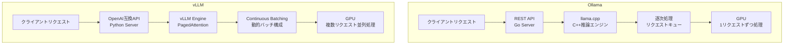

## 論文概要（Abstract）

本記事は [Benchmarking Ollama and vLLM for Concurrent LLM Serving: A Multi-Scenario Evaluation of Performance and Scalability](https://www.mdpi.com/2076-3417/16/11/5435)（Applied Sciences, 2026年5月）の解説記事です。

本論文は、LLM推論フレームワークとして広く使われるOllamaとvLLMを、同時リクエスト処理の観点から体系的にベンチマークした研究である。NVIDIA H100 80GB GPU上でQwen3-4Bモデルを用い、基本QA・複雑な推論・ストリーミング対話・ストレステストの4シナリオで評価を行っている。著者らは、vLLMが全シナリオで20-29倍のスループットと8-19倍の低P95レイテンシを達成し、100同時ユーザーまで安定した100%成功率を維持したと報告している。一方、Ollamaは約10同時ユーザーでボトルネックに達し、13-30%のエラー率が観測された。

この記事は [Zenn記事: OllamaをDocker Composeで本番運用する GPU割当・監視・認証の実践構成](https://zenn.dev/0h_n0/articles/ffeb63bfe214b6) の深掘りです。

## 情報源

- **会議名**: Applied Sciences (MDPI), Vol. 16, Issue 11, Article 5435
- **年**: 2026年5月29日出版
- **URL**: [https://www.mdpi.com/2076-3417/16/11/5435](https://www.mdpi.com/2076-3417/16/11/5435)
- **DOI**: [10.3390/app16115435](https://doi.org/10.3390/app16115435)
- **著者**: Betul Ay, Yunus Emre Demirdag（Firat University, Department of Computer Engineering）
- **ライセンス**: CC BY 4.0（Open Access）
- **参考文献数**: 44件

## 背景と動機（Background & Motivation）

LLMを本番環境で運用する際、推論フレームワークの選択はスループット・レイテンシ・安定性に直結する。OllamaとvLLMは最も広く使われるフレームワークであるが、それぞれ異なる設計哲学に基づいている。

Ollamaはllama.cppをバックエンドとし、ローカル環境での簡易デプロイを重視している。一方、vLLMはPagedAttentionとcontinuous batchingを核とし、高スループットの本番推論サービングを目指して設計されている。

従来、両フレームワークの性能比較は非公式なベンチマークに限られ、統一された条件下での体系的評価が不足していた。著者らは、同一GPU・同一モデルウェイト・同一データセットという制御された条件下で、4シナリオの評価を行い、この問題を解決している。

## 主要な貢献（Key Contributions）

- **体系的なベンチマーク設計**: 同一ハードウェア（NVIDIA H100 80GB）、同一モデル（Qwen3-4B）の条件で公平な比較を実現
- **4シナリオ評価**: 基本QA、複雑な推論、ストリーミング対話、ストレステストの多角的評価
- **5データセットによる再現性**: オープンベンチマークデータセットを使用し、再現可能な実験設計
- **同時接続数の分岐点分析**: 約5同時ユーザーを境にvLLMが明確に優位になるブレークポイントを特定
- **本番運用への定量的指針**: 各フレームワークの適用領域を定量データに基づいて明確化

## 技術的詳細（Technical Details）

### 実験セットアップ

著者らが使用した実験環境は以下の通りである。

| 項目 | 詳細 |
|------|------|
| GPU | NVIDIA H100 80GB（単一） |
| モデル | Qwen3-4B（同一ウェイト） |
| データセット | 5つのオープンベンチマークデータセット |
| 評価シナリオ | 4シナリオ |

### 4つの評価シナリオ

**シナリオ1: Baseline Question Answering（基本QA）**

短い質問に対する応答生成。入力トークン数が少なく、出力も短い。フレームワークの基本的な応答速度を測定する。

**シナリオ2: Complex Reasoning（複雑な推論）**

多段階の推論を要する質問。入力コンテキストが長く、出力も長くなる。フレームワークの長文生成性能を評価する。

**シナリオ3: Streaming Interaction（ストリーミング対話）**

Server-Sent Events（SSE）によるストリーミング応答。Time-to-First-Token（TTFT）とトークン間レイテンシ（Inter-Token Latency, ITL）を測定する。

**シナリオ4: Stress Testing（ストレステスト）**

同時接続数を段階的に増加させ、フレームワークの限界を探る。リクエスト成功率、エラー率、メモリ使用量を記録する。

### OllamaとvLLMのアーキテクチャ比較



Ollamaのllama.cppバックエンドは、リクエストを逐次的に処理するキュー方式を採用している。このアプローチは単一ユーザーでのリソース効率に優れるが、同時接続数が増加すると後続リクエストのキュー待ちが発生する。

vLLMのPagedAttentionは、KVキャッシュを仮想メモリのページング方式で管理し、GPUメモリの断片化を防ぐ。continuous batchingにより、実行中のバッチに新規リクエストを動的に追加するため、GPUの遊び時間が最小化される。

### 性能比較の定量結果

著者らが報告した主要な性能指標を以下に示す。

| メトリクス | Ollama | vLLM | vLLMの優位性 |
|-----------|--------|------|------------|
| スループット | ベースライン | 20-29倍 | 20-29x |
| P95レイテンシ | ベースライン | 8-19倍低い | 8-19x |
| TTFT（初回トークン生成時間） | 54-122秒 | 0.5-3.5秒 | 15-244x |
| リクエスト成功率（高負荷時） | 70-87% | 100% | 安定 |
| 最大安定同時接続数 | ~10ユーザー | 100ユーザー | 10x |

TTFTの差が特に顕著であり、Ollamaの逐次処理キューにおけるリクエスト待機時間が支配的であることを示唆している。

## 実装のポイント（Implementation）

### ベンチマーク再現手順

本論文の実験を再現するには、以下のセットアップが必要となる。

**Ollamaのデプロイ**:

```bash
# Docker Composeでのデプロイ（Zenn記事の構成を参考）
docker run -d --gpus all \
  -p 11434:11434 \
  --name ollama \
  ollama/ollama:latest

# モデルのロード
docker exec ollama ollama pull qwen3:4b
```

**vLLMのデプロイ**:

```bash
# vLLMのDockerデプロイ
docker run -d --gpus all \
  -p 8000:8000 \
  --name vllm \
  vllm/vllm-openai:latest \
  --model Qwen/Qwen3-4B \
  --tensor-parallel-size 1 \
  --max-model-len 8192
```

**ベンチマーク実行の注意点**:

1. **ウォームアップ**: 初回リクエストはモデルロードを含むため、計測前にウォームアップリクエストを送る
2. **同一プロンプト制御**: 両フレームワークで同じプロンプトセットを使用し、生成品質ではなく推論性能のみを比較する
3. **メモリモニタリング**: 著者らは両フレームワークで長時間テスト中のメモリ増加を観測しており、本番環境ではメモリモニタリングが不可欠と指摘している

## Production Deployment Guide

### AWS実装パターン（コスト最適化重視）

本論文のベンチマーク結果を踏まえ、OllamaとvLLMのそれぞれに適したAWS構成を示す。コスト試算は2026年8月時点のAWS東京リージョン（ap-northeast-1）の概算値であり、実際のコストはトラフィックパターンやリージョンにより変動する。最新料金はAWS料金計算ツールで確認を推奨する。

**トラフィック量別の推奨構成**:

| 構成 | 同時接続 | 推奨エンジン | 主要サービス | 月額概算 |
|------|---------|------------|-------------|---------|
| Small | 1-3ユーザー | Ollama | ECS Fargate + g5.xlarge Spot x1 | $200-400 |
| Medium | 5-20ユーザー | vLLM | ECS + g5.2xlarge x1 | $800-1,500 |
| Large | 20-100+ユーザー | vLLM | EKS + g5.4xlarge x2 + Karpenter | $3,000-6,000 |

論文の結果から、同時接続5ユーザー未満ではOllamaのリソース効率の良さが活き、5ユーザー以上ではvLLMのcontinuous batchingが必須となる。

**Small構成（Ollama、~3同時接続）**: ECS Fargate($30) + g5.xlarge Spot 1台($150-250) + ALB($20) + CloudWatch($15) + NAT Gateway($35)。Ollamaの逐次処理キューで低コストに運用。論文のベンチマーク結果から、3同時接続以下であればOllamaでも十分なレイテンシを確保できる。

**Large構成（vLLM、20-100+同時接続）**: EKS($73) + g5.4xlarge On-Demand 2台($2,000-3,500) + Karpenter Spot フォールバック($500-1,000) + ALB($30) + 監視($50)。vLLMのcontinuous batchingにより100同時ユーザーまで安定。Reserved Instances 1年で最大40%削減可能。

**コスト削減テクニック**: Spot Instances（最大90%削減）、Reserved 1年（最大40%削減）、Savings Plans（最大66%削減）、vLLMの`--max-model-len`制限によるGPUメモリ効率化。

### Terraformインフラコード

**Small構成（ECS + Ollama）**:

```hcl
module "vpc" {
  source  = "terraform-aws-modules/vpc/aws"
  version = "~> 5.16"
  name    = "llm-serving-vpc"
  cidr    = "10.0.0.0/16"
  azs             = ["ap-northeast-1a", "ap-northeast-1c"]
  private_subnets = ["10.0.1.0/24", "10.0.2.0/24"]
  public_subnets  = ["10.0.101.0/24", "10.0.102.0/24"]
  enable_nat_gateway   = true
  single_nat_gateway   = true  # コスト削減: 1 AZのみ
  enable_dns_hostnames = true
}

resource "aws_ecs_task_definition" "ollama" {
  family                   = "ollama-serving"
  requires_compatibilities = ["EC2"]
  network_mode             = "awsvpc"
  cpu                      = 4096
  memory                   = 16384

  container_definitions = jsonencode([{
    name  = "ollama"
    image = "ollama/ollama:latest"
    portMappings = [{ containerPort = 11434, protocol = "tcp" }]
    resourceRequirements = [{ type = "GPU", value = "1" }]
    environment = [
      { name = "OLLAMA_HOST", value = "0.0.0.0" },
      { name = "OLLAMA_NUM_PARALLEL", value = "3" },
    ]
    logConfiguration = {
      logDriver = "awslogs"
      options   = { "awslogs-group" = "/ecs/ollama", "awslogs-region" = "ap-northeast-1" }
    }
  }])
}
```

**Large構成（EKS + vLLM + Karpenter）**:

```hcl
module "eks" {
  source          = "terraform-aws-modules/eks/aws"
  version         = "~> 20.31"
  cluster_name    = "vllm-serving"
  cluster_version = "1.32"
  vpc_id          = module.vpc.vpc_id
  subnet_ids      = module.vpc.private_subnets
  cluster_endpoint_public_access = true

  eks_managed_node_groups = {
    system = {
      instance_types = ["m5.large"]
      capacity_type  = "SPOT"
      min_size = 1; max_size = 2; desired_size = 1
    }
  }
}

resource "kubectl_manifest" "karpenter_nodepool_vllm" {
  yaml_body = yamlencode({
    apiVersion = "karpenter.sh/v1"
    kind       = "NodePool"
    metadata   = { name = "vllm-gpu" }
    spec = {
      template = { spec = {
        requirements = [
          { key = "karpenter.sh/capacity-type", operator = "In",
            values = ["spot", "on-demand"] },
          { key = "node.kubernetes.io/instance-type", operator = "In",
            values = ["g5.4xlarge", "g5.2xlarge"] },
        ]
        nodeClassRef = { name = "gpu-node-class" }
        taints = [{ key = "nvidia.com/gpu", value = "present", effect = "NoSchedule" }]
      }}
      limits     = { "nvidia.com/gpu" = 4 }
      disruption = { consolidationPolicy = "WhenEmptyOrUnderutilized", consolidateAfter = "120s" }
    }
  })
}

resource "aws_budgets_budget" "llm_monthly" {
  name         = "llm-serving-monthly"
  budget_type  = "COST"
  limit_amount = "5000"
  limit_unit   = "USD"
  time_unit    = "MONTHLY"
  notification {
    comparison_operator        = "GREATER_THAN"
    threshold                  = 80
    threshold_type             = "PERCENTAGE"
    notification_type          = "FORECASTED"
    subscriber_email_addresses = ["team@example.com"]
  }
}
```

### 運用・監視設定

**CloudWatch Logs Insights クエリ（推論レイテンシ分析）**:

```
fields @timestamp, @message
| filter @message like /ttft|latency|throughput/
| stats avg(ttft_ms) as avg_ttft,
        pct(ttft_ms, 95) as p95_ttft,
        pct(ttft_ms, 99) as p99_ttft,
        avg(throughput_tps) as avg_tps,
        count(*) as request_count
  by bin(1h)
| sort @timestamp desc
```

**CloudWatch アラーム設定（Python）**:

```python
import boto3

cloudwatch = boto3.client("cloudwatch", region_name="ap-northeast-1")


def create_llm_serving_alarms(
    cluster_name: str, sns_topic_arn: str, engine: str = "vllm"
) -> None:
    """LLM推論サービングのTTFTと成功率アラームを作成する"""
    # 論文の結果に基づく閾値: vLLM 3.5秒 / Ollama 122秒
    ttft_threshold = 5000 if engine == "vllm" else 130000
    cloudwatch.put_metric_alarm(
        AlarmName=f"{cluster_name}-high-ttft-p95",
        MetricName="TTFT_P95", Namespace="LLMServing",
        Statistic="Average", Period=300, EvaluationPeriods=2,
        Threshold=ttft_threshold, ComparisonOperator="GreaterThanThreshold",
        AlarmActions=[sns_topic_arn],
    )
    cloudwatch.put_metric_alarm(
        AlarmName=f"{cluster_name}-low-success-rate",
        MetricName="RequestSuccessRate", Namespace="LLMServing",
        Statistic="Average", Period=300, EvaluationPeriods=2,
        Threshold=95, ComparisonOperator="LessThanThreshold",
        AlarmActions=[sns_topic_arn],
    )
```

**Cost Explorer 日次レポート（Python）**:

```python
import boto3
from datetime import datetime, timedelta


def daily_llm_cost_report(sns_topic_arn: str) -> dict:
    """日次コストレポートを取得し閾値超過でSNS通知する"""
    ce = boto3.client("ce", region_name="us-east-1")
    end = datetime.utcnow().strftime("%Y-%m-%d")
    start = (datetime.utcnow() - timedelta(days=1)).strftime("%Y-%m-%d")
    response = ce.get_cost_and_usage(
        TimePeriod={"Start": start, "End": end},
        Granularity="DAILY",
        Metrics=["UnblendedCost"],
        Filter={"Tags": {"Key": "Project", "Values": ["llm-serving"]}},
        GroupBy=[{"Type": "DIMENSION", "Key": "SERVICE"}],
    )
    total = sum(
        float(g["Metrics"]["UnblendedCost"]["Amount"])
        for r in response["ResultsByTime"] for g in r["Groups"]
    )
    if total > 200:
        boto3.client("sns", region_name="ap-northeast-1").publish(
            TopicArn=sns_topic_arn, Subject="LLM Serving Cost Alert",
            Message=f"Daily cost: ${total:.2f} exceeds $200 threshold",
        )
    return {"date": start, "total_cost": total}
```

### コスト最適化チェックリスト

**アーキテクチャ選択**:
- [ ] 同時接続数に基づくエンジン選択（~5: Ollama / 5+: vLLM）
- [ ] トラフィックパターンに応じた構成選択（Small: ECS / Large: EKS）
- [ ] バースト対応の要否判断（Karpenter自動スケーリング）

**リソース最適化**:
- [ ] EC2 Spot Instances優先（推論ワークロードはステートレスで中断耐性あり、最大90%削減）
- [ ] Reserved Instances 1年コミット（常時稼働GPUノードで最大40%削減）
- [ ] Savings Plans（Compute）検討
- [ ] Karpenter `WhenEmptyOrUnderutilized`で未使用GPUノード自動削除
- [ ] vLLMの`--gpu-memory-utilization`でメモリ使用率を最適化（デフォルト0.9）

**LLMコスト削減**:
- [ ] vLLMのcontinuous batchingで同一GPU上の同時処理数最大化
- [ ] `--max-model-len`制限でGPUメモリ節約（不要な長文コンテキストを排除）
- [ ] モデル量子化（AWQ/GPTQ）でGPUメモリ使用量削減
- [ ] Ollamaの`OLLAMA_NUM_PARALLEL`で同時処理数を明示的に制限
- [ ] 不要なモデルのアンロード（`ollama rm`）でメモリ解放

**監視・アラート**:
- [ ] AWS Budgets設定（月額上限の80%で予測アラート）
- [ ] CloudWatchアラーム（TTFT P95超過・成功率低下）
- [ ] Cost Anomaly Detection有効化
- [ ] 日次コストレポート（SNS通知）
- [ ] GPUメモリ使用量のモニタリング（長時間テストでのメモリリーク検知）

**リソース管理**:
- [ ] 未使用GPUノードの自動スケールダウン（Karpenter disruption）
- [ ] プロジェクトタグ戦略（`Project: llm-serving`, `Engine: ollama/vllm`）
- [ ] EBSボリューム・スナップショットのライフサイクルポリシー
- [ ] 開発環境の夜間・週末停止スケジュール
- [ ] モデルキャッシュのS3オフロード（ECRイメージに焼かずに動的ロード）

## 実験結果（Results）

### シナリオ別の詳細結果

**シナリオ1: Baseline QA**

基本的なQAタスクにおいて、vLLMは20倍以上のスループットを達成している。Ollamaは単一ユーザーでは十分な応答速度を示すが、同時接続数の増加に伴いキュー待ちが顕在化する。

**シナリオ2: Complex Reasoning**

複雑な推論タスクでは、長い出力生成が求められるため、フレームワーク間の差がさらに拡大する。vLLMのcontinuous batchingが長文生成でも効果を発揮し、29倍のスループット優位が観測されている。

**シナリオ3: Streaming Interaction**

ストリーミング対話では、TTFTの差が利用者体験に直結する。vLLMの0.5-3.5秒に対しOllamaの54-122秒という差は、実用上、Ollamaでの同時ストリーミングが困難であることを示している。

**シナリオ4: Stress Testing**

100同時ユーザーまでのストレステストにおいて、vLLMは100%の成功率を維持した。Ollamaは約10同時ユーザーでボトルネックに達し、13-30.06%のタイムアウトベースのエラーが発生している。著者らは、両フレームワークともに長時間テスト中のメモリ増加を観測しており、本番環境でのメモリモニタリングの重要性を指摘している。

### 同時接続数の分岐点分析

著者らの結果から、同時接続数と推奨エンジンの関係を以下に整理する。

| 同時接続数 | 推奨エンジン | 根拠 |
|-----------|------------|------|
| 1-3 | Ollama | リソース効率と運用の簡易さで優位 |
| 3-5 | どちらでも可 | 分岐点付近、要件に応じて選択 |
| 5-10 | vLLM | Ollamaのキュー待ちが顕在化 |
| 10-100+ | vLLM | Ollamaは13-30%のエラー率、vLLMは100%成功率 |

この分岐点はOllamaのデフォルト構成に基づく。`OLLAMA_NUM_PARALLEL`による並列数調整で改善の余地はあるが、vLLMのcontinuous batchingほどのスケーラビリティは得られない。

## 実運用への応用（Practical Applications）

関連Zenn記事「OllamaをDocker Composeで本番運用する GPU割当・監視・認証の実践構成」では、Docker ComposeによるOllamaデプロイとPrometheus/Grafana監視を解説している。本論文の結果は、この構成のキャパシティプランニングに直結する。

1. **同時接続5ユーザー未満**: Zenn記事のOllama + Docker Compose構成で十分。PrometheusでTTFTの閾値アラートを設定する
2. **同時接続5ユーザー以上**: vLLMへの移行を検討。Docker ComposeのOllamaコンテナをvLLMコンテナに置き換え、OpenAI互換APIを利用する
3. **同時接続20ユーザー以上**: EKSへの移行とKarpenterによる自動スケーリングを導入

Zenn記事のPrometheus/Grafana監視基盤は、vLLMでも`/metrics`エンドポイントを通じて再利用可能である。

## 関連研究（Related Work）

- **vLLM (Kwon et al., 2023)**: PagedAttentionによるKVキャッシュ管理。本論文のvLLMベンチマークの基盤技術
- **Orca (Yu et al., 2022)**: Continuous batchingの概念を提唱。vLLMのスケジューリングの理論的基盤
- **FlexGen (Sheng et al., 2023)**: GPU-CPU-ディスク間のオフロード推論最適化。本論文が扱うGPU内推論とは異なるアプローチ

## まとめと今後の展望

本論文は、OllamaとvLLMの同時リクエスト処理性能を4シナリオ・5データセットで体系的に評価し、vLLMが20-29倍のスループットと8-19倍の低P95レイテンシを達成することを示した。約5同時ユーザーを境にvLLMが明確に優位になるブレークポイントの特定は、本番運用でのエンジン選択に定量的な根拠を与える。

ただし、本論文にはいくつかの制約がある。単一GPU・単一モデルサイズでの評価であり、マルチGPU構成や大規模モデル（70B+）での挙動は未検証である。また、Ollamaの2025-2026年のアーキテクチャ改善（llama.cppカーネル改善、量子化推論パス最適化）やvLLMの投機的デコーディング改善が今後の性能差に影響を与える可能性がある。

## 参考文献

- **論文**: [https://www.mdpi.com/2076-3417/16/11/5435](https://www.mdpi.com/2076-3417/16/11/5435)
- **DOI**: [https://doi.org/10.3390/app16115435](https://doi.org/10.3390/app16115435)
- **Ollama**: [https://github.com/ollama/ollama](https://github.com/ollama/ollama)
- **vLLM**: [https://github.com/vllm-project/vllm](https://github.com/vllm-project/vllm)
- **PagedAttention (vLLM)**: [https://arxiv.org/abs/2309.06180](https://arxiv.org/abs/2309.06180)
- **Related Zenn article**: [https://zenn.dev/0h_n0/articles/ffeb63bfe214b6](https://zenn.dev/0h_n0/articles/ffeb63bfe214b6)
