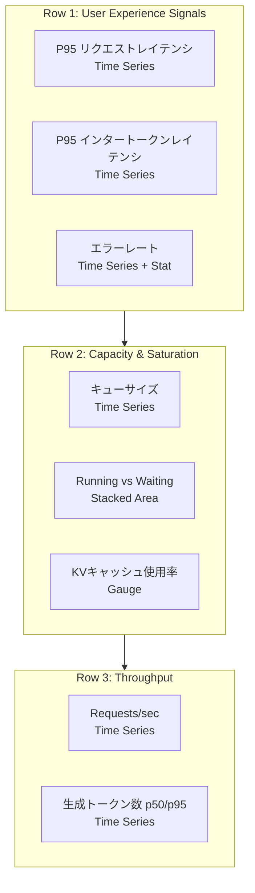

## ブログ概要（Summary）

本記事は [https://www.glukhov.org/observability/monitoring-llm-inference-prometheus-grafana/](https://www.glukhov.org/observability/monitoring-llm-inference-prometheus-grafana/) の解説記事です。

Rost Glukhov氏が2026年に公開した本ブログは、LLM推論サーバー（vLLM・TGI・llama.cpp）の本番環境における監視設計を、Prometheus・Grafanaを用いて体系的に構築する方法を解説している。従来のWebサービス監視では捉えられないLLM固有のメトリクス（デュアルレイテンシ、トークンベーススループット、KVキャッシュ圧力、キュー動態）を定義し、Golden Signalsフレームワークに基づくメトリクス設計からPromQLクエリパターン、Grafanaダッシュボード構成、SLOベースのアラート設計までを網羅的に提示している。

この記事は [Zenn記事: OllamaをDocker Composeで本番運用する GPU割当・監視・認証の実践構成](https://zenn.dev/0h_n0/articles/ffeb63bfe214b6) の深掘りです。

## 情報源

- **種別**: テックブログ
- **URL**: [https://www.glukhov.org/observability/monitoring-llm-inference-prometheus-grafana/](https://www.glukhov.org/observability/monitoring-llm-inference-prometheus-grafana/)
- **著者**: Rost Glukhov
- **発表年**: 2026年

## 技術的背景（Technical Background）

### LLM監視が従来のAPI監視と異なる理由

Glukhov氏は、LLM推論サーバーの監視が従来のWebサービス監視と根本的に異なる4つの理由を挙げている。

**第一に、デュアルレイテンシの存在**である。従来のAPIではリクエスト-レスポンスの単一レイテンシを計測すればよいが、LLM推論ではエンドツーエンドレイテンシ（リクエスト受信から最終トークン返却まで）とインタートークンレイテンシ（デコードフェーズにおけるトークン間の生成時間）の2種類が存在する。後者はストリーミングUXに直結するため、エンドツーエンドレイテンシだけでは利用者体験を正確に評価できない。

**第二に、トークンベースのスループット計測**である。著者は「5トークンを返す『高速な』サービスと500トークンを返すサービスは比較にならない」と述べており、requests/secだけでなくtokens/secを計測する必要性を強調している。

**第三に、キュー動態のプロダクト性**である。Continuous Batchingを採用する場合、キュー深度がサービス品質そのものとなる。著者はキュー滞留時間とキューサイズがユーザー期待値を満たしているかの判断材料になると述べている。

**第四に、キャッシュ圧力が障害の前兆となること**である。KVキャッシュの枯渇やフラグメンテーションは、突発的なレイテンシスパイクやタイムアウトとして表面化する。著者はKVキャッシュ使用率の監視が障害予防において不可欠であると指摘している。

## 実装アーキテクチャ（Architecture）

### LLM向けGolden Signalsフレームワーク

Glukhov氏は、GoogleのSREにおけるGolden Signals（Traffic・Errors・Latency・Saturation）をLLM推論向けに再定義している。

| シグナル | 従来API | LLM推論 |
|---|---|---|
| Traffic | requests/sec | requests/sec + **tokens/sec** |
| Errors | HTTP 5xx率 | エラー率 + タイムアウト + **OOM** + **429（レートリミット）** |
| Latency | p50/p95/p99 | p50/p95/p99 + **prefill vs decode** + **インタートークン** |
| Saturation | CPU/メモリ使用率 | GPU使用率 + VRAM + **KVキャッシュ%** + **キュー長** |

**ラベル設計の原則**として、低カーディナリティのラベル（`model`, `endpoint`, `method`（prefill/decode）, `status`（success/error）, `instance`）のみを使用することが推奨されている。生プロンプト、user_id、リクエストIDなどの高カーディナリティラベルは系列爆発（cardinality explosion）を引き起こすため避けるべきであると述べている。

### プラットフォーム別メトリクス公開

各LLM推論サーバーのメトリクスエンドポイントと主要メトリクスは以下の通りである。

**vLLM**: `http://vllm:8000/metrics`にPrometheus互換のメトリクスを`vllm:`プレフィックスで公開する。

| メトリクス名 | 型 | 説明 |
|---|---|---|
| `vllm:num_requests_running` | Gauge | 実行中リクエスト数 |
| `vllm:num_requests_waiting` | Gauge | 待機中リクエスト数 |
| `vllm:kv_cache_usage_perc` | Gauge | KVキャッシュ使用率（%） |

**Hugging Face TGI**: `http://tgi:8080/metrics`にメトリクスを公開する。

| メトリクス名 | 型 | 説明 |
|---|---|---|
| `tgi_queue_size` | Gauge | キューサイズ |
| `tgi_request_duration` | Histogram | エンドツーエンドレイテンシ |
| `tgi_request_queue_duration` | Histogram | キュー滞留時間 |
| `tgi_request_mean_time_per_token_duration` | Histogram | 平均トークン生成時間 |
| `tgi_request_count` | Counter | リクエスト総数 |
| `tgi_request_success` | Counter | 成功リクエスト数 |

**llama.cpp**: `http://llama:8080/metrics`にメトリクスを公開する。サーバー起動時に`--metrics`フラグを指定する必要がある。著者はプロキシ経由ではなく直接スクレイプすることを推奨しており、プロキシが実際の推論レイテンシをマスクしてしまう問題を指摘している。

## Prometheus設定とPromQLパターン

### スクレイプ設定

Glukhov氏が提示するPrometheus設定は以下の通りである。

```yaml
global:
  scrape_interval: 5s
  evaluation_interval: 15s

scrape_configs:
  - job_name: "vllm"
    metrics_path: /metrics
    static_configs:
      - targets: ["vllm:8000"]

  - job_name: "tgi"
    metrics_path: /metrics
    static_configs:
      - targets: ["tgi:8080"]

  - job_name: "llama_cpp"
    metrics_path: /metrics
    static_configs:
      - targets: ["llama:8080"]
```

`scrape_interval: 5s`は開発・ステージング環境向けの設定であり、著者は本番環境では15-30秒が適切であると注記している。サービスラベルの付与にはrelabel_configsを使用する。

```yaml
relabel_configs:
  - target_label: service
    replacement: "llm-inference"
```

### PromQLクエリパターン

著者が提示するPromQLクエリは、LLM推論監視において頻出するパターンを網羅している。以下にTGIのメトリクスを例として示す。

**リクエストレート（RPS）**:

```promql
sum(rate(tgi_request_count[5m]))
```

`rate()`は5分間のウィンドウでカウンタの増加率を計算する。`sum()`で全インスタンスの合計を取得する。

**エラーレート**:

```promql
1 - (
  sum(rate(tgi_request_success[5m]))
  /
  sum(rate(tgi_request_count[5m]))
)
```

成功リクエスト数を全リクエスト数で除算し、1から引くことでエラー率を算出する。分母が0になるケース（トラフィックがない場合）には注意が必要である。

**P95レイテンシ（ヒストグラム）**:

```promql
histogram_quantile(
  0.95,
  sum by (le) (rate(tgi_request_duration_bucket[5m]))
)
```

この計算順序が重要である。著者は(1) `rate()`をbucketに適用、(2) `sum by (le)`でle次元を保持、(3) `histogram_quantile()`を適用、という順序を厳守すべきであると強調している。

**P99キュー滞留時間**:

```promql
histogram_quantile(
  0.99,
  sum by (le) (rate(tgi_request_queue_duration_bucket[5m]))
)
```

**P95インタートークンレイテンシ**:

```promql
histogram_quantile(
  0.95,
  sum by (le) (rate(tgi_request_mean_time_per_token_duration_bucket[5m]))
)
```

**キュー深度（瞬間値）**:

```promql
max(tgi_queue_size)
```

**vLLM KVキャッシュ使用率**:

```promql
max(vllm:kv_cache_usage_perc)
```

## Grafanaダッシュボード設計

### 3行構成のダッシュボードレイアウト

Glukhov氏は、Grafanaダッシュボードを3つのRow（行）で構成することを提案している。



**Row 1（ユーザー体験シグナル）**: P95リクエストレイテンシ、P95インタートークンレイテンシ、エラーレートの3パネルを配置する。これらはユーザーが直接体感する品質指標であり、ダッシュボードの最上段に置くことで一目で異常を検知できる。

**Row 2（キャパシティと飽和）**: キューサイズ、実行中リクエストと待機中リクエストのStacked Area、KVキャッシュ使用率のGaugeパネルを配置する。Row 1で異常を検知した場合に、原因がキャパシティ不足かキャッシュ圧力かを切り分けるための指標群である。

**Row 3（スループット）**: Requests/secとリクエストあたりの生成トークン数（p50/p95）を配置する。トラフィックの全体像を把握し、需要の変動を追跡する。

著者はオプションとして、ストリーミング最適化サービス向けにFirst Token Latency（TTFT）パネルの追加も推奨している。ヒートマップ可視化には`*_bucket`メトリクスをGrafanaのヒートマップタイプで表示し、レイテンシ分布パターンを視覚的に把握する手法も紹介されている。

## Production Deployment Guide

### Docker Composeデプロイメント（単一ノード構成）

著者が提示するディレクトリ構成とDocker Compose設定は以下の通りである。

```
monitoring/
  docker-compose.yml
  prometheus/
    prometheus.yml
  grafana/
    provisioning/
      datasources/datasource.yml
      dashboards/dashboards.yml
    dashboards/
      llm-inference.json
```

```yaml
services:
  prometheus:
    image: prom/prometheus:latest
    volumes:
      - ./prometheus/prometheus.yml:/etc/prometheus/prometheus.yml:ro
    ports:
      - "9090:9090"

  grafana:
    image: grafana/grafana:latest
    environment:
      - GF_SECURITY_ADMIN_USER=admin
      - GF_SECURITY_ADMIN_PASSWORD=admin
    volumes:
      - ./grafana/provisioning:/etc/grafana/provisioning
      - ./grafana/dashboards:/var/lib/grafana/dashboards
    ports:
      - "3000:3000"
    depends_on:
      - prometheus
```

Grafanaのデータソース自動プロビジョニング設定は以下の通りである。

```yaml
# grafana/provisioning/datasources/datasource.yml
apiVersion: 1
datasources:
  - name: Prometheus
    type: prometheus
    access: proxy
    url: http://prometheus:9090
    isDefault: true
```

```yaml
# grafana/provisioning/dashboards/dashboards.yml
apiVersion: 1
providers:
  - name: "LLM"
    folder: "LLM"
    type: file
    disableDeletion: true
    options:
      path: /var/lib/grafana/dashboards
```

この構成では、Grafanaの起動時にデータソースとダッシュボードが自動的にプロビジョニングされる。ダッシュボードJSONファイルをGitで管理することで、Infrastructure as Codeの原則に沿った運用が可能になる。

### Kubernetesデプロイメント（Prometheus Operator + ServiceMonitor）

Kubernetes環境では、kube-prometheus-stack（Prometheus Operator）を前提としたServiceMonitorリソースによるメトリクス収集が推奨されている。

```yaml
apiVersion: v1
kind: Service
metadata:
  name: tgi
  labels:
    app: tgi
spec:
  selector:
    app: tgi
  ports:
    - name: http
      port: 8080
      targetPort: 8080
```

```yaml
apiVersion: monitoring.coreos.com/v1
kind: ServiceMonitor
metadata:
  name: tgi
  labels:
    release: kube-prometheus-stack
spec:
  selector:
    matchLabels:
      app: tgi
  endpoints:
    - port: http
      path: /metrics
      interval: 5s
```

ServiceMonitorの`labels.release`がPrometheus Operatorのリリース名と一致している必要がある点に注意が必要である。この設定はvLLMおよびllama.cppにも同様に適用する。

### AWS実装パターン（コスト最適化重視）

LLM推論監視スタックをAWSにデプロイする場合のトラフィック量別構成を示す。

**トラフィック量別の推奨構成**:

| 構成 | トラフィック | 月額概算 | サービス構成 |
|---|---|---|---|
| Small | ~100 req/日 | $150-400 | EC2 (g5.xlarge) + Prometheus on EBS + Grafana Cloud Free |
| Medium | ~1,000 req/日 | $800-2,000 | ECS Fargate (GPU) + Amazon Managed Prometheus + Managed Grafana |
| Large | 10,000+ req/日 | $3,000-8,000 | EKS + Karpenter (Spot優先) + Amazon Managed Prometheus + Managed Grafana |

**コスト削減テクニック**:
- Spot Instancesの活用でGPUインスタンスコストを最大70%削減
- Amazon Managed Service for Prometheus（AMP）によりPrometheus運用コストを排除
- Grafana Cloudの無料プラン（10kメトリクス/月まで）をSmall構成で活用
- Reserved InstancesまたはSavings PlansでGPUインスタンスの長期割引

### Terraformインフラコード

**Small構成（EC2 + Prometheus on EBS）**:

```hcl
# --- VPC・セキュリティグループ ---
resource "aws_security_group" "llm_monitoring" {
  name_prefix = "llm-monitoring-"
  vpc_id      = var.vpc_id

  ingress {
    description = "Prometheus UI"
    from_port   = 9090
    to_port     = 9090
    protocol    = "tcp"
    cidr_blocks = [var.admin_cidr]
  }

  ingress {
    description = "Grafana UI"
    from_port   = 3000
    to_port     = 3000
    protocol    = "tcp"
    cidr_blocks = [var.admin_cidr]
  }

  egress {
    from_port   = 0
    to_port     = 0
    protocol    = "-1"
    cidr_blocks = ["0.0.0.0/0"]
  }
}

# --- EC2インスタンス（GPU + 推論 + 監視） ---
resource "aws_instance" "llm_inference" {
  ami           = var.gpu_ami_id
  instance_type = "g5.xlarge"
  subnet_id     = var.private_subnet_id

  vpc_security_group_ids = [aws_security_group.llm_monitoring.id]

  root_block_device {
    volume_size = 100
    volume_type = "gp3"
  }

  # Prometheus TSDBストレージ
  ebs_block_device {
    device_name = "/dev/sdf"
    volume_size = 50
    volume_type = "gp3"
    iops        = 3000
    throughput  = 125
  }

  user_data = <<-EOF
    #!/bin/bash
    # Docker Compose起動（推論サーバー + Prometheus + Grafana）
    cd /opt/monitoring && docker compose up -d
  EOF

  tags = {
    Name        = "llm-inference-monitoring"
    Environment = "production"
    CostCenter  = "ml-inference"
  }
}
```

**Large構成（EKS + Karpenter + AMP）**:

```hcl
# --- Amazon Managed Prometheus ---
resource "aws_prometheus_workspace" "llm" {
  alias = "llm-inference-monitoring"
  tags  = { Environment = "production" }
}

# --- EKSクラスタ ---
module "eks" {
  source          = "terraform-aws-modules/eks/aws"
  version         = "~> 20.0"
  cluster_name    = "llm-inference"
  cluster_version = "1.30"
  vpc_id          = var.vpc_id
  subnet_ids      = var.private_subnet_ids

  eks_managed_node_groups = {
    gpu = {
      instance_types = ["g5.xlarge", "g5.2xlarge"]
      capacity_type  = "SPOT"
      min_size       = 1
      max_size       = 8
      desired_size   = 2
      labels         = { "nvidia.com/gpu" = "true" }
      taints = [{
        key    = "nvidia.com/gpu"
        value  = "true"
        effect = "NO_SCHEDULE"
      }]
    }
    monitoring = {
      instance_types = ["m5.large"]
      capacity_type  = "ON_DEMAND"
      min_size       = 1
      max_size       = 2
      desired_size   = 1
    }
  }
}

# --- Karpenter Provisioner ---
resource "kubectl_manifest" "karpenter_nodepool" {
  yaml_body = yamlencode({
    apiVersion = "karpenter.sh/v1"
    kind       = "NodePool"
    metadata   = { name = "gpu-inference" }
    spec = {
      template = { spec = {
        requirements = [
          { key = "karpenter.sh/capacity-type", operator = "In",
            values = ["spot", "on-demand"] },
          { key = "node.kubernetes.io/instance-type", operator = "In",
            values = ["g5.xlarge", "g5.2xlarge", "g6.xlarge"] },
        ]
        nodeClassRef = { name = "default" }
      } }
      limits     = { cpu = "128", "nvidia.com/gpu" = "8" }
      disruption = { consolidationPolicy = "WhenEmptyOrUnderutilized",
                     consolidateAfter = "30s" }
    }
  })
}

# --- AWS Budgets ---
resource "aws_budgets_budget" "llm_monthly" {
  name         = "llm-inference-monthly"
  budget_type  = "COST"
  limit_amount = "8000"
  limit_unit   = "USD"
  time_unit    = "MONTHLY"
  notification {
    comparison_operator        = "GREATER_THAN"
    threshold                  = 80
    threshold_type             = "PERCENTAGE"
    notification_type          = "ACTUAL"
    subscriber_email_addresses = ["ops-team@example.com"]
  }
}
```

### 運用・監視設定

**CloudWatch Logs Insights: 推論レイテンシ異常検知クエリ**

```
fields @timestamp, model_name, request_latency_ms, tokens_generated, queue_depth
| stats avg(request_latency_ms) as avg_latency,
        p95(request_latency_ms) as p95_latency,
        avg(tokens_generated) as avg_tokens,
        max(queue_depth) as max_queue
  by bin(5m) as period
| filter p95_latency > 3000
| sort period desc
```

**Prometheus Remote Write設定（AMP連携）**:

Amazon Managed PrometheusへのRemote Write設定により、Prometheus TSDBの長期保存とスケーラビリティを確保する。

```yaml
# prometheus.yml に追加
remote_write:
  - url: "${AMP_REMOTE_WRITE_URL}api/v1/remote_write"
    sigv4:
      region: ap-northeast-1
    queue_config:
      max_samples_per_send: 1000
      max_shards: 200
      capacity: 2500
```

**CloudWatch アラーム（GPU使用率異常検知）**:

```python
import boto3

cloudwatch = boto3.client("cloudwatch", region_name="ap-northeast-1")


def create_gpu_utilization_alarm(
    alarm_name: str,
    instance_id: str,
    threshold: float = 95.0,
) -> dict:
    """GPU使用率の持続的高負荷を検知するアラームを作成する。"""
    return cloudwatch.put_metric_alarm(
        AlarmName=alarm_name,
        Namespace="CWAgent",
        MetricName="nvidia_smi_utilization_gpu",
        Dimensions=[
            {"Name": "InstanceId", "Value": instance_id},
        ],
        Statistic="Average",
        Period=300,
        EvaluationPeriods=3,
        Threshold=threshold,
        ComparisonOperator="GreaterThanThreshold",
        AlarmActions=[
            "arn:aws:sns:ap-northeast-1:ACCOUNT:llm-gpu-alerts"
        ],
    )
```

### コスト最適化チェックリスト

| カテゴリ | チェック項目 |
|---|---|
| **アーキテクチャ選択** | トラフィック量に応じたEC2/ECS/EKS選択、GPUインスタンスファミリーの適切な選定 |
| **リソース最適化** | Spot Instance優先（GPU 70%削減）、Savings Plans購入（1年/3年）、夜間・週末のスケールダウン |
| **監視コスト** | AMP（従量課金、$0.03/10kサンプル/月）vs 自前Prometheus、Grafana Cloud Free Tier活用 |
| **ストレージ** | Prometheus TSDB保持期間の適切な設定（15日-90日）、S3へのバックアップによるEBSコスト削減 |
| **ネットワーク** | VPC内通信によるデータ転送コスト最小化、CloudFront不要（内部監視のみ） |

## SLOベースのアラート設計

Glukhov氏は、Day 1（初日）から設定すべきアラートとして以下の4つを推奨している。

**P95レイテンシ超過（バーンレート）**:

```yaml
- alert: LLMHighP95Latency
  expr: >
    histogram_quantile(0.95,
      sum by (le) (rate(tgi_request_duration_bucket[5m]))
    ) > 3
  for: 10m
  labels:
    severity: page
  annotations:
    summary: "TGI p95 latency > 3s (10m sustained)"
```

**P99キュー滞留時間超過**:

```yaml
- alert: LLMHighQueueDuration
  expr: >
    histogram_quantile(0.99,
      sum by (le) (rate(tgi_request_queue_duration_bucket[5m]))
    ) > 5
  for: 10m
  labels:
    severity: page
  annotations:
    summary: "TGI p99 queue duration > 5s (10m sustained)"
```

**エラーレート1%超過**:

```yaml
- alert: LLMHighErrorRate
  expr: >
    1 - (
      sum(rate(tgi_request_success[5m]))
      /
      sum(rate(tgi_request_count[5m]))
    ) > 0.01
  for: 5m
  labels:
    severity: page
  annotations:
    summary: "TGI error rate > 1% (5m sustained)"
```

**KVキャッシュ飽和**:

```yaml
- alert: LLMKVCacheSaturation
  expr: max(vllm:kv_cache_usage_perc) > 90
  for: 15m
  labels:
    severity: page
  annotations:
    summary: "vLLM KV cache > 90% (15m sustained)"
```

これらのアラートは、`severity: page`（即座に対応が必要）と設定されている。著者は常にPrometheusターゲットのダウン検知も併用すべきであると述べている。`for`句の値はアラートの安定性（フラッピング防止）と検知速度のトレードオフであり、エラーレートは5分、レイテンシ系は10分、キャッシュ飽和は15分という段階的な設定が提案されている。

## 運用での学び（Troubleshooting）

Glukhov氏は、LLM推論監視の運用で頻出するトラブルとその対処法を4つ挙げている。

### ターゲットがDOWN表示になる

PrometheusのTargets画面で`DOWN`が表示され、「context deadline exceeded」や接続拒否エラーが出る場合の確認手順は以下の通りである。

1. `/metrics`エンドポイントが実際に公開されているか確認する
2. ポート番号が正しいか確認する（vLLM: 8000、TGI: 8080）
3. HTTPとHTTPSのスキームが一致しているか確認する
4. Kubernetes環境ではServiceのselectorがPodラベルと一致しているか確認する

```bash
curl -sS http://tgi:8080/metrics | head
```

### メトリクスは収集されているがパネルが空

ダッシュボードパネルが空白のまま表示される場合、著者は以下の原因を挙げている。メトリクス名がバージョン変更で変わった場合、ダッシュボードが`_bucket`サフィックスを期待しているがメトリクスがGauge/Counter型である場合、スクレイプ間隔が長すぎる（例: 30秒スクレイプで`[1m]`ウィンドウを使用するとノイズが混入する）場合の3つである。GrafanaのExplore画面でメトリクスプレフィックス（`tgi_`, `vllm:`）を検索し、レンジウィンドウを`[1m]`から`[5m]`に拡大することで安定化させることが推奨されている。

### ヒストグラムのパーセンタイルが平坦または不正確

原因はPromQLの集計順序の誤りである。正しい順序は(1) `rate()`をbucketに適用、(2) `sum by (le)`でle次元を保持、(3) `histogram_quantile()`を適用である。`le`ラベルを`sum`で消失させてしまうと、パーセンタイル計算が不正確になる。

### カーディナリティ爆発によるメモリスパイク

PrometheusのRAM使用量が急増し「too many series」エラーが発生する場合、カスタムエクスポーターに`prompt`、`user_id`、リクエストIDなどの高カーディナリティラベルが含まれていることが原因である。対策として、高カーディナリティラベルを即座に除去し、低カーディナリティラベル（model、endpoint、status）に事前集約する。リクエストごとのデバッグはメトリクスラベルではなくログ/トレースに移行する。

著者は「Grafanaダッシュボードのスパイクを検知 → Explore画面に入る → instance/modelで絞り込む → 該当期間のログ/トレースを確認する」というワークフローを推奨している。

## 学術研究との関連（Academic Connection）

Glukhov氏のブログで体系化されたLLM推論監視設計は、いくつかの学術研究の知見に基づいている。

GoogleのSREチームが提唱したGolden Signals（Traffic・Errors・Latency・Saturation）は、本ブログにおけるLLM向けメトリクス設計の基礎となっている。LLM推論における飽和度（Saturation）の再定義は、GPU・VRAMに加えてKVキャッシュ使用率を組み入れた点がLLM固有の貢献である。

vLLMプロジェクト（Kwon et al., 2023）で導入されたPagedAttentionとContinuous Batchingは、KVキャッシュ管理の効率化を実現したが、同時にKVキャッシュ使用率という新たな監視メトリクスの必要性を生み出した。本ブログのKVキャッシュ飽和アラート設計は、この研究成果と直結している。

## まとめと実践への示唆

Glukhov氏のブログは、LLM推論サーバーの監視設計を「メトリクス定義 → 収集設定 → 可視化 → アラート → トラブルシューティング」という一貫したパイプラインとして構造化している。関連Zenn記事がOllamaのDocker Compose環境構築に焦点を当てているのに対し、本ブログは「何を監視すべきか」と「なぜそのメトリクスが重要か」をLLM推論の特性から導出しており、監視設計の理論的基盤を提供している。両者を併せて読むことで、環境構築から監視運用までの全体像が把握できる。

## 参考文献

- **Blog URL**: [https://www.glukhov.org/observability/monitoring-llm-inference-prometheus-grafana/](https://www.glukhov.org/observability/monitoring-llm-inference-prometheus-grafana/)
- **vLLM**: [https://github.com/vllm-project/vllm](https://github.com/vllm-project/vllm)
- **Hugging Face TGI**: [https://github.com/huggingface/text-generation-inference](https://github.com/huggingface/text-generation-inference)
- **llama.cpp**: [https://github.com/ggml-org/llama.cpp](https://github.com/ggml-org/llama.cpp)
- **Prometheus**: [https://prometheus.io/docs/](https://prometheus.io/docs/)
- **Grafana**: [https://grafana.com/docs/](https://grafana.com/docs/)
- **kube-prometheus-stack**: [https://github.com/prometheus-community/helm-charts/tree/main/charts/kube-prometheus-stack](https://github.com/prometheus-community/helm-charts/tree/main/charts/kube-prometheus-stack)
- **Related Zenn article**: [https://zenn.dev/0h_n0/articles/ffeb63bfe214b6](https://zenn.dev/0h_n0/articles/ffeb63bfe214b6)
