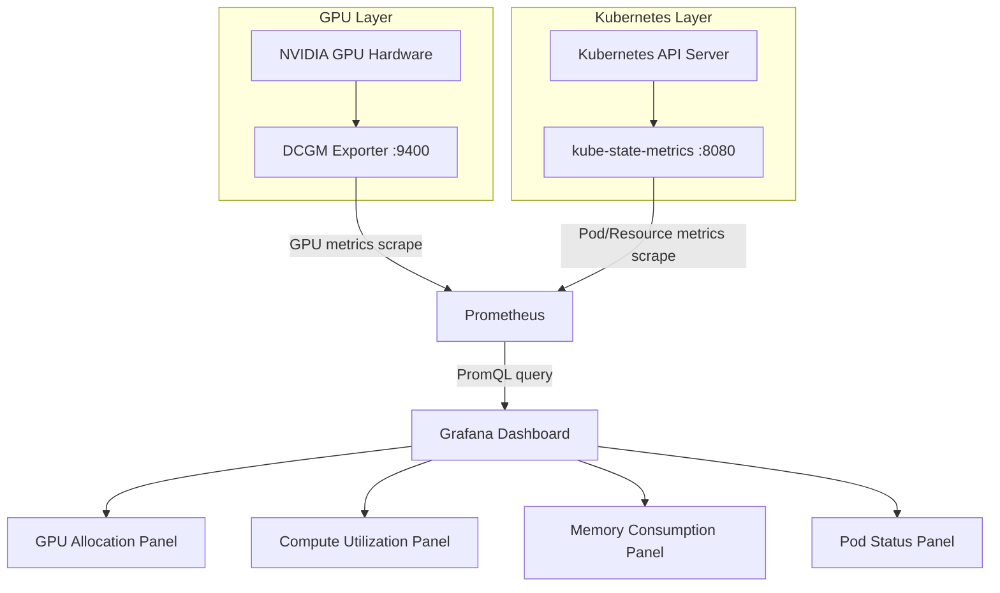

## ブログ概要（Summary）

本記事は [Get Real-Time Visibility into GPU Usage Across Kubernetes Clusters](https://developer.nvidia.com/blog/get-real-time-visibility-into-gpu-usage-across-kubernetes-clusters/)（NVIDIA Developer Blog, 2026年5月）の解説記事です。

Run:aiのSolutions Engineering担当ディレクターであるGuy Saltounが2026年5月に公開した本ブログは、KubernetesクラスタにおけるGPUリソースの可視性不足という課題に対し、オープンソースのGPU Usage Monitor（Apache 2.0ライセンス）を用いた解決策を提示している。DCGM Exporter・kube-state-metrics・Prometheus・Grafanaの4コンポーネントを統合し、名前空間別GPU割り当て、コンピュート使用率、Pod単位のメモリ消費、Running/Pending Pod数をリアルタイムで可視化する。Helmコマンド3つでデプロイが完了する点が特徴である。

この記事は [Zenn記事: OllamaをDocker Composeで本番運用する GPU割当・監視・認証の実践構成](https://zenn.dev/0h_n0/articles/ffeb63bfe214b6) の深掘りです。

## 情報源

- **種別**: 企業テックブログ（NVIDIA Developer Blog）
- **URL**: [https://developer.nvidia.com/blog/get-real-time-visibility-into-gpu-usage-across-kubernetes-clusters/](https://developer.nvidia.com/blog/get-real-time-visibility-into-gpu-usage-across-kubernetes-clusters/)
- **著者**: Guy Saltoun（Director of Solutions Engineering, Run:ai）
- **発表日**: 2026年5月21日

## 技術的背景（Technical Background）

GPUアクセラレーションを用いるKubernetesクラスタには、2つの構造的な問題が存在するとSaltounは指摘している。

**第一に、過剰プロビジョニングの問題**である。MLエンジニアはGPU競合を避けるために、モデルが実際に消費するリソースの30-50%しか使わない場合でもGPU全体をリクエストする傾向がある。これにより、高価なGPUハードウェアがアイドル状態で放置される。

**第二に、Podスケジューリングのボトルネック**である。GPUリクエストがキューに入っても、クラスタ全体でPending状態のPodがどれだけ存在するかを把握する手段がなく、訓練ジョブの停滞が発見されるのは往々にして遅い。Saltounは「Running GPUポッドとPending GPUポッドのクラスタ全体ビューがなければ、スケジューリングボトルネックは手遅れになってから発見されることが多い」と述べている。

標準的なKubernetesメトリクス（kube-state-metricsやnode-exporter）にはGPU固有のシグナルが欠けており、NVIDIAのData Center GPU Manager（DCGM）が提供するハードウェアレベルのテレメトリとKubernetesのリソース管理情報を統合する必要がある。この統合を低コストで実現するのがGPU Usage Monitorの目的である。

## 実装アーキテクチャ（Architecture）

### 4コンポーネント構成

GPU Usage Monitorは、GPU層とKubernetes層の2つのデータソースをPrometheusで集約し、Grafanaで可視化する4コンポーネント構成である。



各コンポーネントの役割をSaltounは以下のように説明している。

| コンポーネント | 役割 | データソース |
|---|---|---|
| DCGM Exporter | NVIDIA GPUのハードウェアメトリクスをHTTPエンドポイント（`:9400/metrics`）で公開する。GPU OperatorによるDaemonSetデプロイが推奨される | GPU温度、電力消費、SM/メモリクロック、VRAM使用量、GPU使用率 |
| kube-state-metrics | KubernetesのPod・リソース割り当て情報をメトリクスとして公開する | Pod状態（Running/Pending）、リソースリクエスト/リミット、名前空間情報 |
| Prometheus | 両ソースからメトリクスを定期的にスクレイプし、時系列データベースに保存する。Helm chartにはv27.45.0が同梱されている | DCGM Exporter + kube-state-metricsの全メトリクス |
| Grafana | 事前構築済みダッシュボードにより、GPU利用状況を可視化する。v10.1.4が同梱されている | Prometheusからの時系列クエリ結果 |

### DCGM Exporterの主要メトリクス

DCGM Exporterはデフォルト設定（`/etc/dcgm-exporter/default-counters.csv`）で以下のメトリクスを収集する。GPU Usage Monitorダッシュボードではこのうち主にVRAM使用量とGPU使用率が活用される。

| メトリクス名 | 説明 | 用途 |
|---|---|---|
| `DCGM_FI_DEV_GPU_UTIL` | GPU SM（Streaming Multiprocessor）使用率（%） | コンピュート使用率パネル |
| `DCGM_FI_DEV_FB_USED` | 使用中フレームバッファメモリ（MB） | メモリ消費パネル |
| `DCGM_FI_DEV_FB_FREE` | 空きフレームバッファメモリ（MB） | メモリ空き容量の算出 |
| `DCGM_FI_DEV_GPU_TEMP` | GPU温度（C） | ハードウェアヘルス監視 |
| `DCGM_FI_DEV_POWER_USAGE` | 消費電力（W） | 電力コスト見積もり |
| `DCGM_FI_DEV_SM_CLOCK` | SMクロック周波数（MHz） | スロットリング検知 |
| `DCGM_FI_DEV_MEM_CLOCK` | メモリクロック周波数（MHz） | メモリバンド幅の監視 |
| `DCGM_FI_PROF_GR_ENGINE_ACTIVE` | Graphics Engineアクティブ率 | プロファイリング |
| `DCGM_FI_PROF_PIPE_TENSOR_ACTIVE` | Tensor Coreアクティブ率 | 推論/訓練効率の計測 |
| `DCGM_FI_PROF_DRAM_ACTIVE` | DRAMアクティブ率 | メモリバンド幅飽和の検知 |
| `DCGM_FI_DEV_XID_ERRORS` | XIDエラー数 | ハードウェア障害の早期検知 |

カスタムメトリクスを追加する場合は、DCGM Exporterの`-f`フラグまたは`$DCGM_EXPORTER_COLLECTORS`環境変数でCSVファイルパスを指定する。

### Helmチャートデプロイ手順

Saltounが示すデプロイ手順は3つのHelmコマンドで完了する。

```bash
# 1. チャート依存関係の更新
helm dependency update

# 2. 専用名前空間にインストール
helm install gpu-usage-monitor . \
  --namespace gpu-usage-monitor \
  --create-namespace

# 3. Grafanaダッシュボードへのポートフォワード
kubectl port-forward \
  -n gpu-usage-monitor \
  svc/gpu-usage-monitor-grafana 3000:80
```

デフォルト認証情報は`admin/admin`でアクセスし、初回ログイン時にパスワード変更が求められる。

### Prometheus設定

GPU Usage MonitorのHelm chartにはPrometheusが同梱されているが、既存のPrometheusインフラと統合する場合は`prometheusUrl`パラメータで外部Prometheusのエンドポイントを指定する。DCGM Exporterのスクレイプ設定は以下のようになる。

```yaml
# prometheus.yml - DCGM Exporter scrape config
scrape_configs:
  - job_name: 'dcgm-exporter'
    kubernetes_sd_configs:
      - role: pod
    relabel_configs:
      - source_labels: [__meta_kubernetes_pod_label_app]
        regex: dcgm-exporter
        action: keep
      - source_labels: [__meta_kubernetes_namespace]
        target_label: namespace
      - source_labels: [__meta_kubernetes_pod_name]
        target_label: pod
    scrape_interval: 15s
    metrics_path: /metrics

  - job_name: 'kube-state-metrics'
    kubernetes_sd_configs:
      - role: service
    relabel_configs:
      - source_labels: [__meta_kubernetes_service_label_app_kubernetes_io_name]
        regex: kube-state-metrics
        action: keep
    scrape_interval: 30s
```

### Grafanaダッシュボードの主要パネルとPromQLクエリ

GPU Usage Monitorには事前構築済みのGrafanaダッシュボードが含まれている。以下は、ブログで紹介されている各パネルの機能と、それを実現するための代表的なPromQLクエリである。

**1. 名前空間別GPU割り当てパネル**

名前空間ごとに割り当て済みGPU数と未使用容量を追跡する。

```promql
# 名前空間別のGPUリクエスト合計
sum by (namespace) (
  kube_pod_container_resource_requests{resource="nvidia_com_gpu", unit="integer"}
)

# クラスタ全体のGPU容量
sum(kube_node_status_capacity{resource="nvidia_com_gpu"})
```

**2. コンピュート使用率ゲージ**

GPU別の使用率をゲージで表示し、閾値に応じて色分けする。Saltounのブログによると、80%以上が緑（効率的）、50-80%が黄（注意）、50%未満が赤（非効率）の3段階で表示される。

```promql
# GPU別の使用率（直近5分間の平均）
avg_over_time(DCGM_FI_DEV_GPU_UTIL{gpu=~"$gpu"}[5m])
```

**3. Pod単位メモリ消費パネル**

Pod単位でVRAM消費量を表示し、リソースのライトサイジング（適正化）判断に活用する。

```promql
# Pod別のGPUメモリ使用量（MB）
DCGM_FI_DEV_FB_USED{pod=~"$pod", namespace=~"$namespace"}
```

**4. Running vs Pending Podパネル**

GPUを要求するPodのRunning数とPending数を並べて表示する。Pending数の増加はスケジューリング圧力の早期指標となる。

```promql
# GPU要求PodのRunning数
count(kube_pod_status_phase{phase="Running"} *
  on(pod, namespace) kube_pod_container_resource_requests{resource="nvidia_com_gpu"})

# GPU要求PodのPending数
count(kube_pod_status_phase{phase="Pending"} *
  on(pod, namespace) kube_pod_container_resource_requests{resource="nvidia_com_gpu"})
```

**5. GPUタイプフィルタリング**

Hopper、Blackwell、Blackwell Ultraなど、GPUアーキテクチャ別にダッシュボードをフィルタリングできる。Saltounは「異種GPUフリートでは、GPUタイプによって適切なワークロードが異なるため、この機能が有用である」と述べている。

## Production Deployment Guide

### AWS実装パターン（EKS + GPU監視スタック）

GPU Usage Monitorをプロダクション環境で運用する場合のAWS構成を、クラスタ規模別に整理する。ブログで紹介されているアーキテクチャをAWSサービスにマッピングした構成である。

**トラフィック量別推奨構成**

| 構成 | クラスタ規模 | AWS構成 | 月額コスト概算 |
|---|---|---|---|
| Small | GPU 1-4台 | EKS + DCGM Exporter + 同梱Prometheus/Grafana | $400-800 |
| Medium | GPU 5-20台 | EKS + DCGM Exporter + Amazon Managed Prometheus + Amazon Managed Grafana | $1,200-3,000 |
| Large | GPU 20台以上 | EKS + DCGM Exporter + AMP + AMG + S3長期保存 + SNSアラート | $3,000-8,000 |

なお、上記コスト概算は2026年8月時点のAWS ap-northeast-1（東京）リージョン料金に基づく概算値であり、GPUインスタンス自体のコスト（p4d.24xlarge: 約$32.77/h等）は含まない。実際のコストはトラフィックパターン、リージョン、メトリクス収集量により変動するため、最新料金はAWS料金計算ツールで確認を推奨する。

**Small構成のポイント**: Helm chartに同梱されたPrometheus/Grafanaをそのまま使用する。メトリクスの長期保存は不要で、直近のリアルタイム監視が目的の場合に適する。EKS上のDCGM ExporterはGPU Operatorを通じてDaemonSetとしてデプロイする。

**Medium構成のポイント**: Amazon Managed Service for Prometheus（AMP）を使用することで、Prometheusの運用負荷（ストレージ管理、高可用性、バージョンアップ）をAWSに委譲する。Saltounのブログでも「既存のマネージドまたはセルフホストPrometheusインスタンスを持つ組織向け」に外部Prometheus統合が用意されていると紹介されている。

**Large構成のポイント**: メトリクスの長期保存にS3を活用し、Thanosまたはcortexによるストレージ階層化を検討する。SNSアラートとCloudWatch連携により、GPU使用率低下やPending Pod増加を即座に検知する体制を構築する。

### Terraformインフラコード

#### Small構成（EKS + GPU Operator + GPU Usage Monitor）

```hcl
# EKSクラスタ + GPUノードグループ + GPU Usage Monitor

terraform {
  required_version = ">= 1.9"
  required_providers {
    aws = {
      source  = "hashicorp/aws"
      version = "~> 5.60"
    }
    helm = {
      source  = "hashicorp/helm"
      version = "~> 2.15"
    }
    kubernetes = {
      source  = "hashicorp/kubernetes"
      version = "~> 2.32"
    }
  }
}

provider "aws" {
  region = "ap-northeast-1"
}

# --- VPC ---
module "vpc" {
  source  = "terraform-aws-modules/vpc/aws"
  version = "~> 5.13"

  name = "gpu-monitor-vpc"
  cidr = "10.0.0.0/16"

  azs             = ["ap-northeast-1a", "ap-northeast-1c"]
  private_subnets = ["10.0.1.0/24", "10.0.2.0/24"]
  public_subnets  = ["10.0.101.0/24", "10.0.102.0/24"]

  enable_nat_gateway   = true
  single_nat_gateway   = true  # コスト削減: 単一NAT Gateway
  enable_dns_hostnames = true

  tags = {
    Environment = "gpu-monitoring"
  }
}

# --- EKSクラスタ ---
module "eks" {
  source  = "terraform-aws-modules/eks/aws"
  version = "~> 20.24"

  cluster_name    = "gpu-monitor-cluster"
  cluster_version = "1.31"

  vpc_id     = module.vpc.vpc_id
  subnet_ids = module.vpc.private_subnets

  # コントロールプレーンのみマネージド
  cluster_endpoint_public_access = true

  eks_managed_node_groups = {
    # システムノード（Prometheus/Grafana用）
    system = {
      instance_types = ["m6i.large"]  # 2 vCPU, 8GB RAM
      min_size       = 2
      max_size       = 3
      desired_size   = 2

      labels = {
        role = "system"
      }
    }

    # GPUノード（推論/訓練ワークロード用）
    gpu = {
      instance_types = ["g5.xlarge"]  # 1x A10G, 4 vCPU, 16GB RAM
      min_size       = 1
      max_size       = 4
      desired_size   = 1
      ami_type       = "AL2_x86_64_GPU"

      labels = {
        role                            = "gpu"
        "nvidia.com/gpu.present"        = "true"
      }

      taints = {
        gpu = {
          key    = "nvidia.com/gpu"
          value  = "true"
          effect = "NO_SCHEDULE"
        }
      }
    }
  }

  tags = {
    Environment = "gpu-monitoring"
  }
}

# --- NVIDIA GPU Operator（DCGM Exporter含む） ---
resource "helm_release" "gpu_operator" {
  name       = "gpu-operator"
  repository = "https://helm.ngc.nvidia.com/nvidia"
  chart      = "gpu-operator"
  version    = "v24.9.0"
  namespace  = "gpu-operator"
  create_namespace = true

  set {
    name  = "dcgmExporter.enabled"
    value = "true"
  }

  set {
    name  = "toolkit.enabled"
    value = "true"
  }

  depends_on = [module.eks]
}

# --- GPU Usage Monitor ---
resource "helm_release" "gpu_usage_monitor" {
  name       = "gpu-usage-monitor"
  repository = "https://nvidia.github.io/gpu-usage-monitor"
  chart      = "gpu-usage-monitor"
  namespace  = "gpu-usage-monitor"
  create_namespace = true

  # Grafanaリソース設定
  set {
    name  = "grafana.resources.requests.cpu"
    value = "250m"
  }

  set {
    name  = "grafana.resources.requests.memory"
    value = "256Mi"
  }

  # Prometheusリソース設定
  set {
    name  = "prometheus.server.resources.requests.cpu"
    value = "500m"
  }

  set {
    name  = "prometheus.server.resources.requests.memory"
    value = "512Mi"
  }

  # メトリクス保持期間（Small構成: 7日間）
  set {
    name  = "prometheus.server.retention"
    value = "7d"
  }

  depends_on = [helm_release.gpu_operator]
}
```

#### Large構成（EKS + Amazon Managed Prometheus + Amazon Managed Grafana）

```hcl
# --- Amazon Managed Service for Prometheus ---
resource "aws_prometheus_workspace" "gpu_metrics" {
  alias = "gpu-usage-metrics"

  logging_configuration {
    log_group_arn = "${aws_cloudwatch_log_group.amp_logs.arn}:*"
  }

  tags = {
    Environment = "gpu-monitoring-production"
  }
}

resource "aws_cloudwatch_log_group" "amp_logs" {
  name              = "/aws/amp/gpu-usage-metrics"
  retention_in_days = 30  # ログ保持30日でコスト最適化
}

# --- AMP用IAMロール（最小権限） ---
resource "aws_iam_role" "amp_ingest" {
  name = "amp-gpu-metrics-ingest"

  assume_role_policy = jsonencode({
    Version = "2012-10-17"
    Statement = [{
      Effect = "Allow"
      Principal = {
        Federated = module.eks.oidc_provider_arn
      }
      Action = "sts:AssumeRoleWithWebIdentity"
      Condition = {
        StringEquals = {
          "${module.eks.oidc_provider}:sub" = "system:serviceaccount:gpu-usage-monitor:prometheus-server"
        }
      }
    }]
  })
}

resource "aws_iam_role_policy" "amp_write" {
  name = "amp-remote-write"
  role = aws_iam_role.amp_ingest.id

  policy = jsonencode({
    Version = "2012-10-17"
    Statement = [{
      Effect = "Allow"
      Action = [
        "aps:RemoteWrite",
        "aps:GetSeries",
        "aps:GetLabels",
        "aps:GetMetricMetadata"
      ]
      Resource = aws_prometheus_workspace.gpu_metrics.arn
    }]
  })
}

# --- GPU Usage Monitor（外部Prometheus統合） ---
resource "helm_release" "gpu_usage_monitor_large" {
  name       = "gpu-usage-monitor"
  repository = "https://nvidia.github.io/gpu-usage-monitor"
  chart      = "gpu-usage-monitor"
  namespace  = "gpu-usage-monitor"
  create_namespace = true

  # 外部Prometheus（AMP）を使用
  set {
    name  = "prometheusUrl"
    value = aws_prometheus_workspace.gpu_metrics.prometheus_endpoint
  }

  # 内蔵Prometheusを無効化
  set {
    name  = "prometheus.enabled"
    value = "false"
  }

  # Grafanaリソース（Large構成向け）
  set {
    name  = "grafana.resources.requests.cpu"
    value = "500m"
  }

  set {
    name  = "grafana.resources.requests.memory"
    value = "1Gi"
  }

  depends_on = [helm_release.gpu_operator]
}

# --- SNSアラート ---
resource "aws_sns_topic" "gpu_alerts" {
  name = "gpu-usage-alerts"

  tags = {
    Environment = "gpu-monitoring-production"
  }
}

resource "aws_sns_topic_subscription" "email_alert" {
  topic_arn = aws_sns_topic.gpu_alerts.arn
  protocol  = "email"
  endpoint  = "ops-team@example.com"
}

# --- CloudWatch アラーム: EKS GPU ノード異常 ---
resource "aws_cloudwatch_metric_alarm" "gpu_node_unhealthy" {
  alarm_name          = "gpu-node-unhealthy"
  comparison_operator = "LessThanThreshold"
  evaluation_periods  = 2
  metric_name         = "node_count"
  namespace           = "ContainerInsights"
  period              = 300
  statistic           = "Average"
  threshold           = 1
  alarm_description   = "GPU node count dropped below 1"
  alarm_actions       = [aws_sns_topic.gpu_alerts.arn]

  dimensions = {
    ClusterName = "gpu-monitor-cluster"
  }
}

# --- AWS Budgets: GPU コスト上限 ---
resource "aws_budgets_budget" "gpu_monthly" {
  name         = "gpu-monitoring-monthly"
  budget_type  = "COST"
  limit_amount = "5000"
  limit_unit   = "USD"
  time_unit    = "MONTHLY"

  notification {
    comparison_operator       = "GREATER_THAN"
    threshold                 = 80
    threshold_type            = "PERCENTAGE"
    notification_type         = "FORECASTED"
    subscriber_email_addresses = ["ops-team@example.com"]
  }

  notification {
    comparison_operator       = "GREATER_THAN"
    threshold                 = 100
    threshold_type            = "PERCENTAGE"
    notification_type         = "ACTUAL"
    subscriber_email_addresses = ["ops-team@example.com"]
  }
}
```

### 運用・監視設定

#### CloudWatch Logs Insights クエリ

```sql
-- GPU使用率が30%未満のノードを検出（過剰プロビジョニング検知）
fields @timestamp, gpu_id, namespace, pod, gpu_util
| filter gpu_util < 30
| stats count(*) as low_util_count by namespace, gpu_id
| sort low_util_count desc

-- Pending Podの増加傾向（スケジューリング圧力の検知）
fields @timestamp, pending_count
| filter metric_name = "kube_pod_status_phase" and phase = "Pending"
| stats max(pending_count) as peak_pending by bin(1h)
| sort @timestamp desc
```

#### Prometheusアラートルール

GPU Usage Monitorのメトリクスに基づくアラートルールの設定例を以下に示す。

```yaml
# prometheus-alerts.yaml
groups:
  - name: gpu-usage-alerts
    rules:
      # GPU使用率が1時間以上30%未満（過剰プロビジョニング警告）
      - alert: GPUUnderutilized
        expr: avg_over_time(DCGM_FI_DEV_GPU_UTIL[1h]) < 30
        for: 1h
        labels:
          severity: warning
        annotations:
          summary: "GPU {{ $labels.gpu }} utilization below 30%"
          description: "GPU {{ $labels.gpu }} on node {{ $labels.node }} has been underutilized for over 1 hour. Consider right-sizing the workload."

      # GPU メモリ使用率90%超過（OOM リスク）
      - alert: GPUMemoryHigh
        expr: >
          (DCGM_FI_DEV_FB_USED / (DCGM_FI_DEV_FB_USED + DCGM_FI_DEV_FB_FREE)) * 100 > 90
        for: 10m
        labels:
          severity: critical
        annotations:
          summary: "GPU {{ $labels.gpu }} memory usage above 90%"

      # Pending GPU Pod数が5以上（スケジューリング圧力）
      - alert: GPUPodSchedulingPressure
        expr: >
          count(kube_pod_status_phase{phase="Pending"} *
            on(pod, namespace) kube_pod_container_resource_requests{resource="nvidia_com_gpu"}) > 5
        for: 15m
        labels:
          severity: warning
        annotations:
          summary: "{{ $value }} GPU pods pending for over 15 minutes"

      # GPU温度異常（85C超過）
      - alert: GPUTemperatureHigh
        expr: DCGM_FI_DEV_GPU_TEMP > 85
        for: 5m
        labels:
          severity: critical
        annotations:
          summary: "GPU {{ $labels.gpu }} temperature {{ $value }}C exceeds 85C threshold"

      # XIDエラー検知（ハードウェア障害の早期警告）
      - alert: GPUXidError
        expr: increase(DCGM_FI_DEV_XID_ERRORS[5m]) > 0
        labels:
          severity: critical
        annotations:
          summary: "XID error detected on GPU {{ $labels.gpu }}"
          description: "Hardware error indicator. Investigate immediately."
```

#### Cost Explorer自動レポート（Python）

```python
"""GPU関連AWSコストの日次レポート生成"""
import datetime
import json

import boto3


def get_gpu_cost_report(days_back: int = 1) -> dict:
    """直近のGPU関連コストを取得する.

    Args:
        days_back: 遡る日数

    Returns:
        サービス別コスト辞書
    """
    ce = boto3.client("ce", region_name="ap-northeast-1")
    end = datetime.date.today()
    start = end - datetime.timedelta(days=days_back)

    response = ce.get_cost_and_usage(
        TimePeriod={
            "Start": start.isoformat(),
            "End": end.isoformat(),
        },
        Granularity="DAILY",
        Metrics=["UnblendedCost"],
        Filter={
            "Or": [
                {"Dimensions": {"Key": "SERVICE", "Values": ["Amazon Elastic Kubernetes Service"]}},
                {"Dimensions": {"Key": "SERVICE", "Values": ["Amazon Managed Service for Prometheus"]}},
                {"Dimensions": {"Key": "SERVICE", "Values": ["Amazon Managed Grafana"]}},
                {"Dimensions": {"Key": "SERVICE", "Values": ["Amazon Elastic Compute Cloud - Compute"]}},
            ]
        },
        GroupBy=[{"Type": "DIMENSION", "Key": "SERVICE"}],
    )

    costs: dict[str, float] = {}
    for result in response["ResultsByTime"]:
        for group in result["Groups"]:
            service = group["Keys"][0]
            amount = float(group["Metrics"]["UnblendedCost"]["Amount"])
            costs[service] = costs.get(service, 0.0) + amount

    return costs


def send_alert_if_threshold_exceeded(
    costs: dict[str, float],
    threshold_usd: float = 200.0,
) -> None:
    """日次コストが閾値を超過した場合にSNS通知する.

    Args:
        costs: サービス別コスト辞書
        threshold_usd: アラート閾値（USD/日）
    """
    total = sum(costs.values())
    if total <= threshold_usd:
        return

    sns = boto3.client("sns", region_name="ap-northeast-1")
    message = json.dumps(
        {
            "alert": "GPU monitoring daily cost exceeded threshold",
            "total_usd": round(total, 2),
            "threshold_usd": threshold_usd,
            "breakdown": {k: round(v, 2) for k, v in costs.items()},
        },
        indent=2,
    )
    sns.publish(
        TopicArn="arn:aws:sns:ap-northeast-1:123456789012:gpu-usage-alerts",
        Subject=f"GPU Cost Alert: ${total:.2f}/day (threshold: ${threshold_usd:.2f})",
        Message=message,
    )
```

### コスト最適化チェックリスト

#### アーキテクチャ選択

- [ ] GPU 1-4台: Helm chart同梱のPrometheus/Grafanaを使用し、マネージドサービスのコストを回避する
- [ ] GPU 5-20台: Amazon Managed Prometheus（AMP）に移行し、Prometheusの運用コストを削減する
- [ ] GPU 20台以上: AMP + S3長期保存 + Thanosによるメトリクス階層化を検討する

#### リソース最適化

- [ ] GPUノード: Spot Instancesを訓練ワークロードに使用（最大90%削減、p4d Spotで約$9.83/h）
- [ ] Reserved Instances: 推論用常時稼働GPUノードに1年RIを適用（最大40%削減）
- [ ] Savings Plans: Compute Savings Plansで柔軟性を確保しつつ割引を適用する
- [ ] システムノード: Graviton（m7g系）に変更しコスト効率を改善する（約20%削減）
- [ ] Karpenter導入: GPU/非GPUノードの自動スケーリングでアイドルノードを最小化する
- [ ] EKS: 不要な時間帯はGPUノードグループのdesired_sizeを0にスケールダウンする

#### 監視スタックコスト削減

- [ ] Prometheusスクレイプ間隔: 15秒→30秒に延長しメトリクス量を半減（監視精度とのトレードオフを評価）
- [ ] メトリクス保持期間: Small構成では7日間に制限する
- [ ] 不要メトリクス除外: DCGM Exporterのカスタムメトリクスファイルで必要メトリクスのみ収集する
- [ ] Grafanaセッション管理: 不要なダッシュボードの自動リフレッシュを無効化する

#### 監視・アラート

- [ ] AWS Budgets: GPU関連サービスの月額予算上限を設定する
- [ ] CloudWatchアラーム: GPUノード数減少の検知を設定する
- [ ] Cost Anomaly Detection: 有効化して異常支出を自動検知する
- [ ] 日次コストレポート: Cost Explorer APIで日次コストをSlack/メール通知する
- [ ] Prometheusアラート: GPU低使用率・メモリ逼迫・Pending Pod増加のアラートを設定する

#### リソース管理

- [ ] タグ戦略: `Environment`, `Team`, `Project`タグを全リソースに付与する
- [ ] 未使用GPUノード: 定期的に`DCGM_FI_DEV_GPU_UTIL`が0%のノードを特定し削除する
- [ ] ログ保持: CloudWatch Logsの保持期間を30日に設定する
- [ ] 開発環境: 平日日中のみGPUノードを起動する（夜間・週末停止で約60%削減）
- [ ] EBSボリューム: GPUノードの不要なEBSスナップショットにライフサイクルポリシーを適用する

## パフォーマンス最適化（Performance）

### メトリクス収集のオーバーヘッド

DCGM Exporterのメトリクス収集は、GPU側のパフォーマンスへの影響が小さい設計となっている。DCGM（Data Center GPU Manager）はNVIDIAドライバ内蔵のテレメトリインターフェースを利用してメトリクスを取得するため、ユーザーワークロードの推論・訓練処理に対する干渉は最小限である。

ただし、スクレイプ間隔の設定は監視スタック側のリソース消費に影響する。デフォルトの15秒間隔では、100台のGPUノード x 15メトリクス/GPU = 1500メトリクスが15秒ごとに収集される。メトリクスの保持期間とスクレイプ間隔の組み合わせにより、Prometheusのストレージ要件は以下のように変動する。

$$
\text{Storage (bytes/day)} = N_{\text{gpu}} \times N_{\text{metrics}} \times \frac{86400}{T_{\text{scrape}}} \times S_{\text{sample}}
$$

ここで、$N_{\text{gpu}}$: GPUノード数、$N_{\text{metrics}}$: メトリクス数/GPU、$T_{\text{scrape}}$: スクレイプ間隔（秒）、$S_{\text{sample}}$: サンプルあたりのストレージサイズ（Prometheusでは約1-2バイト/圧縮後サンプル）である。

例えば50台のGPUノード、15メトリクス、15秒間隔の場合、1日あたり約4,320,000サンプル（圧縮後約4-8MB/日）となる。Prometheusの圧縮効率は高いため、ストレージ自体は問題になりにくいが、クエリ時のカーディナリティ（ラベルの組み合わせ数）がダッシュボードのレスポンス時間に影響する点に注意が必要である。

### スクレイプ間隔の最適化

Saltounのブログでは明示的なスクレイプ間隔の推奨は述べられていないが、一般的なGPU監視では以下の使い分けが有効である。

| ユースケース | 推奨間隔 | 理由 |
|---|---|---|
| リアルタイム推論監視 | 10-15秒 | レイテンシ異常の即座検知が必要 |
| 訓練ジョブ監視 | 30-60秒 | 長時間ジョブのため秒単位の精度は不要 |
| コスト最適化レポート | 5分 | 日次/週次レポート目的では粗い粒度で十分 |

## 運用での学び（Operational Insights）

### アラート閾値の設計

GPU Usage Monitorのダッシュボードが採用する使用率ゲージの閾値（80%以上=緑、50-80%=黄、50%未満=赤）は、GPU利用効率の目安として有用であるが、ワークロードの特性により適切な閾値は異なる。

**推論ワークロード**: バッチサイズとモデルサイズが固定であるため、GPU使用率は比較的安定する。定常状態の使用率をベースラインとして計測し、そこから20%以上乖離した場合にアラートを発報する設計が実用的である。

**訓練ワークロード**: Data LoaderのI/OボトルネックやGradient Accumulationにより、GPU使用率が周期的に変動する。瞬間的な使用率低下でアラートが発報されないよう、`avg_over_time`で5分以上の平均値を評価対象にすべきである。

### ダッシュボード設計の考慮点

Saltounが強調しているダッシュボードの設計思想は「名前空間別の可視性」である。Kubernetesにおいて名前空間はチームやプロジェクトの境界を表すため、名前空間単位でGPU割り当てを追跡することで、チーム間のリソース配分の公平性やコスト按分の根拠データを得ることができる。

また、Running vs Pending Podの比率を常時表示することで、GPUリソースの需給バランスを定量的に把握できる。Pending数が継続的に増加している場合は、GPUノードの追加（スケールアウト）またはワークロードの優先度調整が必要である。

### Docker Compose環境との関連

Zenn記事で構築したDocker Compose + DCGM Exporter + Prometheusの監視構成は、GPU Usage Monitorのコンポーネント構成と本質的に同じアーキテクチャである。Zenn記事がシングルノード環境でのGPU監視にフォーカスしているのに対し、GPU Usage Monitorはこれをマルチノード・マルチ名前空間のKubernetes環境にスケールアウトしたものといえる。Docker Compose環境で習得したDCGMメトリクスやPromQLクエリの知識は、Kubernetes環境に移行した際にもそのまま活用できる。

## 学術研究との関連（Academic Context）

GPU Usage Monitorが活用するDCGM（Data Center GPU Manager）は、NVIDIAのGPUテレメトリインフラストラクチャであり、データセンター向けGPU管理の標準ツールとして広く利用されている。学術分野では、GPUクラスタのリソーススケジューリングに関する研究（Xiao et al., 2018 "Gandiva: Introspective Cluster Scheduling for Deep Learning"など）において、GPU使用率メトリクスをフィードバックとしたスケジューリング最適化が提案されている。GPU Usage Monitorが提供するPending Pod数とGPU使用率の組み合わせは、こうしたスケジューリング研究で用いられるメトリクスと一致する。

また、GPUクラスタの利用効率に関する実態調査（Jeon et al., 2019 "Analysis of Large-Scale Multi-Tenant GPU Clusters for DNN Training Workloads"）では、GPU使用率の中央値が約50%にとどまることが報告されている。Saltounが指摘する「30-50%の過少利用」はこうした調査結果と整合しており、可視化ツールの必要性を学術的にも裏付けている。

## まとめと実践への示唆

Saltounのブログは、KubernetesにおけるGPU監視の課題を明確に定義し、DCGM Exporter・kube-state-metrics・Prometheus・Grafanaの4コンポーネントを統合したGPU Usage Monitor（Apache 2.0、GitHub: [NVIDIA/gpu-usage-monitor](https://github.com/NVIDIA/gpu-usage-monitor)）による解決策を提示している。3つのHelmコマンドでデプロイが完了し、名前空間別GPU割り当て・使用率ゲージ・Pod別メモリ消費・Running/Pending Pod比率の4つの視点でGPU利用状況を即座に把握できる点が最大の特徴である。Zenn記事で構築したDocker Compose環境のGPU監視を、Kubernetes規模にスケールアウトする際の参考として有用である。

## 参考文献

- Saltoun, G., "Get Real-Time Visibility into GPU Usage Across Kubernetes Clusters," NVIDIA Developer Blog, May 2026. [https://developer.nvidia.com/blog/get-real-time-visibility-into-gpu-usage-across-kubernetes-clusters/](https://developer.nvidia.com/blog/get-real-time-visibility-into-gpu-usage-across-kubernetes-clusters/)
- NVIDIA GPU Usage Monitor (GitHub). [https://github.com/NVIDIA/gpu-usage-monitor](https://github.com/NVIDIA/gpu-usage-monitor)
- NVIDIA DCGM Exporter Documentation. [https://docs.nvidia.com/datacenter/cloud-native/gpu-telemetry/latest/dcgm-exporter.html](https://docs.nvidia.com/datacenter/cloud-native/gpu-telemetry/latest/dcgm-exporter.html)
- Xiao, W. et al., "Gandiva: Introspective Cluster Scheduling for Deep Learning," OSDI 2018. [https://www.usenix.org/conference/osdi18/presentation/xiao](https://www.usenix.org/conference/osdi18/presentation/xiao)
- Jeon, M. et al., "Analysis of Large-Scale Multi-Tenant GPU Clusters for DNN Training Workloads," USENIX ATC 2019. [https://www.usenix.org/conference/atc19/presentation/jeon](https://www.usenix.org/conference/atc19/presentation/jeon)
- Zenn記事: OllamaをDocker Composeで本番運用する GPU割当・監視・認証の実践構成. [https://zenn.dev/0h_n0/articles/ffeb63bfe214b6](https://zenn.dev/0h_n0/articles/ffeb63bfe214b6)
