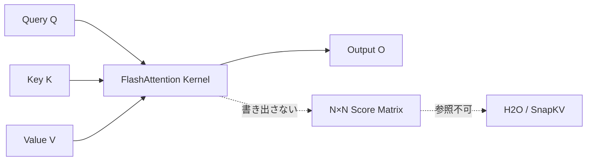
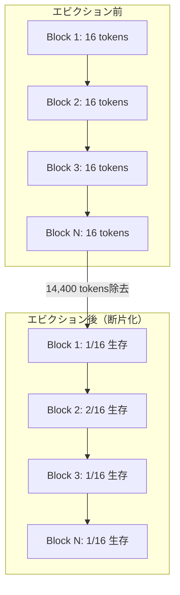
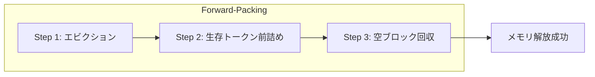

## ブログ概要（Summary）

本記事は [https://research.nvidia.com/labs/eai/blogs/kv-cache-compression-and-its-infra-problems/](https://research.nvidia.com/labs/eai/blogs/kv-cache-compression-and-its-infra-problems/) の解説記事です。

NVIDIA Research / MIT の Weian Mao、Yukang Chen、Wei Huang、Shuai Yang、Luozhou Wang、Song Han らが2026年6月に公開した本ブログは、LLM推論におけるKVキャッシュ圧縮を本番インフラで実装する際に直面する2つの構造的課題を分析し、それらを同時に解決するTriAttentionという手法を提案している。Qwen3-32Bのような4ビット量子化モデルであっても24GB GPUでは約24,000トークンでメモリが枯渇するという問題に対し、TriAttentionは3,072トークンのKVキャッシュ予算でフルアテンションと同等の精度を維持しつつ、2.5倍のスループットと10.7倍のKVメモリ削減を達成したと報告されている。

この記事は [Zenn記事: OllamaをDocker Composeで本番運用する GPU割当・監視・認証の実践構成](https://zenn.dev/0h_n0/articles/ffeb63bfe214b6) の深掘りです。Zenn記事で使用している`OLLAMA_KV_CACHE_TYPE=q8_0`のKVキャッシュ量子化は、本ブログが扱うKVキャッシュ圧縮のインフラ課題と深く関連する。

## 情報源

- **種別**: 企業テックブログ（NVIDIA Research）
- **URL**: [https://research.nvidia.com/labs/eai/blogs/kv-cache-compression-and-its-infra-problems/](https://research.nvidia.com/labs/eai/blogs/kv-cache-compression-and-its-infra-problems/)
- **組織**: NVIDIA Research / MIT
- **著者**: Weian Mao, Yukang Chen, Wei Huang, Shuai Yang, Luozhou Wang, Song Han
- **発表日**: 2026年6月12日
- **コード**: [https://github.com/WeianMao/triattention](https://github.com/WeianMao/triattention)

## 技術的背景（Technical Background）

LLMの推論において、各トークンのKey（K）とValue（V）は一度計算された後にGPUメモリに保存され、以降のトークン生成時に再利用される。この仕組みがKVキャッシュである。KVキャッシュは生成されるトークン数に比例して線形に増大し、すべてのTransformerレイヤーにわたって新しいKとVの行が追加される。

著者らのブログによれば、GPUメモリはモデルの重みとランタイムに一定量が消費され、残りの領域をKVキャッシュが占有する。Qwen3-32Bを4ビット量子化した状態でも、24GB GPUでは約24,000トークン生成後にメモリが枯渇する。これは推論モデルが日常的に生成する32Kトークンの長い思考トレースには不十分な値である。

KVキャッシュのメモリ消費を削減する手法として、トークンエビクション（重要度の低いトークンのKVをキャッシュから除去する）が研究されている。StreamingLLMは「Attention Sink」トークンとスライディングウィンドウを保持して残りを除去する手法であり、H2Oは各トークンが受けたアテンションの累積和に基づいて重要度を判定する。しかし著者らは、これらの手法を本番推論インフラに実装しようとすると、2つの構造的な障壁に直面すると指摘している。

## 実装アーキテクチャ（Architecture）

### 問題1: FlashAttentionによるアテンションスコアの不可視性

本番推論ではFlashAttentionが標準的に使用されている。FlashAttentionはアテンション計算をGPUのSRAM（高速オンチップメモリ）上でタイル分割して実行し、$N \times N$のスコア行列をHBM（GPUメインメモリ）に書き出さない。これにより計算効率は大幅に向上するが、アテンションスコアそのものにはアクセスできなくなる。



H2Oのようなアテンション累積スコアに基づくエビクション手法は、この完全なアテンション履歴を必要とする。著者らによれば、H2Oのリファレンス実装はこの非互換性を解決するために、FlashAttentionを放棄してeager attention（フルスコア行列を展開する標準的なアテンション実装）にフォールバックしている。これにより、FlashAttentionが提供するメモリ効率と計算速度の利点が失われる。

SnapKVのような「観測ウィンドウ」方式は、直近$W$トークンのアテンションスコアのみを参照することでFlashAttentionとの部分的な互換性を確保する。しかし著者らは、RoPE位置エンコーディングにより「モデルが実際にアテンドしている位置を反映するのは、経験的に直近約25クエリのみ」であると報告しており、観測ウィンドウサイズが制限される。

### 問題2: ページドメモリの断片化

vLLMに代表される本番推論フレームワークは、PagedAttentionによってGPUメモリを固定サイズの物理ブロック（各ブロックは約16トークン分のKVデータを保持）に分割管理している。ブロックは完全に空になった場合にのみ解放される。

著者らは以下の具体的なシナリオを示している。16,000トークンのうち14,400トークンをエビクションした場合、生存トークンが約1,000ブロックに散在し、ほぼすべてのブロックに少なくとも1つの生存トークンが残る。この結果、メモリアロケータはほぼ何も回収できない。



著者らはR-KV（推論モデル専用に設計されたエビクション手法）について、90%のメモリ削減を報告しているが、この数値は事前確保された連続テンソルで測定されたものであり、vLLM環境では同等の削減が実現しないと指摘している。

## TriAttentionの解決手法（TriAttention Solution）

### Pre-RoPEジオメトリによる重要度予測

TriAttentionの核心は、問いの立て方そのものを転換する点にある。従来の「どのトークンが最近高いアテンションを受けたか」という問いから、「モデルの学習済みQ/Kベクトルの幾何学的性質から、トークンの重要性を予測できるか」という問いへの転換である。

著者らによれば、TriAttentionはRoPE適用前のQ/Kベクトルの安定した幾何学的特性に基づいてトークンの重要度を判定する。RoPEは位置に依存した回転を加えるため、RoPE適用後のベクトルは位置によって変化するが、RoPE適用前のベクトルはトークンの意味的な表現をより安定して反映する。この性質を利用することで、アテンションスコアを一切観測せずにトークンの重要度を推定できる。

数式で表現すると、標準的なアテンション計算では：

$$
\text{Attn}(Q, K, V) = \text{softmax}\left(\frac{Q K^T}{\sqrt{d_k}}\right) V
$$

ここで$Q$と$K$にはRoPEが適用される。TriAttentionはRoPE適用前の$Q_{\text{pre}}$と$K_{\text{pre}}$の内積空間での幾何学的関係から、各トークンの重要度スコアを計算する。これにより：

1. FlashAttention内部のアテンションスコアにアクセスする必要がなくなる（問題1の解決）
2. 重要度判定がFlashAttentionのカーネル外で完結するため、既存の推論パイプラインとの互換性を維持できる

### Forward-Packing Compaction

KVキャッシュの断片化問題（問題2）に対して、TriAttentionはForward-Packing Compactionを導入している。これは約128デコードトークンごとに実行されるコンパクション操作で、2つの戦略が提案されている。

**Order-Preserving Repack**は、生存トークンを元のトークン順序を維持しながら前方にスライドさせる方式である。例えばブロック6の全トークンがエビクションされた場合、ブロック6は完全に空になりアロケータに返却される。

**Hole-Filling**は、新しいラウンドのトークンをエビクションで生じた穴に直接配置する方式である。著者らによれば、この方式ではデータ移動が大幅に削減され、例として「18コピーの代わりに3コピー」で済むケースが報告されている。



約128トークンごとのコンパクション頻度は、コンパクションのオーバーヘッドとメモリ回収効率のトレードオフに基づいて選択されている。

## パフォーマンス最適化（Performance）

著者らはAIMEベンチマーク（数学推論タスク）における各手法の精度比較を報告している。

**精度比較（2,048トークンKVキャッシュ予算）**:

| 手法 | AIME 2024 | AIME 2025 |
|---|---|---|
| Full Attention（上限） | 57.1% | 40.8% |
| SnapKV | 34.6% | 20.0% |
| R-KV | 25.4% | 17.5% |
| TriAttention | 42.1% | 32.9% |

TriAttentionはSnapKVやR-KVと比較して、いずれのベンチマークでも高い精度を維持している。ただしFull Attentionとの差は存在しており、2,048トークン予算ではAIME 2024で15ポイント、AIME 2025で7.9ポイントの精度低下がある点に留意が必要である。

**精度一致時の性能（AIME 2025、3,072トークン予算）**:

3,072トークンのKVキャッシュ予算では、TriAttentionはFull Attentionの40.8%と同等の精度を達成している。この条件下での性能指標は以下の通りである。

| 指標 | Full Attention | TriAttention | 改善率 |
|---|---|---|---|
| スループット | 222.8 tokens/sec | 563.5 tokens/sec | 2.5倍 |
| KVキャッシュメモリ | 100%（ベースライン） | 9.3% | 10.7倍削減 |

MATH500ベンチマークでは、Full Attentionの69.6%に対しTriAttentionは56.0%であり、タスクによっては精度低下が大きくなる場合もある。

## Production Deployment Guide

NVIDIA ResearchのKVキャッシュ圧縮知見をAWS上のLLM推論インフラに適用するためのガイドである。

### AWS実装パターン（KVキャッシュ圧縮対応）

**トラフィック量別の推奨構成**:

| 項目 | Small (~50 req/日) | Medium (~500 req/日) | Large (5000+ req/日) |
|---|---|---|---|
| 構成 | EC2 g5.xlarge + Ollama | ECS Fargate + vLLM | EKS + vLLM (Spot) |
| KVキャッシュ戦略 | OLLAMA_KV_CACHE_TYPE=q8_0 | vLLM --kv-cache-dtype fp8 | TriAttention統合 |
| GPU | A10G 24GB (1台) | A10G 24GB (2-4台) | A10G/H100 (4-16台) |
| 最大コンテキスト長 | ~24K tokens | ~48K tokens | ~128K tokens |
| 監視 | CloudWatch基本 | Prometheus + Grafana | Prometheus + Grafana + カスタムメトリクス |
| 月額概算 | $400-800 | $1,500-3,000 | $8,000-20,000 |

**コスト削減テクニック**: Spot Instances活用で最大90%削減、Reserved Instances 1年コミットで最大72%削減、KVキャッシュ量子化(q8_0/fp8)でコンテキスト長2倍（GPU追加不要）、TriAttention導入でKVメモリ10.7倍削減。

**注意**: 上記は2026年8月時点のAWS ap-northeast-1料金に基づく概算値。トラフィックパターンやリージョンにより変動するため、AWS Pricing Calculatorでの確認を推奨する。

### Terraformインフラコード

**Small構成: EC2 + Ollama + KVキャッシュ量子化**

```hcl
# Small構成: EC2 g5.xlarge + Ollama (KVキャッシュ量子化対応)
# 関連Zenn記事の構成をAWSに展開するパターン

terraform {
  required_version = ">= 1.9"
  required_providers {
    aws = { source = "hashicorp/aws", version = "~> 5.60" }
  }
}

provider "aws" { region = "ap-northeast-1" }

# --- Security Group ---
resource "aws_security_group" "ollama" {
  name        = "ollama-inference-sg"
  description = "Ollama inference server security group"
  vpc_id      = var.vpc_id

  ingress {
    from_port   = 11434
    to_port     = 11434
    protocol    = "tcp"
    cidr_blocks = [var.allowed_cidr]
    description = "Ollama API"
  }

  egress {
    from_port   = 0
    to_port     = 0
    protocol    = "-1"
    cidr_blocks = ["0.0.0.0/0"]
  }
}

# --- EC2: Ollama GPU Instance ---
resource "aws_instance" "ollama" {
  ami           = data.aws_ami.deep_learning.id
  instance_type = "g5.xlarge"  # A10G 24GB
  key_name      = var.key_name
  subnet_id     = var.subnet_id
  vpc_security_group_ids = [aws_security_group.ollama.id]

  root_block_device {
    volume_size = 100
    volume_type = "gp3"
  }

  user_data = <<-EOF
    #!/bin/bash
    curl -fsSL https://ollama.com/install.sh | sh
    # KVキャッシュ量子化設定（Zenn記事と同一）
    cat > /etc/systemd/system/ollama.service.d/override.conf <<CONF
    [Service]
    Environment="OLLAMA_HOST=0.0.0.0"
    Environment="OLLAMA_KV_CACHE_TYPE=q8_0"
    Environment="OLLAMA_NUM_PARALLEL=4"
    Environment="OLLAMA_MAX_LOADED_MODELS=2"
    CONF
    systemctl daemon-reload
    systemctl restart ollama
  EOF

  tags = { Name = "ollama-inference", Environment = "production" }
}

data "aws_ami" "deep_learning" {
  most_recent = true
  owners      = ["amazon"]
  filter {
    name   = "name"
    values = ["Deep Learning AMI GPU PyTorch *-Ubuntu-22.04-*"]
  }
}
```

**Large構成: EKS + vLLM + KVキャッシュ圧縮**

```hcl
# Large構成: EKS + vLLM + Spot GPU Instances
# TriAttention / KVキャッシュ圧縮対応

module "eks" {
  source          = "terraform-aws-modules/eks/aws"
  version         = "~> 20.24"
  cluster_name    = "llm-inference-kv-optimized"
  cluster_version = "1.31"
  vpc_id          = module.vpc.vpc_id
  subnet_ids      = module.vpc.private_subnets
  cluster_endpoint_public_access = false
}

# --- Karpenter: GPU Spot優先オートスケーリング ---
resource "kubectl_manifest" "karpenter_gpu_nodepool" {
  yaml_body = yamlencode({
    apiVersion = "karpenter.sh/v1"
    kind       = "NodePool"
    metadata   = { name = "gpu-inference-kv-optimized" }
    spec = {
      template = { spec = {
        requirements = [
          { key = "karpenter.sh/capacity-type", operator = "In",
            values = ["spot", "on-demand"] },
          { key = "node.kubernetes.io/instance-type", operator = "In",
            values = ["g5.2xlarge", "g5.4xlarge", "p4d.24xlarge"] },
        ]
        nodeClassRef = { name = "default" }
      } }
      limits     = { cpu = "256", "nvidia.com/gpu" = "16" }
      disruption = { consolidationPolicy = "WhenEmptyOrUnderutilized",
                     consolidateAfter = "60s" }
    }
  })
}

# --- AWS Budgets: 月額予算アラート ---
resource "aws_budgets_budget" "llm_kv_monthly" {
  name         = "llm-kv-optimized-monthly"
  budget_type  = "COST"
  limit_amount = "20000"
  limit_unit   = "USD"
  time_unit    = "MONTHLY"
  notification {
    comparison_operator        = "GREATER_THAN"
    threshold                  = 80
    threshold_type             = "PERCENTAGE"
    notification_type          = "ACTUAL"
    subscriber_email_addresses = ["ops-team@example.com"]
  }
}
```

### 運用・監視設定

**Prometheus + Grafana: KVキャッシュメモリ監視**

```yaml
# prometheus-kv-cache-rules.yml
groups:
  - name: kv_cache_alerts
    rules:
      - alert: KVCacheMemoryHigh
        expr: |
          vllm_gpu_cache_usage_perc > 0.85
        for: 5m
        labels:
          severity: warning
        annotations:
          summary: "KVキャッシュ使用率が85%を超過"
          description: "GPU {{ $labels.gpu_id }} のKVキャッシュ使用率: {{ $value | humanizePercentage }}"

      - alert: KVCacheOOM
        expr: |
          vllm_gpu_cache_usage_perc > 0.95
        for: 1m
        labels:
          severity: critical
        annotations:
          summary: "KVキャッシュOOM間近"
          description: "GPU {{ $labels.gpu_id }} のKVキャッシュ使用率が95%超過。コンテキスト長制限またはKV圧縮の導入を検討"

      - alert: KVCacheFragmentationHigh
        expr: |
          (vllm_num_used_blocks - vllm_num_active_tokens / 16)
          / vllm_num_used_blocks > 0.5
        for: 10m
        labels:
          severity: warning
        annotations:
          summary: "KVキャッシュブロック断片化率50%超過"
```

**CloudWatch Logs Insights: GPU メモリ・KVキャッシュ監視クエリ**

```
fields @timestamp, gpu_id, kv_cache_usage_pct, active_tokens, evicted_tokens
| stats max(kv_cache_usage_pct) as peak_kv_usage,
        avg(active_tokens) as avg_active,
        sum(evicted_tokens) as total_evicted,
        count(*) as sample_count
  by bin(1h) as hour
| filter peak_kv_usage > 80
| sort hour desc
```

**KVキャッシュ監視スクリプト（Python）**

```python
import datetime
import boto3
from typing import Any

cloudwatch = boto3.client("cloudwatch", region_name="ap-northeast-1")
sns = boto3.client("sns", region_name="ap-northeast-1")

ALERT_TOPIC = "arn:aws:sns:ap-northeast-1:ACCOUNT:llm-kv-cache-alerts"


def put_kv_cache_metrics(
    gpu_id: str,
    cache_usage_pct: float,
    active_tokens: int,
    total_blocks: int,
    used_blocks: int,
) -> dict[str, Any]:
    """KVキャッシュメトリクスをCloudWatchに送信する。"""
    fragmentation = (
        (used_blocks - active_tokens / 16) / used_blocks
        if used_blocks > 0
        else 0.0
    )
    return cloudwatch.put_metric_data(
        Namespace="LLM/KVCache",
        MetricData=[
            {
                "MetricName": "CacheUsagePercent",
                "Value": cache_usage_pct,
                "Unit": "Percent",
                "Dimensions": [{"Name": "GPUId", "Value": gpu_id}],
            },
            {
                "MetricName": "FragmentationRatio",
                "Value": fragmentation,
                "Unit": "None",
                "Dimensions": [{"Name": "GPUId", "Value": gpu_id}],
            },
        ],
    )


def check_kv_cache_health(threshold_pct: float = 85.0) -> dict[str, Any]:
    """KVキャッシュ使用率を確認し、閾値超過でSNS通知を送信する。"""
    response = cloudwatch.get_metric_statistics(
        Namespace="LLM/KVCache",
        MetricName="CacheUsagePercent",
        StartTime=datetime.datetime.now(datetime.UTC)
        - datetime.timedelta(minutes=10),
        EndTime=datetime.datetime.now(datetime.UTC),
        Period=300,
        Statistics=["Maximum"],
    )
    if not response["Datapoints"]:
        return {"status": "no_data"}

    max_usage = max(dp["Maximum"] for dp in response["Datapoints"])
    if max_usage > threshold_pct:
        sns.publish(
            TopicArn=ALERT_TOPIC,
            Subject=f"KVキャッシュ使用率警告: {max_usage:.1f}%",
            Message=(
                f"直近10分間のKVキャッシュ最大使用率が{max_usage:.1f}%。"
                f"閾値{threshold_pct}%を超過。\n"
                "対処: コンテキスト長制限、KV量子化(q8_0)、"
                "またはTriAttention導入を検討してください。"
            ),
        )
    return {"max_usage_pct": max_usage, "alert_sent": max_usage > threshold_pct}
```

### コスト最適化チェックリスト

**アーキテクチャ選択**: トラフィック量で判断（~50: 単一GPU EC2、~500: ECS/vLLM、5000+: EKS/GPU Cluster）、最大コンテキスト長要件の明確化、KVキャッシュ圧縮戦略の選定

**GPU・メモリ最適化**:
- [ ] KVキャッシュ量子化の有効化（Ollama: q8_0、vLLM: fp8）
- [ ] GPU Spot Instances優先（最大90%削減）/ 長期: RI 1年コミット（最大72%削減）
- [ ] Karpenter / Cluster Autoscalerによるスケールダウン設定
- [ ] 不要モデルのアンロード自動化（OLLAMA_MAX_LOADED_MODELS制限）

**KVキャッシュ圧縮**:
- [ ] コンテキスト長上限の設定（OOMリスク回避）
- [ ] KVキャッシュ使用率の監視（Prometheus / CloudWatch）
- [ ] TriAttention導入検討（vLLM統合時、10.7倍メモリ削減）
- [ ] ブロック断片化率のモニタリング

**監視・アラート**:
- [ ] KVキャッシュ使用率85%/95%アラート設定
- [ ] GPU メモリ使用率のダッシュボード構築
- [ ] AWS Budgets月額予算アラート
- [ ] 日次Cost Explorerレポート + SNS通知

**リソース管理**:
- [ ] 開発環境の夜間・週末GPU停止（最大60%削減）
- [ ] モデルキャッシュのEBSスナップショット管理
- [ ] タグ戦略によるコスト配賦

## 運用での学び（Production Lessons）

### OllamaのKVキャッシュ量子化との関連

関連Zenn記事では`OLLAMA_KV_CACHE_TYPE=q8_0`によるKVキャッシュの8ビット量子化を推奨している。この設定はKVキャッシュのメモリ消費を約半分に削減するが、本ブログが指摘する2つのインフラ課題の根本的な解決にはならない。

量子化はKVキャッシュの各要素のビット幅を削減する手法であり、トークン数そのものを削減するエビクション手法とは相補的な関係にある。例えば、q8_0量子化で各要素を16ビットから8ビットに圧縮すれば約2倍のトークンを保持できるが、十分に長いコンテキストではやはりメモリが枯渇する。TriAttentionのようなトークンエビクションを量子化と組み合わせることで、さらに大幅なメモリ削減が可能になる。

### 本番環境での注意点

著者らのブログから読み取れる実運用上の注意点は以下の通りである。

**メモリ断片化の監視が必須**: vLLM等のページドメモリ管理を使用する環境では、KVキャッシュの名目上の使用率だけでなく、ブロック断片化率を監視する必要がある。エビクション後にメモリが回収されない状態は、OOMを引き起こす潜在的なリスクとなる。

**FlashAttentionとの互換性確認**: KVキャッシュ圧縮手法を選定する際は、FlashAttentionとの互換性を確認する必要がある。FlashAttentionを無効化してeager attentionにフォールバックすると、メモリ効率と計算速度が低下し、KVキャッシュ圧縮の利点が相殺される可能性がある。

**精度とメモリのトレードオフ**: TriAttentionであっても、KVキャッシュ予算が小さすぎるとタスクによっては精度が低下する。MATH500では13.6ポイントの低下が報告されており、ワークロードに応じた予算設定と精度検証が必要である。

## 学術研究との関連（Academic Connection）

著者らのブログでは、KVキャッシュ圧縮に関する複数の先行研究が言及されている。

**StreamingLLM**はAttention Sinkトークン（先頭数トークン）とスライディングウィンドウを保持する手法であり、KVキャッシュ圧縮の初期の研究として位置づけられている。**H2O**（Heavy-Hitter Oracle）はアテンション累積スコアによるエビクションを提案したが、FlashAttentionとの非互換性が課題となる。**SnapKV**は直近トークンの観測ウィンドウでスコアリングする改良型だが、RoPEによる制約がある。**Scissorhands**、**TOVA**、**PyramidKV**、**Ada-KV**はいずれもアテンション履歴に基づくエビクションの変種であり、同様のインフラ課題を抱えている。

エビクションとは異なるアプローチとして、**Quest**はフルキャッシュを保持したまま計算を効率化する手法であり、ブロック回収の問題を回避する。**Quant VideoGen**は映像生成の近似重複を利用して2ビットまでキャッシュを圧縮する手法である。**LongLive 2.0**は重みとKVキャッシュの両方をNVFP4（4ビット）に量子化し、1.84倍のスループットを達成したと報告されている。

## まとめと実践への示唆

KVキャッシュ圧縮は「アルゴリズムを実装すれば解決する」問題ではなく、FlashAttentionとの互換性やページドメモリの断片化といったインフラレイヤーの制約を同時に解決する必要がある。TriAttentionはpre-RoPEジオメトリとForward-Packing Compactionによってこの2つの課題に対処し、3,072トークン予算でフルアテンション同等の精度と2.5倍のスループットを達成している。関連Zenn記事のOllama `q8_0`量子化と組み合わせることで、本番環境でのGPUメモリ効率をさらに向上させる可能性がある。

## 参考文献

- **Blog URL**: [https://research.nvidia.com/labs/eai/blogs/kv-cache-compression-and-its-infra-problems/](https://research.nvidia.com/labs/eai/blogs/kv-cache-compression-and-its-infra-problems/)
- **TriAttention Code**: [https://github.com/WeianMao/triattention](https://github.com/WeianMao/triattention)
- **vLLM**: [https://github.com/vllm-project/vllm](https://github.com/vllm-project/vllm)
- **FlashAttention**: [https://github.com/Dao-AILab/flash-attention](https://github.com/Dao-AILab/flash-attention)
- **StreamingLLM**: [https://github.com/mit-han-lab/streaming-llm](https://github.com/mit-han-lab/streaming-llm)
- **H2O (Heavy-Hitter Oracle)**: [https://github.com/FMInference/H2O](https://github.com/FMInference/H2O)
- **Ollama**: [https://github.com/ollama/ollama](https://github.com/ollama/ollama)
- **Related Zenn article**: [https://zenn.dev/0h_n0/articles/ffeb63bfe214b6](https://zenn.dev/0h_n0/articles/ffeb63bfe214b6)
