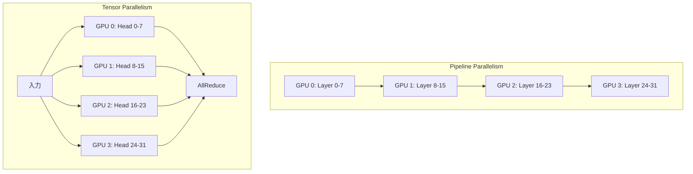

## ブログ概要（Summary）

本記事は [Mastering LLM Techniques: Inference Optimization](https://developer.nvidia.com/blog/mastering-llm-techniques-inference-optimization/)（NVIDIA Developer Blog, 2023年11月）の解説記事です。

NVIDIAのShashank VermaとNeal Vaidyaが2023年11月に公開した本ブログは、LLM推論における主要な最適化テクニックを体系的に解説している。推論パイプラインをPrefill（入力処理）とDecode（出力生成）の2フェーズに分解し、それぞれのボトルネックに応じた最適化戦略を示す。モデル並列化（Pipeline/Tensor/Sequence Parallelism）、Attention最適化（MQA/GQA/FlashAttention）、KVキャッシュ管理（PagedAttention）、モデル圧縮（量子化/スパース性/知識蒸留）、サービング最適化（In-flight Batching/Speculative Inference）を網羅し、TensorRT-LLMやNVIDIA NIMといった実装ツールも紹介している。

この記事は [Zenn記事: OllamaをDocker Composeで本番運用する GPU割当・監視・認証の実践構成](https://zenn.dev/0h_n0/articles/ffeb63bfe214b6) の深掘りです。

## 情報源

- **種別**: 企業テックブログ（NVIDIA Developer Blog）
- **URL**: [https://developer.nvidia.com/blog/mastering-llm-techniques-inference-optimization/](https://developer.nvidia.com/blog/mastering-llm-techniques-inference-optimization/)
- **組織**: NVIDIA
- **著者**: Shashank Verma, Neal Vaidya
- **発表日**: 2023年11月17日

## 技術的背景（Technical Background）

LLM推論は、訓練とは異なる固有のパフォーマンス課題を持つ。VermaとVaidyaは、推論パイプラインを以下の2フェーズに分解して説明している。

**Prefillフェーズ**: 入力プロンプトの全トークンを並列に処理し、最初の出力トークンを生成する。ブログではこのフェーズを「行列-行列演算（matrix-matrix operation）で高度に並列化され、GPU使用率を飽和させる」と説明している。入力トークン列全体に対するKey/Value行列の計算がこのフェーズで行われる。

**Decodeフェーズ**: 出力トークンを1つずつ自己回帰的に生成する。VermaとVaidyaはこのフェーズを「行列-ベクトル演算（matrix-vector operation）で、GPUの計算能力を十分に活用できない」と述べ、「メモリからGPUへのデータ転送速度がレイテンシを支配する」メモリバウンドな処理であると指摘している。

この2フェーズの性質の違いが、推論最適化の設計空間を規定する。Prefillはcompute-bound、Decodeはmemory-boundであるため、最適化のアプローチが根本的に異なる。OllamaのようなセルフホスティングLLMサーバでは、複数リクエストが同時にこれらのフェーズを実行するため、GPU資源の効率的な配分が本番運用の鍵となる。

## 実装アーキテクチャ（Architecture）

### モデル並列化の3手法

VermaとVaidyaは、単一GPUに収まらない大規模モデルを複数デバイスに分散する3つの並列化手法を解説している。



**Pipeline Parallelism**: モデルを垂直に分割し、レイヤーの部分集合を各デバイスに配置する。ブログでは「パイプラインバブル」（前段のレイヤー出力を待つ間にデバイスがアイドルになる問題）が生じると説明し、マイクロバッチングによりグローバルバッチをサブバッチに分割してバブルを削減する手法を紹介している。

**Tensor Parallelism**: 個々のレイヤーを水平に分割し、Attentionヘッドの独立分割やMLP重み行列の並列計算を行う。各デバイスのメモリ使用量が削減される一方、AllReduceによるデバイス間通信が発生する。

**Sequence Parallelism**: LayerNormやDropoutなど、Tensor Parallelismに適さない演算をシーケンス次元で分割する。ブログでは「Tensor Parallelismとは直交する次元で分割することでメモリ効率を改善する」と説明している。

### Attention最適化（MQA/GQA/FlashAttention）

標準的なMulti-Head Attention（MHA）からの最適化として、ブログでは以下の3手法を比較している。

| 手法 | Key/Valueヘッド数 | KVキャッシュサイズ | 精度 | 制約 |
|------|-------------------|-------------------|------|------|
| MHA | ヘッド数と同数 | 最大（基準） | 最高 | メモリ消費大 |
| MQA | 1（全ヘッドで共有） | 最小 | やや低下 | MQA対応の訓練が必要 |
| GQA | グループ数（MHAとMQAの中間） | 中程度 | MHAに近い | 元モデルからのuptrain可能 |
| FlashAttention | MHAと同数 | 最大（基準） | MHAと同一（exact） | 特殊実装が必要 |

**Multi-Query Attention（MQA）**: VermaとVaidyaは、Key/Valueを全Queryヘッド間で共有することで「メモリから読み出すデータ量（Key, Value）を削減する」と説明している。KVキャッシュサイズが大幅に縮小するが、精度低下の可能性があり、MQAを有効にした状態での訓練が必要となる。

**Grouped-Query Attention（GQA）**: Key/Valueを「いくつかのQueryヘッドのグループに投影する」手法で、MHAとMQAのトレードオフのバランスを取る。ブログではLlama 2 70BがGQAを採用していることに触れ、既存モデルから「元の訓練計算量の一部でuptrain可能」と述べている。

**FlashAttention**: ブログでは「I/Oを意識したexact attentionアルゴリズム」と説明している。タイリングにより「最終行列の小さな部分を完全に計算して一度に書き出す」ことで、GPUメモリ階層（HBM/SRAM）を効率的に活用する。数学的にはMHAと同一であり、「既存のモデルアーキテクチャに変更なくスワップインできる」点が特徴である。

### KVキャッシュ管理（PagedAttention）

Decodeフェーズでは、過去に計算したKey/Valueを再計算せずに再利用するためKVキャッシュが必要となる。VermaとVaidyaは、1トークンあたりのKVキャッシュメモリを以下の式で示している。

$$
\text{KV\_cache\_per\_token} = 2 \times n_{\text{layers}} \times (n_{\text{heads}} \times d_{\text{head}}) \times b_{\text{precision}}
$$

ここで、

- $n_{\text{layers}}$: Transformerレイヤー数
- $n_{\text{heads}}$: Attentionヘッド数
- $d_{\text{head}}$: 各ヘッドの次元数（$d_{\text{model}} / n_{\text{heads}}$）
- $b_{\text{precision}}$: 精度あたりのバイト数（FP16 = 2, FP32 = 4）
- 係数2: Key行列とValue行列の2つ分

バッチ全体でのKVキャッシュ総メモリ量は以下となる。

$$
\text{KV\_total} = B \times L_{\text{seq}} \times 2 \times n_{\text{layers}} \times d_{\text{model}} \times b_{\text{precision}}
$$

ここで、$B$はバッチサイズ、$L_{\text{seq}}$はシーケンス長、$d_{\text{model}}$は隠れ層次元数（$= n_{\text{heads}} \times d_{\text{head}}$）である。

ブログの記述によると、Llama 2 7B（FP16精度、バッチサイズ1、シーケンス長4096）の場合、KVキャッシュは約2GBを消費する。

以下にKVキャッシュメモリの計算コードを示す。

```python
from dataclasses import dataclass


@dataclass
class ModelConfig:
    """LLMモデルのKVキャッシュ計算に必要なパラメータ

    Attributes:
        name: モデル名
        num_layers: Transformerレイヤー数
        num_heads: Attentionヘッド数（KV側。GQAの場合はグループ数）
        head_dim: 各ヘッドの次元数
        precision_bytes: 精度あたりのバイト数（FP16=2, FP32=4, INT8=1）
    """
    name: str
    num_layers: int
    num_heads: int
    head_dim: int
    precision_bytes: int = 2  # FP16


def calc_kv_cache_bytes(
    config: ModelConfig,
    batch_size: int,
    seq_length: int,
) -> int:
    """KVキャッシュの総メモリ使用量をバイト単位で計算する

    Args:
        config: モデル設定
        batch_size: 同時処理するシーケンス数
        seq_length: 最大シーケンス長

    Returns:
        KVキャッシュに必要なメモリ量（バイト）
    """
    hidden_size = config.num_heads * config.head_dim
    return (
        batch_size
        * seq_length
        * 2  # Key + Value
        * config.num_layers
        * hidden_size
        * config.precision_bytes
    )


def format_bytes(n_bytes: int) -> str:
    """バイト数を読みやすい形式に変換する"""
    if n_bytes >= 1 << 30:
        return f"{n_bytes / (1 << 30):.2f} GB"
    return f"{n_bytes / (1 << 20):.2f} MB"


# --- モデル別のKVキャッシュ試算 ---
models = [
    ModelConfig("Llama 2 7B (MHA, FP16)", num_layers=32, num_heads=32, head_dim=128, precision_bytes=2),
    ModelConfig("Llama 2 7B (MHA, INT8)", num_layers=32, num_heads=32, head_dim=128, precision_bytes=1),
    ModelConfig("Llama 2 70B (GQA 8grp, FP16)", num_layers=80, num_heads=8, head_dim=128, precision_bytes=2),
    ModelConfig("Llama 3 8B (GQA 8grp, FP16)", num_layers=32, num_heads=8, head_dim=128, precision_bytes=2),
]

for m in models:
    for batch in [1, 8, 32]:
        mem = calc_kv_cache_bytes(m, batch_size=batch, seq_length=4096)
        print(f"{m.name}  batch={batch:>2}  seq=4096  => {format_bytes(mem)}")
```

ブログでは、従来の静的メモリ確保ではシーケンス長の最大値分を事前に確保するため、短いシーケンスではメモリが無駄になると指摘している。**PagedAttention**はこの問題に対し、「固定サイズの非連続ブロックでKVキャッシュを管理する」手法である。仮想メモリのページング機構と同様に、ブロックテーブルを介してAttention計算時にブロックを参照する。これにより「より大きなバッチサイズが可能となり」、メモリフラグメンテーションを排除する。vLLMがこのアプローチの代表的な実装である。

## Production Deployment Guide

### AWS実装パターン（コスト最適化重視）

LLM推論のセルフホスティングをAWS上で構築する場合、トラフィック量に応じて以下の3構成を推奨する。コスト試算は2026年8月時点のAWS ap-northeast-1（東京）リージョン概算値であり、実際のコストはトラフィックパターン、リージョン、バースト使用量により変動する。最新料金はAWS料金計算ツールで確認を推奨する。

| 構成 | トラフィック | 主要サービス | GPU | 月額概算 |
|------|-------------|-------------|-----|---------|
| Small | ~100 req/日 | EC2 g5.xlarge + ALB | NVIDIA A10G x1 | $800-1,200 |
| Medium | ~1,000 req/日 | ECS Fargate + g5.2xlarge x2 | NVIDIA A10G x2 | $2,500-4,000 |
| Large | 10,000+ req/日 | EKS + p4d.24xlarge Spot | NVIDIA A100 x8 | $8,000-15,000 |

**Small構成**: 単一g5.xlargeインスタンスにOllamaをDocker Composeでデプロイ。ALBでヘルスチェックとTLS終端を行う。Ollama本体が7Bクラスのモデルを1台で提供する小規模構成。

- EC2 g5.xlarge（On-Demand）: ~$760/月
- ALB + NAT Gateway: ~$50/月
- CloudWatch + S3ログ: ~$20/月

**Medium構成**: ECS Fargateでg5.2xlargeを2台運用し、ALBでロードバランシング。モデル並列化（Tensor Parallelism）を適用し、13B-34Bクラスのモデルを提供する。

- ECS g5.2xlarge x2: ~$3,040/月
- ALB + VPCエンドポイント: ~$80/月
- ECR + CloudWatch: ~$30/月

**Large構成**: EKSクラスタにKarpenterを導入し、p4d.24xlarge Spotインスタンスを活用。70B以上のモデルをPipeline + Tensor Parallelismで分散推論する。Spot活用で最大90%のコスト削減が可能。

- EKS コントロールプレーン: ~$73/月
- p4d.24xlarge Spot x2（Spotで60-90%削減）: ~$6,000-12,000/月
- Karpenter + モニタリングスタック: ~$200/月

**コスト削減テクニック**:
- Spot Instances活用で最大90%削減（p4d.24xlarge: On-Demand $32.77/h -> Spot $3-10/h）
- Reserved Instances 1年コミットで最大40%削減
- Savings Plans（Compute）で最大20%削減
- 量子化（INT8/INT4）によりGPUランク削減でインスタンスサイズダウン

### Terraformインフラコード

**Small構成（EC2 + ALB）**:

```hcl
# --- Small構成: EC2 g5.xlarge + ALB ---
# 2026年8月時点の構成。Terraform >= 1.6, AWS Provider >= 5.60

terraform {
  required_version = ">= 1.6"
  required_providers {
    aws = { source = "hashicorp/aws", version = "~> 5.60" }
  }
}

provider "aws" {
  region = "ap-northeast-1"
}

# VPC（NAT Gatewayなし: コスト削減）
module "vpc" {
  source  = "terraform-aws-modules/vpc/aws"
  version = "~> 5.13"

  name = "llm-inference-vpc"
  cidr = "10.0.0.0/16"

  azs             = ["ap-northeast-1a", "ap-northeast-1c"]
  public_subnets  = ["10.0.1.0/24", "10.0.2.0/24"]
  private_subnets = ["10.0.10.0/24", "10.0.20.0/24"]

  enable_nat_gateway = false  # コスト削減: パブリックサブネットに配置
}

# IAMロール（最小権限）
resource "aws_iam_role" "ollama_ec2" {
  name = "ollama-ec2-role"
  assume_role_policy = jsonencode({
    Version = "2012-10-17"
    Statement = [{
      Action    = "sts:AssumeRole"
      Effect    = "Allow"
      Principal = { Service = "ec2.amazonaws.com" }
    }]
  })
}

resource "aws_iam_role_policy_attachment" "ssm" {
  role       = aws_iam_role.ollama_ec2.name
  policy_arn = "arn:aws:iam::aws:policy/AmazonSSMManagedInstanceCore"
}

resource "aws_iam_instance_profile" "ollama" {
  name = "ollama-instance-profile"
  role = aws_iam_role.ollama_ec2.name
}

# セキュリティグループ
resource "aws_security_group" "ollama" {
  name_prefix = "ollama-"
  vpc_id      = module.vpc.vpc_id

  ingress {
    from_port       = 11434
    to_port         = 11434
    protocol        = "tcp"
    security_groups = [aws_security_group.alb.id]  # ALBからのみ許可
  }

  egress {
    from_port   = 0
    to_port     = 0
    protocol    = "-1"
    cidr_blocks = ["0.0.0.0/0"]
  }
}

resource "aws_security_group" "alb" {
  name_prefix = "ollama-alb-"
  vpc_id      = module.vpc.vpc_id

  ingress {
    from_port   = 443
    to_port     = 443
    protocol    = "tcp"
    cidr_blocks = ["0.0.0.0/0"]
  }

  egress {
    from_port   = 0
    to_port     = 0
    protocol    = "-1"
    cidr_blocks = ["0.0.0.0/0"]
  }
}

# EC2 g5.xlarge（NVIDIA A10G搭載）
resource "aws_instance" "ollama" {
  ami                    = data.aws_ami.deep_learning.id
  instance_type          = "g5.xlarge"  # A10G 24GB VRAM
  subnet_id              = module.vpc.public_subnets[0]
  vpc_security_group_ids = [aws_security_group.ollama.id]
  iam_instance_profile   = aws_iam_instance_profile.ollama.name

  root_block_device {
    volume_size = 200  # モデル格納用
    volume_type = "gp3"
    encrypted   = true  # KMS暗号化
  }

  user_data = <<-EOF
    #!/bin/bash
    # Docker + NVIDIA Container Toolkit セットアップ
    curl -fsSL https://get.docker.com | sh
    distribution=$(. /etc/os-release; echo $ID$VERSION_ID)
    curl -fsSL https://nvidia.github.io/libnvidia-container/gpgkey | \
      gpg --dearmor -o /usr/share/keyrings/nvidia-container-toolkit-keyring.gpg
    apt-get update && apt-get install -y nvidia-container-toolkit
    nvidia-ctk runtime configure --runtime=docker
    systemctl restart docker

    # Ollama Docker Compose デプロイ
    mkdir -p /opt/ollama && cd /opt/ollama
    cat > docker-compose.yml <<'COMPOSE'
    services:
      ollama:
        image: ollama/ollama:latest
        restart: unless-stopped
        ports: ["127.0.0.1:11434:11434"]
        volumes: [ollama_data:/root/.ollama]
        environment:
          OLLAMA_KEEP_ALIVE: "30m"
          OLLAMA_NUM_PARALLEL: "2"
        deploy:
          resources:
            reservations:
              devices:
                - driver: nvidia
                  count: all
                  capabilities: [gpu]
    volumes:
      ollama_data:
    COMPOSE
    docker compose up -d
  EOF

  tags = { Name = "ollama-inference" }
}

data "aws_ami" "deep_learning" {
  most_recent = true
  owners      = ["amazon"]
  filter {
    name   = "name"
    values = ["Deep Learning AMI GPU PyTorch *-Ubuntu-*"]
  }
}

# CloudWatchアラーム（GPU使用率監視）
resource "aws_cloudwatch_metric_alarm" "gpu_utilization" {
  alarm_name          = "ollama-gpu-utilization-low"
  comparison_operator = "LessThanThreshold"
  evaluation_periods  = 3
  metric_name         = "GPUUtilization"
  namespace           = "Custom/Ollama"
  period              = 300
  statistic           = "Average"
  threshold           = 5
  alarm_description   = "GPU使用率が5%未満が15分継続 - インスタンス停止検討"
}
```

**Large構成（EKS + Karpenter + Spot）**:

```hcl
# --- Large構成: EKS + Karpenter + Spot Instances ---

module "eks" {
  source  = "terraform-aws-modules/eks/aws"
  version = "~> 20.24"

  cluster_name    = "llm-inference-cluster"
  cluster_version = "1.31"

  vpc_id     = module.vpc.vpc_id
  subnet_ids = module.vpc.private_subnets

  cluster_endpoint_public_access = false  # プライベートアクセスのみ

  eks_managed_node_groups = {
    system = {
      instance_types = ["m6i.large"]
      min_size       = 2
      max_size       = 3
      desired_size   = 2
    }
  }
}

# Karpenter Provisioner（Spot優先、GPU対応）
resource "kubectl_manifest" "karpenter_provisioner" {
  yaml_body = yamlencode({
    apiVersion = "karpenter.sh/v1"
    kind       = "NodePool"
    metadata   = { name = "gpu-inference" }
    spec = {
      template = {
        spec = {
          requirements = [
            { key = "karpenter.sh/capacity-type", operator = "In", values = ["spot", "on-demand"] },
            { key = "node.kubernetes.io/instance-type", operator = "In",
              values = ["g5.2xlarge", "g5.4xlarge", "p4d.24xlarge"] },
          ]
          nodeClassRef = { name = "gpu-nodes" }
        }
      }
      limits   = { cpu = "256", memory = "1024Gi" }
      disruption = {
        consolidationPolicy = "WhenEmptyOrUnderutilized"
        consolidateAfter    = "60s"
      }
    }
  })
}

# Secrets Manager（APIキー管理）
resource "aws_secretsmanager_secret" "ollama_config" {
  name       = "ollama/inference-config"
  kms_key_id = aws_kms_key.ollama.arn
}

resource "aws_kms_key" "ollama" {
  description             = "KMS key for Ollama secrets"
  deletion_window_in_days = 7
  enable_key_rotation     = true
}

# AWS Budgets（予算アラート）
resource "aws_budgets_budget" "inference_cost" {
  name         = "llm-inference-monthly"
  budget_type  = "COST"
  limit_amount = "15000"
  limit_unit   = "USD"
  time_unit    = "MONTHLY"

  notification {
    comparison_operator       = "GREATER_THAN"
    threshold                 = 80
    threshold_type            = "PERCENTAGE"
    notification_type         = "ACTUAL"
    subscriber_email_addresses = ["ops-team@example.com"]
  }
}
```

### 運用・監視設定

**CloudWatch Logs Insights クエリ**:

```
# コスト異常検知: 1時間あたりのリクエスト数とレイテンシ
fields @timestamp, @message
| filter @message like /inference/
| stats count() as req_count,
        avg(duration_ms) as avg_latency,
        pct(duration_ms, 95) as p95_latency,
        pct(duration_ms, 99) as p99_latency
  by bin(1h)
| sort @timestamp desc

# GPU VRAM使用率の推移
fields @timestamp, gpu_memory_used_mb, gpu_utilization_pct
| stats avg(gpu_memory_used_mb) as avg_vram,
        max(gpu_memory_used_mb) as peak_vram,
        avg(gpu_utilization_pct) as avg_gpu_util
  by bin(5m)
```

**CloudWatchアラーム設定（Python）**:

```python
import boto3


def create_inference_alarms(instance_id: str, sns_topic_arn: str) -> None:
    """LLM推論インスタンスの監視アラームを作成する

    Args:
        instance_id: EC2インスタンスID
        sns_topic_arn: 通知先SNSトピックARN
    """
    cw = boto3.client("cloudwatch", region_name="ap-northeast-1")

    # GPU使用率スパイク検知
    cw.put_metric_alarm(
        AlarmName=f"ollama-{instance_id}-gpu-spike",
        MetricName="GPUUtilization",
        Namespace="Custom/Ollama",
        Statistic="Average",
        Period=300,
        EvaluationPeriods=2,
        Threshold=95,
        ComparisonOperator="GreaterThanThreshold",
        AlarmActions=[sns_topic_arn],
        AlarmDescription="GPU使用率95%超過が10分継続 - スケールアウト検討",
    )

    # 推論レイテンシ異常検知
    cw.put_metric_alarm(
        AlarmName=f"ollama-{instance_id}-latency-p99",
        MetricName="InferenceLatencyP99",
        Namespace="Custom/Ollama",
        Statistic="p99",
        Period=300,
        EvaluationPeriods=3,
        Threshold=30000,  # 30秒
        ComparisonOperator="GreaterThanThreshold",
        AlarmActions=[sns_topic_arn],
        AlarmDescription="P99レイテンシ30秒超過 - KVキャッシュ圧迫の可能性",
    )
```

**X-Rayトレーシング設定（Python）**:

```python
from aws_xray_sdk.core import xray_recorder, patch_all


def setup_inference_tracing() -> None:
    """LLM推論のX-Rayトレーシングを初期化する"""
    xray_recorder.configure(service="ollama-inference")
    patch_all()  # boto3, requests等を自動計装


@xray_recorder.capture("llm_inference")
def traced_inference(prompt: str, model: str) -> dict:
    """トレーシング付きのLLM推論呼び出し

    Args:
        prompt: 入力プロンプト
        model: 使用モデル名

    Returns:
        推論結果を含むレスポンス辞書
    """
    subsegment = xray_recorder.current_subsegment()
    subsegment.put_annotation("model", model)
    subsegment.put_metadata("prompt_tokens", len(prompt.split()))

    # Ollama APIへのリクエスト（requests自動計装済み）
    import requests
    resp = requests.post(
        "http://localhost:11434/api/generate",
        json={"model": model, "prompt": prompt},
        timeout=120,
    )
    result = resp.json()
    subsegment.put_metadata("eval_count", result.get("eval_count", 0))
    return result
```

**Cost Explorer自動レポート（Python）**:

```python
import boto3
from datetime import datetime, timedelta


def daily_inference_cost_report(sns_topic_arn: str) -> None:
    """日次のLLM推論コストレポートを生成しSNS通知する

    Args:
        sns_topic_arn: 通知先SNSトピックARN
    """
    ce = boto3.client("ce", region_name="us-east-1")
    sns = boto3.client("sns", region_name="ap-northeast-1")

    end = datetime.utcnow().strftime("%Y-%m-%d")
    start = (datetime.utcnow() - timedelta(days=1)).strftime("%Y-%m-%d")

    resp = ce.get_cost_and_usage(
        TimePeriod={"Start": start, "End": end},
        Granularity="DAILY",
        Metrics=["UnblendedCost"],
        Filter={
            "Tags": {
                "Key": "Project",
                "Values": ["llm-inference"],
            }
        },
        GroupBy=[{"Type": "DIMENSION", "Key": "SERVICE"}],
    )

    total = 0.0
    lines = []
    for group in resp["ResultsByTime"][0]["Groups"]:
        svc = group["Keys"][0]
        cost = float(group["Metrics"]["UnblendedCost"]["Amount"])
        total += cost
        lines.append(f"  {svc}: ${cost:.2f}")

    report = f"LLM Inference Daily Cost ({start}):\n" + "\n".join(lines) + f"\n  TOTAL: ${total:.2f}"

    if total > 100:
        sns.publish(
            TopicArn=sns_topic_arn,
            Subject=f"[ALERT] LLM Inference cost ${total:.2f}/day",
            Message=report,
        )
```

### コスト最適化チェックリスト

**アーキテクチャ選択**:
- [ ] トラフィック量に応じた構成選択（Small: EC2単体 / Medium: ECS / Large: EKS）
- [ ] GPUインスタンスファミリーの適切な選定（g5: 推論向け / p4d: 大規模モデル向け）
- [ ] リージョン選択でのコスト比較（東京 vs バージニア vs オレゴン）

**リソース最適化**:
- [ ] EC2 Spot Instances優先設定（Karpenter capacity-type: spot優先）
- [ ] Reserved Instances 1年コミット検討（常時稼働ノード向け、最大40%削減）
- [ ] Compute Savings Plans検討（柔軟性と割引のバランス）
- [ ] GPUメモリに応じたインスタンスサイズ最適化（過剰VRAMを避ける）
- [ ] EKS/ECSのアイドル時スケールダウン設定（Karpenter consolidation）
- [ ] gp3 EBSボリュームのスループット/IOPS調整

**LLMコスト削減**:
- [ ] 量子化適用（INT8/INT4）でGPUランク削減
- [ ] GQAモデル選択でKVキャッシュメモリ削減
- [ ] PagedAttentionによるバッチサイズ最大化（vLLM/TensorRT-LLM）
- [ ] In-flight Batchingによるスループット向上
- [ ] Speculative Decodingによるレイテンシ削減
- [ ] モデルサイズの適正化（タスク要件に対して過剰なモデルを避ける）

**監視・アラート**:
- [ ] AWS Budgets月次予算設定（80%到達で通知）
- [ ] CloudWatchアラーム（GPU使用率・レイテンシP99）
- [ ] Cost Anomaly Detection有効化
- [ ] 日次コストレポート自動送信（SNS）
- [ ] GPU VRAM使用率の継続監視

**リソース管理**:
- [ ] 未使用EBSスナップショット・ボリュームの定期削除
- [ ] タグ戦略（Project/Environment/CostCenter）の全リソース適用
- [ ] EC2スナップショットのライフサイクルポリシー設定
- [ ] 開発環境の夜間・休日自動停止（EventBridge + Lambda）
- [ ] ECRイメージのライフサイクルポリシー（未使用イメージ自動削除）

## パフォーマンス最適化（Performance）

VermaとVaidyaは、モデル自体の圧縮による推論高速化として3つの手法を紹介している。

**量子化**: モデルの重みを32/16ビット浮動小数点から8ビット以下の整数に変換する。ブログでは「より大きなモデルがGPUに収まり、帯域幅利用が改善される」と説明している。ただし、活性化値に外れ値が発生する問題があり、LLM.int8()のように特定の活性化値のみ高精度で計算するアプローチも紹介されている。Ollamaでは`ollama run llama3:8b-q4_0`のようにGGUF形式の量子化モデルを直接利用でき、VRAM消費を半減以下にできる。

**構造化スパース性**: 値がゼロに近い重みをゼロに置換し、圧縮形式で格納する。ブログでは「GPUは構造化スパース性（4値中2値がゼロ）に対してハードウェアアクセラレーションを持つ」と説明し、量子化との組み合わせでさらなる高速化が可能であると述べている。NVIDIA Ampere以降のGPU（A100, A10G等）がこのパターンをサポートする。

**知識蒸留**: 大きな「教師」モデルの出力分布を小さな「生徒」モデルに学習させる手法。ブログではDistilBERTの例を挙げ、「BERTモデルを40%圧縮しながら言語理解能力の97%を維持し、60%高速化した」と報告している。教師のロジット、中間層の活性化、合成データのいずれかを蒸留信号として利用できる。

## 運用での学び（Production Lessons）

### In-flight Batching

従来の静的バッチングでは、バッチ内の全シーケンスが完了するまで新しいリクエストを受け付けられず、GPUが遊休状態になる。VermaとVaidyaは「出力長が数桁のオーダーで変動する」LLMワークロードにおいて、静的バッチングは著しく非効率であると指摘している。

In-flight Batching（continuous batchingとも呼ばれる）は、「バッチ全体の完了を待つのではなく、完了したシーケンスを即座にバッチから排出し、新しいリクエストを投入する」手法である。これによりGPU使用率が向上し、スループットが改善される。vLLM、TensorRT-LLM、Ollamaの内部スケジューラがこのアプローチを採用している。

### Speculative Inference（投機的デコーディング）

自己回帰生成ではトークンを1つずつ逐次生成するため、Decodeフェーズがボトルネックとなる。Speculative Inferenceは、小さなドラフトモデルで複数の将来トークンを予測し、ターゲットモデルで並列に検証する。ブログでは「承認されたトークンはそのまま生成を継続し、却下されたトークンは新たなドラフトのトリガーとなる」と説明している。

この手法は自己回帰の制約を崩さずに（数学的に同一の出力を保証しつつ）、検証ステップを並列化することでレイテンシを削減する。ドラフトモデルのサイズとターゲットモデルの受容率のバランスが運用上の調整ポイントとなる。

## 学術研究との関連（Academic Connection）

ブログで紹介されている各最適化手法は、いずれも学術研究に基づいている。FlashAttentionはDao et al. (2022)、PagedAttentionはKwon et al. (2023, vLLM)、GQAはAinslie et al. (2023)、Speculative DecodingはLeviathan et al. (2023)およびChen et al. (2023)の研究に由来する。VermaとVaidyaのブログは、これらの個別研究を推論パイプラインの文脈で統合し、NVIDIAのハードウェア・ソフトウェアスタック（TensorRT-LLM、NIM）との接続を示した点に実務的価値がある。Zenn記事で扱うOllamaの内部もllama.cppベースでこれらの最適化を部分的に取り込んでおり、量子化（GGUF）、FlashAttention、continuous batchingなどが実装されている。

## まとめと実践への示唆

NVIDIAのVermaとVaidyaが整理した推論最適化テクニックは、Prefill/Decodeの2フェーズ分離を起点に、モデル並列化・Attention最適化・KVキャッシュ管理・モデル圧縮・サービング最適化の各レイヤーで具体的な手法を提供している。Ollamaを本番運用する際には、量子化によるVRAM削減、KVキャッシュ計算に基づくバッチサイズ設計、GPU監視メトリクスの設定が直接的に活用できる。ブログの知見とZenn記事のDocker Compose構成を組み合わせることで、限られたGPU資源でも効率的なLLM推論基盤を構築できる。

## 参考文献

- **Blog URL**: [https://developer.nvidia.com/blog/mastering-llm-techniques-inference-optimization/](https://developer.nvidia.com/blog/mastering-llm-techniques-inference-optimization/)
- **FlashAttention**: Dao, T. et al. "FlashAttention: Fast and Memory-Efficient Exact Attention with IO-Awareness." NeurIPS 2022.
- **PagedAttention / vLLM**: Kwon, W. et al. "Efficient Memory Management for Large Language Model Serving with PagedAttention." SOSP 2023.
- **GQA**: Ainslie, J. et al. "GQA: Training Generalized Multi-Query Transformer Models from Multi-Head Checkpoints." EMNLP 2023.
- **Speculative Decoding**: Leviathan, Y. et al. "Fast Inference from Transformers via Speculative Decoding." ICML 2023.
- **TensorRT-LLM**: [https://github.com/NVIDIA/TensorRT-LLM](https://github.com/NVIDIA/TensorRT-LLM)
- **Related Zenn article**: [https://zenn.dev/0h_n0/articles/ffeb63bfe214b6](https://zenn.dev/0h_n0/articles/ffeb63bfe214b6)
