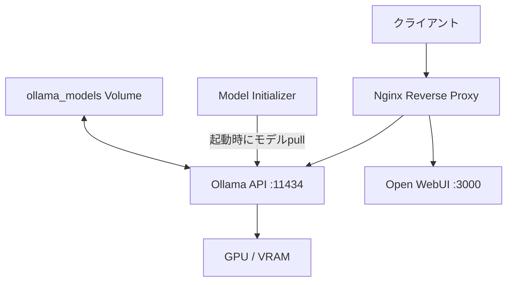

## ブログ概要（Summary）

本記事は [https://www.inkeybit.com/blog/ollama-docker-production-guide](https://www.inkeybit.com/blog/ollama-docker-production-guide) の解説記事です。

inkeybitチームが2026年5月に公開し8月に更新した本ブログは、OllamaをDocker Composeで本番運用するための包括的なガイドである。Ollama・Open WebUI・Model Initializerの3サービス構成、NVIDIA Container Toolkitを用いたGPUパススルー、AMD/ROCm環境での代替設定、環境変数によるパフォーマンスチューニング、Nginxリバースプロキシによる認証とレート制限、ヘルスモニタリングスクリプト、cronによるモデル自動同期など、本番デプロイに必要な要素を網羅的に解説している。「Ollama Unlocked」シリーズの第12回として位置づけられている。

この記事は [Zenn記事: OllamaをDocker Composeで本番運用する GPU割当・監視・認証の実践構成](https://zenn.dev/0h_n0/articles/ffeb63bfe214b6) の深掘りです。

## 情報源

- **種別**: 企業テックブログ
- **URL**: [https://www.inkeybit.com/blog/ollama-docker-production-guide](https://www.inkeybit.com/blog/ollama-docker-production-guide)
- **組織**: inkeybit
- **著者**: inkeybit Team（Editorial Team）
- **発表日**: 2026年5月27日（2026年8月更新）

## 技術的背景（Technical Background）

LLMのセルフホスティングにおいて、Dockerコンテナ化は再現性・ポータビリティ・スケーラビリティの観点から事実上の標準となっている。Ollamaはローカル環境でのLLM推論を簡素化するツールであるが、開発用途から本番運用に移行する際には、GPU資源管理、セキュリティ、監視、モデルライフサイクル管理など、追加の考慮事項が発生する。

著者らは、Docker Composeを用いることで以下の利点が得られると解説している。

- **環境の一貫性**: 開発・ステージング・本番で同一のコンテナイメージを使用できる
- **GPU資源の宣言的管理**: `deploy.resources.reservations`でGPUデバイスを明示的に割り当てられる
- **サービス間依存関係の定義**: `depends_on`によりOllamaサーバの起動完了後にUI・モデル初期化を実行できる
- **永続ボリュームによるモデル保存**: コンテナ再起動時にモデルの再ダウンロードが不要になる

Ollamaのアーキテクチャは、APIサーバ（ポート11434）がHTTPリクエストを受け付け、内部でGGUF形式の量子化モデルをロードして推論を実行する構成である。GPU推論はシリアル実行が基本であり、同時リクエストはキューイングされる点が本番運用での重要な制約となる。

## 実装アーキテクチャ（Architecture）

### Docker Compose 3サービス構成

著者らが提示するDocker Compose構成は、Ollama本体・Open WebUI・Model Initializerの3サービスで構成される。

```yaml
version: '3.8'

services:
  ollama:
    image: ollama/ollama:latest
    container_name: ollama
    restart: unless-stopped
    ports:
      - "127.0.0.1:11434:11434"
    volumes:
      - ollama_models:/root/.ollama
    environment:
      - OLLAMA_KEEP_ALIVE=30m
      - OLLAMA_NUM_PARALLEL=2
      - OLLAMA_MAX_LOADED_MODELS=3
    deploy:
      resources:
        reservations:
          devices:
            - driver: nvidia
              count: all
              capabilities: [gpu]

  open-webui:
    image: ghcr.io/open-webui/open-webui:main
    container_name: open-webui
    restart: unless-stopped
    depends_on:
      - ollama
    ports:
      - "127.0.0.1:3000:8080"
    volumes:
      - open-webui-data:/app/backend/data
    environment:
      - OLLAMA_BASE_URL=http://ollama:11434
      - WEBUI_SECRET_KEY=your-secret-key-here

  model-init:
    image: ollama/ollama:latest
    depends_on:
      - ollama
    entrypoint: >
      sh -c "
        sleep 10 &&
        ollama pull llama4:scout &&
        ollama pull nomic-embed-text &&
        ollama pull qwen3:7b &&
        echo 'Models ready.'
      "
    environment:
      - OLLAMA_HOST=http://ollama:11434
    restart: "no"

volumes:
  ollama_models:
  open-webui-data:
```



設計上の注目点として、ポートバインドが`127.0.0.1:11434:11434`とlocalhostに限定されている。これにより外部から直接OllamaのAPIにアクセスすることを防ぎ、Nginxリバースプロキシ経由でのみアクセスを許可する構成となっている。

Model Initializerサービスは`restart: "no"`が設定されており、初回起動時にモデルをpullした後に終了する一時的なコンテナとして機能する。`sleep 10`によりOllamaサーバの起動完了を待機してからpullを開始する設計である。

### NVIDIA GPUパススルー

NVIDIA GPUをDockerコンテナから利用するには、NVIDIA Container Toolkitのインストールとランタイム設定が必要である。著者らは以下の手順を示している。

```bash
# GPGキーとリポジトリの追加
curl -fsSL https://nvidia.github.io/libnvidia-container/gpgkey | \
  sudo gpg --dearmor -o /usr/share/keyrings/nvidia-container-toolkit-keyring.gpg

curl -s -L https://nvidia.github.io/libnvidia-container/stable/deb/nvidia-container-toolkit.list | \
  sed 's#deb https://#deb [signed-by=/usr/share/keyrings/nvidia-container-toolkit-keyring.gpg] https://#g' | \
  sudo tee /etc/apt/sources.list.d/nvidia-container-toolkit.list

# インストールとランタイム設定
sudo apt update && sudo apt install -y nvidia-container-toolkit
sudo nvidia-ctk runtime configure --runtime=docker
sudo systemctl restart docker
```

`nvidia-ctk runtime configure --runtime=docker`コマンドにより、Dockerデーモンの設定ファイル（`/etc/docker/daemon.json`）にNVIDIAランタイムが登録される。この設定後、Docker Composeの`deploy.resources.reservations.devices`セクションでGPUデバイスを宣言的に割り当てることが可能になる。

動作確認は以下のコマンドで行える。

```bash
docker run --rm --gpus all nvidia/cuda:11.5.2-base-ubuntu20.04 nvidia-smi
```

マルチGPU環境では、`device_ids`で特定のGPUデバイスを指定できる。

```yaml
deploy:
  resources:
    reservations:
      devices:
        - driver: nvidia
          device_ids: ['0', '1']
          capabilities: [gpu]
```

### AMD/ROCm環境での代替構成

AMD GPUを使用する場合、著者らは`ollama/ollama:rocm`イメージの使用を推奨している。

```yaml
services:
  ollama:
    image: ollama/ollama:rocm
    devices:
      - /dev/kfd
      - /dev/dri
    group_add:
      - video
      - render
    environment:
      - HSA_OVERRIDE_GFX_VERSION=11.0.0
```

`/dev/kfd`（Kernel Fusion Driver）と`/dev/dri`（Direct Rendering Infrastructure）デバイスのマウントが必要であり、`video`および`render`グループへの追加が求められる。`HSA_OVERRIDE_GFX_VERSION`環境変数は、ROCmが正式サポートしていないGPUアーキテクチャで互換動作させるための設定である。

## 環境変数チューニング（Performance Tuning）

著者らは、Ollamaの動作を制御する主要な環境変数として以下を解説している。

| 環境変数 | 推奨値 | 説明 |
|---|---|---|
| `OLLAMA_NUM_PARALLEL` | 2 | 同時処理リクエスト数。値を大きくするとスループットが向上するが、リクエストあたりのVRAM消費が増加する |
| `OLLAMA_MAX_LOADED_MODELS` | 3 | VRAMに同時ロードするモデルの最大数 |
| `OLLAMA_KEEP_ALIVE` | 30m | 最後のリクエストからモデルをVRAMに保持する時間 |
| `OLLAMA_FLASH_ATTN` | 1 | Flash Attentionを有効化。推論速度の向上とメモリ消費の削減が期待できる |
| `OLLAMA_KV_CACHE_TYPE` | q8_0 | KVキャッシュの量子化タイプ。VRAM使用量を削減するが品質への影響がある |
| `OLLAMA_NUM_THREAD` | 8 | CPU推論時のスレッド数 |
| `CUDA_VISIBLE_DEVICES` | 0 | 使用するGPUデバイスの制限 |

### NUM_PARALLEL と MAX_LOADED_MODELS の関係

`OLLAMA_NUM_PARALLEL`を増やすと、各リクエストに対してKVキャッシュが別途確保されるため、VRAMの消費が加速する。著者らは「値を大きくすればスループットは向上するが、VRAMのヘッドルームが十分にある場合のみ増やすべきである」と解説している。

`OLLAMA_MAX_LOADED_MODELS`はVRAMに同時にロードできるモデル数の上限を制御する。7Bモデル（Q4量子化）で約10GB、27Bモデル（Q4量子化）で約20GBのVRAMを消費するため、搭載VRAMに応じた適切な設定が求められる。

### FLASH_ATTN と KV_CACHE_TYPE

`OLLAMA_FLASH_ATTN=1`はFlash Attentionアルゴリズムを有効化する設定である。Flash Attentionは、標準的なAttention計算における $O(n^2)$ のメモリ使用量を、タイル化とオンラインソフトマックス計算により $O(n)$ に削減する手法である。これにより、長いコンテキスト長での推論時にVRAM使用量が削減され、推論速度も向上する。

`OLLAMA_KV_CACHE_TYPE=q8_0`は、Attentionのキー・バリューキャッシュを8ビット量子化で保持する設定である。FP16（16ビット浮動小数点）と比較してVRAM使用量を約半分に削減できるが、量子化誤差による品質劣化のトレードオフが存在する。本番環境では、対象タスクでの品質検証を行ったうえで適用すべきである。

### KEEP_ALIVE の設計判断

`OLLAMA_KEEP_ALIVE=30m`は、最後のリクエストから30分間モデルをVRAMに保持する設定である。値を大きくするとコールドスタート（モデルの再ロード）を回避できるが、使用されていないモデルがVRAMを占有し続ける。値を小さくするとVRAMの効率的な利用が可能になるが、リクエスト間隔が空いた場合にレイテンシが増大する。著者らは30分をデフォルトの推奨値としている。

## Production Deployment Guide

### セキュリティ: Nginxリバースプロキシ

本番環境では、OllamaのAPIを直接公開せず、Nginxリバースプロキシ経由でアクセスする構成が推奨されている。著者らが示す設定は、Basic認証、レート制限、SSL/TLSの3つのセキュリティレイヤーを組み合わせたものである。

```nginx
limit_req_zone $binary_remote_addr zone=ollama_limit:10m rate=30r/m;

server {
    listen 443 ssl;
    server_name ollama.yourteam.internal;

    ssl_certificate     /etc/ssl/certs/ollama.crt;
    ssl_certificate_key /etc/ssl/private/ollama.key;

    auth_basic "Ollama API";
    auth_basic_user_file /etc/nginx/.htpasswd;

    limit_req zone=ollama_limit burst=60 nodelay;

    location / {
        proxy_pass http://127.0.0.1:11434;
        proxy_set_header Host $host;
        proxy_set_header X-Real-IP $remote_addr;
        proxy_buffering off;
        proxy_cache off;
        proxy_read_timeout 600s;
        proxy_send_timeout 600s;
    }
}

server {
    listen 80;
    server_name ollama.yourteam.internal;
    return 301 https://$server_name$request_uri;
}
```

#### レート制限の設計

`rate=30r/m`（1分間に30リクエスト）と`burst=60 nodelay`の組み合わせにより、定常的には1分間30リクエストに制限しつつ、一時的なバースト（最大60リクエスト）を遅延なく処理する。LLM推論は1リクエストあたり数秒から数十秒を要するため、このレート制限はGPU資源の過負荷を防ぐ役割を果たす。

#### ストリーミング対応

`proxy_buffering off`と`proxy_cache off`の設定は、Ollamaのストリーミングレスポンス（Server-Sent Events形式でトークンを逐次返す）を正しく中継するために必要である。`proxy_read_timeout 600s`は、大規模モデルでの長時間推論がタイムアウトしないための設定である。

#### ユーザー管理

```bash
sudo apt install apache2-utils
sudo htpasswd -c /etc/nginx/.htpasswd user1
sudo htpasswd /etc/nginx/.htpasswd user2
```

`htpasswd`によるBasic認証は実装が容易である反面、チーム規模が大きい場合はLDAPやOAuth2 Proxyへの移行が望ましい。著者らは小規模チームでの運用を前提として`htpasswd`を推奨している。

### モニタリング: ヘルスチェック

著者らは、本番環境でのヘルスモニタリングとして、Docker内蔵のヘルスチェック機能とカスタムPythonスクリプトの2段階を提示している。

#### Docker内蔵ヘルスチェック

```yaml
healthcheck:
  test: ["CMD", "curl", "-f", "http://localhost:11434/api/tags"]
  interval: 30s
  timeout: 10s
  retries: 3
  start_period: 60s
```

`/api/tags`エンドポイントへのHTTPリクエストにより、Ollamaサーバの応答性を確認する。`start_period: 60s`は、モデルのロードに時間がかかる初回起動時のfalse negativeを防ぐための設定である。

#### カスタムヘルスモニタリング

著者らが提示するPythonスクリプトは以下の3つのチェックを実行する。

1. **API到達性**: `/api/tags`エンドポイントへのHTTPリクエストの成功確認
2. **推論能力**: 実際にモデルへプロンプトを送り、応答が返ることの確認。レスポンスタイムとトークン/秒を計測する
3. **GPUメモリ**: `nvidia-smi`出力のパースにより、使用中・空きVRAM量をMB単位で取得する

失敗したチェック数に基づいて全体のステータス（正常・警告・異常）を判定する仕組みである。このスクリプトをcronやPrometheus Exporterと組み合わせることで、継続的な監視が可能になる。

### モデル管理の自動化

#### 日次モデル同期

著者らは、cronで毎日午前3時に実行するモデル同期スクリプトを提示している。

```bash
# cron設定
echo "0 3 * * * /usr/local/bin/ollama-sync-models.sh" | sudo crontab -
```

このスクリプトは以下の処理を行う。

1. `/api/tags`エンドポイントから現在インストール済みのモデル一覧をJSON形式で取得する
2. 定義済みの必須モデルリストと比較し、不足しているモデルを特定する
3. 不足モデルに対して`ollama pull`を実行する
4. タイムスタンプ付きでログを記録する

この自動化により、モデルの更新やコンテナの再構築後にモデルが欠落する問題を防止できる。

#### ウォームアップ（Pre-loading）

初回のモデルロードには時間がかかるため、著者らはサーバ起動直後にウォームアップリクエストを送信する手法を推奨している。

```bash
curl -s http://localhost:11434/api/generate \
  -d '{"model":"llama4:scout","prompt":"warm","stream":false,"keep_alive":-1}'
```

`keep_alive: -1`を指定することで、モデルを無期限にVRAMに保持する。これにより、実際のユーザーリクエストが到着した際のコールドスタートを回避できる。

### スケーリングとリソース計画

著者らは、本番環境でのモデル配置にあたって以下のメモリ見積もりを示している。

| モデルサイズ | 量子化 | VRAM使用量（概算） |
|---|---|---|
| 7Bパラメータ | Q4 | 約10GB |
| 27Bパラメータ | Q4 | 約20GB |
| 本番推奨セット（5-6モデル） | Q4 | 60-70GB |

#### GPU推論のシリアル特性

Ollamaにおけるgpu推論はシリアル実行が基本である。複数の同時リクエストはキューイングされ、順番に処理される。`OLLAMA_NUM_PARALLEL`を増やすことで見かけ上の並列度は向上するが、GPU演算自体は逐次的に実行されるため、各リクエストのレイテンシは変わらない。

著者らは、AsyncIOベースのリクエストキューを実装例として提示しており、最大キューサイズを50、同時処理数を2に設定する構成を示している。キューが満杯の場合はリクエストを拒否することで、システムの安定性を確保する設計である。

### Kubernetes環境

著者らは、Kubernetes環境でのデプロイについて「StatefulSetと永続ボリュームを使用してモデルストレージを管理する。コミュニティHelmチャートが利用可能である」と述べている。大規模環境では、Docker Compose構成をKubernetes Manifestに移行し、GPUスケジューリングにはNVIDIA Device Pluginを利用することになる。

### 本番デプロイチェックリスト

著者らのガイドから導出される本番環境のチェックリストを以下に整理する。

| カテゴリ | 確認項目 |
|---|---|
| GPU | NVIDIA Container Toolkitのインストールと`nvidia-ctk`設定、`nvidia-smi`による動作確認 |
| ネットワーク | ポートのlocalhost限定バインド、Nginxリバースプロキシの配置 |
| 認証 | htpasswdまたはOAuth2 Proxyの設定、SSL/TLS証明書の配置 |
| レート制限 | `limit_req_zone`の設定（30r/m推奨）、バースト値の調整 |
| モニタリング | Dockerヘルスチェックの設定、カスタムヘルスモニタリングスクリプトの配置 |
| モデル管理 | 初回モデルpullの自動化（model-initサービス）、日次同期cronの設定 |
| ウォームアップ | 起動時のウォームアップリクエスト、`keep_alive`設定の最適化 |
| リソース | VRAMに応じた`MAX_LOADED_MODELS`設定、モデルサイズの見積もり |

## パフォーマンス最適化（Optimization）

著者らが示すパフォーマンス最適化は、大きく3つの軸に分類できる。

**第一に、メモリ効率の最適化**である。`OLLAMA_FLASH_ATTN=1`と`OLLAMA_KV_CACHE_TYPE=q8_0`の組み合わせにより、Attention計算とKVキャッシュのメモリ使用量を削減する。これにより、同一のGPUハードウェアでより大きなモデルや多くの同時リクエストを処理できる可能性がある。

**第二に、コールドスタートの回避**である。`OLLAMA_KEEP_ALIVE`による適切な保持時間の設定と、起動時のウォームアップリクエスト（`keep_alive: -1`）により、ユーザーが体感するレイテンシを最小化する。モデルのVRAMへのロードには数十秒を要する場合があり、高頻度で使用されるモデルは常時ロード状態を維持することが推奨される。

**第三に、リクエストキューイングの管理**である。GPU推論のシリアル特性を前提に、`OLLAMA_NUM_PARALLEL`の値をVRAMの余裕に応じて調整し、アプリケーション層でのキューサイズ制限（著者らの例では最大50）によりシステムの過負荷を防止する。

## 運用での学び（Operational Insights）

### トラブルシューティング

著者らは、本番運用で頻出する問題と対処法として以下を解説している。

| 問題 | 原因 | 対処法 |
|---|---|---|
| 初回リクエストが遅い | モデルのVRAMへのロード（コールドスタート） | 起動スクリプトにウォームアップリクエストを追加する |
| VRAMエラー（Out of Memory） | 同時ロードモデル数がVRAM容量を超過 | `OLLAMA_MAX_LOADED_MODELS=1`に設定し、`OLLAMA_KEEP_ALIVE`を長めに設定する |
| 負荷時のレスポンス遅延 | GPU推論のシリアル化によるキュー待ち | VRAMに余裕がある場合のみ`OLLAMA_NUM_PARALLEL`を増やす |
| システム更新後のクラッシュ | GPUドライバの互換性問題 | メジャーアップデート後はNVIDIA Container Toolkitのインストールスクリプトを再実行する |

### 運用上の重要な知見

本ブログから得られる運用上の知見として、以下の点が挙げられる。

**モデルストレージの永続化**は必須である。Dockerの名前付きボリューム（`ollama_models`）を使用しないと、コンテナの再起動のたびにモデルの再ダウンロードが発生する。7Bモデルで約4-5GB、27Bモデルで約15-20GBのダウンロードが必要であり、本番環境では許容できないダウンタイムとなる。

**セキュリティの多層化**も重要である。ポートのlocalhost限定バインド → Nginxリバースプロキシ → Basic認証 → レート制限 → SSL/TLSという多層防御の構成により、単一のセキュリティレイヤーの突破がシステム全体の侵害に直結しない設計となっている。

## 学術研究との関連（Academic Context）

本ブログが扱う技術要素は、複数の学術研究と関連する。Flash Attentionは Dao et al. (2022) "FlashAttention: Fast and Memory-Efficient Exact Attention with IO-Awareness" で提案されたアルゴリズムであり、`OLLAMA_FLASH_ATTN=1`で有効化される機能の基盤である。KVキャッシュの量子化は、LLM推論の高速化研究（Sheng et al., 2023 "FlexGen"など）で広く検討されている手法であり、`OLLAMA_KV_CACHE_TYPE=q8_0`はその実装の一形態である。

GGUFフォーマットによるモデル量子化（Q4, Q8など）は、ローカル推論を実用的にするための技術であり、元来はllama.cppプロジェクトで開発された。本ブログが前提とするOllamaの量子化モデル管理は、これらの学術的・技術的成果の上に構築されている。

## まとめと実践への示唆

inkeybitのブログは、OllamaのDocker本番デプロイに必要な要素を、Docker Compose構成・GPUパススルー・環境変数チューニング・セキュリティ・モニタリング・モデル管理の6つの観点から体系的に整理したものである。GPU推論のシリアル特性を前提とした`NUM_PARALLEL`と`MAX_LOADED_MODELS`の調整、Flash AttentionとKVキャッシュ量子化によるメモリ効率化、Nginxによる多層セキュリティ構成など、開発環境から本番環境への移行時に見落としがちな設定を網羅的にカバーしている。

本ブログの内容を実践に適用する際は、まずGPUパススルーの動作確認から始め、対象ワークロードでの品質検証（`KV_CACHE_TYPE=q8_0`の影響評価など）を経て段階的に最適化を進めることが望ましい。

## 参考文献

- inkeybit Team, "Ollama on Docker and Production Deployment: Run Local AI at Scale," inkeybit Blog, May 2026 (updated Aug 2026). [https://www.inkeybit.com/blog/ollama-docker-production-guide](https://www.inkeybit.com/blog/ollama-docker-production-guide)
- Dao, T. et al., "FlashAttention: Fast and Memory-Efficient Exact Attention with IO-Awareness," NeurIPS 2022. [https://arxiv.org/abs/2205.14135](https://arxiv.org/abs/2205.14135)
- Sheng, Y. et al., "FlexGen: High-Throughput Generative Inference of Large Language Models with a Single GPU," ICML 2023. [https://arxiv.org/abs/2303.06865](https://arxiv.org/abs/2303.06865)
- Ollama Documentation, [https://ollama.com/](https://ollama.com/)
- NVIDIA Container Toolkit Documentation, [https://docs.nvidia.com/datacenter/cloud-native/container-toolkit/](https://docs.nvidia.com/datacenter/cloud-native/container-toolkit/)
