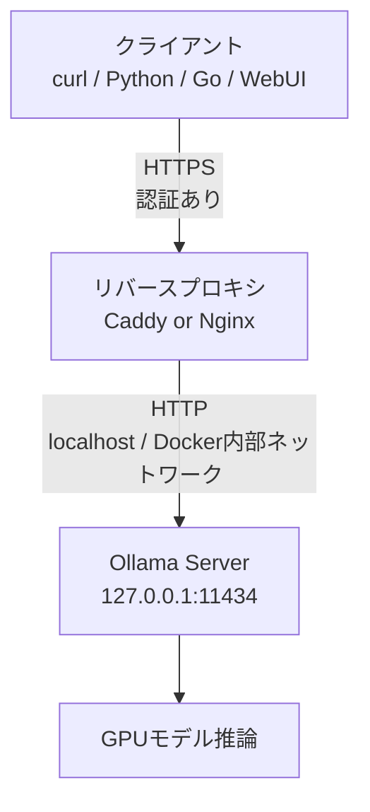

## ブログ概要（Summary）

本記事は [https://www.glukhov.org/llm-hosting/ollama/ollama-behind-reverse-proxy/](https://www.glukhov.org/llm-hosting/ollama/ollama-behind-reverse-proxy/) の解説記事です。

Rost Glukhov氏が公開した本ブログは、ローカルLLM推論エンジンであるOllamaをリバースプロキシ（NginxまたはCaddy）経由で安全に公開するための構成手順を体系的にまとめたものである。Ollamaの`localhost:11434`バインドを維持したまま、HTTPS終端・ストリーミング対応・認証・レート制限をプロキシ層で実装するアプローチを採用している。著者はポート11434を「内部の高コストAPI」として扱い、エッジ層での保護を設計原則としている。

この記事は [Zenn記事: OllamaをDocker Composeで本番運用する GPU割当・監視・認証の実践構成](https://zenn.dev/0h_n0/articles/ffeb63bfe214b6) の深掘りです。

## 情報源

- **種別**: 個人テックブログ
- **URL**: [https://www.glukhov.org/llm-hosting/ollama/ollama-behind-reverse-proxy/](https://www.glukhov.org/llm-hosting/ollama/ollama-behind-reverse-proxy/)
- **著者**: Rost Glukhov
- **サイト**: glukhov.org（LLMホスティング関連の技術記事シリーズ）

## 技術的背景（Technical Background）

### なぜLLM推論にリバースプロキシが必要か

OllamaはデフォルトでHTTP APIを`127.0.0.1:11434`にバインドする。このAPIはチャット補完・エンベディング生成・モデル管理など多岐にわたる操作を提供するが、認証機構やTLS暗号化を内蔵していない。著者は、Ollamaを外部ネットワークに公開する場合、直接`0.0.0.0`にバインドするのではなく、リバースプロキシを介在させることを推奨している。

この設計には3つの理由がある。第一に、HTTPS終端をプロキシに委譲することで、証明書管理をOllama本体から分離できる。第二に、認証とアクセス制御をプロキシ層で一元管理できる。第三に、レート制限やタイムアウト制御など、運用上必要なトラフィック制御をOllamaの設定に依存せず実装できる。

### OllamaのHostヘッダ検証

著者が指摘する重要な技術的制約として、Ollamaのリクエスト検証におけるHostヘッダの扱いがある。リバースプロキシがデフォルト動作でクライアントの`Host`ヘッダ（例: `ollama.example.com`）をそのまま上流に転送すると、Ollamaが期待する`localhost:11434`と一致せず、リクエストが拒否される場合がある。この問題に対し、著者はプロキシ設定でHostヘッダを明示的に`localhost:11434`に書き換えることを「Ollamaドキュメントのパターンに一致する」手法として紹介している。

## 実装アーキテクチャ（Architecture）

### 全体構成

著者が提示するアーキテクチャは、Ollamaをプライベートインターフェースにのみバインドし、リバースプロキシがすべての外部公開を担う構成である。



著者は運用上の2つのルールを示している。

1. **Ollamaをプライベートに保ち、公開をプロキシに移す**: CaddyまたはNginxが同一ホスト上で動作する場合、`127.0.0.1:11434`にプロキシし、Ollamaのバインドアドレスは変更しない
2. **パブリックNICに`0.0.0.0`でバインドしない**: Ollamaはプライベートインターフェースにのみバインドする

### Nginx構成

Nginxによるリバースプロキシ設定の全体像は以下の通りである。

```nginx
# /etc/nginx/conf.d/ollama.conf

# WebSocket対応のConnectionヘッダ処理
map $http_upgrade $connection_upgrade {
    default upgrade;
    ""      close;
}

# IPベースのリクエストレート制限（オプション）
# limit_req_zone $binary_remote_addr zone=ollama_rate:10m rate=10r/s;

server {
    listen 80;
    server_name ollama.example.com;
    return 301 https://$host$request_uri;
}

server {
    listen 443 ssl http2;
    server_name ollama.example.com;

    ssl_certificate     /etc/letsencrypt/live/ollama.example.com/fullchain.pem;
    ssl_certificate_key /etc/letsencrypt/live/ollama.example.com/privkey.pem;

    # エッジでのBasic Auth（オプション）
    # auth_basic "Ollama";
    # auth_basic_user_file /etc/nginx/.htpasswd;

    location / {
        # レート制限（オプション）
        # limit_req zone=ollama_rate burst=20 nodelay;

        proxy_pass http://127.0.0.1:11434;

        # Ollamaドキュメントのパターンに一致させる
        proxy_set_header Host localhost:11434;

        # WebSocket Upgrade処理（未使用でも無害）
        proxy_http_version 1.1;
        proxy_set_header Upgrade $http_upgrade;
        proxy_set_header Connection $connection_upgrade;

        # NDJSONストリーミングに必須
        proxy_buffering off;

        # トークン生成待ちでの60秒アイドルタイムアウトを防止
        proxy_read_timeout 3600s;
        proxy_send_timeout 3600s;
    }
}
```

この設定には複数の重要なディレクティブが含まれている。`proxy_buffering off`はストリーミングレスポンスのバッファリングを無効化する。`proxy_http_version 1.1`とUpgrade/Connectionヘッダの設定はWebSocketプロトコルのアップグレードに対応する。タイムアウト値の3600秒は、大規模モデルの推論待ち時間を考慮した設定である。

### Caddy構成

Caddyによる設定はNginxと比較して記述量が少ない。

```
ollama.example.com {
    reverse_proxy 127.0.0.1:11434 {
        # 上流へのHostヘッダ固定
        header_up Host localhost:11434

        # ストリーミング対応：即時フラッシュ
        flush_interval -1

        transport http {
            # gzipネゴシエーションによるストリーミング干渉を回避
            compression off
            # モデルロード＋最初のチャンク生成までの待機時間
            response_header_timeout 10m
            dial_timeout 10s
        }
    }
}
```

Caddyの特徴として、HTTPS証明書の自動発行・更新が組み込みで提供される点がある。著者は「自動HTTPSはCaddyのフラグシップ機能であり、証明書の発行・更新がCaddyの稼働と結合されている」と述べている。

### NginxとCaddyの比較

| 観点 | Nginx | Caddy |
|---|---|---|
| TLS自動化 | 別途ACMEクライアント（Certbot）が必要 | 組み込みの自動HTTPS |
| 設定スタイル | 明示的なディレクティブ、冗長 | デフォルト優先、簡潔 |
| レート制限 | ネイティブの`limit_req_zone` | プラグインまたはリバースプロキシロジック |
| WebSocket | 手動でUpgradeマッピングが必要 | 自動処理 |
| 運用分離 | TLS管理とプロキシが分離 | TLSがプロキシに統合 |
| ストリーミング制御 | `proxy_buffering off` | `flush_interval -1` |
| タイムアウト設定 | `proxy_read_timeout` / `proxy_send_timeout` | `response_header_timeout` / `dial_timeout` |

Nginxはレート制限やコネクション制限のネイティブサポートが強みであり、Caddyは設定の簡潔さと証明書管理の自動化が強みである。著者はいずれの選択も有効としつつ、用途に応じた使い分けを推奨している。

## ストリーミング対応の実装（Streaming Configuration）

### NDJSON形式とバッファリング問題

OllamaのAPIは、チャット補完や生成エンドポイントでNDJSON（Newline-Delimited JSON）形式のストリーミングレスポンスを返す。各行が独立したJSONオブジェクトであり、モデルがトークンを生成するたびに逐次送信される。

```json
{"model":"mistral","response":"Hello","done":false}
{"model":"mistral","response":" world","done":false}
{"model":"mistral","response":"!","done":true}
```

リバースプロキシのデフォルト動作では、レスポンスをバッファリングしてから一括送信する。これにより、クライアント側ではモデルの全出力が完了するまでレスポンスが表示されず、UIが無応答に見える問題が発生する。著者は「curlの出力が最後にまとめて表示される場合、ほぼ確実にプロキシでのバッファリングが原因である」と指摘している。

### Nginxでのストリーミング対応

Nginxでは`proxy_buffering off`ディレクティブが必須である。これにより、上流サーバーからのレスポンスがバッファを経由せず即座にクライアントへ転送される。

```nginx
location / {
    proxy_pass http://127.0.0.1:11434;
    proxy_buffering off;  # バッファリング無効化
    proxy_http_version 1.1;
}
```

### Caddyでのストリーミング対応

Caddyでは`flush_interval -1`を指定することで、レスポンスチャンクの即時フラッシュを強制する。加えて、`compression off`によりgzipネゴシエーションがストリーミングに干渉することを防止する。

```
reverse_proxy 127.0.0.1:11434 {
    flush_interval -1
    transport http {
        compression off
    }
}
```

### WebSocketアップグレード処理

Nginxでは、WebSocketプロトコルのアップグレードを正しく処理するために、`map`ブロックを使ったConnectionヘッダの動的設定が必要である。

```nginx
map $http_upgrade $connection_upgrade {
    default upgrade;
    ""      close;
}
```

この設定は、`Upgrade`ヘッダが存在する場合にConnectionを`upgrade`に設定し、存在しない場合は`close`に設定する。著者はこのパターンを「WebSocketが使用されない場合でも無害」と述べており、将来的なWebSocket対応への備えとして常に含めることを推奨している。

### 検証方法

著者は`curl -N`コマンドによるストリーミング検証手法を紹介している。`-N`フラグはcurlのバッファリングを無効化し、レスポンスがリアルタイムで表示されるかを確認できる。

```bash
# ストリーミング検証（バッファリングなし - 出力が逐次表示される）
curl -N https://ollama.example.com/api/generate \
  -H "Content-Type: application/json" \
  -d '{"model":"mistral","prompt":"Write 10 words only.","stream":true}'
```

出力がリアルタイムで表示されない場合は、プロキシのバッファリング設定を再確認する必要がある。

## 認証とアクセス制御（Authentication & Access Control）

著者は認証方式を4つのカテゴリに分類して解説している。

### Basic Auth

最も単純な認証方式として、NginxとCaddyの両方でBasic Authが利用可能である。

**Nginx:**

```nginx
auth_basic "Ollama";
auth_basic_user_file /etc/nginx/.htpasswd;
```

**Caddy:**

```
basic_auth {
    alice $2a$12$REDACTED...
}
# ハッシュ生成: caddy hash-password --algorithm bcrypt
```

Basic Authは導入の容易さが利点であるが、トークンの有効期限管理やユーザーごとの権限制御には向いていない。

### Forward Auth（SSOゲートウェイ連携）

より高度な認証として、外部の認証サービスと連携するForward Auth（`auth_request`）パターンがある。Caddyでのoauth2-proxy連携例を以下に示す。

```
ollama.example.com {
    forward_auth 127.0.0.1:4180 {
        uri /oauth2/auth
        copy_headers X-Auth-Request-User X-Auth-Request-Email Authorization
    }
    reverse_proxy 127.0.0.1:11434
}
```

この方式では、oauth2-proxy、Authelia、authentik outpostなどのSSOゲートウェイと連携でき、GoogleやGitHubのOAuthプロバイダを使った認証が可能になる。Nginxでは`auth_request`サブリクエストにより同等の機能を実現する。

### Network-Only Access

VPNやメッシュネットワークによるネットワークレベルの制御も有効な選択肢として紹介されている。

- **Tailscale Serve**: ルーターにインバウンドポートを開放せずにアクセスを提供
- **WireGuard VPN**: VPNインターフェースにOllamaをバインド
- **ファイアウォールピンニング**: `OLLAMA_HOST`環境変数でVPNインターフェースを指定

### アプリケーション層認証

Open WebUIなどのフロントエンドが独自の認証機構を持つ場合、Ollamaをプライベートに保ちつつ、WebUI側で認証を処理する構成も可能である。

## Production Deployment Guide

### AWS実装パターン（コスト最適化重視）

Ollamaのリバースプロキシ構成をAWSにデプロイする際の、トラフィック量別の推奨構成を以下に示す。

**トラフィック量別の推奨構成**:

| 構成 | トラフィック | 月額概算 | サービス内訳 |
|---|---|---|---|
| Small | ~100 req/日 | $50-150 | EC2 (g4dn.xlarge Spot) + ALB + ACM |
| Medium | ~1,000 req/日 | $500-1,500 | ECS Fargate (GPU) + ALB + CloudWatch |
| Large | 10,000+ req/日 | $3,000-8,000 | EKS + Karpenter (Spot優先) + NLB |

Ollamaの特性として、GPU搭載インスタンスが必須であるため、Bedrock等のマネージドサービスとは異なるインフラ設計が必要である。

**Small構成（EC2 Spot + ALB）**:

```
Client → ALB (HTTPS終端, ACM証明書)
       → EC2 g4dn.xlarge (Spot)
         ├── Nginx (リバースプロキシ)
         └── Ollama (localhost:11434)
```

ALBがHTTPS終端と認証を担い、EC2インスタンス上でNginxとOllamaが協調動作する。Spot Instanceの活用により、オンデマンド比で最大70%のコスト削減が可能である。

**コスト削減テクニック**:
- **Spot Instances**: GPU系インスタンス（g4dn, g5）で最大70%削減。ただし中断リスクがあるため、ステートレスな推論ワークロードに適する
- **Reserved Instances**: 1年契約で最大40%削減。安定したベースロードがある場合に有効
- **スケジュールベース停止**: 夜間・休日にインスタンスを停止し、稼働時間を最適化
- **モデルキャッシュ**: S3にモデルファイルをキャッシュし、インスタンス起動時のダウンロード時間を短縮

> **コスト試算の注意事項**: 上記は記事生成時点のAWS ap-northeast-1（東京）リージョン料金に基づく概算値である。実際のコストはトラフィックパターン、GPUインスタンスの可用性、Spotの割引率により変動する。最新料金はAWS料金計算ツールで確認を推奨する。

### Terraformインフラコード

**Small構成（EC2 Spot + ALB）**:

```hcl
# variables.tf
variable "domain_name" {
  description = "Ollamaプロキシのドメイン名"
  type        = string
  default     = "ollama.example.com"
}

variable "vpc_id" {
  description = "デプロイ先VPC ID"
  type        = string
}

variable "subnet_ids" {
  description = "ALB用サブネットID"
  type        = list(string)
}

variable "private_subnet_id" {
  description = "EC2用プライベートサブネットID"
  type        = string
}

# Security Group - ALB
resource "aws_security_group" "alb" {
  name_prefix = "ollama-alb-"
  vpc_id      = var.vpc_id

  ingress {
    from_port   = 443
    to_port     = 443
    protocol    = "tcp"
    cidr_blocks = ["0.0.0.0/0"]
  }

  egress {
    from_port   = 0
    to_port     = 0
    protocol    = "-1"
    cidr_blocks = ["0.0.0.0/0"]
  }
}

# Security Group - EC2 (ALBからのみアクセス許可)
resource "aws_security_group" "ec2" {
  name_prefix = "ollama-ec2-"
  vpc_id      = var.vpc_id

  ingress {
    from_port       = 80
    to_port         = 80
    protocol        = "tcp"
    security_groups = [aws_security_group.alb.id]
  }

  egress {
    from_port   = 0
    to_port     = 0
    protocol    = "-1"
    cidr_blocks = ["0.0.0.0/0"]
  }
}

# ACM証明書
resource "aws_acm_certificate" "ollama" {
  domain_name       = var.domain_name
  validation_method = "DNS"

  lifecycle {
    create_before_destroy = true
  }
}

# ALB
resource "aws_lb" "ollama" {
  name               = "ollama-alb"
  internal           = false
  load_balancer_type = "application"
  security_groups    = [aws_security_group.alb.id]
  subnets            = var.subnet_ids

  idle_timeout = 3600  # Ollamaの長時間推論に対応
}

# ALBターゲットグループ（ストリーミング対応）
resource "aws_lb_target_group" "ollama" {
  name     = "ollama-tg"
  port     = 80
  protocol = "HTTP"
  vpc_id   = var.vpc_id

  health_check {
    path                = "/api/version"
    healthy_threshold   = 2
    unhealthy_threshold = 3
    timeout             = 10
    interval            = 30
  }

  # ストリーミング対応: スティッキーセッション無効
  stickiness {
    type    = "lb_cookie"
    enabled = false
  }
}

# ALBリスナー（HTTPS）
resource "aws_lb_listener" "https" {
  load_balancer_arn = aws_lb.ollama.arn
  port              = 443
  protocol          = "HTTPS"
  ssl_policy        = "ELBSecurityPolicy-TLS13-1-2-2021-06"
  certificate_arn   = aws_acm_certificate.ollama.arn

  default_action {
    type             = "forward"
    target_group_arn = aws_lb_target_group.ollama.arn
  }
}

# EC2 Spot Instance（GPU）
resource "aws_spot_instance_request" "ollama" {
  ami                    = data.aws_ami.ubuntu_gpu.id
  instance_type          = "g4dn.xlarge"
  subnet_id              = var.private_subnet_id
  vpc_security_group_ids = [aws_security_group.ec2.id]
  spot_type              = "persistent"
  wait_for_fulfillment   = true

  user_data = base64encode(templatefile("${path.module}/user_data.sh", {
    domain_name = var.domain_name
  }))

  root_block_device {
    volume_size = 100  # モデルファイル用
    volume_type = "gp3"
  }

  tags = {
    Name = "ollama-inference"
  }
}

# Ubuntu GPU AMI
data "aws_ami" "ubuntu_gpu" {
  most_recent = true
  owners      = ["099720109477"]  # Canonical

  filter {
    name   = "name"
    values = ["ubuntu/images/hvm-ssd/ubuntu-*-22.04-amd64-server-*"]
  }
}
```

**Large構成（EKS + Karpenter + Spot）**:

```hcl
# EKSクラスタ
module "eks" {
  source  = "terraform-aws-modules/eks/aws"
  version = "~> 20.0"

  cluster_name    = "ollama-cluster"
  cluster_version = "1.30"
  vpc_id          = var.vpc_id
  subnet_ids      = var.subnet_ids

  cluster_addons = {
    coredns    = { most_recent = true }
    kube-proxy = { most_recent = true }
    vpc-cni    = { most_recent = true }
  }

  # Karpenter用IAMロール
  enable_karpenter = true

  tags = {
    Environment = "production"
    Service     = "ollama"
  }
}

# Karpenter NodePool（Spot優先 + GPU）
resource "kubectl_manifest" "karpenter_nodepool" {
  yaml_body = yamlencode({
    apiVersion = "karpenter.sh/v1"
    kind       = "NodePool"
    metadata = {
      name = "ollama-gpu"
    }
    spec = {
      template = {
        spec = {
          requirements = [
            {
              key      = "karpenter.sh/capacity-type"
              operator = "In"
              values   = ["spot", "on-demand"]
            },
            {
              key      = "node.kubernetes.io/instance-type"
              operator = "In"
              values   = ["g4dn.xlarge", "g4dn.2xlarge", "g5.xlarge"]
            }
          ]
          nodeClassRef = {
            group = "karpenter.k8s.aws"
            kind  = "EC2NodeClass"
            name  = "ollama-gpu"
          }
        }
      }
      limits = {
        cpu    = "64"
        memory = "256Gi"
      }
      disruption = {
        consolidationPolicy = "WhenEmptyOrUnderutilized"
        consolidateAfter    = "30s"
      }
    }
  })
}

# CloudWatch - コストアラート
resource "aws_cloudwatch_metric_alarm" "cost_alert" {
  alarm_name          = "ollama-daily-cost-alert"
  comparison_operator = "GreaterThanThreshold"
  evaluation_periods  = 1
  metric_name         = "EstimatedCharges"
  namespace           = "AWS/Billing"
  period              = 86400
  statistic           = "Maximum"
  threshold           = 300
  alarm_description   = "Ollamaインフラの日次コストが$300を超過"
  alarm_actions       = [aws_sns_topic.alerts.arn]

  dimensions = {
    Currency = "USD"
  }
}

resource "aws_sns_topic" "alerts" {
  name = "ollama-cost-alerts"
}
```

### 運用・監視設定

Ollamaのリバースプロキシ構成では、推論レイテンシとストリーミング品質の監視が重要である。

**CloudWatch Logs Insightsクエリ（Nginxアクセスログ分析）**:

```
# レイテンシ分布（p50/p95/p99）
fields @timestamp, request_time, upstream_response_time
| filter upstream_response_time > 0
| stats percentile(upstream_response_time, 50) as p50,
        percentile(upstream_response_time, 95) as p95,
        percentile(upstream_response_time, 99) as p99
  by bin(1h)

# エラーレート監視（5xx応答）
fields @timestamp, status
| filter status >= 500
| stats count() as error_count by bin(5m)
| sort error_count desc
```

**CloudWatchアラーム設定**:
- **Nginxエラーレート**: 5分間の5xxレスポンス数が10件を超過した場合にアラート
- **GPU使用率**: EC2のGPU使用率が95%を超過した場合にスケーリングを検討
- **レスポンスタイム**: p95レイテンシが30秒を超過した場合に調査開始

**X-Rayトレーシング設定**:

OllamaのAPIコールをトレーシングするには、Nginxのアクセスログに`$request_id`を含め、クライアント側でX-Ray SDKを使用してトレースIDを伝播させる。

```nginx
# Nginxでリクエストトレーシング用ヘッダを追加
proxy_set_header X-Request-ID $request_id;
log_format trace '$remote_addr - [$time_local] "$request" '
                 '$status $body_bytes_sent '
                 'rt=$request_time uct=$upstream_connect_time '
                 'urt=$upstream_response_time rid=$request_id';
```

### コスト最適化チェックリスト

**アーキテクチャ選択**:
- [ ] トラフィック量に応じた構成を選択（Small: EC2 Spot / Medium: ECS / Large: EKS）
- [ ] GPU要件に適したインスタンスタイプを選定（g4dn vs g5 vs p4d）
- [ ] リバースプロキシ（Nginx/Caddy）の選択と設定完了

**リソース最適化**:
- [ ] Spot Instances活用（推論ワークロードはステートレスなため適合性が高い）
- [ ] Reserved Instances検討（安定ベースロードがある場合）
- [ ] 夜間・休日の自動停止スケジュール設定
- [ ] モデルファイルのS3キャッシュ設定

**ネットワーク・セキュリティ**:
- [ ] ALB/NLBのアイドルタイムアウトをOllamaの推論時間に合わせて設定（3600秒推奨）
- [ ] Security Groupでプロキシ経由のみアクセス許可
- [ ] ACM証明書の自動更新確認
- [ ] Basic AuthまたはForward Auth設定

**監視・アラート**:
- [ ] CloudWatch Logs（Nginxアクセスログ）設定
- [ ] GPU使用率・メモリ使用率の監視
- [ ] コスト異常検知アラーム設定
- [ ] ヘルスチェック（`/api/version`エンドポイント）設定

## パフォーマンス最適化（Performance Optimization）

### タイムアウト設計

著者はタイムアウト値の設計について、モデルとハードウェアの現実に即した設定を推奨している。

| 設定項目 | Nginx | Caddy | 用途 |
|---|---|---|---|
| 読取タイムアウト | `proxy_read_timeout 3600s` | - | トークン生成中のアイドル切断防止 |
| 送信タイムアウト | `proxy_send_timeout 3600s` | - | 大規模リクエスト送信許可 |
| レスポンスヘッダタイムアウト | - | `response_header_timeout 10m` | モデルロード待機 |
| 接続タイムアウト | - | `dial_timeout 10s` | 上流TCP接続確立 |

デフォルトの60秒タイムアウトは、大規模モデル（70Bパラメータ等）の推論では不十分である。著者は3600秒（1時間）のタイムアウトを設定しているが、これは最大値であり、実際の運用では「モデルとハードウェアの現実に一致する保守的なタイムアウト」を推奨している。

### レート制限と濫用防止

著者は低コストで実装可能な3つの制御手法を提示している。

**1. IPベースのレート制限**:

```nginx
limit_req_zone $binary_remote_addr zone=ollama_rate:10m rate=10r/s;

location / {
    limit_req zone=ollama_rate burst=20 nodelay;
    proxy_pass http://127.0.0.1:11434;
}
```

`rate=10r/s`はIPアドレスあたり毎秒10リクエストに制限し、`burst=20`は最大20リクエストのバーストを許容する。`nodelay`はバースト内のリクエストを遅延なく処理する。

**2. コネクション制限**: 少数のクライアントがすべてのコネクションを占有することを防止する。

**3. 保守的タイムアウト**: モデルとハードウェアの実態に合わせたタイムアウト設定により、放置されたコネクションがリソースを消費し続けることを防ぐ。

著者はまた、Ollama自体も過負荷時に503レスポンスを返す機能と、キューイングのためのサーバーサイドの設定を持っていることを補足している。

## 運用での学び（Operational Insights）

### ストリーミングの一般的な問題

著者はストリーミング関連のデバッグにおいて、以下のパターンを示している。

**症状: curlの出力が最後にまとめて表示される**

これはプロキシでのバッファリングが原因である。Nginxの場合は`proxy_buffering off`を再確認し、Caddyの場合は`flush_interval -1`の設定を確認する。

**症状: 接続が途中で切断される**

タイムアウト値がモデルの推論時間に対して短すぎることが原因である。大規模モデルでは最初のトークンが生成されるまでに数十秒から数分かかる場合がある。

### 証明書更新の自動化

著者は「証明書のライフタイムは設計上短い」と述べ、更新を自動化のバックグラウンドタスクとして扱うことを推奨している。HTTP-01 ACMEチャレンジにはポート80/443の到達性が必要であり、コンテナ環境では証明書ファイルの永続ストレージが必要である。

### スケーラビリティの判断基準

著者は、リバースプロキシ背後のトラフィックが複数の同時クライアントに成長し、レート制限だけでは対処できなくなった場合に、OllamaからvLLMへの移行を検討すべきタイミングであると述べている。vLLMはより高度な並行処理機能を持ち、高負荷環境に適している。

### APIサーフェスの保護

Ollamaのエンドポイントはチャット・エンベディング・モデル一覧・バージョン確認など多岐にわたる。著者はAPIサーフェス全体を機密性・価値の高いものとして扱い、適切に保護する必要性を強調している。

## 学術研究との関連（Academic Context）

LLM推論のサービングアーキテクチャは、分散システム研究とも密接に関連する。Orca（Yu et al., 2022）やvLLM（Kwon et al., 2023）に代表されるバッチスケジューリングとメモリ管理の最適化は、Ollamaが内部で採用するllama.cppのスケジューリング戦略にも影響を与えている。

リバースプロキシパターン自体は、マイクロサービスアーキテクチャにおけるAPI Gateway設計（Newman, 2015）の応用であるが、LLM推論特有の長時間接続・ストリーミング・大きなレスポンスサイズという要件が、従来のWebアプリケーション向けプロキシ設定とは異なる調整を必要とする点が本ブログの実践的な貢献である。

## まとめと実践への示唆

Glukhov氏のブログは、Ollamaをリバースプロキシ経由で安全に公開するための実装パターンを包括的に整理している。ポート11434を「内部の高コストAPI」と位置づけ、HTTPS終端・認証・レート制限・ストリーミング対応をプロキシ層に集約する設計思想は、セルフホスト型LLM推論の本番運用における基本アーキテクチャとして参考になる。NginxとCaddyの選択は運用要件に依存するが、いずれの場合もバッファリング無効化とタイムアウト延長がストリーミング対応の必須要素である。

## 参考文献

- Glukhov, R. "Ollama behind a reverse proxy with Caddy or Nginx for HTTPS streaming." glukhov.org. [https://www.glukhov.org/llm-hosting/ollama/ollama-behind-reverse-proxy/](https://www.glukhov.org/llm-hosting/ollama/ollama-behind-reverse-proxy/)
- Ollama公式ドキュメント. [https://github.com/ollama/ollama](https://github.com/ollama/ollama)
- Nginx公式ドキュメント - Module ngx_http_proxy_module. [https://nginx.org/en/docs/http/ngx_http_proxy_module.html](https://nginx.org/en/docs/http/ngx_http_proxy_module.html)
- Caddy公式ドキュメント - reverse_proxy. [https://caddyserver.com/docs/caddyfile/directives/reverse_proxy](https://caddyserver.com/docs/caddyfile/directives/reverse_proxy)
- Kwon, W. et al. "Efficient Memory Management for Large Language Model Serving with PagedAttention." SOSP 2023.
- 関連Zenn記事: [OllamaをDocker Composeで本番運用する GPU割当・監視・認証の実践構成](https://zenn.dev/0h_n0/articles/ffeb63bfe214b6)
