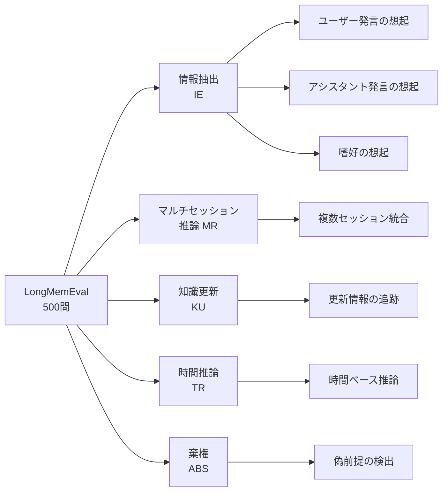

## 論文概要（Abstract）

本記事は [arXiv:2410.10813](https://arxiv.org/abs/2410.10813)（ICLR 2025採択）の解説記事です。

Wu, Wang, Yu, Zhang, Chang, Yu (2024) は、チャットアシスタントの長期対話メモリを体系的に評価するベンチマーク **LongMemEval** を提案している。500問の手動キュレーション質問を含み、情報抽出・マルチセッション推論・知識更新・時間推論・棄権の5つの基本能力を評価する。商用チャットシステム（ChatGPT, Coze等）では長期記憶において30-64%の精度低下が観測され、長コンテキストLLMでも30-55%のドロップが報告されている。著者らは3段階メモリアーキテクチャ（索引化・検索・読み取り）と3つの最適化戦略を提案し、検索Recall@kを平均9.4%、最終精度を5.4%改善したと報告している。

この記事は [Zenn記事: Mem0×MCPサーバーで社内チャットボットに長期記憶を実装する](https://zenn.dev/0h_n0/articles/95c280371f117e) の深掘りです。

## 情報源

- **会議名**: ICLR 2025（International Conference on Learning Representations）
- **年**: 2025
- **URL**: [https://arxiv.org/abs/2410.10813](https://arxiv.org/abs/2410.10813)
- **著者**: Di Wu, Hongwei Wang, Wenhao Yu, Yuwei Zhang, Kai-Wei Chang, Dong Yu
- **分野**: cs.CL, cs.AI

## カンファレンス情報

ICLRは機械学習・深層学習分野の最高峰会議の1つで、表現学習に焦点を当てている。本論文は査読を通過してConference Paper（メインカンファレンス）として採択されている。

## 背景と動機

LLMベースのチャットアシスタントが実用化される中、長期にわたる対話履歴の記憶と活用は未解決の課題である。著者らは以下の問題を指摘している。

- 既存のベンチマーク（LoCoMo等）は履歴長が固定で、スケーラビリティの評価ができない
- アシスタント側の情報想起（アシスタントが過去に提供した回答の記憶）を評価するベンチマークが存在しない
- 長期設定での知識更新（ユーザーの引っ越しや転職など）を評価する手法がない

LongMemEvalはこれらのギャップを埋め、メモリシステムの設計選択がどの能力にどう影響するかを体系的に分析できるフレームワークを提供している。

## 技術的詳細（Technical Details）

### ベンチマーク設計：5つの基本能力

LongMemEvalは500問の質問を以下の5カテゴリに分類して評価する。



**データセット規模**:
- **LongMemEvalS**: 約115,000トークン/質問（約50セッション）
- **LongMemEvalM**: 500セッション（約150万トークン）

データソースの構成は、ShareGPT 25%、UltraChat 25%、属性オントロジーからのシミュレーション 50%である。属性オントロジーは164のユーザー属性（人口統計7、ライフスタイル25+、状況文脈、ライフイベント12+、所有物15+）をカバーしている。品質管理として、LLM生成セッションの約70%は人間による編集が必要とされ、最終的な採用率は約5%（1000候補から約50問/タイプ）と報告されている。

### 3段階メモリアーキテクチャ

著者らは長期メモリシステムを3段階のパイプラインとして定式化している。

**Stage 1: 索引化（Indexing）**

対話履歴 $(t_i, S_i)$（タイムスタンプ $t_i$ とセッション $S_i$ のペア）をキー・バリューペアに変換する。2つの設計選択が存在する。

- **CP1（バリュー粒度）**: セッション単位、ラウンド（発話ペア）単位、要約/ファクト抽出のいずれかを格納
- **CP2（キー設計）**: バリューそのもの、または抽出特徴（サマリ、キーフレーズ、ファクト）で拡張したキー

**Stage 2: 検索（Retrieval）**

クエリを定式化し、密ベクトル検索で上位 $k$ 件を取得する。検索にはStella V5（1.5B、MTEBトップランカー）を使用している。

$$
\text{Retrieve}(q, \mathcal{M}, k) = \text{Top-}k_{(k_i, v_i) \in \mathcal{M}} \cos(\mathbf{e}_q, \mathbf{e}_{k_i})
$$

ここで $\mathbf{e}_q$ はクエリの埋め込み、$\mathbf{e}_{k_i}$ はキーの埋め込み、$\mathcal{M}$ はメモリストアである。

**Stage 3: 読み取り（Reading）**

検索結果をLLMに入力し、応答を生成する。Chain-of-Note（CoN）とJSON形式の組み合わせが最も効果的とされている。

### 3つの最適化戦略

**戦略1: セッション分解（CP1最適化）**

セッション単位ではなくラウンド（発話ペア）単位に分解することで、検索粒度を細かくする。

論文の実験結果より、GPT-4oをリーダーとした場合の精度（LongMemEvalM, top-5検索）:
- セッション単位: 0.615
- ラウンド単位: 0.670（+8.9%）
- ファクト抽出のみ: 0.588（情報欠損による低下）

著者らは「セッションをラウンドに分解することで、GPT-4oリーダーの読み取り性能が有意に向上する」と述べている。

**戦略2: ファクト拡張キー展開（CP2最適化）**

バリューからファクトを抽出し、キーに連結することで検索精度を向上させる。

論文の検索性能テーブルより（LongMemEvalM、ラウンド単位）:

| キー設計 | Recall@5 | NDCG@5 | Recall@10 | NDCG@10 |
|---|---|---|---|---|
| K = V（ラウンド） | 0.582 | 0.481 | 0.692 | 0.512 |
| K = V + fact | **0.644** | **0.498** | **0.784** | **0.536** |
| K = V + keyphrase | 0.478 | 0.359 | 0.636 | 0.410 |

ファクト拡張は「Recall@kで平均9.4%、最終精度で5.4%の改善」を達成している。一方、キーフレーズ拡張はノイズを導入してRecallを低下させている。

下流QA精度への影響（ラウンド単位、K = V + fact）:
- GPT-4o: 0.657（vs ベースライン 0.615、+6.8%）
- Llama 3.1 70B: 0.638（vs ベースライン 0.600、+6.3%）

**戦略3: 時間認識クエリ拡張（CP3最適化）**

クエリから時間範囲を抽出し、無関係なセッションをフィルタリングする。

論文の時間推論サブセット結果より（LongMemEvalM、ラウンド単位）:

| 構成 | Recall@5 | NDCG@5 | Recall@10 | NDCG@10 |
|---|---|---|---|---|
| K = V（ベースライン） | 0.421 | 0.462 | 0.499 | 0.511 |
| + クエリ拡張（GPT-4o） | **0.451** | **0.565** | 0.495 | **0.538** |
| K = V + fact | 0.489 | 0.500 | 0.550 | 0.598 |
| K = V + fact + クエリ拡張 | **0.526** | **0.548** | **0.722** | **0.669** |

時間認識拡張は「ラウンド単位で平均11.3%、セッション単位で6.8%のRecall改善」を達成している。

### 読み取り戦略の比較（CP4）

Oracle検索設定（正解証拠のみ提供）での読み取り精度:

| リーダー + 戦略 | GPT-4o | Llama 3.1 70B | Llama 3.1 8B |
|---|---|---|---|
| CoNなし, 自然言語 | ~0.85 | ~0.70 | ~0.62 |
| CoNあり, JSON | ~0.93 | ~0.82 | ~0.70 |

Chain-of-NoteとJSON形式の組み合わせは「3つのLLM全体で最大10ポイントの絶対的改善」をもたらすと報告されている。

## 実験結果（Results）

### 商用チャットシステムの長期記憶性能

論文の実験結果より、商用システムのオフライン読解能力とオンラインメモリ性能の比較を示す。

| システム | LLM | オフライン | オンライン | 低下率 |
|---|---|---|---|---|
| ChatGPT (GPT-4o) | GPT-4o | 0.918 | 0.577 | **37%** |
| ChatGPT (GPT-4o mini) | GPT-4o-mini | — | 0.711 | — |
| Coze (GPT-4o) | GPT-4o | 0.918 | 0.330 | **64%** |
| Coze (GPT-3.5) | GPT-3.5 | — | 0.247 | — |

著者らは「GPT-4oを搭載したChatGPTとCozeは、オフライン読解と比較してそれぞれ37%と64%の性能低下を示す」と報告している。

### 長コンテキストLLMの性能（LongMemEvalS）

| モデル | サイズ | Oracle | フル履歴 | 低下率 |
|---|---|---|---|---|
| GPT-4o | — | 0.870 | 0.606 | **30.3%** |
| Llama 3.1 | 70B | 0.744 | 0.334 | **55.1%** |
| Llama 3.1 | 8B | 0.710 | 0.454 | **36.1%** |
| Phi-3 128k | 14B | 0.702 | 0.380 | **45.9%** |

「現行システムは効果的なメモリメカニズムなしに増大する対話履歴の管理に苦労し続けている」と著者らは結論づけている。

### Mem0との関連

LongMemEvalはMem0が評価に使用するLoCoMoベンチマークとは異なるが、相補的な知見を提供する。

- **LoCoMo**: 10会話・各約26,000トークン。Single-hop、Multi-hop、Temporal、Open-domainの4カテゴリ
- **LongMemEval**: 500セッション・最大150万トークン。5つの基本能力を網羅し、スケーラブルな履歴長を実現

Mem0が報告するLoCoMoスコア（J=66.88%）は、LongMemEvalの文脈ではRAGベースの手法に該当する。LongMemEvalの提案するファクト拡張キー展開やセッション分解は、Mem0のメモリ検索パイプラインにも直接適用可能な最適化戦略である。

## 実装のポイント（Implementation）

### LongMemEvalの3段階パイプラインの実装例

```python
from dataclasses import dataclass
from typing import Any

import numpy as np


@dataclass
class MemoryItem:
    key_embedding: np.ndarray
    value: str
    timestamp: str
    facts: list[str]


class LongMemPipeline:
    """LongMemEvalの3段階メモリパイプライン"""

    def __init__(self, embedder: Any, reader_llm: Any) -> None:
        self.embedder = embedder
        self.reader_llm = reader_llm
        self.memory_store: list[MemoryItem] = []

    def index_session(self, session: dict[str, Any]) -> None:
        """Stage 1: セッションをラウンド単位で索引化し、ファクト拡張キーを生成"""
        for round_pair in session["rounds"]:
            value = f"User: {round_pair['user']}\nAssistant: {round_pair['assistant']}"
            facts = self.extract_facts(value)
            expanded_key = value + "\n" + "\n".join(facts)

            key_embedding = self.embedder.encode(expanded_key)

            self.memory_store.append(
                MemoryItem(
                    key_embedding=key_embedding,
                    value=value,
                    timestamp=session["timestamp"],
                    facts=facts,
                )
            )

    def retrieve(self, query: str, top_k: int = 5) -> list[MemoryItem]:
        """Stage 2: 密ベクトル検索で上位k件を取得"""
        query_embedding = self.embedder.encode(query)
        similarities = [
            np.dot(query_embedding, item.key_embedding)
            / (np.linalg.norm(query_embedding) * np.linalg.norm(item.key_embedding))
            for item in self.memory_store
        ]
        top_indices = np.argsort(similarities)[-top_k:][::-1]
        return [self.memory_store[i] for i in top_indices]

    def read(self, query: str, retrieved: list[MemoryItem]) -> str:
        """Stage 3: Chain-of-Note + JSON形式で読み取り"""
        context = "\n---\n".join(
            f"[{item.timestamp}] {item.value}" for item in retrieved
        )
        prompt = f"""以下の対話履歴を参照して質問に回答してください。

## 対話履歴
{context}

## 質問
{query}

## 指示
1. まず関連する証拠をJSON形式で列挙してください
2. 次に証拠に基づいて回答を生成してください
"""
        return self.reader_llm.generate(prompt)

    def extract_facts(self, text: str) -> list[str]:
        """テキストからファクトを抽出する"""
        ...
```

### 実装時の注意点

- ファクト拡張キー展開は検索精度を9.4%改善するが、索引サイズが約2倍になるトレードオフがある
- Stella V5（1.5B）は検索精度が高いが、セルフホスト環境ではGPUメモリを約3GB消費する。text-embedding-3-smallで代替する場合は精度低下を計測すべき
- 時間認識クエリ拡張にGPT-4oを使用すると高精度だが、Llama 3.1 8Bでは逆にRecallが低下する。軽量モデルでの時間抽出は品質に注意が必要

## 実運用への応用（Practical Applications）

LongMemEvalの知見は社内チャットボットのメモリ設計に以下の形で活用できる。

- **索引化戦略**: セッション単位ではなくラウンド（発話ペア）単位で分割することで、Mem0の検索粒度を最適化できる。実験では8.9%の精度向上が示されている
- **キー設計**: Mem0のファクト抽出結果をベクトル検索のキーに連結することで、Recall@5が0.582→0.644に改善される
- **棄権能力**: 「わからない」と回答すべきケース（偽前提の質問）に対する適切な応答は、社内チャットボットの信頼性に直結する。LongMemEvalはこの能力を明示的に評価している
- **知識更新**: ユーザーの部署異動や使用ツールの変更を追跡する機能は、Mem0のUPDATE/DELETE操作で対応可能だが、精度の検証にはLongMemEvalのKUカテゴリが有用

## 関連研究（Related Work）

- **LoCoMo (ACL 2024)**: 10会話・200問/会話の長期対話メモリベンチマーク。Mem0の主要評価データセット。LongMemEvalと比較して規模は小さいが、single-hop/multi-hop/temporal/open-domainの4カテゴリ評価を提供
- **LOCCO (ACL 2025)**: 100ユーザー・3,080対話の長期チャットボットメモリデータセット。LongMemEvalとは異なり実ユーザーの対話データに基づく
- **HyperMem (arXiv:2604.08256)**: ハイパーグラフメモリにより高次関連を捉え、LoCoMoでLLM-as-a-Judge精度92.73%を達成

## まとめと今後の展望

LongMemEvalは長期対話メモリの5つの基本能力を体系的に評価し、現行の商用チャットシステム・長コンテキストLLMが30-64%の精度低下を示すことを明らかにした。提案された3段階メモリアーキテクチャと3つの最適化戦略（セッション分解、ファクト拡張キー展開、時間認識クエリ拡張）は、Mem0を含むメモリシステムの検索精度改善に直接適用可能である。社内チャットボットの長期記憶設計においては、LongMemEvalの5カテゴリ評価を定期的な品質モニタリングに活用することが推奨される。

## 参考文献

- **Conference URL**: [https://arxiv.org/abs/2410.10813](https://arxiv.org/abs/2410.10813)
- **ICLR 2025**: [https://iclr.cc/](https://iclr.cc/)
- **Code**: [https://github.com/xiaowu0162/LongMemEval](https://github.com/xiaowu0162/LongMemEval)
- **Related Zenn article**: [https://zenn.dev/0h_n0/articles/95c280371f117e](https://zenn.dev/0h_n0/articles/95c280371f117e)
