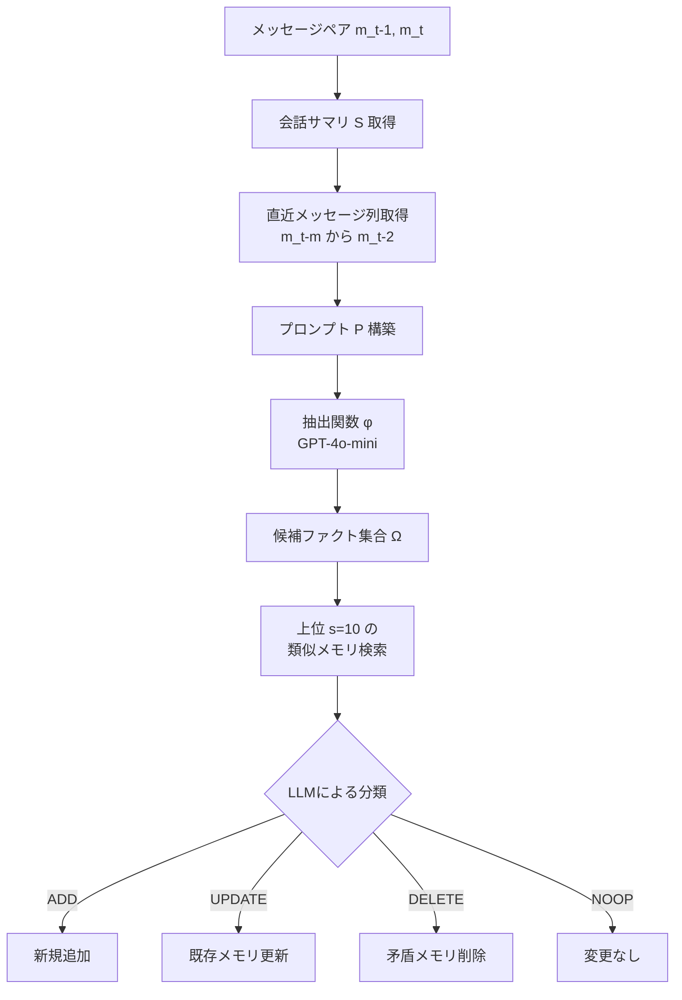

## 論文概要（Abstract）

本記事は [arXiv:2504.19413](https://arxiv.org/abs/2504.19413) の解説記事です。

Chhikara, Khant, Aryan, Singh, Yadav (2025) は、LLMエージェント向けのスケーラブルな長期記憶システム **Mem0** を提案している。Mem0は会話から事実（ファクト）を動的に抽出・統合・検索する2段階パイプラインと、関係構造を捉えるグラフ拡張版 **Mem0^g** を組み合わせ、LoCoMoベンチマークにおいてOpenAI MemoryやZepを含む6カテゴリのベースラインに対して26%の相対的改善を達成したと報告している。同時に、フルコンテキスト方式と比較してp95レイテンシを91%削減し、トークン消費を90%以上削減している。

この記事は [Zenn記事: Mem0×MCPサーバーで社内チャットボットに長期記憶を実装する](https://zenn.dev/0h_n0/articles/95c280371f117e) の深掘りです。

## 情報源

- **arXiv ID**: 2504.19413
- **URL**: [https://arxiv.org/abs/2504.19413](https://arxiv.org/abs/2504.19413)
- **著者**: Prateek Chhikara, Dev Khant, Saket Aryan, Taranjeet Singh, Deshraj Yadav
- **発表年**: 2025（ECAI 2025に採択）
- **分野**: cs.CL, cs.AI

## 背景と動機（Background & Motivation）

LLMの固定コンテキストウィンドウは、長期にわたる会話で深刻な制約となる。ユーザーが数日から数週間にわたって同じエージェントとやり取りする場合、初期の会話内容はコンテキストウィンドウから溢れてしまう。

従来のアプローチには以下の問題がある。

- **フルコンテキスト方式**: 全会話履歴をプロンプトに含めるため、トークンコストが線形に増大し、レイテンシも悪化する。26,000トークン規模の会話ではp95レイテンシが17秒を超える
- **RAG方式**: ドキュメントチャンクを検索するため、会話特有の文脈（誰が・いつ・何を言ったか）を失いやすい
- **既存メモリシステム（Zep等）**: トークン消費が600,000以上に膨張する実装や、非同期処理遅延による即時検索の失敗が報告されている

著者らは、これらの課題を解決するために「ファクト単位の抽出と管理」に特化したメモリレイヤーが必要だと主張している。

## 主要な貢献（Key Contributions）

- **Mem0アーキテクチャ**: 会話から事実を動的に抽出・統合・検索するスケーラブルなメモリシステム
- **グラフ拡張版Mem0^g**: エンティティ間の関係構造をNeo4jグラフデータベースで表現し、時間推論と多段推論の精度を向上
- **包括的ベンチマーク**: LoCoMoデータセット上で6カテゴリのベースラインとの体系的な比較評価

## 技術的詳細（Technical Details）

### 2段階インクリメンタルメモリパイプライン

Mem0のメモリパイプラインは**抽出フェーズ**と**更新フェーズ**の2段階で構成される。



**抽出フェーズ**では、ユーザーとアシスタントのメッセージペア $(m_{t-1}, m_t)$ を入力として受け取る。データベースから取得した会話サマリ $S$ と直近 $m=10$ 件のメッセージ列を組み合わせて、プロンプト $P = (S, \{m_{t-m}, \ldots, m_{t-2}\}, m_{t-1}, m_t)$ を構築する。このプロンプトをGPT-4o-miniに入力し、候補ファクト集合 $\Omega = \{\omega_1, \omega_2, \ldots, \omega_n\}$ を抽出する。

**更新フェーズ**では、各候補ファクトに対してtext-embedding-3-smallで生成したベクトル埋め込みを用いて、既存メモリから上位 $s=10$ 件の類似メモリを検索する。LLMがFunction Callingにより以下の4操作のいずれかを選択する。

- **ADD**: 意味的に類似するメモリが存在しない場合、新規追加
- **UPDATE**: 既存メモリを拡充する情報がある場合、情報量が大きい方で置換
- **DELETE**: 既存メモリと矛盾する場合、該当メモリを削除
- **NOOP**: 変更不要

更新フェーズのアルゴリズムを擬似コードで示す。

```python
from dataclasses import dataclass


@dataclass
class Memory:
    id: str
    content: str
    embedding: list[float]


def update_memory(
    candidate_facts: list[str],
    existing_memories: list[Memory],
    similarity_threshold: float = 0.8,
) -> list[Memory]:
    """候補ファクトに基づいてメモリを更新する"""
    for fact in candidate_facts:
        fact_embedding = embed(fact)  # text-embedding-3-small
        similar = retrieve_top_k(fact_embedding, existing_memories, k=10)

        operation = classify_operation(fact, similar)  # LLM Function Calling

        if operation == "ADD":
            new_memory = Memory(id=generate_id(), content=fact, embedding=fact_embedding)
            existing_memories.append(new_memory)
        elif operation == "UPDATE":
            target = similar[0]
            if information_content(fact) > information_content(target.content):
                target.content = fact
                target.embedding = fact_embedding
        elif operation == "DELETE":
            target = similar[0]
            existing_memories.remove(target)

    return existing_memories
```

### グラフメモリ拡張（Mem0^g）

Mem0^gはベクトルメモリに加えて、エンティティ間の関係構造をグラフ $G = (V, E, L)$ で表現する。

- **ノード $V$**: エンティティ（人名、場所、日時、イベントなど）
- **エッジ $E$**: エンティティ間の関係（lives_in, prefers, owns など）
- **ラベル $L$**: 意味的分類（Person, Location, Event, Attribute）

各エンティティノード $v \in V$ は、エンティティタイプ、埋め込みベクトル $\mathbf{e}_v$、作成タイムスタンプ $t_v$ を保持する。関係はトリプレット $(v_s, r, v_d)$ として格納される。

**抽出プロセス**は2段階で構成される。

1. **エンティティ抽出器**: 会話から重要な情報単位を識別
2. **関係生成器**: エンティティ間の意味的接続を導出

**競合解決**では、新規トリプレットのソース・デスティネーションエンティティの埋め込みを計算し、閾値 $t$ 以上の類似ノードを検索する。類似ノードが見つかった場合はマージし、矛盾する関係にはLLMベースの更新リゾルバが無効マークを付与する。

**検索戦略**はデュアル方式を採用している。

1. **エンティティ中心検索**: クエリからエンティティを識別 → グラフノードを特定 → 入出エッジを探索
2. **セマンティックトリプレット検索**: クエリ全体を埋め込み化 → 関係トリプレットとの類似度マッチング → ランキング

バックエンドにはNeo4jグラフデータベースを使用し、GPT-4o-miniのFunction Callingでエンティティと関係を抽出する。

## 実験結果（Results）

### LoCoMoベンチマークでの性能比較

LoCoMoデータセットは10件の長期会話（各約600対話・約26,000トークン）で構成され、single-hop、multi-hop、temporal、open-domainの4カテゴリの質問で評価される。

論文Table 1より、LLM-as-a-Judge（J）メトリクスの結果を以下に示す。

| 手法 | Single-Hop J | Multi-Hop J | Open-Domain J | Temporal J |
|---|---|---|---|---|
| **Mem0** | **67.13 ± 0.65** | **51.15 ± 0.31** | 72.93 ± 0.11 | 55.51 ± 0.34 |
| **Mem0^g** | 65.71 ± 0.45 | 47.19 ± 0.67 | **75.71 ± 0.21** | **58.13 ± 0.44** |
| Zep | 61.70 ± 0.32 | 41.35 ± 0.48 | 76.60 ± 0.13 | 49.31 ± 0.50 |
| OpenAI Memory | 63.79 ± 0.46 | 42.92 ± 0.63 | 62.29 ± 0.12 | 21.71 ± 0.20 |
| LangMem | 62.23 ± 0.75 | 47.92 ± 0.47 | 71.12 ± 0.20 | 23.43 ± 0.39 |
| Full-Context | 72.90 ± 0.19 | — | — | — |

### レイテンシとトークン消費

論文Table 2より、デプロイメントメトリクスを以下に示す。

| 手法 | 検索レイテンシ p50 | 総レイテンシ p95 | 全体 J | トークン |
|---|---|---|---|---|
| **Mem0** | 0.148s | 1.440s | 66.88% | ~7k |
| **Mem0^g** | 0.476s | 2.590s | 68.44% | ~14k |
| Zep | 0.513s | 2.926s | 65.99% | 600k+ |
| OpenAI Memory | — | 0.889s | 52.90% | ~4,437 |
| Full-Context | — | 17.117s | 72.90% | ~26k |
| LangMem | 17.99s | 60.40s | 58.10% | — |
| RAG (k=2, 8192) | 0.288s | 9.942s | 60.53% | — |

著者らは以下の知見を報告している。

- Mem0はフルコンテキスト方式と比較してp95レイテンシを91%削減（1.440s vs 17.117s）
- トークン消費はフルコンテキスト方式の約27%（7k vs 26k）に圧縮
- Zepは600k以上のトークンを消費し、Mem0の約86倍のトークンオーバーヘッドが発生
- Zepでは「メモリ追加直後の検索が正しく動作せず、数時間後に再検索すると改善される」非同期処理の遅延が報告されている

### Mem0とMem0^gのトレードオフ

| 観点 | Mem0 | Mem0^g |
|---|---|---|
| Single-hop | 優秀（67.13） | やや低い（65.71） |
| Multi-hop | 優秀（51.15） | 低い（47.19） |
| Temporal推論 | 良好（55.51） | 優秀（58.13、+2.6%） |
| Open-domain | 良好（72.93） | 優秀（75.71） |
| レイテンシ | 最速（p95: 1.44s） | 約3.6倍遅い |
| トークン | 最小（~7k） | 2倍のオーバーヘッド |

グラフ拡張は時間推論とオープンドメイン質問で改善を示すが、レイテンシとトークンのコストが増大するトレードオフがある。

## 実装のポイント（Implementation）

### Embeddingモデルとハイパーパラメータ

- **Embedding**: OpenAI text-embedding-3-small（1536次元）
- **抽出LLM**: GPT-4o-mini（temperature=0）
- **直近メッセージ数**: $m=10$（メモリ抽出時のコンテキスト）
- **類似メモリ検索数**: $s=10$（更新フェーズでの比較対象）
- **グラフバックエンド**: Neo4j（Mem0^gの場合）

### 非同期サマリ生成

会話サマリ $S$ はメインパイプラインとは独立して非同期で更新される。著者らは「このコンポーネントはメインの処理パイプラインとは独立して動作し、メモリ抽出が常に最新のコンテキスト情報から恩恵を受けられるようにしつつ、処理遅延を導入しない」と述べている。

### 実装時の注意点

- Function Callingによる操作分類は、プロンプトエンジニアリングの品質に大きく依存する。ADD/UPDATE/DELETE/NOOPの境界条件（類似度閾値の設定）は運用環境で調整が必要
- グラフメモリのエンティティマージ処理は、同一人物の異なる表記（「田中」と「田中さん」）に対するロバスト性が課題
- LoCoMoベンチマークは英語データセットであり、日本語環境では抽出・検索の精度が変動する可能性がある

## Production Deployment Guide

### AWS実装パターン（コスト最適化重視）

Mem0ベースのメモリレイヤーをAWSで運用する場合のトラフィック量別推奨構成を示す。

| 規模 | 月間リクエスト | 推奨構成 | 月額コスト | 主要サービス |
|---|---|---|---|---|
| **Small** | ~3,000 (100/日) | Serverless | $50-150 | Lambda + Bedrock + DynamoDB |
| **Medium** | ~30,000 (1,000/日) | Hybrid | $300-800 | Lambda + ECS Fargate + ElastiCache |
| **Large** | 300,000+ (10,000/日) | Container | $2,000-5,000 | EKS + Karpenter + EC2 Spot |

**Small構成の詳細**（月額$50-150）:
- **Lambda**: 1GB RAM, 60秒タイムアウト（$20/月）
- **Bedrock**: Claude 3.5 Haiku（ファクト抽出用、$80/月）
- **DynamoDB**: On-Demand（メタデータ永続化、$10/月）
- **OpenSearch Serverless**: ベクトル検索用（$30/月、または ElastiCache for Valkey）

**コスト削減テクニック**:
- Bedrock Batch APIで非リアルタイム処理を50%割引
- Prompt Caching有効化で30-90%のトークンコスト削減
- ElastiCache for Valkeyのセマンティックキャッシュでembedding再計算を回避
- Lambda Power Tuningで最適メモリサイズを決定

**コスト試算の注意事項**: 上記は2026年8月時点のAWS ap-northeast-1（東京）リージョン料金に基づく概算値です。実際のコストはトラフィックパターン、リージョン、バースト使用量により変動します。最新料金は [AWS料金計算ツール](https://calculator.aws/) で確認してください。

### Terraformインフラコード

**Small構成 (Serverless): Lambda + Bedrock + DynamoDB**

```hcl
module "vpc" {
  source  = "terraform-aws-modules/vpc/aws"
  version = "~> 5.0"

  name = "mem0-vpc"
  cidr = "10.0.0.0/16"
  azs  = ["ap-northeast-1a", "ap-northeast-1c"]
  private_subnets = ["10.0.1.0/24", "10.0.2.0/24"]

  enable_nat_gateway   = false
  enable_dns_hostnames = true
}

resource "aws_iam_role" "lambda_mem0" {
  name = "lambda-mem0-role"

  assume_role_policy = jsonencode({
    Version = "2012-10-17"
    Statement = [{
      Action = "sts:AssumeRole"
      Effect = "Allow"
      Principal = { Service = "lambda.amazonaws.com" }
    }]
  })
}

resource "aws_iam_role_policy" "bedrock_invoke" {
  role = aws_iam_role.lambda_mem0.id

  policy = jsonencode({
    Version = "2012-10-17"
    Statement = [{
      Effect   = "Allow"
      Action   = ["bedrock:InvokeModel", "bedrock:InvokeModelWithResponseStream"]
      Resource = "arn:aws:bedrock:ap-northeast-1::foundation-model/anthropic.claude-3-5-haiku*"
    }]
  })
}

resource "aws_lambda_function" "mem0_handler" {
  filename      = "lambda.zip"
  function_name = "mem0-memory-handler"
  role          = aws_iam_role.lambda_mem0.arn
  handler       = "index.handler"
  runtime       = "python3.12"
  timeout       = 60
  memory_size   = 1024

  environment {
    variables = {
      BEDROCK_MODEL_ID = "anthropic.claude-3-5-haiku-20241022-v1:0"
      DYNAMODB_TABLE   = aws_dynamodb_table.mem0_cache.name
    }
  }
}

resource "aws_dynamodb_table" "mem0_cache" {
  name         = "mem0-memory-store"
  billing_mode = "PAY_PER_REQUEST"
  hash_key     = "memory_id"

  attribute {
    name = "memory_id"
    type = "S"
  }

  ttl {
    attribute_name = "expire_at"
    enabled        = true
  }
}

resource "aws_cloudwatch_metric_alarm" "lambda_cost" {
  alarm_name          = "mem0-lambda-cost-spike"
  comparison_operator = "GreaterThanThreshold"
  evaluation_periods  = 1
  metric_name         = "Duration"
  namespace           = "AWS/Lambda"
  period              = 3600
  statistic           = "Sum"
  threshold           = 100000
  alarm_description   = "Lambda実行時間異常（コスト急増の可能性）"

  dimensions = {
    FunctionName = aws_lambda_function.mem0_handler.function_name
  }
}
```

### 運用・監視設定

```python
import boto3

cloudwatch = boto3.client("cloudwatch")

cloudwatch.put_metric_alarm(
    AlarmName="mem0-token-spike",
    ComparisonOperator="GreaterThanThreshold",
    EvaluationPeriods=1,
    MetricName="TokenUsage",
    Namespace="Custom/Mem0",
    Period=3600,
    Statistic="Sum",
    Threshold=500000,
    ActionsEnabled=True,
    AlarmActions=["arn:aws:sns:ap-northeast-1:123456789:cost-alerts"],
    AlarmDescription="Mem0トークン使用量異常",
)
```

### コスト最適化チェックリスト

- [ ] ~100 req/日 → Lambda + Bedrock (Serverless) — $50-150/月
- [ ] ~1000 req/日 → ECS Fargate + ElastiCache (Hybrid) — $300-800/月
- [ ] 10000+ req/日 → EKS + Spot Instances (Container) — $2,000-5,000/月
- [ ] Spot Instances: 最大90%削減（Karpenter自動管理）
- [ ] Reserved Instances: 1年コミットで72%削減
- [ ] Bedrock Batch API: 50%割引（非リアルタイムのファクト抽出に適用）
- [ ] Prompt Caching: 30-90%削減（システムプロンプト固定部分）
- [ ] AWS Budgets: 月額予算80%で警告、100%でアラート
- [ ] CloudWatch: トークン使用量スパイク検知
- [ ] Cost Anomaly Detection: 自動異常検知
- [ ] 日次コストレポート: SNS/Slackへ自動送信
- [ ] Lambda Power Tuning: メモリサイズ最適化
- [ ] ElastiCache: セマンティックキャッシュでembedding再計算回避
- [ ] S3ライフサイクル: 30日超のキャッシュ自動削除
- [ ] 開発環境: 夜間停止（ECS/ElastiCache）
- [ ] DynamoDB TTL: 期限切れメモリの自動削除
- [ ] タグ戦略: 環境別（dev/staging/prod）でコスト可視化
- [ ] CloudWatch Logs Insights: 1時間あたりのトークン使用量監視
- [ ] X-Ray: エンドツーエンドのレイテンシトレーシング
- [ ] Trusted Advisor: 未使用リソース検出

## 実運用への応用（Practical Applications）

Mem0のアーキテクチャは社内チャットボットに以下の形で応用できる。

- **ヘルプデスクボット**: ユーザーの部署・使用ツール・過去の問い合わせをユーザープロファイルメモリに蓄積し、回答のパーソナライズに活用。論文のベンチマークではフルコンテキスト方式の72.90%に対してMem0は66.88%だが、トークン消費は73%削減される
- **プロジェクト管理ボット**: タスク状態をグラフメモリ（Mem0^g）で管理し、「先週のスプリントで担当者Aが対応したタスク」のような時間的・関係的クエリに対応。Temporal推論ではMem0^gが58.13%でMem0（55.51%）を上回る
- **オンボーディングボット**: 新入社員の学習進捗を追跡し、既に説明した内容をスキップ。ADD-only方式により、古い情報の誤削除リスクを低減

## 関連研究（Related Work）

- **Zep**: 会話メモリプラットフォーム。LoCoMoでJ=65.99%だが、トークン消費が600k+と膨大。非同期処理による検索遅延も報告されている
- **LangMem**: 構造化メモリ管理。J=58.10%で、検索レイテンシがp50で17.99秒と実用には課題がある
- **A-MEM**: エージェンティックメモリ。J=48.38%で、他手法に比べて低い精度にとどまっている

## まとめと今後の展望

Mem0は2段階パイプライン（抽出→更新）によるファクト単位のメモリ管理と、グラフ拡張による関係構造の表現を組み合わせ、トークン効率と検索精度の両立を達成している。論文のLoCoMoベンチマークでは全体J=66.88%（Mem0）/ 68.44%（Mem0^g）を記録し、フルコンテキスト方式（72.90%）との精度差を4-6ポイントに抑えながら、レイテンシとトークン消費を大幅に削減している。社内チャットボットへの適用では、ユースケースに応じてベクトルメモリとグラフメモリを使い分けることが実効的な設計指針となる。

## 参考文献

- **arXiv**: [https://arxiv.org/abs/2504.19413](https://arxiv.org/abs/2504.19413)
- **Mem0 GitHub**: [https://github.com/mem0ai/mem0](https://github.com/mem0ai/mem0)
- **LoCoMo Benchmark**: [Evaluating Very Long-Term Conversational Memory of LLM Agents (ACL 2024)](https://aclanthology.org/2024.acl-long.747/)
- **Related Zenn article**: [https://zenn.dev/0h_n0/articles/95c280371f117e](https://zenn.dev/0h_n0/articles/95c280371f117e)
