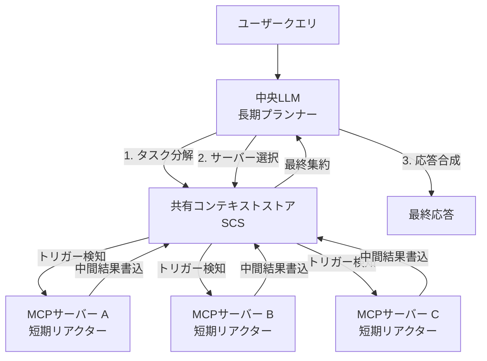

## 論文概要（Abstract）

本記事は [arXiv:2601.11595](https://arxiv.org/abs/2601.11595) の解説記事です。

Jayanti, Han (2026) は、AnthropicのModel Context Protocol（MCP）の制約を解決するContext-Aware MCP（CA-MCP）を提案している。標準MCPではLLMがタスク分解から実行調整までを一手に担い、サーバーはステートレスに動作するため、複雑なタスクではLLM呼び出し回数の増大と応答失敗が課題となる。CA-MCPは共有コンテキストストア（SCS）を導入し、MCPサーバー間の自律的な協調を実現することで、TravelPlannerベンチマークにおいてLLM呼び出しを60%削減し、実行時間を67.8%短縮したと報告している。

この記事は [Zenn記事: Mem0×MCPサーバーで社内チャットボットに長期記憶を実装する](https://zenn.dev/0h_n0/articles/95c280371f117e) の深掘りです。

## 情報源

- **arXiv ID**: 2601.11595
- **URL**: [https://arxiv.org/abs/2601.11595](https://arxiv.org/abs/2601.11595)
- **著者**: Meenakshi Amulya Jayanti, X.Y. Han
- **発表年**: 2026（v2: 2026年1月22日改訂）
- **分野**: cs.DC, cs.LG, cs.SE

## 背景と動機（Background & Motivation）

AnthropicがModel Context Protocol（MCP）を公開したことで、LLMアプリケーションが外部ツールやデータソースにアクセスするための標準インターフェースが確立された。しかし、標準MCPには以下の構造的制約がある。

- **ステートレスサーバー**: MCPサーバーは呼び出しごとに状態をリセットするため、タスク間での文脈の引き継ぎができない
- **LLM中心の調整**: すべてのタスク分解・実行順序の制御がLLMに依存し、複雑なタスクではLLM呼び出し回数が増大する
- **コンテキストウィンドウ制約**: 長いタスクシーケンスでは中間状態がコンテキストウィンドウを圧迫し、カスケード的なエラーを引き起こす

著者らは、MCPサーバーに共有メモリを持たせることで、サーバー間の自律的な協調が可能になり、LLMの介入を最小限に抑えられると主張している。

## 主要な貢献（Key Contributions）

- **CA-MCPアーキテクチャ**: 共有コンテキストストア（SCS）を介したサーバー間の自律的な協調メカニズム
- **LLM呼び出し削減**: 中央LLMは計画と要約の2回のみ呼び出され、実行フェーズではサーバーが自律的に動作
- **統計的に有意な改善**: TravelPlanner（500クエリ）で実行時間67.8%削減、完全性30.9%向上

## 技術的詳細（Technical Details）

### CA-MCPの3コンポーネントアーキテクチャ



CA-MCPは3つのコンポーネントで構成される。

**中央LLM（長期プランナー）**: タスクの初期分解と最終応答の合成のみを担当する。構造化JSONプランをSCSにシードし（ステップ1-2）、実行フェーズでは介入しない。最後に中間結果を集約して最終応答を生成する（ステップ3）。

**MCPサーバー（短期リアクター）**: SCSを監視し、関連するトリガー条件（例: `location_done`）を検知すると自律的に動作する。コンテキストの読み取り → 計算実行 → 結果のSCS書き込み → 後続タスクへのシグナル送信を行う。サーバー間のピアツーピア通信は不要で、SCSを介した間接的な協調を実現する。

**共有コンテキストストア（SCS）**: 著者らは「タスク状態、制約、中間出力のための唯一の情報源として機能する集中型ブラックボード」と記述している。SCSにより、サーバーは直接通信せずにアクションを協調できる。

### 標準MCPとCA-MCPの動作シーケンス比較

**標準MCPの動作フロー**:

1. LLMがユーザークエリを解釈
2. LLMがタスクを分解し、最初のサーバーを呼び出し
3. サーバーAが結果を返却
4. LLMが結果を解釈し、次のサーバーを呼び出し（LLM呼び出し+1）
5. サーバーBが結果を返却
6. LLMが結果を解釈し、次のサーバーを呼び出し（LLM呼び出し+1）
7. ...（タスクが完了するまで繰り返し）

**CA-MCPの動作フロー**:

1. LLMがユーザークエリを解釈し、構造化プランをSCSにシード（LLM呼び出し1回目）
2. サーバーAがSCSのトリガーを検知し、自律的に実行 → 結果をSCSに書き込み
3. サーバーBがSCSの更新を検知し、自律的に実行 → 結果をSCSに書き込み
4. サーバーCがSCSの更新を検知し、自律的に実行 → 結果をSCSに書き込み
5. LLMがSCSから最終結果を集約し、応答を合成（LLM呼び出し2回目）

### SCSの実装パターン

SCSは構造化JSONとして実装される。旅行プランナーの例を以下に示す。

```python
from dataclasses import dataclass, field
from typing import Any


@dataclass
class SharedContextStore:
    """共有コンテキストストア — MCPサーバー間の協調メカニズム"""

    goals: dict[str, Any] = field(default_factory=dict)
    constraints: dict[str, Any] = field(default_factory=dict)
    execution_plan: list[dict[str, Any]] = field(default_factory=list)
    intermediate_results: dict[str, Any] = field(default_factory=dict)
    triggers: dict[str, bool] = field(default_factory=dict)

    def seed(self, llm_plan: dict[str, Any]) -> None:
        """LLMが生成した計画でSCSを初期化する"""
        self.goals = llm_plan["goals"]
        self.constraints = llm_plan["constraints"]
        self.execution_plan = llm_plan["steps"]
        self.triggers = {step["id"]: False for step in self.execution_plan}

    def update(self, server_id: str, result: dict[str, Any]) -> None:
        """MCPサーバーが中間結果を書き込む"""
        self.intermediate_results[server_id] = result
        self.triggers[server_id] = True

    def check_trigger(self, dependency: str) -> bool:
        """依存タスクの完了を確認する"""
        return self.triggers.get(dependency, False)
```

### Mem0メモリサーバーへの応用

CA-MCPのアーキテクチャは、Mem0をMCPサーバーとして構成する際に以下の改善をもたらす可能性がある。

- **メモリ検索サーバー**と**ファクト抽出サーバー**をSCSで協調させ、検索結果に基づく動的なファクト更新が可能
- LLMによるメモリ管理の呼び出しを削減し、ファクト抽出のレイテンシを低減
- 複数のメモリタイプ（ユーザープロファイル、インタラクション記憶、タスク記憶）を専用サーバーに分離し、並列検索を実現

## 実験結果（Results）

### TravelPlannerベンチマーク（500クエリ）

論文の実験結果より、主要メトリクスを以下に示す。

| メトリクス | 標準MCP | CA-MCP | 改善率 |
|---|---|---|---|
| **実行時間** | 41.99s | 13.52s | **67.8%削減** |
| **完全性** | 0.764 | 1.000 | **30.9%向上** |
| **BERTScore F1** | 0.745 | 0.757 | +0.012 |
| **LLM呼び出し回数** | 5 | 2 | **60%削減** |

統計的有意性は、実行時間の差（平均28.465秒、標準偏差18.059秒）に対してp値 = $1.60 \times 10^{-137}$（n=500）で確認されている。完全性の差（0.236）もp値 = $4.39 \times 10^{-75}$ で有意である。

### REALM-Bench Wedding Logisticsタスク

| メトリクス | 標準MCP | CA-MCP | 改善率 |
|---|---|---|---|
| **目標達成率** | 1.0 | 1.0 | 同等 |
| **制約充足率** | 1.0 | 1.0 | 同等 |
| **完了時間** | 330分 | 180分 | **45.5%削減** |
| **協調スコア** | 0 | 1 | 改善 |
| **実行時間** | 8.52s | 2.26s | **73.5%削減** |

Wedding Logisticsタスクでは、arrival_tracker、errand_tracker、transportの3つのMCPサーバーがSCSを介して協調し、ゲストの到着管理・用事の処理・車両割り当てを自律的に最適化している。

## 実装のポイント（Implementation）

### MCPサーバーの設計指針

CA-MCPをMem0のようなメモリサーバーに適用する際の設計ポイントを示す。

```python
import json
from typing import Any


class MemoryMCPServer:
    """CA-MCP対応のMem0メモリサーバー"""

    def __init__(self, scs_url: str) -> None:
        self.scs_url = scs_url

    async def on_trigger(self, trigger_id: str, context: dict[str, Any]) -> None:
        """SCSのトリガーを検知して自律的に動作する"""
        if trigger_id == "user_message_received":
            query = context["user_message"]
            memories = await self.search_memories(query, context["user_id"])

            await self.update_scs(
                server_id="memory_server",
                result={
                    "relevant_memories": memories,
                    "memory_count": len(memories),
                    "trigger": "memories_retrieved",
                },
            )

        elif trigger_id == "response_generated":
            conversation = context["conversation"]
            await self.extract_and_store_facts(conversation, context["user_id"])

            await self.update_scs(
                server_id="memory_server",
                result={"trigger": "facts_stored"},
            )

    async def search_memories(
        self, query: str, user_id: str
    ) -> list[dict[str, Any]]:
        """セマンティック検索によるメモリ取得"""
        ...

    async def extract_and_store_facts(
        self, conversation: str, user_id: str
    ) -> None:
        """会話からファクトを抽出して保存"""
        ...

    async def update_scs(
        self, server_id: str, result: dict[str, Any]
    ) -> None:
        """SCSに中間結果を書き込む"""
        ...
```

### 実装時の注意点

- SCSのデータ一貫性を確保するために、楽観的ロック（バージョニング）の導入を検討する。複数サーバーが同時にSCSを更新する場合、競合が発生し得る
- トリガー検知のポーリング間隔はレイテンシとリソース消費のトレードオフがある。イベント駆動型（WebSocket/SSE）の実装が望ましい
- 著者らは並列実行やマルチスレッド最適化を適用していないと述べており、本番環境ではさらなる改善が期待できる

## Production Deployment Guide

### AWS実装パターン（コスト最適化重視）

CA-MCPアーキテクチャをAWSで構築する場合の推奨構成を示す。

| 規模 | 月間リクエスト | 推奨構成 | 月額コスト | 主要サービス |
|---|---|---|---|---|
| **Small** | ~3,000 (100/日) | Serverless | $80-200 | Lambda + Step Functions + DynamoDB |
| **Medium** | ~30,000 (1,000/日) | Hybrid | $400-1,000 | ECS Fargate + ElastiCache + SQS |
| **Large** | 300,000+ (10,000/日) | Container | $2,500-6,000 | EKS + Karpenter + EventBridge |

**Small構成の詳細**（月額$80-200）:
- **Lambda**: MCPサーバー各1関数（メモリ検索、ファクト抽出、応答生成）、$30/月
- **Step Functions**: SCSのオーケストレーション、$10/月
- **DynamoDB**: SCSの永続化（On-Demand）、$15/月
- **Bedrock**: Claude 3.5 Haiku（計画・要約の2回呼び出し）、$120/月

**コスト試算の注意事項**: 上記は2026年8月時点のAWS ap-northeast-1（東京）リージョン料金に基づく概算値です。最新料金は [AWS料金計算ツール](https://calculator.aws/) で確認してください。

### Terraformインフラコード

```hcl
resource "aws_sfn_state_machine" "ca_mcp_orchestrator" {
  name     = "ca-mcp-orchestrator"
  role_arn = aws_iam_role.sfn_role.arn

  definition = jsonencode({
    StartAt = "SeedSCS"
    States = {
      SeedSCS = {
        Type     = "Task"
        Resource = aws_lambda_function.planner.arn
        Next     = "ParallelExecution"
      }
      ParallelExecution = {
        Type = "Parallel"
        Branches = [
          { StartAt = "MemorySearch", States = { MemorySearch = { Type = "Task", Resource = aws_lambda_function.memory_search.arn, End = true } } },
          { StartAt = "FactExtraction", States = { FactExtraction = { Type = "Task", Resource = aws_lambda_function.fact_extraction.arn, End = true } } }
        ]
        Next = "Synthesize"
      }
      Synthesize = {
        Type     = "Task"
        Resource = aws_lambda_function.synthesizer.arn
        End      = true
      }
    }
  })
}

resource "aws_dynamodb_table" "shared_context_store" {
  name         = "ca-mcp-scs"
  billing_mode = "PAY_PER_REQUEST"
  hash_key     = "session_id"
  range_key    = "server_id"

  attribute {
    name = "session_id"
    type = "S"
  }

  attribute {
    name = "server_id"
    type = "S"
  }

  ttl {
    attribute_name = "expire_at"
    enabled        = true
  }
}
```

### コスト最適化チェックリスト

- [ ] Step Functions: Express Workflowsで短時間タスクのコスト削減
- [ ] Lambda: Power Tuningでメモリサイズ最適化
- [ ] DynamoDB: On-Demandモードで低トラフィック時のコスト最小化
- [ ] Bedrock: Prompt Cachingで計画プロンプトの再利用
- [ ] SQS: バッチ処理によるLambda呼び出し回数削減
- [ ] CloudWatch: トークン使用量とレイテンシの監視
- [ ] AWS Budgets: 月額予算80%で警告設定
- [ ] EventBridge: トリガー検知のサーバーレス化
- [ ] VPCエンドポイント: DynamoDB/Bedrockへのプライベート接続
- [ ] IAM: 最小権限ポリシー（サーバーごとに個別ロール）

## 関連研究（Related Work）

- **MCP Server Architecture Patterns (arXiv:2606.30317)**: MCPサーバーの5つのアーキテクチャパターン（Resource Gateway, Tool Orchestrator, Stateful Session Server, Proxy Aggregator, Domain-Specific Adapter）を体系化した研究
- **ScaleMCP (arXiv:2505.06416)**: MCPツールの動的管理とスケーラビリティに焦点を当てた研究。ツール数の増大に伴うコンテキストオーバーヘッドの解決策を提案
- **MCP-Zero (arXiv:2506.01056)**: 自律的なツール発見メカニズムを提案し、MCPサーバーのJSON-Schemaをシステムプロンプトに注入する際のコンテキストオーバーヘッドを最適化

## まとめと今後の展望

CA-MCPは共有コンテキストストア（SCS）によるイベント駆動型のサーバー間協調を実現し、標準MCPと比較してLLM呼び出しを60%削減、実行時間を67.8%短縮している。Mem0をMCPサーバーとして運用する場合、CA-MCPのSCSパターンを適用することで、メモリ検索とファクト抽出の並列実行、LLM介入の最小化、複数メモリタイプの専用サーバー分離が可能となる。著者らは並列実行やサーバーレベル学習などの最適化は未適用と述べており、本番環境ではさらなる改善余地がある。

## 参考文献

- **arXiv**: [https://arxiv.org/abs/2601.11595](https://arxiv.org/abs/2601.11595)
- **Standard MCP**: [Model Context Protocol — Anthropic](https://modelcontextprotocol.io/)
- **TravelPlanner Benchmark**: Yang et al., 2024
- **Related Zenn article**: [https://zenn.dev/0h_n0/articles/95c280371f117e](https://zenn.dev/0h_n0/articles/95c280371f117e)
