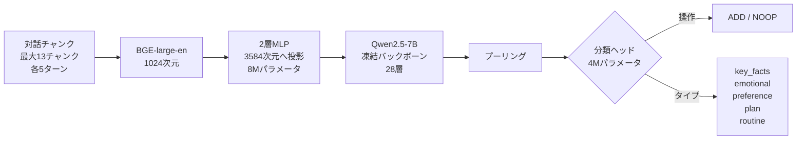

## 論文概要（Abstract）

本記事は [arXiv:2605.00356](https://arxiv.org/abs/2605.00356) の解説記事です。

Hu, Lin, Zhang, Ma, Wang (2026) は、長期会話エージェントのメモリ書き込み判定（どの発話をメモリに保存するか）をLLMの自己回帰生成から軽量な分類ヘッドに置換する **MemRouter** を提案している。12Mパラメータ（7Bバックボーンの0.17%）の訓練のみで、メモリ管理レイテンシをp50で970ms→58ms（94%削減）に短縮しつつ、LoCoMoベンチマークで全体F1=52.0（LLMベースマネージャの45.6に対して+6.4ポイント）を達成したと報告している。

この記事は [Zenn記事: Mem0×MCPサーバーで社内チャットボットに長期記憶を実装する](https://zenn.dev/0h_n0/articles/95c280371f117e) の深掘りです。

## 情報源

- **arXiv ID**: 2605.00356
- **URL**: [https://arxiv.org/abs/2605.00356](https://arxiv.org/abs/2605.00356)
- **著者**: Tianyu Hu, Weikai Lin, Weizhi Zhang, Jing Ma, Song Wang
- **発表年**: 2026（2026年5月1日投稿）
- **分野**: cs.CL, cs.AI

## 背景と動機（Background & Motivation）

Mem0のようなメモリシステムでは、「どの発話をメモリに保存するか」の判定（メモリアドミッション）がLLMのFunction Callingに依存している。Mem0のパイプラインでは、各発話ペアに対してGPT-4o-miniがADD/UPDATE/DELETE/NOOPの4操作を分類する。この方式には以下の課題がある。

- **レイテンシ**: 各発話に対するLLM呼び出しは、p50で約970msのオーバーヘッドを発生させる
- **コスト**: 長期会話では発話数に比例してLLM呼び出し回数が増大し、トークン消費が増加する
- **スケーラビリティ**: 数千ターンの会話では、メモリ管理だけで数千回のLLM呼び出しが必要

著者らは、メモリアドミッション判定は分類タスクであり、自己回帰生成（次トークン予測）ではなく、Embedding + 分類ヘッドで解決できると主張している。

## 主要な貢献（Key Contributions）

- **アーキテクチャ分離**: メモリ書き込み判定を応答生成バックボーンから分離し、独立した最適化を可能にする設計
- **効率性**: メモリ管理レイテンシをp50で970ms→58ms（17倍高速化）に削減
- **軽量訓練**: 7Bバックボーンの0.17%に相当する12Mパラメータのみを訓練。B200 GPU 1枚で約10分
- **バックボーン非依存**: Qwen2.5-7BとLLaMA-3.1-8Bの両方で有効性を確認

## 技術的詳細（Technical Details）

### 3段階アーキテクチャ



**Stage 1: コンテキスト埋め込みと投影**

直近の対話を固定サイズのチャンク（各最大5ターン、最大13チャンク、約60ターン分）に分割する。BGE-large-en-v1.5で1024次元のベクトルに変換し、2層MLP（LayerNorm + GELU活性化）でバックボーン次元（Qwen2.5-7Bの場合3584次元）に投影する。この投影層は約8Mパラメータで構成される。

$$
\mathbf{h}_i = \text{MLP}(\text{BGE}(\text{chunk}_i)) \in \mathbb{R}^{3584}
$$

**Stage 2: バックボーン文脈化**

投影された埋め込みを凍結されたQwen2.5-7Bトランスフォーマーに連続入力インターフェース経由で供給する。トークン化のオーバーヘッドを回避し、28層のトランスフォーマーが1回のフォワードパスで文脈化された表現を出力する。

**Stage 3: 操作分類**

プーリングされた表現が軽量な分類ヘッドに入力される。2つのヘッドが並列で動作する。

- **操作ヘッド**: バイナリ分類（ADD / NOOP）
- **コンテンツタイプヘッド**: 5クラス分類（key_facts, emotional, preference, plan, routine）

分類ヘッドは約4Mパラメータで、投影層と合わせて合計約12Mパラメータ（7Bモデルの0.17%）が訓練対象となる。

### 訓練パイプライン

**教師モデルによるラベル生成**: Qwen3.5-35B-A3Bをティーチャーモデルとして使用し、LoCoMo、LongMemEval、MSCの3データセットから28,415ターンのラベル（ADD/NOOP + コンテンツタイプ）を生成する。

**損失関数**: 操作ヘッドの重み付き交差エントロピーとコンテンツタイプヘッドの条件付き交差エントロピーを組み合わせる。

$$
\mathcal{L} = \mathcal{L}_{\text{op}}^{\text{weighted}} + \lambda \cdot \mathcal{L}_{\text{type}}^{\text{conditional}}
$$

**訓練設定**:
- エポック数: 5
- バッチサイズ: 16
- 学習率: $10^{-3}$
- 訓練時間: B200 GPU 1枚で約10分
- 事前計算: BGE埋め込みをキャッシュしてからの最適化

**訓練アプローチの比較**: 著者らは複数のアプローチを検証している。

| アプローチ | F1 | 備考 |
|---|---|---|
| GRPOのみ（RL） | 1.1 | コールドスタート失敗：全NOOP予測 |
| 教師あり + GRPO | 28.5 | RLは教師ありベースラインを改善せず |
| 教師あり（ADD/UPDATE/NOOP） | 1.4-12.8 | UPDATEモード崩壊 |
| **教師あり（ADD/NOOP）** | **52.0** | 最終採用アプローチ |

著者らは「軽量ルーターに対しては、教師あり学習がRL微調整より安定的であった」と報告している。UPDATE操作を除外しADD/NOOPの2値分類にしたことが安定性向上の鍵である。

### カテゴリ特化プロンプティング

コンテンツタイプヘッドの出力に基づいて、QAバックボーンのプロンプトをカテゴリ別に最適化する。

- **Multi-hop**: 単語数制限を除去し、リスト形式の回答を指示
- **Temporal**: 相対表現（「来週の木曜日」）ではなく絶対日付（「2026年3月12日」）を優先

論文のアブレーション結果より、カテゴリ特化プロンプティングはF1を+5.2ポイント改善する（汎用プロンプト44.3% → カテゴリ特化49.5%）。

### 検索アーキテクチャ

著者らは密ベクトル検索とBM25を組み合わせたハイブリッド検索を採用している。

$$
\text{score}(q, m) = \lambda \cdot \text{sim}_{\text{dense}}(q, m) + (1 - \lambda) \cdot \text{BM25}(q, m)
$$

ここで $\lambda = 0.7$ である。加えて、話者ブーストと時間ブーストをポストランキングで適用し、セッション多様性制約により単一セッションからの過剰取得を制限する。各質問につき上位60件のメモリを検索する。

## 実験結果（Results）

### LoCoMoベンチマーク

論文のメインテーブルより、制御された条件（同一の検索パイプライン・プロンプト・QAバックボーン）での比較を示す。

| 手法 | 全体 F1 | Single-hop | Multi-hop | Temporal | Open-domain |
|---|---|---|---|---|---|
| **MemRouter** (Qwen2.5-7B) | **52.0** | **57.5** | **52.4** | 44.0 | 27.1 |
| LLM Manager | 45.6 | 49.2 | 46.8 | 40.1 | 24.3 |
| Memory-R1-GRPO | 43.1 | 33.6 | 23.6 | **47.8** | **46.9** |

95%信頼区間はMemRouter [51-53] とLLM Manager [42-49] で重複しておらず、統計的に有意な差がある。

### 効率メトリクス

| メトリクス | LLM Manager | MemRouter | 改善 |
|---|---|---|---|
| メモリ管理 p50レイテンシ | 970 ms/ターン | 58 ms/ターン | **17倍** |
| 書き込みパス合計時間 | 5,028秒 | 293秒 | **17倍** |
| エンドツーエンドスループット | 0.24 QA/秒 | 2.58 QA/秒 | **11倍** |
| GPUピークメモリ | 26.6 GB | 31.2 GB | +17% |

レイテンシ削減の代償としてGPUメモリ使用量が約17%増加する。これはBGEエンコーダとバックボーンの両方をGPUに載せる必要があるためである。

### ストレージ予算アブレーション

全発話を保存（100%）した場合と、MemRouterで選択的に保存（62%）した場合の比較を示す。

| ポリシー | 保存率 | F1 |
|---|---|---|
| Store-all（全保存） | 100% | 53.7 |
| **MemRouter** | **62%** | **50.8** |
| MLP-only | 62% | 50.0 |
| キーワードヒューリスティック | 62% | 47.2 |
| ランダム | 62% | 42.8 |

MemRouterは全発話の62%のみを保存しつつ、全保存の94.6%の性能（53.7→50.8）を維持している。ランダム選択（42.8）と比較して+8.0ポイントの改善があり、学習された選択性の効果が確認できる。

### メモリ予算スイープ

保存率を変えた場合のMemRouterとランダムベースラインのF1差を示す。

| 保存率 | MemRouter - Random (Δ F1) |
|---|---|
| 94.5% | +1.0 |
| 80.4% | +5.8 |
| 64.9% | +10.2 |
| 45.9% | +11.4 |
| 19.4% | +10.2 |

低予算になるほど差が拡大し、保存率45.9%で最大差+11.4ポイントを記録する。リソース制約下での学習済み選択性の価値が確認される。

## 実装のポイント（Implementation）

### Mem0への適用

MemRouterのアーキテクチャは、Mem0の書き込みパスにおけるLLMベースのADD/UPDATE/DELETE分類を置換できる。

```python
import numpy as np
import torch
import torch.nn as nn


class MemRouterHead(nn.Module):
    """MemRouterの分類ヘッド（簡略版）"""

    def __init__(self, hidden_dim: int = 3584) -> None:
        super().__init__()
        self.operation_head = nn.Linear(hidden_dim, 2)  # ADD / NOOP
        self.content_type_head = nn.Linear(hidden_dim, 5)  # 5 categories

    def forward(
        self, pooled_repr: torch.Tensor
    ) -> tuple[torch.Tensor, torch.Tensor]:
        op_logits = self.operation_head(pooled_repr)
        type_logits = self.content_type_head(pooled_repr)
        return op_logits, type_logits


class MemRouterProjection(nn.Module):
    """BGE埋め込みからバックボーン次元への投影"""

    def __init__(
        self, input_dim: int = 1024, output_dim: int = 3584
    ) -> None:
        super().__init__()
        self.layers = nn.Sequential(
            nn.Linear(input_dim, output_dim),
            nn.LayerNorm(output_dim),
            nn.GELU(),
            nn.Linear(output_dim, output_dim),
            nn.LayerNorm(output_dim),
        )

    def forward(self, x: torch.Tensor) -> torch.Tensor:
        return self.layers(x)
```

### 実装時の注意点

- **UPDATE操作の排除**: 著者らはADD/NOOPの2値分類が最も安定と報告しているが、Mem0はUPDATE/DELETEも使用する。MemRouterをMem0に統合する場合、ADDと判定されたメモリに対してのみLLMベースのUPDATE/DELETE分類を適用するハイブリッド方式が現実的
- **バックボーン選択**: 論文ではQwen2.5-7BとLLaMA-3.1-8Bで検証されているが、日本語対話のメモリ管理には日本語対応バックボーン（例: Qwen2.5-7B-Instruct）が望ましい
- **BGE埋め込みのキャッシュ**: 訓練時にBGE埋め込みを事前計算・キャッシュすることで、推論時にも同様のキャッシュ戦略を適用し、重複チャンクの再計算を回避できる
- **メモリ保存率のチューニング**: 論文の結果から、保存率60-65%が精度とストレージコストのバランスに優れる。社内チャットボットでは、メモリタイプごとに保存率を調整することも検討可能

## 実運用への応用（Practical Applications）

MemRouterの知見は社内チャットボットに以下の形で応用できる。

- **メモリ管理のレイテンシ削減**: Mem0の書き込みパスでLLM呼び出しをMemRouterに置換することで、各発話のメモリ判定を970ms→58msに短縮できる。リアルタイムチャットボットでは、ユーザー体験に直結する改善となる
- **ストレージコスト削減**: 全発話の62%のみを選択的に保存しつつ94.6%の性能を維持できるため、ElastiCacheやQdrantのストレージコストを約40%削減可能
- **カテゴリ特化プロンプティング**: メモリのコンテンツタイプに基づいてQAプロンプトを最適化する手法は、Mem0のmetadataフィルタと組み合わせて検索精度を+5.2ポイント向上させる

## 関連研究（Related Work）

- **Mem0 (arXiv:2504.19413)**: MemRouterが改善対象とするLLMベースのメモリ管理パイプライン。LoCoMoでJ=66.88%（GPT-4o-miniベース）を達成しているが、メモリ管理レイテンシの最適化は論文のスコープ外
- **Memory-R1**: GRPOによるRL微調整でメモリ管理を最適化する手法。MemRouterの比較対象で、全体F1=43.1にとどまる
- **A-MEM**: エージェンティックメモリ。MemRouter論文ではベースライン比較に含まれていないが、Mem0論文ではJ=48.38%と報告されている

## まとめと今後の展望

MemRouterはメモリ書き込み判定をLLM生成から12Mパラメータの分類ヘッドに分離することで、レイテンシを94%削減しつつF1で+6.4ポイントの改善を達成している。保存率62%で全保存の94.6%の性能を維持する選択的保存は、長期運用でのメモリ肥大化問題にも有効な対策となる。Mem0の書き込みパスにMemRouterを統合するハイブリッド方式は、社内チャットボットのリアルタイム性能とストレージコストの両面で改善を期待できるアプローチである。

## 参考文献

- **arXiv**: [https://arxiv.org/abs/2605.00356](https://arxiv.org/abs/2605.00356)
- **LoCoMo Benchmark**: [ACL 2024](https://aclanthology.org/2024.acl-long.747/)
- **BGE-large-en-v1.5**: [HuggingFace](https://huggingface.co/BAAI/bge-large-en-v1.5)
- **Related Zenn article**: [https://zenn.dev/0h_n0/articles/95c280371f117e](https://zenn.dev/0h_n0/articles/95c280371f117e)
