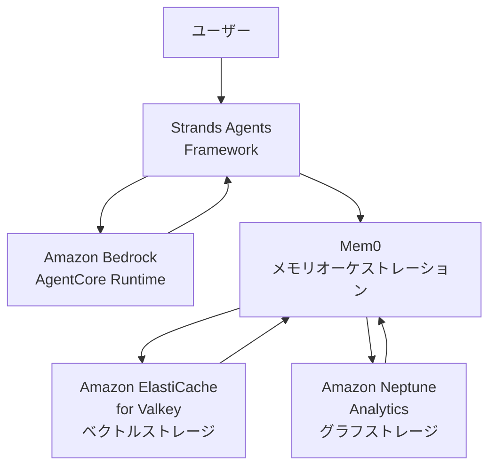

## ブログ概要（Summary）

本記事は [AWS Database Blog: Build persistent memory for agentic AI applications with Mem0 Open Source, Amazon ElastiCache for Valkey, and Amazon Neptune Analytics](https://aws.amazon.com/blogs/database/build-persistent-memory-for-agentic-ai-applications-with-mem0-open-source-amazon-elasticache-for-valkey-and-amazon-neptune-analytics/) の解説記事です。

AWS公式ブログでは、AIエージェントのステートレス性（セッション間で文脈を保持できない問題）を解決するために、Mem0をメモリオーケストレーション層として、Amazon ElastiCache for Valkey（ベクトルストレージ）とAmazon Neptune Analytics（グラフストレージ）を組み合わせた永続メモリアーキテクチャが紹介されている。ベンチマークでは、メモリなしの場合と比較してトークン使用量を91%削減（70,373→6,344トークン）、実行時間を78%短縮（9.25s→2.0s）したと報告されている。

この記事は [Zenn記事: Mem0×MCPサーバーで社内チャットボットに長期記憶を実装する](https://zenn.dev/0h_n0/articles/95c280371f117e) の深掘りです。

## 情報源

- **種別**: 企業テックブログ（AWS公式）
- **URL**: [AWS Database Blog](https://aws.amazon.com/blogs/database/build-persistent-memory-for-agentic-ai-applications-with-mem0-open-source-amazon-elasticache-for-valkey-and-amazon-neptune-analytics/)
- **組織**: Amazon Web Services
- **発表日**: 2026年

## 技術的背景（Technical Background）

AIエージェントは本質的にステートレスであり、各セッションを白紙の状態で開始する。これにより、以下の問題が発生する。

- ユーザーの過去の質問や嗜好を記憶できず、毎回同じ情報を再収集する
- 複数ステップのタスクでセッションをまたぐと、進捗状態が失われる
- パーソナライズされた応答が提供できない

AWSブログでは、この課題をMem0のメモリオーケストレーション層と、AWSのマネージドデータベースサービスの組み合わせで解決するアプローチを提示している。

Mem0論文（arXiv:2504.19413）で提案されたベクトルメモリとグラフメモリの二重構造を、AWSのプロダクショングレードのサービスで実装している点が学術研究との接点となっている。

## 実装アーキテクチャ（Architecture）

### 5コンポーネント構成

ブログで紹介されているアーキテクチャは5つのコンポーネントで構成される。



**1. Amazon Bedrock AgentCore Runtime**: エージェントのホスティング環境を提供し、LLMおよびEmbeddingモデルへのアクセスを管理する。

**2. Strands Agents Framework**: コードファーストのエージェントフレームワーク。LLM呼び出しとツール実行を管理する。以下のように初期化される。

```python
from strands import Agent

agent = Agent(tools=[http_request, store_memory_tool, search_memory_tool])
```

**3. Mem0メモリオーケストレーション**: エージェントとストレージシステムの仲介層として、メモリのライフサイクル管理（抽出→格納→検索→減衰）を担当する。メモリフィルタリング、減衰メカニズム、コスト最適化を統括する。

**4. Amazon ElastiCache for Valkey**: ベクトルストレージ層として機能し、高次元Embeddingによるセマンティック検索を提供する。特徴として以下が挙げられる。
- マイクロ秒レベルのメモリ操作レイテンシ
- リアルタイムインデックス更新による即座の検索可能性
- セマンティックキャッシングによるLLMコスト削減

**5. Amazon Neptune Analytics**: グラフストレージとして複雑なエンティティ関係を表現し、マルチホップ推論を可能にする。

### メモリタイプの分類

ブログでは4種類のメモリタイプが紹介されている。

| メモリタイプ | 説明 | 格納先 |
|---|---|---|
| **Episodic** | 会話履歴とセッション文脈 | ElastiCache |
| **Semantic** | エンティティに関する事実的知識 | ElastiCache + Neptune |
| **Procedural** | ハウツー情報とプロセス | ElastiCache |
| **Associative** | 概念間の関係 | Neptune |

Zenn記事で紹介している3種類のメモリタイプ（ユーザープロファイル、インタラクション記憶、タスク/プロジェクト記憶）は、AWSブログの分類ではそれぞれSemantic、Episodic、Proceduralに対応する。

## パフォーマンス比較（Performance）

ブログでは3つのシナリオでベンチマークが実施されている。

### メモリなし（ベースライン）

- **トークン使用量**: 70,373
- **実行時間**: 9.25秒
- **特徴**: 毎回ゼロから情報収集。冗長なツール呼び出しが発生

### ベクトルメモリあり（ElastiCache）

- **トークン使用量**: 6,344（**91%削減**）
- **実行時間**: 2.0秒（**78%高速化**）
- **特徴**: 過去に収集した情報をセマンティック検索で再利用。ウェブ検索の繰り返しを排除

### グラフメモリあり（Neptune）

- **特徴**: エンティティ間の関係をグラフ走査で取得。「プロジェクトAの貢献者とプロジェクトBの貢献者の共通点」のようなマルチホップクエリに対応

ベクトルメモリだけでトークン91%削減・実行時間78%短縮を達成しており、多くのユースケースではElastiCacheのみで十分な効果が得られる。グラフメモリ（Neptune）は関係推論が必要なケースに限定して追加するのが現実的な設計方針である。

## ElastiCache for Valkeyの設定詳細

ブログで紹介されているElastiCache設定を示す。

```python
config = {
    "vector_store": {
        "provider": "valkey",
        "config": {
            "valkey_url": "your-cluster.cache.amazonaws.com:6379",
            "index_name": "agent_memory",
            "embedding_model_dims": 1024,
            "index_type": "flat",
        },
    },
}
```

**設計ポイント**:
- `embedding_model_dims: 1024`: Amazon Titan Embeddings V2（1024次元）を使用。text-embedding-3-small（1536次元）より低次元だが、AWSサービス内で完結するためレイテンシが低い
- `index_type: "flat"`: 小規模〜中規模のメモリ数（数万件まで）では線形スキャンで十分な性能。HNSW indexはメモリ消費が大きいため、大規模時のみ検討

### Neptune Analyticsのグラフ設定

```python
config = {
    "graph_store": {
        "provider": "neptune",
        "config": {
            "endpoint": "neptune-graph://<GRAPH_ID>",
        },
    },
}
```

Neptune Analyticsはサーバーレスのグラフ分析エンジンで、事前のクラスタプロビジョニングが不要。グラフサイズに応じて自動スケーリングされるため、メモリ数の増減に柔軟に対応できる。

## 運用での学び（Production Lessons）

### セマンティックキャッシングによるコスト削減

ElastiCache for Valkeyのセマンティックキャッシング機能は、類似クエリに対するLLM呼び出しを回避する。ブログでは、繰り返しのGitHubリポジトリ調査タスクでトークン消費が91%削減された事例が紹介されている。

仕組みとしては、クエリのEmbeddingをElastiCacheに格納し、新規クエリとの類似度が閾値を超えた場合にキャッシュされた結果を返す。これにより、LLM呼び出し自体をスキップできる。

### メモリツールの設計

Strands Agentsでは、メモリ操作をカスタムツールとして定義する。

```python
from strands import tool


@tool
def store_memory_tool(content: str, user_id: str, metadata: dict | None = None) -> dict:
    """エージェントがメモリを保存するためのツール"""
    result = memory.add(
        messages=content,
        user_id=user_id,
        metadata=metadata or {},
    )
    return {"status": "stored", "memory_id": result["id"]}


@tool
def search_memory_tool(query: str, user_id: str, limit: int = 5) -> list[dict]:
    """エージェントがメモリを検索するためのツール"""
    results = memory.search(
        query=query,
        filters={"user_id": user_id},
        top_k=limit,
    )
    return results["results"]
```

ツールをエージェントに登録することで、LLMが自律的にメモリの保存・検索タイミングを判断する。MCPサーバー方式と異なり、HTTP通信のオーバーヘッドがなく、エージェントフレームワーク内で直接呼び出せる。

### Zenn記事との比較

Zenn記事ではQdrant + PostgreSQL（pgvector）のセルフホスト構成を推奨しているが、AWSブログではマネージドサービスを活用している。

| 観点 | Zenn記事（セルフホスト） | AWSブログ（マネージド） |
|---|---|---|
| ベクトルストア | Qdrant (Docker) | ElastiCache for Valkey |
| メタデータDB | PostgreSQL (pgvector) | ElastiCache + DynamoDB |
| グラフDB | — | Neptune Analytics |
| 運用負荷 | 高（自前管理） | 低（マネージド） |
| データ制御 | 完全（オンプレミス） | AWS内（VPC） |
| 初期コスト | 低（Docker） | 中（ElastiCache最小構成$15/月〜） |
| スケーラビリティ | 手動 | 自動 |

社内データの外部送信をゼロにする要件がある場合はセルフホスト構成が必須だが、AWSアカウント内での処理が許容される場合はマネージドサービスの方が運用負荷が大幅に低い。

## Production Deployment Guide

### AWS実装パターン（コスト最適化重視）

AWSブログのアーキテクチャをトラフィック規模別に最適化した構成を示す。

| 規模 | 月間リクエスト | 推奨構成 | 月額コスト | 主要サービス |
|---|---|---|---|---|
| **Small** | ~3,000 (100/日) | Serverless | $80-200 | Lambda + Bedrock + ElastiCache Serverless |
| **Medium** | ~30,000 (1,000/日) | Hybrid | $400-1,200 | Lambda + ElastiCache + Neptune Analytics |
| **Large** | 300,000+ (10,000/日) | Container | $2,500-6,000 | EKS + ElastiCache + Neptune + Karpenter |

**Small構成の詳細**（月額$80-200）:
- **Lambda**: Strands Agentsランタイム（1GB RAM, 60秒タイムアウト）、$20/月
- **Bedrock**: Claude 3.5 Haiku（ファクト抽出）+ Amazon Titan Embeddings V2、$100/月
- **ElastiCache for Valkey**: cache.t4g.micro（ベクトルストア）、$15/月
- **DynamoDB**: メタデータ永続化（On-Demand）、$10/月

**Medium構成の追加**:
- **Neptune Analytics**: グラフメモリ（サーバーレス、クエリ量に応じた課金）、$50-200/月

**コスト試算の注意事項**: 上記は2026年8月時点のAWS ap-northeast-1（東京）リージョン料金に基づく概算値です。最新料金は [AWS料金計算ツール](https://calculator.aws/) で確認してください。

### Terraformインフラコード

**Small構成: Lambda + Bedrock + ElastiCache for Valkey**

```hcl
module "vpc" {
  source  = "terraform-aws-modules/vpc/aws"
  version = "~> 5.0"

  name = "mem0-agent-vpc"
  cidr = "10.0.0.0/16"
  azs  = ["ap-northeast-1a", "ap-northeast-1c"]
  private_subnets = ["10.0.1.0/24", "10.0.2.0/24"]

  enable_nat_gateway   = true
  single_nat_gateway   = true
  enable_dns_hostnames = true
}

resource "aws_elasticache_serverless_cache" "mem0_valkey" {
  engine = "valkey"
  name   = "mem0-vector-store"

  cache_usage_limits {
    data_storage {
      maximum = 1
      unit    = "GB"
    }
    ecpu_per_second {
      maximum = 1000
    }
  }

  subnet_ids         = module.vpc.private_subnets
  security_group_ids = [aws_security_group.elasticache.id]
}

resource "aws_security_group" "elasticache" {
  name_prefix = "mem0-elasticache-"
  vpc_id      = module.vpc.vpc_id

  ingress {
    from_port       = 6379
    to_port         = 6379
    protocol        = "tcp"
    security_groups = [aws_security_group.lambda.id]
  }
}

resource "aws_lambda_function" "mem0_agent" {
  filename      = "agent.zip"
  function_name = "mem0-strands-agent"
  role          = aws_iam_role.lambda_mem0.arn
  handler       = "index.handler"
  runtime       = "python3.12"
  timeout       = 60
  memory_size   = 1024

  vpc_config {
    subnet_ids         = module.vpc.private_subnets
    security_group_ids = [aws_security_group.lambda.id]
  }

  environment {
    variables = {
      VALKEY_URL       = aws_elasticache_serverless_cache.mem0_valkey.endpoint[0].address
      BEDROCK_MODEL_ID = "anthropic.claude-3-5-haiku-20241022-v1:0"
      EMBEDDING_MODEL  = "amazon.titan-embed-text-v2:0"
    }
  }
}
```

### 運用・監視設定

```python
import boto3

cloudwatch = boto3.client("cloudwatch")

# ElastiCache メモリ使用量アラート
cloudwatch.put_metric_alarm(
    AlarmName="mem0-elasticache-memory",
    ComparisonOperator="GreaterThanThreshold",
    EvaluationPeriods=2,
    MetricName="DatabaseMemoryUsagePercentage",
    Namespace="AWS/ElastiCache",
    Period=300,
    Statistic="Average",
    Threshold=80.0,
    AlarmDescription="ElastiCacheメモリ使用量80%超過",
    AlarmActions=["arn:aws:sns:ap-northeast-1:123456789:ops-alerts"],
)

# Neptune Analytics クエリレイテンシアラート
cloudwatch.put_metric_alarm(
    AlarmName="mem0-neptune-latency",
    ComparisonOperator="GreaterThanThreshold",
    EvaluationPeriods=3,
    MetricName="QueryLatency",
    Namespace="AWS/NeptuneAnalytics",
    Period=300,
    Statistic="p99",
    Threshold=500,
    AlarmDescription="Neptuneクエリレイテンシp99 500ms超過",
)
```

### コスト最適化チェックリスト

- [ ] ElastiCache Serverless: 自動スケーリングで低トラフィック時のコスト最小化
- [ ] Neptune Analytics: サーバーレスモードでクエリ量課金
- [ ] Bedrock Batch API: 非リアルタイムのファクト抽出で50%割引
- [ ] Bedrock Prompt Caching: システムプロンプト固定部分のキャッシュ
- [ ] Lambda: VPC内配置でElastiCacheへの低レイテンシ接続
- [ ] NAT Gateway: Single NAT Gatewayでコスト削減（$32/月→1つ分）
- [ ] セマンティックキャッシュ: 類似クエリへのLLM呼び出しスキップ
- [ ] AWS Budgets: 月額予算80%で警告
- [ ] Cost Anomaly Detection: Bedrock/ElastiCacheコスト異常検知
- [ ] CloudWatch: ElastiCacheメモリ使用量・Neptuneレイテンシ監視
- [ ] タグ戦略: 環境別（dev/staging/prod）でコスト可視化
- [ ] ElastiCache TTL: 古いベクトルの自動削除
- [ ] 開発環境: ElastiCache/Neptuneの夜間停止
- [ ] Reserved Nodes: ElastiCache 1年コミットで30-50%削減

## 学術研究との関連（Academic Connection）

AWSブログのアーキテクチャは、Mem0論文（arXiv:2504.19413）のベクトルメモリ + グラフメモリの二重構造をAWSマネージドサービスで実装したものである。

- **ベクトルメモリ**: 論文ではQdrant/Chromaを使用しているが、AWSブログではElastiCache for Valkeyに置換。Valkeyのマイクロ秒レベルレイテンシは論文のp50=0.148sを大幅に下回る可能性がある
- **グラフメモリ**: 論文ではNeo4jを使用しているが、AWSブログではNeptune Analyticsに置換。サーバーレスモデルにより、運用負荷が大幅に低減される
- **トークン削減**: 論文では90%以上のトークン削減を報告しているが、AWSブログでも91%削減（70,373→6,344）と整合する結果が得られている

## まとめと実践への示唆

AWSブログで紹介されたMem0 + ElastiCache + Neptune Analyticsの構成は、Mem0論文のアーキテクチャをプロダクショングレードのAWSサービスで実現したものである。ベクトルメモリだけでトークン91%削減・実行時間78%短縮を達成しており、社内チャットボットへの適用では、まずElastiCache for Valkeyによるベクトルメモリを導入し、マルチホップ推論が必要になった段階でNeptune Analyticsを追加する段階的アプローチが推奨される。

## 参考文献

- **Blog URL**: [AWS Database Blog](https://aws.amazon.com/blogs/database/build-persistent-memory-for-agentic-ai-applications-with-mem0-open-source-amazon-elasticache-for-valkey-and-amazon-neptune-analytics/)
- **Related Paper**: [Mem0: Building Production-Ready AI Agents (arXiv:2504.19413)](https://arxiv.org/abs/2504.19413)
- **Strands Agents**: [GitHub](https://github.com/strands-agents/sdk-python)
- **Related Zenn article**: [https://zenn.dev/0h_n0/articles/95c280371f117e](https://zenn.dev/0h_n0/articles/95c280371f117e)
