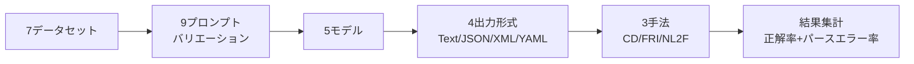
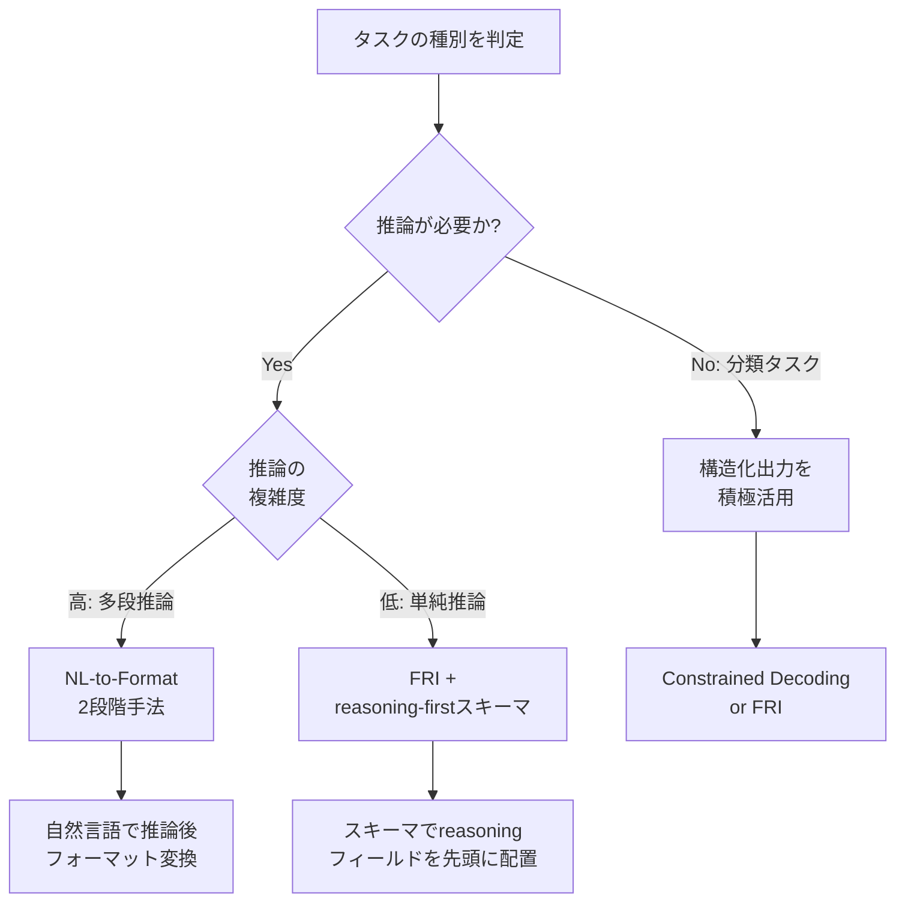

## 論文概要（Abstract）

本記事は [arXiv:2408.02442](https://arxiv.org/abs/2408.02442) の解説記事です。

Tam, Wu, Tsai, Lin, Lee, Chen (2024) は、LLMに対してJSON・XML・YAML等の構造化フォーマットでの出力を強制した場合に、モデルの推論能力がどのように変化するかを体系的に調査している。5つのLLM、4つの出力形式、7つのデータセット、9つのプロンプトバリエーションにわたる大規模な実験の結果、構造化出力制約は推論タスクにおいて性能を大幅に低下させる一方、分類タスクでは逆に精度を向上させるケースがあることを報告している。特にGSM8K（算術推論）においてClaude-3-haikuは自由テキスト出力の86.51%からJSON形式では23.44%へと63ポイント以上の性能低下を示した（論文Table 1より）。

この記事は [Zenn記事: Gemini 3.7 FlashのStructured Outputでチケット自動分類を実装する](https://zenn.dev/0h_n0/articles/8737a1d512e42e) の深掘りです。

## 情報源

- **arXiv ID**: 2408.02442
- **URL**: [https://arxiv.org/abs/2408.02442](https://arxiv.org/abs/2408.02442)
- **著者**: Zhi Rui Tam, Cheng-Kuang Wu, Yi-Lin Tsai, Chieh-Yen Lin, Hung-yi Lee, Yun-Nung Chen
- **発表年**: 2024
- **分野**: cs.CL, cs.AI

## 背景と動機（Background & Motivation）

LLMをプロダクション環境で利用する際、下流システムとの連携のためにJSON・XML等の構造化フォーマットでの出力が求められることが多い。APIレスポンスのパース、データベースへの格納、他システムとの統合において、構造化出力は事実上の標準となっている。

構造化出力を実現する手法として、主に以下の3つが存在する。

1. **Constrained Decoding（制約付きデコーディング）**: トークン生成時にJSON文法に従わないトークンの確率をゼロにする手法。OpenAIのJSON-modeやoutlines、guidance等のライブラリがこの方式を採用している
2. **Format-Restricting Instructions（FRI）**: プロンプト内で「JSONで回答してください」と指示する手法。最も簡便だが出力の保証がない
3. **NL-to-Format**: まず自然言語で推論させ、その結果を別のステップで構造化フォーマットに変換する2段階手法

しかし、これらの手法がモデルの本来の能力にどのような影響を与えるかについて、体系的な調査は不足していた。著者らは、フォーマット制約がモデルの「思考プロセス」を阻害する可能性を指摘し、タスク種別ごとの影響を包括的に評価する必要性を主張している。

## 主要な貢献（Key Contributions）

- **体系的な評価フレームワーク**: 3種類の構造化出力手法 x 4種類の出力形式 x 5つのLLM x 7つのデータセット x 9つのプロンプトバリエーションという大規模な組み合わせでの評価を実施
- **タスク依存性の実証**: 推論タスクではフォーマット制約により性能が低下する一方、分類タスクでは性能が向上するケースがあることを定量的に示した
- **性能低下の根本原因分析**: パースエラーではなく、構造化フォーマットの制約がchain-of-thought推論を阻害することが主因であると特定した
- **緩和策の提案**: NL-to-Format（2段階手法）やルーズなフォーマット制約により性能低下を軽減できることを示した

## 技術的詳細（Technical Details）

### 実験設計

著者らは3つの構造化出力アプローチを以下のように定式化している。

**Constrained Decoding（CD）**は、生成時に文法制約 $G$ を適用する。各ステップ $t$ において、次トークン $x_t$ の選択を以下のように制約する。

$$
x_t = \arg\max_{v \in V_G(x_{<t})} P(v \mid x_{<t})
$$

ここで、
- $V_G(x_{<t})$: 文法 $G$ に従い、これまでの生成系列 $x_{<t}$ の後に許容されるトークン集合
- $P(v \mid x_{<t})$: モデルが出力する次トークンの確率分布

この制約により、生成されるテキストは常に有効なJSON/XML/YAMLとなるが、モデルが本来選択したかったトークン（推論に必要な中間ステップの表現等）が $V_G$ に含まれない場合、推論の質が低下する。

**Format-Restricting Instructions（FRI）**は、プロンプト $P$ にフォーマット指示 $F$ を付加する方式である。

$$
\hat{y} = \text{LLM}(P \oplus F)
$$

ここで $\oplus$ はプロンプトの結合を表す。$F$ にはスキーマ定義（JSONキー名とその説明）が含まれる。

**NL-to-Format（NL2F）**は2段階で処理する。

$$
y_{\text{NL}} = \text{LLM}(P), \quad y_{\text{fmt}} = \text{LLM}(y_{\text{NL}} \oplus T_{\text{convert}})
$$

ここで $T_{\text{convert}}$ は自然言語回答を指定フォーマットに変換するための指示テンプレートである。

### 実験パイプライン



プロンプトバリエーションは、タスク記述3種類（形式的、簡潔、詳細）とフォーマットスキーマ3種類（最小、標準、詳細）の直積で9パターンを構成している。これにより、プロンプトの書き方に起因するバイアスを排除している。

### データセットの分類

著者らはデータセットを**推論タスク**と**分類タスク**の2カテゴリに分類している。

**推論タスク**（中間的な思考ステップが必要）:
- **GSM8K**: 小学校レベルの算術推論（8,792問）
- **Last Letter Concatenation**: 単語列の末尾文字を連結する推論
- **Shuffled Objects**: 物体の位置追跡推論

**分類タスク**（入力を有限のラベル集合に分類）:
- **DDXPlus**: 鑑別診断分類
- **MultiFin**: 金融テキスト分類
- **Sports Understanding**: スポーツ関連の真偽判定
- **Task 280**: 自然言語推論（NLI）

この区別が結果の解釈において決定的に重要である。

## 実験結果（Results）

### 推論タスクにおける性能低下

論文Table 1より、GSM8Kにおける各モデルの性能を示す。

| モデル | Text（自由形式） | JSON+スキーマ | 差分 |
|--------|-----------------|--------------|------|
| Gemini-1.5-flash | 89.33% | 89.21% | -0.12% |
| Claude-3-haiku | 86.51% | 23.44% | **-63.07%** |
| GPT-3.5-turbo | 75.99% | 49.25% | **-26.74%** |
| LLaMA-3-8B | 75.13% | 48.90% | **-26.23%** |
| Gemma-2-9B | 67.93% | 53.07% | -14.86% |

Claude-3-haikuの63ポイント低下は特に顕著である。著者らは、Claude-3-haikuがJSON出力時にchain-of-thoughtの中間ステップをJSONキーの値として正しく構造化できず、推論の連鎖が断絶することが原因であると分析している。

Last Letter Concatenationタスクでも同様の傾向が確認されている。GPT-3.5-turboは自由テキストの56.7%からJSON形式では25.2%へと31.5ポイント低下した（論文Table 1より）。

一方、Gemini-1.5-flashはGSM8Kで-0.12%とほぼ影響を受けていない。この差異について著者らは、Geminiがconstrained decoding環境での学習を重点的に行っている可能性を示唆している。

### 分類タスクにおける性能向上

推論タスクとは対照的に、分類タスクではフォーマット制約が性能を向上させるケースが観察された。

DDXPlusデータセットにおけるGemini-1.5-flashの結果（論文Table 1より）:

| 出力形式 | 正解率 |
|---------|-------|
| Text（自由形式） | 41.6% |
| JSON+スキーマ | **60.3%** |
| 差分 | **+18.7%** |

著者らは、構造化フォーマットが分類タスクで有効な理由を以下のように考察している。

1. **出力空間の制約**: JSONスキーマにより、出力が有効なラベルに限定される
2. **冗長な説明の抑制**: 自由テキストではラベル以外の説明が正解判定を妨げる場合がある
3. **パース精度の向上**: 構造化出力によりラベルの自動抽出が容易になる

### パースエラーと性能低下の関係

著者らの分析で重要なのは、性能低下の主因がパースエラー（不正なJSON等）ではないという発見である。

論文Table 3より、パースエラー率と性能低下の関係を示す。

| モデル | タスク | パースエラー率 | 性能低下 |
|--------|--------|--------------|---------|
| LLaMA-3-8B | Last Letter | 0.148% | **-38.15%** |
| GPT-3.5-turbo | GSM8K | 0.00% | **-26.74%** |
| Claude-3-haiku | GSM8K | 6.46% | **-63.07%** |

LLaMA-3-8BのLast Letterタスクでは、パースエラー率がわずか0.148%にもかかわらず38.15%もの性能低下が発生している。GPT-3.5-turboに至ってはパースエラーがゼロでありながら26.74%の低下を示している。

この結果は、性能低下の本質がフォーマットの「正しさ」ではなく、構造化制約がモデルの内部推論プロセスに干渉することにあることを示唆している。

## 実装のポイント（Implementation）

### 性能低下のメカニズム: JSONキー順序と推論の断絶

著者らが特定した根本原因は、JSONのキー順序がchain-of-thought推論を阻害するという点である。

自由テキストでの推論例（GSM8K）:

```
問題: りんごが5個あり、3個もらった。全部でいくつ？
思考: 5 + 3 = 8
答え: 8
```

JSON出力を要求した場合、以下のような問題が発生する。

```json
{
  "answer": 8,
  "reasoning": "5 + 3 = 8"
}
```

`"answer"` キーが `"reasoning"` キーよりも先に来るスキーマ定義の場合、モデルは推論を完了する前に回答を生成しなければならない。これにより、chain-of-thoughtが断絶する。

著者らはこの問題に対して、以下のスキーマ設計を推奨している。

```python
from pydantic import BaseModel, Field


class ReasoningFirstSchema(BaseModel):
    """推論を先に配置するスキーマ設計

    JSONのキー順序でchain-of-thoughtを保持する。
    reasoningフィールドを先に定義することで、
    モデルが推論を完了してから回答を生成できる。
    """
    reasoning: str = Field(
        description="ステップバイステップの推論過程"
    )
    answer: str = Field(
        description="最終的な回答"
    )


class ReasoningLastSchema(BaseModel):
    """非推奨: 回答が先のスキーマ

    このスキーマではchain-of-thoughtが断絶する可能性がある。
    """
    answer: str = Field(
        description="最終的な回答"
    )
    reasoning: str = Field(
        description="ステップバイステップの推論過程"
    )
```

### 3手法の実装比較

以下のコードは、論文で評価された3つの構造化出力手法をPythonで実装した場合の概念的な比較である。

```python
from typing import Any

from pydantic import BaseModel, Field


class TaskOutput(BaseModel):
    """構造化出力のスキーマ定義"""
    reasoning: str = Field(description="推論過程")
    answer: str = Field(description="最終回答")


def format_restricting_instruction(
    prompt: str,
    schema: type[BaseModel],
) -> str:
    """FRI: プロンプトにフォーマット指示を追加

    Args:
        prompt: 元のタスクプロンプト
        schema: 出力スキーマのPydanticモデル

    Returns:
        フォーマット指示が付加されたプロンプト
    """
    schema_json = schema.model_json_schema()
    return (
        f"{prompt}\n\n"
        f"以下のJSONスキーマに従って回答してください:\n"
        f"{schema_json}"
    )


def nl_to_format(
    llm_call: Any,
    prompt: str,
    schema: type[BaseModel],
) -> BaseModel:
    """NL-to-Format: 2段階手法

    Step 1: 自然言語で推論
    Step 2: 結果を構造化フォーマットに変換

    Args:
        llm_call: LLM呼び出し関数
        prompt: 元のタスクプロンプト
        schema: 出力スキーマのPydanticモデル

    Returns:
        構造化された出力
    """
    # Step 1: 自然言語で自由に推論させる
    nl_response: str = llm_call(prompt)

    # Step 2: 自然言語の回答を構造化フォーマットに変換
    convert_prompt = (
        f"以下の回答をJSON形式に変換してください。\n\n"
        f"回答:\n{nl_response}\n\n"
        f"スキーマ:\n{schema.model_json_schema()}"
    )
    structured_response: str = llm_call(convert_prompt)

    return schema.model_validate_json(structured_response)
```

NL-to-Format手法は2回のLLM呼び出しが必要となるためレイテンシとコストが増加するが、推論タスクでの性能低下を効果的に緩和できると著者らは報告している。

### プロンプトバリエーションの影響

著者らは9種類のプロンプトバリエーション（3種類のタスク記述 x 3種類のフォーマットスキーマ）を評価し、プロンプトの書き方が結果に大きな影響を与えることを確認している。この結果は、単一のプロンプトでの評価では結論が偏る可能性があることを意味しており、構造化出力の導入時には複数のプロンプト設計を検証する必要性を示唆している。

## 実運用への応用（Practical Applications）

### Zenn記事との関連

関連するZenn記事「[Gemini 3.7 FlashのStructured Outputでチケット自動分類を実装する](https://zenn.dev/0h_n0/articles/8737a1d512e42e)」は、Geminiの構造化出力機能を用いた分類タスクの実装を扱っている。本論文の知見を踏まえると、この実装は以下の点で理にかなっている。

1. **分類タスクとの相性**: 論文の結果は、構造化出力が分類タスクでは性能を向上させることを示している。チケット分類は典型的な分類タスクであり、構造化出力の恩恵を受けやすい
2. **Geminiの堅牢性**: 論文Table 1より、Gemini-1.5-flashは構造化出力時の性能低下が最小（GSM8Kで-0.12%）であり、構造化出力との相性が良いモデルファミリーであると考えられる
3. **スキーマ設計の重要性**: 論文の知見から、Pydanticモデルのフィールド順序が推論に影響する可能性がある。分類タスクでは影響が軽微だが、推論を伴うタスクに拡張する場合はフィールド順序に注意が必要である

### タスク種別に応じた出力形式の選択指針

論文の結果に基づき、以下の選択指針が導出できる。



### 実装時の具体的な注意事項

本論文の知見をプロダクション環境に適用する際の注意点を以下にまとめる。

**推論タスクでの構造化出力**:
- `reasoning` フィールドをスキーマの先頭に配置する
- 複雑な多段推論では NL-to-Format 手法を採用し、推論フェーズでは自由テキスト出力を許可する
- モデル選択時に構造化出力耐性をベンチマークで事前検証する

**分類タスクでの構造化出力**:
- 構造化出力を積極的に活用する。出力空間の制約により精度向上が期待できる
- `enum` 型や `Literal` 型でラベル候補を明示的に定義する
- パースエラーへのフォールバック処理は実装するが、主要な品質問題にはならない

```python
from enum import Enum
from typing import Literal

from pydantic import BaseModel, Field


class TicketCategory(str, Enum):
    """チケット分類のカテゴリ定義

    分類タスクでは構造化出力が精度を向上させる（論文DDXPlusの知見）。
    enum型でラベル候補を制約することで、出力空間を限定する。
    """
    BUG = "bug"
    FEATURE = "feature"
    QUESTION = "question"
    IMPROVEMENT = "improvement"


class TicketClassification(BaseModel):
    """チケット自動分類の出力スキーマ

    分類タスク向けのスキーマ設計。
    推論タスクと異なり、answerを先頭に配置しても
    性能低下は軽微（論文の分類タスク結果より）。
    """
    category: TicketCategory = Field(
        description="チケットのカテゴリ"
    )
    confidence: float = Field(
        ge=0.0,
        le=1.0,
        description="分類の確信度（0.0-1.0）",
    )
    priority: Literal["low", "medium", "high"] = Field(
        description="優先度"
    )
```

### モデル別の構造化出力耐性

論文の結果から、モデル間で構造化出力への耐性に大きな差があることが明らかになっている。実務では、構造化出力を必要とするパイプラインにおいて、モデル選定時にこの耐性を評価基準に含めることが推奨される。

GSM8K（推論タスク）における性能低下率の比較（論文Table 1より）:

| 構造化出力耐性 | モデル | 性能低下 |
|--------------|--------|---------|
| 高 | Gemini-1.5-flash | -0.12% |
| 中 | Gemma-2-9B | -14.86% |
| 低 | LLaMA-3-8B | -26.23% |
| 低 | GPT-3.5-turbo | -26.74% |
| 極低 | Claude-3-haiku | -63.07% |

ただし、これは2024年時点のモデルでの結果であり、各モデルファミリーの後続バージョンでは改善されている可能性がある点に留意が必要である。

## 関連研究（Related Work）

- **Guidance / Outlines**: Microsoft GuidanceやOutlinesは、constrained decodingによる構造化出力生成ライブラリである。本論文はこれらの手法が推論能力に与える負の影響を定量的に示した点で重要な補完関係にある
- **JSON Mode（OpenAI）**: OpenAIが提供するJSON-modeは、Constrained Decodingの商用実装である。本論文の結果はJSON-modeの利用判断に直接的な示唆を与える
- **Chain-of-Thought Prompting (Wei et al., 2022)**: chain-of-thought推論の有効性を示した研究であり、本論文は構造化フォーマットがこのchain-of-thought推論を阻害するメカニズムを明らかにした
- **Instructor / Marvin**: Pydanticベースの構造化出力ライブラリ群であり、本論文のFRI手法に相当する。これらのライブラリの利用時に本論文の知見（スキーマ設計の重要性）を考慮する必要がある

## まとめと今後の展望

本論文の主要な知見は以下の3点に集約される。

1. **構造化出力の影響はタスク依存**: 推論タスクでは性能低下、分類タスクでは性能向上という非対称な影響が存在する
2. **性能低下の主因はパースエラーではない**: 構造化フォーマットの制約がchain-of-thought推論の連鎖を断絶させることが本質的な原因である
3. **緩和策は存在する**: NL-to-Format手法、reasoning-firstスキーマ設計、ルーズなフォーマット制約により性能低下を軽減できる

実務への示唆として、構造化出力を導入する際にはタスクの性質を見極め、分類タスクでは積極的に活用し、複雑な推論タスクでは2段階手法やスキーマ設計の工夫を行うことが推奨される。特に、Zenn記事で扱われているチケット自動分類のような分類タスクは、本論文の知見からも構造化出力と相性が良い用途である。

今後の研究方向として、著者らは (1) より大規模なモデルでの検証、(2) フォーマット制約に対してロバストなファインチューニング手法の開発、(3) タスク特性に応じた適応的なフォーマット選択機構の構築を挙げている。

## 参考文献

- **arXiv**: [https://arxiv.org/abs/2408.02442](https://arxiv.org/abs/2408.02442)
- **Related Zenn article**: [https://zenn.dev/0h_n0/articles/8737a1d512e42e](https://zenn.dev/0h_n0/articles/8737a1d512e42e)
