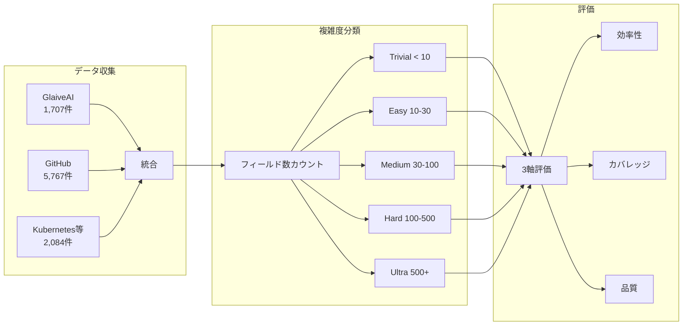
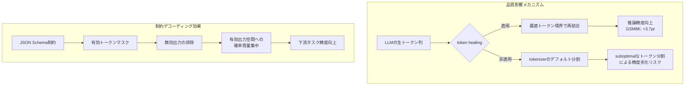

## 論文概要（Abstract）

本記事は [arXiv:2501.10868](https://arxiv.org/abs/2501.10868) の解説記事です。

Geng, Cooper, Moskal, Jenkins, Berman, Ranchin, West, Horvitz, Nori (2025) は、LLMの構造化出力（Structured Output）を体系的に評価するベンチマーク **JSONSchemaBench** を提案している。10,000件の実世界JSONスキーマを収集し、6つの制約付きデコーディングフレームワーク（Guidance, Outlines, Llamacpp, XGrammar, OpenAI, Gemini）を**効率性**（Efficiency）、**カバレッジ**（Coverage）、**品質**（Quality）の3軸で評価した。著者らは、フレームワーク間でスキーマサポート範囲・処理速度・出力品質に大きな差異があることを実証し、構造化出力の標準的評価基盤を提供している。

この記事は [Zenn記事: Gemini 3.7 FlashのStructured Outputでチケット自動分類を実装する](https://zenn.dev/0h_n0/articles/8737a1d512e42e) の深掘りです。

## 情報源

- **arXiv ID**: 2501.10868
- **URL**: [https://arxiv.org/abs/2501.10868](https://arxiv.org/abs/2501.10868)
- **著者**: Saibo Geng, Hudson Cooper, Michał Moskal et al.
- **発表年**: 2025
- **分野**: cs.CL, cs.AI

## 背景と動機（Background & Motivation）

LLMの出力をJSON等の構造化フォーマットに制約する技術は、APIレスポンス生成やデータ抽出パイプラインにおいて不可欠になりつつある。JSON Schemaは構造化出力の標準仕様として広く採用されているが、各フレームワークが実際にどの程度のスキーマをサポートし、どの程度の効率・品質を達成しているかについては、体系的な理解が欠けていた。

著者らは、以下の3つのギャップを指摘している。

- **カバレッジの不透明性**: 各フレームワークがJSON Schema仕様のどの機能（`$ref`、`oneOf`、`patternProperties`等）をサポートしているかが明確でない
- **効率性の未評価**: 文法コンパイル時間やトークン生成速度のフレームワーク間比較が存在しない
- **品質への影響の未解明**: 制約付きデコーディングがLLMの推論能力にどう影響するか（向上させるのか、劣化させるのか）が定量的に示されていない

これらのギャップを埋めるため、著者らは実世界のJSONスキーマを大規模に収集し、統一的な評価フレームワークを構築した。

## 主要な貢献（Key Contributions）

- **JSONSchemaBenchデータセット**: 10のソースから収集した10,000件の実世界JSONスキーマ。フィールド数に基づく5段階の複雑度分類（Trivial/Easy/Medium/Hard/Ultra）を導入
- **3軸評価フレームワーク**: 効率性（文法コンパイル時間・トークン生成速度）、カバレッジ（スキーマサポート率）、品質（下流タスク精度への影響）を統一的に評価
- **6フレームワークの包括的比較**: オープンソース4種（Guidance, Outlines, Llamacpp, XGrammar）とAPI2種（OpenAI, Gemini）の実証比較
- **失敗モード分類**: 制約付きデコーディングの失敗を「過制約」（Over-constrained）と「不足制約」（Under-constrained）に分類し、各フレームワークの特性を明示

## 技術的詳細（Technical Details）

### 制約付きデコーディングの基本原理

制約付きデコーディングは、LLMのトークン生成時に語彙空間を制約することで、出力が指定された文法に従うことを保証する手法である。JSON Schemaに基づく制約付きデコーディングでは、スキーマを形式文法（CFG: Context-Free Grammar）に変換し、各デコーディングステップで文法的に有効なトークンのみを許可する。

具体的には、スキーマ $S$ から文法 $G$ を導出し、各ステップ $t$ で次トークンの確率分布をマスクする。

$$
p'(v_t \mid v_{<t}) = \begin{cases} \frac{p(v_t \mid v_{<t})}{\sum_{v \in \mathcal{V}_{\text{valid}}} p(v \mid v_{<t})} & \text{if } v_t \in \mathcal{V}_{\text{valid}}(v_{<t}, G) \\[6pt] 0 & \text{otherwise} \end{cases}
$$

ここで、
- $v_t$: ステップ $t$ で生成されるトークン
- $v_{<t}$: ステップ $t$ までに生成されたトークン列
- $p(v_t \mid v_{<t})$: LLMが出力する元の条件付き確率
- $\mathcal{V}_{\text{valid}}(v_{<t}, G)$: 文法 $G$ に基づく有効トークン集合
- $p'(v_t \mid v_{<t})$: マスク後の正規化された確率

この定式化により、生成された全トークン列 $v_{1:T}$ は必ず文法 $G$ に準拠する。

### JSONSchemaBenchデータセットの構成

著者らは10の異なるソースからスキーマを収集し、フィールド数（properties, required, enum等のキーワード数）に基づいて5段階の複雑度を定義している。

| データセット | 件数 | カテゴリ | 複雑度 |
|:---|:---:|:---|:---|
| GlaiveAI-2K | 1,707 | Function Call | Trivial-Easy |
| Github-Trivial | 444 | Misc | Trivial |
| Github-Easy | 1,943 | Misc | Easy |
| Github-Medium | 1,976 | Misc | Medium |
| Github-Hard | 1,240 | Misc | Hard |
| Github-Ultra | 164 | Misc | Ultra |
| Kubernetes | 1,064 | Kubernetes API | Medium-Hard |
| JSONSchemaStore | 492 | Misc | Hard-Ultra |
| Snowplow | 403 | Operational API | Easy-Medium |
| Washington Post | 125 | Resource Access API | Easy |

複雑度の定義は以下の通りである。

- **Trivial**: フィールド数 < 10（単純なオブジェクト定義）
- **Easy**: 10-30フィールド（小規模APIスキーマ）
- **Medium**: 30-100フィールド（中規模アプリケーション）
- **Hard**: 100-500フィールド（Kubernetes APIレベル）
- **Ultra**: 500フィールド以上（大規模エンタープライズスキーマ）



GlaiveAI-2KはLLMのFunction Calling用途で設計されたスキーマであり、比較的単純な構造を持つ。一方、Kubernetes APIスキーマは`$ref`による再帰参照や`oneOf`/`anyOf`による複合型を多用しており、フレームワークにとって高難度のテストケースとなる。

### JSON Schema機能の分類

著者らはJSON Schema仕様の機能を体系的に分類し、各フレームワークのサポート状況を調査している。主要な機能カテゴリは以下の通りである。

**基本型制約**: `type`, `enum`, `const` — すべてのフレームワークがサポート

**構造制約**: `properties`, `required`, `additionalProperties` — 大半がサポートするが、`additionalProperties: false`の厳密な適用に差異あり

**組合せ制約**: `oneOf`, `anyOf`, `allOf`, `not` — サポート範囲に大きな差異。特に`not`キーワードのサポートは限定的

**参照・再帰**: `$ref`, `$defs` — 再帰的スキーマ（自己参照型）のサポートがフレームワーク間で大きく異なる

**文字列制約**: `pattern`, `minLength`, `maxLength`, `format` — 正規表現パターンのサポートが限定的なフレームワークが存在

### 過制約と不足制約

著者らは制約付きデコーディングの失敗モードを2種類に分類している。

**過制約（Over-constrained）**: フレームワークがスキーマを過度に厳しく解釈し、LLMの表現力を不必要に制限するケース。例えば、`additionalProperties`が未指定のスキーマに対して暗黙的に`false`を適用し、スキーマに列挙されていないプロパティを一切許可しないケースが該当する。

**不足制約（Under-constrained）**: フレームワークがスキーマの一部制約を無視し、スキーマ非準拠の出力を許可するケース。論文Table 5より、XGrammarは38カテゴリの不足制約を持つと報告されている。具体的には、`minItems`/`maxItems`の無視、`pattern`制約のスキップ、`$ref`解決の失敗などが含まれる。

この2種類の失敗は、構造化出力の信頼性に直接影響する。過制約はLLMが本来生成可能な正しい出力を抑制するリスクを持ち、不足制約はバリデーションをすり抜ける不正な出力を許容するリスクを持つ。

## 実験結果（Results）

### カバレッジ評価

論文Table 4より、Llama-3.2-1Bを使用した各フレームワークのスキーマカバレッジ（スキーマに準拠した出力を生成できた割合）を以下に示す。

| データセット | Guidance | Llamacpp | Outlines | XGrammar | OpenAI | Gemini |
|:---|:---:|:---:|:---:|:---:|:---:|:---:|
| GlaiveAI-2K | **96%** | 95% | 95% | 93% | 89% | 86% |
| Github-Easy | **86%** | 75% | 59% | 79% | 29% | 7% |
| Github-Medium | **69%** | 57% | 29% | 52% | 12% | N/A |
| Github-Hard | **41%** | 39% | 3% | 28% | 9% | N/A |
| Kubernetes | **60%** | 48% | 14% | 38% | 8% | N/A |
| Snowplow | **73%** | 65% | 42% | 56% | 22% | N/A |

著者らは、GlaiveAI-2Kのような単純なスキーマでは各フレームワーク間の差は小さい（86-96%）が、Github-Hard以上の複雑なスキーマでは差が顕著になると報告している。Guidanceは8データセット中6データセットで最高カバレッジを達成している。

特筆すべきは、APIベースのサービス（OpenAI, Gemini）がオープンソースフレームワークと比較して大幅に低いカバレッジを示した点である。著者らは、これらのAPIサービスがJSON Schemaのサブセットのみをサポートしていることが原因であると分析している。OpenAIはGithub-Easy以上の複雑度で30%以下、GeminiはGithub-Easy以降のデータセットでカバレッジがN/A（対応不可）となるケースが多い。

### 効率性評価

論文より、Llama-3.1-8Bとllama.cppバックエンドを使用した効率性評価の結果を以下に示す。

**文法コンパイル時間**（スキーマを内部文法表現に変換する時間）:

| フレームワーク | コンパイル時間 |
|:---|:---:|
| Guidance | ~0.01秒 |
| Llamacpp | ~0.05秒 |
| XGrammar | ~0.10秒 |
| Outlines | 3.48-8.05秒 |

Guidanceは他のフレームワークと比較して文法コンパイルが高速である。特にOutlinesとの差は2桁以上あり、Outlinesはスキーマを有限状態オートマトン（FSA）に変換するアプローチを採用しているため、コンパイル時間が長くなると著者らは分析している。

**トークン生成速度**:

| フレームワーク | トークン生成速度 | ベースラインとの比較 |
|:---|:---:|:---|
| ベースライン（制約なし） | 15.40 ms/token | — |
| Guidance | **6.37 ms/token** | 59%高速化 |
| Llamacpp | 29.98 ms/token | 95%低速化 |
| Outlines | 30.33 ms/token | 97%低速化 |

著者らは、Guidanceが制約なしのベースラインよりも高速にトークンを生成できる点を強調している。これはGuidanceの**token healing**メカニズムと、効率的なマスク計算アルゴリズムによるものと報告されている。token healingは、LLMのtokenizerが最適でないトークン分割を行った場合に再結合を行う手法であり、不要なトークン生成ステップを削減する効果がある。

### 品質評価

制約付きデコーディングがLLMの推論品質に与える影響について、論文よりLlama-3.1-8B-Instructでの評価結果を示す。

| タスク | LM-only | Guidance | Llamacpp | Outlines | XGrammar |
|:---|:---:|:---:|:---:|:---:|:---:|
| GSM8K | 80.1% | **83.8%** | 82.4% | 81.6% | 83.7% |
| Last Letter | 50.7% | **54.0%** | 52.0% | 53.3% | 51.2% |

GSM8Kは算術推論ベンチマーク、Last Letterは文字列操作タスクである。著者らは、制約付きデコーディングによりLM-onlyと比較して品質が向上するケースが多いと報告している。特にGuidanceはGSM8Kで+3.7ポイント、Last Letterで+3.3ポイントの改善を示している。

著者らは、品質向上の主な要因としてtoken healingを挙げている。token healingにより、LLMが意味的に適切なトークン境界でデコーディングを行えるようになり、推論精度が向上すると説明されている。



### フレームワーク別の総合評価

3軸の評価結果を統合すると、各フレームワークの特性は以下のように整理される。

| フレームワーク | カバレッジ | 効率性 | 品質 | 特徴 |
|:---|:---|:---|:---|:---|
| Guidance | 最高（6/8データセットで1位） | 最高速（ベースラインより59%高速） | 最高（token healing効果） | 総合的に優位 |
| Llamacpp | 2位（Guidanceに次ぐ） | 中程度 | 良好 | C++ベースで安定 |
| XGrammar | 3位 | 中程度 | 良好 | 38カテゴリの不足制約あり |
| Outlines | 4位（複雑スキーマで急落） | 低速（コンパイル3-8秒） | 良好 | FSAベースのアプローチ |
| OpenAI | 低（複雑スキーマで<30%） | N/A（API） | N/A | スキーマサブセットのみ |
| Gemini | 最低 | N/A（API） | N/A | 対応スキーマが限定的 |

## 実装のポイント（Implementation）

### スキーマ設計への示唆

JSONSchemaBenchの結果は、実務でJSON Schemaを設計する際に重要な示唆を与える。

**フレームワーク選択時の考慮点**:

1. **スキーマ複雑度の評価**: 自身のユースケースで使用するスキーマのフィールド数を確認し、該当する複雑度カテゴリでのカバレッジを確認する。GlaiveAI-2Kレベル（Trivial-Easy）であればどのフレームワークでも高いカバレッジが期待できるが、Medium以上では選択が重要になる
2. **使用するJSON Schema機能の確認**: `$ref`による再帰参照、`oneOf`/`anyOf`、`pattern`制約を使用する場合、フレームワーク間の差異が特に大きい
3. **レイテンシ要件**: リアルタイム応答が求められる場合、文法コンパイル時間（Outlinesの3-8秒 vs Guidanceの0.01秒）が重要な判断材料になる

**スキーマ簡素化のアプローチ**:

```python
from typing import Any


def estimate_schema_complexity(schema: dict[str, Any]) -> str:
    """JSONスキーマの複雑度をJSONSchemaBenchの基準で推定する。

    Args:
        schema: JSON Schemaオブジェクト

    Returns:
        複雑度カテゴリ（Trivial/Easy/Medium/Hard/Ultra）
    """
    field_count = _count_fields(schema)
    if field_count < 10:
        return "Trivial"
    elif field_count < 30:
        return "Easy"
    elif field_count < 100:
        return "Medium"
    elif field_count < 500:
        return "Hard"
    else:
        return "Ultra"


def _count_fields(schema: dict[str, Any]) -> int:
    """スキーマ内のフィールド関連キーワードを再帰的にカウントする。

    Args:
        schema: JSON Schemaオブジェクト

    Returns:
        フィールド数
    """
    keywords = {"properties", "required", "enum", "const", "items"}
    count = sum(1 for k in schema if k in keywords)
    for value in schema.values():
        if isinstance(value, dict):
            count += _count_fields(value)
        elif isinstance(value, list):
            for item in value:
                if isinstance(item, dict):
                    count += _count_fields(item)
    return count
```

### バリデーション戦略

著者らの過制約・不足制約の分析は、プロダクション環境でのバリデーション戦略に直結する。

**不足制約への対策**: フレームワークの出力を信頼せず、生成後に独立したJSONスキーマバリデータ（`jsonschema`ライブラリ等）で検証するレイヤーを設けることが推奨される。XGrammarの38カテゴリの不足制約は、フレームワーク単体でのバリデーションが不十分であることを示している。

**過制約への対策**: スキーマ設計時に`additionalProperties`を明示的に指定し、フレームワークの暗黙的な解釈に依存しないようにする。

## 実運用への応用（Practical Applications）

### Zenn記事との関連

関連Zenn記事「Gemini 3.7 FlashのStructured Outputでチケット自動分類を実装する」では、Gemini APIのStructured Output機能を用いてチケットの自動分類を実装している。JSONSchemaBenchの結果は、このようなAPIベースの構造化出力利用時に以下の点を考慮すべきことを示唆している。

- **Geminiのカバレッジ制限**: 論文Table 4より、GeminiはGlaiveAI-2Kで86%のカバレッジを示すが、Github-Easyでは7%まで低下する。チケット分類のように比較的単純なスキーマであれば問題は少ないが、スキーマが複雑化すると制約が十分に適用されないリスクがある
- **OpenAIとの比較**: OpenAIもGithub-Easy以上で30%以下のカバレッジとなるため、API提供元に関わらず複雑なスキーマでは注意が必要である
- **フォールバック戦略**: APIベースのサービスで構造化出力が期待通りに機能しない場合、Guidance等のオープンソースフレームワークをセルフホスティングで運用する選択肢を検討すべきである

### スケーリング観点

構造化出力フレームワークの選択は、システムのスケーリング特性に直接影響する。

- **レイテンシ**: Guidanceの6.37ms/tokenは、ベースラインの15.40ms/tokenを下回るため、構造化出力の追加がレイテンシ改善にもつながる。一方、Outlines/Llamacppは約30ms/tokenであり、ベースラインの2倍近いオーバーヘッドが発生する
- **コンパイルキャッシュ**: 同一スキーマを繰り返し使用するバッチ処理では、文法コンパイル結果をキャッシュすることでOutlinesの3-8秒のコンパイルコストを初回のみに抑えられる
- **コスト効率**: token healingによるトークン数削減は、トークン課金制のAPIにおいてコスト削減に直結する

## 関連研究（Related Work）

- **Outlines (Willard & Louf, 2023)**: 有限状態オートマトン（FSA）ベースの制約付きデコーディング。JSONSchemaBenchでは複雑スキーマでのカバレッジ低下とコンパイル時間の長さが課題として指摘されている
- **Guidance (Lundberg et al.)**: token healingとCFGベースの制約を組み合わせたフレームワーク。JSONSchemaBenchの3軸評価で総合的に優位な結果を示した
- **XGrammar (Dong et al., 2024)**: 効率的な文法処理を目指すフレームワーク。カバレッジは中程度だが、38カテゴリの不足制約が報告されている
- **LMQL (Beurer-Kellner et al., 2023)**: クエリ言語ベースのLLM制約。JSONSchemaBenchでは直接評価されていないが、制約付きデコーディングの代替アプローチとして位置づけられる

## まとめと今後の展望

JSONSchemaBenchは、構造化出力フレームワークの評価を3軸（効率性・カバレッジ・品質）で統一的に行える初のベンチマークである。10,000件の実世界スキーマによる評価により、フレームワーク間の性能差が特に複雑なスキーマで顕著になることが明らかになった。

実務への示唆として、スキーマの複雑度に応じたフレームワーク選択の重要性、および生成後バリデーションの必要性が挙げられる。Guidanceは3軸すべてで優位な結果を示したが、著者らはJSON Schema仕様の完全サポートは依然として未達成であり、特に再帰的スキーマや複合型制約の処理が今後の課題であると述べている。

今後の研究方向として、著者らはJSONSchemaBenchの継続的な更新、新たなフレームワークの追加評価、およびより大規模なLLM（70B以上）での品質影響の分析を挙げている。

## 参考文献

- **arXiv**: [https://arxiv.org/abs/2501.10868](https://arxiv.org/abs/2501.10868)
- **JSONSchemaBench GitHub**: [https://github.com/guidance-ai/jsonschemabench](https://github.com/guidance-ai/jsonschemabench)
- **Related Zenn article**: [https://zenn.dev/0h_n0/articles/8737a1d512e42e](https://zenn.dev/0h_n0/articles/8737a1d512e42e)
