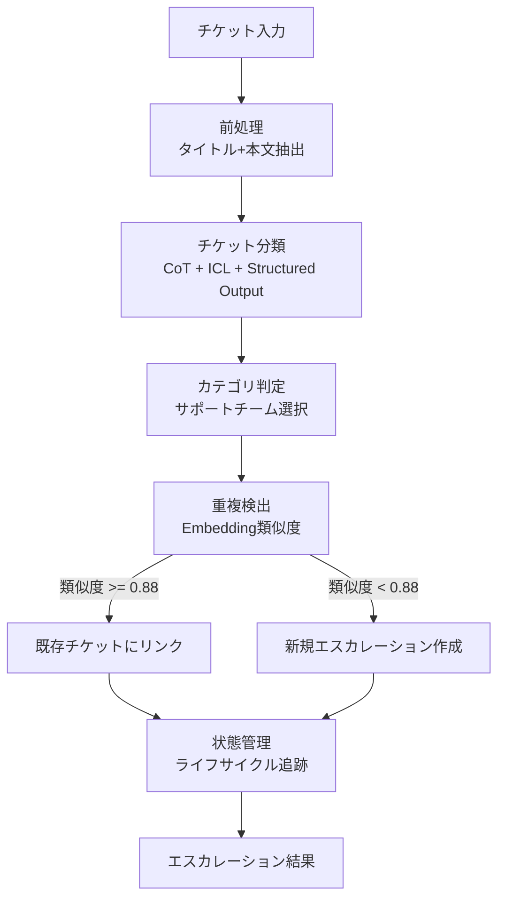

## 論文概要（Abstract）

本記事は [arXiv:2504.08475](https://arxiv.org/abs/2504.08475) の解説記事です。

Liu, He, Zhang et al. (2025) は、クラウドサービスプラットフォームにおけるチケットエスカレーションの自動化フレームワークTickItを提案している。従来の手動エスカレーションプロセスは非効率・不正確であり、大量チケットの処理に構造的な限界がある。TickItはLLMを活用したトピック認識ルーティング、動的チケット状態管理、チケット間の関係分析（重複検出）を統合し、FSE 2025に採択された。ByteDanceのVolcano Engineで実運用され、20,066件のチケット処理においてMTTRを39%削減したと報告されている。

この記事は [Zenn記事: Gemini 3.7 FlashのStructured Outputでチケット自動分類を実装する](https://zenn.dev/0h_n0/articles/8737a1d512e42e) の深掘りです。

## 情報源

- **arXiv ID**: 2504.08475
- **URL**: [https://arxiv.org/abs/2504.08475](https://arxiv.org/abs/2504.08475)
- **著者**: Fengrui Liu, Xiao He, Tieying Zhang et al.
- **発表年**: 2025
- **会議**: 33rd ACM International Conference on the Foundations of Software Engineering (FSE 2025)
- **分野**: cs.SE, cs.AI

## 背景と動機（Background & Motivation）

クラウドサービスプラットフォームでは、ユーザーからの技術サポートチケットを適切な専門チームにエスカレーション（転送）することが運用の要となる。しかし、手動エスカレーションには以下の課題がある。

- **非効率性**: アナリストがチケット内容を読み、対応チームを判断・転送する作業に時間がかかる
- **不正確性**: 適切なチームへのルーティングにはドメイン知識が必要であり、誤転送が発生しやすい
- **スケーラビリティの欠如**: チケット量増加時にアナリストの処理能力がボトルネックとなりMTTRが悪化する
- **重複チケットの見落とし**: 同一障害に起因する複数チケットが個別処理されリソースが無駄になる

著者らは、LLMの自然言語理解能力とStructured Outputを組み合わせ、CoT推論による根拠付き分類と重複検出を統合したエンドツーエンドのフレームワークを提案している。

## 主要な貢献（Key Contributions）

- **トピック認識ルーティング**: LLMのCoT推論とStructured Outputを組み合わせ、チケットを適切なサポートチームに自動分類するメカニズム
- **動的チケット状態管理**: チケットのライフサイクル全体を通じた状態遷移の追跡と管理
- **エスカレーション重複検出**: Embedding類似度に基づくチケット間の関係分析により、同一障害の重複エスカレーションを検出・統合
- **Category-guided SFT**: カテゴリ情報を活用したLoRAによるSupervised Fine-tuningと、推論ステップのデータ拡張手法

## 技術的詳細（Technical Details）

### TickItのシステムアーキテクチャ



TickItは3つの主要コンポーネントで構成される。

### 1. トピック認識ルーティング（チケット分類）

チケット分類は多クラス分類タスクとして定式化される。入力チケット $t$ に対し、カテゴリ集合 $C = \{c_1, c_2, \ldots, c_K\}$ から最適なカテゴリを予測する。

$$
\hat{c} = \arg\max_{c_k \in C} \, p(c_k \mid t; \theta)
$$

ここで、
- $t$: チケットのテキスト（タイトル + 本文）
- $C$: サポートチームに対応するカテゴリ集合
- $\theta$: LLMのパラメータ
- $p(c_k \mid t; \theta)$: LLMがチケット $t$ をカテゴリ $c_k$ に分類する確率

著者らは、単純なプロンプト分類ではなく、Chain-of-Thought（CoT）推論を導入している。LLMはまず推論ステップ $r$ を生成し、その推論に基づいて分類を行う。

$$
p(c_k \mid t; \theta) = \sum_{r} p(c_k \mid r, t; \theta) \cdot p(r \mid t; \theta)
$$

実装ではStructured Outputを利用し、推論過程と分類結果をJSON形式で出力させる。

```python
from pydantic import BaseModel, Field


class TicketClassification(BaseModel):
    """チケット分類のStructured Output定義

    CoT推論の根拠と分類結果を構造化して出力する。
    """
    reasoning: str = Field(
        description="分類の根拠となる推論ステップ"
    )
    category: str = Field(
        description="エスカレーション先のサポートチームカテゴリ"
    )
    confidence: float = Field(
        ge=0.0, le=1.0,
        description="分類の確信度"
    )
```

さらに、In-Context Learning（ICL）として、分類対象チケットと類似する過去の分類済みチケットを動的に選択し、プロンプトに含める。著者らは、ICLの導入によりRecallが0.821から0.892に向上したと報告している（論文Table 2より）。

### 2. エスカレーション重複検出

同一障害に起因する複数のチケットを検出するため、Embedding類似度に基づく重複検出を実装している。チケット $t_i$ と $t_j$ のEmbeddingベクトル $\mathbf{e}_i$, $\mathbf{e}_j$ に対し、コサイン類似度を計算する。

$$
\text{sim}(t_i, t_j) = \frac{\mathbf{e}_i \cdot \mathbf{e}_j}{\|\mathbf{e}_i\| \cdot \|\mathbf{e}_j\|}
$$

類似度が閾値 $\theta$ 以上の場合に重複と判定する。

$$
\text{duplicate}(t_i, t_j) = \begin{cases} 1 & \text{if } \text{sim}(t_i, t_j) \geq \theta \\ 0 & \text{otherwise} \end{cases}
$$

著者らは閾値の最適化実験を行い、$\theta = 0.88$ でF1スコア0.879を達成したと報告している。さらに、以下の2つの改善手法を適用している。

- **Rewriting**: チケットテキストをLLMで正規化してからEmbeddingを生成することで、表記揺れの影響を低減（F1 +1.7%改善）
- **Multi-linked**: 直接の類似度だけでなく、間接的な関係（A-B間は類似度が低いがA-C, B-Cが高い場合にA-Bも関連と判定）を考慮（F1 +6.1%改善）

```python
import numpy as np
from numpy.typing import NDArray


def detect_duplicates(
    embeddings: NDArray[np.float32],
    threshold: float = 0.88,
) -> list[tuple[int, int]]:
    """Embedding類似度に基づくチケット重複検出

    Args:
        embeddings: チケットEmbedding行列 (n_tickets, embedding_dim)
        threshold: 重複判定の閾値（論文推奨値: 0.88）

    Returns:
        重複チケットペアのインデックスリスト
    """
    # コサイン類似度行列の計算
    norms = np.linalg.norm(embeddings, axis=1, keepdims=True)
    normalized = embeddings / norms
    similarity_matrix = normalized @ normalized.T

    # 閾値以上のペアを抽出（上三角のみ）
    duplicates: list[tuple[int, int]] = []
    n = len(embeddings)
    for i in range(n):
        for j in range(i + 1, n):
            if similarity_matrix[i, j] >= threshold:
                duplicates.append((i, j))

    return duplicates
```

### 3. Category-guided Supervised Fine-tuning

著者らは、LLMの分類精度をさらに向上させるため、LoRAによるSupervised Fine-tuning（SFT）を実施している。特筆すべきは、カテゴリ情報をガイドとしたデータ拡張手法である。

**LoRAハイパーパラメータ**（論文より）:
- `lora_alpha`: 32
- `lora_rank`: 32
- `learning_rate`: 5e-5
- `epochs`: 10

**データ拡張戦略**: 著者らは3回のサンプリングイテレーションで推論ステップを生成し、以下の戦略を比較している（論文Table 3より）。

| 戦略 | Precision | Recall | F1 |
|------|-----------|--------|-----|
| Raw（拡張なし） | 0.798 | 0.841 | 0.821 |
| Correct only（正答のみ） | 0.813 | 0.851 | 0.831 |
| Correct + Revised（正答＋修正） | 0.818 | 0.912 | 0.862 |

「Correct + Revised」戦略は、正しい推論ステップに加えて、誤った推論ステップをLLMで修正したデータも学習に含める手法である。この戦略により、F1スコアが0.821から0.862に向上している。修正データを含めることで、モデルが誤りパターンからも学習できることが改善の要因と著者らは分析している。

## 実装のポイント（Implementation）

TickItの実装において、以下の点が重要である。

**Structured Outputの設計**: チケット分類の出力スキーマは、推論過程（`reasoning`）と分類結果（`category`）を分離することが重要である。これにより、分類根拠の追跡が可能になり、誤分類の原因分析に活用できる。Zenn記事で解説されているPydanticベースのStructured Output定義と同様のアプローチである。

**ICLのサンプル選択**: 効果的なIn-Context Learningのため、分類対象チケットと類似する過去チケットをEmbedding検索で動的に選択する。固定のfew-shotサンプルよりも、動的選択の方が分類精度が高い。

**閾値チューニング**: 重複検出の閾値 $\theta$ は、Precision-Recallのトレードオフを考慮して設定する。著者らは$\theta = 0.88$を推奨しているが、ドメインやチケットの特性に応じた調整が必要である。閾値が低すぎると偽陽性（無関係なチケットの重複判定）が増加し、高すぎると偽陰性（実際の重複の見逃し）が増加する。

**LoRA SFTの実践的注意点**: `lora_rank=32`はパラメータ効率と精度のバランスを考慮した選択である。学習率5e-5と10エポックの組み合わせで収束を実現している。

## 実験結果（Results）

### チケット分類の性能比較

著者らは、複数の手法を比較実験している（論文Table 2より）。

| 手法 | Precision | Recall | F1 |
|------|-----------|--------|-----|
| BERT + LR | 0.788 | 0.744 | 0.765 |
| BERT + MLP | 0.753 | 0.856 | 0.801 |
| CoT（ベースライン） | 0.817 | 0.821 | 0.819 |
| CoT + ICL | 0.810 | 0.892 | 0.849 |
| SFT + CoT（最良） | 0.818 | 0.912 | 0.862 |

BERTベースの手法（LR, MLP）と比較して、LLMベースのCoTアプローチはF1で5.4-9.7ポイント改善している。さらにICLの追加でRecallが7.1ポイント向上し、SFTの適用で最終的にF1 0.862を達成している。

### モデル間比較

著者らは複数のLLMで性能を比較している（論文Table 4より）。

| モデル | F1 |
|--------|-----|
| Doubao-Pro | 0.849 |
| Qwen2.5-72B | 0.808 |
| Llama3.1-70B | 0.845 |

Doubao-ProがF1 0.849で最も高い性能を示し、Llama3.1-70Bも0.845と僅差である。

### 重複検出の性能

重複検出では、閾値 $\theta = 0.88$ でF1 0.879を達成している。Rewriting（+1.7%）とMulti-linked（+6.1%）の組み合わせにより、単純なコサイン類似度ベースから改善を実現している。

## 実運用への応用（Practical Applications）

### ByteDance Volcano Engineでの運用実績

著者らは、TickItをByteDanceのVolcano Engine（火山引擎）プラットフォームで実運用した結果を報告している。

- **処理規模**: 20,066件のチケット、654,901件のメッセージ
- **MTTR削減**: 39%の短縮
- **工数削減**: 1日あたり10人日の削減
- **アナリスト承認率**: 81%

81%のアナリスト承認率は、自動分類結果の約5分の4が人間のアナリストに正しいと判断されたことを意味する。残り19%は手動修正が必要だが、完全手動プロセスと比較すると大幅な効率化である。

### Zenn記事との関連

Zenn記事「Gemini 3.7 FlashのStructured Outputでチケット自動分類を実装する」で解説されているPydanticベースの実装に対し、TickItはCoT推論とICLの有効性を実験的に検証している。Zenn記事のStructured Output定義にCoTの推論フィールドを追加し、ICLサンプルの動的選択を組み合わせることで、分類精度のさらなる向上が期待できる。

## Production Deployment Guide

TickItの手法をAWS上で構築するためのガイドを示す。コスト試算は2026年8月時点のAWS ap-northeast-1料金に基づく概算値であり、最新料金はAWS料金計算ツールで確認を推奨する。

### AWS実装パターン（コスト最適化重視）

| 構成 | トラフィック | サービス | 月額概算 |
|------|-------------|----------|----------|
| Small | ~100 req/日 | Lambda + Bedrock + DynamoDB | $50-150 |
| Medium | ~1,000 req/日 | ECS Fargate + Bedrock + ElastiCache | $300-800 |
| Large | 10,000+ req/日 | EKS + Spot + Bedrock Batch | $2,000-5,000 |

**Small**: API Gateway + Lambda + Bedrock (Claude 3.5 Sonnet) + DynamoDB + OpenSearch Serverless。月額内訳: Lambda $5, Bedrock $30-80, DynamoDB $5, OpenSearch Serverless $10-50。

**Medium**: ALB + ECS Fargate Spot + Bedrock + ElastiCache (Redis) + OpenSearch。ICLサンプルキャッシュにRedisを使用しBedrock呼び出しを削減。月額内訳: ECS $50-100, Bedrock $150-400, ElastiCache $30-50, OpenSearch $50-150。

**Large**: EKS + Karpenter (Spot優先) + Bedrock Batch API + OpenSearch。Batch APIで推論コスト50%削減、Karpenterでピーク時のみノード追加。月額内訳: EKS $150-300, Bedrock $1,000-2,500, OpenSearch $300-800。

**コスト削減テクニック**: Bedrock Batch APIで50%削減、Prompt Cachingで30-90%削減、Spot Instancesで最大90%削減、Reserved Instancesで最大72%削減。

### Terraformインフラコード

**Small構成（Serverless）**:

```hcl
# TickIt Small構成 - Lambda + Bedrock + DynamoDB (2026-08, ap-northeast-1)
resource "aws_iam_role" "tickit_lambda" {
  name = "tickit-lambda-role"
  assume_role_policy = jsonencode({
    Version = "2012-10-17"
    Statement = [{ Action = "sts:AssumeRole", Effect = "Allow",
      Principal = { Service = "lambda.amazonaws.com" } }]
  })
}

resource "aws_iam_role_policy" "tickit_bedrock" {
  name = "tickit-bedrock-access"
  role = aws_iam_role.tickit_lambda.id
  policy = jsonencode({
    Version = "2012-10-17"
    Statement = [
      { Effect = "Allow", Action = ["bedrock:InvokeModel"],
        Resource = "arn:aws:bedrock:ap-northeast-1::foundation-model/*" },
      { Effect = "Allow", Action = ["dynamodb:PutItem", "dynamodb:GetItem", "dynamodb:Query"],
        Resource = aws_dynamodb_table.tickit.arn }
    ]
  })
}

resource "aws_dynamodb_table" "tickit" {
  name = "tickit-results"
  billing_mode = "PAY_PER_REQUEST" # On-Demand
  hash_key = "ticket_id"
  range_key = "classified_at"
  attribute { name = "ticket_id"; type = "S" }
  attribute { name = "classified_at"; type = "S" }
  server_side_encryption { enabled = true }
}

resource "aws_lambda_function" "tickit" {
  function_name = "tickit-classifier"
  runtime = "python3.12"
  handler = "handler.classify_ticket"
  role = aws_iam_role.tickit_lambda.arn
  timeout = 60
  memory_size = 512
  environment {
    variables = {
      DYNAMODB_TABLE = aws_dynamodb_table.tickit.name
      BEDROCK_MODEL_ID = "anthropic.claude-3-5-sonnet-20241022-v2:0"
      SIMILARITY_THRESHOLD = "0.88"
    }
  }
  tracing_config { mode = "Active" }
}
```

**Large構成（Container）**:

```hcl
# TickIt Large構成 - EKS + Karpenter + Spot
module "eks" {
  source = "terraform-aws-modules/eks/aws"
  version = "~> 20.24"
  cluster_name = "tickit-production"
  cluster_version = "1.31"
  vpc_id = module.vpc.vpc_id
  subnet_ids = module.vpc.private_subnets
}

resource "kubectl_manifest" "karpenter_nodepool" {
  yaml_body = yamlencode({
    apiVersion = "karpenter.sh/v1", kind = "NodePool"
    metadata = { name = "tickit-spot" }
    spec = {
      template = { spec = { requirements = [
        { key = "karpenter.sh/capacity-type", operator = "In", values = ["spot", "on-demand"] },
        { key = "node.kubernetes.io/instance-type", operator = "In",
          values = ["m6i.xlarge", "m6a.xlarge", "m5.xlarge"] }
      ]}}
      limits = { cpu = "100", memory = "400Gi" }
      disruption = { consolidationPolicy = "WhenEmptyOrUnderutilized", consolidateAfter = "30s" }
    }
  })
}
```

### 運用・監視設定

**CloudWatch Logs Insights**（コスト異常検知・レイテンシ分析）:

```
fields @timestamp, @message
| filter @message like /bedrock/
| stats count() as invocations by bin(1h) as hour
| sort hour desc
| limit 24
```

**CloudWatchアラーム + X-Ray設定（Python）**:

```python
import boto3
from aws_xray_sdk.core import xray_recorder, patch_all

patch_all()  # boto3自動計装

def create_tickit_alarms(sns_topic_arn: str) -> None:
    """TickIt用CloudWatchアラームを作成する"""
    client = boto3.client("cloudwatch", region_name="ap-northeast-1")
    client.put_metric_alarm(
        AlarmName="tickit-lambda-duration-high",
        MetricName="Duration", Namespace="AWS/Lambda",
        Dimensions=[{"Name": "FunctionName", "Value": "tickit-classifier"}],
        Statistic="p99", Period=300, EvaluationPeriods=3,
        Threshold=50000, ComparisonOperator="GreaterThanThreshold",
        AlarmActions=[sns_topic_arn],
    )

def get_daily_cost_report() -> dict[str, float]:
    """日次コストレポート取得、$100/日超過でSNS通知"""
    from datetime import datetime, timedelta
    client = boto3.client("ce", region_name="us-east-1")
    today = datetime.utcnow().date()
    resp = client.get_cost_and_usage(
        TimePeriod={"Start": (today - timedelta(days=1)).isoformat(), "End": today.isoformat()},
        Granularity="DAILY", Metrics=["UnblendedCost"],
        Filter={"Tags": {"Key": "Project", "Values": ["tickit"]}},
        GroupBy=[{"Type": "DIMENSION", "Key": "SERVICE"}])
    costs = {g["Keys"][0]: float(g["Metrics"]["UnblendedCost"]["Amount"])
             for g in resp["ResultsByTime"][0]["Groups"]}
    if sum(costs.values()) > 100.0:
        notify_cost_alert(sum(costs.values()), costs)
    return costs
```

### コスト最適化チェックリスト

**アーキテクチャ選択**: トラフィック量で判断（~100/日: Serverless、~1,000/日: Hybrid、10,000+/日: Container）。非同期処理可能なチケットはBatch APIで一括処理。

**リソース最適化**: Spot Instances優先（最大90%削減）、Reserved Instances 1年コミット（最大72%削減）、Savings Plans検討、Lambda Power Tuningでメモリ最適化（512MB推奨）、Karpenterでアイドル時スケールダウン、VPCエンドポイントでNAT Gatewayコスト削減。

**LLMコスト削減**: Bedrock Batch APIで50%削減、Prompt Cachingで30-90%削減、確信度ベースのモデル選択（高確信度はHaiku、低い場合Sonnet）、トークン数上限設定、高頻度カテゴリはSFT済み小型モデルで処理。

**監視・アラート**: AWS Budgets月次アラート（80%/100%）、CloudWatchトークン使用量スパイク検知、Cost Anomaly Detection、日次Cost Explorerレポート+SNS通知。

**リソース管理**: Trusted Advisorで未使用リソース削除、`Project=tickit`タグ戦略、DynamoDB TTLで古い結果を自動削除、EventBridgeで開発環境夜間停止、CloudWatch Logs保持期間30日設定。

## 関連研究（Related Work）

- **BERT for Text Classification** (Devlin et al., 2019): TickItのベースラインとして使用されている。BERT + Logistic RegressionはF1 0.765、BERT + MLPはF1 0.801であり、LLMベースのCoTアプローチがこれらを上回ることが示されている。
- **Chain-of-Thought Prompting** (Wei et al., 2022): TickItの分類パイプラインのコアとなる推論手法。単純なプロンプト分類にCoTを追加することで、推論過程の透明性と分類精度の両方が向上することをTickItの実験が裏付けている。
- **LoRA** (Hu et al., 2022): TickItのSFTで採用されているパラメータ効率的Fine-tuning手法。計算コストを大幅に削減しつつ同等以上の精度を実現している。

## まとめと今後の展望

TickItは、LLMのCoT推論、Structured Output、ICL、LoRA SFTを組み合わせたチケットエスカレーション自動化フレームワークである。ByteDance Volcano Engineでの実運用において、MTTRの39%削減と1日あたり10人日の工数削減を達成したと報告されている。

実務への示唆として、チケット分類タスクにおいてはBERTベースの手法よりもLLM + CoTのアプローチが有効であること、ICLのサンプル動的選択とSFTの組み合わせが精度向上に寄与すること、Embedding類似度による重複検出が運用効率を改善することが示されている。今後は、マルチモーダル情報（スクリーンショット、ログファイル等）の活用や、リアルタイムのフィードバックループによる継続的なモデル改善が研究の方向性として考えられる。

## 参考文献

- **arXiv**: [https://arxiv.org/abs/2504.08475](https://arxiv.org/abs/2504.08475)
- **会議**: FSE 2025 (33rd ACM Foundations of Software Engineering)
- **Related Zenn article**: [https://zenn.dev/0h_n0/articles/8737a1d512e42e](https://zenn.dev/0h_n0/articles/8737a1d512e42e)
