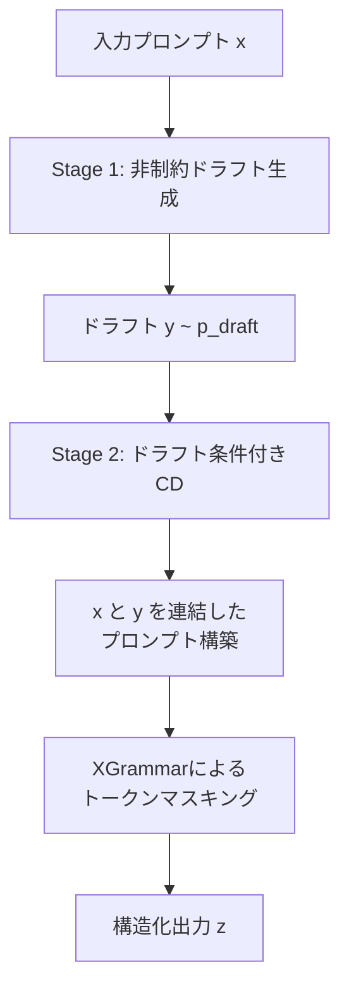

## 論文概要（Abstract）

本記事は [arXiv:2603.03305](https://arxiv.org/abs/2603.03305) の解説記事です。

Reddy, Walker, Ide, Bedi (2026) は、LLMの構造化出力で広く使われる制約デコーディング（CD）がモデルの推論能力を劣化させる「隠れたコスト」を理論的・実験的に明らかにし、**DCCD（Draft-Conditioned Constrained Decoding）** を提案している。CDではトークンマスキングと再正規化により有効トークンの確率質量（feasible mass）が小さいステップで分布歪みが蓄積する。DCCDはまず非制約のドラフトを生成し、そのドラフトを条件としてCDを適用する2段階方式で歪みを抑制する。著者らはGSM8Kで+23.8pp、MATH500で+23.2ppの精度向上を達成したと報告している。

この記事は [Zenn記事: Gemini 3.7 FlashのStructured Outputでチケット自動分類を実装する](https://zenn.dev/0h_n0/articles/8737a1d512e42e) の深掘りです。

## 情報源

- **arXiv ID**: 2603.03305
- **URL**: [https://arxiv.org/abs/2603.03305](https://arxiv.org/abs/2603.03305)
- **著者**: Avinash Reddy, Thayne T. Walker, James S. Ide, Amrit Singh Bedi
- **発表年**: 2026（v1: 2月、v2: 6月）
- **分野**: cs.CL, cs.LG

## 背景と動機（Background & Motivation）

LLMの出力をJSONなどの構造化フォーマットに従わせる技術は、プロダクション環境で不可欠である。構造化出力を保証する手法は主に2つに分類される。

- **制約プロンプティング（CP）**: フォーマット指示をプロンプトに含める。保証はないが推論能力への影響は小さい
- **制約デコーディング（CD）**: 各ステップで文法違反トークンをマスクし再正規化する。フォーマット遵守を100%保証するが推論能力に影響を与える

CDは形式的な正しさを保証する一方で「意味的な正しさ」を犠牲にする場合がある。著者らはこの現象を「構造化生成の隠れたコスト」と呼び、情報理論的に定式化した上で解決策を提案している。

## 主要な貢献（Key Contributions）

- **Projection Taxの理論的定式化**: CDにおける分布歪みをKLダイバージェンスで定量化し、系列長にわたって蓄積する「プロジェクション税」を導入
- **DCCDアルゴリズム**: 非制約ドラフト生成+条件付きCDの2段階方式でfeasible massを増大させProjection Taxを削減
- **Best-of-K選択戦略**: 累積対数feasible massに基づくドラフト選択が多数決投票を上回ることを実証

## 技術的詳細（Technical Details）

### Projection Tax: CDの歪みの定式化

CDではベース分布 $\pi_\theta(\cdot \mid h_t)$ を有効トークン集合 $\mathcal{V}(h_t)$ に射影する。制約付き分布は以下で定義される。

$$
q(v \mid h_t) = \frac{\pi_\theta(v \mid h_t)}{\alpha(h_t)}, \quad \alpha(h_t) = \sum_{v' \in \mathcal{V}(h_t)} \pi_\theta(v' \mid h_t)
$$

ここで、$\pi_\theta$はベースLLMの確率分布、$h_t$はステップ$t$までの生成履歴、$\mathcal{V}(h_t)$は文法的に許容されるトークン集合、$\alpha(h_t)$はfeasible mass（有効トークンへの確率質量合計）である。

各ステップのCDの歪みはKLダイバージェンスで測定できる。

$$
D_{\mathrm{KL}}(q(\cdot \mid h_t) \| \pi_\theta(\cdot \mid h_t)) = \log \frac{1}{\alpha(h_t)}
$$

feasible mass $\alpha(h_t)$ が小さいほど歪みが大きい。系列全体でのProjection Taxは各ステップの歪みの総和として蓄積する。

$$
\text{Projection Tax} = \sum_{t=1}^{T} \log \frac{1}{\alpha(h_t)}
$$

### DCCDアルゴリズム

DCCDは2段階の生成プロセスでfeasible massを増大させる。



**Stage 1**: 入力 $x$ に対してフォーマット制約なしでドラフト $y \sim p_{\text{draft}}(\cdot \mid x)$ を生成する。

**Stage 2**: ドラフト $y$ と元のプロンプト $x$ を連結し、CDを適用する。$z \sim p_{\text{CD}}(\cdot \mid x, y)$ を生成する。ドラフトが意味的ガイダンスを提供することで条件付きfeasible massが増大する。

$$
\tilde{\alpha}(\tilde{h}_t) \gg \alpha(h_t)
$$

**Best-of-K**: $K$個のドラフトでDCCDを実行し、累積対数feasible mass $S^{(k)} = \sum_{t=1}^{T} \log \tilde{\alpha}_t^{(k)}$ が最大のものを選択する。

### 擬似コード

```python
import torch
from xgrammar import GrammarMatcher


def dccd_generate(
    model: torch.nn.Module,
    tokenizer: object,
    prompt: str,
    grammar: GrammarMatcher,
    num_drafts: int = 1,
    max_tokens: int = 512,
) -> str:
    """Draft-Conditioned Constrained Decodingの実装概要

    Args:
        model: HuggingFace互換LLM
        tokenizer: トークナイザー
        prompt: 入力プロンプト
        grammar: XGrammar文法マッチャー
        num_drafts: ドラフト数（Best-of-K）
        max_tokens: 最大トークン数
    """
    best_output, best_score = "", float("-inf")

    for _ in range(num_drafts):
        # Stage 1: 非制約ドラフト生成
        inputs = tokenizer(prompt, return_tensors="pt")
        draft = model.generate(**inputs, max_new_tokens=max_tokens, do_sample=True)
        draft_text = tokenizer.decode(draft[0][inputs["input_ids"].shape[1]:])

        # Stage 2: ドラフト条件付き制約デコーディング
        cond_prompt = f"{prompt}\nDraft:\n{draft_text}\nOutput:"
        output_ids, cum_log_fm = [], 0.0
        grammar.reset()

        for _ in range(max_tokens):
            logits = model(**tokenizer(cond_prompt, return_tensors="pt")).logits[:, -1, :]
            probs = torch.softmax(logits, dim=-1)
            mask = grammar.get_next_token_bitmask()
            fm = (probs * mask).sum().item()
            if fm < 1e-10:
                break
            cum_log_fm += torch.log(torch.tensor(fm)).item()
            token = torch.multinomial(probs * mask / fm, 1)
            output_ids.append(token.item())
            if grammar.is_terminated():
                break
            grammar.accept_token(token.item())

        if cum_log_fm > best_score:
            best_score = cum_log_fm
            best_output = tokenizer.decode(output_ids, skip_special_tokens=True)

    return best_output
```

## 実装のポイント（Implementation）

- **XGrammar + vLLM統合**: vLLMのguided decodingバックエンドとしてXGrammarを指定することで既存サービングインフラへの統合が容易。トレーニング不要
- **ドラフトプロンプト構築**: ドラフトをプロンプトに連結する際のフォーマットがStage 2の性能に影響する
- **レイテンシ**: 2段階生成によりトークン生成量は約2倍。K=1でのオーバーヘッドはドラフト生成分のみ

## 実験結果（Results）

著者らは4つの手法を比較している（論文Table 1, Table 2より）。

| ベンチマーク | モデル | CP | CF | CD | DCCD | CDとの差 |
|-------------|--------|------|------|------|------|---------|
| GSM8K | Llama 3.2 1B | 6.07% | 9.78% | 15.24% | **39.04%** | +23.8pp |
| MATH500 | Qwen 2.5 1.5B | 9.0% | 15.2% | 15.0% | **38.2%** | +23.2pp |
| GSM-Symbolic | Qwen 2.5 7B | 37% | 48% | 26% | **41%** | +15pp |
| FOLIO | Qwen 2.5 14B | 17.24% | 15.76% | 18.72% | **25.62%** | +6.9pp |

GSM-SymbolicでCDがCPを下回る（26% vs 37%）のは、Projection Taxの蓄積による推論劣化を端的に示している。

パラメータ効率性について、7B+1.5BのDCCD構成（8.5Bパラメータ）は14B単体のCDを精度で上回り、精度/10億パラメータは10.7 vs 6.1である（論文Table 3より）。

Test-Time Scalingでは、K=13ドラフトでDCCDがGSM8K 83%（CDは73%）、MATH500 47%（CDは37%）に達している（論文Figure 3より）。

## 実運用への応用（Practical Applications）

Zenn記事で紹介されているGemini Structured Outputでのチケット分類では、APIレベルでフォーマット保証が提供される。DCCDの知見から、構造化出力で精度が低い場合はProjection Taxが原因である可能性がある。「まずフリーテキストで推論させ、その結果を構造化出力で整形する」2段階パイプラインはDCCDの原理と一致する。小型モデルほどProjection Taxの影響が大きいため、DCCDのような2段階手法の恩恵が大きい。

## Production Deployment Guide

DCCDはXGrammar + vLLMベースのトレーニング不要な推論手法であり、既存のLLMサービングインフラに統合できる。

### AWS実装パターン（コスト最適化重視）

| 構成 | トラフィック | サービス | 月額概算 |
|------|------------|---------|---------|
| Small | ~100 req/日 | Lambda + Bedrock | $50-150 |
| Medium | ~1,000 req/日 | ECS Fargate + vLLM | $800-2,000 |
| Large | 10,000+ req/日 | EKS + Spot + vLLM | $3,000-8,000 |

※2026年8月時点のap-northeast-1料金に基づく概算。実際のコストはトラフィックパターンにより変動する。

**Small構成**: Lambda関数からBedrock APIを2回呼び出す。Stage 1でフリーテキスト生成、Stage 2で構造化出力生成。内訳はBedrock $30-100、Lambda $5-10、DynamoDB（キャッシュ）$5-10。

**Medium構成**: ECS Fargate上でvLLM + XGrammarを稼働。g5.xlarge（A10G 24GB）でQwen 2.5 7Bを推論可能。内訳はFargate GPU $600-1,200、ALB $20。

**Large構成**: EKS + Karpenter + Spot Instancesで自動スケーリング。g5.2xlarge Spotで最大70%削減。内訳はEKS $73、EC2 Spot $2,000-5,000、ALB $50。

**コスト削減**: Spot活用で最大70%削減、Savings Plans 1年コミットで最大40%削減、ドラフトキャッシュで同一プロンプトの再生成回避。

### Terraformインフラコード

**Small構成（Serverless）**:

```hcl
# DCCD Small構成 - Lambda + Bedrock (ap-northeast-1, 2026-08)
resource "aws_iam_role" "dccd_lambda" {
  name = "dccd-lambda-role"
  assume_role_policy = jsonencode({
    Version = "2012-10-17"
    Statement = [{ Action = "sts:AssumeRole", Effect = "Allow",
      Principal = { Service = "lambda.amazonaws.com" } }]
  })
}

resource "aws_iam_role_policy" "dccd_bedrock" {
  name = "dccd-bedrock-access"
  role = aws_iam_role.dccd_lambda.id
  policy = jsonencode({
    Version = "2012-10-17"
    Statement = [
      { Effect = "Allow", Action = ["bedrock:InvokeModel"],
        Resource = "arn:aws:bedrock:ap-northeast-1::foundation-model/*" },
      { Effect = "Allow", Action = ["dynamodb:GetItem", "dynamodb:PutItem"],
        Resource = aws_dynamodb_table.dccd_cache.arn },
      { Effect = "Allow", Action = ["logs:CreateLogGroup", "logs:CreateLogStream", "logs:PutLogEvents"],
        Resource = "arn:aws:logs:*:*:*" }
    ]
  })
}

resource "aws_lambda_function" "dccd" {
  function_name = "dccd-inference"
  runtime       = "python3.12"
  handler       = "handler.lambda_handler"
  role          = aws_iam_role.dccd_lambda.arn
  timeout       = 120  # 2段階生成のため長めに設定
  memory_size   = 512
  environment {
    variables = { CACHE_TABLE = aws_dynamodb_table.dccd_cache.name }
  }
}

resource "aws_dynamodb_table" "dccd_cache" {
  name         = "dccd-draft-cache"
  billing_mode = "PAY_PER_REQUEST"
  hash_key     = "prompt_hash"
  attribute { name = "prompt_hash"; type = "S" }
  ttl { attribute_name = "expires_at"; enabled = true }
  server_side_encryption { enabled = true }
}
```

**Large構成（Container）**:

```hcl
# DCCD Large構成 - EKS + Karpenter + vLLM (ap-northeast-1, 2026-08)
module "eks" {
  source          = "terraform-aws-modules/eks/aws"
  version         = "~> 20.0"
  cluster_name    = "dccd-inference"
  cluster_version = "1.31"
  vpc_id          = module.vpc.vpc_id
  subnet_ids      = module.vpc.private_subnets
  cluster_endpoint_public_access = false
}

resource "kubectl_manifest" "karpenter_nodepool" {
  yaml_body = yamlencode({
    apiVersion = "karpenter.sh/v1"
    kind       = "NodePool"
    metadata   = { name = "dccd-gpu" }
    spec = {
      template = { spec = {
        requirements = [
          { key = "karpenter.sh/capacity-type", operator = "In", values = ["spot", "on-demand"] },
          { key = "node.kubernetes.io/instance-type", operator = "In", values = ["g5.xlarge", "g5.2xlarge"] },
        ]
      }}
      disruption = { consolidationPolicy = "WhenEmpty", consolidateAfter = "30s" }
      limits     = { cpu = "64", memory = "256Gi", "nvidia.com/gpu" = "8" }
    }
  })
}

resource "aws_budgets_budget" "dccd" {
  name = "dccd-monthly"
  budget_type  = "COST"
  limit_amount = "5000"
  limit_unit   = "USD"
  time_unit    = "MONTHLY"
  notification {
    comparison_operator = "GREATER_THAN"
    threshold = 80
    threshold_type = "PERCENTAGE"
    notification_type = "ACTUAL"
    subscriber_sns_topic_arns = [aws_sns_topic.alerts.arn]
  }
}
```

### 運用・監視設定

**CloudWatch Logs Insights クエリ**:

```
# DCCD Stage別レイテンシ分析
fields @timestamp, stage, duration_ms, feasible_mass_avg
| filter event = "dccd_inference"
| stats avg(duration_ms) as avg_ms, percentile(duration_ms, 95) as p95_ms by stage

# トークン使用量異常検知
fields @timestamp, input_tokens, output_tokens
| filter event = "dccd_inference"
| stats sum(input_tokens + output_tokens) as total_tokens by bin(1h)
| sort total_tokens desc
```

**X-Ray トレーシング + Cost Explorer（Python）**:

```python
import datetime

import boto3
from aws_xray_sdk.core import xray_recorder, patch_all

patch_all()

@xray_recorder.capture("dccd_stage1")
def generate_draft(prompt: str) -> str:
    """Stage 1のドラフト生成をトレースする"""
    xray_recorder.current_subsegment().put_annotation("stage", "draft")
    # ドラフト生成処理
    return draft_text

@xray_recorder.capture("dccd_stage2")
def generate_constrained(prompt: str, draft: str) -> str:
    """Stage 2の制約デコーディングをトレースする"""
    xray_recorder.current_subsegment().put_annotation("stage", "constrained")
    # 制約デコーディング処理
    return output

def daily_cost_report() -> None:
    """日次コストレポートを取得し閾値超過時にSNS通知する"""
    ce = boto3.client("ce", region_name="us-east-1")
    today = datetime.date.today()
    resp = ce.get_cost_and_usage(
        TimePeriod={"Start": str(today - datetime.timedelta(days=1)), "End": str(today)},
        Granularity="DAILY", Metrics=["UnblendedCost"],
        GroupBy=[{"Type": "DIMENSION", "Key": "SERVICE"}],
    )
    total = sum(float(g["Metrics"]["UnblendedCost"]["Amount"])
                for g in resp["ResultsByTime"][0]["Groups"])
    if total > 100:
        boto3.client("sns").publish(
            TopicArn="arn:aws:sns:ap-northeast-1:ACCOUNT:dccd-alerts",
            Subject=f"DCCD Cost Alert: ${total:.0f}/day", Message=str(resp))
```

### コスト最適化チェックリスト

**アーキテクチャ選択**:
- [ ] トラフィック量に応じた構成選択（Small: Serverless / Medium: Fargate / Large: EKS）
- [ ] 2段階パイプラインに応じたタイムアウト設定

**リソース最適化**:
- [ ] EC2/EKS: Spot Instances優先（g5系で最大70%削減）
- [ ] Reserved/Savings Plans: 安定ワークロードは1年コミット（最大40%削減）
- [ ] Lambda: メモリサイズ最適化（Power Tuningで検証）
- [ ] EKS: Karpenter consolidateAfter: 30sで自動スケールダウン
- [ ] 非ピーク時ノード削減

**LLMコスト削減**:
- [ ] ドラフトキャッシュ: DynamoDB TTL付きで同一プロンプトの再利用
- [ ] Best-of-K: 精度要件に応じてK値を最小化
- [ ] モデル選択: Stage 1は大型、Stage 2は小型でパラメータ効率最大化
- [ ] トークン数制限: ドラフト長の上限設定

**監視・アラート**:
- [ ] AWS Budgets: 月次予算（80%到達で通知）
- [ ] CloudWatch: 推論レイテンシp95、トークン使用量スパイク
- [ ] Cost Anomaly Detection: 自動異常検知
- [ ] 日次コストレポート: Cost Explorer + SNS

**リソース管理**:
- [ ] Karpenter consolidationで未使用GPU自動停止
- [ ] タグ戦略: Environment/Service/CostCenterタグ必須
- [ ] ECRライフサイクルポリシー: 古いイメージ自動削除
- [ ] CloudWatch Logs: 保持期間30日
- [ ] 開発環境: 夜間・週末自動停止

## 関連研究（Related Work）

- **XGrammar (Dong et al., 2024)**: CDの実装基盤としてDCCDでも採用。プッシュダウンオートマトンによる高速トークンマスキングを提供
- **Speculative Decoding (Leviathan et al., 2023)**: 小型モデルでドラフト生成し大型で検証する手法。DCCDは概念的に類似するが目的が速度ではなく精度向上
- **Let Me Speak Freely (Tam et al., 2024)**: CDが推論能力を損なうことを実験的に示した先行研究。DCCDはこの知見に基づき理論的分析と解決策を提示

## まとめと今後の展望

DCCDは、構造化出力のCDにおける「隠れたコスト」を理論的に定式化し、2段階パイプラインで解決する手法である。GSM8Kで+23.8pp、MATH500で+23.2ppの精度向上は、小型モデルでのCD歪みの深刻さを示している。

実務への示唆として、構造化出力タスクでは「まず自由に推論させ、その後構造化する」2段階アプローチが有効である。この原理はZenn記事のチケット分類のようなユースケースで精度改善策となりうる。今後の研究方向として、著者らはAPIサービスへの統合やマルチモーダル出力への拡張を挙げている。

## 参考文献

- **arXiv**: [https://arxiv.org/abs/2603.03305](https://arxiv.org/abs/2603.03305)
- **XGrammar**: [https://github.com/mlc-ai/xgrammar](https://github.com/mlc-ai/xgrammar)
- **Related Zenn article**: [https://zenn.dev/0h_n0/articles/8737a1d512e42e](https://zenn.dev/0h_n0/articles/8737a1d512e42e)
