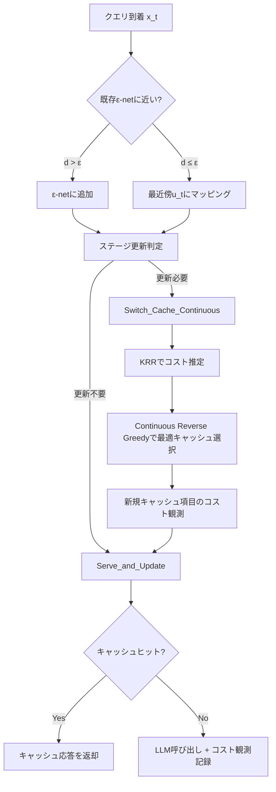
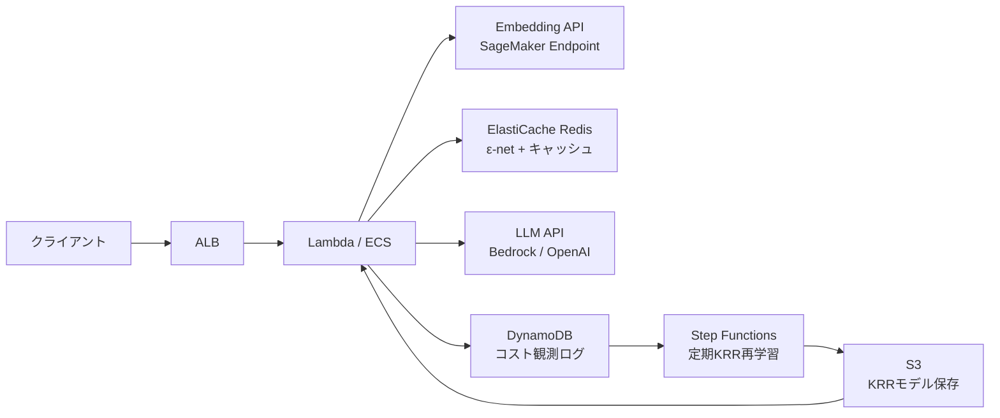

本記事は [https://arxiv.org/abs/2604.20021](https://arxiv.org/abs/2604.20021) の解説記事です。

セマンティックキャッシュの実践的な最適化手法については、関連するZenn記事「[セマンティックキャッシュ最適化10手法でLLM推論を高速化する](https://zenn.dev/0h_n0/articles/c2df29cd7e4092)」も参照されたい。

## 情報源

| 項目 | 内容 |
|------|------|
| 論文タイトル | Continuous Semantic Caching for Low-Cost LLM Serving |
| 著者 | Baran Atalar, Xutong Liu, Jinhang Zuo, Siwei Wang, Wei Chen, Carlee Joe-Wong |
| arXiv ID | 2604.20021 |
| カテゴリ | cs.LG, cs.CL |
| 投稿日 | 2026年4月21日 |

## 論文概要

LLMの推論コスト削減においてセマンティックキャッシュは有望なアプローチであるが、従来手法はクエリ空間を有限の離散集合として扱っていた。しかし実際のユーザクエリは埋め込み空間上の連続分布から生成されるため、離散モデルでは近似誤差が避けられない。

著者らは、**連続クエリ空間におけるセマンティックキャッシュの初の理論的フレームワーク**を提案している。このフレームワークは、動的な$\varepsilon$-net離散化によって無限次元の埋め込み空間を扱い、カーネルリッジ回帰（KRR）によってコスト関数を推定する。Oracle・オフライン・オンラインの3設定に対してアルゴリズムを提供し、オンライン設定では$\tilde{O}(\sqrt{T})$の劣線形リグレットを達成することが示されている。

## 背景と動機

### 離散空間モデルの限界

従来のセマンティックキャッシュ研究（Liu et al., 2026 等）では、クエリ集合$\mathcal{Q}$を有限サイズ$m$の離散集合としてモデル化していた。この場合、各クエリの到着頻度やサービングコストを経験的に推定できるため、組合せ多腕バンディット（CMAB）の枠組みで解くことができる。

しかし著者らは、この離散モデルには以下の根本的問題があると指摘している。

1. **カバレッジの不完全性**: 実際のユーザクエリは連続的な埋め込み空間$\mathcal{X} \subset \mathbb{R}^{d_e}$上に分布しており、有限個の代表点では空間全体をカバーできない
2. **汎化の欠如**: 離散モデルでは各クエリを独立に扱うため、意味的に近いクエリ間でのコスト情報の共有ができない
3. **動的な空間拡大**: オンライン環境では未知のクエリが次々と到着するため、事前に離散集合を固定できない

### 連続空間への拡張が必要な理由

著者らは、sentence-transformerで生成されたクエリ埋め込みをUMAPで可視化し、クエリが連続空間上に自然なクラスタ構造を形成していることを実験的に確認している。このクラスタ構造は、近傍のクエリ間でコスト情報を共有する理論的根拠を与えている。

## 主要な貢献

著者らは以下の4つの貢献を報告している。

1. **連続空間セマンティックキャッシュの理論的フレームワーク**: $\varepsilon$-netによる離散化とVoronoiセル重み推定を組み合わせ、連続空間の問題を近似的に離散問題へ帰着させる手法
2. **カーネルリッジ回帰によるコスト推定**: 観測されたコスト情報をカーネル関数で空間全体に汎化し、信頼区間付きの推定を実現
3. **3つのアルゴリズム**: Oracle設定（Continuous Reverse Greedy）、オフライン設定（CUCB-SC-Cont）、オンライン適応設定（CLCB-SC-LS-Cont）の各アルゴリズム
4. **劣線形リグレット保証**: オンライン設定でスイッチングコストを含めても$\tilde{O}(\sqrt{T})$のリグレットを達成

## 技術的詳細

### 問題定式化

クエリは連続的な確率密度関数$f: \mathcal{X} \to \mathbb{R}_+$（$\int_{\mathcal{X}} f(x)dx = 1$）から生成される。各クエリ$x$に対するサービングコスト$c(x) \in (0,1]$が存在し、キャッシュ$\mathcal{M}$内の応答$u$を代用する場合のミスマッチコストは$\varphi(d(x,u)) \in [0,1]$で与えられる。

キャッシュの損失関数は以下のように定義される。

$$\mathcal{L}(\mathcal{M}; f, c, d) = \int_{\mathcal{X}} f(x) \min\{c(x),\; \varphi(d(x, \mathcal{M}))\}\, dx$$

ここで$d(x, \mathcal{M}) = \min_{u \in \mathcal{M}} d(x, u)$はクエリ$x$からキャッシュ$\mathcal{M}$までの最短距離である。最適化目標は、サイズ$k$以下のキャッシュ$\mathcal{M}^*$でこの損失を最小化することである。

$$\mathcal{M}^* = \arg\min_{|\mathcal{M}| \le k} \mathcal{L}(\mathcal{M}; f, c, d)$$

### $\varepsilon$-net離散化

無限次元の連続空間を有限の離散問題に帰着させるため、著者らは$\varepsilon$-netを用いた離散化を導入している。

**定義**($\varepsilon$-net): 集合$\mathcal{S} = \{x_1, \ldots, x_m\} \subseteq \mathcal{X}$が$\varepsilon$-netであるとは、任意の$x \in \mathcal{X}$に対して$\exists x_i \in \mathcal{S}$で$d(x, x_i) \le \varepsilon$を満たすことをいう。

$\varepsilon$-netに基づくVoronoiセル$V_i = \{x \in \mathcal{X} : d(x, x_i) \le d(x, x_j),\; \forall j \ne i\}$を構成し、セル重み$w_i = \int_{V_i} f(x)dx$を定義する。これにより離散化された損失関数が得られる。

$$\hat{L}(\mathcal{M}; \mathcal{S}, \mathbf{w}, c) = \sum_i w_i \min\{c(x_i),\; \varphi(d(x_i, \mathcal{M}))\}$$

**補題 3.2**（連続-離散近似誤差）: $g_{\mathcal{M}}(x) = \min\{c(x), \varphi(d(x,\mathcal{M}))\}$がLipschitz定数$L_g$を持つとき、以下が成り立つ。

$$|\mathcal{L}(\mathcal{M}) - \hat{L}(\mathcal{M}, \mathcal{S})| \le L_g \cdot \varepsilon$$

この結果は、$\varepsilon$-netの被覆半径$\varepsilon$を小さくすれば近似精度が線形に改善されることを示している。ただしグリッドサイズ$m$は$\varepsilon$に対して$O(\varepsilon^{-d_e})$でスケールするため、次元$d_e$との間にトレードオフが存在する。

### カーネルリッジ回帰によるコスト推定

コスト$c(x)$は、LLMに実際にクエリを送った場合のみ観測される。そのため、観測点から空間全体のコスト関数を推定する必要がある。著者らはカーネルリッジ回帰（KRR）を採用している。

観測データ$\{(x_{t_i}, C_{t_i})\}_{i=1}^{\ell}$（$C_t(x) = c(x) + \eta_t(x)$、$\eta_t$は$R$-劣ガウスノイズ）に対して、カーネル$\kappa: \mathcal{X} \times \mathcal{X} \to \mathbb{R}$を用いた推定は以下で与えられる。

**予測平均**:

$$\hat{c}(x) = \boldsymbol{\kappa}_x^T (K + \ell\lambda I)^{-1} \mathbf{y}$$

**事後分散**:

$$\sigma^2_{\ell,\lambda}(x) = \kappa(x,x) - \boldsymbol{\kappa}_x^T (K + \ell\lambda I)^{-1} \boldsymbol{\kappa}_x$$

ここで$K \in \mathbb{R}^{\ell \times \ell}$はカーネル行列（$K_{ij} = \kappa(x_{t_i}, x_{t_j})$）、$\boldsymbol{\kappa}_x = [\kappa(x_{t_1}, x), \ldots, \kappa(x_{t_\ell}, x)]^T$はカーネルベクトルである。

**信頼区間**の半幅は以下で定義される。

$$\Delta(x) = \left(B + \sqrt{\frac{\log(2m/\delta)}{\ell\lambda}}\right) \cdot \sigma_{\ell,\lambda}(x)$$

この$\Delta(x)$を用いて、悲観的コスト推定$\bar{c}(x) = \hat{c}(x) + \Delta(x)$（上側信頼限界）を構成する。

### リグレット境界の分析

#### オフライン設定（定理 4.1）

$n$個のサンプルからキャッシュ$\hat{\mathcal{M}}$を構築した場合の準最適性ギャップは、3つの誤差項に分解される。

$$\text{SubOpt}(\hat{\mathcal{M}}) \le \underbrace{O\!\left(\sqrt{\frac{m}{n}}\right)}_{\text{到着推定誤差}} + \underbrace{O\!\left(m^{-1/d_e}\right)}_{\varepsilon\text{-net離散化誤差}} + \underbrace{O\!\left(n^{-1/(2p)}\right)}_{\text{コスト推定誤差}}$$

ここで$p$はカーネルの固有値減衰に依存する実効次元、$d_e$は埋め込み空間の次元である。最適な$\varepsilon^*$は$O(n^{-1/(2d_e + p)})$で与えられ、離散化誤差と推定誤差のバランスを取る。

#### オンライン設定（定理 5.1）

クラスタベース到着仮定（仮定2）の下で、$T$ラウンドにわたる累積リグレットは以下の上界を持つ。

$$\text{Reg}(T) \le O\!\left(\beta_T \sqrt{T \gamma_T} + \sqrt{m_{\text{eff}} \cdot T \cdot \log T} + (1+2\alpha) L_g \sqrt{T} + k \cdot m_{\max} \cdot \log\log T\right)$$

各項の意味は以下の通りである。

- $\beta_T \sqrt{T \gamma_T}$: KRRのコスト推定誤差（$\gamma_T$は情報利得）
- $\sqrt{m_{\text{eff}} \cdot T \cdot \log T}$: 実効クラスタ数$m_{\text{eff}}$に依存する到着推定誤差
- $(1+2\alpha) L_g \sqrt{T}$: $\varepsilon$-net離散化に起因する誤差
- $k \cdot m_{\max} \cdot \log\log T$: スイッチングコスト（対数的に増加）

全体として$\tilde{O}(\sqrt{T})$の劣線形リグレットが達成されている。特にスイッチングコストが$O(\log\log T)$に抑えられている点は、キャッシュ更新の実用的な頻度制御に重要である。

## アルゴリズム

### 全体構成



### Pythonによる主要アルゴリズム実装

以下は、論文の中核的なアルゴリズム概念をPythonで実装した例である。

```python
"""Continuous Semantic Caching の主要コンポーネント実装.

論文 arXiv:2604.20021 のアルゴリズム概念を再現するコード例。
"""

from __future__ import annotations

import numpy as np
from numpy.typing import NDArray
from sklearn.kernel_ridge import KernelRidge
from scipy.spatial import KDTree
from dataclasses import dataclass, field


@dataclass(frozen=True)
class CacheItem:
    """キャッシュに格納するクエリ-応答ペア."""

    query_embedding: NDArray[np.float64]
    response: str
    estimated_cost: float


@dataclass
class EpsilonNet:
    """ε-net による連続空間の動的離散化.

    Args:
        epsilon: 被覆半径
        dim: 埋め込み次元
    """

    epsilon: float
    dim: int
    centers: list[NDArray[np.float64]] = field(default_factory=list)
    cell_counts: list[int] = field(default_factory=list)
    _tree: KDTree | None = field(default=None, repr=False)

    def add_or_map(self, x: NDArray[np.float64]) -> tuple[int, bool]:
        """クエリを最近傍センターにマッピングするか、新センターを追加する.

        Args:
            x: d次元の埋め込みベクトル

        Returns:
            (センターインデックス, 新規追加されたかどうか)
        """
        if len(self.centers) == 0:
            self.centers.append(x.copy())
            self.cell_counts.append(1)
            self._rebuild_tree()
            return 0, True

        dist, idx = self._tree.query(x)  # type: ignore[union-attr]
        if dist > self.epsilon:
            self.centers.append(x.copy())
            self.cell_counts.append(1)
            self._rebuild_tree()
            return len(self.centers) - 1, True

        self.cell_counts[idx] += 1
        return int(idx), False

    def get_weights(self) -> NDArray[np.float64]:
        """各Voronoiセルの経験的重み（正規化された到着頻度）を返す."""
        total = sum(self.cell_counts)
        if total == 0:
            return np.zeros(len(self.centers))
        return np.array(self.cell_counts, dtype=np.float64) / total

    def _rebuild_tree(self) -> None:
        self._tree = KDTree(np.array(self.centers))


class KRRCostEstimator:
    """カーネルリッジ回帰によるサービングコスト推定器.

    Args:
        kernel: カーネル関数の種類（'rbf', 'matern' 等）
        alpha: 正則化パラメータ λ
        gamma: RBFカーネルの帯域幅パラメータ
    """

    def __init__(
        self,
        kernel: str = "rbf",
        alpha: float = 1.0,
        gamma: float | None = None,
    ) -> None:
        self.model = KernelRidge(kernel=kernel, alpha=alpha, gamma=gamma)
        self._observations_x: list[NDArray[np.float64]] = []
        self._observations_c: list[float] = []
        self._is_fitted: bool = False

    def add_observation(self, x: NDArray[np.float64], cost: float) -> None:
        """コスト観測を追加する.

        Args:
            x: クエリ埋め込み
            cost: 観測されたサービングコスト（ノイズ含む）
        """
        self._observations_x.append(x.copy())
        self._observations_c.append(cost)
        self._is_fitted = False

    def fit(self) -> None:
        """蓄積された観測データでKRRモデルを学習する."""
        if len(self._observations_x) < 2:
            return
        X = np.array(self._observations_x)
        y = np.array(self._observations_c)
        self.model.fit(X, y)
        self._is_fitted = True

    def predict_with_confidence(
        self,
        x: NDArray[np.float64],
        delta: float = 0.05,
        bound_B: float = 1.0,
    ) -> tuple[float, float]:
        """コストの点推定と信頼区間上界を返す.

        Args:
            x: クエリ埋め込み
            delta: 信頼水準パラメータ
            bound_B: コスト関数の上界 B

        Returns:
            (悲観的コスト推定 c̄(x), 信頼区間幅 Δ(x))
        """
        if not self._is_fitted or len(self._observations_x) < 2:
            return 1.0, 1.0  # 情報不足時は最大コストを仮定

        X_obs = np.array(self._observations_x)
        ell = len(self._observations_x)
        lam = self.model.alpha
        m = ell  # 代表点数（簡略化）

        c_hat = float(self.model.predict(x.reshape(1, -1))[0])

        # 事後分散の近似計算
        if self.model.gamma is not None:
            gamma = self.model.gamma
        else:
            gamma = 1.0 / x.shape[0]

        k_x = np.exp(-gamma * np.sum((X_obs - x) ** 2, axis=1))
        K = np.exp(
            -gamma
            * np.sum(
                (X_obs[:, None, :] - X_obs[None, :, :]) ** 2, axis=2
            )
        )
        K_reg = K + ell * lam * np.eye(ell)
        K_reg_inv = np.linalg.inv(K_reg)

        sigma_sq = max(0.0, 1.0 - k_x @ K_reg_inv @ k_x)
        sigma = np.sqrt(sigma_sq)

        # 信頼区間幅: Δ(x) = (B + sqrt(log(2m/δ)/(ℓλ))) · σ(x)
        confidence_multiplier = bound_B + np.sqrt(
            np.log(2 * m / delta) / (ell * lam)
        )
        delta_x = confidence_multiplier * sigma

        pessimistic_cost = min(1.0, max(0.0, c_hat + delta_x))
        return pessimistic_cost, delta_x


def continuous_reverse_greedy(
    centers: NDArray[np.float64],
    weights: NDArray[np.float64],
    costs: NDArray[np.float64],
    k: int,
    phi: callable = lambda d: min(1.0, d),
) -> list[int]:
    """Continuous Reverse Greedy アルゴリズム（Algorithm 1）.

    全センターから開始し、損失増加が最小の要素を反復的に除去する。

    Args:
        centers: ε-netセンター座標 (m, d)
        weights: Voronoiセル重み (m,)
        costs: 各センターの推定コスト (m,)
        k: キャッシュサイズ上限
        phi: ミスマッチコスト関数 φ(d)

    Returns:
        選択されたセンターのインデックスリスト（サイズ k）
    """
    m = len(centers)
    if m <= k:
        return list(range(m))

    active = set(range(m))

    for _ in range(m - k):
        best_remove = -1
        best_loss_increase = float("inf")

        for candidate in list(active):
            remaining = active - {candidate}
            if not remaining:
                break

            remaining_centers = centers[list(remaining)]
            tree = KDTree(remaining_centers)

            loss_increase = 0.0
            for j in active:
                if j == candidate:
                    dist, _ = tree.query(centers[j])
                    mismatch = phi(dist)
                    loss_increase += weights[j] * max(
                        0, min(costs[j], mismatch) - costs[j]
                    )

            if loss_increase < best_loss_increase:
                best_loss_increase = loss_increase
                best_remove = candidate

        if best_remove >= 0:
            active.discard(best_remove)

    return sorted(active)


@dataclass
class ContinuousSemanticCache:
    """連続空間セマンティックキャッシュのオンライン適応アルゴリズム.

    CLCB-SC-LS-Cont（Algorithm 3）の簡略実装。

    Args:
        cache_size: キャッシュサイズ k
        epsilon: ε-netの被覆半径
        embedding_dim: 埋め込み次元
        switch_threshold: ステージ更新の閾値パラメータ
    """

    cache_size: int
    epsilon: float
    embedding_dim: int
    switch_threshold: float = 1.0
    _net: EpsilonNet = field(init=False)
    _estimator: KRRCostEstimator = field(init=False)
    _cache_indices: list[int] = field(default_factory=list)
    _cache_responses: dict[int, str] = field(default_factory=dict)
    _step: int = 0
    _local_stage_counts: dict[int, int] = field(default_factory=dict)

    def __post_init__(self) -> None:
        self._net = EpsilonNet(epsilon=self.epsilon, dim=self.embedding_dim)
        self._estimator = KRRCostEstimator(alpha=0.1, gamma=1.0)

    def process_query(
        self,
        query_embedding: NDArray[np.float64],
        llm_call: callable,
    ) -> tuple[str, bool]:
        """クエリを処理し、キャッシュヒットまたはLLM呼び出しで応答を返す.

        Args:
            query_embedding: クエリの埋め込みベクトル
            llm_call: LLM呼び出し関数 (embedding -> (response, cost))

        Returns:
            (応答テキスト, キャッシュヒットしたかどうか)
        """
        self._step += 1

        # Step 1: ε-netへのマッピング
        center_idx, is_new = self._net.add_or_map(query_embedding)

        # Step 2: ステージ更新判定
        should_switch = self._should_switch_cache(center_idx, is_new)

        if should_switch and len(self._net.centers) >= self.cache_size:
            self._update_cache()

        # Step 3: キャッシュヒット判定
        if self._cache_indices and self._net._tree is not None:
            cache_centers = np.array(
                [self._net.centers[i] for i in self._cache_indices]
            )
            cache_tree = KDTree(cache_centers)
            dist, nearest = cache_tree.query(query_embedding)

            pessimistic_cost, _ = self._estimator.predict_with_confidence(
                query_embedding
            )

            mismatch_cost = min(1.0, dist)

            if mismatch_cost < pessimistic_cost:
                cache_idx = self._cache_indices[nearest]
                if cache_idx in self._cache_responses:
                    return self._cache_responses[cache_idx], True

        # Step 4: LLM呼び出し
        response, observed_cost = llm_call(query_embedding)
        self._estimator.add_observation(query_embedding, observed_cost)

        if self._step % 10 == 0:
            self._estimator.fit()

        self._cache_responses[center_idx] = response
        return response, False

    def _should_switch_cache(self, center_idx: int, is_new: bool) -> bool:
        """ステージベースのスイッチング判定."""
        if is_new:
            self._local_stage_counts[center_idx] = 0
            return True

        count = self._local_stage_counts.get(center_idx, 0)
        self._local_stage_counts[center_idx] = count + 1

        threshold = 1 + self.switch_threshold * np.sqrt(
            self._step / max(1, len(self._net.centers))
        )
        return count >= threshold

    def _update_cache(self) -> None:
        """Continuous Reverse Greedyでキャッシュを再構成する."""
        self._estimator.fit()
        centers = np.array(self._net.centers)
        weights = self._net.get_weights()

        costs = np.array([
            self._estimator.predict_with_confidence(c)[0]
            for c in centers
        ])

        self._cache_indices = continuous_reverse_greedy(
            centers, weights, costs, self.cache_size
        )
```

## 実装のポイント

著者らの論文から読み取れる実装上の重要な考慮点を以下にまとめる。

### $\varepsilon$の選択

$\varepsilon$が小さすぎるとグリッド点$m$が指数的に増大し計算コストが爆発する。一方、$\varepsilon$が大きすぎると近似精度が劣化する。著者らの実験では$\varepsilon = 0.4$（正規化されたユークリッド距離）が最良の性能を示したと報告されている。理論的には最適な$\varepsilon^* = O(n^{-1/(2d_e + p)})$がサンプルサイズ$n$と空間次元$d_e$、カーネル実効次元$p$から決まる。

### カーネルの選択

RBFカーネル$\kappa(x,y) = \exp(-\gamma \|x-y\|^2)$が著者らの実験で用いられている。帯域幅$\gamma$はクエリ空間のスケールに依存するため、クロスバリデーションまたはメディアンヒューリスティックで選択するのが実用的である。

### スイッチングコストの制御

オンライン設定でのキャッシュ更新頻度は$O(\log\log T)$に抑えられている。これは、ステージベースの更新判定により、到着分布とコスト推定の両方が十分に変化した場合にのみキャッシュを再構成する仕組みによる。

## Production Deployment Guide

本論文で提案されたアルゴリズムは、LLMサービングのコスト削減に直接適用可能である。ここでは、AWSを中心としたプロダクション環境への展開パターンを解説する。

### アーキテクチャ概要



### コンポーネント設計

#### 1. 埋め込みベクトル生成

SageMaker EndpointまたはBedrock Embedding APIでクエリを384次元のベクトルに変換する。sentence-transformersの`all-MiniLM-L6-v2`が論文の実験で使用されているモデルに近い。

```python
"""SageMaker Embedding Endpoint 呼び出し例."""
import boto3
import json
import numpy as np

sagemaker_runtime = boto3.client("sagemaker-runtime")

def get_embedding(text: str, endpoint_name: str) -> np.ndarray:
    """SageMaker Endpointから埋め込みベクトルを取得する.

    Args:
        text: 入力テキスト
        endpoint_name: SageMakerエンドポイント名

    Returns:
        384次元の埋め込みベクトル
    """
    response = sagemaker_runtime.invoke_endpoint(
        EndpointName=endpoint_name,
        ContentType="application/json",
        Body=json.dumps({"inputs": text}),
    )
    result = json.loads(response["Body"].read().decode())
    return np.array(result[0], dtype=np.float64)
```

#### 2. $\varepsilon$-net管理（ElastiCache Redis）

$\varepsilon$-netのセンター座標とVoronoiセル重みをRedisに格納する。Redis Searchのベクトル検索機能（HNSW）を利用すれば、$O(\log m)$で最近傍センターへのマッピングが可能である。

```python
"""Redis ベースの ε-net 管理."""
import redis
import numpy as np
import struct


class RedisEpsilonNet:
    """ElastiCache Redis 上の ε-net 管理.

    Args:
        redis_client: Redisクライアント
        epsilon: 被覆半径
        dim: 埋め込み次元
        prefix: Redisキーのプレフィックス
    """

    def __init__(
        self,
        redis_client: redis.Redis,
        epsilon: float,
        dim: int = 384,
        prefix: str = "enet",
    ) -> None:
        self.r = redis_client
        self.epsilon = epsilon
        self.dim = dim
        self.prefix = prefix

    def add_or_map(
        self, query_vec: np.ndarray
    ) -> tuple[str, bool]:
        """クエリを最近傍センターにマッピングまたは新規追加.

        Returns:
            (センターID, 新規追加されたか)
        """
        # Redis Search で最近傍検索
        vec_bytes = query_vec.astype(np.float32).tobytes()
        results = self.r.execute_command(
            "FT.SEARCH",
            f"{self.prefix}:idx",
            f"*=>[KNN 1 @vec $vec]",
            "PARAMS", "2", "vec", vec_bytes,
            "RETURN", "1", "__vec_score",
            "DIALECT", "2",
        )

        if results[0] > 0:
            nearest_id = results[1].decode()
            dist = float(results[2][1])
            if dist <= self.epsilon:
                # 既存センターにマッピング
                self.r.hincrby(
                    f"{self.prefix}:count:{nearest_id}", "n", 1
                )
                return nearest_id, False

        # 新規センター追加
        center_id = f"c{self.r.incr(f'{self.prefix}:seq')}"
        self.r.hset(
            f"{self.prefix}:center:{center_id}",
            mapping={
                "vec": vec_bytes,
                "n": 1,
            },
        )
        return center_id, True
```

#### 3. コスト観測ログ（DynamoDB）

LLM呼び出し時の観測コスト（レイテンシ、トークン数）をDynamoDBに記録する。KRRモデルの再学習に使用する。

```python
"""DynamoDB へのコスト観測記録."""
import boto3
import time
from decimal import Decimal

dynamodb = boto3.resource("dynamodb")
table = dynamodb.Table("semantic-cache-observations")


def log_cost_observation(
    center_id: str,
    query_embedding: list[float],
    observed_cost: float,
    latency_ms: float,
    tokens_used: int,
) -> None:
    """コスト観測をDynamoDBに記録する.

    Args:
        center_id: ε-netセンターID
        query_embedding: クエリ埋め込み（最初の32次元のみ保存）
        observed_cost: 正規化済みサービングコスト
        latency_ms: LLM応答レイテンシ（ミリ秒）
        tokens_used: 使用トークン数
    """
    table.put_item(
        Item={
            "center_id": center_id,
            "timestamp": Decimal(str(time.time())),
            "embedding_prefix": [
                Decimal(str(round(v, 6)))
                for v in query_embedding[:32]
            ],
            "observed_cost": Decimal(str(round(observed_cost, 6))),
            "latency_ms": Decimal(str(round(latency_ms, 2))),
            "tokens_used": tokens_used,
        }
    )
```

#### 4. 定期KRR再学習（Step Functions + Lambda）

DynamoDBのコスト観測データからKRRモデルを再学習し、S3に保存する。推論時にLambdaがS3からモデルをロードしてコスト推定に用いる。

```python
"""Step Functions から呼び出される KRR 再学習 Lambda."""
import boto3
import pickle
import numpy as np
from sklearn.kernel_ridge import KernelRidge

s3 = boto3.client("s3")
dynamodb = boto3.resource("dynamodb")


def handler(event: dict, context: object) -> dict:
    """KRRモデルの再学習と保存.

    EventBridgeルールで6時間ごとに実行される想定。
    """
    table = dynamodb.Table("semantic-cache-observations")

    # 直近24時間の観測データを取得
    response = table.scan(Limit=10000)
    items = response["Items"]

    if len(items) < 50:
        return {"status": "skipped", "reason": "insufficient_data"}

    X = np.array([
        [float(v) for v in item["embedding_prefix"]]
        for item in items
    ])
    y = np.array([float(item["observed_cost"]) for item in items])

    model = KernelRidge(kernel="rbf", alpha=0.1, gamma=1.0)
    model.fit(X, y)

    model_bytes = pickle.dumps(model)
    s3.put_object(
        Bucket="semantic-cache-models",
        Key="krr/latest.pkl",
        Body=model_bytes,
    )

    return {
        "status": "success",
        "n_samples": len(items),
        "model_key": "krr/latest.pkl",
    }
```

#### 5. キャッシュ判定フロー（Lambda / ECS）

全コンポーネントを統合したリクエスト処理フローは以下の通りである。

```python
"""メインのキャッシュ判定フロー."""
import time
import numpy as np


async def handle_query(
    query: str,
    embedding_client,
    redis_net: "RedisEpsilonNet",
    krr_model,
    llm_client,
    cache_size: int = 100,
) -> dict:
    """クエリを受け取り、キャッシュヒットまたはLLM呼び出しで応答する.

    Args:
        query: ユーザクエリ文字列
        embedding_client: 埋め込みAPIクライアント
        redis_net: Redis上のε-net管理
        krr_model: 学習済みKRRモデル
        llm_client: LLM APIクライアント
        cache_size: キャッシュサイズ上限 k

    Returns:
        応答辞書（response, cache_hit, latency_ms）
    """
    start = time.monotonic()

    # 1. 埋め込み生成
    query_vec = await embedding_client.embed(query)

    # 2. ε-netマッピング
    center_id, is_new = redis_net.add_or_map(query_vec)

    # 3. キャッシュ検索
    cached = redis_net.r.get(f"cache:response:{center_id}")
    if cached and not is_new:
        # ミスマッチコスト vs 推定サービングコストの比較
        pessimistic_cost = float(
            krr_model.predict(query_vec.reshape(1, -1))[0]
        )
        cache_dist = float(
            redis_net.r.get(f"cache:dist:{center_id}") or "1.0"
        )
        mismatch = min(1.0, cache_dist)

        if mismatch < pessimistic_cost:
            elapsed = (time.monotonic() - start) * 1000
            return {
                "response": cached.decode(),
                "cache_hit": True,
                "latency_ms": elapsed,
            }

    # 4. LLM呼び出し
    llm_start = time.monotonic()
    response = await llm_client.generate(query)
    llm_latency = (time.monotonic() - llm_start) * 1000

    # 5. コスト観測記録 + キャッシュ更新
    observed_cost = llm_latency / 10000.0  # 正規化
    log_cost_observation(
        center_id, query_vec.tolist(), observed_cost,
        llm_latency, len(response.split()),
    )
    redis_net.r.setex(
        f"cache:response:{center_id}", 3600, response
    )

    elapsed = (time.monotonic() - start) * 1000
    return {
        "response": response,
        "cache_hit": False,
        "latency_ms": elapsed,
    }
```

### 運用上の考慮事項

| 項目 | 推奨設定 | 根拠 |
|------|----------|------|
| $\varepsilon$ 初期値 | 0.3-0.5 | 論文実験での最良値0.4を中心に調整 |
| KRR再学習頻度 | 6時間ごと | コスト分布の変動速度に応じて調整 |
| キャッシュTTL | 1-6時間 | LLM応答の鮮度要件に依存 |
| Redis HNSW M | 16 | 384次元での検索精度とメモリのバランス |
| 観測ログ保持期間 | 7日 | DynamoDB TTLで自動削除 |

### コスト試算

月間100万クエリ、キャッシュヒット率60%を想定した場合の概算を以下に示す。

- **LLM API**: 40万回 x $0.003/回 = $1,200（キャッシュなしの$3,000から60%削減）
- **ElastiCache**: r7g.large = 約$200/月
- **SageMaker Endpoint**: ml.g5.xlarge = 約$500/月（Embedding用）
- **DynamoDB**: オンデマンド = 約$50/月
- **合計**: 約$1,950/月（キャッシュなし$3,500 → 約44%削減）

## 実験結果

著者らは合成データセットと実データセット（Natural Questions + TriviaQA）の2種類で評価を行っている。

### オフライン設定の結果

キャッシュサイズ$k=5$、20シードの平均で評価された結果、以下が報告されている。

- **$\varepsilon$消融実験**（$t=1000$）: CUCB-SC-Contは小さい$\varepsilon$で最低の準最適性を達成し、$\varepsilon=0.4$のとき離散ベースラインCUCB-SCに対して**52.95%の改善**
- **ストリーム長消融実験**（$\varepsilon=0.4$）: ストリーム長100のとき、CUCB-SC-ContはCUCB-SCに対して**73.32%の改善**。データが少ない段階での優位性が顕著
- 比較手法（Greedy, Epsilon-Greedy, LFU）は改善が不安定であったと報告されている

### オンライン設定の結果

- **合成データ**: CLCB-SC-LS-Contの最終平均リグレットは0.0083で、CLCB-SC-LSベースラインに対して**72.41%の削減**。ランタイムオーバーヘッドは+47.8%
- **実データ（NQ+TriviaQA）**: 最終平均リグレットは0.0061で、Greedyベースラインに対して**63.27%の削減**、CLCB-SC-LSに対して**43.14%の削減**。ランタイムは約250秒でCLCB-SC-LSとほぼ同等
- 実データでは合成データより頻繁なキャッシュ切り替えが観察されており、バースト的な到着パターンへの適応が確認されている

### 離散手法との定量的比較

| 手法 | 最終リグレット（合成） | 最終リグレット（実） | 改善率 |
|------|----------------------|---------------------|--------|
| CLCB-SC-LS-Cont | 0.0083 | 0.0061 | -- |
| CLCB-SC-LS | 0.0301 | 0.0107 | ベースライン |
| Greedy | 0.0250 | 0.0166 | -- |
| LFU | 高変動 | 高変動 | -- |

## 実運用への応用

### 適用が有効なユースケース

1. **チャットボット・FAQ**: 類似質問が高頻度で到着し、クラスタ構造が明確な場合にキャッシュヒット率の向上が期待できる
2. **コード生成支援**: プログラミング言語や問題パターンが限られるため、連続空間でのセマンティック類似性が活用しやすい
3. **RAGパイプライン**: 検索結果のキャッシュにおいて、クエリの微妙な表現差異を吸収できる

### 適用時の注意点

- **高次元埋め込み**: 384次元以上の空間では$\varepsilon$-netのサイズが爆発的に増大するため、次元削減（PCA, UMAP）の前処理が実用的である
- **非定常環境**: 論文のクラスタベース到着仮定（仮定2）が成り立たない場合、リグレット保証が崩れる可能性がある
- **ミスマッチコストの設計**: $\varphi(d)$の選択はアプリケーション依存であり、応答品質の許容範囲を反映する必要がある

## 関連研究

1. **Liu et al. (2026)**: 離散クエリ空間でのセマンティックキャッシュを組合せ多腕バンディット（CMAB）として定式化した先行研究。本論文はこれを連続空間に拡張している
2. **GPTCache (Bang, 2023)**: セマンティック類似性に基づくLLM応答キャッシュの実装。理論的保証はなく、ヒューリスティックベースのキャッシュ管理を採用している
3. **Srinivas et al. (2010)**: ガウス過程を用いたバンディット最適化（GP-UCB）の理論的枠組み。本論文のKRRによる信頼区間構成はこの手法に基づいている
4. **Zhu et al. (2023)**: 多段階セマンティックキャッシュアーキテクチャ。階層的なキャッシュ構造を提案しているが、連続空間の理論的扱いは含まれていない

## まとめ

本論文は、LLMサービングのコスト削減に向けたセマンティックキャッシュの理論的基盤を、離散空間から連続空間へと拡張した研究である。$\varepsilon$-net離散化とカーネルリッジ回帰の組み合わせにより、無限のクエリ空間を扱いながらも計算可能な最適化問題に帰着させている。

特に注目すべき点は以下の3つである。

1. **理論と実用のギャップを埋める枠組み**: 従来のヒューリスティックベースのキャッシュ管理に対し、リグレット保証付きのアルゴリズムを提供
2. **カーネル関数による汎化**: 観測されていないクエリのコストを推定でき、データ効率の良い学習を実現
3. **スイッチングコストの明示的制御**: $O(\log\log T)$のキャッシュ更新回数により、実運用でのオーバーヘッドを最小化

今後の課題として、著者らは高次元埋め込み空間でのスケーラビリティ、非定常な到着分布への対応、マルチテナント環境でのキャッシュ共有などを挙げている。

## 参考文献

- Atalar, B., Liu, X., Zuo, J., Wang, S., Chen, W., & Joe-Wong, C. (2026). Continuous Semantic Caching for Low-Cost LLM Serving. *arXiv preprint arXiv:2604.20021*.
- Liu, X., Zuo, J., Wang, S., Chen, W., & Joe-Wong, C. (2026). Online Combinatorial Caching for Semantic LLM Response Caching. *arXiv preprint*.
- Srinivas, N., Krause, A., Kakade, S. M., & Seeger, M. (2010). Gaussian Process Optimization in the Bandit Setting: No Regret and Experimental Design. *Proceedings of the 27th International Conference on Machine Learning (ICML)*.
- Bang, Z. (2023). GPTCache: An Open-Source Semantic Cache for LLM Applications. *arXiv preprint*.
