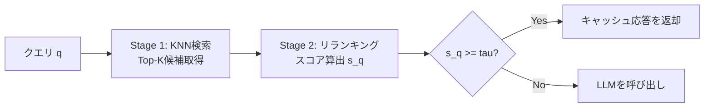

本記事は [https://arxiv.org/abs/2606.19719](https://arxiv.org/abs/2606.19719) の解説記事です。

## 論文概要（Abstract）

セマンティックキャッシュはLLM推論コストを削減する手法として注目されているが、そのモデル選択に広く使われるPR-AUCは固定閾値での運用品質を反映しないと著者らは主張している。本論文では、キャッシュ利用率ごとの精度を測るPrecision-Cache Hit Ratio (P-CHR) AUCと、オフラインのランキング品質がデプロイ時にどの程度保持されるかを表すCalibration Retention Rate (CRR)を提案している。さらに、オフラインとデプロイ間の品質差を回復可能な較正成分と回復不能な構造的成分に分解する枠組みを示し、較正ギャップは訓練目的関数に支配されデータ規模では改善しないことを報告している。

この記事は [Zenn記事: セマンティックキャッシュ最適化10手法でLLM推論を高速化する](https://zenn.dev/0h_n0/articles/c2df29cd7e4092) の深掘りです。

## 情報源

- **arXiv ID**: 2606.19719
- **URL**: [https://arxiv.org/abs/2606.19719](https://arxiv.org/abs/2606.19719)
- **著者**: Aditeya Baral, Radoslav Ralev, Iliya Sotirov Zhechev, et al.
- **発表年**: 2026
- **分野**: cs.IR, cs.CL, cs.LG

## 背景と動機（Background & Motivation）

セマンティックキャッシュは、新たなクエリと過去のキャッシュ済みクエリの意味的類似度を計算し、閾値$\tau$を超えた場合にLLMを呼び出さずキャッシュ済みの応答を返すことで、推論コストを削減する仕組みである。

この分野の標準的な評価指標はPR-AUC（Precision-Recall曲線下面積）である。PR-AUCはスコアの**ランキング品質**（正例を負例より上位にどれだけ並べられるか）を測定するが、閾値$\tau$の位置でスコアを切って判定する実運用とは乖離がある。すなわち、PR-AUCが高いモデルでも、スコアの**較正（calibration）**が悪ければ、固定閾値での判定精度は低くなる。

著者らはこの問題を「較正ギャップ（calibration gap）」と呼び、PR-AUCが最も高いモデルが運用時に最悪の性能を示す事例を実験で示している。これは、ランキング指標に基づくモデル選択が実デプロイにおいて系統的に誤った判断をもたらすことを意味し、セマンティックキャッシュのモデル選択を較正問題として再定義する必要性を示唆している。

## 主要な貢献（Key Contributions）

- **問題の特定**: PR-AUCがセマンティックキャッシュの実運用性能を予測できないことを実験的に示した
- **新指標の提案**: デプロイ時の精度をキャッシュ利用率の関数として評価するP-CHR AUCと、オフライン品質の保持率を表すCRRの2指標を導入した
- **ギャップ分解**: オフラインとデプロイ間の品質差を、回復可能な較正成分$\Delta_{\text{cal}}$と、データの正例率$p$で決まる回復不能な構造的成分$\Delta_{\text{str}}$に分解する理論的枠組みを提示した
- **訓練目的関数の重要性**: 較正ギャップはデータ規模ではなく訓練目的関数に支配されること、また事後較正は部分的にしかギャップを閉じられないことを報告した

## 技術的詳細（Technical Details）

### セマンティックキャッシュの動作

セマンティックキャッシュは2段階パイプラインで動作する。



**Stage 1（KNN検索）**: Bi-encoderで全候補のコサイン類似度を計算し、上位$K$件（論文では$K=50$）を取得する。プロダクション環境ではHNSW等の近似最近傍探索で高速化される。

**Stage 2（リランキング）**: Cross-encoderまたはMulti-vectorモデルが$K$件の候補をリスコアリングする。最高スコア$s(q) = \max_k s(q, c_k)$が閾値$\tau$以上であればキャッシュが発火する。

### 従来指標PR-AUCの限界

PR-AUCは以下の性質を持つ。

$$
\text{PR-AUC} = \int_0^1 \text{Precision}(\text{Recall}^{-1}(r)) \, dr
$$

この指標はスコアの**順序**のみを評価し、スコアの**絶対値**には依存しない。したがって、スコア分布全体を単調変換しても値は変わらない。しかしセマンティックキャッシュの運用では固定閾値$\tau$でスコアを二値化するため、スコアの絶対値がそのまま判定品質に直結する。

### 提案指標: P-CHR AUC

著者らはまずCache Hit Ratio（CHR）を定義している。

$$
\text{CHR}(\tau) = \frac{|\{q : \hat{s}(q) \geq \tau\}|}{N}
$$

ここで、$\hat{s}(q)$はクエリ$q$の予測スコア、$N$はクエリ総数である。CHRは閾値$\tau$でキャッシュが発火するクエリの割合を表す。

次に、デプロイ時の精度を以下で定義する。

$$
\text{Precision}(\tau) = \frac{\text{VCHR}(\tau)}{\text{CHR}(\tau)}
$$

ここで、$\text{VCHR}(\tau)$は正しくキャッシュヒットしたクエリの割合（Valid Cache Hit Ratio）である。分類タスクの精度とは異なり、リランキング後の最上位候補がground truthと一致するかどうかで判定される点に注意が必要である。

P-CHR AUCはPrecisionをCHRの関数として積分する。

$$
\text{P-CHR AUC} = \int_0^1 \text{Precision}(\text{CHR}^{-1}(c)) \, dc
$$

PR-AUCとの本質的な違いは、横軸がRecall（正例のうちどれだけ拾えたか）からCHR（全クエリのうちどれだけキャッシュを使ったか）に変わっている点である。CHRはコスト削減率に直結するため、P-CHR AUCは「キャッシュ利用率を上げたときにどれだけ精度が保たれるか」をデプロイ視点で直接測定する。

### Calibration Retention Rate (CRR)

CRRはオフラインのランキング品質がデプロイ時にどの程度保持されるかを表す比率である。

$$
\text{CRR} = \frac{\text{P-CHR AUC}}{\text{PR-AUC}} \in (0, 1]
$$

CRR = 1ならばオフラインのランキング品質がそのままデプロイ精度に反映されていることを意味するが、著者らはテストデータの正例率$p = 0.45$において理論上限が約0.809であることを導出している。

### ギャップ分解

著者らはオフラインとデプロイ間の品質差（Operational Gap）を2つの成分に分解する枠組みを示している。

**Operational Gap（運用ギャップ）**:

$$
\Delta_{\text{op}} = \text{PR-AUC} - \text{P-CHR AUC}
$$

**Structural Gap（構造的ギャップ）**: 完全なランカーであっても生じる、正例率$p$のみで決まる回復不能な成分。

$$
\Delta_{\text{str}} = 1 - p(1 - \ln p)
$$

この式の導出は以下の通りである。完全なランカー（全ての正例を負例より上位にランクする）のPR-AUCは1であり、そのP-CHR AUCの理論上限は$p(1 - \ln p)$である。両者の差が構造的ギャップとなる。テストデータでは$p = 0.45$であり、$\Delta_{\text{str}} \approx 0.191$と計算される。

**Calibration Gap（較正ギャップ）**: モデルのスコア較正の不良に起因する回復可能な成分。

$$
\Delta_{\text{cal}} = \max(0, \Delta_{\text{op}} - \Delta_{\text{str}})
$$

ここで、
- $\Delta_{\text{op}}$: 運用ギャップ（PR-AUCとP-CHR AUCの差）
- $\Delta_{\text{str}}$: 構造的ギャップ（正例率$p$のみに依存、回復不能）
- $\Delta_{\text{cal}}$: 較正ギャップ（スコア較正で回復可能）
- $p$: テストデータ中の正例の割合

$\Delta_{\text{cal}} = 0$は、そのモデルの運用ギャップが構造的下限以下であること、すなわちスコアの配置がすでに最適に近いことを意味する。

### アルゴリズム

以下にP-CHR AUCとギャップ分解の計算をPythonで実装した例を示す。

```python
import numpy as np
from dataclasses import dataclass


@dataclass
class CacheMetrics:
    """セマンティックキャッシュの評価指標群

    Attributes:
        pr_auc: PR-AUC（ランキング品質）
        pchr_auc: P-CHR AUC（デプロイ精度）
        delta_op: 運用ギャップ
        delta_str: 構造的ギャップ
        delta_cal: 較正ギャップ
        crr: Calibration Retention Rate
    """
    pr_auc: float
    pchr_auc: float
    delta_op: float
    delta_str: float
    delta_cal: float
    crr: float


def compute_pchr_auc(
    scores: np.ndarray,
    is_valid_hit: np.ndarray,
    n_thresholds: int = 101,
) -> float:
    """P-CHR AUCを計算する

    Args:
        scores: 各クエリの予測スコア (shape: [N])
        is_valid_hit: 各クエリが正しいキャッシュヒットかのフラグ (shape: [N])
        n_thresholds: 閾値の分割数

    Returns:
        P-CHR AUC値
    """
    n = len(scores)
    thresholds = np.linspace(0.0, 1.0, n_thresholds)

    chr_values: list[float] = []
    precision_values: list[float] = []

    for tau in thresholds:
        fired = scores >= tau
        n_fired = fired.sum()

        chr_val = n_fired / n
        if n_fired > 0:
            precision_val = float(is_valid_hit[fired].sum()) / n_fired
        else:
            precision_val = 1.0  # 発火なし: precision未定義、1.0とする

        chr_values.append(chr_val)
        precision_values.append(precision_val)

    # CHRの降順でソートし、台形則で積分
    sorted_indices = np.argsort(chr_values)
    chr_sorted = np.array(chr_values)[sorted_indices]
    prec_sorted = np.array(precision_values)[sorted_indices]

    pchr_auc = float(np.trapz(prec_sorted, chr_sorted))
    return pchr_auc


def decompose_gap(
    pr_auc: float,
    pchr_auc: float,
    positive_rate: float,
) -> CacheMetrics:
    """運用ギャップを構造的ギャップと較正ギャップに分解する

    Args:
        pr_auc: モデルのPR-AUC
        pchr_auc: モデルのP-CHR AUC
        positive_rate: テストデータ中の正例率 p

    Returns:
        CacheMetrics: 全指標を格納したデータクラス
    """
    delta_op = pr_auc - pchr_auc
    delta_str = 1.0 - positive_rate * (1.0 - np.log(positive_rate))
    delta_cal = max(0.0, delta_op - delta_str)
    crr = pchr_auc / pr_auc if pr_auc > 0 else 0.0

    return CacheMetrics(
        pr_auc=pr_auc,
        pchr_auc=pchr_auc,
        delta_op=round(delta_op, 4),
        delta_str=round(delta_str, 4),
        delta_cal=round(delta_cal, 4),
        crr=round(crr, 4),
    )


# 使用例: 論文Table 1のLangCache-Embed-v3を再現
metrics = decompose_gap(
    pr_auc=0.833,
    pchr_auc=0.437,
    positive_rate=0.45,
)
print(f"Delta_op: {metrics.delta_op}")    # 0.396
print(f"Delta_str: {metrics.delta_str}")  # 0.191
print(f"Delta_cal: {metrics.delta_cal}")  # 0.205
print(f"CRR: {metrics.crr}")             # 0.5246
```

## 実装のポイント（Implementation）

**閾値選択の実務的課題**: セマンティックキャッシュの運用ではコスト削減率（CHR）と精度のトレードオフを管理する必要がある。P-CHR曲線を描画してCHR=0.3（30%のクエリをキャッシュ）程度のPrecisionを確認し、許容できる精度水準を閾値$\tau$として設定する運用が考えられる。

**スコア正規化の注意**: 論文ではBCE（Binary Cross-Entropy）で訓練したモデルのスコアがシグモイド出力$\sigma(z)$として扱われる一方、MNRL（Multiple Negatives Ranking Loss）はシグモイドで正規化したraw logit、ColBERTはsoftmaxで正規化したMaxSimを使用する。異なるモデルを比較する際、スコアの意味が異なる点に留意する必要がある。

**事後較正の限界**: Temperature Scaling（logitにスカラー$T^{-1}$を乗じてからシグモイドを適用）やPlatt Scaling（アフィン変換$\sigma(az + b)$）は$\Delta_{\text{cal}}$を低減できるが、$\Delta_{\text{str}}$は変えられない。特にBCEモデルではスコア分布が境界付近に圧縮される傾向があり、Platt Scalingが不安定になると著者らは報告している。

**正例率の環境依存性**: $\Delta_{\text{str}}$は正例率$p$のみで決まるため、重複クエリが少ない環境（$p$が低い）では構造的ギャップが大きくなる。ドメインごとに代表的なデータで再評価することが推奨される。

## 実験結果（Results）

### Retrieverの評価（論文Table 1より）

著者らは9種のBi-encoderを$K=50$で評価している。

| モデル | PR-AUC | P-CHR AUC | $\Delta_{\text{cal}}$ | CRR |
|--------|--------|-----------|----------|-----|
| LangCache-Embed-v3 | 0.833 | 0.437 | 0.205 | 0.525 |
| LangCache-Embed-v1 | 0.738 | 0.416 | 0.131 | 0.564 |
| GTE-ModernBERT-base | 0.649 | 0.389 | 0.069 | 0.599 |
| E5-base-v2 | 0.632 | 0.359 | 0.082 | 0.568 |

全てのRetrieverで$\Delta_{\text{cal}} > 0$であり、埋め込みモデルのスコアが固定閾値の二値判定に較正されていないことが確認されている。

### Rerankerの評価（論文Table 2より）

著者らは10種のRerankerを9種のRetrieverで平均した結果を報告している。

| モデル | PR-AUC | P-CHR AUC | $\Delta_{\text{cal}}$ | CRR |
|--------|--------|-----------|----------|-----|
| ColBERTv2.0 | 0.515 | 0.402 | 0 | 0.781 |
| LangCache-Reranker-v1-MNRL | 0.824 | 0.353 | 0.280 | 0.428 |
| LangCache-Reranker-v1-BCE | 0.816 | 0.199 | 0.427 | 0.244 |
| LangCache-Reranker-v2-BCE | 0.748 | 0.173 | 0.385 | 0.231 |

ここに重要な逆転現象が見られる。BCEで訓練したRerankerはPR-AUCが最も高い（0.816）にもかかわらず、P-CHR AUCは最も低い（0.199）。一方、ColBERTv2.0はPR-AUCが最低（0.515）だがP-CHR AUCは最高（0.402）であり、CRRも0.781と群を抜いている。ColBERTの4モデルは全て$\Delta_{\text{cal}} = 0$であり、softmaxによるトークンレベルのMaxSim集約がスコアの自然な較正をもたらしていると著者らは分析している。

### データ規模の影響

訓練データを1M対から40M対に38倍に拡大しても（v1からv2）、P-CHR AUCはMNRLで0.353から0.330、BCEで0.199から0.173とむしろ低下している。著者らはこの結果から、較正ギャップはデータ規模ではなく訓練目的関数に支配されると結論している。

## 実運用への応用（Practical Applications）

本論文の知見をセマンティックキャッシュの実運用に応用する際、以下の点が重要となる。

**モデル選択基準の変更**: PR-AUCではなくP-CHR AUCとCRRをモデル選択の主要指標とすべきである。特にPR-AUCが高いBCE系モデルは運用時に品質が大幅に劣化する可能性があるため、CRRが0.5以上のモデルを候補とするのが安全な指針となる。

**ColBERTアーキテクチャの優位性**: ColBERT系モデルは$\Delta_{\text{cal}} = 0$を達成しており、固定閾値運用に適している。ただし計算コストが高いため、キャッシュ候補のKNN検索後のリランキングに限定して使用する構成が現実的である。

**閾値チューニングの自動化**: P-CHR曲線を用いて、目標とするCHR（例: 30%のクエリをキャッシュ）に対応する$\tau$を自動設定する仕組みを構築できる。正例率$p$が環境ごとに異なる点を考慮し、ドメイン固有の検証データで定期的に閾値を再較正することが推奨される。

**訓練目的関数の選択**: 新規にセマンティックキャッシュ向けモデルを訓練する場合、BCEよりもContrastive Learning系の目的関数（MNRLなど）を選択し、さらにsoftmax正規化を組み込むことで較正ギャップの低減が期待できる。

## 関連研究（Related Work）

- **GPTCache（Bang, 2023）**: セマンティックキャッシュの初期実装。埋め込みベースの類似度判定を用いたキャッシュ機構を提案した。本論文はGPTCacheが暗黙的に採用しているPR-AUCベースのモデル選択の問題点を指摘している。
- **ColBERTv2（Santhanam et al., 2022）**: Multi-vectorの遅延交互作用（late interaction）モデル。本論文では$\Delta_{\text{cal}} = 0$を達成する唯一のアーキテクチャファミリとして注目されている。
- **温度スケーリング（Guo et al., 2017）**: ニューラルネットワークの事後較正手法。本論文ではBCEモデルへの適用で部分的な改善が見られるが、構造的ギャップは解消できないことが示されている。
- **VCache（Schroeder et al., 2026）**: 検証付きセマンティックキャッシュ。キャッシュヒットの正当性を検証する機構を追加した実装であり、本論文のP-CHR AUCが測定する「精度」と関連する。

## まとめと今後の展望

本論文の主要な成果は、セマンティックキャッシュのモデル選択がランキング問題ではなく較正問題であることを理論的・実験的に示した点にある。PR-AUCが最高のモデルが運用時に最悪となる逆転現象は、指標の選択がシステム設計にいかに重大な影響を与えるかを示す例である。

今後の研究方向として、著者らは較正を訓練目的関数に直接組み込む手法の探索、ColBERTのsoftmax正規化がなぜ較正に有効なのかの理論的解明、および正例率$p$が異なる環境間での指標の転移可能性について言及している。実務的には、P-CHR AUCとCRRをモニタリング指標としてダッシュボードに組み込み、閾値の定期的な再較正を自動化するMLOpsパイプラインの構築が課題となる。

## 参考文献

- **arXiv**: [https://arxiv.org/abs/2606.19719](https://arxiv.org/abs/2606.19719)
- **LangCache SentencePairs Dataset**: Baral et al., 2026（論文Table 3, 4に詳細）
- **ColBERTv2**: Santhanam et al., 2022 - [https://arxiv.org/abs/2112.01488](https://arxiv.org/abs/2112.01488)
- **Temperature Scaling**: Guo et al., 2017 - [https://arxiv.org/abs/1706.04599](https://arxiv.org/abs/1706.04599)
- **Related Zenn article**: [https://zenn.dev/0h_n0/articles/c2df29cd7e4092](https://zenn.dev/0h_n0/articles/c2df29cd7e4092)
