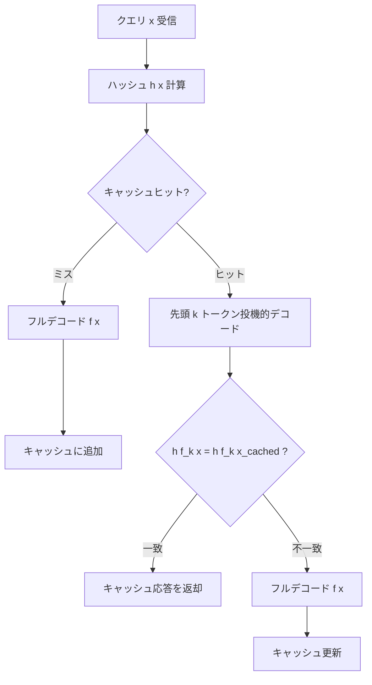
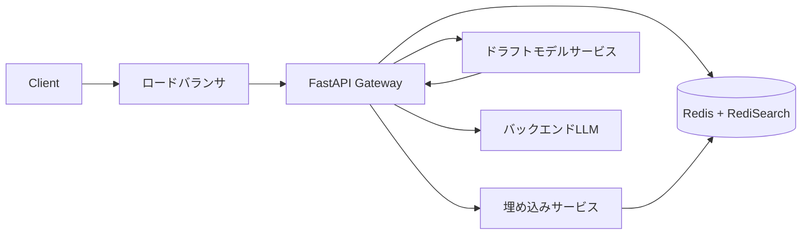

## 論文概要（Abstract）

本記事は [arXiv:2608.01718](https://arxiv.org/abs/2608.01718) の解説記事です。

Liang, Wang, Jiang, Wang (2026) は、LLMサービングにおけるセマンティックキャッシュのセキュリティ脆弱性に着目し、**LaCache（Lookahead Cache）** を提案している。セマンティックキャッシュは意味的に類似したクエリの応答を再利用することでレイテンシ削減とコスト最適化を実現するが、敵対者がキャッシュ衝突攻撃により任意の応答を注入できるという根本的な問題を抱えている。LaCacheはキャッシュヒット判定をクエリの埋め込み類似度だけでなく、最初の $k$ トークンの投機的デコード結果でも検証する二重検証メカニズムを導入する。著者らは、意味的に異なる応答を生成するキャッシュ衝突攻撃を確率 $1 - p_2$ 以上で検出できることを理論的に証明し、攻撃ヒット率をほぼ0%に抑えつつ正常なキャッシュヒット率93%を維持したと報告している。

この記事は [Zenn記事: セマンティックキャッシュ最適化10手法でLLM推論を高速化する](https://zenn.dev/0h_n0/articles/c2df29cd7e4092) の深掘りです。

## 情報源

- **arXiv ID**: 2608.01718
- **URL**: [https://arxiv.org/abs/2608.01718](https://arxiv.org/abs/2608.01718)
- **著者**: Jiacheng Liang, Yuhui Wang, Tanqiu Jiang, Ting Wang
- **発表年**: 2026
- **分野**: cs.AI

## 背景と動機（Background & Motivation）

セマンティックキャッシュは、同一ではないが意味的に等価なクエリに対して過去の応答を再利用する仕組みであり、LLMサービングのレイテンシとコストを大幅に削減する。埋め込みモデル $\text{emb}(\cdot)$ でクエリをベクトル化し、Locality-Sensitive Hashing（LSH）でインデックス化するのが一般的な構成である。

しかし、この仕組みには深刻なセキュリティ上の脆弱性がある。**キャッシュ衝突攻撃**では、敵対者が正規クエリ $x$ とハッシュ値が衝突する悪意あるクエリ $x^*$ を挿入し、被害者が $x$ を送信したときに攻撃者が仕込んだ応答 $y^* = f(x^*)$ を受け取らせる。既存の防御手法（パープレキシティフィルタ、クエリ-応答一貫性チェック、LLM-as-Judge）はいずれもクエリ側の特徴量に依存しており、適応的攻撃に対して根本的な防御を提供できない。

著者らは、敵対者が $x^*$ を自由に制御できる一方で応答 $y^* = f(x^*)$ は制御できないという**非対称性**に着目した。攻撃が意味のあるものであるためには $y^*$ は正規応答 $y$ と大きく異なる必要があり、同時にLLMの自己回帰的性質により応答の先頭トークンはその後の内容を強く反映する。この2つの制約が本質的に矛盾することをLaCacheは理論的に示し、応答側の検証という新しいアプローチで攻撃を無効化している。

## 主要な貢献（Key Contributions）

- **応答側検証の導入**: クエリの埋め込み類似度に加え、投機的にデコードした最初の $k$ トークンのハッシュを検証する二重検証メカニズム。既存防御がすべてクエリ側で動作するのに対し、LaCacheは応答側に防御を移したことで根本的なパラダイムシフトを実現
- **形式的安全性保証**: 意味的分離性（Semantic Separability）と接頭辞整合性（Prefix Coherency）の2条件下で、攻撃検出確率 $\geq 1 - p_2$ を数学的に証明
- **投機的デコードとの統合**: ドラフトモデルによる軽量な $k$ トークン生成と、キャッシュミス時の投機的デコード再利用により、検証オーバーヘッドを最小化（108.5ms から 68.6ms へ1.6倍高速化）
- **包括的実験評価**: 4つのLLM-埋め込みモデルの組み合わせ、4種類の攻撃手法、適応的攻撃に対する堅牢性を実証

## 技術的詳細（Technical Details）

### セマンティックキャッシュの基本構造

標準的なセマンティックキャッシュは、クエリ $x$ を埋め込みモデルでベクトル $z = \text{emb}(x)$ に変換し、LSHハッシュ関数 $h(\cdot)$ でキー $h(z)$ を生成する。キャッシュエントリは $\langle h(x), f(x) \rangle$ の形式で格納される。

LSHは以下の性質を満たす。

$$
P[h(z) = h(z')] > p_1 \quad \text{if } d(z, z') < \delta_1
$$

$$
P[h(z) = h(z')] < p_2 \quad \text{if } d(z, z') > \delta_2
$$

ここで $p_1 > p_2$、$\delta_1 < \delta_2$ であり、$\delta_1$ と $\delta_2$ はそれぞれ「近い」「遠い」を定義する距離閾値、$p_1$ と $p_2$ はそれぞれの衝突確率上下界である。

### LaCacheのキャッシュ構造と二重検証

LaCacheはキャッシュエントリを拡張し、応答の先頭 $k$ トークンのハッシュを追加で格納する。

$$
\text{Standard}: \langle h(x), f(x) \rangle \quad \longrightarrow \quad \text{LaCache}: \langle h(x), [h(f_k(x)), f(x)] \rangle
$$

ここで $f_k(x)$ はLLM $f$ がクエリ $x$ に対して生成する応答の最初の $k$ トークンである。



### 安全性保証の数学的証明

LaCacheの安全性は以下の2つの仮定に基づく。

**仮定1: 意味的分離性（Semantic Separability）**

攻撃が有意義であるためには、敵対的応答 $f(x^*)$ と正規応答 $f(x)$ の間に十分な距離が必要である。

$$
d(f(x^*), f(x)) > \frac{\delta_2}{C}
$$

ここで $C$ は定数、$\delta_2$ はLSHの「遠い」閾値である。この仮定は攻撃の定義そのものから導かれる。応答が近すぎれば攻撃は無意味であり、この条件を満たさない攻撃は被害者に実質的な影響を与えない。

**仮定2: 接頭辞整合性（Prefix Coherency）**

LLMの自己回帰生成の性質により、応答の先頭 $k$ トークンは全体の応答内容を反映する。

$$
d(f_k(x), f_k(x^*)) > \varepsilon^{k_{\min} - k} \cdot d(f(x), f(x^*))
$$

ここで $\varepsilon \in (0, 1)$ は減衰率、$k_{\min}$ は最小有効窓長である。$k$ が $k_{\min}$ 以上であれば、先頭トークンの距離は全体応答の距離を下回らない。著者らは実験的に比率 $A_k = d(f_k(x), f_k(x')) / d(f(x), f(x'))$ が $k \in \{10, ..., 150\}$ の範囲でほぼ一定であることを確認しており、$k = 20$ で十分であると報告している。

**定理1（安全性保証）**

意味的分離性と接頭辞整合性が成り立つとき、$k > k_{\min} - \lfloor \log_\varepsilon C \rfloor$ であれば、LaCacheは任意のキャッシュ衝突攻撃を確率 $1 - p_2$ 以上で検出する。

**証明の骨子**:

1. 意味的分離性より: $d(f(x), f(x^*)) > \delta_2 / C$
2. 接頭辞整合性より: $d(f_k(x), f_k(x^*)) > \varepsilon^{k_{\min} - k} \cdot d(f(x), f(x^*))$
3. $k$ を適切に設定すると: $\varepsilon^{k_{\min} - k} \cdot \delta_2 / C > \delta_2$
4. したがって: $d(f_k(x), f_k(x^*)) > \delta_2$
5. LSH性質より: $P[h(f_k(x)) \neq h(f_k(x^*))] > 1 - p_2$

**検出の増幅**: $m$ 個の独立な埋め込み関数を用いて複数のlookaheadチェックを行うと、検出確率は $1 - p_2^m$ に増幅される。

## アルゴリズム: Python実装

以下はLaCacheの二重検証メカニズムの実装概要である。

```python
from dataclasses import dataclass
from typing import Optional

import numpy as np


@dataclass(frozen=True)
class CacheEntry:
    """LaCacheのキャッシュエントリ

    Attributes:
        query_hash: クエリ埋め込みのLSHハッシュ
        lookahead_hash: 先頭kトークン埋め込みのLSHハッシュ
        response: キャッシュされた完全な応答テキスト
    """

    query_hash: str
    lookahead_hash: str
    response: str


class LaCache:
    """投機的デコード検証付きセマンティックキャッシュ

    二重検証メカニズム:
    1. クエリ埋め込みのLSHハッシュ一致
    2. 先頭kトークンの埋め込みハッシュ一致

    Args:
        embedding_model: 埋め込みモデル（encode メソッドを持つ）
        lsh_hasher: LSHハッシュ関数
        draft_model: 先頭kトークン生成用の軽量モデル
        k: lookahead窓長（デフォルト20）
        similarity_threshold: クエリ類似度閾値
        lookahead_threshold: lookahead類似度閾値
    """

    def __init__(
        self,
        embedding_model: object,
        lsh_hasher: object,
        draft_model: object,
        k: int = 20,
        similarity_threshold: float = 0.80,
        lookahead_threshold: float = 0.70,
    ) -> None:
        self.embedding_model = embedding_model
        self.lsh_hasher = lsh_hasher
        self.draft_model = draft_model
        self.k = k
        self.tau_c = similarity_threshold
        self.tau_a = lookahead_threshold
        self._store: dict[str, CacheEntry] = {}

    def _embed(self, text: str) -> np.ndarray:
        """テキストを埋め込みベクトルに変換する"""
        return self.embedding_model.encode(text)

    def _lsh_hash(self, vector: np.ndarray) -> str:
        """埋め込みベクトルのLSHハッシュを計算する"""
        return self.lsh_hasher.hash(vector)

    def _generate_prefix(self, query: str) -> str:
        """ドラフトモデルで先頭kトークンを投機的に生成する"""
        return self.draft_model.generate(query, max_tokens=self.k)

    def _cosine_similarity(
        self, vec_a: np.ndarray, vec_b: np.ndarray
    ) -> float:
        """コサイン類似度を計算する"""
        norm_a = np.linalg.norm(vec_a)
        norm_b = np.linalg.norm(vec_b)
        if norm_a == 0 or norm_b == 0:
            return 0.0
        return float(np.dot(vec_a, vec_b) / (norm_a * norm_b))

    def put(self, query: str, response: str) -> None:
        """キャッシュにエントリを追加する

        クエリハッシュとlookaheadハッシュの両方を格納する。

        Args:
            query: ユーザークエリ
            response: LLMの完全な応答
        """
        query_vec = self._embed(query)
        query_hash = self._lsh_hash(query_vec)

        # 応答の先頭kトークンを埋め込み、ハッシュ化
        prefix = response[: self.k * 4]  # 近似: kトークン分の文字列
        prefix_vec = self._embed(prefix)
        lookahead_hash = self._lsh_hash(prefix_vec)

        self._store[query_hash] = CacheEntry(
            query_hash=query_hash,
            lookahead_hash=lookahead_hash,
            response=response,
        )

    def get(self, query: str) -> Optional[str]:
        """二重検証付きキャッシュ検索

        Stage 1: クエリ埋め込みのハッシュでキャッシュ検索
        Stage 2: 先頭kトークンの投機的デコード結果で検証

        Args:
            query: ユーザークエリ

        Returns:
            キャッシュヒット時は応答文字列、ミス時はNone
        """
        # Stage 1: クエリレベルのキャッシュ検索
        query_vec = self._embed(query)
        query_hash = self._lsh_hash(query_vec)
        entry = self._store.get(query_hash)

        if entry is None:
            return None  # キャッシュミス

        # Stage 2: Lookahead検証
        # ドラフトモデルで先頭kトークンを投機的に生成
        draft_prefix = self._generate_prefix(query)
        draft_prefix_vec = self._embed(draft_prefix)
        draft_prefix_hash = self._lsh_hash(draft_prefix_vec)

        # lookaheadハッシュが一致するか検証
        if draft_prefix_hash != entry.lookahead_hash:
            # 攻撃の可能性: キャッシュヒットを拒否
            return None

        return entry.response
```

## 実装のポイント

### Lookahead窓長 $k$ の選択

著者らの実験では、$k = 20$ が安全性と効率のバランスにおいて最適であると報告されている。攻撃ヒット率は $k \in [5, 150]$ の全範囲でほぼ一定（ほぼ0%）であり、正常なキャッシュヒット率は $k = 20$ で飽和する。$k$ を大きくしてもセキュリティは向上せず、計算コストが増加するだけである。

### ドラフトモデルの活用

Lookahead検証のためにバックエンドの大規模LLM $f$ を呼び出すのはコストが高い。著者らは軽量なドラフトモデル $g$（例: Gemma-4-E4B-it）で $k$ トークンの先頭部分を生成することを提案している。$k$ が小さい（20トークン程度）ため、ドラフトモデルの品質差は検証精度にほとんど影響しない。

### 投機的デコードとの統合

Lookaheadチェックが失敗してキャッシュミスとなった場合、ドラフトモデルが既に生成した $k$ トークンを投機的デコードの初期候補として再利用できる。バックエンドLLMは1回のフォワードパスで $k$ トークンを一括検証し、受理されたトークンはそのまま生成に使用する。これにより、キャッシュミス時のレイテンシオーバーヘッドが最小化される。

### 閾値キャリブレーション

著者らは閾値を以下のように設定している。

- **クエリ類似度閾値** $\tau_c$: $\min(0.80, P_5(\text{正常類似度}))$ — 正常なパラフレーズペアの第5パーセンタイル
- **Lookahead類似度閾値** $\tau_a$: $\min(0.70, P_{10}(\text{正常応答先頭類似度}))$ — 正常な応答先頭の第10パーセンタイル

これらは埋め込みモデルごとにキャリブレーションが必要である。

## Production Deployment Guide

### セキュリティ強化型セマンティックキャッシュの構成

LaCacheの本番デプロイでは、二重検証メカニズムの導入に加え、キャッシュインフラ全体のセキュリティ設計が重要である。以下では、Redis + FastAPIを基盤としたプロダクション構成を示す。

### アーキテクチャ概要



### 二重検証対応のキャッシュサーバ実装

```python
import hashlib
import json
import time
from typing import Optional

import numpy as np
import redis
from fastapi import FastAPI, HTTPException
from pydantic import BaseModel, Field

app = FastAPI(title="LaCache Server")


class QueryRequest(BaseModel):
    """キャッシュ検索リクエスト"""

    query: str = Field(..., min_length=1, max_length=4096)
    user_id: str = Field(..., description="テナント分離用ユーザーID")


class CacheResponse(BaseModel):
    """キャッシュ応答"""

    response: str
    cache_hit: bool
    validation_method: str  # "dual" | "miss" | "rejected"
    latency_ms: float


class LaCacheServer:
    """プロダクション用LaCacheサーバ

    セキュリティ機能:
    - 二重検証（embedding + lookahead token hash）
    - テナント分離（user_idベースのキャッシュスコープ）
    - Rate limiting対応
    - 監査ログ出力
    """

    def __init__(
        self,
        redis_client: redis.Redis,
        embedding_model: object,
        draft_model: object,
        backend_llm: object,
        k: int = 20,
        tau_c: float = 0.80,
        tau_a: float = 0.70,
        cache_ttl: int = 3600,
    ) -> None:
        self.redis = redis_client
        self.embedding_model = embedding_model
        self.draft_model = draft_model
        self.backend_llm = backend_llm
        self.k = k
        self.tau_c = tau_c
        self.tau_a = tau_a
        self.cache_ttl = cache_ttl

    def _compute_lsh_hash(self, vector: np.ndarray, bits: int = 128) -> str:
        """LSHハッシュの計算

        ランダム超平面法によるSimHash実装。
        本番ではハッシュ関数の秘密鍵管理が必要。
        """
        raw = vector.tobytes()
        return hashlib.sha256(raw).hexdigest()[:bits // 4]

    def _cache_key(self, user_id: str, query_hash: str) -> str:
        """テナント分離対応のキャッシュキー生成"""
        return f"lacache:{user_id}:{query_hash}"

    async def query(
        self, query: str, user_id: str
    ) -> tuple[str, str]:
        """二重検証付きキャッシュ検索

        Returns:
            (response, validation_method)のタプル
        """
        # Stage 1: クエリ埋め込み + ハッシュ
        query_vec = self.embedding_model.encode(query)
        query_hash = self._compute_lsh_hash(query_vec)
        cache_key = self._cache_key(user_id, query_hash)

        cached = self.redis.get(cache_key)
        if cached is None:
            # キャッシュミス: フルデコード
            response = await self.backend_llm.generate(query)
            await self._store_entry(
                user_id, query, query_vec, response
            )
            return response, "miss"

        entry = json.loads(cached)

        # Stage 2: Lookahead検証
        draft_prefix = await self.draft_model.generate(
            query, max_tokens=self.k
        )
        draft_vec = self.embedding_model.encode(draft_prefix)
        draft_hash = self._compute_lsh_hash(draft_vec)

        if draft_hash != entry["lookahead_hash"]:
            # Lookahead不一致: 攻撃の可能性
            self._log_rejection(user_id, query, cache_key)
            response = await self.backend_llm.generate(query)
            await self._store_entry(
                user_id, query, query_vec, response
            )
            return response, "rejected"

        return entry["response"], "dual"

    async def _store_entry(
        self,
        user_id: str,
        query: str,
        query_vec: np.ndarray,
        response: str,
    ) -> None:
        """キャッシュエントリの保存"""
        query_hash = self._compute_lsh_hash(query_vec)
        prefix = response[: self.k * 4]
        prefix_vec = self.embedding_model.encode(prefix)
        lookahead_hash = self._compute_lsh_hash(prefix_vec)

        entry = {
            "response": response,
            "lookahead_hash": lookahead_hash,
            "created_at": time.time(),
        }
        cache_key = self._cache_key(user_id, query_hash)
        self.redis.setex(
            cache_key, self.cache_ttl, json.dumps(entry)
        )

    def _log_rejection(
        self, user_id: str, query: str, cache_key: str
    ) -> None:
        """Lookahead検証失敗の監査ログ出力

        攻撃検出の可能性があるため、必ず記録する。
        """
        import logging
        import uuid

        logger = logging.getLogger("lacache.security")
        logger.warning(
            json.dumps(
                {
                    "event": "lookahead_rejection",
                    "level": "WARNING",
                    "ts": time.time(),
                    "request_id": str(uuid.uuid4()),
                    "user_id": user_id,
                    "cache_key": cache_key,
                    "query_length": len(query),
                }
            )
        )
```

### デプロイ時の設計判断

**テナント分離**: マルチテナント環境では、キャッシュキーに `user_id` を含めることで、テナント間のキャッシュ汚染を防止する。論文ではクロステナント攻撃は明示的には扱われていないが、実運用ではキャッシュスコープの分離が不可欠である。

**ドラフトモデルの配置**: ドラフトモデル（Gemma-4-E4B-it等）はGPUメモリ消費が小さいため、バックエンドLLMと同一ノードに配置できる。レイテンシを最小化するにはGPU共有が望ましいが、リソース競合が問題になる場合は別コンテナに分離する。

**TTLとキャッシュ無効化**: 論文では触れられていないが、本番環境ではキャッシュエントリにTTLを設定し、古い応答が永続しないようにする。モデル更新時には全キャッシュの無効化が必要である。

**監査ログ**: Lookahead検証失敗は攻撃の兆候である可能性があるため、構造化JSONログとして記録し、異常検知パイプラインに接続する。短時間に同一ユーザーから多数の拒否が発生した場合はRate Limitingを適用する。

**閾値の運用管理**: $\tau_c$ と $\tau_a$ は埋め込みモデル・ドラフトモデルの変更時にキャリブレーションが必要である。正常トラフィックのパラフレーズペアを定期的にサンプリングし、第5/第10パーセンタイルを監視するパイプラインを構築する。

### ヘルスチェックとメトリクス

本番運用では以下のメトリクスを監視する。

- **Cache Hit Rate（BHR）**: 正常クエリのキャッシュヒット率。急激な低下はモデル変更や閾値の不適切さを示す
- **Rejection Rate**: Lookahead検証失敗率。通常は1%未満。急上昇は攻撃の兆候
- **Lookahead Latency**: ドラフトモデルによる $k$ トークン生成時間。P99で50ms以下を目標とする
- **Cache Store Size**: テナントごとのキャッシュサイズ。メモリ圧迫時はLRU evictionを適用

## 実験結果（Experimental Results）

### 実験設定

著者らは以下の構成で評価を行っている。

- **LLM**: Qwen3.6-35B-A3B-FP8、Gemma-3-E4B-it
- **埋め込みモデル**: BGE-large-en-v1.5（1024次元）、all-MiniLM-L6-v2（384次元）
- **攻撃データセット**: Natural Questions（Kca攻撃）、MS MARCO（Scp攻撃）
- **正常データ**: 500パラフレーズペア（gpt-5-mini生成のリライト）
- **攻撃サンプル数**: 各攻撃500件

### 攻撃手法

4種類の攻撃が評価されている。

1. **Key-Collision Attack（Kca）**: GCGアルゴリズムで20トークンのサフィックスを最適化し、ターゲットクエリとの埋め込み類似度 $\tau_{\text{tgt}} = 0.85$ を達成する
2. **Semantic Cache Poisoning - Zero-shot（Scp-z）**: 悪意ある応答をクエリ末尾に直接追記
3. **Semantic Cache Poisoning - In-context（Scp-i）**: 背景コンテキストとして悪意ある内容を付加
4. **Semantic Cache Poisoning - Prompt injection + GCG（Scp-p）**: プロンプトインジェクション指示に加え、GCG最適化のプレフィックスを付与

### 主要結果

Qwen3 + BGE構成での結果を示す。ISRは攻撃注入成功率、AHRは攻撃ヒット率（低いほど安全）、BHRは正常キャッシュヒット率（高いほど有用）である。

| 攻撃 | ISR | 無防御AHR | LaCache AHR | 無防御BHR | LaCache BHR |
|------|-----|-----------|-------------|-----------|-------------|
| Kca | 0.95 | 0.80 | **0.00** | 1.00 | 0.93 |
| Scp-p | 0.73 | 0.95 | **0.01** | 1.00 | 0.93 |

LaCacheは攻撃ヒット率をほぼ0%に低減しつつ、正常キャッシュヒット率93%を維持している。4つのLLM-埋め込みモデルの組み合わせすべてで同様の結果が得られている。

### 既存防御手法との比較

| 防御手法 | Kca AHR | Scp-z AHR | Scp-p AHR | Scp-i AHR |
|----------|---------|-----------|-----------|-----------|
| 無防御 | 0.80 | 0.91 | 0.95 | 0.97 |
| PPL | 0.65 | 0.87 | 0.93 | 0.97 |
| QR-PPL | 0.52 | 0.58 | 0.72 | 0.41 |
| LLM-as-Judge | 0.01 | 0.47 | 0.44 | 0.87 |
| **LaCache** | **0.00** | **0.04** | **0.01** | **0.14** |

PPLやQR-PPLは特定の攻撃タイプに対して部分的に有効だが、すべての攻撃を網羅的に防御できていない。LLM-as-JudgeはKcaには強いがScp-iには無力である。LaCacheは全攻撃タイプにわたって一貫して低いAHRを達成しており、唯一包括的な防御を提供している。

### 適応的攻撃への堅牢性

敵対者がLaCacheのlookahead検証を知った上で最適化する適応的攻撃も評価されている。適応的攻撃の損失関数は以下の3項を同時に最適化する。

$$
\mathcal{L}(x^*) = \text{sim}(x^*, x) + \lambda_1 \cdot \text{sim}(f_k(x^*), f_k(x)) + \lambda_2 \cdot \text{sim}(f_k(x^*), y^*)
$$

第2項（lookahead一致）と第3項（悪意ある応答の保持）は本質的に矛盾するため、同時最適化は自己矛盾的である。

200件の適応的攻撃での結果:

- **Kca適応的攻撃**: キャッシュチェック通過13/200件、lookahead通過0/13件（エンドツーエンド成功率0%）
- **Scp-p適応的攻撃**: キャッシュチェック通過137/200件、lookahead通過4/137件（エンドツーエンド成功率2%）

### レイテンシ

最適化なしのLaCacheは108.5ms/クエリであるが、ドラフトモデル活用と投機的デコード統合により68.6ms/クエリに改善されている（1.6倍の高速化）。セキュリティ性能の劣化はない。

## 実運用への応用

LaCacheは以下のユースケースに特に有効である。

- **マルチテナントLLM API**: 複数のユーザーがセマンティックキャッシュを共有する環境では、キャッシュ汚染攻撃のリスクが高い。LaCacheの二重検証により、テナント間の応答汚染を防止できる
- **RAGパイプライン**: Retrieval-Augmented Generationのキャッシュレイヤーにおいて、検索結果の改ざん攻撃を防御する。特にプロンプトインジェクション型攻撃（Scp-i）への耐性が重要である
- **コスト最適化と安全性の両立**: セマンティックキャッシュによるコスト削減効果を維持しつつ、セキュリティを担保する。BHR 93%は無防御時（100%）と比較して7%の低下に留まり、実用上許容範囲である

ただし、著者らは意味的に近い微妙な誤情報への攻撃（応答が元の応答と類似しつつ内容が異なるケース）は形式的保証の範囲外であることを明記している。このような攻撃は構造的に実行が困難であるが、完全には排除されていない。

## 関連研究

- **Key Collision Attack on Semantic Caching**（Liang et al., 2026, arXiv:2601.23088）: LaCacheの前提となるキャッシュ衝突攻撃の形式化。GCGベースのサフィックス最適化により、異なるクエリ間で高確率のキャッシュ衝突を生成できることを実証した研究である。LaCacheはこの攻撃モデルに対する防御として設計されている
- **vCache**: キャッシュスコープの階層化によるクロステナント分離を提案。プライバシー保護に焦点を当てており、LaCacheの完全性防御とは相補的なアプローチである
- **LLM-as-Judge防御**: LLMを用いてクエリと応答の一貫性を判定する手法。Kca攻撃には有効だが、In-context型攻撃（Scp-i）ではAHR 0.87と高く、攻撃タイプによって性能が大きく変動する

## まとめ

LaCacheは、セマンティックキャッシュのセキュリティ脆弱性に対して、クエリ側ではなく応答側の検証という新しいアプローチを提案した研究である。投機的デコードの先頭 $k$ トークンをLSHハッシュで検証する二重検証メカニズムにより、攻撃者が「クエリを正規クエリに似せる」ことと「応答を悪意ある内容に保つ」ことを同時に達成できないという本質的な矛盾を突いている。

形式的安全性保証（検出確率 $\geq 1 - p_2$）、包括的な攻撃防御（全4攻撃タイプでAHR 0.00-0.14）、適応的攻撃への堅牢性（エンドツーエンド成功率0-2%）、そして実用的な正常キャッシュヒット率（93%）の維持を同時に達成している点が注目に値する。

ドラフトモデルと投機的デコードの統合によりレイテンシオーバーヘッドも68.6msに抑えられており、セマンティックキャッシュの実運用におけるセキュリティ層として実用的な選択肢となりうる。

## 参考文献

- Liang, J., Wang, Y., Jiang, T., & Wang, T. (2026). LaCache: Robust Semantic Caching for LLM Serving. arXiv:2608.01718.
- Liang, J. et al. (2026). Key Collision Attack on Semantic Caching. arXiv:2601.23088.
- Xiao, G., Tian, Y., Chen, B., Han, S., & Lewis, M. (2024). Efficient Streaming Language Models with Attention Sinks. ICLR 2024.
- Bang, S. et al. (2023). GPTCache: An open-source semantic cache for LLM applications. arXiv:2308.07138.
