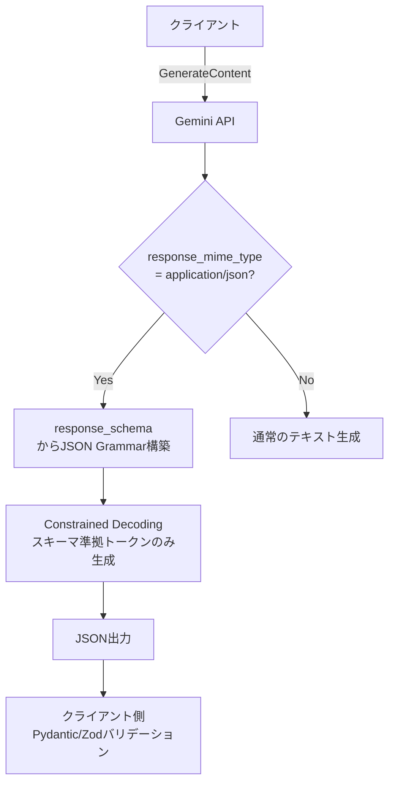
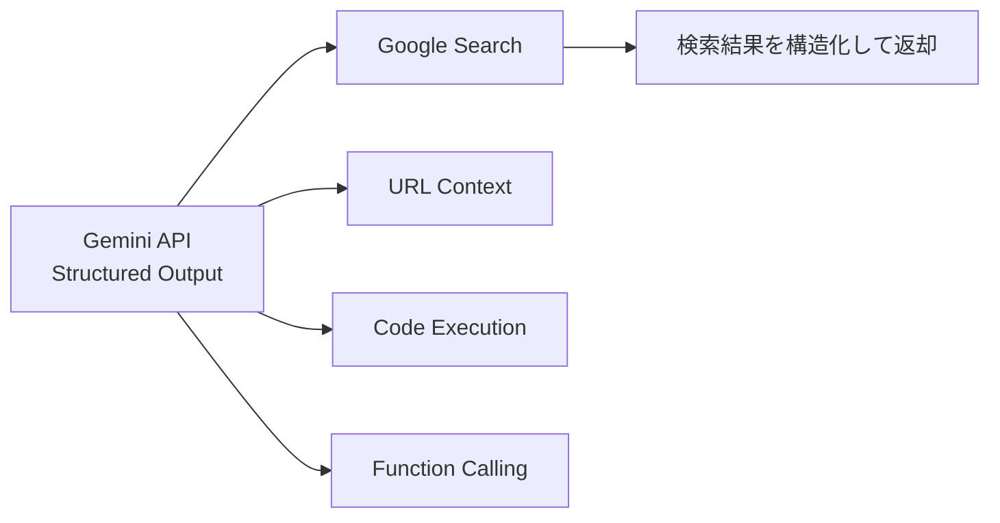
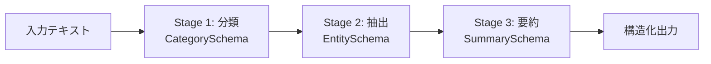

## ブログ概要（Summary）

本記事は [Google公式ブログ](https://blog.google/innovation-and-ai/technology/developers-tools/gemini-api-structured-outputs/) の解説記事です。

Googleは2025年11月、Gemini APIのStructured Output機能を大幅に強化したことを発表している。主な改善点として、JSON Schemaキーワードの拡充（`anyOf`、`$ref`、`minimum`/`maximum`、`additionalProperties`、`type: 'null'`、`prefixItems`）、Pydantic（Python）およびZod（JavaScript/TypeScript）のネイティブ統合、プロパティ順序の暗黙的保持が含まれる。これらの機能はGemini 2.5モデル群およびOpenAI互換APIで利用可能であり、LLM出力を確実に構造化データとして取得する基盤が整備されたとGoogleは報告している。

この記事は [Zenn記事: Gemini 3.7 FlashのStructured Outputでチケット自動分類を実装する](https://zenn.dev/0h_n0/articles/8737a1d512e42e) の深掘りです。

## 情報源

- **種別**: 企業テックブログ（Google）
- **URL**: [Improving Structured Outputs in the Gemini API](https://blog.google/innovation-and-ai/technology/developers-tools/gemini-api-structured-outputs/)
- **組織**: Gemini API Team, Google
- **発表日**: 2025年11月5日

## 技術的背景（Technical Background）

LLMの出力を下流アプリケーションで処理するには、自然言語テキストではなくJSONなどの構造化フォーマットが必要となる。従来のプロンプトベースのアプローチでは以下の問題が存在した。

- **パース失敗**: モデルが不正なJSONを生成し`json.loads()`でエラーが発生する
- **スキーマ不一致**: 期待するフィールドの欠損や型の不一致が起こる
- **順序の非保証**: JSONオブジェクトのキー順序がリクエストごとに変動する
- **複雑な型の表現不可**: Union型や再帰的データ構造をモデルに伝達できない

Gemini APIのStructured Output機能は、`response_mime_type`と`response_schema`を設定レベルで指定することで、モデルの出力がスキーマに適合することを保証する。学術的にはConstrained Decoding（制約付きデコーディング）に位置づけられ、デコード時にJSON Schemaの文法規則をオートマトンとして適用し、不正なトークン列を生成段階で排除する手法が基盤となっている。

## 実装アーキテクチャ（Architecture）

### Structured Output処理フロー



### 基本的な設定方法

Pydanticモデルを`response_schema`に直接渡すことで、スキーマ定義とバリデーションが一体化される。

```python
from google import genai
from pydantic import BaseModel


class TicketClassification(BaseModel):
    """サポートチケットの自動分類結果"""

    category: str
    priority: int
    summary: str
    requires_escalation: bool


client = genai.Client()
response = client.models.generate_content(
    model="gemini-2.5-flash",
    contents="ユーザーから「請求書の金額が間違っている」という問い合わせ",
    config=genai.types.GenerateContentConfig(
        response_mime_type="application/json",
        response_schema=TicketClassification,
    ),
)

result = TicketClassification.model_validate_json(response.text)
```

### 新規対応JSON Schemaキーワード

#### anyOf（Union型）

複数のスキーマのいずれかに適合する出力を生成できる。Pydanticでは`Union`型として定義する。

```python
from pydantic import BaseModel


class TextContent(BaseModel):
    content_type: str = "text"
    text: str

class ImageContent(BaseModel):
    content_type: str = "image"
    url: str
    alt_text: str

class ContentBlock(BaseModel):
    """anyOfによるUnion型: TextContentまたはImageContent"""
    content: TextContent | ImageContent
    position: int
```

#### $ref（再帰的スキーマ）

自己参照型のデータ構造を定義できる。ツリー構造やネストされたカテゴリの表現に使用する。

```python
from __future__ import annotations
from pydantic import BaseModel

class TreeNode(BaseModel):
    """$refにより自己参照を実現する再帰的ツリーノード"""
    name: str
    value: float | None = None
    children: list[TreeNode] = []
```

#### minimum / maximum（数値制約）

Pydanticの`Field(ge=..., le=...)`がJSON Schemaの`minimum`/`maximum`に変換され、モデルはこの範囲外の数値を生成しない。

```python
from pydantic import BaseModel, Field

class SentimentScore(BaseModel):
    """センチメント分析結果（スコア範囲制約付き）"""
    text: str
    score: float = Field(ge=-1.0, le=1.0)
    confidence: float = Field(ge=0.0, le=1.0)
```

### プロパティ順序の暗黙的保持

Googleは、スキーマで定義したプロパティの順序が出力JSONでも保持されることを報告している。JSON仕様（RFC 8259）ではキー順序は未定義だが、Constrained Decodingの実装においてスキーマの定義順にトークンを生成するため順序が保持される。

この性質はChain-of-Thought推論で有用となる。`reasoning`フィールドを先に定義することで、モデルは回答前に推論を行う。

```python
from pydantic import BaseModel

class ReasonedAnswer(BaseModel):
    """推論過程を含む回答（プロパティ順序で推論品質向上）"""
    reasoning: str   # 先に生成される
    answer: str      # reasoningを踏まえて生成される
    confidence: float
```

### ツール連携とストリーミング

Googleは、Structured OutputがGoogle Search、URL Context、Code Execution、File Search、Function Callingの各ツールと組み合わせて利用可能であることを報告している。またストリーミングにも対応しており、プロパティ順序保持によりチャンクの逐次パースが可能となる。



### 制限事項

Googleはドキュメントで以下の制限を明示している。

- `if`/`then`/`else`、`patternProperties`等のJSON Schemaキーワードは未対応
- 非常に大きなスキーマや深くネストされたスキーマはリジェクトされる可能性がある
- セマンティックレベルのバリデーションはアプリケーション側で実装する必要がある

## Production Deployment Guide

Gemini APIのStructured Outputを本番環境で運用するためのAWSインフラ構成を示す。Gemini APIはGoogle Cloudのサービスだが、既存AWSインフラとの統合パターンを想定する。

### AWS実装パターン（コスト最適化重視）

| 構成 | トラフィック | サービス構成 | 月額概算 |
|------|------------|-------------|---------|
| Small | ~100 req/日 | Lambda + API Gateway + Secrets Manager + DynamoDB | $30-80 |
| Medium | ~1,000 req/日 | ECS Fargate + ALB + ElastiCache + DynamoDB | $200-500 |
| Large | 10,000+ req/日 | EKS + Karpenter + ElastiCache + Aurora | $1,500-4,000 |

**Small構成の内訳**: Lambda 256MB RAM・30秒タイムアウト（$0.50/月）、API Gateway REST API（$3.50/100万リクエスト）、Secrets Manager（$0.40/月）、DynamoDB On-Demand（$1-5/月）、CloudWatch（$5-10/月）。

**Medium構成の内訳**: ECS Fargate 0.5vCPU/1GB RAM 2タスク常駐（$50-80/月）、ALB（$20/月+LCU）、ElastiCache t4g.micro（$15/月）、DynamoDB On-Demand（$10-30/月）。

**コスト削減テクニック**: レスポンスキャッシュで同一入力のAPI呼び出しを60-80%削減、EKS Large構成でSpotノード活用により最大90%削減、常駐リソースにReserved Instances 1年コミットで最大72%削減、非リアルタイム処理をSQSキュー経由でバッチ化。

### Terraformインフラコード

**Small構成（Serverless）**:

```hcl
# Lambda + Secrets Manager + DynamoDB
resource "aws_secretsmanager_secret" "gemini_api_key" {
  name = "gemini-structured-output/api-key"
}

resource "aws_dynamodb_table" "request_log" {
  name         = "gemini-so-logs"
  billing_mode = "PAY_PER_REQUEST"
  hash_key     = "request_id"
  range_key    = "timestamp"
  attribute { name = "request_id"; type = "S" }
  attribute { name = "timestamp"; type = "S" }
  server_side_encryption { enabled = true }
  ttl { attribute_name = "ttl"; enabled = true }
}

resource "aws_iam_role" "lambda_role" {
  name               = "gemini-so-lambda"
  assume_role_policy = jsonencode({
    Version = "2012-10-17"
    Statement = [{ Action = "sts:AssumeRole", Effect = "Allow",
      Principal = { Service = "lambda.amazonaws.com" } }]
  })
}

resource "aws_iam_role_policy" "lambda_policy" {
  name = "gemini-so-policy"
  role = aws_iam_role.lambda_role.id
  policy = jsonencode({
    Version = "2012-10-17"
    Statement = [
      { Effect = "Allow", Action = ["secretsmanager:GetSecretValue"],
        Resource = [aws_secretsmanager_secret.gemini_api_key.arn] },
      { Effect = "Allow", Action = ["dynamodb:PutItem", "dynamodb:GetItem"],
        Resource = [aws_dynamodb_table.request_log.arn] },
      { Effect = "Allow", Action = ["logs:CreateLogGroup", "logs:CreateLogStream", "logs:PutLogEvents"],
        Resource = ["arn:aws:logs:*:*:*"] },
    ]
  })
}

resource "aws_lambda_function" "structured_output" {
  function_name    = "gemini-structured-output"
  role             = aws_iam_role.lambda_role.arn
  handler          = "handler.lambda_handler"
  runtime          = "python3.12"
  timeout          = 30
  memory_size      = 256
  filename         = "lambda.zip"
  source_code_hash = filebase64sha256("lambda.zip")
  environment {
    variables = {
      SECRET_ARN     = aws_secretsmanager_secret.gemini_api_key.arn
      DYNAMODB_TABLE = aws_dynamodb_table.request_log.name
      GEMINI_MODEL   = "gemini-2.5-flash"
    }
  }
  tracing_config { mode = "Active" }
}
```

**Large構成（Container）**:

```hcl
module "eks" {
  source          = "terraform-aws-modules/eks/aws"
  version         = "~> 20.24"
  cluster_name    = "gemini-so-cluster"
  cluster_version = "1.31"
  vpc_id          = module.vpc.vpc_id
  subnet_ids      = module.vpc.private_subnets
  cluster_endpoint_public_access = false
}

# Karpenter NodePool - Spot優先で最大90%コスト削減
resource "kubectl_manifest" "karpenter_nodepool" {
  yaml_body = yamlencode({
    apiVersion = "karpenter.sh/v1"
    kind       = "NodePool"
    metadata   = { name = "gemini-so-pool" }
    spec = {
      template = { spec = {
        requirements = [
          { key = "karpenter.sh/capacity-type", operator = "In", values = ["spot", "on-demand"] },
          { key = "node.kubernetes.io/instance-type", operator = "In", values = ["m7i.large", "m6i.large"] },
        ]
      }}
      limits     = { cpu = "32", memory = "64Gi" }
      disruption = { consolidationPolicy = "WhenEmptyOrUnderutilized", consolidateAfter = "30s" }
    }
  })
}

resource "aws_budgets_budget" "monthly" {
  name         = "gemini-so-monthly"
  budget_type  = "COST"
  limit_amount = "4000"
  limit_unit   = "USD"
  time_unit    = "MONTHLY"
  notification {
    comparison_operator        = "GREATER_THAN"
    threshold                  = 80
    threshold_type             = "PERCENTAGE"
    notification_type          = "ACTUAL"
    subscriber_email_addresses = ["ops-team@example.com"]
  }
}
```

### 運用・監視設定

**CloudWatch Logs Insights** - レイテンシ分析:

```
fields @timestamp, @message
| filter event = "gemini_api_call"
| stats avg(duration_ms) as avg_latency, pct(duration_ms, 95) as p95, count(*) as total
  by bin(1h) as time_bucket
| sort time_bucket desc
```

**X-Ray トレーシング設定**:

```python
from aws_xray_sdk.core import xray_recorder, patch_all

patch_all()

@xray_recorder.capture("gemini_structured_output")
def call_gemini_api(prompt: str, schema: dict) -> dict:
    """Gemini APIをX-Rayトレース付きで呼び出す"""
    subsegment = xray_recorder.current_subsegment()
    subsegment.put_annotation("model", "gemini-2.5-flash")
    subsegment.put_metadata("schema_keys", list(schema.get("properties", {}).keys()))
    return _invoke_gemini(prompt, schema)
```

**Cost Explorer 日次レポート**:

```python
import boto3
from datetime import datetime, timedelta

def daily_cost_report() -> None:
    """日次コストレポートを生成しSNS通知"""
    ce = boto3.client("ce", region_name="us-east-1")
    today = datetime.utcnow().strftime("%Y-%m-%d")
    yesterday = (datetime.utcnow() - timedelta(days=1)).strftime("%Y-%m-%d")
    response = ce.get_cost_and_usage(
        TimePeriod={"Start": yesterday, "End": today},
        Granularity="DAILY", Metrics=["UnblendedCost"],
        Filter={"Tags": {"Key": "Project", "Values": ["gemini-structured-output"]}},
        GroupBy=[{"Type": "DIMENSION", "Key": "SERVICE"}],
    )
    total = sum(float(g["Metrics"]["UnblendedCost"]["Amount"])
                for g in response["ResultsByTime"][0]["Groups"])
    if total > 100:
        boto3.client("sns", region_name="ap-northeast-1").publish(
            TopicArn="arn:aws:sns:ap-northeast-1:123456789012:cost-alerts",
            Subject=f"Gemini SO daily cost: ${total:.2f}",
            Message=f"Daily cost exceeded $100: ${total:.2f}",
        )
```

### コスト最適化チェックリスト

**アーキテクチャ選択**:
- [ ] トラフィック量に応じた構成選択（Small: Serverless / Medium: Hybrid / Large: Container）
- [ ] 非同期処理可能な部分を特定しバッチ化

**リソース最適化**:
- [ ] EC2/EKSノード: Spot Instances優先（最大90%削減）
- [ ] 常駐リソース: Reserved Instances 1年コミット（最大72%削減）
- [ ] Savings Plans: Compute Savings Plans検討
- [ ] Lambda: Power Tuningでメモリサイズ最適化
- [ ] ECS/EKS: アイドル時スケールダウン設定
- [ ] NAT Gateway: VPCエンドポイント活用で通信コスト削減

**LLMコスト削減**:
- [ ] レスポンスキャッシュ: ElastiCache/DynamoDB DAXで同一入力をキャッシュ
- [ ] モデル選択ロジック: 簡単なタスクはFlash、複雑なタスクはPro
- [ ] トークン数制限: `max_output_tokens`で上限設定
- [ ] バッチ処理: 非リアルタイム処理をSQSキューで集約
- [ ] スキーマ最適化: 不要フィールド削除でトークン消費抑制

**監視・アラート**:
- [ ] AWS Budgets: 月額予算アラート設定
- [ ] CloudWatch アラーム: エラー率・レイテンシ監視
- [ ] Cost Anomaly Detection: 異常コスト自動検知
- [ ] 日次コストレポート: SNS/Slack通知

**リソース管理**:
- [ ] 未使用リソース定期クリーンアップ
- [ ] タグ戦略: Project/Env/Ownerタグ徹底
- [ ] DynamoDB TTL、S3ライフサイクル設定
- [ ] 開発環境の夜間・休日自動停止
- [ ] CloudWatch Logs保持期間の適切な設定

> **注意**: 上記コスト試算は2026年8月時点のAWS ap-northeast-1（東京）リージョン料金に基づく概算値です。実際のコストはトラフィックパターン、リージョン、バースト使用量により変動します。最新料金は[AWS料金計算ツール](https://calculator.aws/)で確認してください。

## パフォーマンス最適化（Performance）

Structured Outputを有効にした場合、Constrained Decodingのオーバーヘッドが生じる。Googleは具体的なオーバーヘッド値を公開していないが、スキーマの複雑さに応じてレイテンシが増加する傾向がある。

**最適化アプローチ**:
- **スキーマの簡素化**: 不要なネストを削減しフラットな構造を優先する
- **フィールド数の制限**: 必要最小限のフィールドのみスキーマに含める
- **ストリーミング活用**: TTFTは非構造化出力と同等のため、体感レイテンシを改善可能

同一入力に対するレスポンスキャッシュも有効で、プロンプトとスキーマのハッシュをキーとしてElastiCacheに保存することで、API呼び出しコストを60-80%削減できる。

## 運用での学び（Production Lessons）

### スキーマバリデーションの多層化

Gemini APIはJSON Schema準拠の構造的バリデーションを保証するが、セマンティックなバリデーションはアプリケーション側で実装する必要がある。Googleはこの点を制限事項として明記している。

```python
from pydantic import BaseModel, field_validator

class CustomerInfo(BaseModel):
    """顧客情報（Pydanticでセマンティックバリデーション実装）"""
    name: str
    email: str
    age: int

    @field_validator("email")
    @classmethod
    def validate_email_format(cls, v: str) -> str:
        if "@" not in v or "." not in v.split("@")[-1]:
            raise ValueError(f"Invalid email format: {v}")
        return v
```

### マルチステージパイプライン

ブログではAlkimi AIの事例として、マルチステージLLMパイプラインでの活用が紹介されている。各ステージの出力スキーマを定義することで、パイプライン全体の型安全性を確保できる。



## 学術研究との関連（Academic Connection）

Gemini APIのStructured Output機能は、Constrained Decodingの研究成果を実用化したものである。Willard & Loaiza-Ganem (2023) の「Efficient Guided Generation for Large Language Models」では、正規表現や文脈自由文法をデコード時の制約として適用する手法が提案されている。JSON Schemaは文脈自由文法として表現可能であり、この手法の直接的な応用となる。

関連Zenn記事のチケット自動分類のようなタスクでは、従来は正規表現パースやフォールバック処理が必要だったが、Structured Outputにより出力構造が保証されるため後処理が大幅に簡素化される。

## まとめと実践への示唆

GoogleはGemini APIのStructured Output機能を、JSON Schemaキーワードの拡充（`anyOf`、`$ref`、`minimum`/`maximum`等）とPydantic/Zodネイティブ統合により強化した。プロパティ順序の暗黙的保持はストリーミング処理やChain-of-Thought推論との親和性が高く、ツール連携と組み合わせることでエージェントワークフローの型安全性を確保できる。

実運用では、Gemini APIの構造的バリデーションとPydanticによるセマンティックバリデーションの多層化が重要となる。

## 参考文献

- **Blog URL**: [Improving Structured Outputs in the Gemini API](https://blog.google/innovation-and-ai/technology/developers-tools/gemini-api-structured-outputs/)
- **Official Docs**: [Gemini API - Structured Output](https://ai.google.dev/gemini-api/docs/structured-output)
- **Related Paper**: Willard & Loaiza-Ganem, "Efficient Guided Generation for Large Language Models" (2023)
- **Related Zenn article**: [Gemini 3.7 FlashのStructured Outputでチケット自動分類を実装する](https://zenn.dev/0h_n0/articles/8737a1d512e42e)
