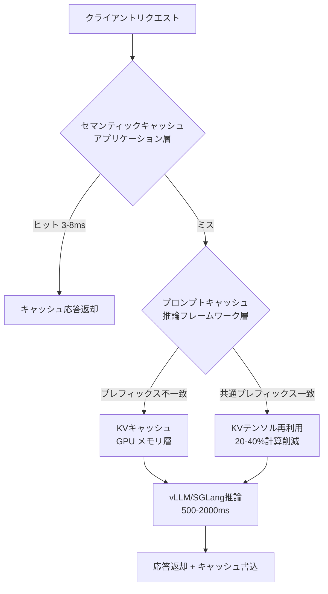
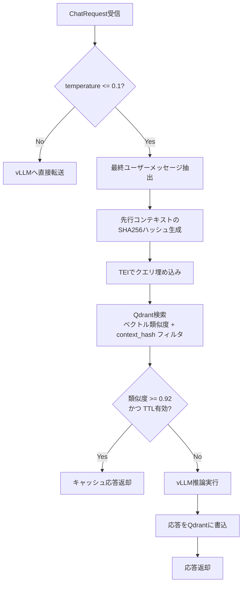

## ブログ概要（Summary）

本記事は [https://www.spheron.network/blog/semantic-cache-llm-inference-gpu-cloud/](https://www.spheron.network/blog/semantic-cache-llm-inference-gpu-cloud/) の解説記事です。

Spheron Networkは、LLM推論における3層キャッシュアーキテクチャの設計と運用について、GPTCache・Redis Vector Cache・LangChain InMemoryCacheの3ツール比較、埋め込みモデルの選定、ワークロード別ヒット率・類似度閾値・TTL設定、およびH100 SXM5環境でのコスト試算を含む包括的ガイドを公開している。Spheron社のベンチマークによると、FAQ botで50-70%のヒット率を達成し、月額コストを最大70%削減できるとしている。

この記事は [Zenn記事: セマンティックキャッシュ最適化10手法でLLM推論を高速化する](https://zenn.dev/0h_n0/articles/c2df29cd7e4092) の深掘りです。

## 情報源

- **種別**: 企業テックブログ（Spheron Network）
- **URL**: [Semantic Caching for LLM Inference: GPTCache, Redis Vector Cache, and Prompt Cache Setup](https://www.spheron.network/blog/semantic-cache-llm-inference-gpu-cloud/)
- **組織**: Spheron Network
- **発表年**: 2026年

## 技術的背景（Technical Background）

### 3層キャッシュアーキテクチャの必要性

LLM推論のレイテンシとコストは、リクエスト量の増加に伴い深刻な運用課題となる。Spheron社のブログによると、LLMの1リクエストあたりのレイテンシは500-2000msであり、セマンティックキャッシュのヒット時には3-8msで応答を返却できるとされている。この2桁以上のレイテンシ差を活用するために、ブログでは以下の3層をスタックとして設計することを提案している。



**第1層: セマンティックキャッシュ（アプリケーション層）**は、クエリの埋め込みベクトルをインデックスとしてLLMの完全な応答を保存する。意味的に類似したクエリに対して、LLMを呼び出すことなく過去の応答を返却する層である。

**第2層: プロンプトキャッシュ / プレフィックスキャッシュ（推論フレームワーク層）**は、複数リクエスト間で共通するプロンプトプレフィックスを識別し、計算済みのテンソルを再利用する。SGLangのRadixAttentionやvLLMのblock-level prefix cachingがこの層に該当し、Spheron社のブログによると一貫したシステムプロンプトを使用する場合に20-40%の計算削減が得られるとしている。

**第3層: KVキャッシュ（GPUメモリ層）**は、処理済みトークンのAttention Key-Valueテンソルをフレーム内に保持し、既に処理されたトークンのAttention計算の再実行を回避する。vLLMやSGLangなどの推論フレームワークが内部的に管理する層である。

### セマンティックキャッシュの数理的基盤

セマンティックキャッシュの核心は、クエリ $q$ を埋め込みモデル $f$ でベクトル空間に射影し、コサイン類似度 $\text{sim}(q, q_c) = \frac{f(q) \cdot f(q_c)}{\|f(q)\| \cdot \|f(q_c)\|}$ で最近傍を検索する操作である。キャッシュヒットは $\max_{q_c \in \mathcal{C}} \text{sim}(q, q_c) \geq \tau$（$\tau$: 閾値）で判定され、Spheron社のブログではデフォルト閾値として $\tau = 0.92$ を推奨している。

## 実装アーキテクチャ（Architecture）

### ツール比較: GPTCache vs Redis Vector Cache vs LangChain InMemoryCache

Spheron社のブログでは5つのキャッシュツールを比較している。以下にその比較結果を整理する。

| ツール | バックエンド | 類似度アルゴリズム | 本番利用 | レイテンシ | ライセンス |
|--------|-------------|-------------------|---------|-----------|-----------|
| GPTCache | FAISS, Qdrant, Redis, Milvus, Weaviate | コサイン類似度（設定可能） | 可（0.1.44+） | 3-10ms | MIT |
| Redis Vector Cache | Redis Stack | コサイン, IP, L2 | 可 | 2-5ms | RSAL |
| LangChain InMemoryCache | インプロセス辞書 | 完全一致のみ | 開発のみ | <1ms | MIT |
| LangChain RedisCache | Redis | 完全一致のみ | 可 | 2-5ms | MIT |
| Qdrant-backed custom | Qdrant | コサイン（HNSWインデックス） | 可 | 3-8ms | Apache 2.0 |

Spheron社のブログによると、Python中心ならGPTCache、多言語・分散ならRedis Vector Cache、HNSW微調整が必要ならカスタムQdrant、開発用途ならLangChainキャッシュが適するとしている。

### 埋め込みモデルの選定

Spheron社のブログでは3つの埋め込みモデルの性能を比較している。

| モデル | 次元数 | GPUレイテンシ(p50) | CPUレイテンシ(p50) | MTEB Recall@10 |
|--------|--------|-------------------|-------------------|----------------|
| BGE-M3 512-dim | 512 | ~2ms | ~12ms | 0.78 |
| BGE-M3 1024-dim | 1024 | ~3ms | ~18ms | 0.82 |
| Qwen3-Embedding | 2048 | ~4ms | ~25ms | 0.87 |

BGE-M3の512次元はMatryoshka Representation Learningによる截断で得られ、ベースライン推奨とされている。メモリスケーリングはエントリ100万件@512次元で約2GB RAM（float32）であり、大規模環境ではfloat16量子化による半減が推奨されている。

### キャッシュプロキシの実装

Spheron社のブログではFastAPIベースのキャッシュプロキシを提示しており、以下のリクエストフローを採用している。



このアーキテクチャの重要な設計判断として、temperatureが0.1を超えるリクエストはキャッシュを完全にバイパスする点がある。非決定的な生成ではキャッシュの意味が薄れるためである。

以下はSpheronブログで示されているキャッシュルックアップの実装例である。

```python
from typing import Optional
from qdrant_client.models import Filter, FieldCondition, MatchValue
import time

SIMILARITY_THRESHOLD: float = 0.92
TTL_SECONDS: int = 72 * 3600  # 72時間デフォルト
COLLECTION_NAME: str = "llm_cache"


async def cache_lookup(
    vector: list[float],
    context_hash: str,
) -> Optional[str]:
    """セマンティックキャッシュからの応答検索

    Args:
        vector: クエリの埋め込みベクトル
        context_hash: 先行コンテキストのSHA256ハッシュ（16文字）

    Returns:
        キャッシュヒット時は応答テキスト、ミス時はNone
    """
    results = await qdrant.search(
        collection_name=COLLECTION_NAME,
        query_vector=vector,
        query_filter=Filter(
            must=[
                FieldCondition(
                    key="context_hash",
                    match=MatchValue(value=context_hash),
                )
            ]
        ),
        limit=1,
        score_threshold=SIMILARITY_THRESHOLD,
    )
    if results and results[0].score >= SIMILARITY_THRESHOLD:
        payload = results[0].payload
        if time.time() - payload.get("created_at", 0) < TTL_SECONDS:
            return payload.get("response")
    return None
```

キャッシュキーの生成では、コンテキストハッシュとクエリテキストを結合したSHA256ハッシュの先頭16バイトをUUIDとして使用している。Spheron社のブログではコンテキストハッシュの生成に `json.dumps(messages[:-1], sort_keys=True)` のSHA256先頭16文字を採用しており、先行コンテキストの同一性を保証している。

### Docker Compose構成

Spheron社のブログでは単一H100ノード上にco-locatedスタックとして、TEI（BGE-M3、GPU 0、~1.5GB VRAM、ポート8080）、Qdrant（CPU、ポート6333）、vLLM（GPU 0-7、tensor parallel 8、bfloat16、prefix caching有効、ポート8000）、FastAPIプロキシ（CPU、ポート8888）の4サービスを構成している。TEIのmax_batch_tokensは65,536、vLLMのmax_model_lengthは8,192トークンに設定されている。

## Production Deployment Guide

### AWS実装パターン（コスト最適化重視）

Spheron社のブログで提示されたH100ベースの構成をAWSに移植する場合のトラフィック量別推奨構成を示す。なお、以下のコスト試算は2026年8月時点のAWS ap-northeast-1（東京）リージョン料金に基づく概算値であり、実際のコストはトラフィックパターンやリージョンにより変動する。

**Small（~1,000 req/日、FAQ bot）**:
- **構成**: Lambda + Bedrock + ElastiCache for Redis（r7g.medium）
- **推論**: Bedrock Claude 3.5 Haiku（セマンティックキャッシュのヒット分は不要）
- **キャッシュ**: ElastiCache for Redis（RediSearch対応、ベクトル検索可能）
- **埋め込み**: Bedrock Titan Embeddings V2（512次元）
- **月額**: $150-300

**Medium（~10,000 req/日、エージェントワークロード）**:
- **構成**: ECS Fargate + ElastiCache for Redis（r7g.large）+ TEI on g5.xlarge
- **推論**: ECS上のvLLM（g5.xlarge、Spot Instance）
- **キャッシュ**: ElastiCache for Redis（ベクトル検索）
- **埋め込み**: TEI on ECS（BGE-M3 512-dim）
- **月額**: $800-1,500

**Large（100,000+ req/日、マルチテナントSaaS）**:
- **構成**: EKS + Karpenter + p5.48xlarge（H100 x 8）+ ElastiCache Cluster
- **推論**: vLLM on EKS（H100、Spot優先）
- **キャッシュ**: ElastiCache for Redis Cluster（マルチAZ）
- **埋め込み**: TEI on EKS（GPU共有）
- **月額**: $5,000-15,000

**コスト削減テクニック**:
- Spot Instances活用: g5/p5インスタンスで最大70-90%削減
- Reserved Instances（1年コミット）: 最大40%削減
- Bedrock Batch API: 非同期処理で50%削減
- セマンティックキャッシュ自体: Spheron社の試算では60%ヒット率で月額60%削減

### Terraformインフラコード

**Small構成（Serverless + ElastiCache）** の主要リソース:

```hcl
# ElastiCache for Redis（ベクトル検索対応）
resource "aws_elasticache_replication_group" "vector_cache" {
  replication_group_id       = "semantic-cache"
  description                = "Semantic cache with vector search"
  node_type                  = "cache.r7g.medium"  # 6.38GB RAM
  num_cache_clusters         = 1
  engine                     = "redis"
  engine_version             = "7.2"
  at_rest_encryption_enabled = true
  transit_encryption_enabled = true
}

# Lambda関数（キャッシュプロキシ）
resource "aws_lambda_function" "cache_proxy" {
  function_name = "semantic-cache-proxy"
  runtime       = "python3.12"
  handler       = "handler.lambda_handler"
  memory_size   = 512
  timeout       = 30
  role          = aws_iam_role.lambda_role.arn
  environment {
    variables = {
      REDIS_HOST           = aws_elasticache_replication_group.vector_cache.primary_endpoint_address
      SIMILARITY_THRESHOLD = "0.92"
      TTL_SECONDS          = "259200"  # 72時間
    }
  }
}
```

**Large構成（EKS + Karpenter）** の主要リソース:

```hcl
module "eks" {
  source          = "terraform-aws-modules/eks/aws"
  version         = "~> 20.0"
  cluster_name    = "semantic-cache-cluster"
  cluster_version = "1.31"
}

# Karpenter NodePool（GPU Spot優先）
resource "kubectl_manifest" "gpu_nodepool" {
  yaml_body = yamlencode({
    apiVersion = "karpenter.sh/v1"
    kind       = "NodePool"
    metadata   = { name = "gpu-inference" }
    spec = {
      template.spec.requirements = [
        { key = "karpenter.sh/capacity-type", operator = "In", values = ["spot", "on-demand"] },
        { key = "node.kubernetes.io/instance-type", operator = "In", values = ["p5.48xlarge"] },
      ]
      limits     = { cpu = "192", "nvidia.com/gpu" = "8" }
      disruption = { consolidationPolicy = "WhenEmpty", consolidateAfter = "30s" }
    }
  })
}
```

### 運用・監視設定

**Prometheus計装（Spheron社のブログ準拠）**:

Spheron社のブログではPrometheusによる4メトリクスの計装を提示している。

```python
from prometheus_client import Counter, Histogram, start_http_server

cache_hits = Counter("cache_hits_total", "Total semantic cache hits")
cache_misses = Counter("cache_misses_total", "Total semantic cache misses")
similarity_scores = Histogram(
    "cache_similarity_score",
    "Cosine similarity scores",
    buckets=[0.80, 0.85, 0.88, 0.90, 0.92, 0.94, 0.96, 0.98, 1.0],
)
cache_latency = Histogram(
    "cache_lookup_latency_seconds",
    "End-to-end cache lookup latency",
    buckets=[0.001, 0.003, 0.005, 0.010, 0.020, 0.050],
)
start_http_server(9090)
```

**AWS環境での追加設定**:
- CloudWatch Logs Insights: `cache_hit|cache_miss`フィルタで1時間粒度のヒット率を集計
- X-Ray: `aws_xray_sdk`でboto3を自動計装し、`cache_lookup`サブセグメントでcontext_hashをアノテーション
- Cost Explorer: 日次のProjectタグ別コスト取得、$300/日超過でSNS通知

### コスト最適化チェックリスト

- [ ] トラフィック量に応じた構成選択（Serverless / Hybrid / Container）
- [ ] ヒット率目標の事前設定（ワークロード別期待値を参照）
- [ ] EC2/EKS: Spot Instances優先（GPU 70-90%削減）
- [ ] Reserved Instances / Savings Plans検討（最大40%削減）
- [ ] ElastiCache: 100万エントリ/2GB RAM基準でノードタイプ選定
- [ ] Karpenter WhenEmptyで未使用GPUノード自動回収
- [ ] セマンティックキャッシュ有効化（60%ヒットで月額60%削減）
- [ ] Bedrock Batch API（非同期50%削減）、Prompt Caching（30-90%削減）
- [ ] モデル選択ロジック（簡易 -> Haiku、複雑 -> Sonnet）
- [ ] AWS Budgets + Cost Anomaly Detection + 日次コストレポート
- [ ] Prometheus + Grafanaダッシュボード（ヒット率・類似度・TTL期限切れ）
- [ ] 埋め込みモデルのfloat16量子化によるメモリ半減

## パフォーマンス最適化（Performance）

### ベンチマーク結果

Spheron社のブログでは、1日100万リクエストのFAQ botワークロード（Llama 3.1 8B、平均800トークン/リクエスト）をH100 SXM5上で運用した場合のコスト試算を提示している。

| ヒット率 | GPU時間/日 | 日次コスト（H100） | 月額コスト |
|---------|-----------|-------------------|-----------|
| 0%（ベースライン） | 18.5h | $46.99 | ~$1,410 |
| 40% | 11.1h | $28.19 | ~$846 |
| 60% | 7.4h | $18.80 | ~$564 |
| 70% | 5.6h | $14.22 | ~$427 |

Spheron社のブログによると、H100 SXM5の単価は$2.54/時（2026年4月時点）、vLLMのバッチ推論スループットは約12,000トークン/秒とされている。コスト削減の計算式は以下の通りである。

$$
\text{GPU時間削減量} = \frac{\text{総リクエスト数} \times \text{ヒット率} \times \text{平均トークン数}}{\text{スループット(tokens/sec)} \times 3600}
$$

$$
\text{月額削減額} = \text{GPU時間削減量} \times 30 \times \text{GPU単価($/h)}
$$

Spheron社のブログでは、キャッシュインフラ自体のコスト（埋め込みモデル + Qdrant）は5GB VRAM未満、$0.10/時以下であり、推論コスト削減に対して無視できる水準としている。

### ワークロード別ヒット率

Spheron社のブログによると、ワークロードの性質によってヒット率は大きく異なる。FAQ bot（50-70%）、エージェントツール呼出（40-65%）、RAG（30-50%）、マルチターン会話（5-15%）、創作的生成（0-5%）と分類されている。特にMixture of Agents（MoA）パイプラインのproposer層では60-80%のGPU時間削減が可能としている。

## 運用での学び（Production Lessons）

### 類似度閾値チューニング

Spheron社のブログでは、ワークロード別に閾値を細かく設定することを推奨している。

| ワークロード | 推奨閾値 | 閾値過低のリスク | 閾値過高のリスク |
|-------------|---------|----------------|----------------|
| FAQ bot | 0.90-0.93 | エッジケースで誤回答 | パラフレーズのミスが増加 |
| RAGパイプライン | 0.92-0.95 | 誤コンテキストによるハルシネーション | キャッシュの意味が薄れる |
| エージェントツール呼出 | 0.88-0.92 | ツール出力の微妙なドリフト | 許容範囲のミス率増加 |
| コード生成 | 0.94-0.97 | 異なるタスクのコードを返却 | ほぼ同一プロンプトのみヒット |

Spheron社のブログによると、チューニングプロセスは以下の通りである。

1. ファクト系ワークロードでは閾値0.92から開始
2. 全ルックアップの類似度スコアをログに記録
3. 48時間、false-positive率（キャッシュ応答後のフォローアップ質問で誤回答と判明した割合）を監視
4. エラーパターンに基づいて0.01刻みで調整

Spheron社のブログでは、類似度スコアの分布が双峰型（bimodal）になることを指摘している。0.95超のクラスタ（重複クエリ）と0.85未満のクラスタ（無関係クエリ）に分かれ、0.88-0.94の「危険ゾーン」で閾値設定の精度が問われるとしている。

### TTL設定

Spheron社のブログでは、コンテンツの鮮度要件に応じた4段階のTTL設定を提示している。

| コンテンツ種別 | TTL | 根拠 |
|--------------|-----|------|
| ニュース・時事 | 24時間 | 情報鮮度が重要 |
| 安定的なファクト（ドキュメント、製品仕様） | 72時間 | 中程度の更新頻度 |
| 静的FAQ応答 | 7日間 | 変更頻度が低い |
| 不変コンテンツ（数学定義、歴史的事実） | TTLなし | 無期限キャッシュ |

デフォルト設定として72時間（259,200秒）が推奨されている。

### キャッシュポイズニング対策

Spheron社のブログでは、セマンティックキャッシュの最大リスクとしてキャッシュポイズニング、すなわち意味的に類似しているが異なるコンテキストのクエリが誤ったキャッシュ応答を返却する問題を挙げている。

**コンテキスト名前空間分離**: 最終ユーザーメッセージだけでなく、先行コンテキスト（システムプロンプト + 過去のメッセージ）を `json.dumps(messages[:-1], sort_keys=True)` のSHA256ハッシュ先頭16文字としてキャッシュキーに含める。これにより、同一の最終メッセージでも異なるコンテキストからのリクエストがキャッシュを共有しない。前述のキャッシュプロキシ実装で示した `context_hash` フィルタがこの仕組みに該当する。

Spheron社のブログでは追加対策として以下を挙げている。
- 埋め込み前の入力バリデーションとサニタイズ
- ユーザーティア・モデルバージョン・システムプロンプトハッシュによる名前空間分離
- 多次元フィルタリングによるポイズニングエントリの影響範囲限定

### オブザーバビリティ: 3つの主要メトリクス

Spheron社のブログでは、セマンティックキャッシュの運用健全性を測る3つの主要メトリクスを定義している。(1) **ヒット率**: `cache_hits / (cache_hits + cache_misses)`をモデル別・エンドポイント別に追跡。急激な低下はクエリ分布の変化を示す。(2) **類似度スコア分布**: 全ルックアップのコサイン類似度をヒストグラム化。週単位で平均が低下する場合はセマンティックドリフトを示す。(3) **TTL期限切れ率**: アクセス前に期限切れとなるエントリの割合が高い場合、ストレージが浪費されている。

Spheron社のブログでは、週次ジョブで直近10,000ヒットの平均類似度を計算し、ベースラインから0.03以上低下した場合にアラートを発火する運用を推奨している。対処法はキャッシュのリビルド（全エントリクリア + 新規トラフィックでのウォームアップ）である。

## 学術研究との関連（Academic Connection）

Spheron社のブログで使用されている技術には複数の学術的基盤がある。QdrantのHNSWインデックスはMalkov & Yashunin (2018)のHierarchical Navigable Small World graphsに基づく。BGE-M3の次元截断はKusupati et al. (2022)のMatryoshka Representation Learningに由来する。プレフィックスキャッシュ層のSGLang RadixAttentionはZheng et al. (2024)の提案であり、vLLMのメモリ管理はKwon et al. (2023)のPagedAttentionが基盤技術である。

## まとめと実践への示唆

Spheron社のブログは、セマンティックキャッシュを単独の最適化技法としてではなく、プロンプトキャッシュ・KVキャッシュと組み合わせた3層アーキテクチャとして設計することの重要性を示している。特に、ワークロード特性に応じたヒット率の期待値（FAQ 50-70%、エージェント 40-65%、RAG 30-50%）と類似度閾値の設定（0.88-0.97）を明確に分類した点は、実務での導入判断に有用である。

コスト面では、H100環境で1日100万リクエストのFAQ botにおいて、60%ヒット率で月額$1,410から$564への削減が試算されている。キャッシュインフラ自体のコストは$0.10/時未満であり、投資対効果は明確である。導入検討時は、ワークロードの反復性を計測し、期待ヒット率30%超を判断基準とすることが実践的な第一歩となる。

## 参考文献

- **Blog URL**: [Semantic Caching for LLM Inference: GPTCache, Redis Vector Cache, and Prompt Cache Setup](https://www.spheron.network/blog/semantic-cache-llm-inference-gpu-cloud/)
- **Related Zenn article**: [セマンティックキャッシュ最適化10手法でLLM推論を高速化する](https://zenn.dev/0h_n0/articles/c2df29cd7e4092)
- Malkov, Y. A., & Yashunin, D. A. (2018). Efficient and robust approximate nearest neighbor search using Hierarchical Navigable Small World graphs. *IEEE Transactions on Pattern Analysis and Machine Intelligence*.
- Kusupati, A., et al. (2022). Matryoshka Representation Learning. *NeurIPS 2022*.
- Zheng, L., et al. (2024). SGLang: Efficient Execution of Structured Language Model Programs. *arXiv:2312.07104*.
- Kwon, W., et al. (2023). Efficient Memory Management for Large Language Model Serving with PagedAttention. *SOSP 2023*.
