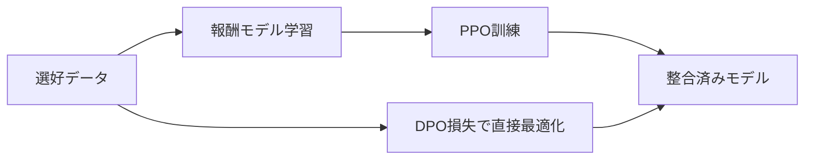

本記事は [https://arxiv.org/abs/2305.18290](https://arxiv.org/abs/2305.18290) の解説記事です。

## 論文概要（Abstract）

Direct Preference Optimization（DPO）は、大規模言語モデル（LLM）を人間の選好に整合させるための手法である。従来のRLHF（Reinforcement Learning from Human Feedback）では、報酬モデルの学習とPPOによる強化学習という2段階の複雑なパイプラインが必要だった。著者らは報酬モデルの新しいパラメタライズを導入し、最適ポリシーを閉形式で抽出できることを示した。その結果、RLHFの最適化問題を単純な分類損失に帰着させ、報酬モデルの明示的な学習もRL中のサンプリングも不要にしている。

この記事は [Zenn記事: TRL DPOで社内FAQ回答モデルを選好チューニングしLLM-as-a-Judgeで評価する](https://zenn.dev/0h_n0/articles/e268578955c06f) の深掘りです。

## 情報源

- **arXiv ID**: 2305.18290
- **URL**: [https://arxiv.org/abs/2305.18290](https://arxiv.org/abs/2305.18290)
- **著者**: Rafael Rafailov, Archit Sharma, Eric Mitchell, Stefano Ermon, Christopher D. Manning, Chelsea Finn（Stanford University）
- **発表年**: 2023（NeurIPS 2023 採択）
- **分野**: cs.LG, cs.AI, cs.CL

## 背景と動機（Background & Motivation）

LLMの振る舞いを人間の意図に沿うよう制御するRLHFは、報酬モデル学習とPPOによるポリシー最適化の2段階からなり、各段階のハイパーパラメータ調整、PPO訓練中のサンプリングによる計算コスト、訓練安定性の確保（value functionやclipping戦略）が実用上の課題であった。著者らはこれらの課題に対し、報酬モデルとRLの両方を不要にする理論的枠組みを提案している。



## 主要な貢献（Key Contributions）

- **貢献1: 報酬関数の再パラメタライズ** — Bradley-Terryモデルにおける報酬関数を、最適ポリシーと参照ポリシーの対数確率比として表現できることを証明した。これにより報酬モデルの明示的な学習が不要になる。
- **貢献2: RLの分類損失への帰着** — KL制約付き報酬最大化という最適化問題を、選好ペアに対する単純なバイナリ交差エントロピー損失に変換した。PPOのような複雑なRLアルゴリズムが不要になる。
- **貢献3: 同等以上の性能の実証** — 感情制御、要約、対話の3タスクでPPOベースのRLHFと同等以上の性能を達成しつつ、実装の簡潔さと計算効率の面で優位性を示した。

## 技術的詳細（Technical Details）

### Bradley-Terryモデルと選好の確率モデル

人間の選好を確率的にモデル化するBradley-Terry（BT）モデルでは、プロンプト $x$ に対する2つの応答 $y_1, y_2$ について、$y_1$ が $y_2$ より好まれる確率を以下のように定義する:

$$
p^*(y_1 \succ y_2 \mid x) = \frac{\exp(r^*(x, y_1))}{\exp(r^*(x, y_1)) + \exp(r^*(x, y_2))}
$$

ここで、
- $r^*(x, y)$: 真の報酬関数（潜在的な人間の評価基準）
- $\succ$: 「より好まれる」関係

この式はシグモイド関数 $\sigma$ を用いて以下と等価である:

$$
p^*(y_1 \succ y_2 \mid x) = \sigma(r^*(x, y_1) - r^*(x, y_2))
$$

### KL制約付き報酬最大化

RLHFの目的関数は、報酬を最大化しつつ参照ポリシーからの逸脱を抑制するKL制約付き最適化問題として定式化される:

$$
\max_{\pi_\theta} \mathbb{E}_{x \sim \mathcal{D},\, y \sim \pi_\theta(\cdot \mid x)} \left[ r_\phi(x, y) \right] - \beta \cdot D_{\text{KL}}\left[ \pi_\theta(y \mid x) \,\|\, \pi_{\text{ref}}(y \mid x) \right]
$$

ここで、
- $\pi_\theta$: 学習対象のポリシー（言語モデル）
- $\pi_{\text{ref}}$: 参照ポリシー（SFT済みモデル）
- $r_\phi$: 学習された報酬モデル
- $\beta > 0$: KL制約の強さを制御する温度パラメータ
- $D_{\text{KL}}$: KLダイバージェンス

### 最適ポリシーの閉形式解

この最適化問題の解は閉形式で求まる。最適ポリシー $\pi_r$ は以下の式で表される:

$$
\pi_r(y \mid x) = \frac{1}{Z(x)} \pi_{\text{ref}}(y \mid x) \exp\left(\frac{r(x, y)}{\beta}\right)
$$

ここで、$Z(x) = \sum_y \pi_{\text{ref}}(y \mid x) \exp(r(x, y) / \beta)$ は分配関数（正規化定数）である。

この式を報酬について解くと:

$$
r(x, y) = \beta \log \frac{\pi_r(y \mid x)}{\pi_{\text{ref}}(y \mid x)} + \beta \log Z(x)
$$

### DPO損失関数の導出

上記の報酬の再パラメタライズをBradley-Terryモデルに代入する。選好される応答を $y_w$（winner）、選好されない応答を $y_l$（loser）とすると:

$$
p^*(y_w \succ y_l \mid x) = \sigma\left( \beta \log \frac{\pi_r(y_w \mid x)}{\pi_{\text{ref}}(y_w \mid x)} - \beta \log \frac{\pi_r(y_l \mid x)}{\pi_{\text{ref}}(y_l \mid x)} \right)
$$

分配関数 $Z(x)$ は差分を取ることでキャンセルされる点が重要である。これにより、最大尤度推定に基づくDPO損失関数が得られる:

$$
\mathcal{L}_{\text{DPO}}(\pi_\theta;\, \pi_{\text{ref}}) = -\mathbb{E}_{(x,\, y_w,\, y_l) \sim \mathcal{D}} \left[ \log \sigma \left( \beta \log \frac{\pi_\theta(y_w \mid x)}{\pi_{\text{ref}}(y_w \mid x)} - \beta \log \frac{\pi_\theta(y_l \mid x)}{\pi_{\text{ref}}(y_l \mid x)} \right) \right]
$$

ここで、
- $\mathcal{D}$: 選好データセット（各サンプルは $(x, y_w, y_l)$ の三つ組）
- $\sigma$: シグモイド関数
- $\beta$: 温度パラメータ（参照ポリシーからの逸脱度を制御）

### β の役割

温度パラメータ $\beta$ はDPOの挙動を大きく左右する:

- **$\beta$ が大きい場合**: KL制約が強くなり、ポリシーは参照モデルに近い振る舞いを保つ。選好データへの適合度は下がるが、過学習を抑制できる。
- **$\beta$ が小さい場合**: KL制約が弱くなり、ポリシーは選好データにより強く適合する。ただし参照モデルからの逸脱が大きくなり、生成品質が劣化するリスクがある。

論文の実験では $\beta = 0.1$ から $\beta = 0.5$ の範囲で検証されており、TRLライブラリのデフォルトも $\beta = 0.1$ に設定されている。

### DPO勾配の直感的理解

DPO損失の勾配は以下の形をとる:

$$
\nabla_\theta \mathcal{L}_{\text{DPO}} = -\beta \, \mathbb{E} \left[ \sigma\left(\hat{r}_\theta(x, y_l) - \hat{r}_\theta(x, y_w)\right) \cdot \left( \nabla_\theta \log \pi_\theta(y_w \mid x) - \nabla_\theta \log \pi_\theta(y_l \mid x) \right) \right]
$$

ここで $\hat{r}_\theta(x, y) = \beta \log \frac{\pi_\theta(y \mid x)}{\pi_{\text{ref}}(y \mid x)}$ は暗黙の報酬である。勾配は $y_w$ の尤度を上げ $y_l$ の尤度を下げる方向に更新し、暗黙の報酬が選好を正しく反映していないサンプルほど大きな重みを受ける。既に正しくランキングされたサンプルは勾配への寄与が自動的に小さくなる。

### 理論的保証

著者らは以下の定理を示している。**定理1（表現の完全性）**: Bradley-Terry選好モデルと整合するすべての報酬同値類は、$r(x, y) = \beta \log \frac{\pi(y \mid x)}{\pi_{\text{ref}}(y \mid x)}$ の形で表現可能である。これは、同じ選好分布を誘導する報酬関数の一意性（補題1）と、同値な報酬関数が同じ最適ポリシーを誘導すること（補題2）に基づく。

## アルゴリズム（Algorithm）

### Python実装

```python
import torch
import torch.nn.functional as F
from torch import Tensor


def compute_dpo_loss(
    policy_chosen_logps: Tensor,
    policy_rejected_logps: Tensor,
    reference_chosen_logps: Tensor,
    reference_rejected_logps: Tensor,
    beta: float = 0.1,
) -> tuple[Tensor, Tensor, Tensor]:
    """DPO損失を計算する.

    Args:
        policy_chosen_logps: ポリシーの選好応答の対数確率. shape: (batch_size,)
        policy_rejected_logps: ポリシーの非選好応答の対数確率. shape: (batch_size,)
        reference_chosen_logps: 参照モデルの選好応答の対数確率. shape: (batch_size,)
        reference_rejected_logps: 参照モデルの非選好応答の対数確率. shape: (batch_size,)
        beta: 温度パラメータ（KL制約の強さ）.

    Returns:
        loss, chosen_rewards, rejected_rewards の三つ組.
    """
    # 暗黙的報酬: r_hat = beta * log(pi / pi_ref)
    chosen_rewards = beta * (policy_chosen_logps - reference_chosen_logps)
    rejected_rewards = beta * (policy_rejected_logps - reference_rejected_logps)

    # DPO損失 = -E[log sigma(r_hat(y_w) - r_hat(y_l))]
    loss = -F.logsigmoid(chosen_rewards - rejected_rewards).mean()
    return loss, chosen_rewards.detach(), rejected_rewards.detach()


def get_batch_logps(logits: Tensor, labels: Tensor, mask: Tensor) -> Tensor:
    """バッチ全体の対数確率を計算する.

    Args:
        logits: モデル出力. shape: (batch_size, seq_len, vocab_size)
        labels: トークンID. shape: (batch_size, seq_len)
        mask: パディングマスク. shape: (batch_size, seq_len)

    Returns:
        各系列の対数確率の合計. shape: (batch_size,)
    """
    per_token_logps = torch.gather(
        logits[:, :-1, :].log_softmax(dim=-1), dim=2,
        index=labels[:, 1:].unsqueeze(2),
    ).squeeze(2)
    return (per_token_logps * mask[:, 1:]).sum(dim=-1)
```

## 実装のポイント（Implementation）

**参照モデルの扱い**: $\pi_{\text{ref}}$ は訓練中に更新されないため、事前に対数確率をキャッシュしておくとメモリ効率が良い（TRLの `precompute_ref_log_probs=True`）。

**数値安定性**: `log_softmax` と `logsigmoid` を使い、`log(softmax(...))` のような不安定な計算を避ける。$\beta$ が小さい場合にオーバーフローのリスクがある。

**ハイパーパラメータ**: TRLの推奨値は学習率 $1 \times 10^{-6}$、$\beta = 0.1$、バッチサイズ 8。論文ではチューニングの必要性が低いと報告されている。

**LoRA との組み合わせ**: フルパラメータのファインチューニングが困難な場合、TRLでは `peft_config=LoraConfig()` を渡すだけでLoRA対応のDPO訓練が可能。

## Production Deployment Guide

### AWS実装パターン（コスト最適化重視）

DPOで訓練したモデルを推論APIとして提供するAWS構成を、トラフィック量別に整理する。以下のコスト試算は2026年9月時点のAWS ap-northeast-1（東京）リージョン料金に基づく概算値であり、実際のコストはトラフィックパターンやリージョンにより変動する。

| 構成 | トラフィック | 主要サービス | 月額概算 |
|------|------------|------------|---------|
| Small (Serverless) | ~100 req/日 | Lambda + Bedrock + DynamoDB | $50-150 |
| Medium (Hybrid) | ~1,000 req/日 | ECS Fargate + ALB + ElastiCache | $300-800 |
| Large (Container) | 10,000+ req/日 | EKS + EC2 Spot(g5.xlarge x3) + Karpenter | $2,000-5,000 |

Small構成ではDPO訓練済みモデルが7B以下の場合にBedrockカスタムモデルインポートを活用できる。Medium構成でGPU推論が必要な場合はECS on EC2のg5.xlargeで月額$500-800程度。Large構成ではSpot Instancesで最大90%のコスト削減、Karpenterでアイドル時の自動スケールダウンが可能。

### Terraformインフラコード

#### Small構成（Lambda + Bedrock + DynamoDB）

```hcl
terraform {
  required_version = ">= 1.9.0"
  required_providers { aws = { source = "hashicorp/aws", version = "~> 5.60" } }
}
provider "aws" { region = "ap-northeast-1" }

resource "aws_iam_role" "dpo_lambda" {
  name = "dpo-inference-lambda-role"
  assume_role_policy = jsonencode({
    Version = "2012-10-17"
    Statement = [{ Action = "sts:AssumeRole", Effect = "Allow",
                    Principal = { Service = "lambda.amazonaws.com" } }]
  })
}

resource "aws_lambda_function" "dpo_inference" {
  function_name = "dpo-inference"
  runtime       = "python3.12"
  handler       = "handler.lambda_handler"
  role          = aws_iam_role.dpo_lambda.arn
  timeout       = 60
  memory_size   = 512
  architectures = ["arm64"]  # 約20%安価
  environment { variables = { MODEL_ID = var.model_id, BETA = "0.1" } }
  filename         = "lambda_package.zip"
  source_code_hash = filebase64sha256("lambda_package.zip")
}

resource "aws_dynamodb_table" "log" {
  name = "dpo-inference-log"
  billing_mode = "PAY_PER_REQUEST"
  hash_key = "request_id"
  range_key = "timestamp"
  attribute { name = "request_id"; type = "S" }
  attribute { name = "timestamp"; type = "S" }
  server_side_encryption { enabled = true }
}
variable "model_id" { type = string }
```

#### Large構成（EKS + Karpenter + Spot）

```hcl
module "eks" {
  source  = "terraform-aws-modules/eks/aws"
  version = "~> 20.24"
  cluster_name = "dpo-inference"
  cluster_version = "1.31"
  vpc_id = module.vpc.vpc_id
  subnet_ids = module.vpc.private_subnets
}

# Karpenter: Spot優先で最大90%コスト削減
resource "kubectl_manifest" "gpu_pool" {
  yaml_body = yamlencode({
    apiVersion = "karpenter.sh/v1", kind = "NodePool"
    metadata = { name = "dpo-gpu-pool" }
    spec = { template = { spec = {
      requirements = [
        { key = "karpenter.sh/capacity-type", operator = "In", values = ["spot", "on-demand"] },
        { key = "node.kubernetes.io/instance-type", operator = "In", values = ["g5.xlarge"] },
      ]
      nodeClassRef = { group = "karpenter.k8s.aws", kind = "EC2NodeClass", name = "default" }
    }}, limits = { "nvidia.com/gpu" = "8" },
    disruption = { consolidationPolicy = "WhenEmptyOrUnderutilized" } }
  })
}

resource "aws_budgets_budget" "monthly" {
  name = "dpo-monthly"
  budget_type = "COST"
  limit_amount = "5000"
  limit_unit = "USD"
  time_unit = "MONTHLY"
  notification {
    comparison_operator = "GREATER_THAN"
    threshold = 80
    threshold_type = "PERCENTAGE"
    notification_type = "ACTUAL"
    subscriber_email_addresses = [var.alert_email]
  }
}
variable "alert_email" { type = string }
```

### 運用・監視設定

**CloudWatch Logs Insights**: トークン使用量の異常検知とレイテンシ分析（P95/P99）を1時間ごとに集計する。

```
fields @timestamp, duration_ms
| filter @message like /inference_complete/
| stats percentile(duration_ms, 95) as p95, percentile(duration_ms, 99) as p99 by bin(1h)
```

**CloudWatch アラーム・X-Ray・Cost Explorer**:

```python
import boto3
from datetime import datetime, timedelta
from aws_xray_sdk.core import xray_recorder, patch_all

patch_all()  # boto3自動計装


def create_dpo_alarms() -> None:
    """トークン使用量スパイク検知アラームを作成する."""
    boto3.client("cloudwatch", region_name="ap-northeast-1").put_metric_alarm(
        AlarmName="dpo-token-spike", MetricName="TokenCount",
        Namespace="DPO/Inference", Statistic="Sum", Period=3600,
        EvaluationPeriods=1, Threshold=100000,
        ComparisonOperator="GreaterThanThreshold",
        AlarmActions=["arn:aws:sns:ap-northeast-1:ACCOUNT:dpo-alerts"])


def generate_daily_cost_report() -> dict:
    """日次コストレポート生成。$100/日超過でSNS通知."""
    ce = boto3.client("ce", region_name="us-east-1")
    today = datetime.utcnow().strftime("%Y-%m-%d")
    yesterday = (datetime.utcnow() - timedelta(days=1)).strftime("%Y-%m-%d")
    resp = ce.get_cost_and_usage(
        TimePeriod={"Start": yesterday, "End": today},
        Granularity="DAILY", Metrics=["UnblendedCost"],
        GroupBy=[{"Type": "DIMENSION", "Key": "SERVICE"}])
    total = sum(float(g["Metrics"]["UnblendedCost"]["Amount"])
                for r in resp["ResultsByTime"] for g in r["Groups"])
    if total > 100:
        boto3.client("sns", region_name="ap-northeast-1").publish(
            TopicArn="arn:aws:sns:ap-northeast-1:ACCOUNT:dpo-cost-alert",
            Subject=f"DPO Cost: ${total:.2f}/day", Message=f"${total:.2f}")
    return {"total_cost": total}
```

### コスト最適化チェックリスト

**アーキテクチャ**: トラフィック量で構成選択（~100: Serverless、~1000: Hybrid、10000+: Container）。GPU推論の必要性を検証。

**リソース最適化**: Spot Instances優先（最大90%削減）/ Reserved Instances 1年コミット（最大72%削減）/ Savings Plans適用 / Lambda ARM64（約20%削減）/ Lambda Power Tuningでメモリ最適化 / Karpenterでアイドル時スケールダウン

**LLMコスト削減**: Bedrock Batch API（50%削減）/ Prompt Caching（30-90%削減）/ 軽量タスクは小型モデルにルーティング / max_tokens制限 / GPTQ/AWQ量子化

**監視・アラート**: AWS Budgets（80%/100%段階アラート）/ CloudWatchアラーム / Cost Anomaly Detection / 日次Cost Explorerレポート

**リソース管理**: Trusted Advisorで未使用リソース削除 / タグ戦略（`project:dpo-inference`）/ S3/ECRライフサイクルポリシー / 開発環境夜間停止 / VPCエンドポイントでNAT通信量削減

## 実験結果（Results）

著者らは3つのタスクで実験を行い、DPOの有効性を検証している。

### 感情制御（IMDb Sentiment）

GPT-2をベースモデルとした感情制御タスクにおいて、論文Figure 1より、DPOは全てのKL値でPPO-GT（真の報酬関数にアクセスできるオラクル設定）を含む全ベースラインに対して最も効率的なフロンティアを形成したと報告されている。

### 要約（Reddit TL;DR Summarization）

GPT-J（6B）を用いた要約タスクのGPT-4自動評価結果（論文Table 1より）:

| 手法 | GPT-4勝率（Temp 0.0） | GPT-4勝率（Temp 0.25） |
|------|----------------------|----------------------|
| DPO | 61% | 約58% |
| PPO | 57% | 低下（温度に敏感） |
| Best of 128 | DPOと同程度 | - |

著者らは「DPOはPPOの最良ケース性能を超え、サンプリング温度の変化に対してより頑健である」と報告している。

### 対話（Anthropic HH）・分布外汎化

Pythia-2.8Bを用いた対話タスクでは、DPOが計算効率的な手法の中で唯一preferred completionsを上回り、Best of 128と同等以上の品質を示したと報告されている。分布外評価（CNN/DailyMail、論文Table 2）では、DPO（0.36）がPPO（0.26）に対して38%の性能優位を維持している。

## 実運用への応用（Practical Applications）

**社内FAQ・カスタマーサポート**: Zenn記事で取り上げているように、社内FAQの回答品質を選好データで改善するユースケースに直接適用できる。DPOの計算効率性により、小規模チームでも導入しやすく、TRLライブラリで数行のコードから訓練を開始できる。

**コスト効率とスケーリング**: 報酬モデル訓練が不要でGPU時間を大幅に削減できる。損失関数が標準的な交差エントロピーベースであるため、FSDP・DeepSpeedとの互換性が高く、大規模モデルへのスケーリングが容易である。

**選好データの反復改善**: 訓練済みモデルから新応答を生成し、選好アノテーションを収集して再訓練する反復サイクルに組み込みやすい。

## 関連研究（Related Work）

- **PPO（Proximal Policy Optimization）**: Schulman et al., 2017。RLHFの標準RL手法。DPOはPPOの複雑な訓練ループを分類損失に置き換える代替手法である。
- **SimPO**: Meng et al., 2024（arXiv: 2405.14734）。参照モデル不要版DPO。トークンあたりの対数確率で正規化し長さバイアスを解消。TRLでは `loss_type="sigmoid_norm"` で利用可能。
- **KTO**: Ethayarajh et al., 2024（arXiv: 2402.01306）。Prospect Theoryに基づく損失回避バイアスを導入。選好ペアではなくgood/badラベルのみで訓練でき、データ収集コストが低い。
- **IPO**: Azar et al., 2023（arXiv: 2310.12036）。DPOのロジスティック変換の過学習を指摘し、恒等変換で選好を直接最適化。TRLでは `loss_type="ipo"`。

## まとめと今後の展望

DPOは報酬モデル学習とPPO訓練を単一の分類損失に統合した手法である。Bradley-Terryモデルの報酬関数をポリシーの対数確率比で再パラメタライズする数学的洞察により、強化学習を不要にした。実験では感情制御・要約・対話の各タスクでPPOと同等以上の性能が確認されている。

今後はオンラインDPO、LLM-as-a-Judgeとの組み合わせによる選好データ収集の効率化、VLMへのDPO訓練の拡張などが研究されている。

## 参考文献

- **arXiv**: [https://arxiv.org/abs/2305.18290](https://arxiv.org/abs/2305.18290)
- **TRL DPOTrainer**: [https://huggingface.co/docs/trl/dpo_trainer](https://huggingface.co/docs/trl/dpo_trainer)
- **Related Zenn article**: [https://zenn.dev/0h_n0/articles/e268578955c06f](https://zenn.dev/0h_n0/articles/e268578955c06f)
