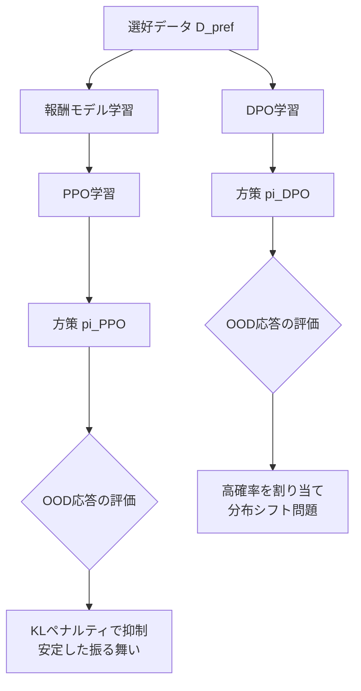

## 論文概要（Abstract）

本記事は [arXiv:2404.10719](https://arxiv.org/abs/2404.10719) の解説記事です。

Xu, Fu, Gao, Ye, Liu, Mei, Wang, Yu, Wu (2024) は、LLMアラインメントにおいてDirect Preference Optimization（DPO）がProximal Policy Optimization（PPO）より優れているかどうかを理論・実験の両面から包括的に調査している。著者らは、DPOには分布シフトに起因する根本的な制限があることを理論的に示し、PPOを適切に設定すれば対話タスク・コード生成タスクの全シナリオでDPOを上回ることを実証している。特にCodeContestベンチマークではPPOがpass@10@1kで22.4%を達成しAlphaCode-41Bの16.4%を超えた一方、DPOは0.0%にとどまった（論文Table 4より）。

この記事は [Zenn記事: TRL DPOで社内FAQ回答モデルを選好チューニングしLLM-as-a-Judgeで評価する](https://zenn.dev/0h_n0/articles/e268578955c06f) の深掘りです。

## 情報源

- **arXiv ID**: 2404.10719
- **URL**: [https://arxiv.org/abs/2404.10719](https://arxiv.org/abs/2404.10719)
- **著者**: Shusheng Xu, Wei Fu, Jiaxuan Gao et al.
- **発表年**: 2024
- **会議**: ICML 2024
- **分野**: cs.LG, cs.AI, cs.CL

## 背景と動機（Background & Motivation）

LLMを人間の意図に沿わせるアラインメント手法は、大きく2つの系譜に分かれる。第一は報酬モデルを学習し、そのスコアを最大化するようにPPOで方策を更新する**RLHF**パイプラインである。ChatGPTやClaudeの成功により産業界で広く採用されてきた。第二は報酬モデルを明示的に学習せず、選好データから直接方策を最適化する**DPO**である。DPOは実装が容易でハイパーパラメータが少ないため、学術ベンチマークで好成績を収め、研究コミュニティで急速に普及した。

しかし、DPOの優位性はベンチマーク条件に依存したものではないかという疑問が生じていた。PPOの学術実装は不安定になりやすく、適切な設定が見落とされている可能性がある。著者らは「DPOの学術的成功は特定のデータセット条件に起因しており、アルゴリズムとしての優位性とは限らない」と仮説を立て、理論・実験の両面から検証を行っている。

## 主要な貢献（Key Contributions）

- **DPOの理論的制限の解明**: DPOの方策空間はPPOの方策空間を包含する（$\Pi_{\text{PPO}} \subset \Pi_{\text{DPO}}$）が、この柔軟性がout-of-distribution（OOD）応答を不当に高く評価するバイアスの原因となることを証明した
- **PPO最適設定の同定**: advantage normalization、大バッチサイズ、参照モデルのEMA更新の3要素がPPO成功の鍵であることをablation studyで定量的に示した
- **包括的ベンチマーク評価**: 対話（HH-RLHF, SafeRLHF）とコード生成（APPS, CodeContest）の両領域で、適切に設定されたPPOがDPOおよびその反復的変種を全シナリオで上回ることを実証した

## 技術的詳細（Technical Details）

### DPOの分布シフト問題の理論的分析

RLHFの標準的な定式化では、方策 $\pi_\theta$ を以下の目的関数で最適化する。

$$
\max_{\pi_\theta} \mathbb{E}_{x \sim \mathcal{D}, y \sim \pi_\theta(\cdot \mid x)} \left[ r(x, y) \right] - \beta \, D_{\text{KL}} \left[ \pi_\theta(y \mid x) \| \pi_{\text{ref}}(y \mid x) \right]
$$

ここで、
- $\pi_\theta$: 学習対象の方策
- $\pi_{\text{ref}}$: 参照方策（SFTモデル）
- $r(x, y)$: 報酬関数
- $\beta$: KLペナルティ係数
- $\mathcal{D}$: プロンプト分布

PPOはこの目的関数を直接最適化する。一方、DPOは報酬モデルを介さず、最適方策と報酬関数の閉形式の関係を利用して選好データから直接方策を学習する。

DPOの損失関数は以下の通りである。

$$
\mathcal{L}_{\text{DPO}}(\pi_\theta; \pi_{\text{ref}}) = -\mathbb{E}_{(x, y_w, y_l) \sim \mathcal{D}_{\text{pref}}} \left[ \log \sigma \left( \beta \log \frac{\pi_\theta(y_w \mid x)}{\pi_{\text{ref}}(y_w \mid x)} - \beta \log \frac{\pi_\theta(y_l \mid x)}{\pi_{\text{ref}}(y_l \mid x)} \right) \right]
$$

ここで、
- $(x, y_w, y_l)$: プロンプト $x$ に対する勝ち応答 $y_w$ と負け応答 $y_l$ のペア
- $\mathcal{D}_{\text{pref}}$: 選好データセット
- $\sigma$: シグモイド関数

**Theorem 4.1**（論文より）: PPOで到達可能な方策集合 $\Pi_{\text{PPO}}$ はDPOで到達可能な方策集合 $\Pi_{\text{DPO}}$ の真部分集合である。すなわち $\Pi_{\text{PPO}} \subset \Pi_{\text{DPO}}$ が成立する。

一見するとDPOの方が表現力が高く有利に思えるが、著者らはこの余分な自由度こそが問題の根源であると指摘している。DPOは選好データセット $\mathcal{D}_{\text{pref}}$ に含まれる応答ペアのみから学習するため、学習データに存在しないOOD応答に対する方策の振る舞いを制御できない。具体的には、DPOがOOD応答 $y_{\text{ood}}$ に対して不当に高い確率を割り当てるバイアスが発生する。



PPOでは、方策が生成する応答に対して報酬モデルがオンラインで評価を行うため、OOD応答に高い報酬を与えることは起こりにくい。さらにKL正則化により、方策が参照モデルから大きく逸脱することを防いでいる。

### 分布シフトの実証的検証

著者らはSafeRLHFデータセットを用いて、ベースモデル（SFTモデル）と選好データの分布が乖離した条件下での性能を比較している（論文Table 2より）。

| ベースモデル | 手法 | 安全率 | 有用性報酬 |
|:---:|:---:|:---:|:---:|
| Safe SFT（低分布シフト） | DPO | 71.8% | - |
| Alpaca SFT（高分布シフト） | DPO | 55.4% | - |
| Safe SFT | PPO | 99.5% | +1.69 |
| Alpaca SFT | PPO | 99.5% | +1.69 |

DPOはベースモデルの選択に敏感であり、分布シフトが大きい条件（Alpaca SFT）で安全率が55.4%まで低下している。一方、PPOは両条件で99.5%の安全率を維持しており、分布シフトに対するロバスト性が確認されている。

### PPOの最適設定要素

著者らはablation study（論文Table 3）を通じて、PPOの性能を左右する3つの要素を同定している。

#### 1. Advantage Normalization

PPOではadvantage関数 $A(s, a)$ を用いて方策を更新する。

$$
A(s, a) = Q(s, a) - V(s)
$$

ここで $Q(s, a)$ は行動価値関数、$V(s)$ は状態価値関数である。Advantage normalizationは、ミニバッチ内のadvantage値を標準化する手法である。

$$
\hat{A}(s, a) = \frac{A(s, a) - \mu_A}{\sigma_A + \epsilon}
$$

ここで $\mu_A$ と $\sigma_A$ はミニバッチ内のadvantageの平均と標準偏差、$\epsilon$ は数値安定性のための微小定数である。この標準化により、報酬スケールの違いによる学習の不安定性を抑制する。HH-RLHFベンチマークでは、normalizationの導入によりrewardが0.706から0.716へ改善したと報告されている。

#### 2. 大バッチサイズ

バッチサイズはPPO性能に最も大きな影響を与える要素である。著者らはAPPSベンチマークにおいて、バッチサイズの変化に伴う性能推移を報告している（論文Table 3, Figure 2より）。

| バッチサイズ | APPS Introductory pass@5 | APPS Interview pass@5 | APPS Competition pass@5 |
|:---:|:---:|:---:|:---:|
| 64 | 33.7% | - | 6.8% |
| 512 | 44.4% | 18.0% | 9.1% |
| 2048 | - | - | - |

バッチサイズ64ではIntroductoryレベルで33.7%にとどまるが、512に拡大すると44.4%まで改善する。大バッチにより勾配推定の分散が低減され、特にコード生成のような離散的かつ希薄な報酬を持つタスクで顕著な効果が得られる。

#### 3. 参照モデルのEMA更新

従来のPPO実装では参照モデル $\pi_{\text{ref}}$ を固定するが、著者らは指数移動平均（EMA）で参照モデルを緩やかに更新する手法を採用している。

$$
\theta_{\text{ref}}^{(t+1)} = \alpha \, \theta_{\text{ref}}^{(t)} + (1 - \alpha) \, \theta_{\pi}^{(t)}
$$

ここで $\alpha$ はEMA係数（0.99程度）であり、$\theta_\pi^{(t)}$ は現在の方策パラメータである。この更新により、学習が進むにつれて方策と参照モデルの乖離が過大になることを防ぎ、KLペナルティが過剰に大きくなる問題を緩和する。CodeContestでの性能がpass@10@1kで21.4%から22.4%に改善したと報告されている。

### Bradley-Terryモデルと報酬モデルの構造的違い

DPOはBradley-Terryモデルを前提としている。このモデルでは、応答ペア $(y_w, y_l)$ の選好確率を以下のように定義する。

$$
P(y_w \succ y_l \mid x) = \sigma(r(x, y_w) - r(x, y_l))
$$

ここで $r(x, y)$ は暗黙的な報酬関数であり、DPOでは $r(x, y) = \beta \log \frac{\pi_\theta(y \mid x)}{\pi_{\text{ref}}(y \mid x)}$ と再パラメータ化される。

一方、PPOで用いる報酬モデルはより柔軟な構造を持つ。報酬モデル $r_\phi(x, y)$ はニューラルネットワークとして独立に学習され、任意の入力に対してスカラー報酬を出力する。この独立した報酬モデルは、OOD応答に対しても一般化した評価を提供でき、DPOの暗黙的報酬が持つデータ依存性の問題を回避する。

## アルゴリズム（PPOとDPOの比較コード）

PPOとDPOの学習ループの構造的な違いを以下のコードで示す。

```python
import torch
import torch.nn.functional as F
from dataclasses import dataclass


@dataclass
class PPOConfig:
    """PPO学習の設定パラメータ

    Args:
        kl_coeff: KLペナルティ係数
        clip_range: PPOクリッピング範囲
        batch_size: グローバルバッチサイズ
        ema_alpha: 参照モデルEMA係数
        adv_norm: advantage normalizationの有無
    """
    kl_coeff: float = 0.1
    clip_range: float = 0.2
    batch_size: int = 512
    ema_alpha: float = 0.99
    adv_norm: bool = True


def compute_ppo_loss(
    policy_logprobs: torch.Tensor,
    old_logprobs: torch.Tensor,
    advantages: torch.Tensor,
    config: PPOConfig,
) -> torch.Tensor:
    """PPOのクリッピング付き方策損失を計算する

    Args:
        policy_logprobs: 現在の方策の対数確率 (batch_size,)
        old_logprobs: 旧方策の対数確率 (batch_size,)
        advantages: advantage値 (batch_size,)
        config: PPO設定

    Returns:
        方策損失のスカラーテンソル
    """
    # Advantage normalization（論文の主要知見の1つ）
    if config.adv_norm:
        advantages = (advantages - advantages.mean()) / (advantages.std() + 1e-8)

    # 重要度比
    ratio = torch.exp(policy_logprobs - old_logprobs)

    # クリッピング付き目的関数
    surr1 = ratio * advantages
    surr2 = torch.clamp(ratio, 1.0 - config.clip_range, 1.0 + config.clip_range) * advantages
    loss = -torch.min(surr1, surr2).mean()

    return loss


def update_reference_model_ema(
    ref_params: dict[str, torch.Tensor],
    policy_params: dict[str, torch.Tensor],
    alpha: float = 0.99,
) -> None:
    """参照モデルをEMAで更新する（in-place）

    Args:
        ref_params: 参照モデルのパラメータ辞書
        policy_params: 方策モデルのパラメータ辞書
        alpha: EMA係数（論文では0.99程度）
    """
    for key in ref_params:
        ref_params[key].data.mul_(alpha).add_(policy_params[key].data, alpha=1 - alpha)


def compute_dpo_loss(
    policy_chosen_logprobs: torch.Tensor,
    policy_rejected_logprobs: torch.Tensor,
    ref_chosen_logprobs: torch.Tensor,
    ref_rejected_logprobs: torch.Tensor,
    beta: float = 0.1,
) -> torch.Tensor:
    """DPOの損失関数を計算する

    Args:
        policy_chosen_logprobs: 方策の勝ち応答に対する対数確率 (batch_size,)
        policy_rejected_logprobs: 方策の負け応答に対する対数確率 (batch_size,)
        ref_chosen_logprobs: 参照モデルの勝ち応答に対する対数確率 (batch_size,)
        ref_rejected_logprobs: 参照モデルの負け応答に対する対数確率 (batch_size,)
        beta: 温度パラメータ

    Returns:
        DPO損失のスカラーテンソル
    """
    # 暗黙的報酬の差分
    chosen_rewards = beta * (policy_chosen_logprobs - ref_chosen_logprobs)
    rejected_rewards = beta * (policy_rejected_logprobs - ref_rejected_logprobs)

    # Bradley-Terryモデルに基づく損失
    loss = -F.logsigmoid(chosen_rewards - rejected_rewards).mean()

    return loss
```

このコードから、DPOは選好データの対数確率比のみで学習が完結する簡潔な構造である一方、PPOは報酬モデルの評価、advantage計算、クリッピング、参照モデルのEMA更新という複数のコンポーネントを必要とすることがわかる。この複雑さがPPOの実装難易度を高めてきたが、著者らは適切な設定さえ行えばPPOがDPOを一貫して上回ることを示している。

## 実装のポイント（Implementation）

著者らの実験設定から、PPOを実運用で成功させるための要点をまとめる。

**ハイパーパラメータ設定**（論文の実験設定より）:
- **学習率**: Actor 1e-5、Critic 5e-6。Actorの学習率をCriticの2倍に設定しており、方策更新を価値関数推定よりやや積極的に行う設計となっている
- **バッチサイズ**: 512以上。コード生成タスクでは2048まで拡大が有効。バッチサイズ64では性能が大幅に低下する（APPS Introductoryで33.7% vs 512での44.4%）
- **KL係数**: 0.1。参照モデルからの逸脱を適度に許容する値
- **EMA係数**: 0.99程度。参照モデルが方策に追従する速度を制御する

**DPOの設定**:
- **$\beta$**: 0.1。温度パラメータが小さすぎるとノイジーな勾配、大きすぎると学習が遅くなる
- **学習率**: 1e-6（PPOのActorより1桁小さい）
- **エポック数**: 対話タスクで2、コードタスクで1。過学習を防ぐため少ないエポックが推奨される

**実装上の注意点**:
- PPOの報酬モデルとCriticモデルは別々に初期化する。報酬モデルはSFTモデルから初期化し選好データで学習、Criticモデルは報酬モデルから初期化する
- コード生成タスクでは、報酬信号が疎（テストケースのpass/fail）であるため、大バッチによる勾配分散の低減が特に重要となる
- Iterative DPO（DPO-Iter）は報酬モデルを用いてデータを再生成する変種であり、通常のDPOより大幅に改善するが、それでもPPOには及ばない

## Production Deployment Guide

### AWS実装パターン（コスト最適化重視）

選好学習パイプライン（PPO/DPO）をAWS上で運用する際の構成を示す。LLMのファインチューニングはGPU集約型であるため、コスト管理が極めて重要となる。以下のコスト試算は2026年9月時点のAWS ap-northeast-1（東京）リージョン料金に基づく概算値であり、実際のコストはトラフィックパターン・リージョン・バースト使用量により変動する。最新料金はAWS料金計算ツールで確認を推奨する。

**トラフィック量別の推奨構成**:

| 構成 | ユースケース | 主要サービス | 月額概算 |
|:---:|:---|:---|:---:|
| Small | 研究開発・PoC（週1-2回学習） | SageMaker Training Job + S3 | $200-500 |
| Medium | 定期学習（日次バッチ） | ECS Fargate + SageMaker + S3 | $1,500-3,000 |
| Large | 継続学習（リアルタイムフィードバック） | EKS + Spot GPU + SageMaker Pipelines | $5,000-15,000 |

**Small構成の内訳**: SageMaker Training Job（ml.g5.2xlarge, スポット利用で$0.45/h x 月20h = $9）、S3（モデル・データストレージ100GB = $2.3）、CloudWatch（ログ・メトリクス = $5）。スポット利用で最大70%のコスト削減が可能。

**コスト削減テクニック**:
- SageMaker Managed Spot Training活用で最大70%削減
- S3 Intelligent-Tieringでストレージコスト最適化
- SageMaker Savings Plansで最大64%削減（1年コミット）
- 推論エンドポイントにはSageMaker Serverless Inferenceを使用し、アイドル時コストをゼロに

### Terraformインフラコード

**Small構成（SageMaker Training Job + S3）**:

```hcl
# PPO/DPO学習パイプライン - Small構成
# SageMaker Training Job + S3

terraform {
  required_version = ">= 1.9"
  required_providers {
    aws = {
      source  = "hashicorp/aws"
      version = "~> 5.60"
    }
  }
}

provider "aws" {
  region = "ap-northeast-1"
}

# S3: モデル・データセット・チェックポイント保存
resource "aws_s3_bucket" "training_data" {
  bucket = "llm-alignment-training-${data.aws_caller_identity.current.account_id}"
}

resource "aws_s3_bucket_server_side_encryption_configuration" "training_data" {
  bucket = aws_s3_bucket.training_data.id
  rule {
    apply_server_side_encryption_by_default {
      sse_algorithm = "aws:kms"
    }
  }
}

resource "aws_s3_bucket_lifecycle_configuration" "training_data" {
  bucket = aws_s3_bucket.training_data.id
  rule {
    id     = "archive-old-checkpoints"
    status = "Enabled"
    filter { prefix = "checkpoints/" }
    transition {
      days          = 30
      storage_class = "GLACIER_IR"
    }
    expiration { days = 180 }
  }
}

# IAM: SageMaker実行ロール（最小権限）
resource "aws_iam_role" "sagemaker_training" {
  name = "llm-alignment-sagemaker-role"
  assume_role_policy = jsonencode({
    Version = "2012-10-17"
    Statement = [{
      Action = "sts:AssumeRole"
      Effect = "Allow"
      Principal = { Service = "sagemaker.amazonaws.com" }
    }]
  })
}

resource "aws_iam_role_policy" "sagemaker_s3_access" {
  name = "s3-training-access"
  role = aws_iam_role.sagemaker_training.id
  policy = jsonencode({
    Version = "2012-10-17"
    Statement = [
      {
        Effect   = "Allow"
        Action   = ["s3:GetObject", "s3:PutObject", "s3:ListBucket"]
        Resource = [
          aws_s3_bucket.training_data.arn,
          "${aws_s3_bucket.training_data.arn}/*"
        ]
      },
      {
        Effect   = "Allow"
        Action   = ["logs:CreateLogGroup", "logs:CreateLogStream", "logs:PutLogEvents"]
        Resource = "arn:aws:logs:ap-northeast-1:*:log-group:/aws/sagemaker/*"
      }
    ]
  })
}

# CloudWatch: コスト監視アラーム
resource "aws_cloudwatch_metric_alarm" "training_cost" {
  alarm_name          = "llm-alignment-training-cost-spike"
  comparison_operator = "GreaterThanThreshold"
  evaluation_periods  = 1
  metric_name         = "EstimatedCharges"
  namespace           = "AWS/Billing"
  period              = 86400
  statistic           = "Maximum"
  threshold           = 500
  alarm_description   = "Training cost exceeds $500/day"
  alarm_actions       = [aws_sns_topic.alerts.arn]
  dimensions          = { Currency = "USD" }
}

resource "aws_sns_topic" "alerts" {
  name = "llm-alignment-alerts"
}

data "aws_caller_identity" "current" {}
```

**Large構成（EKS + Spot GPU）**:

```hcl
# PPO/DPO学習パイプライン - Large構成
# EKS + Karpenter + Spot GPU Instances

module "eks" {
  source  = "terraform-aws-modules/eks/aws"
  version = "~> 20.24"

  cluster_name    = "llm-alignment-cluster"
  cluster_version = "1.31"

  vpc_id     = module.vpc.vpc_id
  subnet_ids = module.vpc.private_subnets

  # コスト最適化: コントロールプレーンのみManaged
  cluster_endpoint_public_access = false

  eks_managed_node_groups = {
    # システムノード（CPU、オンデマンド）
    system = {
      instance_types = ["m6i.large"]
      min_size       = 1
      max_size       = 3
      desired_size   = 2
    }
  }
}

# Karpenter: GPU Spot Instanceの自動プロビジョニング
resource "kubectl_manifest" "karpenter_gpu_provisioner" {
  yaml_body = yamlencode({
    apiVersion = "karpenter.sh/v1"
    kind       = "NodePool"
    metadata   = { name = "gpu-training" }
    spec = {
      template = {
        spec = {
          requirements = [
            { key = "node.kubernetes.io/instance-type", operator = "In", values = ["g5.2xlarge", "g5.4xlarge", "g5.8xlarge"] },
            { key = "karpenter.sh/capacity-type", operator = "In", values = ["spot", "on-demand"] },
            { key = "topology.kubernetes.io/zone", operator = "In", values = ["ap-northeast-1a", "ap-northeast-1c"] }
          ]
          nodeClassRef = { name = "default" }
        }
      }
      limits   = { cpu = "128", memory = "512Gi", "nvidia.com/gpu" = "8" }
      disruption = {
        consolidationPolicy = "WhenEmptyOrUnderutilized"
        consolidateAfter    = "30s"
      }
    }
  })
}

# AWS Budgets: 月次予算アラート
resource "aws_budgets_budget" "training_monthly" {
  name         = "llm-alignment-monthly"
  budget_type  = "COST"
  limit_amount = "15000"
  limit_unit   = "USD"
  time_unit    = "MONTHLY"

  notification {
    comparison_operator       = "GREATER_THAN"
    threshold                 = 80
    threshold_type            = "PERCENTAGE"
    notification_type         = "ACTUAL"
    subscriber_email_addresses = ["ops-team@example.com"]
  }
}

# Secrets Manager: 学習設定の安全な管理
resource "aws_secretsmanager_secret" "training_config" {
  name       = "llm-alignment/training-config"
  kms_key_id = aws_kms_key.training.arn
}

resource "aws_kms_key" "training" {
  description             = "KMS key for LLM alignment training secrets"
  deletion_window_in_days = 7
  enable_key_rotation     = true
}
```

### 運用・監視設定

**CloudWatch Logs Insightsクエリ（学習メトリクス分析）**:

```
# PPO学習の報酬推移とKL divergence監視
fields @timestamp, reward_mean, kl_divergence, policy_loss, value_loss
| filter @logGroup like /sagemaker\/training/
| stats avg(reward_mean) as avg_reward, max(kl_divergence) as max_kl,
        p95(policy_loss) as p95_policy_loss by bin(1h) as hour
| sort hour desc
| limit 168
```

**CloudWatchアラーム設定（Python）**:

```python
import boto3
from datetime import datetime


def setup_training_alarms(
    cloudwatch_client: boto3.client,
    sns_topic_arn: str,
) -> None:
    """PPO/DPO学習ジョブの監視アラームを設定する

    Args:
        cloudwatch_client: CloudWatch boto3クライアント
        sns_topic_arn: 通知先SNSトピックARN
    """
    # GPU使用率低下アラーム（学習停止検知）
    cloudwatch_client.put_metric_alarm(
        AlarmName="llm-alignment-gpu-utilization-low",
        MetricName="GPUUtilization",
        Namespace="AWS/SageMaker",
        Statistic="Average",
        Period=300,
        EvaluationPeriods=3,
        Threshold=10.0,
        ComparisonOperator="LessThanThreshold",
        AlarmActions=[sns_topic_arn],
        AlarmDescription="GPU utilization below 10% for 15min - possible training stall",
    )

    # 学習時間超過アラーム
    cloudwatch_client.put_metric_alarm(
        AlarmName="llm-alignment-training-duration",
        MetricName="TrainingJobDuration",
        Namespace="AWS/SageMaker",
        Statistic="Maximum",
        Period=3600,
        EvaluationPeriods=1,
        Threshold=86400,
        ComparisonOperator="GreaterThanThreshold",
        AlarmActions=[sns_topic_arn],
        AlarmDescription="Training job exceeds 24h - check for divergence",
    )
```

**X-Rayトレーシング設定（推論パイプライン向け）**:

```python
from aws_xray_sdk.core import xray_recorder, patch_all

patch_all()  # boto3自動計装


@xray_recorder.capture("alignment_inference")
def run_aligned_inference(
    prompt: str,
    model_endpoint: str,
) -> dict:
    """アラインメント済みモデルの推論をトレーシング付きで実行する

    Args:
        prompt: 入力プロンプト
        model_endpoint: SageMakerエンドポイント名

    Returns:
        推論結果の辞書
    """
    subsegment = xray_recorder.current_subsegment()
    subsegment.put_annotation("model_endpoint", model_endpoint)
    subsegment.put_metadata("prompt_length", len(prompt))

    client = boto3.client("sagemaker-runtime")
    response = client.invoke_endpoint(
        EndpointName=model_endpoint,
        ContentType="application/json",
        Body=json.dumps({"prompt": prompt}),
    )
    result = json.loads(response["Body"].read())
    subsegment.put_metadata("output_tokens", result.get("token_count", 0))
    return result
```

**Cost Explorer日次レポート（Python）**:

```python
import boto3
from datetime import date, timedelta


def get_daily_training_cost(
    ce_client: boto3.client,
    sns_client: boto3.client,
    sns_topic_arn: str,
    threshold_usd: float = 500.0,
) -> dict:
    """日次の学習コストを取得し、閾値超過時にSNS通知する

    Args:
        ce_client: Cost Explorer boto3クライアント
        sns_client: SNS boto3クライアント
        sns_topic_arn: 通知先SNSトピックARN
        threshold_usd: コスト閾値（USD）

    Returns:
        サービス別コスト内訳の辞書
    """
    today = date.today()
    yesterday = today - timedelta(days=1)

    response = ce_client.get_cost_and_usage(
        TimePeriod={"Start": str(yesterday), "End": str(today)},
        Granularity="DAILY",
        Metrics=["UnblendedCost"],
        Filter={
            "Tags": {"Key": "Project", "Values": ["llm-alignment"]}
        },
        GroupBy=[{"Type": "DIMENSION", "Key": "SERVICE"}],
    )

    costs = {}
    total = 0.0
    for group in response["ResultsByTime"][0]["Groups"]:
        service = group["Keys"][0]
        amount = float(group["Metrics"]["UnblendedCost"]["Amount"])
        costs[service] = amount
        total += amount

    if total > threshold_usd:
        sns_client.publish(
            TopicArn=sns_topic_arn,
            Subject=f"LLM Alignment Training Cost Alert: ${total:.2f}/day",
            Message=f"Daily cost ${total:.2f} exceeds threshold ${threshold_usd}.\n"
                    f"Breakdown: {json.dumps(costs, indent=2)}",
        )

    return costs
```

### コスト最適化チェックリスト

**アーキテクチャ選択**:
- [ ] 学習頻度に応じた構成選択（週次ならSmall、日次ならMedium、継続学習ならLarge）
- [ ] 推論は学習と分離し、Serverless Inferenceで従量課金化

**リソース最適化**:
- [ ] SageMaker Managed Spot Trainingで学習コスト最大70%削減
- [ ] Reserved Instances / Savings Plans検討（1年コミットで最大64%削減）
- [ ] GPU選択最適化（7BモデルならA10G/g5、34Bモデルなら複数GPU/p4d）
- [ ] チェックポイント保存でSpot中断に対応（5分間隔で自動保存）
- [ ] 未使用エンドポイントの自動削除（Lambda + EventBridge）

**LLM学習コスト削減**:
- [ ] Mixed Precision Training（bf16）でGPUメモリ50%削減、学習速度向上
- [ ] Gradient Checkpointingで大バッチ対応（メモリ効率化）
- [ ] LoRA/QLoRAでパラメータ効率化（フルファインチューニング比1/10のコスト）
- [ ] データセットの前処理・フィルタリングで無駄な学習ステップ削減

**監視・アラート**:
- [ ] AWS Budgets設定（月次上限アラート80%/100%）
- [ ] CloudWatch GPU使用率アラーム（学習停止検知）
- [ ] Cost Anomaly Detection有効化（自動異常検知）
- [ ] 日次コストレポート自動送信（Cost Explorer + SNS）
- [ ] SageMaker Profiler有効化（ボトルネック特定）

**リソース管理**:
- [ ] S3ライフサイクルポリシー（古いチェックポイントをGlacierへ）
- [ ] タグ戦略統一（Project/Environment/Owner/CostCenter）
- [ ] 開発環境の自動停止（EventBridge + Lambda、営業時間外）
- [ ] 不要なモデルバージョンの定期削除（SageMaker Model Registry）
- [ ] CloudTrail有効化（セキュリティ監査）

## 実験結果（Results）

### 対話タスク（HH-RLHF, Llama2-7B）

著者らはHH-RLHFデータセット（170k比較ペア）を用いて、Llama2-7Bベースの各手法を評価している（論文Table 1, Table 5より）。

| 手法 | Reward | Win Rate vs Chosen | GPT-4 Prefer |
|:---:|:---:|:---:|:---:|
| SFT | - | - | - |
| DPO | 0.611 | 55% | 30% |
| DPO-Iter | 0.678 | - | - |
| PPO | 0.718 | 57% | 42% |

PPOはDPOに対してrewardで0.107ポイント上回り（0.718 vs 0.611）、GPT-4による評価でもPPOが42%の選好を獲得している（DPO 30%、タイ 28%）。著者らはさらに人間評価（論文Table 14）でもGPT-4評価と60-61%の一致率を確認しており、自動評価の信頼性を担保している。

### 安全性タスク（SafeRLHF, Llama2-7B）

SafeRLHF（30k以上のエントリ）を用いた安全性評価では、PPOとDPOの差がより顕著に現れている（論文Table 2より）。

| 手法 | 安全率 | 有用性デルタ |
|:---:|:---:|:---:|
| DPO | 95.8% | -2.86 |
| DPO-Iter | 99.9% | -2.96 |
| PPO | 99.5% | +1.69 |

PPOは99.5%の安全率を維持しながら有用性を+1.69改善している。DPO-Iterは安全率で99.9%を達成するが、有用性は-2.96と大幅に低下しており、安全性と有用性のトレードオフにおいてPPOが優位であることが示されている。

### コード生成タスク（APPS, CodeContest, CodeLlama-34B）

コード生成タスクでは、PPOとDPOの性能差が最も劇的に現れている（論文Table 4より）。

| ベンチマーク | PPO | DPO-Iter | DPO | SFT |
|:---:|:---:|:---:|:---:|:---:|
| APPS Intro (pass@5) | 44.4% | 34.2% | - | 38.6% |
| APPS Interview (pass@5) | 18.0% | 9.3% | - | 10.1% |
| APPS Competition (pass@5) | 9.1% | 3.7% | - | 3.9% |
| CodeContest (pass@10@1k) | 22.4% | 3.2% | 0.0% | 7.6% |

CodeContestにおけるPPOの22.4%は、AlphaCode（41Bパラメータ）の16.4%を上回る性能であると著者らは報告している。一方、DPOは0.0%と「意味のないコードスニペット」を生成する状態に陥っている。この結果は、報酬信号が疎で複雑なタスクにおけるDPOの根本的な限界を示唆している。

## 実運用への応用（Practical Applications）

### DPOとPPOの使い分け指針

本論文の知見を踏まえた実運用での選択指針を以下に示す。

**DPOが適するケース**:
- 高品質な選好データが十分にあり、分布シフトが小さい場合
- 計算資源が限られ、報酬モデルの追加学習が困難な場合
- 対話品質の微調整など、比較的容易なタスク
- PoC段階で素早くベースラインを構築したい場合

**PPOが適するケース**:
- コード生成、数学的推論など報酬信号が疎なタスク
- 安全性制約と有用性の両立が求められる場合
- 分布シフトが大きい（ベースモデルと選好データの乖離が存在する）場合
- 最高性能が求められる本番環境

**Zenn記事との関連**: Zenn記事「TRL DPOで社内FAQ回答モデルを選好チューニングしLLM-as-a-Judgeで評価する」ではDPOを用いた社内FAQ回答モデルの構築を解説している。社内FAQは回答パターンが限定的で選好データとモデル出力の分布シフトが小さい傾向があるため、DPOの適用は妥当な選択肢である。一方、より複雑なタスク（コード生成補助、複数ドメインにまたがる回答生成等）への拡張を検討する場合は、本論文の知見に基づきPPOへの移行を検討する価値がある。

## 関連研究（Related Work）

- **Rafailov et al. (2023) "Direct Preference Optimization"**: DPOの原論文。Bradley-Terryモデルに基づく暗黙的報酬の再パラメータ化を提案し、報酬モデルなしでの選好学習を実現した。本論文はDPOの理論的制限を明らかにし、その前提条件を精緻に分析している
- **Ouyang et al. (2022) "Training language models to follow instructions with human feedback"**: InstructGPTの論文。PPOを用いたRLHFパイプラインの実用性を示した先駆的研究であり、本論文のPPO最適設定の基盤となっている
- **Azar et al. (2024) "A General Theoretical Paradigm to Understand Learning from Human Feedback"**: RLHFの理論的枠組みを整理し、DPOとPPOの方策空間の関係を分析した研究。本論文のTheorem 4.1はこの理論的基盤の上に構築されている
- **Yuan et al. (2024) "Self-Play Fine-Tuning"（SPIN）**: 自己対戦による反復的学習手法。DPOの反復的変種（DPO-Iter）との比較において、オンラインデータ生成の重要性を示唆している

## まとめと今後の展望

著者らは、DPOには分布シフトに起因する根本的な制限があること、そしてPPOは適切な設定（advantage normalization、大バッチサイズ、参照モデルのEMA更新）により全テストシナリオでDPOを上回ることを実証した。特にコード生成のような複雑なタスクでは、PPOとDPOの性能差は質的に異なるレベルに達する（CodeContest: 22.4% vs 0.0%）。

実務への示唆として、DPOは実装の容易さからPoC段階やデータ分布が安定したタスクに適する一方、本番環境で高い性能と安全性の両立が求められる場合はPPOの採用が推奨される。今後の研究方向として、DPOの分布シフト問題を緩和する手法（オンラインDPO、反復的DPOの改良等）や、PPOの計算効率をDPOに近づける軽量化手法の開発が期待される。

## 参考文献

- **arXiv**: [https://arxiv.org/abs/2404.10719](https://arxiv.org/abs/2404.10719)
- **Conference**: ICML 2024
- **Related Zenn article**: [https://zenn.dev/0h_n0/articles/e268578955c06f](https://zenn.dev/0h_n0/articles/e268578955c06f)
