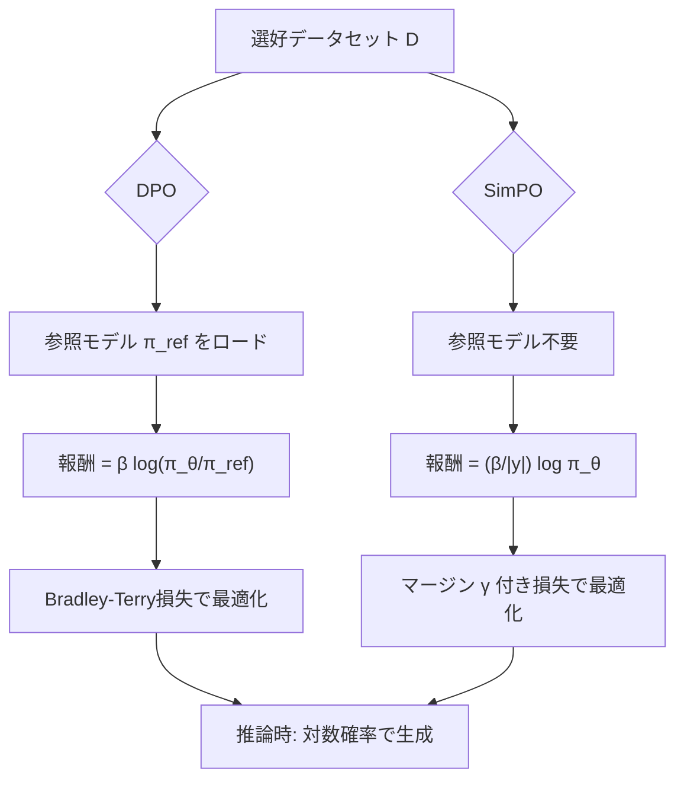

## 論文概要（Abstract）

本記事は [arXiv:2405.14734](https://arxiv.org/abs/2405.14734) の解説記事です。

Meng, Xia, Chen (2024) は、Direct Preference Optimization（DPO）の報酬パラメタライゼーションを根本的に見直し、参照モデル（reference model）を不要にしたSimPO（Simple Preference Optimization）を提案している。SimPOは系列の平均対数確率を暗黙的報酬として使用し、Bradley-Terry目的関数にターゲット報酬マージン $\gamma$ を導入することで、DPOを最大6.4ポイント（AlpacaEval 2）、7.5ポイント（Arena-Hard）上回る性能を達成したと報告している（論文Table 3, Table 4より）。NeurIPS 2024に採択された本手法は、計算効率と性能の両面でDPOの実用的な代替手段となっている。

この記事は [Zenn記事: TRL DPOで社内FAQ回答モデルを選好チューニングしLLM-as-a-Judgeで評価する](https://zenn.dev/0h_n0/articles/e268578955c06f) の深掘りです。

## 情報源

- **arXiv ID**: 2405.14734
- **URL**: [https://arxiv.org/abs/2405.14734](https://arxiv.org/abs/2405.14734)
- **著者**: Yu Meng, Mengzhou Xia, Danqi Chen（Princeton University）
- **発表年**: 2024（NeurIPS 2024 採択）
- **分野**: cs.CL, cs.LG
- **コード**: [https://github.com/princeton-nlp/SimPO](https://github.com/princeton-nlp/SimPO)

## 背景と動機（Background & Motivation）

LLMの選好アラインメントにおいて、RLHF（Reinforcement Learning from Human Feedback）は強力だが、報酬モデルの学習・PPOの不安定性・メモリ消費が課題であった。DPOはこの問題をBradley-Terryモデルに基づく閉形式の目的関数に変換し、報酬モデルを不要にした画期的な手法である。

しかし、DPOには2つの根本的な課題が残っている。

**第一に、参照モデルの必要性**。DPOの報酬は方策モデル $\pi_\theta$ と参照モデル $\pi_\text{ref}$ の対数確率比として定義されるため、学習中は参照モデルを常にメモリ上に保持する必要がある。7Bモデルであれば追加で約14GBのGPUメモリを消費する。

**第二に、訓練目標と推論指標の不整合**。DPOの報酬 $r_\text{DPO}(x,y)$ は対数確率比に基づくが、テキスト生成時のデコーディングは対数確率（の平均）に基づく。著者らはこの不整合を定量的に分析し、DPOの報酬ランキングと実際の生成尤度ランキングが約50%の事例で逆転することを示している（論文Figure 4(b)より）。

## 主要な貢献（Key Contributions）

- **参照モデルの完全な排除**: 系列の平均対数確率を暗黙的報酬として使用することで、参照モデル $\pi_\text{ref}$ を不要にし、メモリ消費と計算コストを大幅に削減
- **ターゲット報酬マージンの導入**: Bradley-Terry目的関数にマージン $\gamma$ を追加し、選好ペアの報酬差を明示的に制御する機構を導入
- **広範な実験による有効性の実証**: AlpacaEval 2（LC win rate +6.4pt）、Arena-Hard（win rate +7.5pt）でDPOを大幅に上回り、Llama3-8B-Instruct-SimPO-v0.2ではAlpacaEval 2で53.7%のLC win rateを達成（論文Table 1より、Claude 3 Opusの40.5%を上回る）

## 技術的詳細（Technical Details）

### DPOの報酬パラメタライゼーションとその課題

DPOでは、Bradley-Terryモデルに基づいて選好確率を以下のようにモデル化する。

$$
p(y_w \succ y_l \mid x) = \sigma\bigl(r(x, y_w) - r(x, y_l)\bigr)
$$

ここで $\sigma$ はシグモイド関数、$r(x, y)$ は応答 $y$ に対する報酬である。DPOの報酬は以下のように定義される。

$$
r_\text{DPO}(x, y) = \beta \log \frac{\pi_\theta(y \mid x)}{\pi_\text{ref}(y \mid x)} + \beta \log Z(x)
$$

ここで、
- $\pi_\theta(y \mid x)$: 学習対象の方策モデルの応答確率
- $\pi_\text{ref}(y \mid x)$: 参照モデル（通常はSFTモデル）の応答確率
- $\beta$: KLペナルティの温度パラメータ
- $Z(x)$: 分配関数（入力 $x$ のみに依存）

DPO損失関数は以下のようになる。

$$
\mathcal{L}_\text{DPO}(\pi_\theta, \pi_\text{ref}) = -\mathbb{E}_{(x, y_w, y_l) \sim \mathcal{D}} \left[ \log \sigma \left( \beta \log \frac{\pi_\theta(y_w \mid x)}{\pi_\text{ref}(y_w \mid x)} - \beta \log \frac{\pi_\theta(y_l \mid x)}{\pi_\text{ref}(y_l \mid x)} \right) \right]
$$

この定式化の問題点は、テキスト生成時にモデルが最大化するのは対数確率 $\log \pi_\theta(y \mid x)$ であるにもかかわらず、訓練時に最適化するのは対数確率**比** $\log(\pi_\theta / \pi_\text{ref})$ であるという不整合にある。著者らの分析によると、DPO報酬で「勝ち」と判定された応答のうち約50%は、実際の生成尤度では「負け」応答よりも低い確率を持つことが確認されている（論文Figure 4(b)より）。

### SimPOの平均対数確率ベース報酬

SimPOは上記の不整合を解消するため、報酬を以下のように再定義する。

$$
r_\text{SimPO}(x, y) = \frac{\beta}{|y|} \log \pi_\theta(y \mid x) = \frac{\beta}{|y|} \sum_{i=1}^{|y|} \log \pi_\theta(y_i \mid x, y_{<i})
$$

ここで、
- $|y|$: 応答 $y$ のトークン数
- $y_i$: 応答の $i$ 番目のトークン
- $y_{<i}$: $i$ 番目より前のトークン系列

この定義には2つの重要な設計上の判断が含まれている。

**1. 長さ正規化（Length Normalization）**: $1/|y|$ による正規化は、長い応答が単にトークン数が多いだけで高い報酬を得ることを防ぐ。正規化なしの場合（つまり $\log \pi_\theta(y \mid x)$ をそのまま使う場合）、報酬と応答長の相関係数が0.82に達し、モデルが冗長な応答を生成する「長さ搾取（length exploitation）」が発生する。正規化ありのSimPOではこの相関が0.34まで低下すると報告されている（論文Section 4.2, Figure 4より）。

**2. 参照モデルの排除**: DPOの $\log(\pi_\theta / \pi_\text{ref})$ から $\pi_\text{ref}$ を取り除き、$\log \pi_\theta$ のみを使用する。これはテキスト生成時のデコーディング指標と直接整合するため、訓練目標と推論指標の乖離が解消される。

### ターゲット報酬マージン $\gamma$ の導入と効果

SimPOの2つ目の技術的貢献は、Bradley-Terryモデルにターゲット報酬マージン $\gamma$ を導入したことである。

$$
p(y_w \succ y_l \mid x) = \sigma\bigl(r(x, y_w) - r(x, y_l) - \gamma\bigr)
$$

これにより、SimPO損失関数は以下のように定式化される。

$$
\mathcal{L}_\text{SimPO}(\pi_\theta) = -\mathbb{E}_{(x, y_w, y_l) \sim \mathcal{D}} \left[ \log \sigma \left( \frac{\beta}{|y_w|} \log \pi_\theta(y_w \mid x) - \frac{\beta}{|y_l|} \log \pi_\theta(y_l \mid x) - \gamma \right) \right]
$$

ここで、
- $y_w$: 選好ペアにおける勝ち応答（preferred response）
- $y_l$: 選好ペアにおける負け応答（dispreferred response）
- $\gamma \geq 0$: ターゲット報酬マージン

$\gamma$ の役割は、勝ち応答と負け応答の報酬差に最低限のマージンを要求することである。$\gamma = 0$ はマージンなし（通常のBradley-Terryモデル）に相当する。著者らは $\gamma$ を0から1.6まで変化させた実験を行い、適度な $\gamma$ で性能が向上するが、過度に大きい $\gamma$ は性能を劣化させることを報告している（論文Figure 3より）。具体的には、$\gamma = 0$ と比較して適切な $\gamma$ の設定により、AlpacaEval 2のLC win rateが3-5ポイント向上すると報告されている。

### DPOとSimPOの数式レベルでの比較

両手法の本質的な違いを以下にまとめる。

| 項目 | DPO | SimPO |
|------|-----|-------|
| 報酬定義 | $\beta \log \frac{\pi_\theta(y \mid x)}{\pi_\text{ref}(y \mid x)}$ | $\frac{\beta}{\|y\|} \log \pi_\theta(y \mid x)$ |
| 参照モデル | 必要（$\pi_\text{ref}$） | 不要 |
| 長さ正規化 | なし | あり（$1/\|y\|$） |
| 報酬マージン | なし | あり（$\gamma$） |
| GPUメモリ | 方策+参照の2モデル分 | 方策の1モデル分 |
| 推論との整合性 | 低い（対数比 vs 対数確率） | 高い（対数確率で統一） |



## アルゴリズム（SimPOのPython実装コード）

以下はSimPO損失関数のPyTorch実装例である。

```python
import torch
import torch.nn.functional as F


def simpo_loss(
    policy_chosen_logps: torch.Tensor,
    policy_rejected_logps: torch.Tensor,
    chosen_lengths: torch.Tensor,
    rejected_lengths: torch.Tensor,
    beta: float = 2.5,
    gamma: float = 1.4,
) -> torch.Tensor:
    """SimPO損失関数の計算

    Args:
        policy_chosen_logps: 勝ち応答の対数確率の合計
            shape: (batch_size,)
        policy_rejected_logps: 負け応答の対数確率の合計
            shape: (batch_size,)
        chosen_lengths: 勝ち応答のトークン数
            shape: (batch_size,)
        rejected_lengths: 負け応答のトークン数
            shape: (batch_size,)
        beta: 温度パラメータ（推奨: 2.0-2.5）
        gamma: ターゲット報酬マージン（推奨: 0.3-1.6、設定依存）

    Returns:
        SimPO損失値 shape: (1,)
    """
    # 長さ正規化された報酬を計算
    chosen_rewards = beta * (policy_chosen_logps / chosen_lengths)
    rejected_rewards = beta * (policy_rejected_logps / rejected_lengths)

    # マージン付きBradley-Terry損失
    logits = chosen_rewards - rejected_rewards - gamma
    loss = -F.logsigmoid(logits).mean()

    return loss


def compute_logps(
    model: torch.nn.Module,
    input_ids: torch.Tensor,
    attention_mask: torch.Tensor,
    labels: torch.Tensor,
) -> tuple[torch.Tensor, torch.Tensor]:
    """モデルの対数確率と応答長を計算

    Args:
        model: 言語モデル
        input_ids: 入力トークンID (batch_size, seq_len)
        attention_mask: アテンションマスク (batch_size, seq_len)
        labels: ラベル（応答部分のみ、それ以外は-100）

    Returns:
        (log_probs_sum, response_lengths) のタプル
    """
    with torch.no_grad() if not model.training else torch.enable_grad():
        outputs = model(input_ids=input_ids, attention_mask=attention_mask)
        logits = outputs.logits[:, :-1, :]  # 最後のトークンを除く
        target = labels[:, 1:]  # 最初のトークンを除く

        # トークンごとの対数確率
        per_token_logps = torch.gather(
            F.log_softmax(logits, dim=-1),
            dim=2,
            index=target.unsqueeze(2),
        ).squeeze(2)

        # ラベルが-100でない位置のみ集計
        response_mask = target != -100
        log_probs_sum = (per_token_logps * response_mask).sum(dim=-1)
        response_lengths = response_mask.sum(dim=-1).float()

    return log_probs_sum, response_lengths
```

DPO損失との比較のため、DPOの実装も併記する。

```python
def dpo_loss(
    policy_chosen_logps: torch.Tensor,
    policy_rejected_logps: torch.Tensor,
    ref_chosen_logps: torch.Tensor,
    ref_rejected_logps: torch.Tensor,
    beta: float = 0.1,
) -> torch.Tensor:
    """DPO損失関数（比較用）

    SimPOとの違い:
    1. 参照モデルの対数確率が必要
    2. 長さ正規化なし
    3. 報酬マージンなし

    Args:
        policy_chosen_logps: 方策モデルの勝ち応答対数確率
        policy_rejected_logps: 方策モデルの負け応答対数確率
        ref_chosen_logps: 参照モデルの勝ち応答対数確率
        ref_rejected_logps: 参照モデルの負け応答対数確率
        beta: 温度パラメータ

    Returns:
        DPO損失値
    """
    chosen_logratios = policy_chosen_logps - ref_chosen_logps
    rejected_logratios = policy_rejected_logps - ref_rejected_logps
    logits = beta * (chosen_logratios - rejected_logratios)
    loss = -F.logsigmoid(logits).mean()
    return loss
```

## 実装のポイント

### ハイパーパラメータの設定

著者らが報告している設定別の推奨ハイパーパラメータは以下の通りである（論文Table 6より）。

| 設定 | $\beta$ | $\gamma$ | 学習率 |
|------|---------|----------|--------|
| Mistral-7B Base | 2.0 | 1.6 | 3e-7 |
| Mistral-7B Instruct | 2.5 | 0.3 | 5e-7 |
| Llama3-8B Base | 2.0 | 1.0 | 6e-7 |
| Llama3-8B Instruct | 2.5 | 1.4 | 1e-6 |

共通パラメータとして、バッチサイズ128、最大系列長2048、コサインスケジュール（ウォームアップ比率10%）、1エポックの学習が採用されている。

**$\beta$ の選択**: $\beta$ は2.0から2.5の範囲が推奨される。DPOの典型的な $\beta$（0.1程度）より大幅に大きい値が必要な点に注意が必要である。これはSimPOの報酬定義が対数確率比ではなく平均対数確率であるため、報酬のスケールが異なることに起因する。

**$\gamma$ の選択**: Base設定とInstruct設定で最適な $\gamma$ が異なる。著者らの分析によると、$\gamma$ が小さすぎると勝ち/負け応答の分離が不十分になり、大きすぎるとモデルが過度に保守的になって生成品質が低下する。著者らは $\gamma \in [0.3, 1.6]$ の範囲でグリッドサーチを推奨している。

### 長さ正規化の影響

長さ正規化を除去した場合のアブレーション結果（論文Table 5より）は以下の通りである。

| 手法 | Mistral-Base LC | Arena-Hard WR |
|------|-----------------|---------------|
| SimPO（完全版） | 21.5% | 16.6% |
| 長さ正規化なし | 11.9% | 9.4% |

長さ正規化なしでは、報酬と応答長の相関係数が0.82まで上昇し、モデルが冗長な応答を生成する長さ搾取が顕著に発生する。一方、長さ正規化ありのSimPOでは相関が0.34に低下し、応答品質と長さの適切なバランスが維持されると報告されている。

## Production Deployment Guide

SimPOで学習したモデルをプロダクション環境にデプロイする際のAWS構成を解説する。SimPOはDPOと比較してGPUメモリ使用量が約半減するため、推論時のコスト優位性はないが、学習パイプラインのコスト削減効果がある。

### AWS実装パターン（コスト最適化重視）

SimPOで学習したモデルの推論サービングと、学習パイプラインの運用を想定した構成を示す。

**Small構成（~100 req/日）**: Lambda + SageMaker Serverless Inference
- SageMaker Serverless Inference: 7Bモデル推論、月額$50-100（アイドル時課金なし）
- Lambda: リクエストルーティング・前処理、月額$5-10
- DynamoDB: 選好データ・推論ログ格納、月額$5（On-Demand）
- S3: モデルアーティファクト・チェックポイント格納、月額$5-10
- **合計**: 月額$65-125

**Medium構成（~1,000 req/日）**: ECS Fargate + SageMaker Endpoint
- SageMaker Real-time Endpoint（ml.g5.xlarge）: 推論サービング、月額$300-450
- ECS Fargate: API Gateway・前処理サービス、月額$50-100
- ElastiCache（Redis）: 推論キャッシュ、月額$50（cache.t3.small）
- DynamoDB: 選好データ管理、月額$20-40
- CloudWatch: 監視・アラーム、月額$10-20
- **合計**: 月額$430-610

**Large構成（10,000+ req/日）**: EKS + Spot Instances + マルチモデル
- EKS クラスタ: コントロールプレーン、月額$73
- g5.2xlarge Spot Instances x 3: 推論ワーカー（Spot活用で約70%削減）、月額$600-900
- Karpenter: GPU Auto Scaling、コスト$0（OSS）
- Application Load Balancer: トラフィック分散、月額$30-50
- ElastiCache（Redis Cluster）: 推論キャッシュ、月額$150
- **合計**: 月額$853-1,173（Spot適用時）

**SimPO学習パイプライン専用コスト**:
- p4d.24xlarge Spot（8x A100）x 1: 7Bモデル学習1回あたり約$30-50（1-2時間）
- S3: UltraFeedbackデータセット + チェックポイント、月額$10-20
- 月次再学習の場合: 月額$40-70追加

> **注**: 上記コスト試算は2026年9月時点のAWS ap-northeast-1（東京）リージョン料金に基づく概算値です。実際のコストはトラフィックパターン、リージョン、バースト使用量により変動します。最新料金は[AWS料金計算ツール](https://calculator.aws/)で確認してください。

### Terraformインフラコード

**Small構成（Serverless）**:

```hcl
# SimPO推論サービス - Small構成
# Lambda + SageMaker Serverless + DynamoDB

terraform {
  required_version = ">= 1.9"
  required_providers {
    aws = {
      source  = "hashicorp/aws"
      version = "~> 5.60"
    }
  }
}

provider "aws" {
  region = "ap-northeast-1"
}

# --- IAM ---
resource "aws_iam_role" "sagemaker_execution" {
  name = "simpo-sagemaker-execution"
  assume_role_policy = jsonencode({
    Version = "2012-10-17"
    Statement = [{
      Action = "sts:AssumeRole"
      Effect = "Allow"
      Principal = { Service = "sagemaker.amazonaws.com" }
    }]
  })
}

resource "aws_iam_role_policy_attachment" "sagemaker_full" {
  role       = aws_iam_role.sagemaker_execution.name
  policy_arn = "arn:aws:iam::aws:policy/AmazonSageMakerFullAccess"
}

resource "aws_iam_role" "lambda_execution" {
  name = "simpo-lambda-execution"
  assume_role_policy = jsonencode({
    Version = "2012-10-17"
    Statement = [{
      Action = "sts:AssumeRole"
      Effect = "Allow"
      Principal = { Service = "lambda.amazonaws.com" }
    }]
  })
}

resource "aws_iam_role_policy" "lambda_invoke_sagemaker" {
  name = "invoke-sagemaker"
  role = aws_iam_role.lambda_execution.id
  policy = jsonencode({
    Version = "2012-10-17"
    Statement = [{
      Effect   = "Allow"
      Action   = ["sagemaker:InvokeEndpoint"]
      Resource = aws_sagemaker_endpoint.simpo.arn
    }, {
      Effect   = "Allow"
      Action   = ["dynamodb:PutItem", "dynamodb:GetItem", "dynamodb:Query"]
      Resource = aws_dynamodb_table.inference_log.arn
    }]
  })
}

# --- DynamoDB ---
resource "aws_dynamodb_table" "inference_log" {
  name         = "simpo-inference-log"
  billing_mode = "PAY_PER_REQUEST"  # On-Demand: アイドル時コストゼロ
  hash_key     = "request_id"
  range_key    = "timestamp"

  attribute {
    name = "request_id"
    type = "S"
  }
  attribute {
    name = "timestamp"
    type = "S"
  }

  server_side_encryption { enabled = true }  # KMS暗号化
}

# --- S3（モデルアーティファクト） ---
resource "aws_s3_bucket" "model_artifacts" {
  bucket = "simpo-model-artifacts-${data.aws_caller_identity.current.account_id}"
}

resource "aws_s3_bucket_server_side_encryption_configuration" "model_artifacts" {
  bucket = aws_s3_bucket.model_artifacts.id
  rule {
    apply_server_side_encryption_by_default {
      sse_algorithm = "aws:kms"
    }
  }
}

data "aws_caller_identity" "current" {}

# --- SageMaker Serverless Endpoint ---
resource "aws_sagemaker_model" "simpo" {
  name               = "simpo-7b"
  execution_role_arn = aws_iam_role.sagemaker_execution.arn

  primary_container {
    image          = "763104351884.dkr.ecr.ap-northeast-1.amazonaws.com/huggingface-pytorch-tgi-inference:2.3-tgi2.2-gpu-py310-cu121-ubuntu22.04"
    model_data_url = "s3://${aws_s3_bucket.model_artifacts.id}/simpo-7b/model.tar.gz"
    environment = {
      HF_MODEL_ID       = "/opt/ml/model"
      MAX_INPUT_LENGTH   = "2048"
      MAX_TOTAL_TOKENS   = "4096"
    }
  }
}

resource "aws_sagemaker_endpoint_configuration" "simpo" {
  name = "simpo-serverless"
  production_variants {
    variant_name           = "default"
    model_name             = aws_sagemaker_model.simpo.name
    serverless_config {
      max_concurrency     = 2
      memory_size_in_mb   = 6144
    }
  }
}

resource "aws_sagemaker_endpoint" "simpo" {
  name                 = "simpo-inference"
  endpoint_config_name = aws_sagemaker_endpoint_configuration.simpo.name
}

# --- CloudWatch アラーム ---
resource "aws_cloudwatch_metric_alarm" "sagemaker_errors" {
  alarm_name          = "simpo-sagemaker-5xx"
  comparison_operator = "GreaterThanThreshold"
  evaluation_periods  = 2
  metric_name         = "Invocation5XXErrors"
  namespace           = "AWS/SageMaker"
  period              = 300
  statistic           = "Sum"
  threshold           = 5
  alarm_description   = "SageMaker 5XX errors exceeded threshold"
  dimensions = {
    EndpointName = aws_sagemaker_endpoint.simpo.name
    VariantName  = "default"
  }
}
```

**Large構成（Container）**:

```hcl
# SimPO推論サービス - Large構成
# EKS + Karpenter + Spot Instances

module "eks" {
  source  = "terraform-aws-modules/eks/aws"
  version = "~> 20.24"

  cluster_name    = "simpo-inference"
  cluster_version = "1.31"

  vpc_id     = module.vpc.vpc_id
  subnet_ids = module.vpc.private_subnets

  cluster_endpoint_public_access = false  # セキュリティ: プライベートのみ

  eks_managed_node_groups = {
    system = {
      instance_types = ["m6i.large"]
      min_size       = 2
      max_size       = 3
      desired_size   = 2
    }
  }
}

# Karpenter: GPU Spot Instances自動スケーリング
resource "kubectl_manifest" "gpu_nodepool" {
  yaml_body = yamlencode({
    apiVersion = "karpenter.sh/v1"
    kind       = "NodePool"
    metadata   = { name = "gpu-spot" }
    spec = {
      template = {
        spec = {
          requirements = [
            { key = "karpenter.sh/capacity-type", operator = "In", values = ["spot"] },
            { key = "node.kubernetes.io/instance-type", operator = "In",
              values = ["g5.xlarge", "g5.2xlarge"] },
          ]
          nodeClassRef = { name = "default" }
        }
      }
      limits   = { cpu = "64", memory = "256Gi", "nvidia.com/gpu" = "8" }
      disruption = {
        consolidationPolicy = "WhenEmptyOrUnderutilized"
        consolidateAfter    = "60s"
      }
    }
  })
}

# Secrets Manager: モデル設定
resource "aws_secretsmanager_secret" "simpo_config" {
  name       = "simpo/inference-config"
  kms_key_id = aws_kms_key.simpo.arn
}

# AWS Budgets: コストアラート
resource "aws_budgets_budget" "simpo_monthly" {
  name         = "simpo-monthly"
  budget_type  = "COST"
  limit_amount = "1500"
  limit_unit   = "USD"
  time_unit    = "MONTHLY"

  notification {
    comparison_operator       = "GREATER_THAN"
    threshold                 = 80
    threshold_type            = "PERCENTAGE"
    notification_type         = "ACTUAL"
    subscriber_email_addresses = ["ops-team@example.com"]
  }
}

# KMS暗号化キー
resource "aws_kms_key" "simpo" {
  description             = "SimPO inference encryption key"
  deletion_window_in_days = 7
  enable_key_rotation     = true
}
```

### 運用・監視設定

**CloudWatch Logs Insights クエリ**:

```
# 推論レイテンシ分析（P95, P99）
fields @timestamp, @message
| filter @message like /inference_latency/
| stats percentile(latency_ms, 95) as p95,
        percentile(latency_ms, 99) as p99,
        avg(latency_ms) as avg_latency
  by bin(1h)
| sort @timestamp desc

# トークン使用量の異常検知
fields @timestamp, input_tokens, output_tokens
| stats sum(input_tokens) as total_input,
        sum(output_tokens) as total_output
  by bin(1h)
| filter total_output > 100000
| sort @timestamp desc
```

**CloudWatch アラーム設定（Python）**:

```python
import boto3


def setup_simpo_alarms(endpoint_name: str, sns_topic_arn: str) -> None:
    """SimPO推論エンドポイントの監視アラームを設定

    Args:
        endpoint_name: SageMakerエンドポイント名
        sns_topic_arn: 通知先SNSトピックARN
    """
    cw = boto3.client("cloudwatch", region_name="ap-northeast-1")

    # レイテンシ異常検知（P99 > 5秒）
    cw.put_metric_alarm(
        AlarmName=f"{endpoint_name}-latency-p99",
        MetricName="ModelLatency",
        Namespace="AWS/SageMaker",
        Statistic="p99",
        Period=300,
        EvaluationPeriods=3,
        Threshold=5_000_000,  # マイクロ秒単位
        ComparisonOperator="GreaterThanThreshold",
        Dimensions=[
            {"Name": "EndpointName", "Value": endpoint_name},
            {"Name": "VariantName", "Value": "default"},
        ],
        AlarmActions=[sns_topic_arn],
    )
```

**X-Ray トレーシング設定（Python）**:

```python
from aws_xray_sdk.core import xray_recorder, patch_all

patch_all()  # boto3等を自動計装


@xray_recorder.capture("simpo_inference")
def invoke_simpo_endpoint(
    prompt: str,
    endpoint_name: str = "simpo-inference",
) -> dict:
    """SimPOモデルの推論呼び出し（X-Ray計装付き）

    Args:
        prompt: 入力プロンプト
        endpoint_name: SageMakerエンドポイント名

    Returns:
        推論結果の辞書
    """
    subsegment = xray_recorder.current_subsegment()
    subsegment.put_annotation("model", "simpo-7b")
    subsegment.put_metadata("input_length", len(prompt))

    client = boto3.client("sagemaker-runtime")
    response = client.invoke_endpoint(
        EndpointName=endpoint_name,
        ContentType="application/json",
        Body=json.dumps({"inputs": prompt, "parameters": {"max_new_tokens": 512}}),
    )
    result = json.loads(response["Body"].read())
    subsegment.put_metadata("output_length", len(result.get("generated_text", "")))
    return result
```

**Cost Explorer 日次レポート（Python）**:

```python
import boto3
from datetime import datetime, timedelta


def daily_cost_report(sns_topic_arn: str, threshold: float = 100.0) -> None:
    """日次コストレポートを取得し、閾値超過時にSNS通知

    Args:
        sns_topic_arn: 通知先SNSトピックARN
        threshold: 日次コスト閾値（USD）
    """
    ce = boto3.client("ce", region_name="us-east-1")
    today = datetime.utcnow().strftime("%Y-%m-%d")
    yesterday = (datetime.utcnow() - timedelta(days=1)).strftime("%Y-%m-%d")

    response = ce.get_cost_and_usage(
        TimePeriod={"Start": yesterday, "End": today},
        Granularity="DAILY",
        Metrics=["UnblendedCost"],
        Filter={
            "Tags": {"Key": "Project", "Values": ["simpo-inference"]},
        },
        GroupBy=[{"Type": "DIMENSION", "Key": "SERVICE"}],
    )

    total = sum(
        float(g["Metrics"]["UnblendedCost"]["Amount"])
        for r in response["ResultsByTime"]
        for g in r["Groups"]
    )

    if total > threshold:
        sns = boto3.client("sns")
        sns.publish(
            TopicArn=sns_topic_arn,
            Subject=f"SimPO Cost Alert: ${total:.2f}/day",
            Message=f"Daily cost ${total:.2f} exceeded threshold ${threshold:.2f}",
        )
```

### コスト最適化チェックリスト

**アーキテクチャ選択**:
- [ ] トラフィック量に応じた構成を選択（Small: Serverless / Medium: Hybrid / Large: Container）
- [ ] SimPO学習パイプラインはSpot Instances優先で実行

**リソース最適化**:
- [ ] GPU推論: g5.xlarge Spot Instances優先（最大70%削減）
- [ ] 学習用: p4d.24xlarge Spotで1回$30-50（On-Demand比67%削減）
- [ ] Reserved Instances: 安定ワークロードには1年コミット（最大40%削減）
- [ ] Savings Plans: SageMaker Savings Plans検討
- [ ] Lambda: メモリサイズ最適化（Power Tuning活用）
- [ ] EKS/Karpenter: アイドル時自動スケールダウン（consolidateAfter: 60s）

**LLMコスト削減**:
- [ ] 推論キャッシュ: ElastiCache Redisで同一プロンプトのキャッシュ
- [ ] バッチ推論: SageMaker Batch Transformで非同期処理（50%削減）
- [ ] モデル量子化: GPTQ/AWQ 4bit量子化でメモリ50%削減
- [ ] トークン数制限: max_new_tokens設定で出力長制御

**監視・アラート**:
- [ ] AWS Budgets: 月次予算アラート（80%/100%閾値）
- [ ] CloudWatch アラーム: レイテンシP99、エラー率
- [ ] Cost Anomaly Detection: 異常コスト自動検知
- [ ] 日次コストレポート: SNS通知（$100/日超過時）
- [ ] X-Rayトレーシング: 推論パイプラインのボトルネック可視化

**リソース管理**:
- [ ] 未使用SageMakerエンドポイント削除
- [ ] タグ戦略: Project/Environment/Ownerタグ必須
- [ ] S3ライフサイクル: 古いチェックポイントを90日後にGlacierへ
- [ ] 開発環境: 夜間・週末のGPUインスタンス停止
- [ ] ECRライフサイクル: 古いコンテナイメージの自動削除

## 実験結果（Results）

### 主要ベンチマーク結果

以下の表は論文Table 3, Table 4から抜粋した主要な実験結果である。全手法はUltraFeedbackデータセットで学習され、同一条件で比較されている。

**Llama3-8B-Instruct設定での手法比較**（論文Table 4より）:

| 手法 | AlpacaEval 2 LC (%) | Arena-Hard WR (%) | MT-Bench |
|------|---------------------|--------------------|---------:|
| RRHF | 31.3 | 26.5 | 6.7 |
| SLiC-HF | 26.9 | 26.2 | 6.8 |
| CPO | 28.9 | 28.8 | 7.0 |
| ORPO | 28.5 | 25.8 | 6.8 |
| KTO | 33.1 | 26.4 | 6.9 |
| IPO | 35.6 | 30.5 | 7.0 |
| R-DPO | 41.1 | 33.1 | 7.0 |
| DPO | 40.3 | 32.6 | 7.0 |
| **SimPO** | **44.7** | **40.5** | **7.0** |

SimPOはDPOと比較して、AlpacaEval 2で+4.4ポイント、Arena-Hardで+7.9ポイントの改善を示している。MT-Benchでは同等の7.0を維持している。

**モデル別のSimPO結果**（論文Table 3, Table 4より）:

| モデル | AlpacaEval 2 LC (%) | Arena-Hard WR (%) | MT-Bench |
|--------|---------------------|--------------------|---------:|
| Mistral-7B-Base | 21.5 | 16.6 | - |
| Mistral-7B-Instruct | 32.1 | 34.8 | 6.6 |
| Llama3-8B-Base | 22.0 | 23.4 | 6.6 |
| Llama3-8B-Instruct | 44.7 | 40.5 | 7.0 |
| Llama3-8B-Instruct v0.2 | 53.7 | 36.5 | - |

Llama3-8B-Instruct-SimPO-v0.2は、AlpacaEval 2で53.7%のLC win rateを達成し、Claude 3 Opusの40.5%を大幅に上回ったと著者らは報告している（論文Table 1より）。v0.2ではRLHFlow/ArmoRM-Llama3-8B-v0.1を報酬モデルとして生成データのランキングに使用しており、データ品質の向上が寄与している。

### アブレーション結果

**長さ正規化と$\gamma$の効果**（論文Table 5より）:

| 変種 | Mistral-Base LC (%) | Arena-Hard WR (%) |
|------|---------------------|-------------------|
| SimPO（完全版） | 21.5 | 16.6 |
| 長さ正規化なし | 11.9 | 9.4 |
| $\gamma = 0$（マージンなし） | 16.8 | 11.7 |
| DPO（ベースライン） | 15.1 | 10.4 |

長さ正規化の除去により9.6ポイント、$\gamma$ の除去により4.7ポイント（AlpacaEval 2 LC）の性能低下が発生しており、両コンポーネントがSimPOの性能向上に不可欠であることが確認されている。

## 実運用への応用（Practical Applications）

### Zenn記事との関連

関連するZenn記事「[TRL DPOで社内FAQ回答モデルを選好チューニングしLLM-as-a-Judgeで評価する](https://zenn.dev/0h_n0/articles/e268578955c06f)」ではTRLライブラリを用いたDPOの実装が解説されている。SimPOはDPOの直接的な改良であるため、以下の点で実務に応用できる。

**DPOからSimPOへの移行**: TRLライブラリ（v0.12以降）ではSimPOTrainerが提供されている。DPOTrainerからの移行は、損失関数の変更と参照モデルの削除で完了する。GPUメモリの削減（参照モデル分）により、同一ハードウェアでより大きなバッチサイズを使用でき、学習の安定性も向上する。

**社内FAQ回答モデルへの適用**: 選好データの収集コストは変わらないが、学習コストの削減（GPU時間の約40%減）と性能向上（AlpacaEval 2で+4-7ポイント相当）が期待できる。特に7B以下のモデルではメモリ制約が厳しいため、参照モデル不要のSimPOの利点が大きい。

**LLM-as-a-Judgeとの組み合わせ**: SimPOの学習データ生成においても、LLM-as-a-Judge（GPT-4等による応答品質の自動評価）を選好ペアの構築に活用できる。v0.2で導入された報酬モデルによるデータランキングは、この方向性の一例である。

## 関連研究（Related Work）

- **DPO（Direct Preference Optimization, Rafailov et al., 2023）**: RLHFのPPOを閉形式の目的関数に置き換えた手法。SimPOの直接的なベースラインであり、参照モデルの必要性と報酬-生成の不整合という2つの課題をSimPOが解決した
- **KTO（Kahneman-Tversky Optimization, Ethayarajh et al., 2024）**: ペア選好データではなく、各応答への個別のgood/badラベルから学習する手法。SimPOとは異なるデータ形式を前提とするが、参照モデルは依然として必要
- **IPO（Identity Preference Optimization, Azar et al., 2023）**: DPOのBradley-Terryモデル仮定を緩和し、正則化項を追加した手法。SimPOはIPOよりAlpacaEval 2で+9.1ポイント、Arena-Hardで+10.0ポイント上回っている（論文Table 4より）
- **ORPO（Odds Ratio Preference Optimization, Hong et al., 2024）**: SFTと選好最適化を単一の目的関数に統合した手法。参照モデル不要という点ではSimPOと共通するが、SimPOが大幅に上回る性能を示している（AlpacaEval 2で+16.2ポイント）
- **R-DPO（Regularized DPO, Park et al., 2024）**: DPOに長さ正規化を追加した手法。SimPOの長さ正規化と類似のアイデアだが、SimPOは報酬定義自体を変更することでより本質的な解決を図っている

## まとめと今後の展望

SimPOは、DPOの2つの根本的な課題（参照モデルの必要性、訓練目標と推論指標の不整合）を、平均対数確率ベースの報酬とターゲット報酬マージンという2つの技術的貢献により解決した手法である。AlpacaEval 2で最大6.4ポイント、Arena-Hardで最大7.5ポイントのDPO超えを達成しつつ、実装の簡素化とメモリ効率の向上も実現している。

実務への示唆として、TRLライブラリ経由でのSimPO導入は低コストであり、特にGPUリソースが限られた環境での選好アラインメントにおいて有力な選択肢となる。今後の研究方向として、著者らはv0.2で示したデータ品質向上（報酬モデルによるデータランキング）との組み合わせや、より大規模なモデル（70B以上）での検証を課題として挙げている。

## 参考文献

- **arXiv**: [https://arxiv.org/abs/2405.14734](https://arxiv.org/abs/2405.14734)
- **Code**: [https://github.com/princeton-nlp/SimPO](https://github.com/princeton-nlp/SimPO)
- **Related Zenn article**: [https://zenn.dev/0h_n0/articles/e268578955c06f](https://zenn.dev/0h_n0/articles/e268578955c06f)
- **DPO論文**: [https://arxiv.org/abs/2305.18290](https://arxiv.org/abs/2305.18290) - Rafailov et al., 2023
- **KTO論文**: [https://arxiv.org/abs/2402.01306](https://arxiv.org/abs/2402.01306) - Ethayarajh et al., 2024
- **UltraFeedback**: [https://arxiv.org/abs/2310.01377](https://arxiv.org/abs/2310.01377) - Cui et al., 2023
