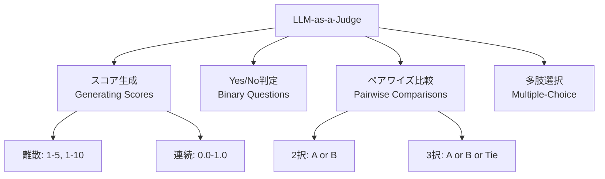
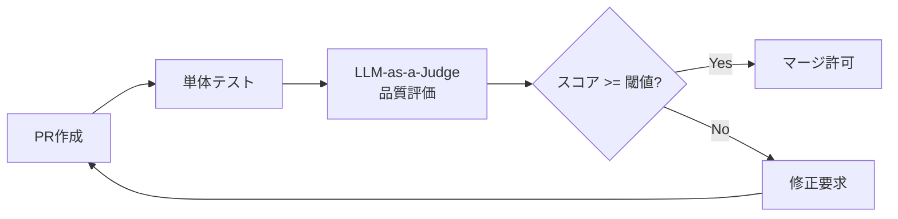

本記事は [https://arxiv.org/abs/2411.15594](https://arxiv.org/abs/2411.15594) の解説記事です。

## 論文概要（Abstract）

LLMを評価者（Judge）として活用するシステムの信頼性向上を体系的に整理したサーベイ論文である。著者らは、LLM-as-a-Judgeの評価手法を4つのカテゴリ（スコア生成、Yes/No判定、ペアワイズ比較、多肢選択）に分類し、位置バイアス・冗長性バイアス・自己強化バイアスなど複数のバイアスを体系化している。さらに、プロンプト設計・データレベル介入・評価集約の3段階でバイアス軽減手法を整理し、信頼性メトリクスとベンチマークを包括的にまとめている。

この記事は [Zenn記事: TRL DPOで社内FAQ回答モデルを選好チューニングしLLM-as-a-Judgeで評価する](https://zenn.dev/0h_n0/articles/e268578955c06f) の深掘りです。

## 情報源

- **arXiv ID**: 2411.15594
- **URL**: [https://arxiv.org/abs/2411.15594](https://arxiv.org/abs/2411.15594)
- **著者**: Jiawei Gu, Xuhui Jiang, Zhichao Shi, et al.
- **発表年**: 2024（v6: 2025年10月更新）
- **分野**: cs.CL, cs.AI

## 背景と動機（Background & Motivation）

大規模言語モデル（LLM）の出力品質を評価する手段として、従来は人間のアノテータによる評価が主流であった。しかし人間評価には以下の限界がある。

1. **スケーラビリティの欠如**: モデルの反復開発サイクルにおいて、評価のたびに人間のアノテータを確保するコストと時間が膨大になる
2. **再現性の問題**: アノテータ間の評価基準のばらつき（inter-annotator agreement）が一貫した品質評価を妨げる
3. **専門性の要求**: 数学的推論やコード生成など、評価対象が高度に専門化する場合に適切な評価者を確保しにくい

これらの課題に対し、LLM自身を評価者として活用するLLM-as-a-Judgeが急速に広まっている。しかし、LLM評価者には位置バイアスや自己強化バイアスなどの系統的な偏りが存在し、信頼性をどう担保するかが大きな課題となっている。著者らは、散在する研究を体系的に整理し、信頼性の高いLLM-as-a-Judgeを構築するための統一的なフレームワークを提示する必要性を主張している。

## 主要な貢献（Key Contributions）

- **包括的な分類体系の構築**: LLM-as-a-Judgeの評価手法を4カテゴリ（スコア生成・Yes/No判定・ペアワイズ比較・多肢選択）に整理し、それぞれの適用場面と特性を明確化した
- **バイアスの体系的分類と軽減手法**: タスク非依存バイアス（位置・長さ・冗長性・具体性）とジャッジ固有バイアス（自己強化・知識・ハルシネーション・フォーマット）を分類し、プロンプト設計・データレベル・評価集約の3層で軽減手法を整理した
- **信頼性メトリクスと新ベンチマークの提案**: Cohen's kappa、Krippendorff's alpha、Kendall's tauなどの一致度指標を用いた信頼性評価フレームワークと、LLM-as-a-Judgeの信頼性を測定するための新しいベンチマークを提案した

## 技術的詳細（Technical Details）

### LLM-as-a-Judgeの形式的定義

著者らはLLM-as-a-Judgeの評価プロセスを以下の数式で形式化している。

$$
\mathcal{E} \leftarrow \mathcal{P}_{\text{LLM}}(x \oplus \mathcal{C})
$$

ここで、
- $\mathcal{E}$: 最終的な評価結果（スコア、選択、ラベル、または文章）
- $\mathcal{P}_{\text{LLM}}$: LLMの自己回帰生成による確率関数
- $x$: 入力データ（テキスト、画像、動画など）
- $\mathcal{C}$: コンテキスト（プロンプトテンプレートまたは対話履歴）
- $\oplus$: 結合演算子

この定義の特徴は、評価結果$\mathcal{E}$がスコア・ラベル・テキストのいずれにもなりうる汎用性にある。

### 評価手法の分類体系

著者らは評価手法を以下の4カテゴリに分類している。



**スコア生成（Generating Scores）**: 離散スケール（1-3、1-5、1-10）または連続スケール（0-1、0-100）で絶対的な品質を測定する。Likertスケールによる多次元評価（正確性・一貫性・事実性・包括性など）が一般的である。

**Yes/No判定（Binary Questions）**: 文の正確性や条件充足について二値判定を行う。中間的なフィードバックループで使われることが多い。

**ペアワイズ比較（Pairwise Comparisons）**: 2つの応答を相対的に比較し、どちらが優れているかを判定する。著者らは「ペアワイズ比較は相対的な評価を生成し、結果として**より安定で信頼性の高い結果を生む**」と報告している。3択モード（Tie許容）と4択モード（Good Tie / Bad Tieの区別）が存在する。

**多肢選択（Multiple-Choice）**: 複数の選択肢から選ぶ形式で、最も利用頻度は低いが、限定的な判定空間において有用である。

### バイアスの体系的分類

著者らはバイアスを**タスク非依存バイアス**と**ジャッジ固有バイアス**の2大カテゴリに分類している。

#### タスク非依存バイアス（Task-Agnostic Biases）

| バイアス種別 | 定義 | 影響 |
|------------|------|------|
| **位置バイアス** | 応答の提示位置（先頭/末尾）に基づいて評価が偏る | ペアワイズ比較で特に深刻 |
| **長さバイアス** | 内容品質に関わらず、長い/短い応答を体系的に好む | 冗長な回答が過大評価される |
| **冗長性バイアス** | 簡潔な説明より冗長な説明を好む | 情報密度の低い応答が有利になる |
| **具体性バイアス** | 抽象的議論より具体例を好む | 理論的内容が過小評価される |

#### ジャッジ固有バイアス（Judgment-Specific Biases）

| バイアス種別 | 定義 | 影響 |
|------------|------|------|
| **自己強化バイアス** | 自身と類似のモデルの出力を好む | 異種モデル間の公平な比較を妨害 |
| **知識バイアス** | 提供コンテキストより学習済み知識に依存する | 外部情報を伴う評価で不整合 |
| **ハルシネーションバイアス** | マルチモーダル評価で根拠のない主張を生成する | 視覚言語モデルの評価で顕著 |
| **フォーマットバイアス** | 特定の文体パターンに合致する応答を好む | 内容品質が同等でも書式で差がつく |

### バイアス軽減手法

著者らはバイアス軽減手法を3つの介入レベルで整理している。

#### 1. プロンプト設計による介入

**コンテンツ位置のランダム化**: ペアワイズ比較時に応答の提示順序を入れ替え、スコアを平均する手法である。PandaLM（Wang et al.）では、順序入替後に矛盾する評価が出た場合は「Tie」とラベル付けするアプローチを採用している。

**評価手法の変換**: 絶対スコアリングからペアワイズランキングへの変換がバイアス低減に有効であると報告されている。Liu et al.のPairwise-Preference Search（PARIS）は、ペアワイズ比較への変換により安定性が向上することを示している。

**基準分解（Criteria Decomposition）**: 単一の総合評価を複数のサブ基準に分解して並列評価する手法である。

- **Branch-Solve-Merge (BSM)**: サブ基準ごとに並列評価し、最終的にマージする
- **HD-Eval**: 階層的分解と反復的アラインメントを組み合わせる
- **階層的分類システム**: 11以上の明示的基準カテゴリを使用する

**Chain-of-Thought (CoT)の活用**: G-EvalやDHPフレームワークでは、評価ステップをCoTで構造化することでバイアスを低減する。SocREvalではソクラテス式対話による段階的ガイダンスを提供している。

#### 2. データレベルでの介入

学習データ構築は**評価テンプレート方式**（事前定義テンプレートへのデータ挿入）と**深層変換方式**（スタイル・内容・構造のアルゴリズム的変換）に大別される。OffsetBias（良い/悪い応答ペア生成）、JudgeLM（リファレンス追加/削除による多様化）、CritiqueLLM（ポイントワイズ→ペアワイズの多パス変換）等が提案されている。

#### 3. 評価集約による介入

**マルチラウンド評価**: 異なるパラメータで複数回実行しスコアを平均する。PsychoBenchでは10回の独立実行を標準としている。

**マルチモデル評価**: 複数のLLMで並列評価し、投票や合議で最終判定する。CPAD（Zhang et al.）ではChatGLM-6B、Ziya-13B、ChatYuan-Large-v2の3モデルで投票を行っている。

**カスケード選択的評価**: 弱いモデルから強いモデルへ、信頼度に応じて段階的に評価を委譲する手法である。計算コストを削減しつつ品質を維持できると報告されている。

$$
\text{Judge}(x) = \begin{cases} f_{\text{weak}}(x) & \text{if } \text{conf}(f_{\text{weak}}(x)) \geq \tau \\ f_{\text{strong}}(x) & \text{otherwise} \end{cases}
$$

ここで$\tau$は信頼度閾値、$f_{\text{weak}}$と$f_{\text{strong}}$はそれぞれ軽量モデルと高性能モデルの評価関数を表す。

### 信頼性メトリクス

著者らはLLM-as-a-Judgeの信頼性を測る指標として以下を整理している。

| メトリクス | 測定対象 | 用途 |
|-----------|---------|------|
| **Cohen's $\kappa$** | 2者間の一致度（偶然一致を補正） | 人間 vs LLM評価の一致率 |
| **Krippendorff's $\alpha$** | 多者間の合意係数 | 複数LLM評価者の合意度 |
| **Kendall's $\tau$** | 順位相関 | ランキング一致度 |
| **Spearman's $\rho$** | 単調関係 | スコア間の相関 |

Cohen's kappaは以下の式で定義される。

$$
\kappa = \frac{p_o - p_e}{1 - p_e}
$$

ここで、
- $p_o$: 観察された一致率
- $p_e$: 偶然による期待一致率

$\kappa > 0.8$は「ほぼ完全な一致」、$0.6 < \kappa \leq 0.8$は「実質的な一致」と解釈される。LLM-as-a-Judgeシステムでは、人間評価との$\kappa$がこの範囲に入ることが信頼性の目安となる。

### 主要な評価フレームワーク

著者らは多数のフレームワークを整理している。代表的なものとして、**G-Eval**（CoTによる評価ステップ構造化）、**PandaLM**（位置入替+Tie判定のペアワイズ比較）、**Prometheus**（細粒度基準によるフィードバック生成）、**FActScore**（Few-shotによる事実性評価）、**CLAIR**（JSON形式+推論根拠出力）がある。Auto-JやJudgeLMは多様なデータでファインチューニングされた専用Judgeモデルである。

## 実装のポイント（Implementation）

著者らは信頼性の高いLLM-as-a-Judgeシステムを構築するための4段階プロセスを提案している。

### Stage 1: 概念化（Thinking Phase）

評価目的を明確に定義し、人間が通常行う評価プロセスを分析する。信頼性のある評価事例を特定し、基準を具体化する。

### Stage 2: プロンプト設計

```python
from dataclasses import dataclass

@dataclass
class JudgePrompt:
    """LLM-as-a-Judge用プロンプト構成要素"""
    rubric: str                           # 評価基準（各スコアの定義）
    scoring_dimensions: list[str]         # 評価次元
    output_format: str                    # 出力形式（JSON, boxed等）
    few_shot_examples: list[dict] | None = None

    def build(self, response_a: str, response_b: str) -> str:
        """ペアワイズ比較プロンプトを構築する"""
        dims = "\n".join(f"- {d}" for d in self.scoring_dimensions)
        return (f"以下の2つの応答を評価してください。\n\n"
                f"## 評価基準\n{self.rubric}\n\n"
                f"## 評価次元\n{dims}\n\n"
                f"## 応答A\n{response_a}\n\n## 応答B\n{response_b}\n\n"
                f"## 出力形式\n{self.output_format}")
```

著者らは以下を推奨している: (1) 相対比較を絶対スコアより優先、(2) スコア次元を明確に定義（「良い」ではなく「事実的に正確で根拠が引用されている」）、(3) 特定済みバイアスへのガードレールをプロンプトに組み込む。

### Stage 3: モデル選択

推論能力が高く指示追従の信頼性が高いモデルを選択する。再現性とバージョン安定性を考慮し、コストとのトレードオフを評価する。

### Stage 4: 出力標準化

構造化出力（JSON、`\boxed{XX}`形式、数値トークン）を強制し、評価結果の解析を安定させる。Constrained decodingによる出力形式の保証や、ルールベースの後処理による特定トークン抽出が有効である。

## Production Deployment Guide

LLM-as-a-Judgeはサーベイ論文であるが、DPO/RLHFの報酬モデル評価やCI/CDパイプラインへの品質ゲート統合など、実装すべき具体的な手法を含む。ここではAWS上でLLM-as-a-Judgeを本番運用するための構成を示す。

### AWS実装パターン（コスト最適化重視）

LLM-as-a-Judgeの本番運用では、評価リクエスト量に応じた構成選択が重要である。

| 構成 | トラフィック量 | 推奨アーキテクチャ | 月額コスト概算 |
|------|-------------|-----------------|-------------|
| Small | ~100 req/日 | Lambda + Bedrock | $50-150 |
| Medium | ~1,000 req/日 | ECS Fargate + Bedrock | $300-800 |
| Large | 10,000+ req/日 | EKS + Spot + Bedrock Batch | $2,000-5,000 |

**Small構成の詳細**: Lambda（256MB, ARM64）でリクエストを受信し、Amazon Bedrock Claude Sonnet経由で評価を実行する。DynamoDBに評価結果とメタデータ（スコア、バイアスチェック結果、タイムスタンプ）を保存する。ペアワイズ比較での位置入替は、2回のBedrock呼び出しをStep Functionsで並列実行し、結果を集約する。

**Medium構成の詳細**: ECS Fargate（0.5 vCPU, 1GB RAM）+ SQSキューでバッファリング。マルチモデル評価（Claude + Llama 3.1）を並列実行し多数決で判定。ElastiCache（Redis）で評価結果キャッシュにより重複削減。

**Large構成の詳細**: EKS + Karpenter（Spot優先）で自動スケーリング。Bedrock Batch APIで非リアルタイム評価コスト50%削減。MSK（Kafka）でイベントストリーミング。

**コスト削減テクニック**:
- Spot Instances活用でEKSワーカーノードのコストを最大90%削減
- Reserved Instances（1年コミット）でFargateコストを最大72%削減
- Bedrock Batch API使用で評価コストを50%削減
- Prompt Caching有効化で同一ルーブリックの再送コストを30-90%削減

> **注**: 上記コスト試算は2026年9月時点のAWS ap-northeast-1（東京）リージョン料金に基づく概算値である。実際のコストはトラフィックパターン、リージョン、バースト使用量により変動する。最新料金はAWS料金計算ツールで確認を推奨する。

### Terraformインフラコード

**Small構成（Serverless）**: Lambda + Bedrock + DynamoDB

```hcl
# LLM-as-a-Judge Serverless構成（主要リソースのみ抜粋）
resource "aws_lambda_function" "judge" {
  function_name = "llm-judge-evaluator"
  runtime       = "python3.12"
  handler       = "handler.evaluate"
  role          = aws_iam_role.judge_lambda.arn
  memory_size   = 256
  timeout       = 120
  architectures = ["arm64"]  # Graviton: コスト20%削減

  environment {
    variables = {
      DYNAMODB_TABLE = aws_dynamodb_table.judge_results.name
      MODEL_ID       = "anthropic.claude-sonnet-4-20250514"
      SWAP_POSITIONS = "true"  # 位置バイアス軽減
    }
  }
  tracing_config { mode = "Active" }  # X-Ray有効化
}

resource "aws_dynamodb_table" "judge_results" {
  name         = "llm-judge-results"
  billing_mode = "PAY_PER_REQUEST"  # On-Demand
  hash_key     = "evaluation_id"
  range_key    = "timestamp"
  attribute { name = "evaluation_id"; type = "S" }
  attribute { name = "timestamp";     type = "S" }
  server_side_encryption { enabled = true }  # KMS暗号化
}
```

**Large構成（Container）**: EKS + Karpenter + Spot

```hcl
# Karpenter NodePool（Spot優先、自動スケーリング）
resource "kubectl_manifest" "karpenter_nodepool" {
  yaml_body = <<-YAML
    apiVersion: karpenter.sh/v1
    kind: NodePool
    metadata:
      name: judge-workers
    spec:
      template:
        spec:
          requirements:
            - key: karpenter.sh/capacity-type
              operator: In
              values: ["spot", "on-demand"]
            - key: node.kubernetes.io/instance-type
              operator: In
              values: ["m7g.medium", "m7g.large", "c7g.medium"]
      limits:
        cpu: "32"
        memory: 64Gi
      disruption:
        consolidationPolicy: WhenEmptyOrUnderutilized
  YAML
}
```

### 運用・監視設定

**CloudWatch Logs Insights クエリ（バイアス検出）**:

```
# 位置バイアスの発生率を日次で追跡
fields @timestamp, position_swap_disagreement
| filter event = "pairwise_evaluation"
| stats sum(position_swap_disagreement) as disagreements,
        count() as total,
        sum(position_swap_disagreement) / count() * 100 as disagreement_pct
  by bin(1d)
```

**X-Ray トレーシング + 位置入替評価（Python）**:

```python
from aws_xray_sdk.core import xray_recorder, patch_all

patch_all()  # boto3の自動計装

@xray_recorder.capture("judge_evaluate")
def evaluate_pairwise(
    response_a: str, response_b: str, rubric: str,
) -> dict:
    """ペアワイズ評価をX-Rayトレース付きで実行する"""
    subsegment = xray_recorder.current_subsegment()
    subsegment.put_annotation("evaluation_type", "pairwise")

    # 位置入替で2回評価（バイアス軽減）
    result_ab = _invoke_bedrock(response_a, response_b, rubric)
    result_ba = _invoke_bedrock(response_b, response_a, rubric)

    subsegment.put_annotation("position_disagreement",
                              result_ab["winner"] != _flip(result_ba["winner"]))
    return _aggregate(result_ab, result_ba)
```

**Cost Explorer 日次コスト監視（Python）**:

```python
import datetime
import boto3

ce = boto3.client("ce", region_name="us-east-1")
sns = boto3.client("sns", region_name="ap-northeast-1")

yesterday = datetime.date.today() - datetime.timedelta(days=1)
response = ce.get_cost_and_usage(
    TimePeriod={"Start": str(yesterday), "End": str(datetime.date.today())},
    Granularity="DAILY", Metrics=["BlendedCost"],
    Filter={"Tags": {"Key": "Project", "Values": ["llm-judge"]}},
    GroupBy=[{"Type": "DIMENSION", "Key": "SERVICE"}],
)
total = sum(float(g["Metrics"]["BlendedCost"]["Amount"])
            for g in response["ResultsByTime"][0]["Groups"])
if total > 100:
    sns.publish(TopicArn="arn:aws:sns:ap-northeast-1:ACCOUNT:cost-alerts",
                Subject="LLM-Judge Cost Alert",
                Message=f"Daily cost: ${total:.2f} (threshold: $100)")
```

### コスト最適化チェックリスト

**アーキテクチャ**: トラフィック量で構成選択（Serverless/Hybrid/Container）、Batch vs リアルタイムの使い分け

**リソース最適化**: Spot Instances優先（最大90%削減）、Reserved Instances 1年コミット（最大72%削減）、Lambda ARM64（Graviton）で20%削減、アイドル時スケールダウン

**LLMコスト削減**: Bedrock Batch API（50%削減）、Prompt Caching（30-90%削減）、カスケード評価（軽量モデルで一次スクリーニング）、max_tokens制限

**監視**: AWS Budgets月次アラート、CloudWatchアラーム（Bedrock呼び出し数/P95レイテンシ）、Cost Anomaly Detection、日次Cost Explorerレポート

**リソース管理**: 未使用リソース定期削除、Project/Environment/Ownerタグ必須、DynamoDB TTL設定、開発環境の夜間停止、CloudWatch Logs保持期間30日

## 実運用への応用（Practical Applications）

### CI/CDパイプラインへの品質ゲート統合

LLM-as-a-Judgeの実運用で特に有効なのは、LLMアプリケーションのCI/CDパイプラインに品質ゲートとして組み込むパターンである。



Zenn記事で扱われているDPO（Direct Preference Optimization）の文脈では、LLM-as-a-Judgeは以下の2つの役割で活用できる。

1. **学習データの品質評価**: DPOの選好ペア（chosen / rejected）の品質をLLMが自動評価し、低品質なペアをフィルタリングする
2. **モデル出力の自動評価**: DPOファインチューニング後のモデル出力を、ペアワイズ比較でベースラインモデルと比較評価する

著者らが整理したバイアス軽減手法（位置入替、マルチモデル投票、カスケード評価）を組み合わせることで、自動評価の信頼性を人間評価に近づけられると報告されている。

### 評価の信頼性モニタリング

本番環境では定期的に人間評価との一致率（Cohen's $\kappa$）を計測し、$\kappa < 0.6$でアラートを発報する仕組みが必要である。モデルバージョン更新やプロンプト変更が評価品質に与える影響を追跡し、評価システムの劣化を早期検知する。

## 関連研究（Related Work）

- **Zheng et al. (2024) "Judging LLM-as-a-Judge with MT-Bench and Chatbot Arena"**: 位置バイアスを定量分析した先駆的研究。GPT-4評価が人間評価と80%以上一致することを示した。本サーベイはこの研究を基盤にバイアス分類を体系的に拡張している

- **Confident AI (DeepEval)**: LLM-as-a-JudgeのOSSフレームワーク。G-Eval、Faithfulness等の評価メトリクスをPythonライブラリとして提供し、CI/CDへの統合を容易にしている

- **Liu et al. (2024) "Calibrating LLM-Based Evaluator"**: ペアワイズ比較への変換（PARIS）によるバイアス軽減手法を提案。本サーベイのプロンプト設計介入セクションの基盤となっている

## まとめと今後の展望

本サーベイは、LLM-as-a-Judgeの信頼性向上に関する研究を包括的に整理した重要な文献である。評価手法の分類体系（スコア生成・Yes/No・ペアワイズ・多肢選択）、バイアスの体系的分類（8種類）、軽減手法の3層構造（プロンプト設計・データレベル・評価集約）という3つの軸で、散在する研究を統一的なフレームワークに整理している。

今後の研究方向として、著者らは推論と評価の統合（Reasoning-Centric Judgment）、マルチモーダル評価（MLLM-as-a-Judge）、評価者自身を評価する「メタ評価」の枠組みを挙げている。

実務では、DPO/RLHFの選好チューニングにおいてLLM-as-a-Judgeは学習データ品質管理とモデル評価の両面で中心的役割を果たす。本サーベイのバイアス軽減手法を組み合わせることで、スケーラブルな評価パイプラインを構築できる。

## 参考文献

- **arXiv**: [https://arxiv.org/abs/2411.15594](https://arxiv.org/abs/2411.15594)
- **GitHub**: [https://github.com/CSHaitao/LLM-as-a-Judge](https://github.com/CSHaitao/LLM-as-a-Judge)
- **Related Zenn article**: [https://zenn.dev/0h_n0/articles/e268578955c06f](https://zenn.dev/0h_n0/articles/e268578955c06f)
- Zheng et al. (2024). "Judging LLM-as-a-Judge with MT-Bench and Chatbot Arena." NeurIPS 2024.
- Liu et al. (2024). "Calibrating LLM-Based Evaluator." arXiv:2309.13308.
