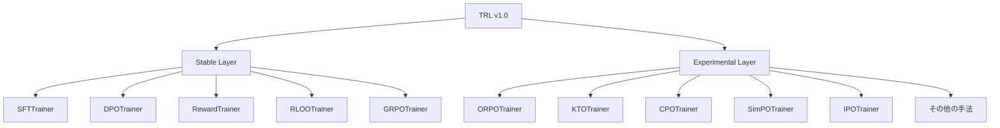
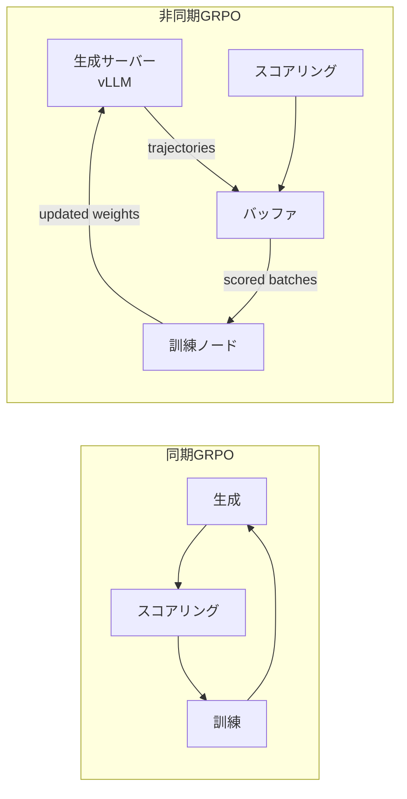

## ブログ概要（Summary）

本記事は [https://huggingface.co/blog/trl-v1](https://huggingface.co/blog/trl-v1) の解説記事です。

Hugging Faceは2026年3月、TRL（Transformer Reinforcement Learning）ライブラリのv1.0をリリースした。TRLは研究用コードベースから安定したポストトレーニングインフラストラクチャへと転換を果たし、月間300万ダウンロード（PyPI）、GitHub Stars 17.8kを記録している。v1.0の主要な特徴は、Stable層とExperimental層を分離する「デュアル安定性モデル」の導入、75以上のポストトレーニング手法のサポート、限定的な抽象化を志向する設計哲学、そしてPPO時代からDPO時代、RLVR時代へと続くパラダイム変遷への対応である。Quentin Gallouedec、Steven Liu、Pedro Cuenca、Sergio Paniego、および53名のコントリビュータによって開発されている。

この記事は [Zenn記事: TRL DPOで社内FAQ回答モデルを選好チューニングしLLM-as-a-Judgeで評価する](https://zenn.dev/0h_n0/articles/e268578955c06f) の深掘りです。

## 情報源

- **種別**: 企業テックブログ（Hugging Face）
- **URL**: [TRL v1.0: Post-Training Library Built to Move with the Field](https://huggingface.co/blog/trl-v1)
- **組織**: Hugging Face
- **著者**: Quentin Gallouedec, Steven Liu, Pedro Cuenca, Sergio Paniego, and 53 contributors
- **発表日**: 2026年3月31日

## 技術的背景（Technical Background）

### ポストトレーニングの位置づけ

LLM開発パイプラインは「事前学習（Pre-training） → ポストトレーニング（Post-training） → 推論（Inference）」の3段階で構成される。ポストトレーニングは事前学習済みモデルの振る舞いを人間の意図に合わせて調整する工程であり、RLHF（Reinforcement Learning from Human Feedback）に代表されるアライメント手法がその中核をなす。

ポストトレーニングの学術的発展は急速であり、2023年のDPO（Direct Preference Optimization）の登場以降、KTO、ORPO、SimPO、IPOなど多数の手法が提案されてきた。さらに2024年以降はGRPO（Group Relative Policy Optimization）に代表されるRLVR（Reinforcement Learning with Verifiable Rewards）パラダイムが台頭し、検証可能な報酬関数を用いたアプローチが主流化しつつある。

こうした急速な手法の変遷に対応するライブラリが求められる一方で、プロダクション環境では安定したAPIと後方互換性が不可欠である。Hugging Faceチームはこの二律背反を解消するために、TRL v1.0でデュアル安定性モデルを導入したと述べている。

### TRLの6年間の歩み

TRLは元々PPOベースのRLHFを実装するための研究用ライブラリとして誕生した。Hugging Faceチームによれば、6年以上の開発期間を経て、研究プロトタイプから75以上のポストトレーニング手法をサポートする包括的なインフラストラクチャへと成長している。UnslothやAxolotlなど、数千のユーザーを持つ下流プロジェクトもTRLを基盤として構築されており、エコシステムとしての重要性が増している。

## 実装アーキテクチャ（Architecture）

### デュアル安定性モデル（Dual Stability Model）

TRL v1.0の設計上の中核概念は、Stable層とExperimental層の明確な分離である。



**Stable層**は、セマンティックバージョニングに従い後方互換性を保証する。Hugging Faceチームは、SFTTrainer、DPOTrainer、RewardTrainer（報酬モデリング）、RLOOTrainer、GRPOTrainer、およびそれらの近接バリアントをStable層に分類している。

**Experimental層**は後方互換性の保証を行わず、APIを迅速に変更できる。Hugging Faceチームは「Stable and experimental coexist within the same package, with explicitly different contracts」と説明しており、同一パッケージ内での共存を実現している。

```python
# Stable層: セマンティックバージョニング保証
from trl import SFTTrainer

# Experimental層: API変更の可能性あり
from trl.experimental.orpo import ORPOTrainer
```

**昇格基準**: Experimental層からStable層への昇格は「メンテナンスコストと実際の使用量の比率」で判断されると述べられている。コミュニティが実際に多用している手法が昇格候補となる。現時点でKTO、SDFT（Structured DPO Fine-Tuning）、SDPO、GOLD、GKD（Generalized Knowledge Distillation）が昇格候補として挙げられている。

### Trainer API設計

TRL v1.0のTrainer APIは、Hugging Face `transformers`の`Trainer`クラスを継承し、ポストトレーニング固有の機能を追加する構造をとっている。

```python
from trl import DPOTrainer, DPOConfig
from transformers import AutoModelForCausalLM, AutoTokenizer
from datasets import load_dataset

model = AutoModelForCausalLM.from_pretrained("meta-llama/Llama-3.1-8B-Instruct")
tokenizer = AutoTokenizer.from_pretrained("meta-llama/Llama-3.1-8B-Instruct")

dataset = load_dataset("trl-lib/ultrafeedback_binarized", split="train")

training_args = DPOConfig(
    output_dir="./dpo_output",
    per_device_train_batch_size=4,
    gradient_accumulation_steps=4,
    learning_rate=5e-7,
    beta=0.1,             # DPO固有: KLペナルティ係数
    max_length=1024,
    num_train_epochs=1,
    logging_steps=10,
    report_to="wandb",    # 柔軟な実験トラッカー
)

trainer = DPOTrainer(
    model=model,
    args=training_args,
    train_dataset=dataset,
    processing_class=tokenizer,
)

trainer.train()
```

各Trainerは独立した実装を持ち、共通の基底クラスに依存しない設計となっている。Zenn記事「TRL DPOで社内FAQ回答モデルを選好チューニングしLLM-as-a-Judgeで評価する」で解説しているDPOTrainerの使い方は、このStable APIに基づいている。

### 限定的抽象化の設計哲学

Hugging Faceチームは、TRL v1.0の設計哲学として以下の原則を掲げている。

1. **汎用クラス階層の回避**: 「Avoid generic class hierarchies; favor explicit implementations」
2. **戦略的なコード重複の許容**: 「Contrary to intuition, in this context it has proven not only acceptable, but effective」
3. **抽象化の最小化**: 「Limit abstractions to the strict minimum — while recognizing that this 'minimum' is almost always overestimated」
4. **明示性の重視**: 「Prefer explicit and modifiable usage over rigid frameworks」

この設計思想は、ポストトレーニング分野の急速な手法変遷に対応するための実践的判断である。汎用的な`OfflineTrainer`基底クラスを設けてDPOTrainerやKTOTrainerを派生させるアプローチは、一見DRY原則に沿っているように見える。しかし、Hugging Faceチームは手法間の差異が微妙かつ頻繁に変化するため、共通基底クラスが変更の足かせになると判断している。

```python
# 汎用基底クラスパターン（TRLが避けているアプローチ）
class OfflineTrainer(Trainer):
    def some_common_method(self):
        ...  # 全派生クラスに影響する変更リスク

# TRLが採用するパターン: 独立実装
class DPOTrainer(Trainer):
    def some_common_method(self):
        ...  # DPO固有の最適化が自由に可能

class KTOTrainer(Trainer):
    def some_common_method(self):
        ...  # KTO固有の最適化が自由に可能
```

データコレータも同様に、各Trainer専用のものが明示的に定義される。

```python
class DataCollatorForPreference:
    """DPO向けデータコレータ: chosen/rejectedペアの処理"""
    ...

class DPOTrainer:
    def __init__(self, ...):
        self.collator = DataCollatorForPreference(...)
```

この設計は、ソフトウェア工学の教科書的なDRY原則に反するように見えるが、急速に進化する研究分野のライブラリにおいては、各手法の独立性を維持することで変更の影響範囲を局所化できるという利点がある。

## パフォーマンス最適化（Performance）

### vLLM統合によるオンライン生成高速化

GRPOなどのオンラインRL手法では、訓練ループ内でモデルからテキストを生成（ロールアウト）する必要がある。この生成フェーズがボトルネックとなることが多い。TRL v1.0はvLLMとの統合をサポートしており、推論専用のvLLMサーバーを活用することで生成速度の向上が期待できる。

```python
from trl import GRPOTrainer, GRPOConfig

config = GRPOConfig(
    output_dir="./grpo_output",
    per_device_train_batch_size=4,
    num_generations=8,          # 各プロンプトからの生成数
    max_completion_length=512,
    num_train_epochs=1,
    logging_steps=10,
)

# GRPOTrainerは報酬関数を受け取る
def reward_fn(completions: list[str], **kwargs) -> list[float]:
    """検証可能な報酬関数の例"""
    rewards = []
    for completion in completions:
        # 数学問題の正答判定など
        score = verify_answer(completion)
        rewards.append(float(score))
    return rewards

trainer = GRPOTrainer(
    model=model,
    args=config,
    train_dataset=dataset,
    reward_funcs=reward_fn,
    processing_class=tokenizer,
)
```

### マルチGPUスケーリング

TRL v1.0はDeepSpeedおよびFSDP（Fully Sharded Data Parallel）によるマルチノード分散訓練をサポートしている。ただし、Hugging Faceチームによればネイティブなテンソル並列（Tensor Parallelism）は現時点では未サポートである。

```yaml
# DeepSpeed ZeRO Stage 3 設定例
# ds_config.json
{
  "bf16": {"enabled": true},
  "zero_optimization": {
    "stage": 3,
    "offload_param": {"device": "cpu"},
    "offload_optimizer": {"device": "cpu"},
    "overlap_comm": true,
    "contiguous_gradients": true
  },
  "gradient_accumulation_steps": 4,
  "train_micro_batch_size_per_gpu": 2
}
```

```bash
# マルチGPU実行例
accelerate launch --config_file accelerate_config.yaml \
    --num_processes 4 \
    train_dpo.py
```

今後の方向性として、Hugging FaceチームはMixture-of-Experts（MoE）モデルのサポート強化、特にエキスパート並列に関するロバスト性の改善を挙げている。

### 非同期GRPO（Async GRPO）

Hugging Faceチームが今後の主要な方向性として挙げているのが非同期GRPOである。従来の同期的なGRPOでは、生成フェーズと訓練フェーズが直列に実行されるため、GPU使用率が低下する。



非同期GRPOでは、生成を専用の推論リソース上で継続的に実行し、訓練ノードはスコアリング済みのトラジェクトリをバッファから消費する。Hugging Faceチームはバッファリングとバックプレッシャー機構を備えた設計を検討していると述べている。これにより、GPUの使用率が大幅に改善され、大規模モデルでのRLVR訓練が効率化される。

## Production Deployment Guide

TRLはポストトレーニング（ファインチューニング）ライブラリであり、推論サービスではない。本セクションでは、TRLを用いたモデルのファインチューニングからデプロイまでのパイプラインをAWS上で構築する方法を解説する。

### AWS実装パターン（コスト最適化重視）

TRLによるポストトレーニングはGPUを必要とするため、トレーニングジョブの実行環境とファインチューニング済みモデルの推論サービングを分けて設計する。

| 構成 | トレーニング | 推論サービング | 月額概算 |
|------|------------|--------------|---------|
| Small (~100 req/日) | SageMaker Training Job (ml.g5.xlarge x1) | Lambda + Bedrock Custom Model Import | $150-400 |
| Medium (~1000 req/日) | SageMaker Training Job (ml.g5.2xlarge x1) | ECS Fargate + vLLM (GPU対応) | $800-2,000 |
| Large (10000+ req/日) | EKS + Spot (ml.g5.12xlarge x2-4) | EKS + vLLM + Karpenter (Spot優先) | $3,000-8,000 |

**コスト試算の注意事項**: 上記は2026年9月時点のAWS ap-northeast-1（東京）リージョン料金に基づく概算値である。実際のコストはトラフィックパターン、GPU使用時間、バースト使用量により変動する。最新料金はAWS料金計算ツールで確認を推奨する。

**Small構成の詳細**:
- SageMaker Training Job: ml.g5.xlarge（NVIDIA A10G 24GB x1）を使用。LoRA/QLoRAによるパラメータ効率的ファインチューニングにより、7-8Bモデルの訓練が可能。訓練は通常数時間で完了するため、オンデマンド課金（約$1.41/hr）が適切
- 推論: Bedrock Custom Model Import でファインチューニング済みモデルをインポートし、サーバーレスで推論。トラフィックが少ない場合のインフラ管理コストを削減

**Large構成の詳細**:
- EKSクラスタ上でTRLの分散訓練を実行。Karpenter + Spot Instancesにより最大90%のコスト削減が可能
- 推論サービング: vLLMをEKS上にデプロイし、continuous batchingとPagedAttentionによるスループット最適化

**コスト削減テクニック**:
- Spot Instances活用でトレーニングジョブコストを最大90%削減（中断対策としてチェックポイント保存を設定）
- Reserved Instances購入で推論サーバーコストを最大72%削減
- SageMaker Managed Spot Trainingの利用でマネージドなSpot運用
- LoRA/QLoRA適用で必要GPU数を削減（フルファインチューニング比で1/4-1/8のVRAM使用量）

### Terraformインフラコード

**Small構成（SageMaker Training + S3）**:

```hcl
# TRL Fine-tuning Pipeline - Small構成
# SageMaker Training Job + S3 Model Artifact Storage

terraform {
  required_version = ">= 1.9"
  required_providers {
    aws = { source = "hashicorp/aws", version = "~> 5.70" }
  }
}

provider "aws" {
  region = "ap-northeast-1"
}

# --- S3: トレーニングデータ・モデル成果物 ---
resource "aws_s3_bucket" "training" {
  bucket = "trl-training-${data.aws_caller_identity.current.account_id}"
}

resource "aws_s3_bucket_server_side_encryption_configuration" "training" {
  bucket = aws_s3_bucket.training.id
  rule {
    apply_server_side_encryption_by_default {
      sse_algorithm = "aws:kms"
    }
  }
}

data "aws_caller_identity" "current" {}

# --- IAM: SageMaker実行ロール（最小権限） ---
resource "aws_iam_role" "sagemaker_exec" {
  name = "trl-sagemaker-exec"
  assume_role_policy = jsonencode({
    Version = "2012-10-17"
    Statement = [{
      Effect    = "Allow"
      Principal = { Service = "sagemaker.amazonaws.com" }
      Action    = "sts:AssumeRole"
    }]
  })
}

resource "aws_iam_role_policy" "sagemaker_s3" {
  name = "s3-access"
  role = aws_iam_role.sagemaker_exec.id
  policy = jsonencode({
    Version = "2012-10-17"
    Statement = [
      {
        Effect   = "Allow"
        Action   = ["s3:GetObject", "s3:PutObject", "s3:ListBucket"]
        Resource = [
          aws_s3_bucket.training.arn,
          "${aws_s3_bucket.training.arn}/*"
        ]
      },
      {
        Effect   = "Allow"
        Action   = ["logs:CreateLogGroup", "logs:CreateLogStream", "logs:PutLogEvents"]
        Resource = "arn:aws:logs:*:*:*"
      }
    ]
  })
}

# --- CloudWatch: コスト監視アラーム ---
resource "aws_cloudwatch_metric_alarm" "training_cost" {
  alarm_name          = "trl-training-cost-spike"
  comparison_operator = "GreaterThanThreshold"
  evaluation_periods  = 1
  metric_name         = "EstimatedCharges"
  namespace           = "AWS/Billing"
  period              = 86400
  statistic           = "Maximum"
  threshold           = 100  # $100/日を超えたらアラート
  alarm_actions       = []   # SNS ARNを設定
  dimensions = {
    Currency = "USD"
  }
}
```

**Large構成（EKS + Karpenter + Spot）**:

```hcl
# TRL Distributed Training - Large構成
# EKS + Karpenter (Spot優先) + Secrets Manager

module "eks" {
  source          = "terraform-aws-modules/eks/aws"
  version         = "~> 20.0"
  cluster_name    = "trl-training-cluster"
  cluster_version = "1.31"
  vpc_id          = module.vpc.vpc_id
  subnet_ids      = module.vpc.private_subnets

  # Karpenter用のIAMマッピング
  enable_cluster_creator_admin_permissions = true
}

module "vpc" {
  source  = "terraform-aws-modules/vpc/aws"
  version = "~> 5.0"
  name    = "trl-vpc"
  cidr    = "10.0.0.0/16"
  azs             = ["ap-northeast-1a", "ap-northeast-1c"]
  private_subnets = ["10.0.1.0/24", "10.0.2.0/24"]
  public_subnets  = ["10.0.101.0/24", "10.0.102.0/24"]
  enable_nat_gateway = true
  single_nat_gateway = true  # コスト削減: 単一NAT Gateway
}

# --- Karpenter: Spot優先の自動スケーリング ---
resource "kubectl_manifest" "karpenter_nodepool" {
  yaml_body = yamlencode({
    apiVersion = "karpenter.sh/v1"
    kind       = "NodePool"
    metadata   = { name = "gpu-training" }
    spec = {
      template = {
        spec = {
          requirements = [
            { key = "karpenter.sh/capacity-type", operator = "In", values = ["spot", "on-demand"] },
            { key = "node.kubernetes.io/instance-type", operator = "In",
              values = ["g5.12xlarge", "g5.48xlarge", "p4d.24xlarge"] },
          ]
          nodeClassRef = { name = "default" }
        }
      }
      limits   = { cpu = "192", "nvidia.com/gpu" = "16" }
      disruption = {
        consolidationPolicy = "WhenEmptyOrUnderutilized"
        consolidateAfter    = "30s"
      }
    }
  })
}

# --- Secrets Manager: Hugging Face Token ---
resource "aws_secretsmanager_secret" "hf_token" {
  name       = "trl/hf-token"
  kms_key_id = aws_kms_key.secrets.arn
}

resource "aws_kms_key" "secrets" {
  description         = "KMS key for TRL secrets"
  enable_key_rotation = true
}

# --- AWS Budgets: 予算アラート ---
resource "aws_budgets_budget" "training" {
  name         = "trl-training-monthly"
  budget_type  = "COST"
  limit_amount = "5000"
  limit_unit   = "USD"
  time_unit    = "MONTHLY"

  notification {
    comparison_operator       = "GREATER_THAN"
    threshold                 = 80
    threshold_type            = "PERCENTAGE"
    notification_type         = "ACTUAL"
    subscriber_email_addresses = ["ml-ops@example.com"]
  }
}
```

### 運用・監視設定

**CloudWatch Logs Insights: トレーニングジョブ監視クエリ**:

```
# GPU使用率が低い訓練ジョブの検出
fields @timestamp, @message
| filter @message like /gpu_utilization/
| stats avg(gpu_utilization) as avg_gpu by training_job_name
| filter avg_gpu < 50
| sort avg_gpu asc
```

```
# OOM（Out of Memory）エラーの検出
fields @timestamp, @message
| filter @message like /CUDA out of memory/
| stats count() as oom_count by training_job_name
| sort oom_count desc
```

**CloudWatchアラーム設定（Python）**:

```python
import boto3

cloudwatch = boto3.client("cloudwatch", region_name="ap-northeast-1")

def create_training_alarms(job_name: str, sns_topic_arn: str) -> None:
    """SageMaker訓練ジョブの監視アラームを作成する"""
    # GPU使用率低下アラーム
    cloudwatch.put_metric_alarm(
        AlarmName=f"trl-{job_name}-low-gpu-util",
        MetricName="GPUUtilization",
        Namespace="/aws/sagemaker/TrainingJobs",
        Statistic="Average",
        Period=300,
        EvaluationPeriods=3,
        Threshold=30.0,  # 30%以下で警告
        ComparisonOperator="LessThanThreshold",
        AlarmActions=[sns_topic_arn],
        Dimensions=[
            {"Name": "Host", "Value": f"{job_name}/algo-1"},
        ],
    )
```

**X-Rayトレーシング設定（Python）**:

```python
from aws_xray_sdk.core import xray_recorder, patch_all

xray_recorder.configure(service="trl-training-pipeline")
patch_all()  # boto3自動計装

def launch_training_job(config: dict) -> str:
    """TRL訓練ジョブを起動し、X-Rayでトレースする"""
    segment = xray_recorder.begin_segment("trl-training")
    segment.put_annotation("model_name", config["model_name"])
    segment.put_annotation("trainer_type", config["trainer_type"])
    segment.put_metadata("hyperparameters", config["hyperparameters"])

    sagemaker = boto3.client("sagemaker")
    response = sagemaker.create_training_job(**config["sagemaker_params"])

    segment.put_metadata("training_job_arn", response["TrainingJobArn"])
    xray_recorder.end_segment()
    return response["TrainingJobArn"]
```

**Cost Explorer日次レポート（Python）**:

```python
import boto3
from datetime import datetime, timedelta

ce = boto3.client("ce", region_name="us-east-1")
sns = boto3.client("sns", region_name="ap-northeast-1")

def daily_training_cost_report(sns_topic_arn: str) -> dict:
    """日次のトレーニングコストレポートを生成し、閾値超過時にSNS通知する"""
    end = datetime.utcnow().strftime("%Y-%m-%d")
    start = (datetime.utcnow() - timedelta(days=1)).strftime("%Y-%m-%d")

    response = ce.get_cost_and_usage(
        TimePeriod={"Start": start, "End": end},
        Granularity="DAILY",
        Metrics=["UnblendedCost"],
        Filter={
            "Or": [
                {"Dimensions": {"Key": "SERVICE", "Values": ["Amazon SageMaker"]}},
                {"Dimensions": {"Key": "SERVICE", "Values": ["Amazon Elastic Kubernetes Service"]}},
                {"Dimensions": {"Key": "SERVICE", "Values": ["Amazon EC2 Container Service"]}},
            ]
        },
    )

    total = sum(
        float(r["Total"]["UnblendedCost"]["Amount"])
        for r in response["ResultsByTime"]
    )

    if total > 100.0:
        sns.publish(
            TopicArn=sns_topic_arn,
            Subject=f"TRL Training Cost Alert: ${total:.2f}/day",
            Message=f"Daily training cost exceeded $100: ${total:.2f}",
        )

    return {"date": start, "total_cost": total}
```

### コスト最適化チェックリスト

**アーキテクチャ選択**:
- [ ] トラフィック量に応じた構成を選択（Small: SageMaker / Medium: ECS / Large: EKS）
- [ ] ファインチューニングと推論サービングを分離設計

**リソース最適化**:
- [ ] Spot Instances優先（SageMaker Managed Spot Training / Karpenter Spot）
- [ ] Reserved Instances: 推論サーバーに1年コミット
- [ ] Savings Plans検討（Compute Savings Plans）
- [ ] LoRA/QLoRA適用でGPU要件を削減
- [ ] Gradient Checkpointingで大バッチサイズ実現
- [ ] Mixed Precision（bf16）でメモリ・計算効率化

**LLMトレーニングコスト削減**:
- [ ] LoRA rank最適化（r=8-64の範囲で実験）
- [ ] データセット品質改善（量より質で訓練効率向上）
- [ ] Early Stopping設定（過学習防止とGPU時間節約）
- [ ] Gradient Accumulation活用（小GPUで大バッチ効果）
- [ ] Flash Attention 2有効化（メモリ・速度改善）

**監視・アラート**:
- [ ] AWS Budgets設定（月額上限）
- [ ] CloudWatchアラーム（GPU使用率・OOM検知）
- [ ] Cost Anomaly Detection有効化
- [ ] 日次コストレポート自動送信
- [ ] SageMaker Experiments / MLflowでの実験トラッキング

**リソース管理**:
- [ ] 未使用SageMakerエンドポイント・ノートブック削除
- [ ] タグ戦略（Project / Environment / CostCenter）
- [ ] S3ライフサイクルポリシー（チェックポイントの自動アーカイブ）
- [ ] 開発環境のGPUインスタンス夜間停止
- [ ] EBSボリュームの自動スナップショット・削除

## 運用での学び（Production Lessons）

### ポストトレーニングのパラダイム変遷

Hugging Faceチームはブログ記事において、ポストトレーニングの歴史的変遷を3つの時代に区分して解説している。

**PPO時代（2017-2019年）**: ポストトレーニングの標準的なアーキテクチャは、ポリシーモデル、リファレンスモデル、学習された報酬モデル、サンプリングされたロールアウト、RLループという構成であった。PPO（Proximal Policy Optimization）に基づくRLHFが主流であり、InstructGPTの成功がこのアプローチの有効性を示した。しかし、報酬モデルの訓練、複数モデルの同時管理、RL訓練の不安定性が実運用上の大きな課題であった。

$$
\mathcal{L}_{\text{PPO}}(\theta) = \mathbb{E}_t \left[ \min \left( r_t(\theta) \hat{A}_t, \text{clip}(r_t(\theta), 1-\epsilon, 1+\epsilon) \hat{A}_t \right) \right]
$$

ここで、$r_t(\theta) = \frac{\pi_\theta(a_t \mid s_t)}{\pi_{\theta_{\text{old}}}(a_t \mid s_t)}$は確率比、$\hat{A}_t$はアドバンテージ推定値、$\epsilon$はクリッピング範囲である。

**DPO時代（2023-2024年）**: DPO（Direct Preference Optimization）の登場により、報酬モデルの訓練とオンラインRLが不要となった。人間の選好データ（chosen/rejectedペア）から直接ポリシーを最適化する手法であり、実装が大幅に簡素化された。

$$
\mathcal{L}_{\text{DPO}}(\pi_\theta; \pi_{\text{ref}}) = -\mathbb{E}_{(x, y_w, y_l) \sim \mathcal{D}} \left[ \log \sigma \left( \beta \log \frac{\pi_\theta(y_w \mid x)}{\pi_{\text{ref}}(y_w \mid x)} - \beta \log \frac{\pi_\theta(y_l \mid x)}{\pi_{\text{ref}}(y_l \mid x)} \right) \right]
$$

ここで、$y_w$は選好された応答、$y_l$は棄却された応答、$\pi_{\text{ref}}$はリファレンスポリシー、$\beta$はKLペナルティの強さ、$\sigma$はシグモイド関数である。この手法はZenn記事で詳しく解説しているとおり、社内FAQ回答モデルの選好チューニングに直接適用できる。

**RLVR時代（2024年以降）**: GRPO（Group Relative Policy Optimization）に代表されるRLVR（Reinforcement Learning with Verifiable Rewards）パラダイムが台頭した。学習された報酬モデルの代わりに、決定論的な検証器（数学問題の正答判定、コードの実行結果検証など）が報酬を提供する。

$$
\mathcal{L}_{\text{GRPO}}(\theta) = -\mathbb{E}_{x \sim \mathcal{D}} \left[ \frac{1}{G} \sum_{i=1}^{G} \min \left( r_i(\theta) \tilde{A}_i, \text{clip}(r_i(\theta), 1-\epsilon, 1+\epsilon) \tilde{A}_i \right) \right]
$$

ここで、$G$はグループサイズ（各プロンプトからの生成数）、$\tilde{A}_i$はグループ内の相対的なアドバンテージ（グループ平均と標準偏差による正規化）である。

### TRLが学んだ設計上の教訓

Hugging Faceチームはブログ記事で、6年間のライブラリ開発から得た教訓を共有している。

1. **抽象化のコストは見えにくい**: 共通基底クラスは初期開発を加速するが、手法固有の最適化が必要になったときに大きな負債となる
2. **セマンティックバージョニングの価値**: 研究用ライブラリでもAPIの安定性は不可欠。下流ユーザー（Unsloth、Axolotl等）が依存するため、破壊的変更のコストは高い
3. **コミュニティの使用実態が昇格基準**: 理論的な優越性ではなく、実際の採用率がStable昇格の判断基準となる

### Training Legibility（訓練の可読性）

Hugging Faceチームが今後の方向性として挙げている概念が「Training Legibility（訓練の可読性）」である。訓練中にヒューリスティクスを埋め込み、構造化された実行可能な警告を人間およびAIエージェントの双方に提供する仕組みを構想している。

```
[TRL] WARNING: VRAM utilization at 34%. Consider increasing batch_size.
```

この機能は、ポストトレーニングの効率的な実行に必要なドメイン知識をライブラリに組み込むものであり、経験の浅いユーザーや自動化パイプラインでの活用が想定されている。

## 学術研究との関連（Academic Connection）

TRL v1.0がサポートする主要な手法と、その学術的背景の対応関係を整理する。

| TRL Trainer | 論文 | 概要 |
|-------------|------|------|
| DPOTrainer | Rafailov et al. (2023) "Direct Preference Optimization" | 報酬モデル不要の選好最適化 |
| GRPOTrainer | Shao et al. (2024) "DeepSeekMath" | グループ相対ポリシー最適化 |
| RLOOTrainer | Ahmadian et al. (2024) "Back to Basics" | REINFORCE Leave-One-Out |
| KTOTrainer (exp.) | Ethayarajh et al. (2024) "KTO" | Kahneman-Tversky最適化 |
| ORPOTrainer (exp.) | Hong et al. (2024) "ORPO" | Odds Ratio Preference Optimization |
| SFTTrainer | -- | 教師ありファインチューニング（標準手法） |

TRLの特筆すべき点は、これらの学術研究を統一的なAPIで利用可能にしていることである。研究者が新しい手法を提案した場合、Experimental層に実装を追加し、コミュニティの採用状況に応じてStable層に昇格させるワークフローが確立されている。

Zenn記事で解説しているDPOによる社内FAQ回答モデルの選好チューニングは、まさにDPOTrainer（Stable層）を用いた実践例である。Rafailov et al.の原論文で定式化されたBradley-Terryモデルに基づく損失関数がTRLに実装されており、選好データセットのフォーマット（`chosen`/`rejected`ペア）さえ整えれば、数十行のコードでファインチューニングが実行できる。

## まとめと実践への示唆

TRL v1.0は、ポストトレーニング分野の急速な発展に対応するための実践的な設計判断を体現したライブラリである。

**設計面での貢献**:
- デュアル安定性モデルにより、API安定性と研究追従性の両立を実現
- 限定的抽象化の哲学は、急速に変化するML分野のライブラリ設計における一つの有効なアプローチを示している

**実践面での示唆**:
- Zenn記事で解説したDPOによる選好チューニングはStable APIとして保証されているため、プロダクション投入に適している
- GRPOの台頭はRLVRパラダイムの有効性を示しており、検証可能なタスク（コード生成、数学問題解答など）ではDPOよりも効果的な場合がある
- TRLのStable/Experimental分離は、社内MLプラットフォームにおけるAPI設計のリファレンスとしても参考になる

**今後の注目点**:
- 非同期GRPOによる大規模RLVR訓練の効率化
- KTO、GKDなどのStable昇格動向
- MoEモデル対応の進展

## 参考文献

- **Blog URL**: [TRL v1.0: Post-Training Library Built to Move with the Field](https://huggingface.co/blog/trl-v1)
- **GitHub**: [https://github.com/huggingface/trl](https://github.com/huggingface/trl)
- **Documentation**: [https://huggingface.co/docs/trl](https://huggingface.co/docs/trl)
- **Migration Guide**: [https://github.com/huggingface/trl/blob/main/MIGRATION.md](https://github.com/huggingface/trl/blob/main/MIGRATION.md)
- Rafailov, R., et al. (2023). "Direct Preference Optimization: Your Language Model is Secretly a Reward Model." NeurIPS 2023.
- Shao, Z., et al. (2024). "DeepSeekMath: Pushing the Limits of Mathematical Reasoning in Open Language Models."
- Ethayarajh, K., et al. (2024). "KTO: Model Alignment as Prospect Theoretic Optimization."
- Hong, J., et al. (2024). "ORPO: Monolithic Preference Optimization without Reference Model."
- Ahmadian, A., et al. (2024). "Back to Basics: Revisiting REINFORCE-Style Optimization for Learning from Human Feedback in LLMs."
- **Related Zenn article**: [TRL DPOで社内FAQ回答モデルを選好チューニングしLLM-as-a-Judgeで評価する](https://zenn.dev/0h_n0/articles/e268578955c06f)
