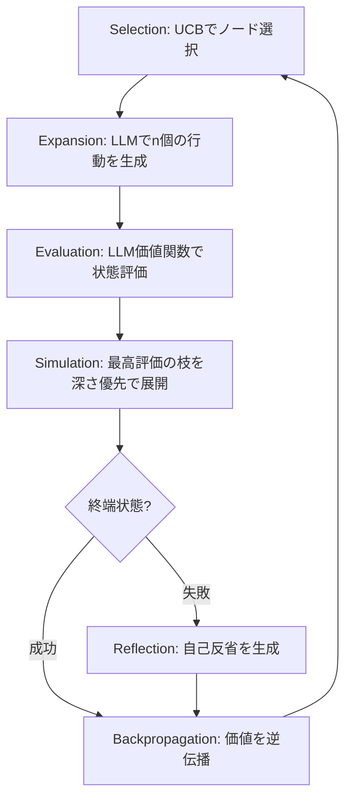

## 論文概要

本記事は [Language Agent Tree Search Unifies Reasoning Acting and Planning in Language Models](https://arxiv.org/abs/2310.04406) (ICML 2024) の解説記事です。

LATS（Language Agent Tree Search）は、Monte Carlo Tree Search（MCTS）をLLMエージェントに適用し、推論（reasoning）・行動（acting）・計画（planning）を統一的に扱うフレームワークである。LLMをポリシー（行動生成）と価値関数（軌跡評価）の両方に活用し、失敗した軌跡に対する自己反省（self-reflection）を外部メモリとして蓄積する。著者らは、HumanEvalで92.7% pass@1、WebShopで75.9、HotPotQAでExact Match 0.63（ReAct設定）を達成したと報告している。

この記事は [Zenn記事: Tree of Thoughts×MCTSでLLM推論の正答率を向上させる実装ガイド](https://zenn.dev/0h_n0/articles/9b095a0901981e) の深掘りです。

## 情報源

- **会議名**: ICML 2024（International Conference on Machine Learning）
- **arXiv ID**: 2310.04406
- **URL**: [https://arxiv.org/abs/2310.04406](https://arxiv.org/abs/2310.04406)
- **著者**: Andy Zhou, Kai Yan, Michal Shlapentokh-Rothman, Haohan Wang, Yu-Xiong Wang
- **コード**: [https://github.com/lapisrocks/LanguageAgentTreeSearch](https://github.com/lapisrocks/LanguageAgentTreeSearch)

## カンファレンス情報

ICMLは機械学習分野の最高峰会議の一つであり、採択率は通常25-28%程度と競争率が高い。本論文はICML 2024に採択されている。MCTSという古典的アルゴリズムとLLMを統合した点が評価されたと考えられる。

## 背景と動機

LLMを外部環境と相互作用するエージェントとして活用する研究が進んでいるが、既存手法にはそれぞれ限界がある。

**ReAct**は推論と行動を交互に行うが、探索が貪欲な単一パスに限られる。一度誤った方向に進むと修正が困難であり、複雑なタスクでは性能が頭打ちになる。

**Tree of Thoughts（ToT）**は木探索による計画能力を持つが、推論タスクのみを対象とし、外部環境との相互作用（行動）を扱えない。つまり、Webナビゲーションやコード実行のようなタスクには適用できない。

**RAP（Reasoning via Planning）**はMCTSを推論に適用するが、行動を伴うタスクへの対応が不十分であり、自己反省機構を持たない。

**Reflexion**は自己反省による学習を行うが、探索は逐次的であり木構造の計画を持たない。

これらの手法はいずれも推論・行動・計画の一部しかカバーしない。LATSはMCTSを基盤として3つの能力を統合する。

## 主要な貢献

- **推論・行動・計画の統合**: MCTSを用いて、LLMエージェントの推論、外部環境での行動、先読み計画を単一フレームワークで実現した初の手法
- **LLMによる価値関数**: ランダムロールアウトの代わりにLLM自体を価値関数として利用し、状態評価の質を向上させた
- **自己反省の外部メモリ化**: 失敗した軌跡からの反省をメモリに蓄積し、以後の探索で同じ過ちを避ける仕組みを導入
- **汎用性の実証**: プログラミング、質問応答、Webナビゲーション、数学推論と多様なタスクで有効性を確認

## 技術的詳細

### MCTSのLLMエージェントへの適用

LATSは従来のMCTSを6つの操作に拡張してLLMエージェントに適用する。以下にその全体像を示す。



#### 1. Selection（選択）

ルートノード $s_0$ から開始し、UCB1（Upper Confidence Bound）に基づいてノードを選択する。探索と活用のバランスを取る基本的な選択式は以下の通りである。

$$
\text{UCT}(s) = V(s) + w \cdot \sqrt{\frac{\ln N(\text{parent}(s))}{N(s)}}
$$

ここで、
- $V(s)$: ノード $s$ の推定価値（期待リターン）
- $N(s)$: ノード $s$ の訪問回数
- $N(\text{parent}(s))$: 親ノードの訪問回数
- $w$: 探索重み（デフォルト $w = 1$）

第1項が活用（高い価値のノードを選ぶ）、第2項が探索（訪問回数が少ないノードを優先する）に対応する。$w$ を大きくするほど未知のノードを積極的に探索する。

#### 2. Expansion（展開）

選択されたリーフノードから、LLMをポリシー $p_\theta$ として $n$ 個の行動をサンプリングし、環境からの観測を得て $n$ 個の子ノードを生成する。著者らはデフォルトで $n = 5$ を採用したと報告している。

#### 3. Evaluation（評価）

各新規ノードに対し、LLMを価値関数として利用してスカラー値を算出する。評価値は2つの成分の加重和として定義される。

$$
V(s) = \lambda \cdot V_{\text{LM}}(s) + (1 - \lambda) \cdot V_{\text{SC}}(s)
$$

ここで、
- $V_{\text{LM}}(s)$: LLMが状態 $s$ に対して生成するヒューリスティック評価値
- $V_{\text{SC}}(s)$: 自己整合性（Self-Consistency）スコア。複数回サンプリングした結果の一貫性に基づく
- $\lambda$: ハイパーパラメータ（推論タスクでは $\lambda = 0.5$、意思決定タスクでは $\lambda = 0.8$）

従来のMCTSではランダムロールアウトで価値を推定するが、LATSではLLMの文脈理解能力を活用することで、より質の高い評価が可能になる。

#### 4. Simulation（シミュレーション）

展開されたノードから終端状態まで探索を続ける。各深さレベルで最も評価値が高い枝を優先的に選択する。深さ制限 $L$ まで到達するか、タスクの終了条件を満たすと停止する。

#### 5. Backpropagation（逆伝播）

終端状態から報酬 $r$ を取得し、軌跡上の各ノードの価値を更新する。

$$
V(s_i) = \frac{V(s_i) \cdot N(s_i) + r}{N(s_i) + 1}
$$

これは訪問回数で重み付けされた移動平均であり、探索が進むにつれて各ノードの価値推定が精緻化される。

#### 6. Reflection（反省）

LATSの独自要素として、失敗した終端状態に到達した場合、LLMに自己反省（self-reflection）テキストを生成させる。生成された反省は失敗した軌跡とともに外部メモリに蓄積し、以後の探索ステップでin-context learningの文脈として参照する。これにより、同じ種類の失敗を繰り返すことを防ぐ。

### アルゴリズムの全体フロー

LATSは $k$ 回のロールアウトを実行し、各ロールアウトで最大深さ $L$ まで探索する。

```python
from dataclasses import dataclass, field
import math


@dataclass
class Node:
    """MCTSの探索ノード"""
    state: str
    value: float = 0.0
    visits: int = 0
    children: list["Node"] = field(default_factory=list)
    is_terminal: bool = False
    reward: float = 0.0


def uct_select(node: Node, w: float = 1.0) -> "Node":
    """UCB1に基づく子ノード選択"""
    best_score, best_child = -float("inf"), node.children[0]
    for child in node.children:
        if child.visits == 0:
            return child
        score = child.value + w * math.sqrt(math.log(node.visits) / child.visits)
        if score > best_score:
            best_score, best_child = score, child
    return best_child


def lats_search(
    root: Node, llm_policy: callable, llm_value: callable,
    environment: callable, reflect: callable,
    k: int = 8, n: int = 5, max_depth: int = 8, lam: float = 0.5,
) -> Node | None:
    """LATS探索: k回のロールアウトで最良の終端ノードを返す"""
    reflections: list[str] = []
    best_node: Node | None = None

    for _ in range(k):
        node, trajectory = root, [root]
        for _ in range(max_depth):
            if node.is_terminal:
                break
            if node.children:  # Selection
                node = uct_select(node)
            else:  # Expansion + Evaluation
                for action in llm_policy(node.state, reflections, n=n):
                    s, r, done = environment(node.state, action)
                    node.children.append(Node(state=s, is_terminal=done, reward=r))
                for child in node.children:
                    child.value = lam * llm_value(child.state) + (1 - lam) * 0.5
                node = max(node.children, key=lambda c: c.value)
            trajectory.append(node)

        # Backpropagation
        r = node.reward if node.is_terminal else node.value
        for t in trajectory:
            t.visits += 1
            t.value = (t.value * (t.visits - 1) + r) / t.visits

        if node.is_terminal and node.reward <= 0:  # Reflection
            reflections.append(reflect(trajectory))
        if node.is_terminal and node.reward > 0:
            if best_node is None or node.reward > best_node.reward:
                best_node = node
    return best_node
```

## 実装のポイント

### ハイパーパラメータの設定

著者らが報告しているタスク別の推奨設定は以下の通りである。

| パラメータ | HotPotQA | HumanEval | WebShop | Game of 24 |
|-----------|----------|-----------|---------|------------|
| 子ノード数 $n$ | 5 | 5 | 5 | 5 |
| 最大深さ $L$ | 7 | 8 | 15 | 5 |
| ロールアウト数 $k$ | 50 | 8 | 30 | - |
| $\lambda$（LM重み） | 0.5 | 0.5 | 0.8 | 0.5 |
| 探索重み $w$ | 1.0 | 1.0 | 1.0 | 1.0 |

### 実装上の注意点

- **$n = 1$ のケース**: 子ノード数を1にするとReActと同等の効率になる。計算予算が限られる場合の縮退版として利用可能
- **価値関数のキャリブレーション**: $V_{\text{LM}}$ のスコアはモデルやプロンプトによって分布が異なるため、タスクごとに $\lambda$ の調整が必要
- **反省の蓄積上限**: コンテキストウィンドウの制限から、蓄積する反省テキストの数を管理する必要がある。直近の失敗に限定するか、要約して圧縮する戦略が考えられる

## Production Deployment Guide

### AWS実装パターン（コスト最適化重視）

LATSはロールアウトごとに複数回のLLM呼び出しを行うため、API呼び出し回数とトークン消費が大きい。トラフィック量に応じた構成を以下に示す。なお、以下のコスト試算は2026年9月時点のAWS ap-northeast-1（東京）リージョン料金に基づく概算値であり、実際のコストはトラフィックパターンやバースト使用量により変動する。

| 構成 | トラフィック | サービス | 月額目安 |
|------|------------|---------|---------|
| Small | ~100 req/日 | Lambda + Bedrock + DynamoDB | $150-400 |
| Medium | ~1,000 req/日 | ECS Fargate + Bedrock + ElastiCache | $800-2,000 |
| Large | 10,000+ req/日 | EKS + Spot + Bedrock Batch API | $5,000-15,000 |

LATSはロールアウト $k$ 回 $\times$ 深さ $L$ $\times$ 子ノード $n$ のLLM呼び出しが発生するため、通常のエージェントよりコストが高い。**Bedrock Batch APIの利用で50%削減**、**Prompt Cachingで反復的なシステムプロンプト部分を30-90%削減**できる。Spot Instancesの活用でコンピュート費用を最大90%削減可能である。

### Terraformインフラコード

**Small構成（Serverless）**:

```hcl
# LATS Serverless構成 - Lambda + Bedrock + DynamoDB
resource "aws_iam_role" "lats_lambda" {
  name               = "lats-lambda-role"
  assume_role_policy = jsonencode({
    Version   = "2012-10-17"
    Statement = [{ Action = "sts:AssumeRole", Effect = "Allow",
                    Principal = { Service = "lambda.amazonaws.com" } }]
  })
}

resource "aws_iam_role_policy" "lats_bedrock" {
  name = "lats-bedrock-access"
  role = aws_iam_role.lats_lambda.id
  policy = jsonencode({
    Version = "2012-10-17"
    Statement = [
      { Effect = "Allow", Action = ["bedrock:InvokeModel"],
        Resource = "arn:aws:bedrock:ap-northeast-1::foundation-model/anthropic.claude-*" },
      { Effect = "Allow", Action = ["dynamodb:PutItem", "dynamodb:GetItem", "dynamodb:Query"],
        Resource = aws_dynamodb_table.lats_cache.arn }
    ]
  })
}

resource "aws_lambda_function" "lats_agent" {
  function_name = "lats-agent"
  runtime       = "python3.12"
  handler       = "handler.main"
  role          = aws_iam_role.lats_lambda.arn
  timeout       = 900  # LATS探索は時間がかかるため最大値
  memory_size   = 1024
  environment {
    variables = { ROLLOUT_K = "8", EXPAND_N = "5", MAX_DEPTH = "8", LAMBDA_WEIGHT = "0.5" }
  }
}

resource "aws_dynamodb_table" "lats_cache" {
  name         = "lats-reflection-cache"
  billing_mode = "PAY_PER_REQUEST"
  hash_key     = "task_id"
  range_key    = "rollout_id"
  attribute { name = "task_id",    type = "S" }
  attribute { name = "rollout_id", type = "N" }
  server_side_encryption { enabled = true }
}
```

**Large構成（Container）**:

```hcl
module "eks" {
  source          = "terraform-aws-modules/eks/aws"
  version         = "~> 20.0"
  cluster_name    = "lats-cluster"
  cluster_version = "1.30"
  vpc_id          = module.vpc.vpc_id
  subnet_ids      = module.vpc.private_subnets
}

resource "kubectl_manifest" "karpenter_provisioner" {
  yaml_body = yamlencode({
    apiVersion = "karpenter.sh/v1beta1"
    kind       = "NodePool"
    metadata   = { name = "lats-workers" }
    spec = {
      template = { spec = { requirements = [
        { key = "karpenter.sh/capacity-type", operator = "In", values = ["spot", "on-demand"] },
        { key = "node.kubernetes.io/instance-type", operator = "In",
          values = ["m6i.xlarge", "m6a.xlarge", "m5.xlarge"] }
      ]}}
      limits     = { cpu = "100", memory = "400Gi" }
      disruption = { consolidationPolicy = "WhenUnderutilized" }
    }
  })
}

resource "aws_budgets_budget" "lats_monthly" {
  name         = "lats-monthly-budget"
  budget_type  = "COST"
  limit_amount = "5000"
  limit_unit   = "USD"
  time_unit    = "MONTHLY"
  notification {
    comparison_operator        = "GREATER_THAN"
    threshold                  = 80
    threshold_type             = "PERCENTAGE"
    notification_type          = "ACTUAL"
    subscriber_email_addresses = ["alerts@example.com"]
  }
}
```

### 運用・監視設定

**CloudWatch Logs Insights クエリ**（トークン使用量の異常検知）:

```
fields @timestamp, @message
| filter @message like /token_count/
| stats sum(input_tokens) as total_input, sum(output_tokens) as total_output by bin(1h)
| sort @timestamp desc
```

**X-Rayトレーシング**: `aws_xray_sdk` の `patch_all()` でboto3を自動計装し、各ロールアウトを `@xray_recorder.capture("lats_rollout")` でトレースする。`put_annotation` で `task_id` と `rollout_idx` を記録し、`put_metadata` で展開ノード数と使用反省数を記録する。

**Cost Explorer日次レポート**: `ce.get_cost_and_usage()` でBedrock/Lambda/EKSの日次コストを取得し、$100/日超過時にSNS通知を送信する。

### コスト最適化チェックリスト

**アーキテクチャ選択**:
- [ ] トラフィック量に応じた構成を選択（Small: Serverless / Medium: Hybrid / Large: Container）
- [ ] LATS固有の高API呼び出し頻度を考慮した予算設計

**リソース最適化**:
- [ ] EC2/EKSノード: Spot Instances優先（最大90%削減）
- [ ] Reserved Instances: 安定稼働部分は1年コミット（最大72%削減）
- [ ] Savings Plans: コンピュート全体で検討
- [ ] Lambda: メモリサイズを512MB-1024MBで最適化
- [ ] ECS/EKS: Karpenterでアイドル時の自動スケールダウン

**LLMコスト削減**:
- [ ] Bedrock Batch API使用で50%削減（非同期処理可能な場合）
- [ ] Prompt Caching有効化（反復するシステムプロンプト部分で30-90%削減）
- [ ] ロールアウト数 $k$ とノード数 $n$ のタスク別最適化（過剰探索の抑制）
- [ ] 浅い探索で成功した場合の早期終了（early stopping）

**監視・アラート**:
- [ ] AWS Budgets: 月額予算にアラート設定
- [ ] CloudWatch: Bedrockトークン使用量の1時間ごと監視
- [ ] Cost Anomaly Detection: 異常コスト発生時の自動通知
- [ ] 日次コストレポートのSNS自動配信

**リソース管理**:
- [ ] 未使用リソース削除、`project=lats`/`env=prod`タグ戦略
- [ ] 反省キャッシュのTTL設定（古いデータの自動削除）
- [ ] 開発環境の夜間停止、CloudTrail/Config監査ログ有効化

## 実験結果

### プログラミングタスク

著者らは、HumanEvalベンチマーク（Table 1より）において以下の結果を報告している。

| 手法 | モデル | Pass@1 |
|------|--------|--------|
| Base LM | GPT-4 | 80.1% |
| CoT | GPT-4 | 83.5% |
| Reflexion | GPT-4 | 91.0% |
| **LATS** | **GPT-4** | **92.7%** |

MBPPベンチマーク（GPT-3.5使用）では、CoTの54.9%、RAPの71.4%に対し、LATSは81.1%を達成したと報告されている。

### 質問応答タスク

HotPotQA（Exact Match、GPT-3.5、論文Table 3より）:

| 手法 | EM |
|------|-----|
| CoT | 0.34 |
| ReAct | 0.36 |
| ToT | 0.55 |
| LATS (ReAct) | 0.63 |

### Webナビゲーションタスク

WebShop（GPT-3.5、論文Table 4より）で、ReActの53.8、Reflexionの64.2に対し、LATSは75.9を達成した。著者らは、この結果が勾配ベースのファインチューニング手法に匹敵する水準であると報告している。

### アブレーションスタディ

HotPotQA（ReAct設定、$n = 5$、$k = 50$、論文Table 5より）での各コンポーネントの寄与:

| 設定 | EM | 低下 |
|------|-----|------|
| LATS (full) | 0.63 | - |
| LMヒューリスティック除去 | 0.37 | -0.26 |
| DFS（MCTS→DFS） | 0.42 | -0.21 |
| 反省除去 | 0.58 | -0.05 |

LM価値関数の除去が最大の性能低下を招き、UCB1による探索・活用バランスの有効性も確認できる。著者らはさらに、同等の $k$ でToTより約12ノード、RAPより約3.5ノード少ない展開数で高精度を達成したと報告している。

## 実運用への応用

### 適用が有効なユースケース

- **コード生成パイプライン**: テスト実行結果を環境フィードバックとして利用し、複数の実装候補を探索する
- **複雑なWeb操作の自動化**: ECサイトでの商品検索やフォーム入力など、複数ステップの意思決定を要するタスク
- **RAG + 推論の強化**: 複数の検索クエリを木構造で探索し、関連性の高い情報を段階的に収集

### 実運用での課題

- **レイテンシ**: $k$ 回のロールアウトは逐次的で応答時間が分単位になる。リアルタイム要件がある場合は $k$, $n$ を縮小するか非同期処理にする
- **コスト**: API呼び出し回数が $O(k \cdot L \cdot n)$ のため、バッチ処理やキャッシュが必要
- **環境の提供**: 外部環境（コード実行、Webブラウザ等）のサンドボックスを安全に構築する必要がある

## 関連研究

- **Tree of Thoughts (ToT)**: 推論を木構造で探索するが外部環境との相互作用を扱えない。LATSはToTの計画能力を行動タスクに拡張した位置づけ
- **RAP (Reasoning via Planning)**: MCTSを推論に適用する先行研究。自己反省機構を持たず行動タスクへの対応が限定的
- **Reflexion**: 自己反省による逐次改善手法。LATSはこの反省機構を木探索と組み合わせて多様性と学習効果を両立
- **ReAct**: 推論と行動を交互に行う基本フレームワーク。単一パスの貪欲探索であり、LATSの行動生成器として組み込まれている

## まとめ

LATSは、MCTSをLLMエージェントに適用し推論・行動・計画を統一するフレームワークである。LLMによる価値推定と自己反省の外部メモリ蓄積により、複数のベンチマークで既存手法を上回る。アブレーションからLLM価値関数とMCTSの探索・活用バランスが主要因と示されている。APIコストとレイテンシが課題だが、$k$, $n$ の調整で計算予算を制御でき、バッチ処理が許容される場面で有効と考えられる。

## 参考文献

- **Conference URL**: [https://arxiv.org/abs/2310.04406](https://arxiv.org/abs/2310.04406)
- **Code**: [https://github.com/lapisrocks/LanguageAgentTreeSearch](https://github.com/lapisrocks/LanguageAgentTreeSearch)
- **Related Zenn article**: [https://zenn.dev/0h_n0/articles/9b095a0901981e](https://zenn.dev/0h_n0/articles/9b095a0901981e)
- Zhou, A., Yan, K., Shlapentokh-Rothman, M., Wang, H., & Wang, Y.-X. (2024). Language Agent Tree Search Unifies Reasoning Acting and Planning in Language Models. *ICML 2024*.
- Yao, S., et al. (2024). Tree of Thoughts: Deliberate Problem Solving with Large Language Models. *NeurIPS 2023*.
- Hao, S., et al. (2023). Reasoning with Language Model is Planning with World Model. *EMNLP 2023*.
- Shinn, N., et al. (2023). Reflexion: Language Agents with Verbal Reinforcement Learning. *NeurIPS 2023*.
- Yao, S., et al. (2023). ReAct: Synergizing Reasoning and Acting in Language Models. *ICLR 2023*.
