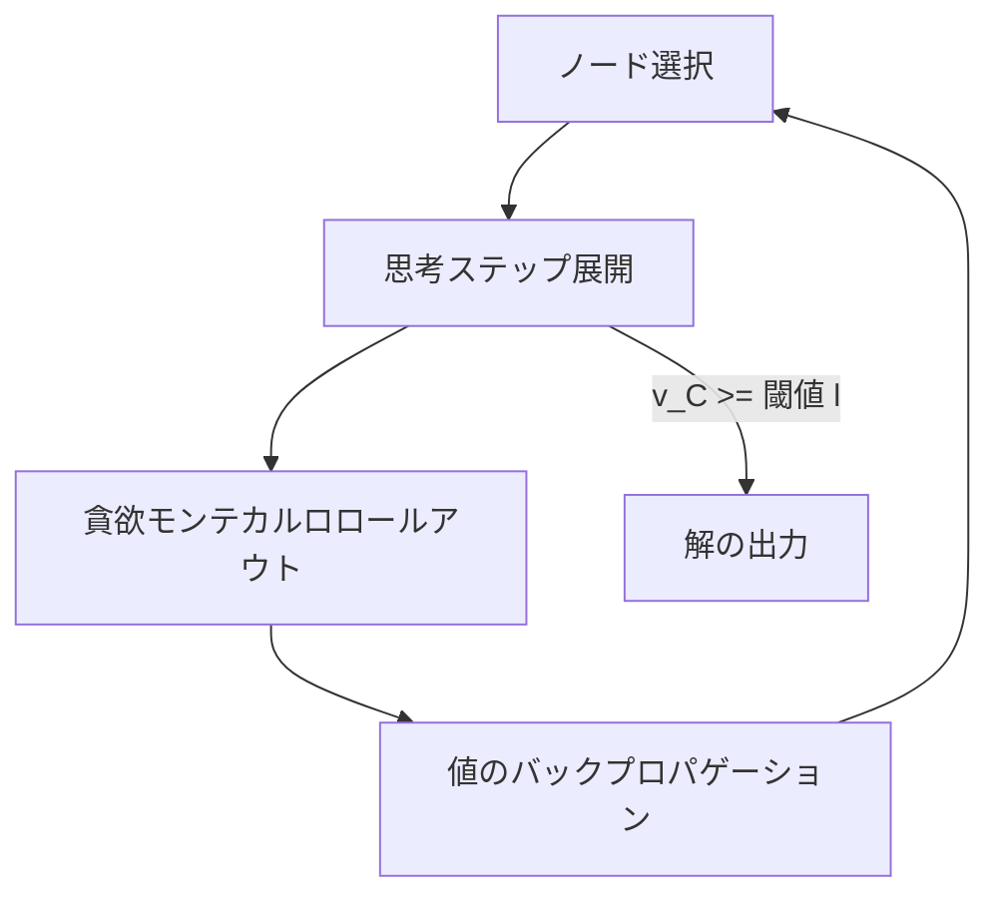
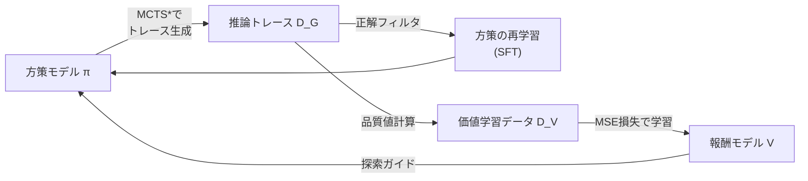

## 論文概要

本記事は [ReST-MCTS*: LLM Self-Training via Process Reward Guided Tree Search](https://arxiv.org/abs/2406.03816) (NeurIPS 2024) の解説記事です。

ReST-MCTS\*は、LLMの自己学習において「最終回答が正しい推論トレースだけを収集してファインチューニングする」という従来手法の限界に取り組む。従来のアウトカムベース手法では、正しい最終回答に到達していても途中の推論ステップに誤りを含むトレースが学習データに混入する問題があった。本手法はモンテカルロ木探索の変種であるMCTS\*とプロセス報酬モデル（PRM）を統合し、ステップレベルで品質の高い推論トレースを収集する。手動アノテーションなしでステップごとの報酬を推定できる点が特徴であり、推定された報酬はPRMの学習ターゲットとトレース選択基準の双方に活用される。

この記事は [Zenn記事: Tree of Thoughts×MCTSでLLM推論の正答率を向上させる実装ガイド](https://zenn.dev/0h_n0/articles/9b095a0901981e) の深掘りです。

## 情報源

- **会議名**: NeurIPS 2024（Neural Information Processing Systems）
- **arXiv ID**: 2406.03816
- **URL**: [https://arxiv.org/abs/2406.03816](https://arxiv.org/abs/2406.03816)
- **著者**: Dan Zhang, Sining Zhoubian, Ziniu Hu, Yisong Yue, Yuxiao Dong, Jie Tang
- **コード**: [https://github.com/THUDM/ReST-MCTS](https://github.com/THUDM/ReST-MCTS)

## カンファレンス情報

NeurIPSは機械学習分野の最高峰国際会議の1つであり、採択率は例年25-30%程度である。本論文はNeurIPS 2024に採択されており、プロセス報酬を活用したLLM自己学習という、推論能力向上の中核的課題に取り組んでいる。

## 背景と動機

LLMの推論能力を向上させる自己学習手法として、ReST$^{\text{EM}}$やSelf-Rewarding LMなどが提案されてきた。これらの手法はLLMに複数の解を生成させ、最終回答が正しいトレースのみをフィルタリングして再学習に用いる。しかし、この**アウトカムベース**のフィルタリングには根本的な問題がある。最終回答が正しくても、途中の推論ステップに誤りや非効率な経路を含むケースが多く、学習データの品質が低下する。

一方、ステップレベルで推論の正しさを評価する**プロセス報酬モデル（PRM）**の有効性がMATH-SHEPHERDなどで示されているが、PRMの学習には大量の人手アノテーションが必要という課題があった。

ReST-MCTS\*はこの2つの課題を同時に解決する。MCTS\*による木探索でステップレベルの報酬を自動推定し、その報酬をPRMの学習ターゲットとして利用する。PRMが改善されるとMCTS\*の探索品質が向上し、より良いトレースが収集され、方策モデルとPRMの双方が反復的に改善されるという好循環を実現する。

## 主要な貢献

- **MCTS\*アルゴリズムの提案**: PRMをガイドとして用いる木探索により、同一トークン予算下でBest-of-NやTree-of-Thoughtを上回る推論精度を達成
- **手動アノテーション不要のプロセス報酬推定**: 正解の最終回答（oracle answer）のみから、各ステップが正解に到達する確率を推定し、ステップレベルの報酬を自動生成
- **相互自己学習フレームワーク**: 方策モデル$\pi$とプロセス報酬モデル$V$を反復的に同時学習し、複数イテレーションにわたる継続的な性能向上を実現
- **幅広い実験検証**: LLaMA-3-8B、Mistral-7B、SciGLM-6Bの3モデルで、MATH・GSM8K・SciBench等のベンチマークにおいてベースラインを上回る結果を報告

## 技術的詳細

### MCTS\*アルゴリズム

MCTS\*は標準的なMCTSを推論トレース生成向けに改変したアルゴリズムである。標準MCTSがゲーム木でのシミュレーション結果（勝敗）を用いるのに対し、MCTS\*はPRMによる**品質値（quality value）**$v$でノードを評価する。アルゴリズムは以下の4フェーズで構成される。



**1. ノード選択（Selection）**: UCB（Upper Confidence Bound）基準で探索対象のリーフノードを選択する。

$$
\text{UCB}(C) = v_C + \varepsilon \sqrt{\frac{\ln n_{\text{parent}}}{n_C}}
$$

ここで、$v_C$はノード$C$の品質値、$n_{\text{parent}}$は親ノードの訪問回数、$n_C$はノード$C$の訪問回数、$\varepsilon$は探索と活用のトレードオフを制御するパラメータである。第1項が高品質ノードの活用、第2項が未訪問ノードの探索を促進する。

**2. 思考ステップ展開（Expansion）**: 選択されたノードの品質値$v_C$が閾値$l$（論文では$l = 0.9$）未満の場合、方策モデル$\pi_{S_0}$から$b$個の新しい推論ステップをサンプリングし、子ノードを生成する。各子ノードの初期値は価値モデル$V_\theta$で評価される。

$$
v_{C_i} \leftarrow V_\theta(p_{C_i} \mid q)
$$

**3. 貪欲モンテカルロロールアウト（Rollout）**: 最大品質値を持つ子ノードから$m$ステップ先のシミュレーションを実行し、ロールアウト中の最大値$v_{\max}$を記録する。子ノードの値をロールアウト結果で更新する。

$$
v_{C_i} \leftarrow \alpha \cdot v_{C_i} + (1 - \alpha) \cdot v_{\max}
$$

ここで$\alpha$は初期評価とロールアウト結果の重み付けパラメータである。

**4. 値のバックプロパゲーション（Backpropagation）**: 親ノードの値を子ノードの訪問回数で重み付けした平均で更新する。

$$
v_C \leftarrow \frac{\sum_i n_{C_i} \cdot v_{C_i}}{\sum_i n_{C_i}}
$$

### プロセス報酬モデル（PRM）と品質値の定義

ReST-MCTS\*の核心は、手動アノテーションなしでステップレベルの報酬を推定する仕組みにある。部分解$p_k = [s_1, s_2, \ldots, s_k]$に対する品質値$v_k$を以下のように再帰的に定義する。

$$
v_k =
\begin{cases}
0, & \text{if } k = 0 \\
\max(v_{k-1} + w_{s_k},\, 0), & \text{otherwise}
\end{cases}
$$

ここで$w_{s_k}$は重み付き報酬であり、以下の式で計算される。

$$
w_{s_k} = \frac{1 - v_{k-1}}{m_k + 1} \cdot (1 - 2r_{s_k})
$$

各変数の意味は次の通りである。

- $v_{k-1}$: 直前のステップまでの品質値
- $m_k$: ステップ$k$から正解に到達するまでの最小推論ステップ数（推論距離）
- $r_{s_k}$: MATH-SHEPHERD方式のPRMシグモイドスコア（0に近いほど正しいステップ）

この定義には3つの重要な性質がある。

1. **推論距離の反映**: 正解までのステップ数$m_k$が多いほど、1ステップあたりの重み$w_{s_k}$は小さくなる
2. **PRMスコアとの負の相関**: PRMが正しいと判断するステップ（$r_{s_k} \to 0$）ほど重みが大きくなる
3. **有界性（Theorem 1）**: $v_k \in [0, 1]$が保証される

有界性の証明は帰納法による。$v_0 = 0$から出発し、$w_{s_k} \leq 1 - v_{k-1}$が成り立つため、$v_k \leq v_{k-1} + (1 - v_{k-1}) = 1$となる。

### 相互自己学習ループ

方策モデル$\pi$とプロセス報酬モデル$V$の相互学習は以下の手順で反復される。



**イテレーション$i$の手順**:

1. **トレース生成**: 現在の方策$\pi_{S_{i-1}}$と価値モデル$V_{i-1}$でMCTS\*を実行し、推論トレース集合$\mathcal{D}_{G_i}$を生成
2. **正解フィルタリング**: 最終回答が正解と一致するトレースのみを抽出: $\mathcal{D}_{G_i}(A_j = a^*)$
3. **方策の再学習**: フィルタリングされたトレースで教師ありファインチューニング: $\pi_{S_i} \leftarrow \text{SFT}(\pi_{S_{i-1}}, \mathcal{D}_{G_i}(A_j = a^*))$
4. **価値学習データの構築**: 探索木から部分解を抽出し、品質値$v_k$を計算して学習データ$\mathcal{D}_{V_i}$を構築
5. **報酬モデルの再学習**: MSE損失で価値モデルを更新: $V_i \leftarrow \text{train}(V_{i-1}, \mathcal{D}_{V_i})$

初期化時には、正解の解法ステップ列から品質値のターゲットを構築する。正解解法の各ステップ$k$に対し、$r_{s_k} = 0$（正しいステップ）、$m_k = K - k$（残りステップ数）と設定すると、$w_k = 1/K$、$v_k = k/K$となり、品質値が0から1へ線形に増加する直感的な初期分布が得られる。

## 実装のポイント

MCTS\*の中核ロジックをPythonで実装する際の要点を示す。

```python
from __future__ import annotations

import math
from dataclasses import dataclass, field

import torch
import torch.nn as nn


@dataclass
class MCTSNode:
    """MCTS*の探索ノード

    Attributes:
        partial_solution: ルートからこのノードまでの推論ステップ列
        value: プロセス報酬モデルによる品質値 v_C
        visit_count: このノードの訪問回数 n_C
        children: 子ノードのリスト
    """

    partial_solution: list[str]
    value: float = 0.0
    visit_count: int = 0
    children: list[MCTSNode] = field(default_factory=list)


def ucb_select(node: MCTSNode, epsilon: float = 1.41) -> MCTSNode:
    """UCB基準で最良の子ノードを選択する

    Args:
        node: 親ノード
        epsilon: 探索パラメータ（デフォルト: sqrt(2)）

    Returns:
        UCBスコアが最大の子ノード
    """
    best_score = -float("inf")
    best_child = node.children[0]
    for child in node.children:
        if child.visit_count == 0:
            return child  # 未訪問ノードを優先
        exploitation = child.value
        exploration = epsilon * math.sqrt(
            math.log(node.visit_count) / child.visit_count
        )
        score = exploitation + exploration
        if score > best_score:
            best_score = score
            best_child = child
    return best_child


def compute_quality_value(
    prm_scores: list[float],
    reasoning_distances: list[int],
) -> list[float]:
    """品質値 v_k を再帰的に計算する

    Args:
        prm_scores: 各ステップのPRMシグモイドスコア r_sk
        reasoning_distances: 各ステップの推論距離 m_k

    Returns:
        各ステップの品質値リスト [v_1, v_2, ..., v_K]
    """
    values: list[float] = []
    v_prev = 0.0
    for r_s, m_k in zip(prm_scores, reasoning_distances):
        w_s = ((1.0 - v_prev) / (m_k + 1)) * (1.0 - 2.0 * r_s)
        v_k = max(v_prev + w_s, 0.0)
        values.append(v_k)
        v_prev = v_k
    return values
```

実装上の注意点は以下の通りである。

- **ロールアウトの打ち切り**: ロールアウトステップ数$m$を大きくすると精度は上がるがコストが増大する。著者らの実験では数ステップ程度で十分な推定精度が得られると報告されている
- **閾値$l$の調整**: $l = 0.9$は論文のデフォルト値だが、タスクの難易度に応じて調整が必要である。低すぎると品質の低いトレースを出力し、高すぎると探索が終了しない
- **分岐数$b$とトークン予算**: 分岐数を増やすと多様な推論経路を探索できるが、トークン消費が増加する。著者らはトークン予算を固定してベースラインと公平に比較している

## Production Deployment Guide

### AWS実装パターン（コスト最適化重視）

MCTS\*ベースの推論パイプラインをAWSにデプロイする場合のトラフィック量別推奨構成を示す。コスト試算は2026年9月時点のap-northeast-1（東京）リージョン料金に基づく概算値であり、実際のコストはトラフィックパターンやバースト使用量により変動する。

| 構成 | トラフィック | サービス構成 | 月額概算 |
|------|-------------|-------------|---------|
| Small | ~100 req/日 | Lambda + Bedrock + DynamoDB | $50-150 |
| Medium | ~1,000 req/日 | ECS Fargate + Bedrock + ElastiCache | $300-800 |
| Large | 10,000+ req/日 | EKS + Spot Instances + Bedrock Batch | $2,000-5,000 |

**Small構成の内訳**: Lambda（128MB, ~100回/日）$1未満、Bedrock Claude Sonnet（入出力トークン）$30-100、DynamoDB On-Demand $5-10、CloudWatch $5。MCTS\*の木探索では1問あたり複数回のLLM呼び出しが発生するため、Bedrock料金が支配的になる。

**コスト削減テクニック**:
- Bedrock Batch APIでオフライン処理を行い50%削減
- Prompt Cachingで共通プレフィックスを再利用し30-90%削減
- Spot Instancesで推論ワーカーのコストを最大90%削減
- 探索の早期打ち切り（閾値$l$到達時）でトークン消費を抑制

### Terraformインフラコード

**Small構成（Serverless）**:

```hcl
# ReST-MCTS* 推論パイプライン - Small構成
resource "aws_lambda_function" "mcts_inference" {
  function_name = "mcts-star-inference"
  runtime       = "python3.12"
  handler       = "handler.lambda_handler"
  role          = aws_iam_role.mcts_lambda_role.arn
  memory_size   = 512          # 木探索のメモリ使用量を考慮
  timeout       = 300          # MCTS*は複数イテレーション必要
  environment {
    variables = {
      MCTS_MAX_ITERATIONS = "20"
      MCTS_THRESHOLD      = "0.9"
      MCTS_BRANCH_FACTOR  = "3"
      DYNAMODB_TABLE      = aws_dynamodb_table.mcts_cache.name
    }
  }
}

resource "aws_dynamodb_table" "mcts_cache" {
  name         = "mcts-reasoning-cache"
  billing_mode = "PAY_PER_REQUEST"  # On-Demandでコスト最適化
  hash_key     = "question_hash"
  attribute { name = "question_hash"; type = "S" }
  ttl { attribute_name = "expires_at"; enabled = true }
}
```

**Large構成（Container）**:

```hcl
# EKS + Karpenter + Spot Instances
module "eks" {
  source          = "terraform-aws-modules/eks/aws"
  version         = "~> 20.0"
  cluster_name    = "mcts-inference-cluster"
  cluster_version = "1.30"
  vpc_id          = module.vpc.vpc_id
  subnet_ids      = module.vpc.private_subnets
  cluster_endpoint_public_access = false
}

resource "aws_budgets_budget" "mcts_monthly" {
  name         = "mcts-monthly-budget"
  budget_type  = "COST"
  limit_amount = "5000"
  limit_unit   = "USD"
  time_unit    = "MONTHLY"
  notification {
    comparison_operator        = "GREATER_THAN"
    threshold                  = 80
    threshold_type             = "PERCENTAGE"
    notification_type          = "ACTUAL"
    subscriber_email_addresses = ["alert@example.com"]
  }
}
```

### 運用・監視設定

```python
import boto3
from aws_xray_sdk.core import xray_recorder, patch_all

patch_all()  # boto3自動計装

# Bedrockトークン使用量アラーム
cloudwatch = boto3.client("cloudwatch", region_name="ap-northeast-1")
cloudwatch.put_metric_alarm(
    AlarmName="mcts-bedrock-token-spike",
    MetricName="InputTokenCount",
    Namespace="AWS/Bedrock",
    Statistic="Sum",
    Period=3600,
    EvaluationPeriods=1,
    Threshold=500000,     # 1時間あたり50万トークン超過
    ComparisonOperator="GreaterThanThreshold",
    AlarmActions=["arn:aws:sns:ap-northeast-1:ACCOUNT:mcts-alerts"],
)

@xray_recorder.capture("mcts_star_search")
def run_mcts_search(question: str, max_iterations: int = 20) -> dict:
    """MCTS*探索の実行（X-Rayトレース付き）"""
    subsegment = xray_recorder.current_subsegment()
    subsegment.put_annotation("question_length", len(question))
    subsegment.put_metadata("max_iterations", max_iterations)
    # ... 探索ロジック ...
    return {"answer": "...", "iterations": max_iterations}
```

### コスト最適化チェックリスト

**アーキテクチャ選択**:
- [ ] トラフィック量に応じた構成選択（Serverless / Hybrid / Container）
- [ ] MCTS\*の探索深度とトークン予算のバランス設定

**リソース最適化**:
- [ ] EC2/EKS: Spot Instances優先（推論ワーカーは中断耐性あり）
- [ ] Reserved Instances: 常時稼働ノードは1年コミットで最大72%削減
- [ ] Savings Plans: Compute Savings Plansの検討
- [ ] Lambda: メモリサイズ最適化（512MB推奨、木探索のメモリ消費を考慮）
- [ ] EKS: Karpenterでアイドル時スケールダウン（consolidateAfter: 60s）

**LLMコスト削減**:
- [ ] Bedrock Batch API: 非リアルタイム処理で50%削減
- [ ] Prompt Caching: MCTS\*の共通プレフィックス（問題文）をキャッシュ
- [ ] モデル選択ロジック: ロールアウトに軽量モデル、最終評価に高性能モデル
- [ ] トークン数制限: 1ステップあたりの最大トークン数を設定
- [ ] 探索の早期打ち切り: 閾値$l$到達で即座に解を出力

**監視・アラート**:
- [ ] AWS Budgets: 月額予算の80%到達で通知
- [ ] CloudWatch Alarms: トークン使用量スパイク検知
- [ ] Cost Anomaly Detection: 異常コスト自動検知
- [ ] 日次コストレポート: Bedrock/Lambda/EKS別のコスト追跡

**リソース管理**:
- [ ] 未使用リソース削除: 定期的なリソース棚卸し
- [ ] タグ戦略: Environment/Project/Teamタグの統一
- [ ] ライフサイクルポリシー: S3/ECRイメージの自動削除
- [ ] 開発環境夜間停止: 非営業時間のEKSノード削減

## 実験結果

### 自己学習の性能比較

著者らはLLaMA-3-8B-Instructを用いた自己学習実験の結果を報告している（論文Table 2より）。

| 手法 | MATH | GPQA-D | CEval-Hard | 平均 |
|------|------|--------|------------|------|
| Zero-shot | 20.76 | 27.27 | 26.32 | 24.78 |
| ReST$^{\text{EM}}$ (Iter 2) | 33.52 | 25.25 | 21.71 | 26.83 |
| ReST-MCTS\* (Iter 2) | **34.28** | **27.78** | 25.00 | **29.02** |

2イテレーション後、ReST-MCTS\*はReST$^{\text{EM}}$と比較してMATHで+0.76ポイント、平均で+2.19ポイントの改善を達成したと報告されている。Mistral-7B (MetaMATH) でもイテレーション1でMATHにおいて31.06%（ReST$^{\text{EM}}$の23.84%に対し+7.22ポイント）を記録している。

### プロセス報酬モデルの品質

著者らはMistral-7B (MetaMATH) で256個の解をサンプリングし、報酬モデルによるリランキング精度を比較している（論文Table 3より）。

| 手法 | GSM8K | MATH500 |
|------|-------|---------|
| Self-Consistency | 83.9 | 35.1 |
| SC + MATH-SHEPHERD | 86.3 | 38.3 |
| SC + ReST-MCTS\* (Value) | **87.5** | **39.0** |

ReST-MCTS\*の品質値モデルはMATH-SHEPHERDのPRMを上回り、ステップレベルの自動報酬推定が手動アノテーションベースのPRMと同等以上の品質を達成できることを示している。

### 同一トークン予算下での木探索性能

著者らはトークン予算を固定した条件下でのMATHベンチマーク結果を報告している（論文Figure 2より）。Best-of-NやSelf-Consistencyが約42.5%で頭打ちになるのに対し、ReST-MCTS\*はイテレーション2で48.5%に到達し、約6ポイントの差をつけている。SciBenchでもTree-of-Thoughtの15.82%に対してReST-MCTS\*は16.77%を達成したと報告されている。

## 実運用への応用

ReST-MCTS\*の実運用での活用シナリオとして、以下が考えられる。

**数学・科学問題の自動解答システム**: 教育プラットフォームにおいて、ステップバイステップの解答生成に木探索を適用する。PRMが各ステップの品質を評価するため、誤った推論経路を早期に検出・排除でき、ユーザに提示する解答の信頼性が向上する。

**コード生成・デバッグ**: プログラミング問題において、各コード行（ステップ）の正しさをPRMで評価しながら探索することで、コンパイルエラーや論理エラーを含むコードの生成を抑制できる。

**カスタムドメインへの適用**: 自己学習ループにより、特定ドメインの問題セットと正解のみから方策とPRMを反復的に改善できる。手動のステップレベルアノテーションが不要なため、ドメイン固有の推論能力向上のコストが大幅に低下する。

**スケーリングの課題**: MCTS\*は1問あたり複数回のLLM推論を必要とするため、リアルタイム応答には不向きである。バッチ処理やキャッシュの活用が実用上は重要となる。関連する実装パターンについては [Zenn記事: Tree of Thoughts×MCTSでLLM推論の正答率を向上させる実装ガイド](https://zenn.dev/0h_n0/articles/9b095a0901981e) も参照されたい。

## 関連研究

- **MATH-SHEPHERD** (Wang et al., 2024): 自動的にプロセス報酬を推定する手法。ReST-MCTS\*はMATH-SHEPHERDのhard estimation手法を品質値の初期化に利用しつつ、MCTS\*の探索木から得られる情報でより高精度なステップ報酬を推定する
- **ReST$^{\text{EM}}$** (Singh et al., 2023): 期待値最大化に基づくLLM自己学習。アウトカムベースのフィルタリングを行うため、推論トレースの品質に課題がある。ReST-MCTS\*はプロセスレベルのガイドでこの制限を克服する
- **Self-Rewarding LM** (Yuan et al., 2024): LLM自身が報酬関数として機能する自己学習手法。ReST-MCTS\*はSciGLM-6Bでの実験で本手法を上回る結果を報告している
- **Tree of Thoughts** (Yao et al., 2023): LLMの推論を木構造で探索する手法。ReST-MCTS\*はToTの探索戦略をMCTS\*で置き換え、PRMによるガイドを追加することで同一予算下での性能を改善する

## まとめ

ReST-MCTS\*は、プロセス報酬ガイド付き木探索と自己学習ループの統合により、手動アノテーションなしでLLMの推論能力を反復的に向上させる手法である。MCTS\*による探索と品質値の自動推定を組み合わせることで、アウトカムベースの手法より高品質な学習データを収集し、複数のベンチマークでベースラインを上回る結果が報告されている。方策モデルとプロセス報酬モデルの相互改善により、イテレーションを重ねるごとに性能が向上する点は、LLMの自律的な能力向上に向けた有望なアプローチである。

## 参考文献

- **Conference Paper**: [https://arxiv.org/abs/2406.03816](https://arxiv.org/abs/2406.03816)
- **Project Page**: [https://rest-mcts.github.io/](https://rest-mcts.github.io/)
- **Code**: [https://github.com/THUDM/ReST-MCTS](https://github.com/THUDM/ReST-MCTS)
- **Related Zenn article**: [https://zenn.dev/0h_n0/articles/9b095a0901981e](https://zenn.dev/0h_n0/articles/9b095a0901981e)
