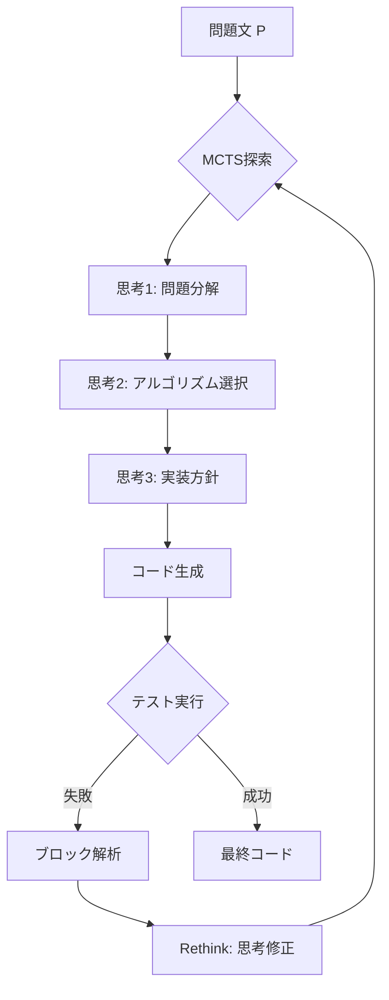

## 論文概要

本記事は [RethinkMCTS: Refining Erroneous Thoughts in Monte Carlo Tree Search for Code Generation](https://arxiv.org/abs/2409.09584) の解説記事です。

RethinkMCTSは、LLMによるコード生成においてMonte Carlo Tree Search（MCTS）をコード空間ではなく推論（思考）空間で実行するフレームワークである。従来の探索ベース手法はコード空間を直接探索するため、推論過程のモデル化が不十分であり、実行フィードバックも過去のエラーを蓄積するのみで正しい推論経路を提示できなかった。RethinkMCTSは、思考ノードを単位としたMCTS探索に加え、コード実行結果のブロックレベル解析に基づいて誤った思考を修正する「Rethink」機構を導入する。著者らは、HumanEvalおよびAPPSベンチマークにおいて既存の探索ベース・フィードバック強化手法を上回る性能を報告している。

この記事は [Zenn記事: Tree of Thoughts×MCTSでLLM推論の正答率を向上させる実装ガイド](https://zenn.dev/0h_n0/articles/9b095a0901981e) の深掘りです。

## 情報源

- **arXiv ID**: 2409.09584
- **URL**: [https://arxiv.org/abs/2409.09584](https://arxiv.org/abs/2409.09584)
- **著者**: Qingyao Li, Wei Xia, Kounianhua Du et al.
- **発表年**: 2024（EMNLP 2025 採択）
- **分野**: cs.SE, cs.CL

## 背景と動機

LLMを用いたコード生成では、複雑な問題に対してsingle-passの生成では正答率に限界がある。この課題に対して木探索（Tree Search）を組み合わせる手法が注目されてきた。しかし著者らは、既存手法には3つの根本的な問題があると指摘している。

第一に、**推論過程のモデル化が不十分**である。Tree of Thoughts（ToT）やLATS等の手法はコード空間（トークンレベル、行レベル、コード全体レベル）で直接探索を行うため、「なぜそのコードを書くか」という推論過程を明示的に扱わない。

第二に、**実行フィードバックの活用が非効果的**である。Reflexionのような自己反省型手法は過去のエラーをメモリに蓄積するが、正しい推論経路を積極的に提示しない。結果として、探索の後続イテレーションが最適解を見つけることが困難になる。

第三に、**誤った推論の修正ができない**。従来手法ではエラーノードを枝刈りするか、反省メモを追加するのみであり、誤った推論そのものを修正する機構がない。有望な探索パスが丸ごと失われるリスクがある。

## 主要な貢献

- **推論空間でのMCTS探索**: コード空間ではなく思考（thought）レベルでMCTSを実行する。LLMの推論過程を明示的にモデル化し、思考ノードの連鎖としてコード生成の推論経路を探索する。
- **Rethink機構**: コード実行結果のブロックレベル解析に基づき、誤った思考ノードを新しい思考で置換する。単なるメモリ蓄積ではなく、探索木内の推論を直接修正する。
- **二段階評価（Dual Evaluation）**: 公開テストケースの通過率とLLMによる自己評価を組み合わせた報酬関数を設計し、テストケースが限られる場合でも探索品質を維持する。

## 技術的詳細

### コード空間探索 vs 推論空間探索

従来のMCTS応用では、探索のアクション空間をコードの粒度で定義していた。トークンレベル、行レベル、コード全体レベルの3種類が代表的である。しかし、これらはいずれもコードの構文構造に基づく探索であり、「問題をどう分解し、どのアルゴリズムを適用するか」という上位の推論を陽に扱わない。

RethinkMCTSでは、アクション空間を**思考（thought）**レベルで定義する。各ノードは「この問題はグラフ探索に帰着できる」「BFSを使って最短経路を求める」といった推論ステップを表す。コード生成は最終的に選択された推論経路に基づいて一括で行われる。



### MCTSの各フェーズ

#### Selection（選択）

ノード選択にはP-UCB（Predictor Upper Confidence Bound）を使用する。

$$
\text{P-UCB}(s, a) = Q(s, a) + \beta(s) \cdot p(a \mid s) \cdot \frac{\sqrt{\log N(s)}}{1 + N(s')}
$$

ここで、
- $Q(s, a)$: 状態$s$でアクション$a$を取った場合のQ値（平均報酬）
- $p(a \mid s)$: LLMによるアクション$a$の事前確率
- $N(s)$: ノード$s$の訪問回数
- $N(s')$: 子ノード$s'$の訪問回数
- $\beta(s)$: 探索と活用のバランスを調整する係数

$\beta(s)$は以下で計算される。

$$
\beta(s) = \log\left(\frac{N(s) + c_{\text{base}} + 1}{c_{\text{base}}}\right) + c
$$

著者らはハイパーパラメータとして$c_{\text{base}} = 10$、$c = 4$を使用している。

#### Expansion（展開）

リーフノードに到達した際、LLMで新しい思考ノードを生成する。公開テストケースの通過状況によって生成戦略が異なる。

テストに失敗した場合は、言語フィードバック$f$を入力に加えて思考を生成する。

$$
[(z^1, e^1), \ldots, (z^k, e^k)] \sim p\left((z, e)^{1 \cdots k} \mid s, f\right)
$$

テストに成功した場合は、フィードバックなしで後続の思考を生成する。

$$
[(z^1, e^1), \ldots, (z^k, e^k)] \sim p\left((z, e)^{1 \cdots k} \mid s\right)
$$

ここで$z^i$は思考テキスト、$e^i$はその評価値、$k$は子ノード数（最大3）である。

#### Evaluation（二段階評価）

生成されたコードに対して、テスト通過率とLLM自己評価を組み合わせた報酬を計算する。

$$
\text{reward} =
\begin{cases}
v_{\text{test}} & \text{if } 0 \leq v_{\text{test}} < 1 \\
a \cdot v_{\text{test}} + b \cdot v_{\text{llm}} & \text{if } v_{\text{test}} = 1
\end{cases}
$$

ここで、
- $v_{\text{test}}$: 公開テストケースの通過率（0から1）
- $v_{\text{llm}}$: LLMによる正答確率の自己評価スコア
- $a = 0.8$, $b = 0.2$: 重み係数

テストを全て通過した場合（$v_{\text{test}} = 1$）にのみLLM自己評価を加味する設計である。これは、テストケースが少ない場合にテスト通過だけでは正答性を保証できないためである。

#### Verbal Feedback（言語フィードバック）

コード実行に失敗した場合、ブロックレベルの実行解析を行う。制御フローグラフ（CFG）に基づいてコードを基本ブロックに分割し、各ブロックの変数状態変化を追跡する。LLMがこの実行トレースを解析し、どのブロックが正しくどのブロックが誤っているかを特定する。この解析結果がテキスト形式の言語フィードバックとして保存され、展開フェーズとRethinkフェーズで使用される。

### Rethink機構

RethinkMCTSの核心的な貢献がRethink機構である。コード実行に失敗したリーフノードに対して、ブロックレベルフィードバックと元の誤った思考を入力として、新しい思考を生成する。

$$
z_{\text{new}} \sim p(z \mid s, f, z_{\text{old}})
$$

ここで$s$は現在の状態、$f$はブロックレベルフィードバック、$z_{\text{old}}$は元の誤った思考である。

重要な設計判断として、**親ノードの思考は修正しない**。著者らはその理由を2点挙げている。第一に、親ノードの修正は過去の報酬値を無効にするため、MCTSの統計的保証が崩れる。第二に、親ノードは既にRethinkを経ているか、評価を通過しているため、修正の必要性が低い。

従来のReflexion等の手法が「過去のエラーの要約をメモリに追加する」のに対し、Rethinkは「探索木内の思考ノードそのものを置換する」点で本質的に異なる。これにより、誤った推論パスに沿った再探索ではなく、修正された推論パスからの新しい探索が可能になる。

## 実装のポイント

以下にRethinkMCTSの中核ロジックの実装イメージを示す。

```python
from __future__ import annotations

import math
from dataclasses import dataclass, field


@dataclass
class ThoughtNode:
    """MCTS上の思考ノード

    Attributes:
        thought: 推論テキスト
        visits: 訪問回数
        value: 累積報酬
        children: 子ノード一覧
        verbal_feedback: 実行フィードバック（失敗時に設定）
    """

    thought: str
    visits: int = 0
    value: float = 0.0
    children: list[ThoughtNode] = field(default_factory=list)
    verbal_feedback: str | None = None
    prior: float = 1.0

    @property
    def q_value(self) -> float:
        """平均報酬を返す"""
        if self.visits == 0:
            return 0.0
        return self.value / self.visits


def p_ucb_score(
    parent: ThoughtNode,
    child: ThoughtNode,
    c_base: float = 10.0,
    c: float = 4.0,
) -> float:
    """P-UCBスコアを計算する

    Args:
        parent: 親ノード
        child: 子ノード
        c_base: ベースライン定数
        c: 探索定数

    Returns:
        P-UCBスコア
    """
    beta = math.log((parent.visits + c_base + 1) / c_base) + c
    exploration = beta * child.prior * math.sqrt(math.log(parent.visits)) / (
        1 + child.visits
    )
    return child.q_value + exploration


def select_child(node: ThoughtNode) -> ThoughtNode:
    """P-UCBスコアが最大の子ノードを選択する"""
    return max(node.children, key=lambda ch: p_ucb_score(node, ch))


def compute_reward(
    test_pass_rate: float,
    llm_self_eval: float,
    a: float = 0.8,
    b: float = 0.2,
) -> float:
    """二段階評価で報酬を計算する

    Args:
        test_pass_rate: 公開テスト通過率（0-1）
        llm_self_eval: LLM自己評価スコア（0-1）
        a: テスト通過率の重み
        b: 自己評価の重み

    Returns:
        報酬値
    """
    if test_pass_rate < 1.0:
        return test_pass_rate
    return a * test_pass_rate + b * llm_self_eval


def backpropagate(path: list[ThoughtNode], reward: float) -> None:
    """報酬を探索パスに沿って逆伝播する"""
    for node in reversed(path):
        node.visits += 1
        node.value += reward
```

実装上の注意点として以下が挙げられる。

- **子ノード数の制限**: 各ノードの子ノード数は最大3に制限されている。生成コストとのトレードオフであり、大きくしすぎるとLLM呼び出し回数が爆発する。
- **ロールアウト数**: 最大16回のシミュレーションを実行する。著者らの実験では、これ以上増やしても改善幅が小さくなると報告されている。
- **ブロック解析の粒度**: CFGベースのブロック分割はPython AST等を用いて実装する。関数単位やループ単位での分割が実用的である。
- **Rethinkのタイミング**: リーフノードでの実行失敗時にのみ発動する。成功ノードに対するRethinkは不要である。

## Production Deployment Guide

### AWS実装パターン（コスト最適化重視）

RethinkMCTSをコード生成アシスタントとしてデプロイする場合の構成を示す。MCTS探索では1問あたり複数回のLLM呼び出しが発生するため、コスト管理が重要である。

**トラフィック量別の推奨構成**:

| 構成 | 規模 | サービス | 月額（概算） |
|------|------|---------|-------------|
| Small | ~100 req/日 | Lambda + Bedrock + DynamoDB | $80-200 |
| Medium | ~1,000 req/日 | ECS Fargate + Bedrock + ElastiCache | $400-1,000 |
| Large | 10,000+ req/日 | EKS + Spot + Bedrock Batch | $3,000-8,000 |

Small構成ではLambdaでリクエストを受け付け、Bedrock経由でClaude/GPTモデルを呼び出す。MCTSの1探索あたり最大48回（16ロールアウト x 最大3子ノード）のLLM呼び出しが発生するため、Lambdaのタイムアウトは15分に設定する。DynamoDBに探索木の中間状態を保存し、タイムアウト時の再開に対応する。

Medium構成ではECS Fargateで常駐プロセスを稼働させ、ElastiCacheで探索済みの思考パスをキャッシュする。同一問題に対する類似の推論パスが頻出するため、キャッシュヒット率は著者らの実験条件で推定30-40%が見込める。

Large構成ではEKSクラスタにSpot Instancesを活用し、Bedrock Batch APIでバッチ推論を行う。CI/CDパイプラインからの大量リクエストに対応する。

**コスト削減テクニック**:
- Spot Instances: EKSワーカーノードで最大90%削減
- Bedrock Batch API: 非同期処理で50%削減
- Prompt Caching: 同一問題の再探索で30-90%削減
- 探索の早期終了: 全テスト通過で即座にMCTSを打ち切る

**注意**: 上記コスト試算は2026年9月時点のAWS ap-northeast-1（東京）リージョン料金に基づく概算値である。実際のコストはトラフィックパターンやバースト使用量により変動する。最新料金はAWS料金計算ツールで確認を推奨する。

### Terraformインフラコード

**Small構成（Serverless）の主要リソース**:

```hcl
# RethinkMCTS - Small構成 (Lambda + Bedrock + DynamoDB)

resource "aws_dynamodb_table" "mcts_state" {
  name         = "rethinkmcts-search-state"
  billing_mode = "PAY_PER_REQUEST"  # On-Demand: 低トラフィック時のコスト最適化
  hash_key     = "problem_id"
  range_key    = "search_id"

  attribute {
    name = "problem_id"
    type = "S"
  }
  attribute {
    name = "search_id"
    type = "S"
  }

  ttl {
    attribute_name = "expires_at"
    enabled        = true  # 24時間後に自動削除
  }
  server_side_encryption { enabled = true }
}

resource "aws_lambda_function" "rethinkmcts" {
  function_name = "rethinkmcts-code-gen"
  role          = aws_iam_role.rethinkmcts_lambda.arn
  runtime       = "python3.12"
  handler       = "handler.lambda_handler"
  timeout       = 900   # 15分: MCTS探索の最大時間
  memory_size   = 1024  # MCTS木構造のメモリ確保

  environment {
    variables = {
      MAX_ROLLOUTS   = "16"
      MAX_CHILDREN   = "3"
      DYNAMODB_TABLE = aws_dynamodb_table.mcts_state.name
    }
  }
}

resource "aws_cloudwatch_metric_alarm" "bedrock_cost" {
  alarm_name          = "rethinkmcts-bedrock-token-spike"
  comparison_operator = "GreaterThanThreshold"
  evaluation_periods  = 1
  metric_name         = "InputTokenCount"
  namespace           = "AWS/Bedrock"
  period              = 3600
  statistic           = "Sum"
  threshold           = 100000  # 1時間10万トークン超過で警告
  alarm_actions       = [aws_sns_topic.alerts.arn]
}
```

**Large構成（Container）**ではEKS + Karpenter（Spot優先）+ Secrets Manager + AWS Budgets月額アラートで構成する。Karpenter NodePoolで`spot`を優先し、`m6i.xlarge`/`m6a.xlarge`等のインスタンスを自動選択させる。

### 運用・監視設定

**CloudWatch Logs Insights クエリ**（MCTS探索のコスト分析）:

```
fields @timestamp, problem_id, rollout_count, total_tokens, duration_ms
| filter event = "mcts_search_complete"
| stats sum(total_tokens) as hourly_tokens, avg(rollout_count) as avg_rollouts,
        avg(duration_ms) as avg_latency by bin(1h)
| sort @timestamp desc
```

**X-Ray トレーシング**: `aws_xray_sdk`の`patch_all()`でboto3を自動計装し、各ロールアウトに`problem_id`アノテーションを付与する。**Cost Explorer**: 日次でサービス別コストを取得し、$100/日超過時にSNS通知を発行する。

### コスト最適化チェックリスト

**アーキテクチャ選択**: トラフィック量でServerless/Hybrid/Containerを選択。**リソース最適化**: Spot Instances優先（最大90%削減）、Reserved Instances 1年コミット（最大72%削減）、Lambda メモリ1024MB最適化、Karpenter Consolidation Policyでアイドル時スケールダウン。**LLMコスト削減**: Bedrock Batch API（50%削減）、Prompt Caching（30-90%削減）、展開フェーズに軽量モデル・評価フェーズに高精度モデルの使い分け、全テスト通過時のMCTS早期終了。**監視・アラート**: AWS Budgets月額上限、CloudWatchトークンスパイク検知、Cost Anomaly Detection、日次コストレポート。**リソース管理**: DynamoDB TTL 24時間自動削除、CloudWatch Logs 30日保持、タグ戦略統一、開発環境夜間停止。

## 実験結果

### 全体性能

著者らはHumanEvalおよびAPPSベンチマークでpass@1を評価指標として実験を行っている（論文Table 1より）。

| ベンチマーク | モデル | ベースライン | RethinkMCTS | 改善幅 |
|-------------|--------|------------|-------------|--------|
| HumanEval | GPT-3.5-turbo | 70.12% | 89.02% | +18.9pt |
| HumanEval | GPT-4o-mini | 87.20% | 94.51% | +7.3pt |
| APPS (Intro) | GPT-3.5-turbo | 29% | 45% | +16pt |
| APPS (Interview) | GPT-3.5-turbo | 19% | 38% | +19pt |
| APPS (Competition) | GPT-3.5-turbo | 9% | 13% | +4pt |
| APPS (Intro) | GPT-4o-mini | 35% | 59% | +24pt |
| APPS (Interview) | GPT-4o-mini | 29% | 49% | +20pt |
| APPS (Competition) | GPT-4o-mini | 16% | 28% | +12pt |

著者らは、RethinkMCTSがPG-TD、ToT、LATS、RAP、LDB、Reflexion等の全ベースラインを上回ったと報告している。特にGPT-3.5-turboでのHumanEvalにおける18.9ptの改善は、推論空間探索とRethink機構の有効性を示している。

### アブレーション分析

著者らはGPT-3.5-turboを用いたHumanEvalでの各コンポーネントの寄与を分析している（論文Figure 3より）。

| 設定 | pass@1 | 変化 |
|------|--------|------|
| RethinkMCTS（完全版） | 89.02% | - |
| 言語フィードバック除去（w/o VF） | 87.10% | -1.92pt |
| ブロック情報除去（w/o blockInfo） | 86.60% | -2.42pt |
| Rethink除去 | 86.80% | -2.22pt |

著者らは「Rethink操作は主にコード実行のフィードバックに基づいている」と分析しており、言語フィードバックが最も影響が大きい要因であると報告している。

### 探索粒度の比較

著者らはMCTSのアクション空間の粒度を比較し、思考レベルの探索がトークンレベル、行レベル、コードレベルの全てを上回ることを確認している。GPT-3.5-turboのような推論能力の高いモデルでは「推論過程の探索がより重要である」と報告している。

### Rethinkの効果

Rethinkなしで同じ探索回数を使った場合との比較（論文Table 3より）では、公開テスト通過率においてRethinkありの場合に一貫した改善が見られる。APPS-introではRethinkなし10.04%に対しRethinkあり15.60%、HumanEvalではRethinkなし48.30%に対しRethinkあり53.29%と報告されている。著者らは「誤った思考の修正により、正しいパスに沿った探索がより多く行われる」と分析している。

## 実運用への応用

### コード生成アシスタントへの統合

RethinkMCTSはIDEプラグインやコード生成APIのバックエンドとして統合できる。単純なコード補完ではなく、アルゴリズム選択やデータ構造設計を含む複雑なコーディングタスクにおいて効果が大きい。Zenn記事で解説されているTree of Thoughtsの実装パターンを基盤として、Rethink機構を追加実装することで、推論品質を向上させることが可能である。

### CI/CDパイプラインとの連携

テストスイートの実行結果をブロックレベルフィードバックとして活用する設計は、CI/CDパイプラインとの連携に適している。PR作成時に自動でコード生成を行い、CIのテスト結果をフィードバックとしてコードを修正するワークフローが考えられる。

### レイテンシとスループットの課題

1問あたり最大16ロールアウト x 最大3子ノードのLLM呼び出しが発生するため、レイテンシは単純生成の10-50倍程度になる。リアルタイム応答が求められる場面では、探索深度やロールアウト数を動的に調整する戦略が必要である。難易度推定を先行して行い、簡単な問題には少ないロールアウトで対応する適応的な探索が実用的である。

## 関連研究

- **Tree of Thoughts (ToT)**: Yao et al.による思考の木探索フレームワーク。RethinkMCTSはToTの思考ベース探索を継承しつつ、コード実行フィードバックによる修正機構を追加している。
- **LATS (Language Agent Tree Search)**: 言語エージェントに対する木探索手法。コード空間で探索するのに対し、RethinkMCTSは推論空間で探索する。
- **Reflexion**: 過去のエラーを言語的に反省し蓄積する手法。RethinkMCTSはエラーの蓄積ではなく、思考ノードの直接修正を行う点で異なる。
- **LDB (Large Language Model Debugger)**: ブロックレベルのデバッグ手法。RethinkMCTSはLDBのブロック解析をMCTS探索と統合している。

## まとめと今後の展望

RethinkMCTSは、LLMによるコード生成においてMCTSの探索空間をコードから推論へと転換し、実行フィードバックに基づく思考修正機構を導入した。著者らの実験では、HumanEvalでGPT-3.5-turbo使用時に89.02%（+18.9pt）、GPT-4o-mini使用時に94.51%（+7.3pt）のpass@1を達成したと報告されている。

今後の課題として、探索コスト（LLM呼び出し回数）の削減、より強力なモデルとの組み合わせでの効果検証、コード生成以外の推論タスクへの汎化が挙げられる。推論空間でのMCTS探索という枠組みは、数学的推論やプランニングタスクにも応用可能であり、LLMの推論能力を系統的に強化するアプローチとして発展が期待される。

## 参考文献

- **arXiv**: [https://arxiv.org/abs/2409.09584](https://arxiv.org/abs/2409.09584)
- **Related Zenn article**: [Tree of Thoughts×MCTSでLLM推論の正答率を向上させる実装ガイド](https://zenn.dev/0h_n0/articles/9b095a0901981e)
