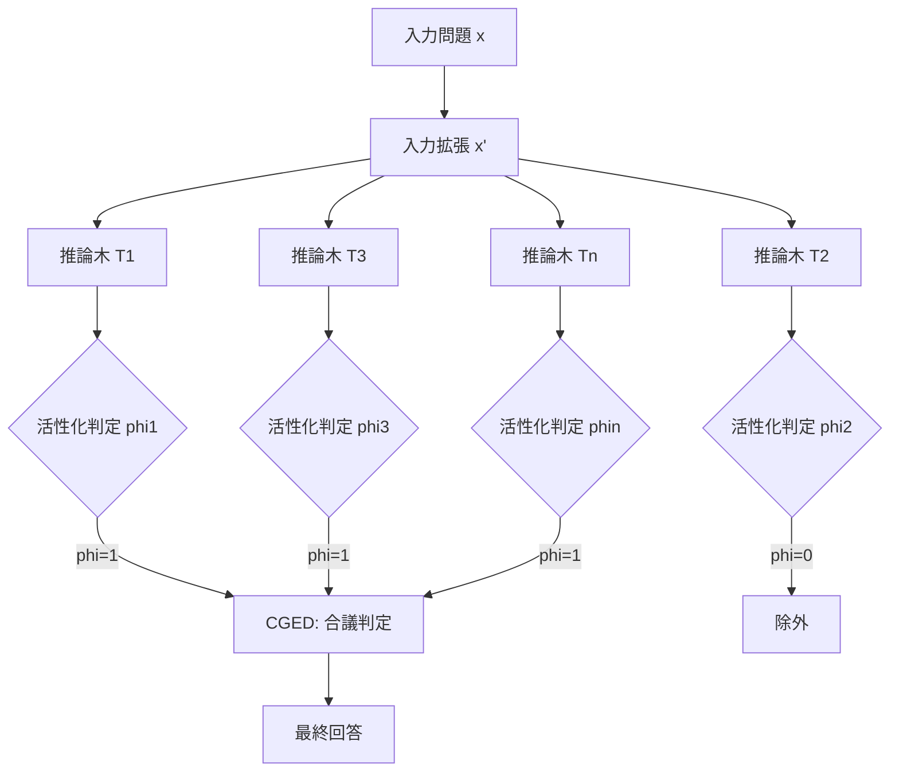

## 論文概要

本記事は [Forest-of-Thought: Scaling Test-Time Compute for Enhancing LLM Reasoning](https://arxiv.org/abs/2412.09078) (ICML 2025) の解説記事です。

Forest-of-Thought（FoT）は、複数の推論木を統合し合議的な意思決定を行うことで、LLMの複雑な論理問題の解決能力を向上させるフレームワークである。従来のChain-of-Thought（CoT）やTree-of-Thoughts（ToT）が単一パスの推論に依存し、誤った推論経路を再検討できないという制約を抱えていたのに対し、FoTはスパース活性化戦略、動的自己修正機構、合議ベースの専門家判定（CGED）を組み合わせることで、推論精度と計算効率の両立を実現している。

この記事は [Zenn記事: Tree of Thoughts×MCTSでLLM推論の正答率を向上させる実装ガイド](https://zenn.dev/0h_n0/articles/9b095a0901981e) の深掘りです。

## 情報源

- **会議名**: ICML 2025（42nd International Conference on Machine Learning）
- **発表期間**: 2025年7月13-19日
- **掲載**: Proceedings of Machine Learning Research, Volume 267, pp.4253-4267
- **URL**: [https://proceedings.mlr.press/v267/bi25a.html](https://proceedings.mlr.press/v267/bi25a.html)
- **arXiv**: [2412.09078](https://arxiv.org/abs/2412.09078)（v5, 2025年4月1日）
- **著者**: Zhenni Bi, Kai Han, Chuanjian Liu, Yehui Tang, Yunhe Wang
- **コード**: [iamhankai/Forest-of-Thought](https://github.com/iamhankai/Forest-of-Thought)

## カンファレンス情報

ICML（International Conference on Machine Learning）は機械学習分野の最高峰国際会議の一つであり、NeurIPS、ICLRと並んでトップティアに位置付けられる。2025年はウィーン（オーストリア）で開催された。本論文はPMLR Volume 267に収録されており、test-time compute scalingというLLM推論の中核的テーマを扱った研究として注目される。

## 背景と動機

LLMの推論能力を向上させるアプローチとして、Chain-of-Thought（CoT）は中間ステップを逐次生成することで推論を改善したが、単一パスのため誤りが伝播すると回復が困難である。Tree-of-Thoughts（ToT）は推論を木構造に拡張し、幅優先・深さ優先探索で複数の候補を評価できるようにしたが、単一の推論木に依存するため、木の構造そのものに偏りがあると最適解に到達しにくい。

著者らはこの課題に対して、単一の推論木ではなく複数の推論木を「森（Forest）」として統合し、各木の推論結果を合議で集約するアプローチを提案している。この設計の核心は、test-time computeのスケーリングにある。推論木の数を増やすことで精度が向上するというスケーリング則に従う性質が確認されており、計算資源の追加投入に対して予測可能なリターンが得られる点が従来手法との差別化要素となっている。

## 主要な貢献

- **複数推論木の統合（Forest構造）**: 各推論木が独立に入力から推論を行い、集合知として最終解を導出する。単一木の構造的バイアスを緩和できる。
- **スパース活性化戦略**: 全ての推論木を最終判定に使うのではなく、有効な推論パスのみを選択的に活性化することで、計算効率を維持しつつ精度を向上させる。
- **動的自己修正機構**: 推論の各ステップでlogitスコアを監視し、閾値を下回った場合にリアルタイムで修正を行う。事前定義された数学的ルールも活用し、推論の信頼性を高める。
- **合議誘導型専門家判定（CGED）**: 多数決とLLMによる専門家評価を組み合わせた最終回答の選定メカニズム。バイアスの低減と精度の向上を両立する。

## 技術的詳細

### Forest構造の定式化

FoTでは$n$本の推論木$T_1, T_2, \dots, T_n$を構築する。各推論木$T_i$は拡張された入力$\varepsilon(x)$に対して独立に推論を行い、結果$s_i$を生成する。

$$
s_i = T_i(\varepsilon(x)), \quad i \in \{1, 2, \dots, n\}
$$

ここで、
- $x$: 元の入力問題
- $\varepsilon(\cdot)$: 入力拡張関数（後述）
- $T_i$: $i$番目の推論木
- $s_i$: $i$番目の推論木の出力

各推論木は層（layer）ごとに処理を進める。層$l$での各ノード$j$の出力は以下で定義される。

$$
o_{i,l,j} = \text{LLM}(p_{i,l,j})
$$

ここで$p_{i,l,j}$は推論木$T_i$の層$l$、ノード$j$におけるプロンプトである。

### 入力データ拡張

推論の多様性と精度を向上させるため、知識ベース$\mathcal{B}$から類似事例を検索して入力に付加する。

$$
i_{\max} = \arg\max_{k} \text{Sim}(x, \mathcal{B}_k)
$$

$$
x' = \mathcal{B}_{i_{\max}} \oplus x
$$

ここで、
- $\mathcal{B}_k$: 知識ベース中の$k$番目の事例
- $\text{Sim}(\cdot, \cdot)$: 類似度関数
- $\oplus$: 連結演算子
- $x'$: 拡張された入力

これはRetrieved Augmented Generation（RAG）と類似の機構であり、関連する解法例をfew-shotとして推論木に提供することで、各木の推論品質を底上げする。

### スパース活性化戦略

全ての推論木が有効な結果を返すとは限らない。FoTでは活性化指標$\varphi_i$を導入し、各木の最終判定への参加を制御する。

$$
\varphi_i = \begin{cases} 1 & \text{if all layers of } T_i \text{ produce valid outputs} \\ 0 & \text{otherwise} \end{cases}
$$

全層で有効な出力を生成した推論木のみが$\varphi_i = 1$となり、最終的な合議に参加する。これにより、途中で推論が破綻した木が最終判定を汚染することを防ぐ。

著者らは、活性化された部分木の数と精度の間に予測可能かつ正の相関関係があると報告しており、これはスケーリング則の原則と整合する性質である。

### 動的自己修正機構

推論の各ステップにおいて、LLMの出力logitスコアを監視する。スコアが閾値$\tau$を下回った場合、修正メカニズムを起動する。

著者らの実験（GSM8Kベンチマーク）では、閾値$\tau = 0.5$が最適であると報告されている。$\tau = 0.3$では修正不足（87.34%）、$\tau = 0.6$では過剰修正（88.02%）が生じ、$\tau = 0.5$で90.14%の最高精度を達成している。

修正手法としては、事前定義された数学的ルール（算術演算の検証など）による即時修正と、LLMへの再プロンプトによる修正の2段階がある。これにより、明確なルールで検出できるエラーは高速に修正し、より複雑なエラーはLLMの再推論で対処する。

### 合議誘導型専門家判定（CGED）

活性化された推論木$\{T_i \mid \varphi_i = 1\}$の出力を集約する際、単純な多数決だけでなくLLMによる専門家評価を組み合わせる。



CGEDでは、まず活性化された木の出力に対して多数決を行い、候補回答を絞り込む。次に、LLMを専門家として各候補の妥当性を評価させ、最終回答を選定する。この2段階の判定により、多数決のみでは見逃しやすい質的な差異も考慮した判定が可能となる。

### アルゴリズムの全体像

FoTのアルゴリズムは以下のように動作する。

1. 入力$x$を知識ベースで拡張し$x'$を生成
2. $n$本の推論木を並列に構築
3. 各木の各層で推論を実行し、logitスコアが閾値以下なら自己修正を適用
4. 全層で有効な出力を生成した木のみ活性化（$\varphi_i = 1$）
5. 活性化された木の出力をCGEDで集約し最終回答を決定
6. いずれかの木が正解に到達した時点で早期終了（計算資源の節約）

## 実装のポイント

FoTの実装では以下の点に注意が必要である。

```python
from __future__ import annotations

from dataclasses import dataclass, field
from typing import Any


@dataclass
class ReasoningNode:
    """推論木の各ノード。"""
    prompt: str
    output: str = ""
    logit_score: float = 0.0
    children: list[ReasoningNode] = field(default_factory=list)


@dataclass
class ReasoningTree:
    """1本の推論木。"""
    tree_id: int
    root: ReasoningNode | None = None
    is_active: bool = True
    final_answer: str = ""


def run_forest_of_thought(
    problem: str,
    n_trees: int = 4,
    threshold: float = 0.5,
    knowledge_base: list[dict[str, Any]] | None = None,
) -> str:
    """FoTパイプライン全体を実行する。

    Args:
        problem: 入力問題
        n_trees: 推論木の数
        threshold: 自己修正の閾値
        knowledge_base: 類似事例の知識ベース

    Returns:
        最終回答
    """
    # Step 1: 入力拡張（知識ベースから類似事例を検索）
    enhanced_input = _augment_input(problem, knowledge_base)

    # Step 2: n本の推論木を構築・実行
    trees: list[ReasoningTree] = []
    for i in range(n_trees):
        tree = _build_reasoning_tree(i, enhanced_input, threshold)
        trees.append(tree)

    # Step 3: スパース活性化（有効な木のみ選択）
    active_trees = [t for t in trees if t.is_active]

    # Step 4: CGED（多数決 + LLM専門家評価）
    answer_counts: dict[str, int] = {}
    for tree in active_trees:
        ans = tree.final_answer
        answer_counts[ans] = answer_counts.get(ans, 0) + 1

    sorted_candidates = sorted(
        answer_counts.items(), key=lambda x: x[1], reverse=True
    )
    top_candidates = [c[0] for c in sorted_candidates[:3]]
    return _llm_expert_evaluate(top_candidates)
```

実装上の重要ポイントは以下の通りである。

- **推論木の並列実行**: 各推論木は独立に動作するため、非同期またはマルチスレッドで並列実行可能。ただしLLM APIのレートリミットに注意が必要。
- **閾値$\tau$のチューニング**: 著者らの実験では$\tau = 0.5$が最適だが、タスクやモデルに応じた調整が必要である。低すぎると修正不足、高すぎると過剰修正によるオーバーヘッドが生じる。
- **知識ベースの構築**: 入力拡張に用いる知識ベースは、対象タスクに関連する高品質な事例を事前に収集しておく必要がある。ベクトル検索（FAISS等）を用いた類似事例の高速検索が推奨される。
- **早期終了の実装**: いずれかの木が正解到達を判定できた時点で残りの木を打ち切ることで、計算コストを大幅に削減できる。

## Production Deployment Guide

### AWS実装パターン（コスト最適化重視）

FoTは複数のLLM推論を並列実行するため、計算コストが単一推論の$n$倍（$n$: 推論木数）になりうる。以下にトラフィック量別の推奨構成を示す。コスト試算は2026年9月時点のAWS ap-northeast-1（東京）リージョンの概算値であり、実際のコストはトラフィックパターンやバースト使用量により変動する。最新料金はAWS料金計算ツールで確認を推奨する。

**トラフィック量別の推奨構成**:

| 構成 | トラフィック | アーキテクチャ | 月額概算 |
|------|------------|--------------|---------|
| Small | ~100 req/日 | Lambda + Bedrock | $100-300 |
| Medium | ~1000 req/日 | ECS Fargate + Bedrock | $800-2,000 |
| Large | 10000+ req/日 | EKS + Spot + SageMaker | $5,000-15,000 |

**Small構成の詳細**: Lambda（メモリ1024MB, タイムアウト300秒）でオーケストレーション、Bedrockで推論木ごとのLLM呼び出し、DynamoDBで知識ベース格納。推論木4本の場合、1リクエストあたりBedrock API呼び出しが20-40回（各木5-10層）となるため、Batch APIの活用で50%のコスト削減が見込める。

**コスト削減テクニック**:
- Bedrock Batch API使用で50%削減（非リアルタイム処理向け）
- Prompt Caching有効化で30-90%削減（同一プロンプトプレフィックスの再利用）
- スパース活性化による早期終了で不要なLLM呼び出しを削減
- 推論木数$n$をタスク難易度に応じて動的に調整（簡単な問題は$n=2$、難しい問題は$n=8$）

### Terraformインフラコード

**Small構成（Serverless）**:

```hcl
# Forest-of-Thought Serverless構成: Lambda + Bedrock + DynamoDB
terraform {
  required_version = ">= 1.9"
  required_providers {
    aws = { source = "hashicorp/aws", version = "~> 5.60" }
  }
}

provider "aws" { region = "ap-northeast-1" }

# IAMロール（最小権限: Bedrock + DynamoDB + CloudWatch Logs）
resource "aws_iam_role" "fot_lambda" {
  name               = "fot-lambda-role"
  assume_role_policy = jsonencode({
    Version = "2012-10-17"
    Statement = [{ Action = "sts:AssumeRole", Effect = "Allow",
      Principal = { Service = "lambda.amazonaws.com" } }]
  })
}

# 知識ベース用DynamoDB（On-Demand課金）
resource "aws_dynamodb_table" "knowledge_base" {
  name         = "fot-knowledge-base"
  billing_mode = "PAY_PER_REQUEST"
  hash_key     = "task_type"
  range_key    = "example_id"
  attribute { name = "task_type"; type = "S" }
  attribute { name = "example_id"; type = "S" }
  server_side_encryption { enabled = true }
}

# FoTオーケストレーションLambda
resource "aws_lambda_function" "fot_orchestrator" {
  function_name = "fot-orchestrator"
  runtime       = "python3.12"
  handler       = "handler.lambda_handler"
  role          = aws_iam_role.fot_lambda.arn
  timeout       = 300  # 推論木並列実行のため長めに設定
  memory_size   = 1024
  environment {
    variables = {
      NUM_TREES            = "4"
      CORRECTION_THRESHOLD = "0.5"
      BEDROCK_MODEL_ID     = "anthropic.claude-sonnet-4-20250514"
    }
  }
  tracing_config { mode = "Active" }
}
```

**Large構成（Container）**: EKS + Karpenter（Spot優先）で構成する。Karpenter NodePoolでSpot Instancesを優先し、c6i/c6a/c5系の2xlargeインスタンスを使用する。AWS Budgetsで月額$5,000の80%到達時にSNSアラートを送信する。

### 運用・監視設定

**CloudWatch Logs Insightsクエリ（1時間あたりのAPI呼び出し・トークン使用量を集計）**:

```
fields @timestamp, @message
| filter @message like /bedrock/
| stats count() as api_calls, sum(input_tokens) as total_input, sum(output_tokens) as total_output by bin(1h)
| sort @timestamp desc
```

**X-Rayトレーシング + CloudWatchアラーム（Python）**:

```python
import boto3
from aws_xray_sdk.core import xray_recorder, patch_all

# X-Ray: boto3自動計装で推論木ごとのレイテンシを可視化
xray_recorder.configure(service="fot-orchestrator")
patch_all()

# CloudWatch: Bedrockトークン使用量スパイク検知
cloudwatch = boto3.client("cloudwatch", region_name="ap-northeast-1")
cloudwatch.put_metric_alarm(
    AlarmName="fot-bedrock-token-spike",
    MetricName="InputTokenCount",
    Namespace="AWS/Bedrock",
    Statistic="Sum",
    Period=3600,
    EvaluationPeriods=1,
    Threshold=500000,
    ComparisonOperator="GreaterThanThreshold",
    AlarmActions=["arn:aws:sns:ap-northeast-1:ACCOUNT:fot-alerts"],
)
```

Cost Explorer APIで日次コストレポートを取得し、Bedrock/Lambda/EKSのコストが$100/日を超過した場合にSNS通知を送信する構成を推奨する。

### コスト最適化チェックリスト

**アーキテクチャ選択**:
- [ ] トラフィック量に応じた構成選択（Small: Serverless / Medium: Hybrid / Large: Container）
- [ ] 推論木数$n$をタスク難易度に応じて動的調整

**リソース最適化**:
- [ ] EC2/EKS: Spot Instances優先（最大90%削減）
- [ ] Reserved Instances: 1年コミットで最大72%削減
- [ ] Savings Plans: コンピューティング全般で最大66%削減
- [ ] Lambda: メモリサイズ最適化（1024MBを基準にPower Tuningで調整）
- [ ] EKS: Karpenterでアイドル時自動スケールダウン

**LLMコスト削減**:
- [ ] Bedrock Batch API使用（非リアルタイムで50%削減）
- [ ] Prompt Caching有効化（同一プレフィックスで30-90%削減）
- [ ] モデル選択ロジック（簡単な問題はHaiku、難しい問題はSonnet）
- [ ] トークン数制限（max_tokens設定で無駄な生成を抑制）
- [ ] 早期終了による不要なLLM呼び出し削減

**監視・アラート**:
- [ ] AWS Budgets設定（月額予算の80%でアラート）
- [ ] CloudWatchアラーム（トークンスパイク検知）
- [ ] Cost Anomaly Detection有効化
- [ ] 日次コストレポート（SNS通知）

**リソース管理**:
- [ ] 未使用リソース削除（未使用Lambda関数、古いECRイメージ）
- [ ] タグ戦略（Project/Environment/CostCenterタグ）
- [ ] S3ライフサイクルポリシー（ログ自動削除）
- [ ] 開発環境の夜間・週末停止
- [ ] NAT Gateway不使用構成の検討（VPCエンドポイント活用）

## 実験結果

著者らは複数のベンチマークでFoTの性能を検証している。

### Game of 24

24ゲーム（4つの数字と四則演算で24を作る問題）95問での結果を以下に示す（論文Table 1相当）。

| 手法 | 成功率 |
|------|--------|
| Input-Output (IO) | 10.22% |
| Chain-of-Thought | 4.38% |
| Tree-of-Thoughts (b=5) | 74.00% |
| **FoT (n=8)** | **96.84%** |

著者らは、FoTがToTに対して22.84ポイントの改善を達成したと報告している。CoTの成功率が極めて低いのは、Game of 24が試行錯誤を要する探索問題であるためであり、単一パスの推論では解空間を十分に探索できないことを示している。

### 数学推論ベンチマーク

GSM8K、MATH、AIME 2024での結果（論文Table 2, 3相当）。

| ベンチマーク | FoT + QwQ-32B | rStar-Math | GPT-4o |
|------------|--------------|------------|--------|
| GSM8K | 97.33% | 95.20% | 92.90% |
| MATH | 91.20% | - | - |
| AIME 2024 | 53.33% | 6.66% | - |

著者らは、FoTがGSM8KでGPT-4oを4.43ポイント上回り、AIME 2024ではrStar-Mathに対して46.67ポイントの大差をつけたと報告している。MATHベンチマークでは難易度レベル全体で一貫して約10%の改善が得られたとしている。

### アブレーションスタディ

Game of 24（Llama3-8B）における各コンポーネントの寄与（論文Table 4相当）。

| 構成 | 精度 | LLM呼び出し回数 |
|------|------|---------------|
| Baseline (BoN) | 10.58% | - |
| + Self-correction | 60.24% | - |
| + Input enhancement | 77.98% | - |
| + Sparse activation | 77.98% | 26.99 |

著者らは、自己修正機構が最大の寄与（+49.66ポイント）を持ち、入力拡張がさらに+17.74ポイントの改善をもたらすと報告している。スパース活性化は精度を維持しつつLLM呼び出し回数を削減する効果がある。

## 実運用への応用

FoTの実運用への応用にあたり、以下の点を考慮する必要がある。

**適用が有効なユースケース**:
- 数学的推論や論理パズルなど、正解が明確に検証可能なタスク
- 高精度が要求される意思決定支援（医療診断の候補生成、法的判断の補助など）
- バッチ処理で許容されるレイテンシ（リアルタイム対話には不向き）

**レイテンシとコストのトレードオフ**: 推論木$n$本を並列実行するため、APIレートリミット内であればレイテンシは単一木とほぼ同等だが、コストは$n$倍となる。スパース活性化と早期終了により実効コストは抑制可能である。Zenn記事で解説されているTree of Thoughts + MCTSのアプローチと比較すると、FoTは木構造の探索戦略を複数の独立した木に分散させることで、単一木の探索深度に依存しない多様な推論パスの確保を実現している。

**段階的導入の提案**: まず$n=2$の小規模Forest構成で既存のCoTパイプラインを拡張し、精度改善とコスト増加のバランスを計測した上で$n$を段階的に増やす方法が現実的である。

## 関連研究

- **Chain-of-Thought Prompting** (Wei et al., 2022): 中間推論ステップを明示的に生成する手法。FoTの各推論木はCoTを基盤としており、CoTの拡張と位置付けられる。
- **Tree of Thoughts** (Yao et al., 2023): 推論を木構造に拡張し、幅優先・深さ優先探索で複数パスを評価する手法。FoTは複数のToTを統合するメタ手法として位置付けられる。Zenn記事ではToTとMCTSの組み合わせを詳しく解説している。
- **Graph of Thoughts** (Besta et al., 2024): 推論をDAG構造に拡張し、思考の合成や洗練を可能にする手法。FoTはグラフではなく森（複数の独立した木）というアプローチで多様性を確保している。
- **rStar-Math** (Microsoft, 2024): MCTSベースの数学推論フレームワーク。FoTはAIME 2024で大幅に上回る結果を示している。

## まとめ

Forest-of-Thoughtは、単一の推論木の限界を複数木の合議で克服するフレームワークである。スパース活性化による計算効率の維持、動的自己修正による推論品質の向上、CGEDによる集合知の活用という3つの技術的柱が、Game of 24で96.84%、GSM8Kで97.33%という高い精度を支えている。test-time computeのスケーリングという観点から、推論木数と精度の間に予測可能な正の相関関係が確認されている点は、計算資源の投入計画を立てやすくする実務上の利点でもある。今後は、推論木間の情報共有やより動的な木構造の生成といった方向への発展が考えられる。

## 参考文献

- **Conference URL**: [https://proceedings.mlr.press/v267/bi25a.html](https://proceedings.mlr.press/v267/bi25a.html)
- **arXiv**: [https://arxiv.org/abs/2412.09078](https://arxiv.org/abs/2412.09078)
- **Code**: [https://github.com/iamhankai/Forest-of-Thought](https://github.com/iamhankai/Forest-of-Thought)
- **Related Zenn article**: [https://zenn.dev/0h_n0/articles/9b095a0901981e](https://zenn.dev/0h_n0/articles/9b095a0901981e)
