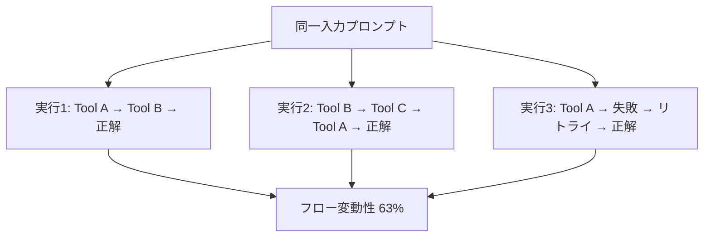
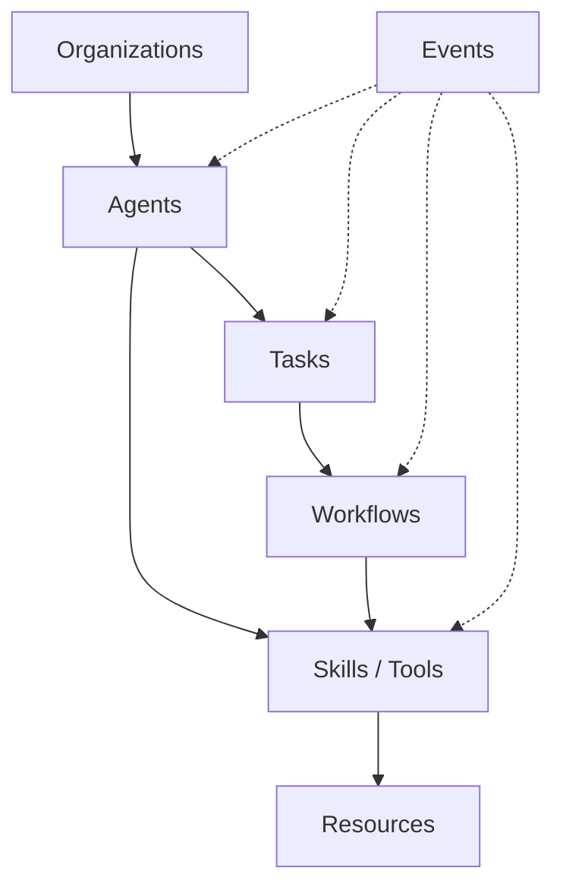

本記事は [Beyond Black-Box Benchmarking: Observability, Analytics, and Optimization of Agentic Systems](https://arxiv.org/abs/2503.06745) の解説記事です。

## 論文概要（Abstract）

LLMベースのマルチエージェントシステムは非決定的な実行特性を持ち、同一入力に対しても異なる実行パスやツール呼び出しシーケンスを生成する。著者らは従来のブラックボックス的ベンチマーク（最終的な正解率のみで評価する手法）では不十分であると主張し、エージェントシステムの内部動作を観測・分析・最適化するためのフレームワークを提案している。具体的には、7つのコアエンティティから構成されるエージェントモデル、OpenTelemetry標準を拡張した観測性機構、3層のAnalytics分類体系、そしてエージェント分析システム自体を評価する初のベンチマークABBenchを提示している。

この記事は [Zenn記事: LangSmith Online Evaluatorで本番エージェントの品質を自動監視する](https://zenn.dev/0h_n0/articles/2639c195b720d0) の深掘りです。

## 情報源

- **arXiv ID**: 2503.06745
- **URL**: [https://arxiv.org/abs/2503.06745](https://arxiv.org/abs/2503.06745)
- **著者**: Dany Moshkovich, Hadar Mulian, Sergey Zeltyn, Natti Eder, Inna Skarbovsky, Roy Abitbol（IBM Research - Israel）
- **発表年**: 2025
- **分野**: cs.AI, cs.MA

## 背景と動機（Background & Motivation）

LLMベースのエージェントシステムは、従来のソフトウェアとは根本的に異なる特性を持つ。決定的なプログラムでは同一入力に対して常に同じ実行パスが得られるが、エージェントシステムでは温度パラメータやプロンプトの微妙な差異により、実行フローが大きく変動する。

著者らは38名の実務者を対象にした調査を実施している（論文Section 8.1）。80%が非決定的実行を主要課題と認識し、77%が根本原因の診断に苦労、66%がエージェントの指示不遵守、63%が不適切なツール選択を経験していると報告されている。

従来のベンチマークは最終正解率のみを評価しており、実行プロセス（ツール選択順序、コスト等）は対象外であった。この「ブラックボックス」評価の限界が本研究の出発点である。



## 主要な貢献（Key Contributions）

- **貢献1: Core Entities Framework** — エージェントシステムを7つのコアエンティティ（Resources, Tools, Workflows, Tasks, Agents, Organizations, Events）で形式化した概念モデル。フレームワーク非依存で、LangChain、AutoGen、CrewAI等の異なる実装を統一的に記述できる。
- **貢献2: Observability Extension** — OpenTelemetry標準をGenAI Eventsで拡張し、エージェントのライフサイクル（creation, update, start, end, failure）をスパンにバインドして追跡する仕組み。既存のトレーシング基盤との統合が可能。
- **貢献3: Analytics Taxonomy** — エージェント分析を3つのカテゴリ（Passive, Exploratory, Interventional）に体系化。受動的な自動インサイトから能動的なシステム変更まで段階的に分類した。
- **貢献4: ABBench** — エージェント分析システム自体を評価する初のベンチマーク。30のログセットとGround Truthアノテーションを提供し、分析ツールの精度を定量的に測定できる。

## 技術的詳細（Technical Details）

### Core Entities Framework

著者らが提案するエージェントモデルは、以下の7つのコアエンティティで構成される（論文Figure 2）。



**Resources**: 入出力データの抽象化（テキスト、画像、コード、テンプレート等）。**Tools**: 非決定的な動作を持つプログラム単位（LLM呼び出し、Web検索等）。同一入力でも異なる出力を返す点が従来のコンポーネントと異なる。**Workflows**: ツール実行を管理する有向グラフ。**Tasks**: pre/post-conditionとフォールバック戦略を持つ離散的作業単位。**Agents**: ツールとスキルを組み合わせて自律的に実行パスを決定する主体。**Organizations**: マルチエージェント協調構造（階層型、フラット型、混合型）。**Events**: 各エンティティのライフサイクル（creation, update, start, end, failure）を捕捉する監視用エンティティ。

### Observability Extension（OpenTelemetry拡張）

著者らはOpenTelemetry（OTel）標準をエージェント向けに拡張している。従来のOTelはHTTPリクエスト等のトレーシングに最適化されており、エージェント固有の非決定的動作の追跡には不十分であった。

拡張の核は**GenAI Events**である。OTelスパンにバインドされるイベントで、以下の4タプルで構造化される:

$$
\text{Event} = (\text{entity\_type}, \text{lifecycle\_phase}, \text{attributes}, \text{timestamp})
$$

ここで、$\text{entity\_type}$ はCore Entitiesのいずれか、$\text{lifecycle\_phase}$ は `creation` / `start` / `end` / `failure` 等、$\text{attributes}$ はトークン数やモデルID等のメタデータである。

この設計により、LangChain、AutoGen、CrewAI等の異なるフレームワーク間で実行トレースを統一フォーマットで収集・比較できる。LangSmithとの違いは、OTel標準準拠によりJaeger、Grafana Tempo等の既存バックエンドに直接送信できる点にある。

```python
from opentelemetry import trace

tracer = trace.get_tracer("agent-system")


def instrument_agent_call(
    agent_id: str, task_description: str, tools: list[str],
) -> dict:
    """エージェント呼び出しをOTelスパンで計装する."""
    with tracer.start_as_current_span("agent.execute") as span:
        span.set_attribute("agent.id", agent_id)
        span.add_event("gen_ai.agent.creation", attributes={
            "agent.id": agent_id,
            "agent.task": task_description,
            "agent.available_tools": len(tools),
        })
        result = execute_task(task_description, tools)
        span.add_event("gen_ai.agent.end", attributes={
            "agent.tokens_used": result.get("total_tokens", 0),
            "agent.tools_called": result.get("tools_called", 0),
            "agent.status": "success" if result.get("success") else "failure",
        })
        return result
```

### Analytics Taxonomy（分析体系）

著者らはエージェント分析を3つのカテゴリに体系化している（論文Section 6）。

**1. Passive Analytics（受動的分析）**: ユーザーの介入なしに動作する自動分析。タスクフロー可視化、コスト・レイテンシメトリクス集計、異常検知を含む。

**2. Exploratory Analytics（探索的分析）**: ユーザー駆動の調査。根本原因分析、トレース間比較、フロー最適化パターン（タスク分解・並列実行・マージ）の発見に使用する。

**3. Interventional Analytics（介入的分析）**: 実行中のシステムへのアクティブな変更。強化モニタリング、フィードバックストリーミング、温度パラメータの動的調整、タスクインジェクション、コンポーネントのホットスワップを含む。

LangSmith Online EvaluatorはPassive Analytics（自動スコアリング）とExploratory Analytics（トレース調査）をカバーしており、本論文の分類体系と整合する。

### ABBench（エージェント分析ベンチマーク）

ABBenchは「エージェントそのもの」ではなく「エージェントを分析するシステム」を評価するベンチマークである（論文Section 7）。従来のベンチマーク（SWE-bench, GAIA, WebArena等）がエージェントのタスク遂行能力を測定するのに対し、ABBenchはエージェントの実行ログから有用な分析結果を抽出できるかを測定する。

**データセット構成**: 30のエージェント実行ログで構成される。各ログにはGround Truthアノテーション（タスク境界、ツール呼び出しの意図、失敗原因等）が付与されている。

**評価指標**: 分析システムが以下のタスクをどの程度正確に遂行できるかを測定する。

$$
\text{Accuracy}_{\text{task}} = \frac{\text{正しく識別されたタスク数}}{\text{Ground Truth タスク数}}
$$

$$
\text{Precision}_{\text{tool}} = \frac{\text{正しいツール目的の推定数}}{\text{推定されたツール目的の総数}}
$$

著者らはTAMAS（Task-oriented Analytics for Multi-Agentic Systems）という分析システムのケーススタディを報告しており、ABBenchでの精度は60%であった（論文Section 7.2）。この数値は、エージェント分析がまだ発展途上の課題であることを示している。

## 実装のポイント（Implementation）

**OpenTelemetry統合の設計**: エージェントフレームワークに計装を組み込む際は、スパンの粒度設計が重要である。著者らは「1タスク = 1スパン」を基本単位とし、ツール呼び出しを子スパンとしてネストする構造を推奨している。スパンが細かすぎるとトレースの可読性が低下し、粗すぎると根本原因分析が困難になる。

**フロー変動性の定量化**: 実行フローを有向グラフとして表現し、グラフ編集距離で変動性を測定する。著者らの実験では変動係数が63%に達しており（論文Table 3）、決定的テストケースの設計が困難であることを定量的に示している。

**イベント設計**: GenAI Eventsのattributesにはトークン数、モデルID、ツール名を必須とし、プロンプト全文はハッシュ値のみ記録して別ストアから取得する設計が実用的である。

**LangSmithとの使い分け**: LangSmithはLangChainエコシステム内の観測性に強みを持つ。本論文の手法はフレームワーク非依存であり、複数フレームワーク併用環境やカスタム実装の監視に適している。

## Production Deployment Guide

### AWS実装パターン（コスト最適化重視）

エージェント観測性基盤をAWSで構築する際の構成を、トラフィック量別に整理する。以下のコスト試算は2026年9月時点のAWS ap-northeast-1（東京）リージョン料金に基づく概算値であり、実際のコストはトラフィックパターンやリージョンにより変動する。

| 構成 | トラフィック | 主要サービス | 月額概算 |
|------|------------|------------|---------|
| Small (Serverless) | ~100 req/日 | Lambda + DynamoDB + CloudWatch | $50-150 |
| Medium (Hybrid) | ~1,000 req/日 | ECS Fargate + OpenSearch Serverless + ALB | $300-800 |
| Large (Container) | 10,000+ req/日 | EKS + Grafana Tempo + Prometheus + Spot(m6i.xlarge x3) | $2,000-5,000 |

Small構成ではLambda + OTel Collector LambdaレイヤーでトレースをDynamoDBに格納する。Medium構成ではOpenSearch Serverlessでダッシュボード可視化が可能。Large構成ではGrafana TempoをOTLPバックエンドに使用し、Spot Instancesで最大90%のコスト削減が見込める。

### Terraformインフラコード

#### Small構成（Lambda + DynamoDB + CloudWatch）

```hcl
terraform {
  required_version = ">= 1.9.0"
  required_providers { aws = { source = "hashicorp/aws", version = "~> 5.60" } }
}
provider "aws" { region = "ap-northeast-1" }

resource "aws_iam_role" "otel_collector_lambda" {
  name = "agent-otel-collector-role"
  assume_role_policy = jsonencode({
    Version = "2012-10-17"
    Statement = [{ Action = "sts:AssumeRole", Effect = "Allow",
                    Principal = { Service = "lambda.amazonaws.com" } }]
  })
}

resource "aws_lambda_function" "otel_collector" {
  function_name = "agent-otel-collector"
  runtime       = "python3.12"
  handler       = "collector.handler"
  role          = aws_iam_role.otel_collector_lambda.arn
  timeout       = 30
  memory_size   = 256
  architectures = ["arm64"]  # 約20%安価
  environment {
    variables = {
      DYNAMODB_TABLE = aws_dynamodb_table.agent_traces.name
      OTEL_SERVICE_NAME = "agent-observability"
    }
  }
  filename         = "collector_package.zip"
  source_code_hash = filebase64sha256("collector_package.zip")
  tracing_config { mode = "Active" }  # X-Ray計装
}

resource "aws_dynamodb_table" "agent_traces" {
  name         = "agent-traces"
  billing_mode = "PAY_PER_REQUEST"  # 低トラフィックでコスト最適
  hash_key     = "trace_id"
  range_key    = "span_id"
  attribute { name = "trace_id"; type = "S" }
  attribute { name = "span_id"; type = "S" }
  server_side_encryption { enabled = true }
  ttl { attribute_name = "ttl"; enabled = true }  # 90日で自動削除
}
variable "sns_topic_arn" { type = string }
```

#### Large構成（EKS + Karpenter + Spot）

```hcl
module "eks" {
  source          = "terraform-aws-modules/eks/aws"
  version         = "~> 20.24"
  cluster_name    = "agent-observability"
  cluster_version = "1.31"
  vpc_id          = module.vpc.vpc_id
  subnet_ids      = module.vpc.private_subnets
}

# Karpenter: Spot優先で最大90%コスト削減
resource "kubectl_manifest" "observability_pool" {
  yaml_body = yamlencode({
    apiVersion = "karpenter.sh/v1", kind = "NodePool"
    metadata   = { name = "observability-pool" }
    spec = { template = { spec = {
      requirements = [
        { key = "karpenter.sh/capacity-type", operator = "In", values = ["spot", "on-demand"] },
        { key = "node.kubernetes.io/instance-type", operator = "In",
          values = ["m6i.xlarge", "m6i.2xlarge", "m7i.xlarge"] },
      ]
      nodeClassRef = { group = "karpenter.k8s.aws", kind = "EC2NodeClass", name = "default" }
    }}, limits = { cpu = "64" },
    disruption = { consolidationPolicy = "WhenEmptyOrUnderutilized" } }
  })
}

resource "aws_budgets_budget" "monthly" {
  name         = "agent-observability-monthly"
  budget_type  = "COST"
  limit_amount = "5000"
  limit_unit   = "USD"
  time_unit    = "MONTHLY"
  notification {
    comparison_operator        = "GREATER_THAN"
    threshold                  = 80
    threshold_type             = "PERCENTAGE"
    notification_type          = "ACTUAL"
    subscriber_email_addresses = [var.alert_email]
  }
}
variable "alert_email" { type = string }
```

### 運用・監視設定

**CloudWatch Logs Insights**: エージェントのトレースからフロー変動性とレイテンシを分析するクエリ。

```
fields @timestamp, trace_id, agent_id, duration_ms, tools_called
| filter event_type = "agent.end"
| stats avg(duration_ms) as avg_latency,
        percentile(duration_ms, 95) as p95,
        percentile(duration_ms, 99) as p99,
        avg(tools_called) as avg_tools
  by bin(1h)
```

**CloudWatch アラーム・X-Ray・Cost Explorer**:

```python
import boto3
from datetime import datetime, timedelta
from aws_xray_sdk.core import xray_recorder, patch_all

patch_all()  # boto3自動計装


def create_observability_alarms() -> None:
    """エージェント観測性基盤のアラームを作成する."""
    cw = boto3.client("cloudwatch", region_name="ap-northeast-1")
    cw.put_metric_alarm(
        AlarmName="agent-trace-latency-spike",
        MetricName="Duration", Namespace="AWS/Lambda",
        Statistic="p95", Period=300, EvaluationPeriods=3,
        Threshold=5000, ComparisonOperator="GreaterThanThreshold",
        AlarmActions=["arn:aws:sns:ap-northeast-1:ACCOUNT:agent-alerts"])


def generate_daily_cost_report() -> dict:
    """日次コストレポート生成。$100/日超過でSNS通知."""
    ce = boto3.client("ce", region_name="us-east-1")
    today = datetime.utcnow().strftime("%Y-%m-%d")
    yesterday = (datetime.utcnow() - timedelta(days=1)).strftime("%Y-%m-%d")
    resp = ce.get_cost_and_usage(
        TimePeriod={"Start": yesterday, "End": today},
        Granularity="DAILY", Metrics=["UnblendedCost"],
        GroupBy=[{"Type": "DIMENSION", "Key": "SERVICE"}])
    total = sum(float(g["Metrics"]["UnblendedCost"]["Amount"])
                for r in resp["ResultsByTime"] for g in r["Groups"])
    if total > 100:
        boto3.client("sns", region_name="ap-northeast-1").publish(
            TopicArn="arn:aws:sns:ap-northeast-1:ACCOUNT:agent-observability-cost",
            Subject=f"Agent Observability Cost: ${total:.2f}/day",
            Message=f"${total:.2f}")
    return {"total_cost": total}
```

### コスト最適化チェックリスト

**アーキテクチャ選択**: トラフィック量で構成選択（~100 req/日: Serverless、~1,000 req/日: Hybrid、10,000+ req/日: Container）。トレース保存期間とクエリ頻度でストレージ選択（DynamoDB / OpenSearch / Grafana Tempo）。

**リソース最適化**: Spot Instances優先（最大90%削減）/ Reserved Instances 1年コミット（最大72%削減）/ Lambda ARM64（約20%削減）/ Karpenterでアイドル時スケールダウン

**LLMコスト削減**: Bedrock Batch API（50%削減）/ Prompt Caching（30-90%削減）/ 分析用LLMは軽量モデルにルーティング / max_tokens制限

**監視・アラート**: AWS Budgets（80%/100%段階アラート）/ CloudWatchアラーム / Cost Anomaly Detection / 日次Cost Explorerレポート

**リソース管理**: Trusted Advisorで未使用リソース削除 / タグ戦略（`project:agent-observability`）/ DynamoDB TTLで自動削除 / S3ライフサイクルポリシー / 開発環境夜間停止

## 実験結果（Results）

著者らはエージェントシステムの非決定的特性を定量的に検証している（論文Section 8）。

### フロー変動性

同一入力に対して複数回実行した際のフロー変動性をグラフ編集距離で測定した結果（論文Table 3より）:

| 入力タイプ | フロー変動性 | 精度分散 | コスト分散 | 実行時間分散 |
|-----------|------------|---------|-----------|------------|
| Pure math | 63% | - | 42% | 46% |
| Natural language | 64% | - | - | - |
| Mixed inputs | - | 19% | 42% | 46% |

フロー変動性63-64%は同一プロンプトでも実行パスの約3分の2が毎回異なることを意味し、コスト予測やSLA設計に重大な影響を与える。

### ABBenchでのTAMAS評価

TAMASのABBench精度は60%であった（論文Section 7.2）。タスク境界識別やツール目的推定で改善の余地があり、エージェント分析の自動化が依然として困難な課題であることを示している。

## 実運用への応用（Practical Applications）

**LangSmith Online Evaluatorとの統合**: Zenn記事で取り上げているOnline Evaluatorは本論文のPassive Analyticsに該当する。スコアリングルールで全トレースを自動評価する仕組みは「自動化されたインサイトと推奨」の実装例であり、本論文の分類を参照することで評価設計を体系化できる。

**マルチフレームワーク環境**: 本番環境ではLangChain、AutoGen、カスタム実装が混在する場合がある。OpenTelemetry拡張によりフレームワーク横断の統一トレースが可能になり、SaaSロックインを回避できる。

**コスト管理**: フロー変動性63%、コスト分散42%はコスト予測の困難さを示す。Interventional Analytics（動的パラメータ調整やモデルのホットスワップ）でコスト異常時にリアルタイム介入できる。

## 関連研究（Related Work）

- **OpenTelemetry GenAI Semantic Conventions**: OTel SIGが策定中のLLMアプリケーション向けセマンティック規約。本論文はこの標準に準拠しつつ、エージェント固有のエンティティモデルで拡張している。
- **AgentBench (Liu et al., 2023)**: LLMエージェントの汎用ベンチマーク。ABBenchとの違いは、AgentBenchがエージェント自体を評価するのに対し、ABBenchは分析システムを評価する点にある。
- **LangSmith / Langfuse / Arize Phoenix**: エージェント観測性の商用・OSSプラットフォーム。本論文はこれらの機能を体系的に分類し、未対応領域（Interventional Analytics）を明確にしている。
- **SWE-bench (Jimenez et al., 2024)**: エージェントのコーディング能力ベンチマーク。実行プロセスの分析は対象外。

## まとめと今後の展望

本論文はエージェント評価を「最終正解率」から「実行プロセスの観測・分析・最適化」へ拡張する枠組みを提案している。Core Entities Framework、OpenTelemetry拡張、Analytics Taxonomy、ABBenchはエージェント観測性の体系化への貢献である。

TAMAS精度60%が示すように分析の自動化は発展途上にあり、ABBenchの規模拡大とLangSmith等のプラットフォームとの標準規格統合が今後の課題である。

## 参考文献

- **arXiv**: [https://arxiv.org/abs/2503.06745](https://arxiv.org/abs/2503.06745)
- **OpenTelemetry GenAI SIG**: [https://opentelemetry.io/docs/specs/semconv/gen-ai/](https://opentelemetry.io/docs/specs/semconv/gen-ai/)
- **Related Zenn article**: [https://zenn.dev/0h_n0/articles/2639c195b720d0](https://zenn.dev/0h_n0/articles/2639c195b720d0)
