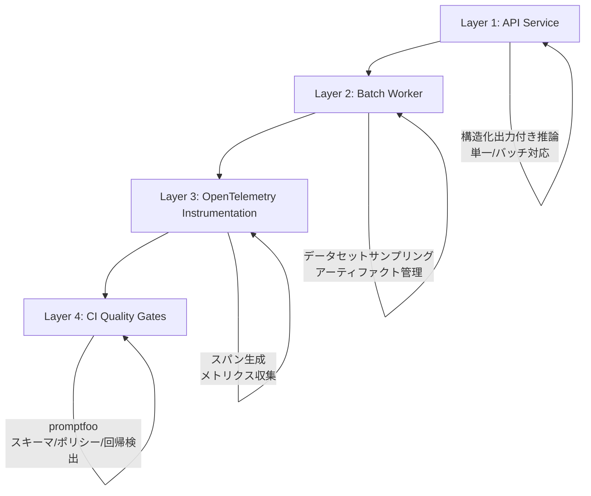

## 論文概要（Abstract）

本記事は [LLM Readiness Harness: Evaluation, Observability, and CI Gates for LLM/RAG Applications](https://arxiv.org/abs/2603.27355) の解説記事です。

Maiorano (2026) は、LLM/RAGアプリケーションの評価をデプロイ判定ワークフローに変換するフレームワーク「Readiness Harness」を提案している。このシステムは、自動ベンチマーク、OpenTelemetry観測性、CIクオリティゲートを統一的なAPIコントラクトのもとに統合し、ワークフロー成功率・ポリシー準拠・忠実度・検索ヒット率・コスト・p95レイテンシの6次元をシナリオ重み付きReadinessスコアに集約する。チケットルーティングワークフローとBEIRグラウンディングタスク（SciFact, FiQA）で162/162セルの完全なAzureマトリクスカバレッジを達成し、Readinessが単一メトリクスでは捉えられない多面的な指標であることを実証している。

この記事は [Zenn記事: LangSmith Online Evaluatorで本番エージェントの品質を自動監視する](https://zenn.dev/0h_n0/articles/2639c195b720d0) の深掘りです。

## 情報源

- **arXiv ID**: 2603.27355
- **URL**: [https://arxiv.org/abs/2603.27355](https://arxiv.org/abs/2603.27355)
- **著者**: Alexandre Cristovão Maiorano
- **発表年**: 2026（v1: 2026年3月28日、v2: 2026年5月21日改訂）
- **分野**: cs.AI, cs.CL, cs.SE

## 背景と動機（Background & Motivation）

LLM/RAGアプリケーションの本番運用では、モデル精度だけでなくレイテンシ・コスト・安全性（ポリシー準拠）を含む多次元の品質判定が求められる。しかし、従来の評価フレームワークはオフラインベンチマークに閉じており、デプロイ可否を判断するワークフローとの統合が不十分であった。HELMのようなマルチメトリクスベンチマークは包括的なスコアリングを提供するが、観測性やCIパイプラインとの接続を備えていない。一方、LangSmithやARESのような運用観測ツールは個別メトリクスの監視には有効であるが、複数次元を統合した「デプロイして良いか」の判定ロジックは提供していない。

著者はこの課題に対し、評価・観測性・CIゲートを一体化した「Readiness Harness」を提案している。評価結果が単にオフラインレポートに留まるのではなく、CIパイプラインのゲート判定に直接接続されることで、リスクの高いリリースをブロックする仕組みを実現している。

## 主要な貢献（Key Contributions）

- **シナリオ重み付きReadinessスコアの定義**: ワークフロー成功率・ポリシー準拠・忠実度・検索ヒット率・コスト・p95レイテンシの6次元を、デプロイペルソナ（Cost-first、Risk-first、SLA-first）に応じた重みで集約するスコアリング手法を提案した
- **4層アーキテクチャの設計**: ローカルAPIサービス、バッチワーカー、OpenTelemetry計装、CIクオリティゲートの4層から成る再現可能な評価フレームワークを構築した
- **回帰ゲートによるリスク遮断の実証**: チケットルーティングタスクにおいて、ポリシー違反プロンプトバリアント（$\Delta\text{policy} = -0.97$）を確実に拒否できることを示し、ハーネスが単なるスコアリングに留まらずリスキーなリリースをブロックする機能を持つことを実証した
- **162/162セルの完全マトリクスカバレッジ**: データセット・シナリオ・検索深度・シード・モデルの全組み合わせで欠損なく評価を実施し、再現性を担保した

## 技術的詳細（Technical Details）

### 4層アーキテクチャ

Readiness Harnessは以下の4層で構成される。



**Layer 1 — API Service**: ローカル推論サービスで、安定したAPIコントラクトを通じて単一ケースとバッチの両方の推論リクエストを処理する。構造化出力（JSON Schema）を強制し、後段の自動評価を可能にする。

**Layer 2 — Batch Worker**: データセットサンプリング（固定シード）、ベンチマーク実行のオーケストレーション、チェックポイント付きリザルト管理を行う。ワーカープール＋ディレイ制御でAPI負荷を調整する。

**Layer 3 — OpenTelemetry Instrumentation**: ルーティング・検索・生成・バリデーションの各処理にスパンを付与し、構造化されたトレースデータを生成する。

**Layer 4 — CI Quality Gates**: promptfooを統合し、スキーマ違反・ポリシー違反・品質回帰を自動検出する。閾値を超えたデルタが検出された場合、デプロイパイプラインをブロックする。

### Readinessスコア

Readinessスコアは、6次元の評価メトリクスをデプロイペルソナに応じた重みで加重平均した値として定義される。

$$
R = \frac{\sum_{i \in \mathcal{P}} w_i \cdot m_i}{\sum_{i \in \mathcal{P}} w_i}
$$

ここで、
- $R$: Readinessスコア（0-1の範囲）
- $w_i$: メトリクス$i$に対するシナリオ重み
- $m_i$: メトリクス$i$の正規化スコア
- $\mathcal{P}$: 当該ランに存在するメトリクスの集合（データ欠損時の監査可能性を担保）

分母を$\sum_{i \in \mathcal{P}} w_i$とすることで、一部メトリクスが計測不能な場合でも残りのメトリクスで妥当なスコアが算出される設計となっている。

### デプロイペルソナ別の重み

3つのデプロイペルソナごとに、各次元の重みが異なる。重みの合計は全ペルソナで1.0となる。

| 次元 | Cost-first | Risk-first | SLA-first |
|:---|:---:|:---:|:---:|
| Workflow（ワークフロー成功率） | 0.20 | 0.15 | 0.20 |
| Policy（ポリシー準拠） | 0.20 | 0.25 | 0.15 |
| Faithfulness（忠実度） | 0.15 | 0.20 | 0.15 |
| Retrieval Hit@k（検索ヒット率） | 0.15 | 0.15 | 0.10 |
| Cost（タスクあたりコスト） | 0.20 | 0.10 | 0.10 |
| SLA（p95レイテンシ） | 0.10 | 0.15 | 0.30 |

たとえば、SLA-firstペルソナではp95レイテンシの重みが0.30と最大であり、低レイテンシが最重要要件となるリアルタイムアプリケーション向けの評価を反映している。一方、Risk-firstではポリシー準拠（0.25）と忠実度（0.20）が重視され、安全性と正確性が最優先となる金融・医療等の領域を想定している。

### 評価6次元

1. **Workflow Success（ワークフロー成功率）**: タスク完了の正確性。チケットルーティングではT1（ルーティング精度）、T2（エスカレーション判定精度）で測定する
2. **Policy Compliance（ポリシー準拠）**: ハードゲートとして機能し、違反が検出されるとデプロイを即時ブロックする。認証情報の要求やPII抽出の試みを検出する
3. **Faithfulness/Groundedness（忠実度）**: RAGASメトリクスを使用し、生成された回答がソースドキュメントにどの程度グラウンディングされているかを測定する
4. **Retrieval Hit@k（検索ヒット率）**: 上位k件に関連ドキュメントが含まれるクエリの割合。BEIRタスクで測定する
5. **Cost（タスクあたりコスト）**: トークン使用量と公開API料金から算出されるタスク単位のコスト
6. **p95 Latency（p95レイテンシ）**: 95パーセンタイルの応答時間。SLAコンプライアンスの指標として使用する

### OpenTelemetryスパン定義

各処理ステップに対して構造化されたスパンが定義されており、トレーサビリティを確保している。

| スパン名 | 目的 | 主要属性 |
|:---|:---|:---|
| `infer` | ルート推論リクエスト | `run_id`, `dataset_id`, `pipeline_version`, `scenario`, `latency_ms`, `tokens_in/out`, `cost_usd_est` |
| `route.classify` | ルートラベル予測 | `ticket_id`（ハッシュ化）, `predicted_label`, `confidence`, `latency_ms` |
| `respond.finalize` | エスカレーション判定 | `should_escalate`, `latency_ms` |
| `rag.retrieve` | 検索ステップ | `top_k`, `index_id`, `retrieved_doc_ids`, `latency_ms` |
| `rag.generate` | LLM生成 | `model_id`, `provider`, `cache_hit`, `latency_ms` |
| `validate.policy` | ポリシーチェック | `pass`, `violation_types`, `latency_ms` |

ルートスパン`infer`が全体のトランザクションを包含し、子スパンとして分類・検索・生成・検証の各処理が記録される。`run_id`と`dataset_id`によりバッチ単位のトレース集約が可能となり、`pipeline_version`によりプロンプトバージョン間の比較が実現される。

## 実装のポイント（Implementation）

**バッチ実行とチェックポイント**: バッチワーカーはデータセットから固定シードでサンプリング（n=60）し、各アイテムに対して推論APIを呼び出す。チェックポイント機構により、中断時に途中結果を保持し再開できる。ワーカープールとディレイ制御でAPI呼び出しの負荷を調整する。

**RAGAS統合**: 忠実度（faithfulness）の測定にRAGASフレームワークを利用している。検索されたドキュメントと生成された回答の間のグラウンディングスコアを算出し、回答が検索結果に基づいているかを定量化する。

**promptfooによるCIゲート**: promptfooをCIパイプラインに組み込み、3種類の検出を自動化している。(1) スキーマ違反（無効なJSON構造）、(2) ポリシー違反（認証情報要求、PII抽出）、(3) 品質回帰（デルタ閾値超過）。デルタ閾値を超えるとパイプラインがFAILし、デプロイがブロックされる。

**合成データ生成**: テンプレートベースのベースラインデータ（4000サンプル、品質1.0000）とLLM拡張データ（500サンプル、品質0.9936、語彙多様性0.0898、ユニーク率0.3960）を組み合わせてデータセットを構築している（論文Table記載値）。

**プロンプトバージョニング**: Prompt v2では`additionalProperties: false`付きの明示的JSON Schemaを導入し、出力制約を厳格化している。これによりトークン生成量が削減され、p95レイテンシが9-11%改善したと報告されている。

## Production Deployment Guide

### AWS実装パターン（コスト最適化重視）

Readiness Harnessの評価パイプラインをAWS上で運用する際の構成を示す。LLM推論を含む評価はAPI呼び出しコストとコンピュート費用が支配的であるため、コスト管理が重要となる。以下のコスト試算は2026年9月時点のAWS ap-northeast-1（東京）リージョン料金に基づく概算値であり、実際のコストはトラフィックパターン・リージョン・バースト使用量により変動する。最新料金はAWS料金計算ツールで確認を推奨する。

**トラフィック量別の推奨構成**:

| 構成 | ユースケース | 主要サービス | 月額概算 |
|:---:|:---|:---|:---:|
| Small | 週次評価・PoC（週1-2回バッチ実行） | Lambda + S3 + DynamoDB | $50-150 |
| Medium | 日次評価（CI/CDパイプライン連携） | ECS Fargate + S3 + OpenSearch | $500-1,200 |
| Large | 継続的評価（PR毎・本番監視） | EKS + Spot + OpenTelemetry Collector | $2,000-5,000 |

**Small構成の内訳**: Lambda（評価バッチ実行、256MB x 月20回 x 平均5分 = $0.5）、S3（評価アーティファクト50GB = $1.2）、DynamoDB On-Demand（メトリクス保存、月1万書き込み = $1.3）、外部LLM API呼び出し（Azure OpenAI、月$30-100相当）。Lambdaの無料枠内で収まるケースも多い。

**コスト削減テクニック**:
- ECS Fargate Spot活用で最大70%削減
- S3 Intelligent-Tieringで評価アーティファクトのストレージコスト最適化
- DynamoDB On-Demandモードでアイドル時コストをゼロに
- OpenTelemetry Collectorのサンプリング率調整でストレージコスト削減

### Terraformインフラコード

**Small構成（Lambda + S3 + DynamoDB）**:

```hcl
# Readiness Harness評価パイプライン - Small構成
# Lambda + S3 + DynamoDB

terraform {
  required_version = ">= 1.9"
  required_providers {
    aws = {
      source  = "hashicorp/aws"
      version = "~> 5.60"
    }
  }
}

provider "aws" {
  region = "ap-northeast-1"
}

# S3: 評価アーティファクト・結果保存
resource "aws_s3_bucket" "eval_artifacts" {
  bucket = "readiness-harness-eval-${data.aws_caller_identity.current.account_id}"
}

resource "aws_s3_bucket_server_side_encryption_configuration" "eval_artifacts" {
  bucket = aws_s3_bucket.eval_artifacts.id
  rule {
    apply_server_side_encryption_by_default {
      sse_algorithm = "aws:kms"
    }
  }
}

resource "aws_s3_bucket_lifecycle_configuration" "eval_artifacts" {
  bucket = aws_s3_bucket.eval_artifacts.id
  rule {
    id     = "archive-old-runs"
    status = "Enabled"
    filter { prefix = "runs/" }
    transition {
      days          = 30
      storage_class = "GLACIER_IR"
    }
    expiration { days = 180 }
  }
}

# DynamoDB: Readinessスコア・メトリクス保存
resource "aws_dynamodb_table" "readiness_scores" {
  name         = "readiness-harness-scores"
  billing_mode = "PAY_PER_REQUEST"
  hash_key     = "run_id"
  range_key    = "scenario"

  attribute {
    name = "run_id"
    type = "S"
  }
  attribute {
    name = "scenario"
    type = "S"
  }

  server_side_encryption {
    enabled = true
  }

  point_in_time_recovery {
    enabled = true
  }
}

# IAM: Lambda実行ロール（最小権限）
resource "aws_iam_role" "eval_lambda" {
  name = "readiness-harness-lambda-role"
  assume_role_policy = jsonencode({
    Version = "2012-10-17"
    Statement = [{
      Action    = "sts:AssumeRole"
      Effect    = "Allow"
      Principal = { Service = "lambda.amazonaws.com" }
    }]
  })
}

resource "aws_iam_role_policy" "eval_lambda_policy" {
  name = "eval-lambda-access"
  role = aws_iam_role.eval_lambda.id
  policy = jsonencode({
    Version = "2012-10-17"
    Statement = [
      {
        Effect   = "Allow"
        Action   = ["s3:GetObject", "s3:PutObject", "s3:ListBucket"]
        Resource = [
          aws_s3_bucket.eval_artifacts.arn,
          "${aws_s3_bucket.eval_artifacts.arn}/*"
        ]
      },
      {
        Effect   = "Allow"
        Action   = ["dynamodb:PutItem", "dynamodb:GetItem", "dynamodb:Query"]
        Resource = aws_dynamodb_table.readiness_scores.arn
      },
      {
        Effect   = "Allow"
        Action   = ["logs:CreateLogGroup", "logs:CreateLogStream", "logs:PutLogEvents"]
        Resource = "arn:aws:logs:ap-northeast-1:*:log-group:/aws/lambda/*"
      },
      {
        Effect   = "Allow"
        Action   = ["secretsmanager:GetSecretValue"]
        Resource = aws_secretsmanager_secret.api_keys.arn
      }
    ]
  })
}

# Secrets Manager: LLM API キー管理
resource "aws_secretsmanager_secret" "api_keys" {
  name       = "readiness-harness/api-keys"
  kms_key_id = aws_kms_key.eval.arn
}

resource "aws_kms_key" "eval" {
  description             = "KMS key for Readiness Harness secrets"
  deletion_window_in_days = 7
  enable_key_rotation     = true
}

# CloudWatch: コスト監視アラーム
resource "aws_cloudwatch_metric_alarm" "eval_cost" {
  alarm_name          = "readiness-harness-cost-spike"
  comparison_operator = "GreaterThanThreshold"
  evaluation_periods  = 1
  metric_name         = "EstimatedCharges"
  namespace           = "AWS/Billing"
  period              = 86400
  statistic           = "Maximum"
  threshold           = 150
  alarm_description   = "Evaluation cost exceeds $150/day"
  alarm_actions       = [aws_sns_topic.alerts.arn]
  dimensions          = { Currency = "USD" }
}

resource "aws_sns_topic" "alerts" {
  name = "readiness-harness-alerts"
}

data "aws_caller_identity" "current" {}
```

**Large構成（EKS + OpenTelemetry Collector）**:

```hcl
# Readiness Harness評価パイプライン - Large構成
# EKS + Karpenter + OpenTelemetry Collector

module "eks" {
  source  = "terraform-aws-modules/eks/aws"
  version = "~> 20.24"

  cluster_name    = "readiness-harness-cluster"
  cluster_version = "1.31"

  vpc_id     = module.vpc.vpc_id
  subnet_ids = module.vpc.private_subnets

  cluster_endpoint_public_access = false

  eks_managed_node_groups = {
    system = {
      instance_types = ["m6i.large"]
      min_size       = 1
      max_size       = 3
      desired_size   = 2
    }
  }
}

# Karpenter: 評価ワーカーの自動スケーリング
resource "kubectl_manifest" "karpenter_eval_provisioner" {
  yaml_body = yamlencode({
    apiVersion = "karpenter.sh/v1"
    kind       = "NodePool"
    metadata   = { name = "eval-workers" }
    spec = {
      template = {
        spec = {
          requirements = [
            { key = "node.kubernetes.io/instance-type", operator = "In", values = ["m6i.xlarge", "m6i.2xlarge", "c6i.xlarge"] },
            { key = "karpenter.sh/capacity-type", operator = "In", values = ["spot", "on-demand"] },
            { key = "topology.kubernetes.io/zone", operator = "In", values = ["ap-northeast-1a", "ap-northeast-1c"] }
          ]
          nodeClassRef = { name = "default" }
        }
      }
      limits = { cpu = "64", memory = "256Gi" }
      disruption = {
        consolidationPolicy = "WhenEmptyOrUnderutilized"
        consolidateAfter    = "60s"
      }
    }
  })
}

# AWS Budgets: 月次予算アラート
resource "aws_budgets_budget" "eval_monthly" {
  name         = "readiness-harness-monthly"
  budget_type  = "COST"
  limit_amount = "5000"
  limit_unit   = "USD"
  time_unit    = "MONTHLY"

  notification {
    comparison_operator        = "GREATER_THAN"
    threshold                  = 80
    threshold_type             = "PERCENTAGE"
    notification_type          = "ACTUAL"
    subscriber_email_addresses = ["ops-team@example.com"]
  }
}

# Secrets Manager: Azure OpenAI API設定
resource "aws_secretsmanager_secret" "azure_openai" {
  name       = "readiness-harness/azure-openai"
  kms_key_id = aws_kms_key.eval.arn
}

resource "aws_kms_key" "eval" {
  description             = "KMS key for Readiness Harness secrets"
  deletion_window_in_days = 7
  enable_key_rotation     = true
}
```

### 運用・監視設定

**CloudWatch Logs Insightsクエリ（Readinessスコア分析）**:

```
# Readinessスコアの推移とペルソナ別傾向
fields @timestamp, readiness_score, scenario, model_id, dataset_id
| filter @logGroup like /readiness-harness/
| stats avg(readiness_score) as avg_readiness,
        min(readiness_score) as min_readiness,
        max(readiness_score) as max_readiness
  by scenario, model_id, bin(1d) as day
| sort day desc
| limit 90
```

**CloudWatchアラーム設定（Python）**:

```python
import boto3


def setup_readiness_alarms(
    cloudwatch_client: boto3.client,
    sns_topic_arn: str,
) -> None:
    """Readiness Harness評価パイプラインの監視アラームを設定する

    Args:
        cloudwatch_client: CloudWatch boto3クライアント
        sns_topic_arn: 通知先SNSトピックARN
    """
    # Readinessスコア低下アラーム
    cloudwatch_client.put_metric_alarm(
        AlarmName="readiness-harness-score-drop",
        MetricName="ReadinessScore",
        Namespace="ReadinessHarness",
        Statistic="Average",
        Period=3600,
        EvaluationPeriods=1,
        Threshold=0.70,
        ComparisonOperator="LessThanThreshold",
        AlarmActions=[sns_topic_arn],
        AlarmDescription="Readiness score dropped below 0.70 - review model/prompt changes",
    )

    # 評価バッチ実行時間超過アラーム
    cloudwatch_client.put_metric_alarm(
        AlarmName="readiness-harness-eval-duration",
        MetricName="EvalBatchDuration",
        Namespace="ReadinessHarness",
        Statistic="Maximum",
        Period=3600,
        EvaluationPeriods=1,
        Threshold=1800,
        ComparisonOperator="GreaterThanThreshold",
        AlarmActions=[sns_topic_arn],
        AlarmDescription="Evaluation batch exceeds 30min - possible API throttling",
    )
```

**X-Rayトレーシング設定（Readiness評価向け）**:

```python
import json

import boto3
from aws_xray_sdk.core import xray_recorder, patch_all

patch_all()


@xray_recorder.capture("readiness_evaluation")
def run_readiness_eval(
    dataset_id: str,
    scenario: str,
    model_id: str,
    top_k: int,
) -> dict:
    """Readiness評価バッチをトレーシング付きで実行する

    Args:
        dataset_id: 評価データセットID
        scenario: デプロイペルソナ（cost-first, risk-first, sla-first）
        model_id: 評価対象モデルID
        top_k: 検索深度

    Returns:
        Readinessスコアとメトリクス内訳の辞書
    """
    subsegment = xray_recorder.current_subsegment()
    subsegment.put_annotation("dataset_id", dataset_id)
    subsegment.put_annotation("scenario", scenario)
    subsegment.put_annotation("model_id", model_id)
    subsegment.put_metadata("top_k", top_k)

    # 評価実行（実際にはAPI呼び出しとRAGAS計算）
    results = execute_batch_evaluation(dataset_id, scenario, model_id, top_k)

    subsegment.put_metadata("readiness_score", results["readiness_score"])
    subsegment.put_metadata("metrics", results["metrics"])
    return results
```

**Cost Explorer日次レポート（Python）**:

```python
import json
from datetime import date, timedelta

import boto3


def get_daily_eval_cost(
    ce_client: boto3.client,
    sns_client: boto3.client,
    sns_topic_arn: str,
    threshold_usd: float = 100.0,
) -> dict:
    """日次の評価パイプラインコストを取得し、閾値超過時にSNS通知する

    Args:
        ce_client: Cost Explorer boto3クライアント
        sns_client: SNS boto3クライアント
        sns_topic_arn: 通知先SNSトピックARN
        threshold_usd: コスト閾値（USD）

    Returns:
        サービス別コスト内訳の辞書
    """
    today = date.today()
    yesterday = today - timedelta(days=1)

    response = ce_client.get_cost_and_usage(
        TimePeriod={"Start": str(yesterday), "End": str(today)},
        Granularity="DAILY",
        Metrics=["UnblendedCost"],
        Filter={
            "Tags": {"Key": "Project", "Values": ["readiness-harness"]}
        },
        GroupBy=[{"Type": "DIMENSION", "Key": "SERVICE"}],
    )

    costs = {}
    total = 0.0
    for group in response["ResultsByTime"][0]["Groups"]:
        service = group["Keys"][0]
        amount = float(group["Metrics"]["UnblendedCost"]["Amount"])
        costs[service] = amount
        total += amount

    if total > threshold_usd:
        sns_client.publish(
            TopicArn=sns_topic_arn,
            Subject=f"Readiness Harness Cost Alert: ${total:.2f}/day",
            Message=f"Daily cost ${total:.2f} exceeds threshold ${threshold_usd}.\n"
                    f"Breakdown: {json.dumps(costs, indent=2)}",
        )

    return costs
```

### コスト最適化チェックリスト

**アーキテクチャ選択**:
- [ ] 評価頻度に応じた構成選択（週次ならSmall、日次ならMedium、PR毎ならLarge）
- [ ] LLM API呼び出しはAzure OpenAI/Bedrock等の最適プロバイダーを選択

**リソース最適化**:
- [ ] ECS Fargate Spot活用で評価ワーカーコスト最大70%削減
- [ ] Lambda無料枠の活用（月100万リクエスト・40万GB秒）
- [ ] DynamoDB On-Demandモードでアイドル時コストゼロ
- [ ] S3 Intelligent-Tieringで評価アーティファクトのストレージ最適化
- [ ] OpenTelemetry Collectorのサンプリング率調整（開発:100%、本番:10%）

**LLMコスト削減**:
- [ ] プロンプトバージョニングで不要なトークン生成を削減（v2で9-11%レイテンシ改善）
- [ ] バッチサイズ最適化（サンプル数n=60は統計的有意性と費用のバランス）
- [ ] 検索深度(k)の最適化（k=3→k=10でhit@k向上するがコスト増）
- [ ] モデル選択（gpt-4.1-miniはgpt-5.2より低コストかつ高readiness）

**監視・アラート**:
- [ ] AWS Budgets設定（月次上限アラート80%/100%）
- [ ] Readinessスコア低下アラーム（閾値0.70未満で通知）
- [ ] Cost Anomaly Detection有効化（自動異常検知）
- [ ] 日次コストレポート自動送信（Cost Explorer + SNS）

**リソース管理**:
- [ ] S3ライフサイクルポリシー（古い評価アーティファクトをGlacierへ30日後、180日後に削除）
- [ ] タグ戦略統一（Project/Environment/Owner/CostCenter）
- [ ] 開発環境の自動停止（EventBridge + Lambda、営業時間外）
- [ ] DynamoDBのTTL設定（古いスコアデータの自動削除）
- [ ] CloudTrail有効化（セキュリティ監査）

## 実験結果（Results）

### BEIRグラウンディングタスク

著者はBEIRデータセット（SciFact, FiQA）でgpt-4.1-mini、gpt-4.1、gpt-5.2の3モデルを評価している（論文の結果テーブルより）。

**FiQA（k=5, SLA-firstシナリオ）**:

| モデル | Readiness | Faithfulness | p95レイテンシ |
|:---:|:---:|:---:|:---:|
| gpt-4.1-mini | 0.808 ± 0.022 | 0.777 ± 0.069 | ~3.6-4.0s |
| gpt-4.1 | 0.782 ± 0.016 | 0.665 ± 0.047 | - |
| gpt-5.2 | 0.710 ± 0.014 | 0.387 ± 0.016 | ~9.0s |

**SciFact（k=5, SLA-firstシナリオ）**:

| モデル | Readiness | p95レイテンシ |
|:---:|:---:|:---:|
| gpt-4.1-mini | 0.811 ± 0.017 | - |
| gpt-4.1 | 0.798 ± 0.033 | - |
| gpt-5.2 | 0.798 ± 0.010 | ~6.2s |

FiQAにおいてgpt-4.1-miniが最高のReadinessスコア（0.808）を達成している。注目すべきは、gpt-5.2のfaithfulnessがgpt-4.1-miniの約50%にとどまっている点（0.387 vs 0.777）であり、著者は「新しいモデルが固定プロンプトで自動的に優れるわけではない」と指摘している。gpt-5.2はレイテンシも約9.0秒とgpt-4.1-miniの3.6-4.0秒と比較して大幅に長く、SLA-firstシナリオでのペナルティが顕著である。

### 検索深度の影響

著者は検索深度k=3, 5, 10での影響を分析している（論文の検索深度分析より）。

| データセット | k=3 Hit@k | k=10 Hit@k | k=3→k=10 コスト変化 |
|:---:|:---:|:---:|:---:|
| SciFact | 0.8167 | 0.8889 | ~$0.007→$0.020/run |
| FiQA | 0.5278 | 0.6444 | ~$0.008→$0.020/run |

検索深度を増やすとhit@kは向上するが、コスト増によりReadinessスコアのゲインが相殺される。著者はこの結果を「検索深度はコスト/品質のトレードオフを操作可能なノブ」と表現しており、ユースケースに応じた最適なkの選択が重要であると述べている。

### チケットルーティングと回帰ゲート

チケットルーティングタスクでは、意図的に有害なプロンプトバリアントを注入した際の回帰ゲートの有効性が検証されている（論文の回帰ゲート結果テーブルより）。

| データセット | バリアント | $\Delta$Policy | $\Delta$Workflow | ゲート判定 |
|:---:|:---:|:---:|:---:|:---:|
| CS（カスタマーサポート） | Policy | -0.97 | -0.27 | **FAIL** |
| IT | Policy | -0.93 | -0.33 | **FAIL** |
| CS | Bias | -0.08 | +0.03 | **FAIL** |
| IT | Bias | -0.02 | -0.03 | **FAIL** |

ポリシー違反バリアントでは$\Delta\text{policy}$が-0.97/-0.93と大幅に低下し、確実にFAIL判定されている。バイアスバリアントもポリシーデルタは小さいものの（-0.08/-0.02）、ゲートに引っかかっている。著者はこの結果から「回帰ゲートは有害バリアント検出の高レバレッジツール」と結論付けている。

### リトリーバ比較

SciFact（k=5, seed=2024）でのリトリーバとリランカーの比較結果も報告されている。

| リトリーバ | リランカー | Hit@k | Faithfulness | p95 (ms) |
|:---:|:---:|:---:|:---:|:---:|
| BM25 | Off | 0.850 | 0.479 | 3054 |
| BM25 | On | 0.812 | 0.525 | 2859 |
| Dense | Off | 0.812 | 0.470 | 3392 |
| Dense | On | 0.800 | 0.481 | 3229 |

BM25（リランカーなし）がhit@kで最高（0.850）を記録する一方、BM25+リランカーがfaithfulnessで最高（0.525）となっている。リトリーバの選択がhit@kとfaithfulnessで異なる最適解をもたらしている点が興味深い。

## 実運用への応用（Practical Applications）

### LangSmithとの関連

Zenn記事「LangSmith Online Evaluatorで本番エージェントの品質を自動監視する」では、LangSmithのOnline Evaluatorを用いた本番エージェントの品質監視を解説している。LangSmithはトレース収集と個別メトリクスの監視に強みを持つが、本論文のReadiness Harnessは複数メトリクスを統合したデプロイ判定ロジックと、CIパイプラインへの直接接続を提供する点で補完的な位置付けにある。

実務では、LangSmithで日常的な品質モニタリングを行いつつ、リリース前のゲート判定にReadiness Harnessの考え方を導入するアプローチが考えられる。具体的には、LangSmithのOnline Evaluatorで収集した忠実度・レイテンシ・コストのメトリクスを、本論文のReadinessスコア式に基づいてペルソナ別に重み付け集約し、CIパイプラインのgateとして機能させる構成である。

### デプロイペルソナの実務活用

3つのデプロイペルソナは実務でのチーム間コミュニケーションにも有用である。プロダクトオーナーが「コスト最優先」と明示すればCost-firstの重みが適用され、セキュリティチームが「リスク遮断最優先」と要求すればRisk-firstが適用される。このようにペルソナを組織の意思決定に対応付けることで、「何を重視してデプロイ判定するか」の議論を定量化できる。

## 関連研究（Related Work）

- **HELM (Liang et al., 2023)**: スタンフォード大学が開発したマルチメトリクスLLMベンチマーク。包括的な評価指標を提供するが、観測性やCIゲートとの統合は備えていない。Readiness Harnessは評価結果をデプロイ判定に接続する点でHELMを拡張している
- **ARES (Saad-Falcon et al., 2024)**: RAGシステムの自動評価フレームワーク。LLMを評価者として利用し少ないラベル付きデータで評価を行う。Readiness Harnessでも忠実度評価にRAGASを統合しており、自動評価の発展系に位置付けられる
- **BEIR (Thakur et al., 2021)**: 多様なドメインにまたがる情報検索ベンチマーク。Readiness HarnessはBEIRのSciFact・FiQAを評価データセットとして利用しており、検索性能の標準的な評価基盤として依拠している
- **OpenTelemetry**: CNCFプロジェクトとして標準化された観測性フレームワーク。Readiness Harnessの第3層で計装に利用されており、ベンダーに依存しないトレース収集の基盤となっている

## まとめと今後の展望

著者は、LLM/RAGアプリケーションのReadinessが単一メトリクスでは捉えられない多面的な概念であることを実証し、6次元のメトリクスをペルソナ別重みで集約するフレームワークを提案した。gpt-4.1-miniがFiQAで最高のReadiness（0.808）を記録する一方、gpt-5.2はfaithfulnessが50%低下しレイテンシペナルティも大きいことから、新モデルが自動的に優位とは限らないことが示されている。回帰ゲートによるリスク遮断も実証されており、評価をオフラインレポートから運用判定ワークフローへ昇格させるアプローチとして実務的な示唆が大きい。

今後の研究方向として、より多様なLLMプロバイダー（Anthropic Claude、Google Gemini等）への拡張、Readinessスコアの時系列モニタリングと自動アラート、および回帰ゲート閾値の動的調整（ベイズ最適化等）が期待される。

## 参考文献

- **arXiv**: [https://arxiv.org/abs/2603.27355](https://arxiv.org/abs/2603.27355)
- **Related Zenn article**: [https://zenn.dev/0h_n0/articles/2639c195b720d0](https://zenn.dev/0h_n0/articles/2639c195b720d0)
