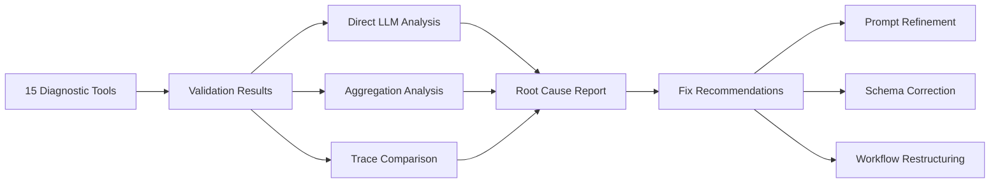

## 論文概要（Abstract）

本記事は [AgentFixer: From Failure Detection to Fix Recommendations in LLM Agentic Systems](https://arxiv.org/abs/2603.29848) の解説記事です。

Mulian, Zeltyn, Levy, Galanti, Yaeli, Shlomov（IBM, 2026）は、LLMベースのエージェントシステムにおける信頼性障害を体系的に診断・改善するバリデーションフレームワーク「AgentFixer」を提案している。著者らは、本番エージェントシステムの全タスク失敗の約38%がパージング関連のインシデント（不正なJSON、欠損スキーマフィールド、指示不遵守）に起因すると報告しており、これらを6カテゴリ・15の診断ツールで検出し、3種類の根本原因分析（Root-Cause Analysis）モジュールで修正推奨を生成する。AppWorld上のCUGAエージェント評価（24タスク、3モデル、1,940 LLMコール）およびWebArena GitLabサブセット（204サンプル）での実験を通じ、中規模モデル（Llama-4, Mistral Medium）がフロンティアモデルとの性能差を大幅に縮小できることを実証している。

この記事は [Zenn記事: LangSmith Online Evaluatorで本番エージェントの品質を自動監視する](https://zenn.dev/0h_n0/articles/2639c195b720d0) の深掘りです。

## 情報源

- **arXiv ID**: 2603.29848
- **URL**: [https://arxiv.org/abs/2603.29848](https://arxiv.org/abs/2603.29848)
- **著者**: Hadar Mulian, Sergey Zeltyn, Ido Levy, Liane Galanti, Avi Yaeli, Segev Shlomov
- **所属**: IBM
- **発表年**: 2026
- **分野**: cs.AI, cs.MA

## 背景と動機（Background & Motivation）

LLMベースのエージェントシステムは、複数のツール呼び出しと推論ステップを連鎖させることで複雑なタスクを遂行する。しかし、本番環境ではパージング関連の障害が深刻な問題となっている。著者らの分析によれば、全タスク失敗の約38%がパージング関連のインシデントに起因する。具体的には、LLMが生成するJSON出力の構文エラー、APIスキーマの必須フィールド欠損、システムプロンプトの指示不遵守などが、下流のツール呼び出しやデータ処理パイプラインを停止させ、カスケード障害を引き起こす。

既存のエージェント評価手法は、タスク完了率や最終出力の正確性といったエンドツーエンドの指標に焦点を当てているが、障害の根本原因を特定し、修正方針を提示する機能を持たない。LangSmithのようなオブザーバビリティツールは実行トレースの可視化と評価指標の収集には有効だが、「なぜ失敗したか」「どう修正すべきか」への回答は依然として人手に頼る部分が大きい。AgentFixerはこのギャップを埋めるべく、障害検出から修正推奨までを一貫して自動化するフレームワークとして設計されている。

## 主要な貢献（Key Contributions）

- **6カテゴリ・15の診断ツール**: 入力コンプライアンス、システムプロンプト分析、出力コンプライアンス、トークンレベル異常、コード固有バリデーション、クロスステージ整合性の6領域をカバーする包括的な診断ツール群を設計した
- **3種類の根本原因分析モジュール**: Direct LLM Analysis、Aggregation Analysis、Trace Comparisonの3手法で障害原因を多角的に特定し、具体的な修正推奨を生成する
- **中規模モデルの性能底上げ**: WebArenaベンチマークにおいて、AgentFixerの修正推奨をプロンプトに反映することでLlama-4のPass@3が38%から46%（+8ポイント）に改善し、フロンティアモデルとの差を縮小できることを実証した
- **バリデーションの位置付けの転換**: バリデーションを「評価の事後処理」ではなく「継続的エンジニアリングプロセス」として再定義する視点を提示した

## 技術的詳細（Technical Details）

### 15の診断ツールの分類体系

AgentFixerは、エージェントの各ステップ（入力・プロンプト・出力）を異なる観点から検証する15の診断ツールを提供する。各ツールはLLMベース（LLM-as-Judge）またはルールベースの判定方式を採用している。

```mermaid
flowchart TD
    A[AgentFixer Diagnostic Tools] --> B[Input-Prompt Compliance]
    A --> C[System Prompt Analysis]
    A --> D[Output-Prompt Compliance]
    A --> E[Token-Level Anomalies]
    A --> F[Code-Specific Validation]
    A --> G[Cross-Stage Consistency]

    B --> B1[Input-Schema-Non-compliance-Detector]
    B --> B2[Input-Instructions-Non-compliance-Detector]
    B --> B3[Input-Format-Violation-Detector]

    C --> C1[Prompt-Consistency-Validator]
    C --> C2[Example-Misalignment-Detector]
    C --> C3[Edge-Case-Instruction-Validator]
    C --> C4[Few-Shot-Coverage-Validator]

    D --> D1[Output-Schema-Non-compliance-Detector]
    D --> D2[Output-Instructions-Non-compliance-Detector]
    D --> D3[Output-Format-Violation-Detector]

    E --> E1[Unusual-Token-Detector]
    E --> E2[Token-Repetition-Detector]

    F --> F1[Python-Code-Syntax-Validator]

    G --> G1[Information-Consistency-Validator]
    G --> G2[Reasoning-Action-Mismatch-Detector]
```



**Input-Prompt Compliance（3ツール、LLMベース）**: エージェントへの入力がスキーマ仕様、指示内容、フォーマット制約に適合しているかを検証する。Input-Schema-Non-compliance-Detectorは、定義されたJSONスキーマに対して入力データのフィールド型・必須項目・制約値を照合する。Input-Instructions-Non-compliance-Detectorは、システムプロンプトに記載された入力制約（例：「最大3つのツールを使用」）への遵守を確認する。Input-Format-Violation-Detectorは、期待されるフォーマット（JSON、XML、特定のテンプレート等）からの逸脱を検出する。

**System Prompt Analysis（4ツール、LLMベース+ルールベース混合）**: プロンプト自体の品質問題を検出する。Prompt-Consistency-Validatorはシステムプロンプト内の矛盾した指示を検出する（例：「JSONで出力せよ」と「自然言語で応答せよ」の共存）。Example-Misalignment-Detectorは、Few-shot例がタスク仕様と不整合な場合を検出する。Edge-Case-Instruction-Validatorは、エッジケース（空入力、極端に長い入力、不正な型等）に対するプロンプト指示のカバレッジを評価する。Few-Shot-Coverage-Validatorは、提供されたFew-shot例の多様性が不足していないかを分析する。

**Output-Prompt Compliance（3ツール、LLMベース）**: エージェントの出力がプロンプトの指示に従っているかを検証する。入力側と対称的な構成で、スキーマ適合性、指示遵守、フォーマット整合性を検査する。著者らの実験ではこのカテゴリの違反が最も高頻度で検出されている。

**Token-Level Anomalies（2ツール、ルールベース）**: Unusual-Token-Detectorは非標準文字やエンコーディング問題を検出する。Token-Repetition-Detectorは同一トークンやフレーズの過度な繰り返し（LLMの「ループ」現象）を検出する。これらはルールベースで実装されており、LLM呼び出しなしで高速に動作する。

**Code-Specific Validation（1ツール、ルールベース）**: Python-Code-Syntax-ValidatorはAST（抽象構文木）解析を用いてPythonコードの構文検証を行う。LLMが生成したコードブロックがパース可能かどうかを静的に判定する。

**Cross-Stage Consistency（2ツール、ルールベース+LLMベース）**: Information-Consistency-Validatorは入出力間の事実不整合を検出する（例：入力に含まれる数値と出力の数値が矛盾）。Reasoning-Action-Mismatch-DetectorはLLMの推論ステップ（Chain-of-Thought）と実際に選択されたアクションの不一致を検出する。

### Root-Cause Analysis Modules

15の診断ツールが「何が問題か」を特定するのに対し、Root-Cause Analysis（RCA）モジュールは「なぜ問題が起きたか」「どう修正すべきか」を分析する。AgentFixerは3種類のRCAモジュールを提供する。

**1. Direct LLM Analysis**: 障害が検出されたステップのワークフローコンテキスト（入力、プロンプト、出力、前後のステップ）をLLMに提示し、LLM-as-Judge形式で根本原因を分析する。単一ステップの障害に対して最も直接的な分析を提供する。

**2. Aggregation Analysis**: 複数の診断ツールが報告したバリデーション結果を階層的優先度付けで統合する。例えば、Output-Schema-Non-compliance-DetectorとOutput-Format-Violation-Detectorの両方が同一ステップで違反を検出した場合、スキーマ違反を上位原因として報告する。個別の診断結果を横断的に統合することで、より正確な原因特定を行う。

**3. Trace Comparison**: 成功トレースと失敗トレースを比較し、差分から障害の原因を推定する。同一タスクに対する複数回の実行結果が利用可能な場合に有効であり、「成功時はツールAを先に呼び出しているが、失敗時はツールBから開始している」といったパターンを検出する。



### 対話型検証とフィードバックループ

AgentFixerの重要な設計思想として、診断結果をモデルにフィードバックする対話型検証（Interactive Validation）がある。RCAモジュールが生成した修正推奨をシステムプロンプトに反映し、再度エージェントを実行してバリデーションを繰り返す。このフィードバックループにより、単発の修正では解消しない複合的な障害にも対処可能となる。WebArenaの実験では、この対話型検証により中規模モデルの性能が段階的に改善したことが報告されている。

## 実装のポイント（Implementation）

AgentFixerの実装において著者らが強調している設計判断を以下にまとめる。

**LLMベースとルールベースの使い分け**: 15ツールのうち9ツールがLLMベース、4ツールがルールベース、2ツールがハイブリッドである。意味的な判断が必要な検証（指示遵守、推論と行動の整合性等）にはLLM-as-Judgeを用い、構文的・パターン的な検証（トークン繰り返し、Pythonコード構文等）にはルールベースを採用している。ルールベースツールはレイテンシとコストの面で有利であり、本番環境での全ステップ検証に適している。

**階層的優先度付け**: Aggregation Analysisでは、検出された違反に優先度を割り当てる。スキーマ違反はフォーマット違反より優先され、クロスステージ整合性の問題は個別ステップの問題より上位に位置付けられる。この階層により、修正の効果が最も大きい箇所から着手できる。

**トレースデータの構造**: AgentFixerはエージェントの各ステップを以下の構造で記録する。各ステップには入力、プロンプト、出力、使用ツール、実行時間が含まれ、15の診断ツールが各フィールドを個別に検証する。この構造はLangSmithやLangChainのトレース形式と概念的に対応しており、既存のオブザーバビリティ基盤との統合が想定されている。

**バリデーションコスト**: LLMベースの診断ツールは追加のLLM呼び出しを必要とする。著者らの実験では1,940のLLMコールに対してバリデーションを実行しており、バリデーション自体のコストと本番エージェントの改善効果のトレードオフを考慮する必要がある。

## Production Deployment Guide

AgentFixerの知見を本番エージェントシステムの品質改善に適用するための実装ガイドを示す。LangSmithやLangChainを用いた監視基盤との統合を想定し、診断ツール群の段階的導入とCI/CDパイプラインへの組み込みを解説する。

### 段階的導入戦略

AgentFixerの15ツール全てを一度に導入するのではなく、コスト対効果の高い順に段階的に導入することを推奨する。著者らの実験結果から、入出力フォーマット違反が最も高頻度で検出されているため、以下の順序での導入が効果的である。

**Phase 1: ルールベースツール（即時導入可能、追加LLMコスト不要）**:
- Python-Code-Syntax-Validator: AST解析による構文検証
- Unusual-Token-Detector: 非標準文字検出
- Token-Repetition-Detector: トークン繰り返し検出
- Information-Consistency-Validator: 入出力間の数値・事実整合性

**Phase 2: 出力バリデーション（最も高頻度の障害カテゴリ）**:
- Output-Schema-Non-compliance-Detector
- Output-Format-Violation-Detector
- Output-Instructions-Non-compliance-Detector

**Phase 3: 入力・プロンプト分析（プロンプト最適化フェーズ）**:
- Input-Schema-Non-compliance-Detector
- Prompt-Consistency-Validator
- Edge-Case-Instruction-Validator

**Phase 4: 高度な分析（成熟したシステム向け）**:
- Reasoning-Action-Mismatch-Detector
- Few-Shot-Coverage-Validator
- Example-Misalignment-Detector

### ルールベース診断ツールの実装例

Phase 1で導入するルールベースツールのPython実装例を示す。

```python
"""AgentFixer inspired rule-based diagnostic tools.

LLM呼び出し不要のルールベース診断ツール群。
本番エージェントの全ステップに低コストで適用可能。
"""

import ast
import json
import re
from collections import Counter
from dataclasses import dataclass, field
from enum import Enum


class Severity(Enum):
    """診断結果の重要度レベル"""

    CRITICAL = "critical"
    WARNING = "warning"
    INFO = "info"


@dataclass
class DiagnosticResult:
    """診断ツールの出力結果

    Attributes:
        tool_name: 診断ツール名
        passed: 検証通過の有無
        severity: 重要度レベル
        message: 検出内容の説明
        details: 追加の詳細情報
    """

    tool_name: str
    passed: bool
    severity: Severity
    message: str
    details: dict = field(default_factory=dict)


def validate_python_syntax(code: str) -> DiagnosticResult:
    """Python-Code-Syntax-Validator: AST解析による構文検証

    LLMが生成したPythonコードブロックの構文的正当性を検証する。
    論文のCode-Specific Validationカテゴリに対応。

    Args:
        code: 検証対象のPythonコード文字列

    Returns:
        構文検証の診断結果
    """
    try:
        ast.parse(code)
        return DiagnosticResult(
            tool_name="Python-Code-Syntax-Validator",
            passed=True,
            severity=Severity.INFO,
            message="Python syntax is valid",
        )
    except SyntaxError as e:
        return DiagnosticResult(
            tool_name="Python-Code-Syntax-Validator",
            passed=False,
            severity=Severity.CRITICAL,
            message=f"Syntax error at line {e.lineno}: {e.msg}",
            details={
                "line": e.lineno,
                "offset": e.offset,
                "text": e.text,
            },
        )


def detect_token_repetition(
    text: str,
    *,
    ngram_size: int = 3,
    max_repeat_ratio: float = 0.3,
) -> DiagnosticResult:
    """Token-Repetition-Detector: 過度なトークン繰り返しの検出

    LLMの「ループ」現象（同一フレーズの過剰反復）を検出する。
    論文のToken-Level Anomaliesカテゴリに対応。

    Args:
        text: 検証対象のテキスト
        ngram_size: N-gramのサイズ
        max_repeat_ratio: 許容する最大繰り返し率

    Returns:
        繰り返し検出の診断結果
    """
    words = text.split()
    if len(words) < ngram_size * 2:
        return DiagnosticResult(
            tool_name="Token-Repetition-Detector",
            passed=True,
            severity=Severity.INFO,
            message="Text too short for repetition analysis",
        )

    ngrams = [
        tuple(words[i : i + ngram_size])
        for i in range(len(words) - ngram_size + 1)
    ]
    counter = Counter(ngrams)
    total = len(ngrams)
    most_common_ngram, most_common_count = counter.most_common(1)[0]

    repeat_ratio = most_common_count / total
    if repeat_ratio > max_repeat_ratio:
        return DiagnosticResult(
            tool_name="Token-Repetition-Detector",
            passed=False,
            severity=Severity.WARNING,
            message=(
                f"Excessive repetition detected: "
                f"'{' '.join(most_common_ngram)}' appears "
                f"{most_common_count} times ({repeat_ratio:.1%})"
            ),
            details={
                "repeated_ngram": " ".join(most_common_ngram),
                "count": most_common_count,
                "ratio": repeat_ratio,
            },
        )

    return DiagnosticResult(
        tool_name="Token-Repetition-Detector",
        passed=True,
        severity=Severity.INFO,
        message=f"No excessive repetition (max ratio: {repeat_ratio:.3f})",
    )


def detect_unusual_tokens(text: str) -> DiagnosticResult:
    """Unusual-Token-Detector: 非標準文字・エンコーディング問題の検出

    制御文字、不正なUnicodeシーケンス、NULL バイトなどを検出する。
    論文のToken-Level Anomaliesカテゴリに対応。

    Args:
        text: 検証対象のテキスト

    Returns:
        異常トークン検出の診断結果
    """
    issues: list[str] = []

    # NULL バイト検出
    if "\x00" in text:
        issues.append("NULL byte detected")

    # 制御文字検出（改行・タブ・キャリッジリターンは除外）
    control_chars = re.findall(r"[\x01-\x08\x0b\x0c\x0e-\x1f\x7f]", text)
    if control_chars:
        issues.append(
            f"{len(control_chars)} control character(s) detected"
        )

    # サロゲートペア文字検出
    surrogate_pattern = re.findall(r"[\ud800-\udfff]", text)
    if surrogate_pattern:
        issues.append(
            f"{len(surrogate_pattern)} surrogate character(s) detected"
        )

    if issues:
        return DiagnosticResult(
            tool_name="Unusual-Token-Detector",
            passed=False,
            severity=Severity.WARNING,
            message=f"Unusual tokens found: {'; '.join(issues)}",
            details={"issues": issues},
        )

    return DiagnosticResult(
        tool_name="Unusual-Token-Detector",
        passed=True,
        severity=Severity.INFO,
        message="No unusual tokens detected",
    )


def validate_json_schema_compliance(
    output: str,
    expected_schema: dict,
) -> DiagnosticResult:
    """Output-Schema-Non-compliance-Detector（簡易ルールベース版）

    LLM出力がJSON形式で期待されるスキーマに適合するか検証する。
    論文のOutput-Prompt Complianceカテゴリの簡易実装。

    Args:
        output: LLMの出力文字列
        expected_schema: 期待されるスキーマ（required_fieldsキーにフィールド名リスト）

    Returns:
        スキーマ適合性の診断結果
    """
    # JSON パース検証
    try:
        parsed = json.loads(output)
    except json.JSONDecodeError as e:
        return DiagnosticResult(
            tool_name="Output-Schema-Non-compliance-Detector",
            passed=False,
            severity=Severity.CRITICAL,
            message=f"Invalid JSON: {e.msg} at position {e.pos}",
            details={"error_type": "json_parse_error", "position": e.pos},
        )

    # 必須フィールド検証
    required_fields = expected_schema.get("required_fields", [])
    missing = [f for f in required_fields if f not in parsed]
    if missing:
        return DiagnosticResult(
            tool_name="Output-Schema-Non-compliance-Detector",
            passed=False,
            severity=Severity.CRITICAL,
            message=f"Missing required fields: {missing}",
            details={
                "missing_fields": missing,
                "present_fields": list(parsed.keys()),
            },
        )

    return DiagnosticResult(
        tool_name="Output-Schema-Non-compliance-Detector",
        passed=True,
        severity=Severity.INFO,
        message="Output conforms to expected schema",
    )
```

### LLMベース診断ツールの実装パターン

Phase 2以降で導入するLLMベースツールの実装パターンを示す。LangChainとの統合を前提とした設計例である。

```python
"""AgentFixer inspired LLM-based diagnostic tools.

LangChain/LangSmith統合を前提としたLLM-as-Judge診断ツール群。
"""

from langchain_core.prompts import ChatPromptTemplate
from langchain_core.output_parsers import PydanticOutputParser
from pydantic import BaseModel, Field


class ComplianceResult(BaseModel):
    """LLMベース診断ツールの構造化出力スキーマ

    Attributes:
        compliant: 準拠しているかの判定
        violations: 検出された違反のリスト
        severity: 最も重大な違反の重要度
        fix_recommendation: 修正推奨
    """

    compliant: bool = Field(description="Whether the output complies")
    violations: list[str] = Field(
        default_factory=list,
        description="List of detected violations",
    )
    severity: str = Field(
        default="info",
        description="Severity: critical, warning, or info",
    )
    fix_recommendation: str = Field(
        default="",
        description="Recommended fix action",
    )


# Output-Instructions-Non-compliance-Detector
OUTPUT_COMPLIANCE_PROMPT = ChatPromptTemplate.from_messages([
    (
        "system",
        "You are a validation agent. Evaluate whether the LLM output "
        "complies with the instructions in the system prompt.\n"
        "Focus on:\n"
        "1. Format requirements (JSON, markdown, etc.)\n"
        "2. Content constraints (length, required sections)\n"
        "3. Behavioral instructions (tone, language, scope)\n"
        "{format_instructions}",
    ),
    (
        "human",
        "## System Prompt\n{system_prompt}\n\n"
        "## LLM Output\n{llm_output}\n\n"
        "Evaluate compliance and provide fix recommendations.",
    ),
])

# Reasoning-Action-Mismatch-Detector
REASONING_ACTION_PROMPT = ChatPromptTemplate.from_messages([
    (
        "system",
        "You are a reasoning-action consistency validator. "
        "Analyze whether the agent's reasoning (Chain-of-Thought) "
        "is consistent with the action it actually took.\n"
        "{format_instructions}",
    ),
    (
        "human",
        "## Agent Reasoning\n{reasoning}\n\n"
        "## Action Taken\n{action}\n\n"
        "## Available Tools\n{available_tools}\n\n"
        "Check if the reasoning logically leads to the action taken.",
    ),
])


def build_compliance_chain(llm, prompt_template):
    """LLMベース診断チェーンを構築する

    Args:
        llm: LangChainのLLMインスタンス
        prompt_template: 診断用プロンプトテンプレート

    Returns:
        LangChain Runnableチェーン
    """
    parser = PydanticOutputParser(pydantic_object=ComplianceResult)
    return (
        prompt_template.partial(
            format_instructions=parser.get_format_instructions(),
        )
        | llm
        | parser
    )
```

### CI/CDパイプラインへの統合

AgentFixerの診断をCI/CDパイプラインに組み込むことで、プロンプト変更やモデル更新時に自動的なリグレッション検出が可能となる。以下にGitHub Actionsでの統合例を示す。

```yaml
# .github/workflows/agent-validation.yml
name: Agent Validation Pipeline

on:
  pull_request:
    paths:
      - 'prompts/**'
      - 'config/agent_*.yaml'
      - 'src/agents/**'

jobs:
  rule-based-validation:
    runs-on: ubuntu-latest
    steps:
      - uses: actions/checkout@v4
      - uses: actions/setup-python@v5
        with:
          python-version: '3.12'
      - name: Install dependencies
        run: pip install -r requirements.txt
      - name: Run rule-based diagnostics
        run: |
          python -m agent_diagnostics.rule_based \
            --config config/agent_schema.yaml \
            --test-cases tests/agent_traces/ \
            --output results/rule_based.json
      - name: Upload results
        uses: actions/upload-artifact@v4
        with:
          name: rule-based-results
          path: results/rule_based.json

  llm-based-validation:
    runs-on: ubuntu-latest
    needs: rule-based-validation
    if: github.event.pull_request.draft == false
    steps:
      - uses: actions/checkout@v4
      - uses: actions/setup-python@v5
        with:
          python-version: '3.12'
      - name: Install dependencies
        run: pip install -r requirements.txt
      - name: Run LLM-based diagnostics
        env:
          OPENAI_API_KEY: ${{ secrets.OPENAI_API_KEY }}
        run: |
          python -m agent_diagnostics.llm_based \
            --config config/agent_schema.yaml \
            --test-cases tests/agent_traces/ \
            --output results/llm_based.json \
            --model gpt-4o
      - name: Check for critical violations
        run: |
          python -c "
          import json, sys
          results = json.load(open('results/llm_based.json'))
          critical = [r for r in results if r['severity'] == 'critical']
          if critical:
              print(f'FAIL: {len(critical)} critical violation(s)')
              for c in critical:
                  print(f'  - {c[\"tool_name\"]}: {c[\"message\"]}')
              sys.exit(1)
          print('PASS: No critical violations')
          "
```

### LangSmithとの統合パターン

LangSmithの既存トレースデータをAgentFixerの診断に活用し、オンライン評価と組み合わせるパターンを示す。

```python
"""AgentFixer + LangSmith integration pattern.

LangSmithのトレースデータを入力としてAgentFixerの診断を実行し、
結果をLangSmithのフィードバックとして記録する。
"""

from langsmith import Client as LangSmithClient


def run_agentfixer_on_traces(
    langsmith_client: LangSmithClient,
    project_name: str,
    *,
    max_traces: int = 100,
    diagnostics: list | None = None,
) -> dict:
    """LangSmithトレースに対してAgentFixer診断を実行する

    Args:
        langsmith_client: LangSmithクライアント
        project_name: LangSmithプロジェクト名
        max_traces: 分析対象の最大トレース数
        diagnostics: 実行する診断ツールのリスト（Noneで全ツール）

    Returns:
        診断結果のサマリー辞書
    """
    runs = langsmith_client.list_runs(
        project_name=project_name,
        is_root=True,
        limit=max_traces,
    )

    results_summary = {
        "total_runs": 0,
        "runs_with_violations": 0,
        "violations_by_tool": {},
        "critical_count": 0,
    }

    for run in runs:
        results_summary["total_runs"] += 1
        run_violations = []

        # ルールベース診断の実行
        if run.outputs:
            output_str = str(run.outputs)

            repetition_result = detect_token_repetition(output_str)
            if not repetition_result.passed:
                run_violations.append(repetition_result)

            unusual_result = detect_unusual_tokens(output_str)
            if not unusual_result.passed:
                run_violations.append(unusual_result)

        # 違反があればLangSmithフィードバックとして記録
        if run_violations:
            results_summary["runs_with_violations"] += 1
            for violation in run_violations:
                tool_name = violation.tool_name
                results_summary["violations_by_tool"].setdefault(
                    tool_name, 0
                )
                results_summary["violations_by_tool"][tool_name] += 1
                if violation.severity == Severity.CRITICAL:
                    results_summary["critical_count"] += 1

                langsmith_client.create_feedback(
                    run_id=run.id,
                    key=f"agentfixer.{tool_name}",
                    score=0.0 if violation.severity == Severity.CRITICAL else 0.5,
                    comment=violation.message,
                )

    return results_summary
```

### コスト最適化のポイント

AgentFixerの本番運用ではバリデーション自体のコストが無視できない。以下にコスト管理の指針を示す。

| 戦略 | 対象 | 効果 |
|:---|:---|:---|
| ルールベースツール優先 | Phase 1の4ツール | LLM呼び出しゼロでレイテンシ・コスト削減 |
| サンプリングバリデーション | 全トレースの10-20%を抽出 | LLMベースツールのコストを80-90%削減 |
| 障害トレース集中分析 | 失敗・タイムアウトしたトレースのみ | 全トレース分析に比べて大幅なコスト削減 |
| バッチ処理 | 非同期で日次バッチ実行 | リアルタイム実行に比べてスループット最適化 |
| 軽量モデル使用 | GPT-4o-miniやHaiku等 | LLMベースツールのコストを50-70%削減 |

## 実験結果（Results）

### IBM CUGA on AppWorld

著者らはIBM社内のCUGA（Compound Understanding and Generation Agent）を用いてAppWorldベンチマーク上で評価を行っている。24のAppWorldタスクに対し3つのモデルで実験を行い、合計1,940のLLMコールを分析している。

| モデル | 成功率 | 成功タスク数/全タスク |
|:---:|:---:|:---:|
| GPT-4o | 58.3% | 14/24 |
| Mistral-medium-2505 | 41.7% | 10/24 |
| Llama-4-mav-17b | 33.3% | 8/24 |

診断結果の分析から、入出力フォーマット違反が最も高頻度で検出されており、エッジケース処理の不備が全エージェントに共通する体系的弱点であることが報告されている。

### WebArena改善結果

WebArenaベンチマーク（GitLabサブセット、204サンプル）では、AgentFixerの修正推奨をプロンプトに反映することで以下の改善が確認されている。

| モデル | 修正前 Pass@3 | 修正後 Pass@3 | 改善幅 |
|:---:|:---:|:---:|:---:|
| GPT-4o | 47% | 52% | +5ポイント |
| LLaMA 4 | 38% | 46% | +8ポイント |
| Mistral Medium | 35% | 42% | +7ポイント |

注目すべき点として、中規模モデル（LLaMA 4, Mistral Medium）がフロンティアモデル（GPT-4o）との差を縮小している。修正前のGPT-4oとLLaMA 4の差は9ポイント（47% vs 38%）であったが、修正後は6ポイント（52% vs 46%）に縮まっている。著者らはこの結果から、モデル自体の能力差だけでなくプロンプトとスキーマの品質がエージェント性能の重要な決定要因であると結論づけている。

## 実運用への応用（Practical Applications）

### LangSmithオンライン評価との相補性

Zenn記事「LangSmith Online Evaluatorで本番エージェントの品質を自動監視する」で扱っているLangSmithのオンライン評価は、エージェントの実行結果を定量指標で継続的に監視する仕組みである。AgentFixerはこのオンライン評価を補完する位置付けとなる。LangSmithが「何が悪化したか」を検知するのに対し、AgentFixerは「なぜ悪化したか」「どう修正すべきか」を提供する。

実務での統合パターンとしては、LangSmithのオンライン評価で品質低下を検知した際に、該当トレースに対してAgentFixerの診断を実行し、修正推奨をプロンプト改善サイクルにフィードバックする運用が考えられる。

### エージェント開発への示唆

AgentFixerの実験結果から得られる実務上の知見は以下の通りである。

1. **パージング障害の38%という数値は、スキーマ定義とフォーマット指示の品質向上が最も費用対効果の高い改善施策であることを示唆している**。JSON Schemaの厳密な定義、出力例の明示、エラー時のフォールバック指示をプロンプトに含めることで、本番障害の大幅な削減が期待できる
2. **エッジケース処理は個別モデルの問題ではなく、プロンプト設計の構造的問題である**。全3モデルで共通の弱点として検出されていることから、エッジケースをカバーするFew-shot例の追加やガードレール指示の強化が有効である
3. **中規模モデルの費用対効果を最大化する手段として、バリデーション駆動のプロンプト改善は有望である**。WebArenaでの+7-8ポイントの改善は、モデルのスケールアップに頼らない性能向上の道筋を示している

## 関連研究（Related Work）

- **Yao et al. (2023) "ReAct: Synergizing Reasoning and Acting in Language Models"**: LLMの推論と行動を交互に実行するフレームワーク。AgentFixerのReasoning-Action-Mismatch-Detectorは、ReActパターンのエージェントにおける推論と行動の不整合を検出する診断ツールとして位置付けられる
- **Shinn et al. (2023) "Reflexion: Language Agents with Verbal Reinforcement Learning"**: エージェントが自身の失敗を言語的に振り返り改善するフレームワーク。AgentFixerのTrace Comparisonモジュールは、Reflexionの自己反省を外部バリデーションとして体系化したものと捉えることができる
- **Xi et al. (2024) "AgentGym: Evolving Large Language Model-based Agents across Diverse Environments"**: 多様な環境でエージェントを学習・評価するプラットフォーム。AgentFixerはAgentGymのような評価環境で検出された障害の根本原因分析を自動化する補完的なツールとして機能する

## まとめ

AgentFixerは、LLMエージェントシステムの信頼性向上を「障害検出」から「修正推奨」まで一貫して自動化するフレームワークである。15の診断ツールと3種類のRoot-Cause Analysisモジュールにより、パージング障害（全失敗の約38%）を含む多様な障害パターンを体系的に検出・分析する。WebArenaでの実験により、修正推奨の適用が中規模モデルで+7-8ポイントの性能改善をもたらすことが示されている。バリデーションを「事後処理」ではなく「継続的エンジニアリングプロセス」として捉える視点は、LangSmithのようなオブザーバビリティ基盤と組み合わせることで、本番エージェントの品質管理に実践的な価値を提供する。

## 参考文献

- **arXiv**: [https://arxiv.org/abs/2603.29848](https://arxiv.org/abs/2603.29848)
- **Related Zenn article**: [https://zenn.dev/0h_n0/articles/2639c195b720d0](https://zenn.dev/0h_n0/articles/2639c195b720d0)
