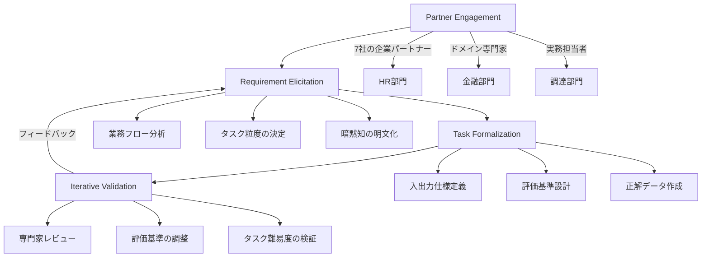

本記事は [AlphaEval: Evaluating Agents in Production](https://arxiv.org/abs/2604.12162) の解説記事です。

## 論文概要（Abstract）

AlphaEvalは、LLMエージェントの本番環境における性能を体系的に評価するためのベンチマークフレームワークである。7社の企業パートナーから収集した94の実務タスクを、HR・金融・調達・ソフトウェアエンジニアリング・ヘルスケア・技術リサーチの6つの職業ドメインにわたって構成している。著者らは、研究ベンチマーク（SWE-bench、GAIA等）と本番業務との間に大きなギャップが存在することを指摘し、実際の業務要件に基づくベンチマーク構築パイプラインと、5つの評価パラダイムを組み合わせた多面的評価フレームワークを提案している。最高性能のClaude Code + Opus 4.6でも64.41/100にとどまり、本番環境固有の失敗モードが体系的に明らかにされた。

この記事は [Zenn記事: LangSmith Online Evaluatorで本番エージェントの品質を自動監視する](https://zenn.dev/0h_n0/articles/2639c195b720d0) の深掘りです。

## 情報源

- **arXiv ID**: 2604.12162
- **URL**: [arXiv:2604.12162](https://arxiv.org/abs/2604.12162)
- **著者**: Pengrui Lu, Bingyu Xu, Wenjun Zhang et al.
- **発表年**: 2026年4月
- **分野**: Computation and Language (cs.CL)

## 背景と動機（Background）

### 研究ベンチマークと本番業務のギャップ

既存のLLMエージェント評価ベンチマーク（SWE-bench、GAIA、WebArena等）は、主にオープンソースのタスクや合成的なシナリオに基づいている。しかし、実務で求められるタスクは、暗黙の制約、ドメイン固有の規制、複数ステークホルダー間の調整など、研究ベンチマークでは捉えきれない要素を含んでいる。

著者らが実施した27社のAI製品企業を対象とした調査によると、以下の課題が浮き彫りになっている：

- **63%** の企業がモデル更新が製品改善につながるか自信がない
- **70.4%** の企業が開発者にテストを兼任させている（専任の評価チームが存在しない）
- 既存のベンチマークスコアと本番環境での性能に乖離がある

このギャップの根本原因は、研究ベンチマークが「モデルの能力」を測定するのに対し、本番環境では「業務目標の達成度」が求められる点にある。AlphaEvalは、この乖離を埋めるために、実際の業務要件から逆算してベンチマークを構築するアプローチを採用している。

### LangSmithとの接点

Zenn記事で解説したLangSmith Online Evaluatorは、本番稼働中のエージェントの品質を継続的に監視するツールである。AlphaEvalが提示する評価パラダイム（特にLLM-as-a-JudgeやRubric-based Evaluation）は、LangSmithのOnline Evaluatorで実装可能な評価手法と直接対応しており、本番環境での品質監視設計に具体的な指針を与える。

## 主要な貢献（Key Contributions）

1. **Requirement-to-Benchmark Framework**: 実務要件を実行可能なベンチマークに変換する4段階パイプライン
2. **多面的評価フレームワーク**: 5つの評価パラダイムを組み合わせた包括的評価（各ドメインは平均2.8の評価タイプを使用）
3. **経済的価値のアノテーション**: 94タスクで約2,420時間（約60人週）の専門家労働量に相当（$154K-$231K USD）
4. **本番固有の失敗モード分類**: 6つの系統的な失敗パターンの特定と分析
5. **業界実態調査**: 27社のAI製品企業における評価実態の定量的把握

## 技術的詳細（Technical Details）

### Requirement-to-Benchmark Framework

著者らは、実務要件をベンチマークタスクに変換するための4段階パイプラインを提案している。



**Stage 1: Partner Engagement** では、7社の企業パートナーから、実際の業務で自動化したいタスクを収集する。重要なのは、「AIにできそうなこと」ではなく「業務上の価値が高いタスク」を出発点にしている点である。

**Stage 2: Requirement Elicitation** では、ドメイン専門家との対話を通じて、タスクの詳細な要件を引き出す。ここでは、暗黙の制約（例：「金融レポートでは小数点以下2桁に揃える」）や、業務固有のルール（例：「HR部門では個人情報の取り扱いに関する法的制約がある」）を明文化する。

**Stage 3: Task Formalization** では、抽出された要件を、再現可能なベンチマークタスクとして形式化する。各タスクには入出力仕様、評価基準、正解データが付与される。

**Stage 4: Iterative Validation** では、ドメイン専門家によるレビューを繰り返し、評価基準の妥当性とタスク難易度の適切性を検証する。この反復プロセスにより、Stage 2へのフィードバックが生まれ、要件の精緻化が行われる。

### 5つの評価パラダイム

AlphaEvalでは、単一の評価手法に依存せず、タスクの性質に応じて5つのパラダイムを組み合わせている。

| 評価パラダイム | 概要 | 適用例 |
|:---|:---|:---|
| Reference Answer Verification | 正解データとの完全一致・部分一致 | 数値計算、事実確認 |
| Formal Logic Verification | 論理的制約の充足判定 | 規制準拠チェック、フォーマット検証 |
| Rubric-based Evaluation | 事前定義された採点基準に基づく評価 | レポート品質、提案書評価 |
| Execution-based Verification | コード実行による出力検証 | データ処理、API連携 |
| LLM-as-a-Judge | LLMによる自然言語出力の品質判定 | 要約、分析レポート |

各ドメインは平均2.8の評価タイプを使用しており、例えば金融ドメインでは「Reference Answer Verification（数値の正確性）」と「Formal Logic Verification（規制準拠）」と「LLM-as-a-Judge（分析レポートの質）」を組み合わせている。

著者らは、LLM-as-a-Judge評価について、専門家評価との一致度をCohen's kappaで測定しており、0.691から0.780の範囲であったと報告している。この値は「substantial agreement」に分類され、LLM-as-a-Judgeが専門家評価の代替として一定の信頼性を持つことを示している。

### 経済的価値のアノテーション

AlphaEvalの特徴的な点として、各タスクに経済的価値がアノテーションされている。94タスクの合計で約2,420時間（約60人週）の専門家労働量に相当し、これは$154K-$231K USDの人件費に換算される。

経済的価値の算出式は以下の通りである：

$$
V_{\text{task}} = T_{\text{expert}} \times R_{\text{hourly}} \times F_{\text{frequency}}
$$

ここで、$$T_{\text{expert}}$$は専門家が当該タスクを完了するのに必要な時間（時間単位）、$$R_{\text{hourly}}$$は専門家の時給（職種・地域により$64-$96/h）、$$F_{\text{frequency}}$$はタスクの発生頻度（年間単位）を表す。

このアノテーションにより、ベンチマークスコアの改善を直接的な経済的インパクトに変換できる。例えば、あるタスクで自動化率が50%から70%に改善された場合、$$\Delta V = V_{\text{task}} \times (0.70 - 0.50)$$として節約額が算出可能である。

## 実装のポイント（Implementation Notes）

### ベンチマーク実行環境

AlphaEvalのベンチマーク実行には、以下の環境要件が報告されている：

- **エージェントフレームワーク**: Claude Code、Codex CLI、Custom agent harness
- **LLMバックエンド**: Claude Opus 4.6、GPT-4.1、Gemini 2.5 Pro等
- **タスク実行時間**: タスクあたり平均15-45分（ドメインにより変動）
- **コンテキスト長**: 一部タスクで128K以上のコンテキストウィンドウが必要

### LLM-as-a-Judge実装の要点

著者らの実験から得られたLLM-as-a-Judge実装の知見を以下にまとめる：

1. **ルーブリックの明示性**: 評価基準は5段階ではなく、各スコアに具体的な条件を記述する（例：「3点 = 主要な数値は正確だが、1つ以上の補助データに誤りがある」）
2. **複数評価者の合議**: 単一のLLM判定ではなく、複数回の判定結果を集約することで信頼性を向上
3. **ドメイン固有のプロンプト**: 汎用的な「良い回答を評価せよ」ではなく、ドメインの文脈を含むプロンプトが有効

これらの知見は、LangSmith Online Evaluatorでカスタム評価関数を設計する際に直接活用できる。

## Production Deployment Guide

### AWS実装パターン（コスト最適化重視）

AlphaEvalの評価パラダイムに基づくLLMエージェント品質監視システムをAWS上で構築する構成を示す。LangSmithのOnline Evaluatorと組み合わせ、本番環境でのエージェント品質を継続的に監視するパイプラインである。以下のコスト試算は2026年9月時点のAWS ap-northeast-1（東京）リージョン料金に基づく概算値であり、実際のコストはトラフィックパターン・リージョン・バースト使用量により変動する。最新料金はAWS料金計算ツールで確認を推奨する。

**トラフィック量別の推奨構成**:

| 構成 | ユースケース | 主要サービス | 月額概算 |
|:---:|:---|:---|:---:|
| Small | PoC・社内ツール（日次100リクエスト以下） | Lambda + DynamoDB + S3 | $50-150 |
| Medium | 本番サービス（日次1,000-10,000リクエスト） | ECS Fargate + Aurora Serverless + S3 | $500-1,500 |
| Large | 大規模本番（日次100,000リクエスト以上） | EKS + Aurora + ElastiCache + S3 | $3,000-8,000 |

**Small構成の内訳**: Lambda（月300万リクエスト無料枠内 = $0）、DynamoDB（オンデマンド、月100万WCU = $1.25）、S3（評価ログ50GB = $1.15）、CloudWatch（カスタムメトリクス10個 = $3）、Bedrock API（Claude Haiku評価、日次100回 = $30-80）。

**コスト削減テクニック**:
- Lambda無料枠（月100万リクエスト、400,000 GB秒）の活用で小規模ならコンピュートコストほぼゼロ
- DynamoDB オンデマンドキャパシティでアイドル時のコストを最小化
- S3 Intelligent-Tieringで評価ログのストレージコスト最適化
- LLM-as-a-Judge評価にはClaude Haikuを使用しコストを抑制（Opusの約1/10）

### Terraformインフラコード

**Small構成（Lambda + DynamoDB + S3）**:

```hcl
# AlphaEval評価パイプライン - Small構成
# Lambda + DynamoDB + S3 + CloudWatch

terraform {
  required_version = ">= 1.9"
  required_providers {
    aws = {
      source  = "hashicorp/aws"
      version = "~> 5.60"
    }
  }
}

provider "aws" {
  region = "ap-northeast-1"
}

data "aws_caller_identity" "current" {}

# S3: 評価ログ・エージェント出力保存
resource "aws_s3_bucket" "eval_logs" {
  bucket = "agent-eval-logs-${data.aws_caller_identity.current.account_id}"
}

resource "aws_s3_bucket_server_side_encryption_configuration" "eval_logs" {
  bucket = aws_s3_bucket.eval_logs.id
  rule {
    apply_server_side_encryption_by_default {
      sse_algorithm = "aws:kms"
    }
  }
}

resource "aws_s3_bucket_lifecycle_configuration" "eval_logs" {
  bucket = aws_s3_bucket.eval_logs.id
  rule {
    id     = "archive-old-eval-logs"
    status = "Enabled"
    filter { prefix = "evaluations/" }
    transition {
      days          = 30
      storage_class = "GLACIER_IR"
    }
    expiration { days = 365 }
  }
}

# DynamoDB: 評価結果・メトリクス保存
resource "aws_dynamodb_table" "eval_results" {
  name         = "agent-eval-results"
  billing_mode = "PAY_PER_REQUEST"
  hash_key     = "task_id"
  range_key    = "evaluated_at"

  attribute {
    name = "task_id"
    type = "S"
  }
  attribute {
    name = "evaluated_at"
    type = "S"
  }
  attribute {
    name = "domain"
    type = "S"
  }

  global_secondary_index {
    name            = "domain-index"
    hash_key        = "domain"
    range_key       = "evaluated_at"
    projection_type = "ALL"
  }

  point_in_time_recovery { enabled = true }
}

# IAM: Lambda実行ロール（最小権限）
resource "aws_iam_role" "eval_lambda" {
  name = "agent-eval-lambda-role"
  assume_role_policy = jsonencode({
    Version = "2012-10-17"
    Statement = [{
      Action = "sts:AssumeRole"
      Effect = "Allow"
      Principal = { Service = "lambda.amazonaws.com" }
    }]
  })
}

resource "aws_iam_role_policy" "eval_lambda_policy" {
  name = "eval-lambda-access"
  role = aws_iam_role.eval_lambda.id
  policy = jsonencode({
    Version = "2012-10-17"
    Statement = [
      {
        Effect   = "Allow"
        Action   = ["s3:GetObject", "s3:PutObject"]
        Resource = "${aws_s3_bucket.eval_logs.arn}/*"
      },
      {
        Effect = "Allow"
        Action = [
          "dynamodb:PutItem", "dynamodb:GetItem",
          "dynamodb:Query", "dynamodb:UpdateItem"
        ]
        Resource = [
          aws_dynamodb_table.eval_results.arn,
          "${aws_dynamodb_table.eval_results.arn}/index/*"
        ]
      },
      {
        Effect   = "Allow"
        Action   = ["bedrock:InvokeModel"]
        Resource = "arn:aws:bedrock:ap-northeast-1::foundation-model/anthropic.claude-3-5-haiku-*"
      },
      {
        Effect   = "Allow"
        Action   = ["logs:CreateLogGroup", "logs:CreateLogStream", "logs:PutLogEvents"]
        Resource = "arn:aws:logs:ap-northeast-1:*:log-group:/aws/lambda/*"
      }
    ]
  })
}

# CloudWatch: 品質スコア低下アラーム
resource "aws_sns_topic" "eval_alerts" {
  name = "agent-eval-alerts"
}

resource "aws_cloudwatch_metric_alarm" "quality_score_drop" {
  alarm_name          = "agent-quality-score-drop"
  comparison_operator = "LessThanThreshold"
  evaluation_periods  = 3
  metric_name         = "AgentQualityScore"
  namespace           = "AgentEval/Production"
  period              = 3600
  statistic           = "Average"
  threshold           = 60
  alarm_description   = "Agent quality score dropped below 60/100 for 3 consecutive hours"
  alarm_actions       = [aws_sns_topic.eval_alerts.arn]
}

resource "aws_cloudwatch_metric_alarm" "evaluation_failure_rate" {
  alarm_name          = "agent-eval-failure-rate"
  comparison_operator = "GreaterThanThreshold"
  evaluation_periods  = 2
  metric_name         = "EvaluationFailureRate"
  namespace           = "AgentEval/Production"
  period              = 3600
  statistic           = "Average"
  threshold           = 0.3
  alarm_description   = "Evaluation failure rate exceeds 30%"
  alarm_actions       = [aws_sns_topic.eval_alerts.arn]
}
```

### 運用・監視設計

AlphaEvalの失敗モード分析に基づき、本番エージェントの品質監視で追跡すべきメトリクスを以下に示す。

```python
"""
AlphaEval評価パラダイムに基づくエージェント品質監視
LangSmith Online Evaluatorとの統合を前提とした設計
"""
from dataclasses import dataclass, field
from enum import Enum
from typing import Any


class EvalParadigm(Enum):
    """AlphaEvalの5つの評価パラダイム"""
    REFERENCE_ANSWER = "reference_answer_verification"
    FORMAL_LOGIC = "formal_logic_verification"
    RUBRIC_BASED = "rubric_based_evaluation"
    EXECUTION_BASED = "execution_based_verification"
    LLM_AS_JUDGE = "llm_as_judge"


class FailureMode(Enum):
    """AlphaEvalで特定された本番固有の失敗モード"""
    CASCADE_DEPENDENCY = "cascade_dependency_failure"
    SUBJECTIVE_JUDGMENT = "subjective_judgment_collapse"
    INFO_RETRIEVAL = "information_retrieval_failure"
    LOGICAL_INCONSISTENCY = "cross_section_logical_inconsistency"
    CONSTRAINT_MISINTERPRET = "constraint_misinterpretation"
    FORMAT_COMPLIANCE = "format_compliance_failure"


@dataclass
class EvalMetric:
    """評価メトリクス定義"""
    name: str
    paradigm: EvalParadigm
    threshold_warn: float
    threshold_critical: float
    description: str


@dataclass
class MonitoringConfig:
    """品質監視設定

    AlphaEvalの知見に基づき、以下の監視項目を推奨:
    - ドメイン別スコアの継続追跡（HR/金融/調達等でスコア傾向が異なる）
    - 失敗モード別の発生頻度追跡
    - LLM-as-a-Judge評価の信頼性検証（定期的な専門家評価との比較）
    """
    metrics: list[EvalMetric] = field(default_factory=list)
    alert_channels: list[str] = field(default_factory=list)
    evaluation_interval_seconds: int = 3600
    sample_rate: float = 0.1  # 全リクエストの10%を評価

    def get_recommended_metrics(self) -> list[EvalMetric]:
        """AlphaEvalに基づく推奨メトリクス"""
        return [
            EvalMetric(
                name="factual_accuracy",
                paradigm=EvalParadigm.REFERENCE_ANSWER,
                threshold_warn=0.85,
                threshold_critical=0.70,
                description="事実確認タスクの正解率（ハルシネーション率~30%への対策）",
            ),
            EvalMetric(
                name="format_compliance",
                paradigm=EvalParadigm.FORMAL_LOGIC,
                threshold_warn=0.95,
                threshold_critical=0.90,
                description="出力フォーマット準拠率",
            ),
            EvalMetric(
                name="rubric_score",
                paradigm=EvalParadigm.RUBRIC_BASED,
                threshold_warn=60.0,
                threshold_critical=40.0,
                description="ルーブリックベース品質スコア（0-100）",
            ),
            EvalMetric(
                name="execution_success",
                paradigm=EvalParadigm.EXECUTION_BASED,
                threshold_warn=0.90,
                threshold_critical=0.80,
                description="コード実行ベース検証の成功率",
            ),
            EvalMetric(
                name="llm_judge_score",
                paradigm=EvalParadigm.LLM_AS_JUDGE,
                threshold_warn=3.5,
                threshold_critical=2.5,
                description="LLM-as-a-Judge評価スコア（1-5）",
            ),
        ]


def build_langsmith_evaluator_config(
    monitoring_config: MonitoringConfig,
) -> dict[str, Any]:
    """MonitoringConfigからLangSmith Online Evaluator設定を生成

    Args:
        monitoring_config: AlphaEvalベースの監視設定

    Returns:
        LangSmith Online Evaluator互換の設定辞書
    """
    evaluators = []
    for metric in monitoring_config.get_recommended_metrics():
        evaluator: dict[str, Any] = {
            "name": metric.name,
            "type": metric.paradigm.value,
            "thresholds": {
                "warn": metric.threshold_warn,
                "critical": metric.threshold_critical,
            },
            "description": metric.description,
        }
        evaluators.append(evaluator)

    return {
        "evaluators": evaluators,
        "sample_rate": monitoring_config.sample_rate,
        "evaluation_interval": monitoring_config.evaluation_interval_seconds,
        "alert_channels": monitoring_config.alert_channels,
    }
```

### コスト最適化チェックリスト

本番エージェントの品質監視システムを運用する際のコスト最適化チェックリストを以下に示す。

**評価コスト最適化**:

| 項目 | 対策 | 削減効果 |
|:---|:---|:---:|
| LLM-as-a-Judge呼び出し | Claude Haiku使用（Opusの約1/10コスト） | 90% |
| 全量評価の回避 | サンプリング評価（10-20%） | 80-90% |
| 重複評価の排除 | 類似リクエストのキャッシュ | 30-50% |
| 評価プロンプト最適化 | トークン数削減（コンテキスト圧縮） | 20-40% |

**インフラコスト最適化**:

| 項目 | 対策 | 削減効果 |
|:---|:---|:---:|
| コンピュート | Lambda無料枠活用 / Fargate Spot | 50-70% |
| ストレージ | S3 Intelligent-Tiering + Glacier IR | 40-60% |
| データベース | DynamoDB オンデマンド / Aurora Serverless v2 | 30-50% |
| ネットワーク | VPCエンドポイント（S3, DynamoDB） | 10-20% |

**運用コスト最適化**:

- **段階的導入**: まずSmall構成で開始し、トラフィックに応じてスケールアップ
- **評価頻度の動的調整**: 品質スコアが安定している期間はサンプリング率を下げる
- **アラート疲れの防止**: 閾値は初期は緩めに設定し、実績に基づいて調整

```hcl
# コスト監視 - 月次予算アラーム
resource "aws_budgets_budget" "eval_system" {
  name         = "agent-eval-monthly-budget"
  budget_type  = "COST"
  limit_amount = "200"
  limit_unit   = "USD"
  time_unit    = "MONTHLY"

  notification {
    comparison_operator       = "GREATER_THAN"
    threshold                 = 80
    threshold_type            = "PERCENTAGE"
    notification_type         = "ACTUAL"
    subscriber_sns_topic_arns = [aws_sns_topic.eval_alerts.arn]
  }

  notification {
    comparison_operator       = "GREATER_THAN"
    threshold                 = 100
    threshold_type            = "PERCENTAGE"
    notification_type         = "FORECASTED"
    subscriber_sns_topic_arns = [aws_sns_topic.eval_alerts.arn]
  }
}
```

## 実験結果（Experimental Results）

### ベンチマーク結果

著者らは、主要なLLMエージェントの組み合わせについてAlphaEvalベンチマークを実施している。以下の表は論文で報告されたスコアの抜粋である。

| エージェント | LLMバックエンド | 総合スコア(/100) |
|:---|:---|:---:|
| Claude Code | Claude Opus 4.6 | 64.41 |
| Claude Code | Claude Sonnet 4.6 | 58.23 |
| Codex CLI | Claude Opus 4.6 | 53.45 |
| Custom Agent | GPT-4.1 | 51.89 |
| Custom Agent | Gemini 2.5 Pro | 49.72 |

著者らは、同じLLMバックエンド（Opus 4.6）であってもClaude Code（64.41）とCodex CLI（53.45）で約11ポイントの差が生じていることを指摘している。この結果は、LLMの能力だけでなく、エージェントインフラ（ツール呼び出し戦略、コンテキスト管理、エラーハンドリング等）が最終的な業務遂行能力に大きく影響することを示唆している。

### ドメイン別スコア

ドメインによるスコアの差異も顕著である（Claude Code + Opus 4.6の結果）：

| ドメイン | スコア(/100) | 主な評価タイプ |
|:---|:---:|:---|
| Technology Research | 62.0 | LLM-as-a-Judge, Rubric-based |
| Software Engineering | 58.5 | Execution-based, Reference Answer |
| Finance | 55.2 | Reference Answer, Formal Logic |
| Procurement | 48.3 | Rubric-based, LLM-as-a-Judge |
| Healthcare | 42.1 | Reference Answer, Formal Logic |
| Human Resources | 30.0 | Rubric-based, LLM-as-a-Judge |

HR（30.0）が最低スコアであることについて、著者らは「HRタスクは暗黙の文化的・法的制約が多く、タスク仕様に明記されていない条件を満たす必要がある」と分析している。一方、Technology Researchが比較的高いのは、評価基準が明確でコンテキストが構造化されている傾向があるためとしている。

### 本番固有の失敗モード分析

著者らは、エージェントの失敗パターンを6つのカテゴリに分類している：

1. **Cascade Dependency Failure**: 基礎的な推論エラー（例：日付計算の誤り）が後続の計算に伝播し、最終出力全体が不正確になるパターン。全失敗の約25%を占める
2. **Subjective Judgment Collapse**: 定量的基準があるタスクに比べ、定性的判断を要するタスクのスコアが2-3倍低い。HRドメインの低スコアの主因
3. **Information Retrieval Failures**: 事実ハルシネーション（約30%）と不正確な検索（約35%）。外部情報の取得・検証に体系的な問題がある
4. **Cross-Section Logical Inconsistency**: 長文出力（3,000語以上）で、セクション間で矛盾する記述が発生する
5. **Constraint Misinterpretation**: 明示されていない暗黙の制約（業界慣行、法的要件等）の違反
6. **Format Compliance Failures**: 指定された出力フォーマットへの不適合（JSONスキーマ違反、テーブル構造の崩れ等）

## 実運用への応用（Practical Applications）

### LangSmith Online Evaluatorとの統合

AlphaEvalの評価パラダイムは、LangSmith Online Evaluatorの設計に直接活用できる：

- **Reference Answer Verification** → LangSmithのExact Match / Contains評価器に対応
- **Rubric-based Evaluation** → LangSmithのScored Criteria評価器に対応
- **LLM-as-a-Judge** → LangSmithのCustom LLM Evaluatorとして実装可能

### 失敗モードに基づく監視設計

AlphaEvalで特定された6つの失敗モードは、本番監視のアラート設計に活用できる：

- **Cascade Dependency Failure**: 中間ステップの出力を個別に検証するチェックポイント評価
- **Information Retrieval Failures**: 外部情報取得結果のファクトチェック評価器
- **Format Compliance Failures**: JSON Schema / 正規表現ベースのフォーマット検証

### 経済的価値に基づく優先度付け

AlphaEvalの経済的価値アノテーションのアプローチを社内に適用することで、どのタスクの品質監視に投資すべきかを定量的に判断できる。高価値タスク（専門家の時給 x 所要時間 x 頻度が大きいタスク）から優先的に評価パイプラインを構築することが合理的である。

## 関連研究（Related Work）

- **SWE-bench** (Jimenez et al., 2024): ソフトウェアエンジニアリングに特化したベンチマーク。AlphaEvalはこれを6つの職業ドメインに拡張し、研究-本番ギャップの定量化に焦点を当てている
- **GAIA** (Mialon et al., 2023): 汎用AIアシスタントの評価ベンチマーク。AlphaEvalとの違いは、GAIAが合成タスクを使用するのに対し、AlphaEvalは実務タスクに基づく点
- **Chatbot Arena** (Zheng et al., 2024): LLM-as-a-Judge方式の大規模評価プラットフォーム。AlphaEvalはLLM-as-a-Judgeを5つの評価パラダイムの1つとして位置づけ、ドメイン固有のルーブリックと組み合わせている
- **AgentBench** (Liu et al., 2023): LLMをエージェントとして評価するベンチマーク。AlphaEvalは研究タスクではなく実務タスクに焦点を当て、経済的価値のアノテーションを追加している点が異なる

## まとめと今後の展望（Conclusion）

AlphaEvalは、LLMエージェントの本番環境評価における重要な課題に取り組んだ研究である。7社94タスクの実務ベンチマークと5つの評価パラダイムの組み合わせにより、研究ベンチマークでは見えなかった本番固有の失敗モード（Cascade Dependency Failure、Subjective Judgment Collapse等）を体系的に明らかにしている。

最高性能のClaude Code + Opus 4.6でも64.41/100にとどまるという結果は、現在のLLMエージェントが本番業務の完全自動化にはまだ距離があることを示している。一方で、エージェントインフラの選択がLLMバックエンドと同等以上にスコアに影響するという知見（同じOpus 4.6でClaude CodeとCodex CLIで11ポイント差）は、今後の改善方向を示唆している。

今後の展望として、著者らはベンチマークの定期更新（業務要件の変化に追随）、より多くのドメインへの拡張、そしてリアルタイム評価パイプラインとの統合を挙げている。LangSmith Online Evaluatorのような本番監視ツールとAlphaEvalの評価フレームワークを組み合わせることで、エージェントの品質を継続的に改善するフィードバックループの構築が期待される。

## 参考文献

1. Lu, P., Xu, B., Zhang, W. et al. (2026). "AlphaEval: Evaluating Agents in Production." arXiv:2604.12162.
2. Jimenez, C. E. et al. (2024). "SWE-bench: Can Language Models Resolve Real-World GitHub Issues?" arXiv:2310.06770.
3. Mialon, G. et al. (2023). "GAIA: A Benchmark for General AI Assistants." arXiv:2311.12983.
4. Zheng, L. et al. (2024). "Judging LLM-as-a-Judge with MT-Bench and Chatbot Arena." NeurIPS 2024.
5. Liu, X. et al. (2023). "AgentBench: Evaluating LLMs as Agents." arXiv:2308.03688.
