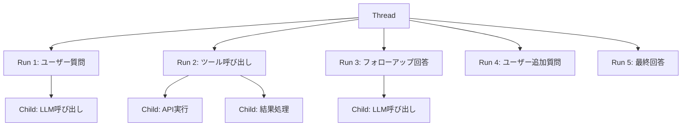
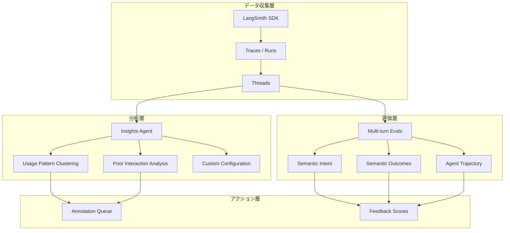

## ブログ概要（Summary）

本記事は [Improve agent quality with Insights Agent and Multi-turn Evals, now in LangSmith](https://www.langchain.com/blog/insights-agent-multiturn-evals-langsmith) の解説記事です。

LangChainチームは2025年10月、LangSmithプラットフォームに2つの新機能「Insights Agent」と「Multi-turn Evals」をリリースしたことを発表している。Insights Agentは本番環境の大量のトレースデータを自動分析し、エージェントの使用パターン・行動パターン・障害モードを階層的にクラスタリングする機能である。Multi-turn Evalsはマルチターン会話全体を対象としたオンライン評価機能であり、Semantic Intent（ユーザー目標の理解度）、Semantic Outcomes（タスク完了状態）、Agent Trajectory（ツール呼び出し・意思決定パス）の3軸で評価を行う。両機能は「thread」（マルチターンのエージェントインタラクション）をLangSmithのファーストクラス概念として位置づける戦略的転換を反映している。

この記事は [Zenn記事: LangSmith Online Evaluatorで本番エージェントの品質を自動監視する](https://zenn.dev/0h_n0/articles/2639c195b720d0) の深掘りです。

## 情報源

- **種別**: 企業テックブログ（LangChain）
- **URL**: [Improve agent quality with Insights Agent and Multi-turn Evals, now in LangSmith](https://www.langchain.com/blog/insights-agent-multiturn-evals-langsmith)
- **組織**: LangChain
- **著者**: LangChain Team
- **発表日**: 2025年10月23日

## 技術的背景（Technical Background）

### なぜthread-level監視が必要か

LLMエージェントの本番運用において、従来のリクエスト単位の監視では捉えきれない問題が顕在化している。エージェントはユーザーとのマルチターン会話を通じてタスクを遂行するが、個々のリクエスト（単一のLLM呼び出し）は正常に見えても、会話全体としてはユーザーの目標を達成できていないケースが発生する。

たとえば、カスタマーサポートエージェントが各ターンで文法的に正しい応答を返していても、ユーザーの問い合わせを堂々巡りさせている場合、個別トレースの評価では問題を検出できない。また、ツール呼び出しの順序が非効率であったり、不要なAPI呼び出しを繰り返している場合も、単一トレースの分析では全体像を把握しにくい。

この課題に対し、LangChainチームはLangSmithにおいて「thread」をファーストクラスの概念として導入している。threadはマルチターンのユーザー・エージェント間インタラクション全体を表現するオブジェクトであり、個別のrun（トレース）を会話単位でグルーピングする。LangChainチームは今後、thread-levelメトリクス、ダッシュボード、オートメーション、SDKサポートを順次拡充する計画を示している。

### 従来の監視手法の限界

従来のLLMアプリケーション監視は主に以下の指標に依存していた。

- **レイテンシ**: 個別リクエストの応答時間
- **トークン使用量**: 入出力トークン数とコスト
- **エラー率**: API呼び出しの失敗率
- **単一トレース評価**: 1回のLLM呼び出しに対するスコアリング

これらは必要な指標であるが、エージェントの「品質」を測るには不十分である。thread-level監視はこのギャップを埋めるものであり、ユーザー目標の達成度、会話の効率性、障害パターンの体系的な把握を可能にする。

## 実装アーキテクチャ（Architecture）

### LangSmithのトレーシングアーキテクチャとの関連

LangSmithのトレーシングは、`run`（個別の実行単位）を基本要素とし、親子関係のツリー構造でエージェントの実行フローを表現する。threadはこのrunツリーの上位概念として位置づけられ、複数のrunを会話セッション単位で束ねる。



threadを生成するには、各トレースのメタデータに`thread_id`を設定する。LangSmith SDKは一意な識別子を生成するための`uuid7`ヘルパーを提供している。

```python
from langsmith import traceable, uuid7

THREAD_ID = str(uuid7())

@traceable(name="Chat Bot", metadata={"thread_id": THREAD_ID})
def chat_pipeline(messages: list) -> dict:
    """thread_idをメタデータに設定することで、
    複数のrunが同一threadに紐づけられる"""
    chat_completion = client.chat.completions.create(
        model="gpt-4o", messages=messages
    )
    return {"messages": messages}
```

LangChainチームの公式ドキュメントでは、thread_idメタデータは子runを含むすべてのrunに設定する必要があると説明されている。子runにthread_idが設定されていない場合、threadによるフィルタリング、トークン使用量の集計、コストの集約に含まれなくなる。

### Insights AgentとMulti-turn Evalsの位置づけ

Insights AgentとMulti-turn Evalsは、このthread基盤の上に構築された分析・評価レイヤーである。



Insights Agentは事後分析（バッチ処理）として大量のトレースを俯瞰的にクラスタリングし、Multi-turn Evalsはリアルタイム評価（オンライン評価）として各会話の完了時に自動的にスコアリングを実行する。

## Insights Agentの技術詳細

### パターンクラスタリングの仕組み

Insights Agentは、LangSmithに蓄積されたトレースデータを自動的にクラスタリングし、階層的なカテゴリ構造を生成する。LangChainチームは3つのクラスタリングアプローチを提供している。

**1. Usage Pattern Grouping（使用パターンのグルーピング）**

ユーザーがエージェントをどのように使用しているかを特定する。たとえば「コード生成の依頼」「情報検索」「データ分析の依頼」といったカテゴリに自動分類し、各カテゴリの頻度分布を可視化する。

**2. Poor Interaction Analysis（不良インタラクション分析）**

フラストレーションを示すシグナル（ユーザーの再質問、エラー応答、長時間の会話など）を検出し、根本原因ごとにグループ化する。これにより、改善すべき問題の優先順位付けが可能になる。

**3. Custom Configuration（カスタム設定）**

グルーピングカテゴリ、時間フィルター、キーワードフィルターをユーザーが定義する。事前定義されたトップレベルカテゴリを指定し、サブカテゴリを自動生成させることも可能である。

### フィルタリングとサマリプロンプト

Insights Agentは1回の分析で最大1,000トレースを処理する。トレース選択にはサンプリング設定と時間範囲指定が利用でき、追加フィルターによるマッチ件数をリアルタイムで確認できる。

サマリプロンプトではテンプレート変数を使用してトレースの情報を参照する。

| テンプレート変数 | 内容 |
|---|---|
| `{{run.inputs}}` | ルートrunの入力 |
| `{{run.outputs}}` | ルートrunの出力 |
| `{{run.error}}` | エラー文字列 |
| `{{run.feedback}}` | 全フィードバックスコア |
| `{{run.feedback.<key>}}` | 特定のフィードバックスコア |
| `{{all_thread_messages}}` | 会話全体のメッセージ履歴（thread専用） |

ネストされたフィールドにはドット記法（例: `{{run.inputs.foo.bar}}`）でアクセスできる。

### モデル選択と処理コスト

Insights Agentは2つのモデルを使用する。

- **Thinking Model**: クラスタリング処理に使用。高い推論能力が必要なため、コストは高め
- **Summarization Model**: 個別トレースの要約に使用。高速・低コストなモデルを選択

LangChainチームの公式ドキュメントによれば、1,000スレッドの分析でOpenAI使用時に$1.00-$2.00、Anthropic使用時に$3.00-$4.00のコストが発生する。データ量に応じて処理時間は最大15分程度となる。

### Python SDKによるInsights生成

LangSmith Python SDKを使用して、プログラマティックにInsightsレポートを生成できる。

```python
import os
from langsmith import Client

client = Client()

# チャット履歴データを用意
chat_histories = [
    [
        {"role": "user", "content": "注文のステータスを教えてください"},
        {"role": "assistant", "content": "注文番号をお知らせください"},
        {"role": "user", "content": "ORD-12345です"},
        {"role": "assistant", "content": "ORD-12345は配送中です。明日到着予定です。"},
    ],
    [
        {"role": "user", "content": "返品したいのですが"},
        {"role": "assistant", "content": "返品理由をお聞かせください"},
        {"role": "user", "content": "サイズが合わなかったです"},
        {"role": "assistant", "content": "返品ラベルをメールでお送りしました"},
    ],
]

# Insightsレポートを生成
report = client.generate_insights(
    chat_histories=chat_histories,
    name="Customer Support Topics - September 2026",
    instructions="主要な問い合わせカテゴリと障害パターンを特定してください",
    openai_api_key=os.environ["OPENAI_API_KEY"],
)

print(f"Report URL: {report}")
```

SDKはチャット履歴をトレースとしてアップロードし、レポートを生成してUIリンクを返す。

### スケジュール実行

Insights Agentはスケジュール実行にも対応しており、定期的な品質レポートの自動生成が可能である。

- **Daily**: 毎日8:00 UTC
- **Weekly**: 毎週月曜日8:00 UTC
- **Custom**: 任意のcron式（UTC）

動的な時間範囲が計算されるため、前回実行以降のデータのみを対象とした差分分析が可能である。Insights AgentはLangSmith PlusおよびEnterprise cloud顧客向けにGA（一般提供）されている。

## Multi-turn Evalsの技術詳細

### Semantic Intent / Outcomes / Trajectoryの3軸評価

Multi-turn Evalsは、マルチターン会話全体を対象とした評価を3つの軸で実行する。

**Semantic Intent（意味的意図）**

ユーザーの目標をエージェントがどの程度正確に理解しているかを評価する。単一ターンでの応答品質ではなく、会話全体を通じてユーザーの意図が正しく把握・維持されているかを判定する。たとえば、ユーザーが「先月の売上レポートを作成して」と依頼した場合、エージェントが適切な期間、対象データ、フォーマットを理解しているかを評価する。

**Semantic Outcomes（意味的成果）**

タスクの完了状態と失敗理由を判定する。「完了」「部分完了」「失敗」といった粒度でスコアリングし、失敗時にはその原因（情報不足、ツール呼び出しエラー、ユーザー離脱など）を分類する。

**Agent Trajectory（エージェント軌跡）**

ツール呼び出しと意思決定パスを含む完全なインタラクションフローを評価する。エージェントが最適な経路でタスクを遂行しているか、不要なステップが含まれていないかを検証する。

$$
\text{Trajectory Score} = \frac{\text{有効なツール呼び出し数}}{\text{総ツール呼び出し数}} \times w_{\text{efficiency}} + \frac{\text{達成サブゴール数}}{\text{総サブゴール数}} \times w_{\text{completion}}
$$

ここで、$w_{\text{efficiency}}$と$w_{\text{completion}}$はそれぞれ効率性と完了度の重みである。この数式はTrajectory評価の概念的な枠組みを示すものであり、実際のLangSmithでの実装はLLM-as-Judgeプロンプトを通じてスコアリングを定義する。

### LLM-as-Judge実装パターン

Multi-turn Evalsでは、LLM-as-Judgeプロンプトを定義してスコアリング基準をカスタマイズする。LangSmithのUIから「Evaluators」タブで設定可能であり、以下の要素を構成する。

1. **評価者名**: 識別用の名前
2. **フィルター条件**: 評価対象のrunを絞り込むフィルター（特定のツール呼び出し、ユーザーフィードバック、トレースメタデータなど）
3. **サンプリング率**: フィルター後のrunのうち評価対象とする割合（コスト管理用）
4. **支出上限**: プロジェクトまたはデータセットごとの週次LLM評価コスト上限
5. **バックフィル**: 過去のトレースに遡って評価を適用するオプション

Multi-turn Evalsは全LangSmithユーザーに公開されている。フィードバックはThreadsタブで確認でき、thread内の特定のrunに紐づけて表示される。

### オンライン評価のトリガー

Multi-turn Evalsはオンライン評価として動作し、会話の完了時に自動的にトリガーされる。これにより、手動でのバッチ評価を待たずに、リアルタイムで品質スコアが蓄積される。蓄積されたスコアはダッシュボードで時系列推移を確認でき、品質劣化の早期検知に活用できる。

## 実装例（Pythonコード）

### LangSmithを活用したエージェント監視パイプラインの構築

以下に、LangSmith SDKを使用してマルチターンエージェントのトレーシング・スレッド管理・評価を一貫して行う実装例を示す。

#### 1. 基本セットアップとトレーシング

```python
import os
from langsmith import Client, traceable, uuid7
from openai import OpenAI

# LangSmith クライアント初期化
ls_client = Client(api_key=os.environ["LANGSMITH_API_KEY"])
openai_client = OpenAI()

# プロジェクト設定
os.environ["LANGCHAIN_PROJECT"] = "production-agent-monitoring"
os.environ["LANGCHAIN_TRACING_V2"] = "true"
```

#### 2. Thread管理付きエージェントの実装

```python
from dataclasses import dataclass, field
from langsmith import traceable, uuid7


@dataclass
class ConversationState:
    """会話状態を管理するデータクラス"""
    thread_id: str = field(default_factory=lambda: str(uuid7()))
    messages: list[dict[str, str]] = field(default_factory=list)
    tool_calls: list[dict] = field(default_factory=list)

    def add_message(self, role: str, content: str) -> None:
        self.messages.append({"role": role, "content": content})


TOOLS = [
    {
        "type": "function",
        "function": {
            "name": "search_knowledge_base",
            "description": "社内ナレッジベースを検索する",
            "parameters": {
                "type": "object",
                "properties": {
                    "query": {"type": "string", "description": "検索クエリ"}
                },
                "required": ["query"],
            },
        },
    },
    {
        "type": "function",
        "function": {
            "name": "create_ticket",
            "description": "サポートチケットを作成する",
            "parameters": {
                "type": "object",
                "properties": {
                    "title": {"type": "string"},
                    "description": {"type": "string"},
                    "priority": {
                        "type": "string",
                        "enum": ["low", "medium", "high"],
                    },
                },
                "required": ["title", "description"],
            },
        },
    },
]


@traceable(name="Tool Execution")
def execute_tool(tool_name: str, arguments: dict) -> str:
    """ツール呼び出しを実行する（実装はスタブ）"""
    if tool_name == "search_knowledge_base":
        return f"検索結果: '{arguments['query']}' に関する情報が3件見つかりました"
    elif tool_name == "create_ticket":
        return f"チケット '{arguments['title']}' を作成しました（ID: TKT-001）"
    return f"不明なツール: {tool_name}"


@traceable(name="Agent Turn")
def agent_turn(
    state: ConversationState,
    user_input: str,
) -> str:
    """エージェントの1ターンを実行する

    metadata にthread_idを設定することで、
    全てのrunが同一threadに紐づけられる。
    """
    state.add_message("user", user_input)

    response = openai_client.chat.completions.create(
        model="gpt-4o",
        messages=state.messages,
        tools=TOOLS,
        langsmith_extra={
            "metadata": {"thread_id": state.thread_id},
        },
    )

    message = response.choices[0].message

    # ツール呼び出しがある場合は実行
    if message.tool_calls:
        for tool_call in message.tool_calls:
            import json

            args = json.loads(tool_call.function.arguments)
            result = execute_tool(tool_call.function.name, args)
            state.tool_calls.append(
                {
                    "tool": tool_call.function.name,
                    "arguments": args,
                    "result": result,
                }
            )
            state.add_message("tool", result)

        # ツール結果を踏まえて再度LLM呼び出し
        followup = openai_client.chat.completions.create(
            model="gpt-4o",
            messages=state.messages,
            langsmith_extra={
                "metadata": {"thread_id": state.thread_id},
            },
        )
        assistant_message = followup.choices[0].message.content
    else:
        assistant_message = message.content

    state.add_message("assistant", assistant_message)
    return assistant_message
```

#### 3. 会話の実行とトレース

```python
@traceable(name="Full Conversation")
def run_conversation(user_inputs: list[str]) -> ConversationState:
    """マルチターン会話を実行する

    全ターンが同一thread_idで紐づけられるため、
    LangSmithのThreadsタブで会話全体を確認できる。
    """
    state = ConversationState()

    for user_input in user_inputs:
        response = agent_turn(state, user_input)
        print(f"User: {user_input}")
        print(f"Agent: {response}")
        print("---")

    return state


# 実行例
conversation = run_conversation(
    [
        "先月の売上データを確認したいのですが",
        "特に関東エリアの内訳を教えてください",
        "その結果をチケットにまとめてもらえますか",
    ]
)
print(f"Thread ID: {conversation.thread_id}")
```

#### 4. プログラマティックなフィードバック送信

```python
from langsmith import Client

ls_client = Client()


def submit_thread_feedback(
    run_id: str,
    intent_score: float,
    outcome_score: float,
    trajectory_score: float,
    comment: str | None = None,
) -> None:
    """thread内のrunに対してフィードバックを送信する

    Multi-turn Evalsで定義した評価軸に対応する
    フィードバックをプログラマティックに送信する。
    """
    ls_client.create_feedback(
        run_id=run_id,
        key="semantic_intent",
        score=intent_score,
        comment=f"Intent understanding: {intent_score:.2f}",
    )
    ls_client.create_feedback(
        run_id=run_id,
        key="semantic_outcome",
        score=outcome_score,
        comment=f"Task completion: {outcome_score:.2f}",
    )
    ls_client.create_feedback(
        run_id=run_id,
        key="agent_trajectory",
        score=trajectory_score,
        comment=comment or f"Trajectory efficiency: {trajectory_score:.2f}",
    )
```

#### 5. Insights Agentの定期実行スクリプト

```python
import os
from datetime import datetime
from langsmith import Client


def generate_weekly_insights(project_name: str) -> str:
    """週次のInsightsレポートを生成する

    本番トレースからパターンを抽出し、
    改善すべき領域を特定する。
    """
    client = Client()

    # プロジェクトのrunを取得
    runs = list(
        client.list_runs(
            project_name=project_name,
            execution_order=1,  # ルートrunのみ
            start_time=datetime(2026, 8, 26),
            end_time=datetime(2026, 9, 2),
        )
    )

    # チャット履歴を構築
    chat_histories = []
    for run in runs:
        if run.inputs and run.outputs:
            history = []
            if "messages" in run.inputs:
                for msg in run.inputs["messages"]:
                    history.append(
                        {"role": msg.get("role", "user"), "content": msg.get("content", "")}
                    )
            if "output" in run.outputs:
                history.append({"role": "assistant", "content": run.outputs["output"]})
            if history:
                chat_histories.append(history)

    if not chat_histories:
        return "No traces found for the specified period."

    # Insightsレポートを生成
    report = client.generate_insights(
        chat_histories=chat_histories,
        name=f"Weekly Report - {project_name} - {datetime.now().strftime('%Y-%m-%d')}",
        instructions=(
            "以下の観点で分析してください: "
            "1. 主要な使用パターンとその頻度 "
            "2. 失敗パターンと根本原因 "
            "3. ユーザー満足度が低いインタラクションの特徴"
        ),
        openai_api_key=os.environ["OPENAI_API_KEY"],
    )

    return report


if __name__ == "__main__":
    result = generate_weekly_insights("production-agent-monitoring")
    print(f"Insights Report: {result}")
```

## パフォーマンス最適化（Performance）

### トレーシングのオーバーヘッド管理

LangSmith SDKのトレーシングは非同期でバッチ送信されるため、エージェントの応答レイテンシへの影響は最小限に抑えられている。しかし、高トラフィック環境では以下の最適化が有効である。

**サンプリング率の調整**: Multi-turn Evalsのサンプリング率を調整することで、評価コストを制御できる。全会話の100%を評価する必要はなく、統計的に有意なサンプル（例: 10-20%）で品質傾向を把握できる。

**支出上限の設定**: プロジェクトごとに週次のLLM評価コスト上限を設定できるため、予期しないコスト増加を防止できる。

**フィルター条件の最適化**: 評価対象のrunをフィルタリングすることで、重要度の高い会話に評価リソースを集中させることが可能である。たとえば、特定のツール呼び出しを含むrunや、ユーザーからネガティブフィードバックを受けたrunに限定した評価を設定できる。

### Insights Agentの効率的な運用

Insights Agentは1回の分析で最大1,000トレースを処理する。大量のトレースがある場合は、時間範囲やキーワードフィルターで分析対象を絞り込むことが推奨される。スケジュール実行を活用し、Daily（毎日8:00 UTC）またはWeekly（毎週月曜日8:00 UTC）で定期レポートを自動生成することで、手動分析の負荷を削減できる。

## 運用での学び（Production Lessons）

### エージェント品質監視の段階的導入

LangChainチームが提示しているInsights AgentとMulti-turn Evalsは、エージェント品質監視を段階的に導入するアプローチを示唆している。

**第1段階: トレーシングの導入**

まずLangSmith SDKを組み込み、全てのLLM呼び出し・ツール呼び出しをトレースする。この段階ではthread_idを設定し、マルチターン会話のグルーピングを確立する。

**第2段階: Multi-turn Evalsの設定**

オンライン評価を設定し、各会話に対するSemantic Intent / Outcomes / Trajectoryの自動スコアリングを開始する。初期段階ではサンプリング率を低めに設定し、評価プロンプトの品質を検証する。

**第3段階: Insights Agentの活用**

蓄積されたトレースデータに対してInsights Agentを実行し、使用パターンと障害パターンの俯瞰的な把握を行う。定期実行を設定し、品質トレンドの変化を監視する。

### thread概念の組織的活用

threadをファーストクラス概念として導入することで、開発チームはエージェントの改善サイクルを「会話単位」で回せるようになる。特定のカテゴリに属する会話をアノテーションキューに追加し、評価データセットとして蓄積するワークフローが構築できる。LangChainチームは、今後thread-levelのメトリクスダッシュボード、アノテーションキュー・データセットへの自動追加、SDKによるプログラマティックなスレッド分析機能を順次提供する予定であると述べている。

## 学術研究との関連（Academic Connection）

Insights AgentとMulti-turn Evalsが採用している手法は、以下の学術研究と関連がある。

- **LLM-as-Judge**: Zheng et al. (2023) "Judging LLM-as-a-Judge with MT-Bench and Chatbot Arena" (NeurIPS 2023) は、LLMを評価者として利用するフレームワークを体系化した。Multi-turn Evalsの評価プロンプト設計はこの研究の知見に基づいている。

- **Agent Evaluation Frameworks**: Liu et al. (2023) "AgentBench: Evaluating LLMs as Agents" は、LLMエージェントを多角的に評価するベンチマークを提案した。Agent Trajectory評価軸は、タスク完了までの行動系列を評価するAgentBenchの考え方と共通点を持つ。

- **Conversation-Level Evaluation**: Mehri and Eskenazi (2020) "USR: An Unsupervised and Reference-Free Evaluation Metric for Dialog" は、対話システムの会話レベル評価指標を提案した。Multi-turn Evalsの会話全体を対象とした評価アプローチは、単一発話ではなく対話全体の質を測定するという同様の動機に基づいている。

- **Trace Clustering**: LLMトレースの自動クラスタリングは、ソフトウェアエンジニアリングにおけるログマイニング（He et al., 2016 "An Evaluation Study on Log Parsing and Its Use in Log Mining"）の手法をLLMエージェントの文脈に応用したものと捉えることができる。

## まとめと実践への示唆

LangChainチームが発表したInsights AgentとMulti-turn Evalsは、LLMエージェントの本番監視を「リクエスト単位」から「会話単位」へと進化させる機能である。threadをファーストクラスの概念として導入することで、マルチターンエージェントの品質を体系的に把握・改善するための基盤が整備されている。

実践面では、まずthread_idの設定によるトレースのグルーピングを導入し、次にMulti-turn Evalsで自動スコアリングを開始し、Insights Agentで俯瞰的な品質レポートを定期生成するという段階的なアプローチが推奨される。Zenn記事「LangSmith Online Evaluatorで本番エージェントの品質を自動監視する」で解説しているオンライン評価の設計パターンと組み合わせることで、エージェント品質の継続的な改善サイクルを構築できる。

## 参考文献

- **Blog URL**: [Improve agent quality with Insights Agent and Multi-turn Evals, now in LangSmith](https://www.langchain.com/blog/insights-agent-multiturn-evals-langsmith)
- **LangSmith Documentation**: [https://docs.langchain.com/langsmith](https://docs.langchain.com/langsmith)
- **LangSmith Insights Guide**: [https://docs.langchain.com/langsmith/insights](https://docs.langchain.com/langsmith/insights)
- **LangSmith Threads Guide**: [https://docs.langchain.com/langsmith/threads](https://docs.langchain.com/langsmith/threads)
- **LangSmith Online Evaluations**: [https://docs.langchain.com/langsmith/online-evaluations](https://docs.langchain.com/langsmith/online-evaluations)
- Zheng, L., et al. (2023). "Judging LLM-as-a-Judge with MT-Bench and Chatbot Arena." NeurIPS 2023.
- Liu, X., et al. (2023). "AgentBench: Evaluating LLMs as Agents." ICLR 2024.
- Mehri, S. and Eskenazi, M. (2020). "USR: An Unsupervised and Reference-Free Evaluation Metric for Dialog." ACL 2020.
- He, P., et al. (2016). "An Evaluation Study on Log Parsing and Its Use in Log Mining." ICSE 2016.
- **Related Zenn article**: [LangSmith Online Evaluatorで本番エージェントの品質を自動監視する](https://zenn.dev/0h_n0/articles/2639c195b720d0)
