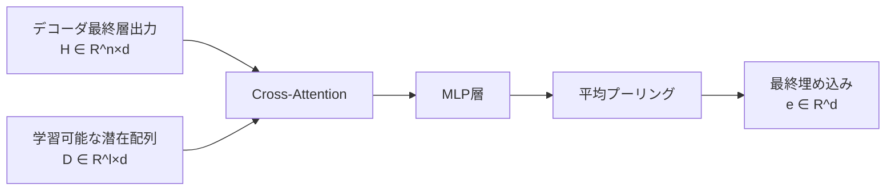
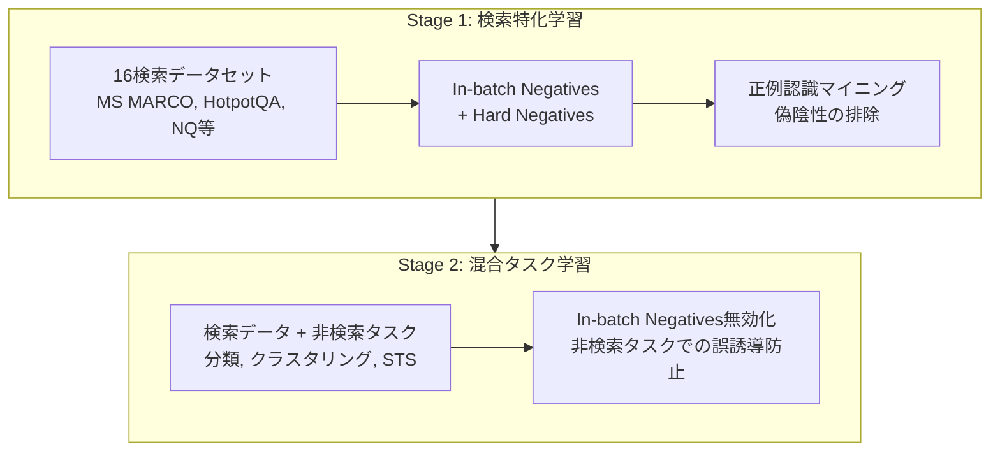

## 論文概要（Abstract）

本記事は [NV-Embed: Improved Techniques for Training LLMs as Generalist Embedding Models](https://arxiv.org/abs/2405.17428)（arXiv: 2405.17428、2024年5月公開、ICLR 2025 Spotlight採択）の解説記事です。

Decoder-only LLMベースの埋め込みモデルが、BERTやT5ベースのモデルを汎用テキスト埋め込みタスクで上回り始めている。本論文では、LLMを汎用埋め込みモデルとして活用するためのアーキテクチャ設計、学習手順、データセット構築の手法としてNV-Embedを提案している。著者らは辞書学習に着想を得た**潜在注意層（Latent Attention Layer）**によるプーリング機構と、対比学習時の**因果注意マスクの除去**、そして**2段階対比指示チューニング**を導入し、MTEB（Massive Text Embedding Benchmark）56タスクで72.31のスコアを達成して1位を獲得したと報告している。

この記事は [Zenn記事: Instruction-Aware Embeddingの精度評価：タスク指示で変わる検索精度を定量検証する](https://zenn.dev/0h_n0/articles/9ca7ef23663c81) の深掘りです。

## 情報源

- **arXiv ID**: 2405.17428
- **URL**: [https://arxiv.org/abs/2405.17428](https://arxiv.org/abs/2405.17428)
- **著者**: Chankyu Lee, Rajarshi Roy, Mengyao Xu, Jonathan Raiman, Mohammad Shoeybi, Bryan Catanzaro, Wei Ping（NVIDIA）
- **発表年**: 2024（v1: 2024年5月、v3: 2025年2月）
- **分野**: cs.CL（計算言語学）, cs.AI, cs.IR（情報検索）, cs.LG（機械学習）
- **採択**: ICLR 2025 Spotlight

## 背景と動機（Background & Motivation）

テキスト埋め込みモデルは、検索（Retrieval）、分類（Classification）、クラスタリング（Clustering）、意味的類似度（STS）など多様なNLPタスクの基盤技術である。Zenn記事で解説されているInstruction-Aware Embeddingの手法は、タスク指示文を付与することで埋め込みの質を向上させるアプローチだが、そのベースモデル自体の性能が最終的な精度を大きく左右する。

従来の埋め込みモデルはBERT（Encoder-only）やT5（Encoder-Decoder）をベースとしていたが、2023年以降、Decoder-only LLMベースの手法が台頭してきた。しかし、Decoder-only LLMを埋め込みモデルとして使う際にはいくつかの技術的課題が存在する。

1. **プーリング手法の限界**: mean poolingは全トークンを均等に扱うため情報の重要度を区別できず、last token poolingは最終トークンに過度に依存する
2. **因果注意マスクの制約**: Decoder-onlyモデルは自己回帰生成のために因果マスク（下三角マスク）を使用するが、テキスト全体の意味表現を獲得するには双方向の注意機構が望ましい
3. **多タスクでの性能バランス**: 検索タスクと非検索タスク（分類、クラスタリング等）で最適な学習戦略が異なるため、単一の学習プロトコルでは性能が頭打ちになる

著者らはこれらの課題に対し、アーキテクチャ・学習手法・データの3軸から統合的に解決策を提案している。

## 主要な貢献（Key Contributions）

- **貢献1**: 辞書学習に着想を得た**潜在注意層（Latent Attention Layer）**を導入し、mean poolingやlast token方式を一貫して上回るプーリング機構を実現
- **貢献2**: 対比学習時にDecoder-onlyモデルの**因果注意マスクを除去**し双方向注意に変更することで、MTEB全56タスクの平均スコアが一貫して向上することを実証
- **貢献3**: 検索タスクと非検索タスクを分離した**2段階対比指示チューニング**を提案し、タスク間の干渉を回避
- **貢献4**: Hard negative mining、合成データ生成（Mixtral-8x22B-Instruct）、example-basedクラスタリングデータ構築など、データ品質向上の手法を体系化

## 技術的詳細（Technical Details）

### 潜在注意層（Latent Attention Layer）

NV-Embedの中核となるアーキテクチャ革新は、辞書学習（Dictionary Learning）に着想を得た潜在注意層である。従来のmean poolingやlast token poolingに代わり、学習可能な潜在変数を用いたクロスアテンションで系列全体の情報を集約する。



具体的な計算手順は以下の通りである。デコーダの最終層出力を$\mathbf{H} \in \mathbb{R}^{n \times d}$、学習可能な潜在配列（辞書）を$\mathbf{D} \in \mathbb{R}^{l \times d}$とする。

**Step 1: クロスアテンション**

$$
\mathbf{Z} = \text{softmax}\left(\frac{\mathbf{H} \mathbf{D}^T}{\sqrt{d}}\right) \mathbf{D}
$$

ここで、
- $\mathbf{H}$: デコーダ最終層の隠れ状態（Query）、形状 $(n, d)$
- $\mathbf{D}$: 学習可能な潜在配列（Key/Value）、形状 $(l, d)$
- $n$: 入力系列長
- $l$: 潜在変数の数（論文では512）
- $d$: 隠れ次元（4096）

注意すべき点として、通常のクロスアテンションでは$\mathbf{Q}=\mathbf{H}$に対して$\mathbf{K}=\mathbf{V}=\mathbf{D}$（潜在配列）を使用している。これは辞書学習における辞書原子（dictionary atoms）の概念と対応しており、各潜在変数がテキストの異なる意味的側面を捉える役割を果たすと著者らは説明している。

**Step 2: MLP変換と平均プーリング**

$$
\mathbf{e} = \text{MeanPool}(\text{MLP}(\mathbf{Z}))
$$

クロスアテンションの出力$\mathbf{Z} \in \mathbb{R}^{n \times d}$をMLP層で変換した後、平均プーリングで固定長の埋め込みベクトル$\mathbf{e} \in \mathbb{R}^d$を得る。

論文Table 2より、NV-Embed実装では$l=512$の潜在変数、$d=4096$次元、8ヘッドのマルチヘッドアテンションを使用している。

```python
import torch
import torch.nn as nn
import torch.nn.functional as F


class LatentAttentionLayer(nn.Module):
    """NV-Embedの潜在注意層（擬似コード）

    辞書学習に着想を得たクロスアテンションによるプーリング機構。
    デコーダ出力をQuery、学習可能な潜在配列をKey/Valueとして使用する。

    Args:
        d_model: 隠れ次元（4096）
        n_latents: 潜在変数の数（512）
        n_heads: 注意ヘッド数（8）
    """

    def __init__(self, d_model: int = 4096, n_latents: int = 512, n_heads: int = 8):
        super().__init__()
        self.n_heads = n_heads
        self.d_k = d_model // n_heads

        # 学習可能な潜在配列（辞書）
        self.latent_array = nn.Parameter(torch.randn(n_latents, d_model))

        # Query/Key/Value射影
        self.W_q = nn.Linear(d_model, d_model)
        self.W_k = nn.Linear(d_model, d_model)
        self.W_v = nn.Linear(d_model, d_model)

        # MLP層
        self.mlp = nn.Sequential(
            nn.Linear(d_model, d_model * 4),
            nn.GELU(),
            nn.Linear(d_model * 4, d_model),
        )
        self.layer_norm = nn.LayerNorm(d_model)

    def forward(self, hidden_states: torch.Tensor) -> torch.Tensor:
        """潜在注意層の順伝播

        Args:
            hidden_states: デコーダ最終層出力 (batch_size, seq_len, d_model)

        Returns:
            埋め込みベクトル (batch_size, d_model)
        """
        batch_size = hidden_states.size(0)

        # Query: デコーダ出力、Key/Value: 潜在配列
        Q = self.W_q(hidden_states)
        D = self.latent_array.unsqueeze(0).expand(batch_size, -1, -1)
        K = self.W_k(D)
        V = self.W_v(D)

        # マルチヘッドアテンション
        Q = Q.view(batch_size, -1, self.n_heads, self.d_k).transpose(1, 2)
        K = K.view(batch_size, -1, self.n_heads, self.d_k).transpose(1, 2)
        V = V.view(batch_size, -1, self.n_heads, self.d_k).transpose(1, 2)

        attn_scores = torch.matmul(Q, K.transpose(-2, -1)) / (self.d_k ** 0.5)
        attn_weights = F.softmax(attn_scores, dim=-1)
        context = torch.matmul(attn_weights, V)

        # ヘッド結合
        context = context.transpose(1, 2).contiguous()
        context = context.view(batch_size, -1, self.n_heads * self.d_k)

        # MLP + 平均プーリング
        output = self.layer_norm(self.mlp(context) + context)
        embedding = output.mean(dim=1)  # (batch_size, d_model)

        return embedding
```

### 因果注意マスクの除去（Bidirectional Attention）

Decoder-onlyモデル（Mistral 7B等）は自己回帰生成のために因果注意マスク（causal attention mask）を使用する。このマスクは下三角行列であり、各トークンは自身より前のトークンにしか注意を向けられない。

$$
\text{CausalMask}_{ij} =
\begin{cases}
0 & \text{if } i \geq j \\
-\infty & \text{if } i < j
\end{cases}
$$

NV-Embedでは、対比学習のfine-tuning時にこの因果マスクを除去し、**双方向注意**（bidirectional attention）に変更する。

$$
\text{BiAttn}(Q, K, V) = \text{softmax}\left(\frac{QK^T}{\sqrt{d_k}}\right)V
$$

著者らはこの変更について、因果マスクありと双方向マスクの比較実験を行い、双方向マスクが全56タスクの平均MTEBスコアで一貫して優れることを確認したと報告している（論文Section 4.1）。直感的には、テキスト全体の意味表現を獲得する埋め込みタスクでは、未来のトークン情報も含めた双方向の文脈理解が有利であるため、この結果は合理的である。

なお、事前学習済みの重みは因果マスクのもとで学習されているため、fine-tuningで突然双方向に変更することの整合性が懸念されるが、著者らは対比学習の段階で十分に適応が進むと述べている。

### 2段階対比指示チューニング（Two-Stage Contrastive Instruction-Tuning）

NV-Embedの学習プロトコルは、検索タスクと非検索タスクの最適な学習戦略の違いを考慮した2段階構成となっている。



**Stage 1: 検索特化学習**

16の検索データセット（MS MARCO、HotpotQA、Natural Questions、PAQ、StackExchange等、合計約220万サンプル）で対比学習を行う。損失関数はInfoNCE損失である。

$$
\mathcal{L}_{\text{InfoNCE}} = -\log \frac{\exp(\text{sim}(\mathbf{q}, \mathbf{p}^+) / \tau)}{\exp(\text{sim}(\mathbf{q}, \mathbf{p}^+) / \tau) + \sum_{j=1}^{N} \exp(\text{sim}(\mathbf{q}, \mathbf{p}_j^-) / \tau)}
$$

ここで、
- $\mathbf{q}$: クエリ埋め込み
- $\mathbf{p}^+$: 正例の文書埋め込み
- $\mathbf{p}_j^-$: 負例の文書埋め込み（in-batch negatives + hard negatives）
- $\tau$: 温度パラメータ
- $\text{sim}(\cdot, \cdot)$: コサイン類似度

各クエリに対して正例1件とhard negatives 7件を使用し、バッチサイズ128でin-batch negativesも活用する。

**正例認識Hard Negative Mining**: 検索データセットでは、同一クエリに対して関連度スコアが異なる複数の文書が存在する場合がある。Hard negativeをマイニングする際に、実は正例である文書を誤って負例として使用する「偽陰性（false negative）」の問題が発生しうる。著者らは関連度スコアを考慮して偽陰性を排除する手法を導入しており、この工夫によりnDCG@10が59.22から61.52に向上したと報告している（論文Table 5）。

**Stage 2: 混合タスク学習**

検索データに加え、分類（12データセット）、クラスタリング（11データセット）、意味的類似度（3データセット）のタスクを統合して学習する。

Stage 2の重要な設計判断として、**in-batch negativesを無効化**する点が挙げられる。これは、非検索タスク（例: 分類）では同一バッチ内の他サンプルが意味的に無関係とは限らないため、in-batch negativesが誤った学習信号を生成してしまうからである。この判断は特にクラスタリングタスクでの性能に大きく寄与したと著者らは報告している。

### データ構築の工夫

**合成データ生成**: Mixtral-8x22B-Instructを用いて60,000タスク（約12万例）の合成データを生成している。これにより、既存データセットでカバーされない多様なドメインのクエリ・文書ペアを補完している。

**Example-basedクラスタリングデータ構築**: クラスタリングタスクのデータを従来のラベルベース（同一カテゴリ=正例）からexample-based（具体的なクラスタ例を提示）に変更することで、V-Measureが64.80から69.27に向上したと報告されている（論文Table 6）。

### 学習ハイパーパラメータ

論文で報告されている主要な学習設定を以下にまとめる。

| パラメータ | Stage 1 | Stage 2 |
|-----------|---------|---------|
| 学習率 | 2e-5 | 1.5e-5 |
| バッチサイズ | 128 | 128 |
| Hard negatives/クエリ | 7 | - |
| In-batch negatives | 有効 | **無効** |
| 最大シーケンス長 | 512 | 512 |
| 精度 | BFloat16 | BFloat16 |
| LoRA rank | 16 | 16 |
| LoRA alpha | 32 | 32 |

ベースモデルはMistral 7Bであり、LoRA（rank 16, alpha 32）による効率的なfine-tuningを採用している。

## 実装のポイント（Implementation）

### NV-Embed-v2の利用方法

NV-Embed-v2はHugging Faceで`nvidia/NV-Embed-v2`として公開されている。以下に主要な利用パターンを示す。

**HuggingFace Transformersでの利用**:

```python
import torch
import torch.nn.functional as F
from transformers import AutoModel

# モデル読み込み（trust_remote_code必須）
model = AutoModel.from_pretrained(
    "nvidia/NV-Embed-v2",
    trust_remote_code=True,
    torch_dtype=torch.float16,
)

# タスク指示の定義（検索タスクの例）
query_prefix = (
    "Instruct: Given a question, retrieve passages that answer the question\n"
    "Query: "
)
passage_prefix = ""

queries = ["What is the capital of France?"]
passages = ["Paris is the capital and largest city of France."]

# エンコード
query_embeddings = model.encode(queries, instruction=query_prefix, max_length=32768)
passage_embeddings = model.encode(passages, instruction=passage_prefix, max_length=32768)

# L2正規化
query_embeddings = F.normalize(query_embeddings, p=2, dim=1)
passage_embeddings = F.normalize(passage_embeddings, p=2, dim=1)

# コサイン類似度
scores = (query_embeddings @ passage_embeddings.T) * 100
print(f"Similarity score: {scores.item():.2f}")
```

**SentenceTransformersでの利用**:

```python
from sentence_transformers import SentenceTransformer

model = SentenceTransformer("nvidia/NV-Embed-v2", trust_remote_code=True)
model.max_seq_length = 32768
model.tokenizer.padding_side = "right"


def add_eos(texts: list[str]) -> list[str]:
    """EOSトークンを末尾に追加する（SentenceTransformers利用時に必須）"""
    return [text + model.tokenizer.eos_token for text in texts]


query_prefix = (
    "Instruct: Given a question, retrieve passages that answer the question\n"
    "Query: "
)

query_embeddings = model.encode(
    add_eos(queries),
    batch_size=2,
    prompt=query_prefix,
    normalize_embeddings=True,
)
passage_embeddings = model.encode(
    add_eos(passages),
    batch_size=2,
    normalize_embeddings=True,
)

scores = (query_embeddings @ passage_embeddings.T) * 100
```

### 実装上の注意点

1. **GPU メモリ**: NV-Embed-v2は約8Bパラメータ（Mistral 7B + 潜在注意層）であり、FP16で約16GBのVRAMを必要とする。A10G（24GB VRAM）のg5インスタンスで推論可能だが、バッチサイズに注意が必要
2. **EOSトークン付与**: SentenceTransformers利用時は入力テキスト末尾にEOSトークンを追加する必要がある。これを忘れると埋め込み品質が低下する
3. **タスク指示**: クエリ側にはタスクに応じた指示文を付与するが、文書（passage）側には指示文を付与しない。Zenn記事で解説されているInstruction-Aware Embeddingの設計原則と一致している
4. **出力次元**: 4096次元の埋め込みを出力する。ストレージやインデックスサイズが課題になる場合、Matryoshka表現の活用（先頭256-512次元のみ使用）で1-3%の精度低下に抑えつつ大幅に削減可能

## Production Deployment Guide

NV-Embed-v2は約8Bパラメータの7Bクラスモデルであり、GPU推論が必須となる。以下にAWS上での本番デプロイパターンを示す。

> **注記**: 本セクションのコスト試算は2026年9月時点のAWS ap-northeast-1（東京リージョン）料金の概算値です。実際のコストはトラフィックパターン、リージョン、バースト使用量により変動します。最新料金は[AWS料金計算ツール](https://calculator.aws/)で確認してください。

### AWS実装パターン（コスト最適化重視）

NV-Embed-v2はGPU推論が必須のため、Serverless（Lambda）構成は適さない。以下はGPUインスタンスを前提とした構成である。

| 構成 | トラフィック | インフラ | 月額概算 |
|------|------------|---------|---------|
| **Small** | ~500 req/日 | g5.xlarge x1（On-Demand） | $800-1,000 |
| **Medium** | ~5,000 req/日 | g5.xlarge x2（Spot + On-Demand） | $1,200-1,800 |
| **Large** | 50,000+ req/日 | EKS + g5.xlarge x4-8（Spot優先） | $3,000-6,000 |

**Small構成（~500 req/日）**:
- EC2 g5.xlarge（4 vCPU, 16GB RAM, A10G 24GB VRAM）: 約$780/月（On-Demand）
- NVIDIA Triton Inference Serverでモデルサービング
- ALB + Auto Scaling Group（min=1, max=1）
- S3（モデルアーティファクト保存）: 約$5/月
- CloudWatch（ログ・メトリクス）: 約$15/月

**Medium構成（~5,000 req/日）**:
- g5.xlarge x1（On-Demand、ベースライン）+ g5.xlarge x1（Spot、ピーク対応）
- Spot活用でピーク時コストを約70%削減
- ElastiCache Redis（埋め込みキャッシュ）: 約$50/月
- バッチリクエスト集約で1リクエストあたりの処理効率を向上

**Large構成（50,000+ req/日）**:
- EKS + Karpenter（Spot優先、g5.xlarge/g5.2xlarge混在）
- NVIDIA NIM（NV-Embed最適化コンテナ）でTensorRT最適化
- 水平スケーリング: Karpenterが負荷に応じて自動でGPUノードを追加
- 埋め込みキャッシュ（Redis Cluster）で重複リクエストを排除

### Terraformインフラコード

**Small構成（EC2 + Triton）**:

```hcl
# NV-Embed-v2 Small構成: EC2 g5.xlarge + Triton Inference Server
# 2026年9月時点の設定

terraform {
  required_version = ">= 1.9"
  required_providers {
    aws = {
      source  = "hashicorp/aws"
      version = "~> 5.70"
    }
  }
}

provider "aws" {
  region = "ap-northeast-1"
}

# --- VPC基盤（NAT Gateway不使用でコスト削減） ---
resource "aws_vpc" "embedding" {
  cidr_block           = "10.0.0.0/16"
  enable_dns_hostnames = true
  tags = { Name = "nv-embed-vpc", Project = "nv-embed" }
}

resource "aws_subnet" "public" {
  vpc_id                  = aws_vpc.embedding.id
  cidr_block              = "10.0.1.0/24"
  availability_zone       = "ap-northeast-1a"
  map_public_ip_on_launch = true
  tags = { Name = "nv-embed-public" }
}

resource "aws_internet_gateway" "igw" {
  vpc_id = aws_vpc.embedding.id
}

resource "aws_route_table" "public" {
  vpc_id = aws_vpc.embedding.id
  route {
    cidr_block = "0.0.0.0/0"
    gateway_id = aws_internet_gateway.igw.id
  }
}

resource "aws_route_table_association" "public" {
  subnet_id      = aws_subnet.public.id
  route_table_id = aws_route_table.public.id
}

# --- セキュリティグループ ---
resource "aws_security_group" "embedding_sg" {
  name_prefix = "nv-embed-"
  vpc_id      = aws_vpc.embedding.id

  ingress {
    from_port   = 8000
    to_port     = 8002
    protocol    = "tcp"
    cidr_blocks = ["10.0.0.0/16"]  # VPC内部のみ
    description = "Triton HTTP/gRPC/metrics"
  }

  egress {
    from_port   = 0
    to_port     = 0
    protocol    = "-1"
    cidr_blocks = ["0.0.0.0/0"]
  }
}

# --- IAMロール（最小権限） ---
resource "aws_iam_role" "embedding_instance" {
  name = "nv-embed-instance-role"
  assume_role_policy = jsonencode({
    Version = "2012-10-17"
    Statement = [{
      Action = "sts:AssumeRole"
      Effect = "Allow"
      Principal = { Service = "ec2.amazonaws.com" }
    }]
  })
}

resource "aws_iam_role_policy" "s3_model_access" {
  name = "s3-model-read"
  role = aws_iam_role.embedding_instance.id
  policy = jsonencode({
    Version = "2012-10-17"
    Statement = [{
      Effect   = "Allow"
      Action   = ["s3:GetObject", "s3:ListBucket"]
      Resource = [
        aws_s3_bucket.model_artifacts.arn,
        "${aws_s3_bucket.model_artifacts.arn}/*"
      ]
    }]
  })
}

resource "aws_iam_instance_profile" "embedding" {
  name = "nv-embed-instance-profile"
  role = aws_iam_role.embedding_instance.name
}

# --- S3（モデルアーティファクト） ---
resource "aws_s3_bucket" "model_artifacts" {
  bucket_prefix = "nv-embed-models-"
  tags = { Project = "nv-embed" }
}

resource "aws_s3_bucket_server_side_encryption_configuration" "model_sse" {
  bucket = aws_s3_bucket.model_artifacts.id
  rule {
    apply_server_side_encryption_by_default {
      sse_algorithm = "aws:kms"
    }
  }
}

# --- EC2 g5.xlarge（GPU推論） ---
resource "aws_instance" "embedding_server" {
  ami                    = "ami-0abcdef1234567890"  # Deep Learning AMI (Ubuntu)
  instance_type          = "g5.xlarge"               # A10G 24GB VRAM
  subnet_id              = aws_subnet.public.id
  vpc_security_group_ids = [aws_security_group.embedding_sg.id]
  iam_instance_profile   = aws_iam_instance_profile.embedding.name

  root_block_device {
    volume_size = 100  # モデル格納用
    volume_type = "gp3"
    encrypted   = true
  }

  tags = { Name = "nv-embed-server", Project = "nv-embed" }
}

# --- CloudWatchアラーム ---
resource "aws_cloudwatch_metric_alarm" "gpu_utilization" {
  alarm_name          = "nv-embed-gpu-high"
  comparison_operator = "GreaterThanThreshold"
  evaluation_periods  = 3
  metric_name         = "GPUUtilization"
  namespace           = "NVEmbed"
  period              = 300
  statistic           = "Average"
  threshold           = 90
  alarm_description   = "GPU utilization exceeds 90% for 15 minutes"
  alarm_actions       = [aws_sns_topic.alerts.arn]
}

resource "aws_sns_topic" "alerts" {
  name = "nv-embed-alerts"
}
```

**Large構成（EKS + Karpenter + Spot）**:

```hcl
# NV-Embed-v2 Large構成: EKS + Karpenter（Spot優先）

module "eks" {
  source  = "terraform-aws-modules/eks/aws"
  version = "~> 20.24"

  cluster_name    = "nv-embed-cluster"
  cluster_version = "1.31"

  vpc_id     = aws_vpc.embedding.id
  subnet_ids = [aws_subnet.public.id]

  cluster_endpoint_public_access = false  # セキュリティ強化

  # Karpenter用IAM
  enable_karpenter = true
  karpenter = {
    repository_username = data.aws_ecrpublic_authorization_token.token.user_name
    repository_password = data.aws_ecrpublic_authorization_token.token.password
  }
}

# --- Karpenter NodePool（Spot優先、GPU） ---
resource "kubectl_manifest" "karpenter_nodepool" {
  yaml_body = yamlencode({
    apiVersion = "karpenter.sh/v1"
    kind       = "NodePool"
    metadata   = { name = "gpu-embedding" }
    spec = {
      template = {
        spec = {
          requirements = [
            { key = "node.kubernetes.io/instance-type", operator = "In", values = ["g5.xlarge", "g5.2xlarge"] },
            { key = "karpenter.sh/capacity-type", operator = "In", values = ["spot", "on-demand"] },
            { key = "topology.kubernetes.io/zone", operator = "In", values = ["ap-northeast-1a", "ap-northeast-1c"] },
          ]
          nodeClassRef = { name = "gpu-al2023" }
        }
      }
      limits   = { cpu = "64", "nvidia.com/gpu" = "8" }
      disruption = {
        consolidationPolicy = "WhenEmptyOrUnderutilized"
        consolidateAfter    = "30s"
      }
    }
  })
}

# --- AWS Budgets（月額予算アラート） ---
resource "aws_budgets_budget" "embedding" {
  name         = "nv-embed-monthly"
  budget_type  = "COST"
  limit_amount = "5000"
  limit_unit   = "USD"
  time_unit    = "MONTHLY"

  notification {
    comparison_operator       = "GREATER_THAN"
    threshold                 = 80
    threshold_type            = "PERCENTAGE"
    notification_type         = "ACTUAL"
    subscriber_email_addresses = ["ops-team@example.com"]
  }
}
```

### 運用・監視設定

**CloudWatch Logs Insightsクエリ（レイテンシ分析）**:

```
# P95/P99レイテンシ分析
fields @timestamp, latency_ms, batch_size
| filter service = "nv-embed"
| stats percentile(latency_ms, 95) as p95,
        percentile(latency_ms, 99) as p99,
        avg(latency_ms) as avg_latency,
        count(*) as request_count
  by bin(1h)
| sort @timestamp desc
```

**CloudWatch Logs Insightsクエリ（GPU使用率監視）**:

```
# GPU使用率とVRAMの時間推移
fields @timestamp, gpu_utilization, gpu_memory_used_mb
| filter service = "nv-embed"
| stats avg(gpu_utilization) as avg_gpu,
        max(gpu_memory_used_mb) as max_vram
  by bin(5m)
| sort @timestamp desc
```

**CloudWatchアラーム設定（Python boto3）**:

```python
import boto3

cloudwatch = boto3.client("cloudwatch", region_name="ap-northeast-1")


def create_embedding_alarms(sns_topic_arn: str) -> None:
    """NV-Embed推論サーバーの監視アラームを作成する"""
    # GPU使用率スパイク検知
    cloudwatch.put_metric_alarm(
        AlarmName="nv-embed-gpu-spike",
        MetricName="GPUUtilization",
        Namespace="NVEmbed",
        Statistic="Average",
        Period=300,
        EvaluationPeriods=3,
        Threshold=95.0,
        ComparisonOperator="GreaterThanThreshold",
        AlarmActions=[sns_topic_arn],
        AlarmDescription="GPU utilization > 95% for 15min - scale out needed",
    )

    # 推論レイテンシ異常検知
    cloudwatch.put_metric_alarm(
        AlarmName="nv-embed-latency-high",
        MetricName="InferenceLatencyMs",
        Namespace="NVEmbed",
        Statistic="p99",
        Period=300,
        EvaluationPeriods=2,
        Threshold=500.0,
        ComparisonOperator="GreaterThanThreshold",
        AlarmActions=[sns_topic_arn],
        AlarmDescription="P99 latency > 500ms for 10min",
    )
```

**X-Rayトレーシング設定（Python）**:

```python
from aws_xray_sdk.core import xray_recorder, patch_all

# boto3自動計装
patch_all()
xray_recorder.configure(service="nv-embed-inference")


def trace_embedding_request(texts: list[str], task_type: str) -> dict:
    """埋め込みリクエストをX-Rayでトレースする"""
    segment = xray_recorder.begin_segment("embed_request")
    segment.put_annotation("task_type", task_type)
    segment.put_metadata("input_count", len(texts))
    segment.put_metadata("total_tokens", sum(len(t.split()) for t in texts))

    try:
        result = model.encode(texts)
        segment.put_metadata("output_dim", result.shape[-1])
        return {"embeddings": result, "status": "success"}
    except Exception as e:
        segment.add_exception(e)
        raise
    finally:
        xray_recorder.end_segment()
```

**Cost Explorer自動レポート（Python）**:

```python
import boto3
from datetime import datetime, timedelta

ce = boto3.client("ce", region_name="ap-northeast-1")
sns = boto3.client("sns", region_name="ap-northeast-1")


def daily_cost_report(sns_topic_arn: str, threshold_usd: float = 100.0) -> dict:
    """日次コストレポートを取得し、閾値超過時にSNS通知する"""
    today = datetime.utcnow().strftime("%Y-%m-%d")
    yesterday = (datetime.utcnow() - timedelta(days=1)).strftime("%Y-%m-%d")

    response = ce.get_cost_and_usage(
        TimePeriod={"Start": yesterday, "End": today},
        Granularity="DAILY",
        Metrics=["UnblendedCost"],
        Filter={
            "Tags": {
                "Key": "Project",
                "Values": ["nv-embed"],
            }
        },
        GroupBy=[{"Type": "DIMENSION", "Key": "SERVICE"}],
    )

    total_cost = sum(
        float(g["Metrics"]["UnblendedCost"]["Amount"])
        for group in response["ResultsByTime"]
        for g in group["Groups"]
    )

    if total_cost > threshold_usd:
        sns.publish(
            TopicArn=sns_topic_arn,
            Subject=f"NV-Embed Cost Alert: ${total_cost:.2f}/day",
            Message=f"Daily cost ${total_cost:.2f} exceeds ${threshold_usd} threshold.",
        )

    return {"date": yesterday, "total_cost_usd": total_cost}
```

### コスト最適化チェックリスト

**アーキテクチャ選択**:
- [ ] トラフィック量に応じた構成を選択（Small: 単一EC2 / Medium: Spot混在 / Large: EKS）
- [ ] GPU推論が不要な軽量タスクはCPUインスタンスに分離
- [ ] 埋め込みキャッシュ（Redis）で重複リクエストを排除

**リソース最適化**:
- [ ] EC2: Spot Instancesを優先使用（On-Demand比で最大70%削減）
- [ ] Reserved Instances: 安定稼働分は1年コミットで最大40%削減
- [ ] Savings Plans: EC2 + Fargate横断で最大30%削減
- [ ] g5.xlarge vs g5.2xlarge: VRAMが同一（24GB）のためCPU/RAMが不要なら安価な方を選択
- [ ] EKS: Karpenterで未使用ノードを自動回収（consolidationPolicy: WhenEmptyOrUnderutilized）

**モデル最適化によるコスト削減**:
- [ ] TensorRT最適化: FP16/INT8量子化で推論スループットを2-3倍向上
- [ ] 動的バッチング: Triton Inference Serverの動的バッチングで1リクエストあたりのGPU時間を削減
- [ ] Matryoshka表現: 4096次元を256-512次元に削減し、ストレージ・インデックスコストを削減（精度低下1-3%）
- [ ] ONNX Runtime: GPU非依存の軽量推論（精度とのトレードオフあり）

**監視・アラート**:
- [ ] AWS Budgets: 月額予算の80%到達でアラート設定
- [ ] CloudWatch: GPU使用率・レイテンシの閾値アラーム
- [ ] Cost Anomaly Detection: 異常なコスト増を自動検知
- [ ] 日次コストレポート: Cost Explorer APIで自動取得、SNS通知

**リソース管理**:
- [ ] 未使用EBSボリューム・スナップショットの定期削除
- [ ] タグ戦略: 全リソースにProject/Environment/Ownerタグ付与
- [ ] S3ライフサイクルポリシー: 古いモデルアーティファクトをGlacierに移行
- [ ] 開発環境: 夜間・週末のGPUインスタンス自動停止（EventBridge Scheduler）
- [ ] ECRイメージ: ライフサイクルポリシーで古いイメージを自動削除

## 実験結果（Results）

### MTEB Benchmark

著者らはMTEB（Massive Text Embedding Benchmark）の56タスクで評価を行い、NV-Embed-v2が72.31のスコアで1位を達成したと報告している（2024年8月30日時点のリーダーボード）。

| カテゴリ | スコア | メトリクス | タスク数 |
|---------|-------|-----------|---------|
| **Retrieval (BEIR)** | 62.65 | nDCG@10 | 15 |
| **Reranking** | 60.65 | MAP | 4 |
| **Clustering** | 58.46 | V-Measure | 11 |
| **Pair Classification** | 88.67 | AP | 3 |
| **Classification** | 90.37 | Accuracy | 12 |
| **STS** | 84.31 | Spearman | 10 |
| **Summarization** | 30.70 | Spearman | 1 |
| **全体平均** | **72.31** | - | **56** |

（論文Table 1、Table 3より）

特筆すべきは、検索（Retrieval）タスクでの62.65 nDCG@10と分類（Classification）タスクでの90.37 Accuracyであり、単一モデルで多様なタスクにおいて高い性能を実現している点である。

### AIR Benchmark

AIR-Bench（Automated Information Retrieval Benchmark）においても、Long Document部門で74.78 Recall@10の最高スコア、QA部門で2位を記録したと著者らは報告している。これはNV-Embedが長文書の検索タスクにおいても高い性能を発揮することを示している。

### Ablation Study

各技術的貢献の効果を論文Table 5の ablation結果から確認できる。

| 設定 | BEIR nDCG@10 | 備考 |
|------|-------------|------|
| ベースライン | 59.22 | 基本的な対比学習 |
| + Hard negative mining | 61.52 | +2.30ポイント |
| + 公開データセット追加 | 62.28 | +0.76ポイント |
| + 合成データ追加 | 62.65 | +0.37ポイント |

Hard negative miningが最も大きな性能向上に寄与しており（+2.30ポイント）、データ品質の重要性が示唆されている。

また、クラスタリングタスクについては、example-basedデータ構築によりV-Measureが64.80から69.27に向上したと報告されている（論文Table 6）。これは、クラスタリングタスクの学習データ構築方法がタスク性能に大きく影響することを示している。

### プーリング手法の比較

論文Section 4.1より、プーリング手法の比較結果は以下の通りである。

| プーリング手法 | MTEB平均 |
|--------------|---------|
| Mean pooling | ベースライン |
| Last token | ベースラインより低い |
| **Latent Attention（提案手法）** | **最高** |

潜在注意層が一貫してmean poolingおよびlast token方式を上回る結果を示している。

## 実運用への応用（Practical Applications）

### RAGシステムでの活用

NV-Embed-v2はZenn記事で検証されているInstruction-Aware Embeddingの高性能な実装として、RAG（Retrieval-Augmented Generation）システムの検索精度向上に直接貢献できる。MTEB Retrievalカテゴリでの62.65 nDCG@10は、従来のBERTベースモデル（E5-large等）を大幅に上回る。

**適用シナリオ**:
- 社内ドキュメント検索: タスク指示「社内文書から関連情報を検索」で埋め込み精度を向上
- カスタマーサポート: FAQ検索の精度向上（分類・検索の両タスクを単一モデルで対応）
- 法務・コンプライアンス: 長文書（契約書等）の意味検索（最大32768トークン対応）

### スケーリング戦略

**レイテンシ**: 7Bモデルのため、リアルタイム検索（<100ms）には動的バッチングとTensorRT最適化が必要。オフラインでの事前埋め込み生成が推奨される。

**スループット**: g5.xlarge（A10G）単体で約50-100 texts/secの埋め込み生成が可能（テキスト長・バッチサイズにより変動）。

**コスト効率**: OpenAI text-embedding-3-large等のAPI型サービスと比較した場合、大量のテキスト処理ではセルフホストが有利になる分岐点がある。目安として月間100万件以上の埋め込み生成ではセルフホストのコスト効率が高くなる傾向にある。

## 関連研究（Related Work）

- **E5-Mistral-7B-Instruct** (Wang et al., 2024): Mistral 7Bベースの埋め込みモデル。NV-Embedと同様にDecoder-only LLMを使用するが、プーリング手法は標準的なmean poolingを採用しており、潜在注意層は導入されていない。NV-Embed-v2はMTEBスコアでE5-Mistralを上回ると報告されている
- **GTE-Qwen2-7B-instruct** (Li et al., 2024): Qwen2 7Bベースの埋め込みモデル。双方向注意を採用する点でNV-Embedと類似するが、プーリング手法と学習戦略が異なる
- **SFR-Embedding-2_R** (Meng et al., 2024): MTEBリーダーボードで上位に位置するモデル。多段階学習と合成データを活用する点でNV-Embedと戦略が共通する
- **BGE-M3** (Chen et al., 2024): 多言語対応の埋め込みモデル。NV-Embed-v2と異なりBERTベースのEncoder-onlyアーキテクチャを使用しており、パラメータ数が大幅に小さい（約568M）ため推論コストに優れるが、MTEB全体スコアではNV-Embed-v2が上回る

## まとめと今後の展望

NV-Embedは、Decoder-only LLMを汎用埋め込みモデルとして活用するための3つの技術革新（潜在注意層、因果マスク除去、2段階学習）を提案し、MTEB 56タスクで72.31のスコアを達成した。特に、辞書学習に着想を得た潜在注意層は、従来のプーリング手法の限界を超える新しいアプローチとして注目に値する。

実務的には、7Bクラスのモデルサイズに伴うGPU推論コストが課題となるが、Zenn記事で解説されているInstruction-Aware Embeddingの設計原則と組み合わせることで、RAGシステムの検索精度を大幅に向上させる可能性がある。NVIDIAは後継として`llama-embed-nemotron-8b`（Llama 3.1 8Bベース）をリリースしており、LLMベースの埋め込みモデルの研究は引き続き活発に進展している。

## 参考文献

- **arXiv**: [https://arxiv.org/abs/2405.17428](https://arxiv.org/abs/2405.17428)
- **ICLR 2025**: [https://proceedings.iclr.cc/paper_files/paper/2025/hash/c4bf73386022473a652a18941e9ea6f8-Abstract-Conference.html](https://proceedings.iclr.cc/paper_files/paper/2025/hash/c4bf73386022473a652a18941e9ea6f8-Abstract-Conference.html)
- **Hugging Face Model**: [https://huggingface.co/nvidia/NV-Embed-v2](https://huggingface.co/nvidia/NV-Embed-v2)
- **Related Zenn article**: [https://zenn.dev/0h_n0/articles/9ca7ef23663c81](https://zenn.dev/0h_n0/articles/9ca7ef23663c81)

---

*本記事はAIによって生成されました。技術的な正確性については原論文を参照してください。*
