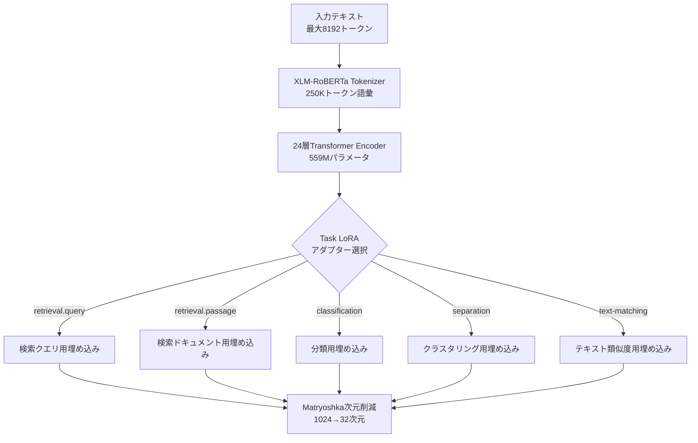

## 論文概要（Abstract）

本記事は [jina-embeddings-v3: Multilingual Embeddings With Task LoRA](https://arxiv.org/abs/2409.10173)（arXiv: 2409.10173、2024年9月公開）の解説記事です。

jina-embeddings-v3は559Mパラメータのベースモデルに5つのタスク別LoRAアダプター（ランク4）を組み合わせ、retrieval・classification・clustering・text-matchingに最適化された埋め込みを生成する多言語モデルである。Matryoshka Representation Learning（MRL）により1024次元の出力を32次元まで削減可能。89言語対応、8192トークンのコンテキスト長をサポートし、MTEB英語タスクでOpenAI text-embedding-3-large、多言語タスクでmultilingual-e5-large-instructを上回る性能が報告されている。

この記事は [Zenn記事: Instruction-Aware Embeddingの精度評価：タスク指示で変わる検索精度を定量検証する](https://zenn.dev/0h_n0/articles/9ca7ef23663c81) の深掘りです。

## 情報源

- **arXiv ID**: 2409.10173
- **URL**: [https://arxiv.org/abs/2409.10173](https://arxiv.org/abs/2409.10173)
- **著者**: Saba Sturua, Isabelle Mohr, Mohammad Kalim Akram, Michael Gunther, Bo Wang et al.
- **発表年**: 2024
- **分野**: cs.CL（計算言語学）, cs.AI（人工知能）, cs.IR（情報検索）

## 背景と動機（Background & Motivation）

テキスト埋め込みモデルは検索・分類・クラスタリング・意味類似度計算など多様なタスクに使用されるが、各タスクが求める埋め込み空間の性質は本質的に異なる。Zenn記事で検証されているInstruction-Aware Embeddingはタスク指示で品質を制御するが、単一モデルの重みで全タスクを最適化することには限界がある。

著者らは以下の問題を指摘している。(1) 単一埋め込み空間での全タスク最適化はタスク間トレードオフが発生する、(2) e5-mistral-7b-instruct（7.1B）はjina-v3（570M）に対しMTEB英語で約1%の改善にとどまりパラメータ効率が低い、(3) 英語中心モデルでは89言語の均質な品質確保が困難、(4) 出力次元固定ではストレージ・レイテンシ要件への柔軟な調整ができない。

## 主要な貢献（Key Contributions）

- **Task LoRA**: ランク4のLoRAを全24層に挿入し、5アダプターでベースモデルの3%未満の追加パラメータによるタスク特化を実現
- **MRL統合**: 64次元でも1024次元の約92%の検索性能を維持する柔軟な次元削減
- **3段階学習**: 89言語事前学習→10億超ペアでコントラスト微調整→タスク別LoRA学習
- **パラメータ効率**: 570Mで7Bクラスに匹敵し、MTEB英語で商用APIモデルを上回る

## 技術的詳細（Technical Details）

### ベースアーキテクチャ: Modified XLM-RoBERTa

jina-embeddings-v3のベースモデルは、XLM-RoBERTaを以下の3点で拡張したjina-XLM-RoBERTaである。



| 項目 | 仕様 | 項目 | 仕様 |
|---|---|---|---|
| **ベースモデル** | XLM-RoBERTa改変版 | **総パラメータ** | 572M（ベース559M+LoRA13M） |
| **層数** | 24 | **語彙** | 250Kトークン |
| **コンテキスト長** | 8,192トークン | **位置符号化** | RoPE |
| **アテンション** | FlashAttention 2 | **プーリング** | Mean pooling |
| **出力次元** | 1,024（32まで削減可） | **対応言語** | 89言語 |

主要な変更点は、(1) 絶対位置埋め込みをRoPE（Rotary Position Embeddings）に置換し8192トークンの長文処理を実現、(2) FlashAttention 2によるメモリ効率の高いアテンション計算、(3) 各トランスフォーマー層のMulti-Head Attention内にLoRA低ランク分解行列を挿入、の3点である。

### Task LoRAアダプター

著者らの中核的な技術革新は、タスクごとにLoRAアダプターを切り替えるアーキテクチャである。LoRA（Low-Rank Adaptation）は、事前学習済みの重み行列$\mathbf{W}_0 \in \mathbb{R}^{d \times k}$に対し、低ランクの分解行列を加算する手法である。

$$
\mathbf{h} = \mathbf{W}_0 \mathbf{x} + \Delta \mathbf{W} \mathbf{x} = \mathbf{W}_0 \mathbf{x} + \mathbf{B} \mathbf{A} \mathbf{x}
$$

ここで、
- $\mathbf{W}_0 \in \mathbb{R}^{d \times k}$: 事前学習済みの重み行列（凍結）
- $\mathbf{A} \in \mathbb{R}^{r \times k}$: LoRA低ランク行列（学習可能）
- $\mathbf{B} \in \mathbb{R}^{d \times r}$: LoRA低ランク行列（学習可能）
- $r$: LoRAランク（本論文では$r=4$）
- $\mathbf{x}$: 入力ベクトル

ランク$r=4$という極めて小さい値を採用しているため、各アダプターのパラメータ数はベースモデルの3%未満に抑えられている。5つのアダプター合計でも約13Mパラメータの追加にとどまる。

5つのアダプター（`retrieval.query`、`retrieval.passage`、`classification`、`separation`、`text-matching`）のうち、検索タスクではクエリとドキュメントで異なるアダプターを使用する非対称構造が特徴的である。

### コントラスト学習の損失関数

微調整段階では、双方向InfoNCE損失が使用されている。バッチ$B = \{(x_i, y_i)\}_{i=1}^{N}$に対して、

$$
\mathcal{L}_{\text{NCE}}(B) = -\sum_{i=1}^{N} \ln \frac{\exp(s(x_i, y_i) / \tau)}{\sum_{j=1}^{N} \exp(s(x_i, y_j) / \tau)}
$$

$$
\mathcal{L}_{\text{pairs}}(B) = \mathcal{L}_{\text{NCE}}(B) + \mathcal{L}_{\text{NCE}}(B^{\dagger})
$$

ここで$s(x, y)$はコサイン類似度、$\tau$は温度パラメータ（短文$\tau=0.05$、長文$\tau=0.02$）、$B^{\dagger}$はペア順序を入れ替えたバッチである。双方向性により両方向の類似度が最大化される。

### Matryoshka Representation Learning（MRL）

MRL（Kusupati et al., 2022）は、1024次元の出力ベクトルの先頭$d$次元を切り出した部分ベクトルでも意味情報が保存されるように学習する手法である。

$$
\mathcal{L}_{\text{MRL}} = \sum_{d \in \mathcal{D}} w_d \cdot \mathcal{L}_{\text{task}}(\mathbf{e}_{1:d})
$$

ここで$\mathcal{D} = \{32, 64, 128, 256, 512, 1024\}$は目標次元の集合、$\mathbf{e}_{1:d}$は埋め込みの先頭$d$次元、$w_d$は各次元の重みである。推論時にストレージ・レイテンシ要件に応じて出力次元を動的に選択できる。

### 3段階カリキュラム学習

著者らは以下の3段階で学習を行っている。

| Stage | 手法 | データ | 学習率 |
|---|---|---|---|
| **1. 事前学習** | MLM（89言語） | CulturaXコーパス（英語約20%） | $1 \times 10^{-4}$→$5 \times 10^{-5}$ |
| **2. ペア微調整** | 双方向InfoNCE（ベースモデル全体） | 10億超テキストペア（300+データセット） | $3 \times 10^{-5}$→$2 \times 10^{-5}$ |
| **3. LoRA学習** | タスク別LoRA（ベースモデル凍結） | タスク別専用データセット | $5 \times 10^{-4}$（Retrieval） |

Stage 1では512→8192トークンへ段階的にコンテキスト長を拡張。Stage 2の温度パラメータは短文$\tau=0.05$、長文$\tau=0.02$。Stage 3ではDeepSpeedとアクティベーションチェックポイントで効率的な分散学習を実現している。

## 実装のポイント（Implementation）

### sentence-transformersでの利用

jina-embeddings-v3はsentence-transformersライブラリから直接利用できる。`task`引数でアダプターを切り替え、`truncate_dim`でMRL次元を指定する。

```python
from sentence_transformers import SentenceTransformer

model = SentenceTransformer("jinaai/jina-embeddings-v3", trust_remote_code=True)

# 検索: クエリとドキュメントで異なるアダプターを使用
query_emb = model.encode(["機械学習の最新トレンド"],
                         task="retrieval.query", truncate_dim=256)
doc_emb = model.encode(["深層学習は画像認識で成果を上げている"],
                       task="retrieval.passage", truncate_dim=256)

# 分類・クラスタリング・類似度計算
cls_emb = model.encode(["このレストランは素晴らしい"], task="classification")
cluster_emb = model.encode(["テキストをグループ分けする"], task="separation")
sim_emb = model.encode(["意味的に類似したテキスト"], task="text-matching")
```

| ユースケース | 推奨アダプター | truncate_dim |
|---|---|---|
| RAG検索（クエリ/ドキュメント） | `retrieval.query` / `retrieval.passage` | 256-512 |
| 感情分析・トピック分類 | `classification` | 512-1024 |
| 文書クラスタリング | `separation` | 128-256 |
| 重複検出・類似文書検索 | `text-matching` | 256-512 |

**実装上の注意点**: (1) `trust_remote_code=True`はカスタムモデルコード使用のため必須、(2) 検索タスクではクエリとドキュメントで必ず異なるアダプターを使用（同一アダプターでは性能劣化）、(3) 32次元では検索性能が1024次元の約83%まで低下するため64次元以上を推奨、(4) 1回のencodeでは1つのアダプターのみ指定可能。

## Production Deployment Guide

jina-embeddings-v3は570Mパラメータと比較的軽量であり、GPU推論だけでなくCPU推論も実用的である。以下のコスト試算は2026年9月時点のAWS ap-northeast-1（東京リージョン）料金に基づく概算値である。実際のコストはトラフィックパターン、リージョン、バースト使用量により変動する。

### AWS実装パターン（コスト最適化重視）

| 構成 | トラフィック | アーキテクチャ | 月額概算 |
|---|---|---|---|
| **Small** | ~100 req/日 | SageMaker Serverless + S3 | $30-80 |
| **Medium** | ~1,000 req/日 | SageMaker Real-time (ml.g5.xlarge) | $400-900 |
| **Large** | 10,000+ req/日 | EKS + Karpenter + Spot GPU | $2,000-4,500 |

**Small構成**: SageMaker Serverless Inferenceで570Mモデルをオンデマンド起動。コールドスタート15-30秒だが低頻度なら許容範囲。月額内訳: SageMaker Serverless $20-60 + S3 $1 + CloudWatch $5。

**Medium構成**: SageMaker Real-time Endpoint (ml.g5.xlarge, A10G GPU)で常時起動。Auto Scaling (MinCapacity=1, MaxCapacity=3)。Reserved Instanceで最大40%削減可。

**Large構成**: EKS + Karpenter + Spot GPU (g5.xlarge)。Triton Inference Serverでバッチ処理最適化。ElastiCache (Redis)で埋め込みキャッシュ。Spot割引で最大70%削減。

**コスト削減テクニック**: Spot Instances（最大70%削減）、SageMaker Reserved（最大40%削減）、埋め込みキャッシュ（GPU使用量30-50%削減）、MRL次元削減（1024→256でベクトルDB格納コスト75%削減）、ONNX Runtime FP16量子化（スループット2倍）。

### Terraformインフラコード

**Small構成（SageMaker Serverless）** -- 主要リソースの抜粋:

```hcl
resource "aws_sagemaker_model" "jina_v3" {
  name               = "jina-embeddings-v3"
  execution_role_arn = aws_iam_role.sagemaker_execution.arn
  primary_container {
    image          = "763104351884.dkr.ecr.ap-northeast-1.amazonaws.com/huggingface-pytorch-inference:2.1-transformers4.36-gpu-py310-cu121-ubuntu22.04"
    model_data_url = "s3://${aws_s3_bucket.model_artifacts.id}/model.tar.gz"
    environment    = { HF_MODEL_ID = "jinaai/jina-embeddings-v3", HF_TASK = "feature-extraction" }
  }
}

resource "aws_sagemaker_endpoint_configuration" "serverless" {
  name = "jina-emb-v3-serverless"
  production_variants {
    variant_name = "AllTraffic"
    model_name   = aws_sagemaker_model.jina_v3.name
    serverless_config { memory_size_in_mb = 6144, max_concurrency = 5 }
  }
}

resource "aws_sagemaker_endpoint" "jina_v3" {
  name                 = "jina-emb-v3-endpoint"
  endpoint_config_name = aws_sagemaker_endpoint_configuration.serverless.name
}
```

**Large構成（EKS + Karpenter）** -- Spot GPU自動スケーリングの抜粋:

```hcl
module "eks" {
  source  = "terraform-aws-modules/eks/aws"
  version = "~> 20.24"
  cluster_name    = "jina-emb-v3-cluster"
  cluster_version = "1.31"
  cluster_endpoint_public_access = false  # プライベートアクセスのみ
}

resource "kubectl_manifest" "karpenter_nodepool" {
  yaml_body = yamlencode({
    apiVersion = "karpenter.sh/v1", kind = "NodePool"
    metadata = { name = "gpu-spot" }
    spec = {
      template = { spec = {
        requirements = [
          { key = "karpenter.sh/capacity-type", operator = "In", values = ["spot", "on-demand"] },
          { key = "node.kubernetes.io/instance-type", operator = "In", values = ["g5.xlarge", "g5.2xlarge"] },
        ]
      } }
      limits     = { cpu = "64", "nvidia.com/gpu" = "8" }
      disruption = { consolidationPolicy = "WhenEmptyOrUnderutilized", consolidateAfter = "60s" }
    }
  })
}
```

### 運用・監視設定

**CloudWatch Logs Insights: レイテンシ分析**:

```
fields @timestamp, @message
| filter @message like /ModelLatency/
| stats avg(ModelLatency)/1000 as avg_ms,
    percentile(ModelLatency, 95)/1000 as p95_ms,
    percentile(ModelLatency, 99)/1000 as p99_ms
  by bin(1h)
```

**X-Ray + Cost Explorer監視（Python）**:

```python
from aws_xray_sdk.core import xray_recorder, patch_all
import boto3, json
from datetime import datetime, timedelta

patch_all()  # boto3自動計装
xray_recorder.configure(service="jina-embedding-service")

def embed_with_tracing(texts: list[str], task: str = "retrieval.query") -> dict:
    """X-Rayトレーシング付き埋め込み生成"""
    segment = xray_recorder.begin_subsegment("embedding_inference")
    segment.put_annotation("task_adapter", task)
    segment.put_metadata("input_count", len(texts))
    try:
        return boto3.client("sagemaker-runtime").invoke_endpoint(
            EndpointName="jina-emb-v3-endpoint", ContentType="application/json",
            Body=json.dumps({"inputs": texts, "parameters": {"task": task}}),
        )
    finally:
        xray_recorder.end_subsegment()

def daily_cost_report() -> None:
    """日次コスト。$100/日超過でSNS通知"""
    end = datetime.utcnow().strftime("%Y-%m-%d")
    start = (datetime.utcnow() - timedelta(days=1)).strftime("%Y-%m-%d")
    resp = boto3.client("ce", region_name="us-east-1").get_cost_and_usage(
        TimePeriod={"Start": start, "End": end}, Granularity="DAILY",
        Metrics=["BlendedCost"],
        Filter={"Tags": {"Key": "Project", "Values": ["jina-emb-v3"]}},
        GroupBy=[{"Type": "DIMENSION", "Key": "SERVICE"}],
    )
    total = sum(float(g["Metrics"]["BlendedCost"]["Amount"])
                for r in resp["ResultsByTime"] for g in r["Groups"])
    if total > 100.0:
        boto3.client("sns", region_name="ap-northeast-1").publish(
            TopicArn="arn:aws:sns:ap-northeast-1:123456789012:cost-alerts",
            Subject=f"jina-emb-v3 Cost: ${total:.2f}", Message=f"$100超過: ${total:.2f}")
```

### コスト最適化チェックリスト

**アーキテクチャ選択**:
- [ ] トラフィック量に応じた構成選択（~100: Serverless、~1000: Real-time、10000+: EKS）
- [ ] MRL次元削減でベクトルDBサイズ最適化（1024→256で75%削減）
- [ ] 埋め込みキャッシュ（Redis/DynamoDB）で重複計算排除

**リソース最適化**:
- [ ] GPU Spot Instances優先（g5.xlarge Spot: 最大70%削減）
- [ ] SageMaker Reserved Instances: 1年コミットで最大40%削減
- [ ] Savings Plans: Compute Savings Plansで柔軟な割引適用
- [ ] SageMaker Serverless: メモリサイズ最適化（6144MB→4096MB検証）
- [ ] Karpenter: Spot中断時の自動フォールバックとconsolidation
- [ ] ONNX Runtime + FP16量子化: 推論スループット2倍

**モデル推論コスト削減**:
- [ ] バッチ推論: 複数テキストをまとめてエンコード（max_batch_size=64）
- [ ] MRL次元選択: ユースケース別に最小必要次元を特定（検索: 256、分類: 512）
- [ ] 埋め込みキャッシュヒット率: 目標80%以上を維持
- [ ] アダプター切り替え最小化: 同一タスクのテキストをバッチ化

**監視・アラート**:
- [ ] AWS Budgets: 月次予算アラート（80%/100%閾値）
- [ ] CloudWatch Alarm: P99レイテンシ、エラー率、スロットリング監視
- [ ] Cost Anomaly Detection: 機械学習ベースの異常コスト検知
- [ ] 日次コストレポート: Cost Explorer APIで自動取得・SNS通知
- [ ] X-Ray: エンドツーエンドレイテンシとボトルネック特定

**リソース管理**:
- [ ] 未使用SageMaker Endpoint: 開発・ステージング環境の定期棚卸し
- [ ] タグ戦略: Project/Environment/Ownerタグを全リソースに付与
- [ ] S3ライフサイクル: 古いモデルアーティファクトの自動削除（90日）
- [ ] 開発環境夜間停止: SageMaker Endpointの業務時間外自動停止
- [ ] CloudWatch Logs保持期間: 90日でexpire設定

## 実験結果（Results）

### MTEB英語ベンチマーク

著者らはMTEB（Massive Text Embedding Benchmark）で包括的な評価を実施している。以下に主要カテゴリの結果を示す（論文Table記載データに基づく）。

| タスクカテゴリ | jina-v3 | text-embedding-3-large | multilingual-e5-large-instruct |
|---|---|---|---|
| **英語平均** | **65.52** | 64.60 | 64.41 |
| **Classification** | **82.58** | 75.45 | 76.64 |
| **STS** | **85.80** | 81.68 | 83.42 |
| **Retrieval (nDCG@10)** | 53.87 | **55.44** | 52.30 |
| **Clustering** | 45.27 | **49.00** | 47.54 |

著者らの報告によると、jina-embeddings-v3は英語タスク平均でtext-embedding-3-largeを0.92ポイント上回っている。ClassificationとSTSで優位性を示す一方、RetrievalとClusteringではやや劣る。多言語MTEBでは平均64.44（multilingual-e5-large-instruct: 64.25）で全カテゴリで上回ると報告されている（Retrieval 57.98 vs 55.12、Classification 71.46 vs 69.83）。

### Matryoshka次元削減の影響

MRLによる次元削減が性能に与える影響は以下の通りである（論文のデータに基づく）。

| 出力次元 | Retrieval (nDCG@10) | STS (Spearman) | 1024次元比（Retrieval） |
|---|---|---|---|
| **1024**（デフォルト） | 63.35 | 77.58 | 100% |
| **512** | 63.16 | 77.59 | 99.7% |
| **256** | 61.85 | 77.42 | 97.6% |
| **64** | 58.54 | 77.03 | 92.4% |
| **32** | 52.54 | 76.35 | 82.9% |

512次元まで性能低下はほぼなく、64次元でも約92%の検索性能を維持する。STSでは32次元でも98%以上を保つ。著者らは7Bクラスのe5-mistral-7b-instructとの比較でパラメータ効率の高さを強調しており、12倍小さい570MでMTEB英語の差はわずか約1%である。

## 実運用への応用（Practical Applications）

jina-embeddings-v3の570Mパラメータという軽量さは、RAGシステムの埋め込み生成コストを大幅に削減する。Zenn記事で検証されているInstruction-Aware Embeddingの知見と組み合わせた実用パターンとして、(1) `retrieval.query`/`retrieval.passage`アダプターの使い分けによる非対称検索の高精度化、(2) MRLで1024→256次元に削減しベクトルDB利用料を75%削減（検索性能97.6%維持）、(3) 570Mの軽量さを活かしたCPU推論でのバッチ埋め込み生成、(4) 89言語対応による多言語RAGの統一ベクトル化、が挙げられる。

スケーリング面では、ステートレスな埋め込みモデルはSageMaker Auto ScalingやKarpenterによる水平スケーリングが容易であり、Redis/DynamoDBによるキャッシュ戦略で再計算を回避できる。

## 関連研究（Related Work）

- **E5 (Wang et al., 2022)**: 大規模コントラスト学習によるembeddingsの先駆。jina-v3はこれを多言語・マルチタスクに拡張
- **MRL (Kusupati et al., 2022)**: 任意次元での埋め込み切り出しを可能にする学習手法。jina-v3ではTask LoRAと統合
- **LoRA (Hu et al., 2021)**: 低ランク分解による効率的ファインチューニング。jina-v3ではタスク別アダプターとして推論時切り替えに応用
- **BGE-M3 (Chen et al., 2024)**: Dense/Sparse統合の多言語検索モデル。多言語ベンチマークでjina-v3と競合

## まとめと今後の展望

jina-embeddings-v3は、タスク別LoRA（ランク4、ベースの3%未満）とMRLの統合により、570Mパラメータで商用APIモデルに匹敵する性能を実現した。MRLによる次元削減はベクトルDB運用コスト削減に直結し、タスク別アダプターは専用モデルの個別管理を不要にする。Jina AIは後継のjina-embeddings-v4（2025年）でマルチモーダル対応を実現しており、Task LoRAとMRLの組み合わせはタスク適応型埋め込みの設計パターンとして定着しつつある。

## 参考文献

- **arXiv**: [https://arxiv.org/abs/2409.10173](https://arxiv.org/abs/2409.10173)
- **Jina AI公式ブログ**: [https://jina.ai/news/jina-embeddings-v3-a-frontier-multilingual-embedding-model/](https://jina.ai/news/jina-embeddings-v3-a-frontier-multilingual-embedding-model/)
- **Hugging Face**: [https://huggingface.co/jinaai/jina-embeddings-v3](https://huggingface.co/jinaai/jina-embeddings-v3)
- **SageMaker連携**: [https://jina.ai/news/next-level-cloud-ai-jina-embeddings-and-rerankers-on-amazon-sagemaker/](https://jina.ai/news/next-level-cloud-ai-jina-embeddings-and-rerankers-on-amazon-sagemaker/)
- **Related Zenn article**: [https://zenn.dev/0h_n0/articles/9ca7ef23663c81](https://zenn.dev/0h_n0/articles/9ca7ef23663c81)
