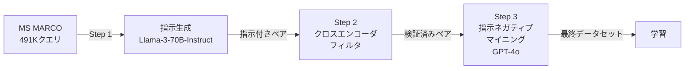

## 論文概要（Abstract）

本記事は [Promptriever: Instruction-Trained Retrievers Can Be Prompted Like Language Models](https://arxiv.org/abs/2409.11136)（arXiv: 2409.11136、2024年9月公開）の解説記事です。

著者らは、自然言語の指示（instruction）に応答可能な初のbi-encoder検索モデル「Promptriever」を提案している。MS MARCOから約49.1万クエリに対する指示付きデータセットを合成し、指示に違反するパッセージを意図的に生成する「指示ネガティブマイニング」を導入した。FollowIRベンチマークでp-MRR +14.3、InstructIRでRobustness@10を63.1に向上させ、BEIRではプロンプトによる性能チューニングが可能であることを示したと報告されている。

この記事は [Zenn記事: Instruction-Aware Embeddingの精度評価：タスク指示で変わる検索精度を定量検証する](https://zenn.dev/0h_n0/articles/9ca7ef23663c81) の深掘りです。

## 情報源

- **arXiv ID**: 2409.11136
- **URL**: [https://arxiv.org/abs/2409.11136](https://arxiv.org/abs/2409.11136)
- **著者**: Orion Weller, Benjamin Van Durme, Dawn Lawrie et al.
- **発表年**: 2024
- **分野**: cs.IR（情報検索）, cs.CL（計算言語学）, cs.LG（機械学習）
- **コード**: [https://github.com/orionw/promptriever](https://github.com/orionw/promptriever)

## 背景と動機（Background & Motivation）

既存のdense retrieverは、クエリとパッセージの意味的類似度に基づいて検索を行うが、ユーザーの検索意図を細かく指示する手段を持たない。例えば「AIの安全性」に関するクエリで「規制政策の観点から」「技術的対策の観点から」といった指示を与えても、既存モデルは同じ検索結果を返す。

指示追従型のLLM（instruction-tuned LM）がユーザーの意図を柔軟に汲み取れるのに対し、検索モデルはこの能力を欠いている。RepLLaMAのようなLLMベースのbi-encoderでも、FollowIRベンチマークにおけるp-MRR（指示に従って関連度順位が変化したかを測る指標）は-8.9と、指示を与えると性能が悪化する。この問題の根本原因は、学習データに指示付きの検索ペアが存在しないことにある。

著者らは、LLMの指示追従能力を検索タスクに転用するため、MS MARCOから大規模な指示付きデータセットを合成し、「指示に従わないパッセージ」を明示的に負例として学習させるアプローチを提案している。

## 主要な貢献（Key Contributions）

- **貢献1**: MS MARCOの約49.1万クエリに対して、Llama-3-70B-Instructを用いた多様な指示文の合成パイプラインを構築。短文1行から2段落まで、ペルソナ・否定・背景情報等のスタイルバリエーションを含む
- **貢献2**: GPT-4oによる指示ネガティブマイニングとFollowIR-7Bによるフィルタリング（人間との一致率84%）で、指示に違反するハードネガティブを体系的に生成
- **貢献3**: FollowIRでp-MRR +14.3（SoTA）、InstructIRでRobustness@10を63.1に向上させ、BEIRではプロンプトによる性能チューニング（+1.4 nDCG@10）が可能であることを実証

## 技術的詳細（Technical Details）

### データ生成パイプライン

Promptrieverの学習データ生成は3段階で構成される。



**Step 1: 指示生成**

Llama-3-70B-Instructを用いて、各クエリに対して多様な指示文を生成する。指示は以下の4カテゴリとの掛け合わせで約49.1万インスタンスを構築している。

- **否定（Negation）**: 特定の種類のパッセージを明示的に除外する指示（例: 「法律関連の文書は除外」）
- **ペルソナ（Persona）**: 特定の立場・役割を指定（例: 「医療従事者の視点で」）
- **背景情報（Background）**: ドメイン固有の文脈を付加（例: 「半導体製造における〜」）
- **汎用（Generic）**: 標準的なタスク記述

長さについては短文1行から2段落までのバリエーションがあり、各サブセットが約12.2万インスタンスで構成される。

**Step 2: クロスエンコーダフィルタ**

元の正例パッセージが新しい指示の下でも関連性を保つかを検証する。指示を付加したことで正例パッセージが不適切になるケースがあり、約15%のペアでは代替パッセージに置換されている。

**Step 3: 指示ネガティブマイニング**

GPT-4o（gpt-4o-2024-05-13）を用いて、クエリには合致するが指示の要件に違反するパッセージを生成する。各（クエリ, 指示）ペアに対して、1件の指示適合パッセージと3件の指示違反パッセージを生成し、FollowIR-7Bで品質をフィルタリングする。

FollowIR-7Bによるフィルタリングでは、生成された指示ネガティブが実際に指示に違反しているか、指示ポジティブが実際に関連しているかを検証する。著者らは、人間同士の一致率75%に対してFollowIR-7Bと人間の一致率が84%であったと報告している（N=64）。

### モデルアーキテクチャ

Promptrieverは、RepLLaMA（LLaMA-2 7B）をベースとしたbi-encoderモデルである。LoRA（Low-Rank Adaptation）によるパラメータ効率的なファインチューニングを採用している。

**LoRA設定**:
- ランク: 32
- 対象モジュール: `q_proj`, `k_proj`, `v_proj`, `o_proj`, `down_proj`, `up_proj`, `gate_proj`
- 学習率: $1 \times 10^{-4}$
- バッチサイズ: 8（デバイスあたり）
- エポック数: 1（ウォームアップ100ステップ）
- 温度: $\tau = 0.01$

クエリの最大トークン長は304（RepLLaMAの32から拡張）、パッセージは196トークンに設定されている。この拡張は指示文をクエリに付加するために必要である。

### 損失関数

著者らはRepLLaMAと同じ学習設定を踏襲しており、標準的な対比学習（contrastive learning）の損失関数を使用している。温度スケール付きのInfoNCE損失として以下のように定式化できる。

$$
\mathcal{L} = -\log \frac{\exp(\text{sim}(\mathbf{q}, \mathbf{p}^+) / \tau)}{\exp(\text{sim}(\mathbf{q}, \mathbf{p}^+) / \tau) + \sum_{j=1}^{K} \exp(\text{sim}(\mathbf{q}, \mathbf{p}^-_j) / \tau)}
$$

ここで、
- $\mathbf{q}$: クエリ（指示文を付加したもの）のエンベディング
- $\mathbf{p}^+$: 正例パッセージのエンベディング
- $\mathbf{p}^-_j$: 負例パッセージ（インバッチネガティブ＋指示ネガティブ）のエンベディング
- $\tau$: 温度パラメータ（0.01）
- $\text{sim}(\cdot, \cdot)$: コサイン類似度
- $K$: 負例の総数

Promptrieverの特徴は、負例$\mathbf{p}^-_j$に従来のインバッチネガティブに加えて指示ネガティブ（クエリには関連するが指示に違反するパッセージ）を含めている点である。これにより、モデルはクエリとパッセージの意味的類似度だけでなく、指示との整合性も考慮して検索を行うよう学習される。

### クエリフォーマット

指示はクエリの末尾に付加される。エンコード時のフォーマットは以下のとおりである。

```
query:  <クエリテキスト> <指示テキスト>
passage:  <パッセージテキスト>
```

プレフィックスの後にダブルスペースが必要であり、パディングトークンにはEOSトークンを使用する。エンベディングはパディング直前の最終トークンから抽出される。

## 実装のポイント（Implementation）

### Promptrieverの使用方法

HuggingFaceで公開されている4種類のモデルを利用できる。

| モデル | ベースモデル | HuggingFace ID |
|--------|-------------|----------------|
| Promptriever-LLaMA2 | LLaMA-2 7B | `samaya-ai/promptriever-llama2-7b-v1` |
| Promptriever-Mistral | Mistral v0.1 7B | `samaya-ai/promptriever-mistral-v0.1-7b-v1` |
| Promptriever-LLaMA3.1 | LLaMA 3.1 8B | `samaya-ai/promptriever-llama3.1-8b-v1` |
| Promptriever-LLaMA3.1-Inst | LLaMA 3.1 8B Instruct | `samaya-ai/promptriever-llama3.1-8b-instruct-v1` |

推論コードの例を以下に示す。

```python
from peft import PeftModel, PeftConfig
from transformers import AutoModel, AutoTokenizer
import torch

def load_promptriever(model_name: str = "samaya-ai/promptriever-llama2-7b-v1") -> tuple:
    """Promptrieverモデルをロードし、LoRAアダプタをマージする

    Args:
        model_name: HuggingFace上のモデルID

    Returns:
        (model, tokenizer) のタプル
    """
    config = PeftConfig.from_pretrained(model_name)
    base_model = AutoModel.from_pretrained(
        config.base_model_name_or_path,
        torch_dtype=torch.float16,
        device_map="auto",
    )
    model = PeftModel.from_pretrained(base_model, model_name)
    model = model.merge_and_unload()
    tokenizer = AutoTokenizer.from_pretrained(config.base_model_name_or_path)
    tokenizer.pad_token = tokenizer.eos_token
    tokenizer.padding_side = "right"
    return model, tokenizer


def encode_queries(
    model: AutoModel,
    tokenizer: AutoTokenizer,
    queries: list[str],
    instructions: list[str] | None = None,
    max_length: int = 304,
) -> torch.Tensor:
    """クエリをエンコードする。指示文がある場合はクエリに付加する

    Args:
        model: Promptrieverモデル
        tokenizer: トークナイザー
        queries: クエリテキストのリスト
        instructions: 指示テキストのリスト（Noneの場合は指示なし）
        max_length: 最大トークン長

    Returns:
        エンベディングテンソル (batch_size, hidden_dim)
    """
    if instructions is not None:
        texts = [f"query:  {q} {inst}" for q, inst in zip(queries, instructions)]
    else:
        texts = [f"query:  {q}" for q in queries]

    inputs = tokenizer(
        texts,
        padding=True,
        truncation=True,
        max_length=max_length,
        return_tensors="pt",
    ).to(model.device)

    with torch.no_grad():
        outputs = model(**inputs)

    # パディング直前の最終トークンからエンベディングを抽出
    attention_mask = inputs["attention_mask"]
    last_token_indices = attention_mask.sum(dim=1) - 1
    embeddings = outputs.last_hidden_state[
        torch.arange(len(queries)), last_token_indices
    ]
    return embeddings
```

### 指示文の設計パターン

著者らの実験から、効果的な指示文の設計には以下のパターンが有効である。

1. **否定による絞り込み**: 「技術的な解説記事を探しているが、入門レベルの内容は除外してほしい」
2. **ペルソナの指定**: 「データサイエンティストの視点で、統計的手法に焦点を当てた文書を検索」
3. **背景情報の付加**: 「医療画像分野におけるTransformerの応用に関する文献を探している」
4. **具体的な条件指定**: 「2023年以降に発表された、コード付きの実装論文に限定」

論文Table 4より、BEIRの7データセット中6つで、少数の開発セットから選択した指示がデータセット全体の最適な指示と一致しており、指示設計のチューニングが実用的に機能することが示されている。

## Production Deployment Guide

RAGシステムにおいて指示追従型の検索モデルをデプロイするケースを想定する。Promptrieverは7Bパラメータのモデルであるため、GPUインスタンスが必要となる。

> 本セクションのコスト試算は2026年9月時点のAWS ap-northeast-1（東京リージョン）の概算値であり、実際のコストはトラフィックパターン、リージョン、バースト使用量により変動する。最新料金は[AWS料金計算ツール](https://calculator.aws/)で確認を推奨する。

### AWS実装パターン（コスト最適化重視）

| 構成 | トラフィック | 主要サービス | 月額概算 |
|------|------------|-------------|---------|
| Small | ~100 req/日 | SageMaker Serverless + S3 + DynamoDB | $80-200 |
| Medium | ~1,000 req/日 | SageMaker Real-time (ml.g5.xlarge) + ElastiCache | $900-1,500 |
| Large | 10,000+ req/日 | EKS + Karpenter + Spot (g5.xlarge) + OpenSearch | $2,500-5,000 |

**Small構成（~100 req/日）**:
- SageMaker Serverless Inference: コールドスタートは30-60秒だが、低頻度なら許容可能。モデルはS3にFP16で保存（約14GB）
- DynamoDB On-Demand: エンベディングキャッシュ用。同一クエリ+指示の再計算を回避
- 月額内訳: SageMaker推論 $50-120、S3 $5、DynamoDB $10-30、CloudWatch $10-20

**Medium構成（~1,000 req/日）**:
- SageMaker Real-time Endpoint（ml.g5.xlarge）: 常時起動。A10G GPU搭載でFP16推論に対応
- ElastiCache（Redis）: 高頻度クエリのエンベディングキャッシュ
- 月額内訳: SageMaker $750-900（ml.g5.xlarge on-demand）、ElastiCache $80-150、S3 $5、CloudWatch $15-30

**Large構成（10,000+ req/日）**:
- EKS + Karpenter: Spot Instance（g5.xlarge）優先でGPUノードを自動スケーリング
- OpenSearch Serverless: エンベディングのベクトルインデックスを管理
- 月額内訳: EKS Control Plane $75、Spot GPU $800-2,000（利用率依存）、OpenSearch $500-1,200、ALB $30-50、CloudWatch $30-60

**コスト削減テクニック**:
- Spot Instances活用: g5.xlargeのSpot価格はOn-Demandの60-70%引き
- SageMaker Savings Plans: 1年コミットで最大64%削減
- エンベディングキャッシュ: 同一（クエリ, 指示）ペアの再計算回避で推論コスト30-50%削減
- FP16/INT8量子化: モデルサイズとGPUメモリ使用量を半減

### Terraformインフラコード

**Small構成（SageMaker Serverless）**:

```hcl
# --- Small構成: SageMaker Serverless + DynamoDB ---

terraform {
  required_version = ">= 1.9"
  required_providers {
    aws = {
      source  = "hashicorp/aws"
      version = "~> 5.60"
    }
  }
}

provider "aws" {
  region = "ap-northeast-1"
}

# IAMロール（最小権限）
resource "aws_iam_role" "sagemaker_execution" {
  name = "promptriever-sagemaker-role"
  assume_role_policy = jsonencode({
    Version = "2012-10-17"
    Statement = [{
      Action = "sts:AssumeRole"
      Effect = "Allow"
      Principal = { Service = "sagemaker.amazonaws.com" }
    }]
  })
}

resource "aws_iam_role_policy" "sagemaker_s3_access" {
  name = "s3-model-access"
  role = aws_iam_role.sagemaker_execution.id
  policy = jsonencode({
    Version = "2012-10-17"
    Statement = [{
      Effect   = "Allow"
      Action   = ["s3:GetObject", "s3:ListBucket"]
      Resource = [
        aws_s3_bucket.model_artifacts.arn,
        "${aws_s3_bucket.model_artifacts.arn}/*"
      ]
    }]
  })
}

# S3: モデルアーティファクト保存（KMS暗号化）
resource "aws_s3_bucket" "model_artifacts" {
  bucket = "promptriever-model-artifacts-${data.aws_caller_identity.current.account_id}"
}

resource "aws_s3_bucket_server_side_encryption_configuration" "model_enc" {
  bucket = aws_s3_bucket.model_artifacts.id
  rule {
    apply_server_side_encryption_by_default {
      sse_algorithm = "aws:kms"
    }
  }
}

# DynamoDB: エンベディングキャッシュ（On-Demand、KMS暗号化）
resource "aws_dynamodb_table" "embedding_cache" {
  name         = "promptriever-embedding-cache"
  billing_mode = "PAY_PER_REQUEST"
  hash_key     = "query_hash"

  attribute {
    name = "query_hash"
    type = "S"
  }

  ttl {
    attribute_name = "expires_at"
    enabled        = true
  }

  server_side_encryption {
    enabled = true
  }
}

# SageMaker Serverless Endpoint
resource "aws_sagemaker_model" "promptriever" {
  name               = "promptriever-llama2-7b"
  execution_role_arn = aws_iam_role.sagemaker_execution.arn

  primary_container {
    image          = "763104351884.dkr.ecr.ap-northeast-1.amazonaws.com/huggingface-pytorch-inference:2.3.0-transformers4.44.0-gpu-py311-cu121-ubuntu22.04"
    model_data_url = "s3://${aws_s3_bucket.model_artifacts.id}/promptriever/model.tar.gz"
    environment = {
      HF_MODEL_ID       = "samaya-ai/promptriever-llama2-7b-v1"
      SM_NUM_GPUS        = "1"
      MAX_INPUT_LENGTH   = "512"
      DTYPE              = "float16"
    }
  }
}

resource "aws_sagemaker_endpoint_configuration" "serverless" {
  name = "promptriever-serverless-config"

  production_variants {
    variant_name           = "primary"
    model_name             = aws_sagemaker_model.promptriever.name
    serverless_config {
      max_concurrency      = 2
      memory_size_in_mb    = 6144  # 7Bモデル: FP16で約14GB、6GBメモリ+GPU
    }
  }
}

# CloudWatch: コストアラーム
resource "aws_cloudwatch_metric_alarm" "sagemaker_invocations" {
  alarm_name          = "promptriever-high-invocations"
  comparison_operator = "GreaterThanThreshold"
  evaluation_periods  = 1
  metric_name         = "Invocations"
  namespace           = "AWS/SageMaker"
  period              = 3600
  statistic           = "Sum"
  threshold           = 500  # 1時間あたり500呼び出しで警告
  alarm_actions       = [aws_sns_topic.alerts.arn]

  dimensions = {
    EndpointName = "promptriever-serverless"
  }
}

resource "aws_sns_topic" "alerts" {
  name = "promptriever-alerts"
}

data "aws_caller_identity" "current" {}
```

**Large構成（EKS + Karpenter + Spot）**:

```hcl
# --- Large構成: EKS + Karpenter + Spot Instances ---

module "eks" {
  source  = "terraform-aws-modules/eks/aws"
  version = "~> 20.24"

  cluster_name    = "promptriever-cluster"
  cluster_version = "1.31"

  vpc_id     = module.vpc.vpc_id
  subnet_ids = module.vpc.private_subnets

  # コスト最適化: パブリックアクセス制限
  cluster_endpoint_public_access = true
  cluster_endpoint_public_access_cidrs = ["<your-cidr>/32"]

  eks_managed_node_groups = {
    system = {
      instance_types = ["m6i.large"]
      min_size       = 1
      max_size       = 2
      desired_size   = 1
    }
  }
}

# Karpenter: Spot Instance優先でGPUノードを自動スケーリング
resource "kubectl_manifest" "karpenter_nodepool" {
  yaml_body = <<-YAML
    apiVersion: karpenter.sh/v1
    kind: NodePool
    metadata:
      name: gpu-spot
    spec:
      template:
        spec:
          requirements:
            - key: "node.kubernetes.io/instance-type"
              operator: In
              values: ["g5.xlarge", "g5.2xlarge"]
            - key: "karpenter.sh/capacity-type"
              operator: In
              values: ["spot", "on-demand"]  # Spot優先
          nodeClassRef:
            group: karpenter.k8s.aws
            kind: EC2NodeClass
            name: gpu
      limits:
        gpu: "8"  # 最大GPUノード数
      disruption:
        consolidationPolicy: WhenEmptyOrUnderutilized
        consolidateAfter: 60s
  YAML
}

# Secrets Manager: モデル設定
resource "aws_secretsmanager_secret" "model_config" {
  name = "promptriever/model-config"
}

resource "aws_secretsmanager_secret_version" "model_config" {
  secret_id = aws_secretsmanager_secret.model_config.id
  secret_string = jsonencode({
    model_id   = "samaya-ai/promptriever-llama2-7b-v1"
    max_length = 512
    dtype      = "float16"
  })
}

# AWS Budgets: 予算アラート
resource "aws_budgets_budget" "monthly" {
  name         = "promptriever-monthly-budget"
  budget_type  = "COST"
  limit_amount = "5000"
  limit_unit   = "USD"
  time_unit    = "MONTHLY"

  notification {
    comparison_operator       = "GREATER_THAN"
    threshold                 = 80
    threshold_type            = "PERCENTAGE"
    notification_type         = "ACTUAL"
    subscriber_email_addresses = ["ops-team@example.com"]
  }

  notification {
    comparison_operator       = "GREATER_THAN"
    threshold                 = 100
    threshold_type            = "PERCENTAGE"
    notification_type         = "FORECASTED"
    subscriber_email_addresses = ["ops-team@example.com"]
  }
}
```

### 運用・監視設定

**CloudWatch Logs Insights クエリ**:

```
# コスト異常検知: 1時間あたりの推論リクエスト数とレイテンシ
fields @timestamp, @message
| filter @message like /InvokeEndpoint/
| stats count() as request_count,
        avg(duration_ms) as avg_latency,
        pct(duration_ms, 95) as p95_latency,
        pct(duration_ms, 99) as p99_latency
  by bin(1h) as hour
| sort hour desc
```

**CloudWatch アラーム設定（Python）**:

```python
import boto3

cloudwatch = boto3.client("cloudwatch", region_name="ap-northeast-1")

def create_latency_alarm(endpoint_name: str, threshold_ms: float = 5000) -> None:
    """SageMakerエンドポイントのレイテンシ異常を検知するアラームを作成

    Args:
        endpoint_name: SageMakerエンドポイント名
        threshold_ms: アラーム閾値（ミリ秒）
    """
    cloudwatch.put_metric_alarm(
        AlarmName=f"{endpoint_name}-high-latency",
        ComparisonOperator="GreaterThanThreshold",
        EvaluationPeriods=3,
        MetricName="ModelLatency",
        Namespace="AWS/SageMaker",
        Period=300,
        Statistic="p95",
        Threshold=threshold_ms,
        ActionsEnabled=True,
        AlarmActions=["arn:aws:sns:ap-northeast-1:ACCOUNT_ID:promptriever-alerts"],
        Dimensions=[{"Name": "EndpointName", "Value": endpoint_name}],
    )
```

**X-Ray トレーシング設定（Python）**:

```python
from aws_xray_sdk.core import xray_recorder, patch_all
import boto3

# boto3の自動計装
patch_all()
xray_recorder.configure(service="promptriever-retrieval")

def trace_retrieval(query: str, instruction: str | None = None) -> dict:
    """検索リクエストをX-Rayでトレースする

    Args:
        query: 検索クエリ
        instruction: 指示文（オプション）

    Returns:
        検索結果
    """
    with xray_recorder.in_subsegment("encode_query") as subsegment:
        subsegment.put_annotation("has_instruction", instruction is not None)
        subsegment.put_metadata("query_length", len(query))
        # エンコード処理
        embedding = encode_query(query, instruction)

    with xray_recorder.in_subsegment("vector_search") as subsegment:
        subsegment.put_annotation("top_k", 10)
        results = search_index(embedding, top_k=10)

    return results
```

**Cost Explorer自動レポート（Python）**:

```python
import boto3
from datetime import datetime, timedelta

ce = boto3.client("ce", region_name="ap-northeast-1")
sns = boto3.client("sns", region_name="ap-northeast-1")

def daily_cost_report(topic_arn: str, threshold_usd: float = 100.0) -> None:
    """日次コストレポートを取得し、閾値超過時にSNS通知する

    Args:
        topic_arn: SNSトピックARN
        threshold_usd: 通知閾値（USD/日）
    """
    today = datetime.utcnow().date()
    yesterday = today - timedelta(days=1)

    response = ce.get_cost_and_usage(
        TimePeriod={"Start": str(yesterday), "End": str(today)},
        Granularity="DAILY",
        Metrics=["UnblendedCost"],
        Filter={
            "Tags": {
                "Key": "Project",
                "Values": ["promptriever"],
            }
        },
        GroupBy=[{"Type": "DIMENSION", "Key": "SERVICE"}],
    )

    total_cost = sum(
        float(g["Metrics"]["UnblendedCost"]["Amount"])
        for result in response["ResultsByTime"]
        for g in result["Groups"]
    )

    if total_cost > threshold_usd:
        sns.publish(
            TopicArn=topic_arn,
            Subject=f"Promptriever cost alert: ${total_cost:.2f}/day",
            Message=f"Daily cost exceeded ${threshold_usd}: ${total_cost:.2f}",
        )
```

### コスト最適化チェックリスト

**アーキテクチャ選択**:
- [ ] トラフィック量に応じた構成を選択（~100 req/日: Serverless、~1000: Real-time、10000+: EKS）
- [ ] コールドスタート許容度を確認（Serverless: 30-60秒、Real-time: 即時）
- [ ] マルチモデル構成の検討（複数ドメインで異なる指示テンプレートを使用する場合）

**リソース最適化**:
- [ ] EC2/GPU: Spot Instances優先（g5.xlargeで最大60-70%削減）
- [ ] SageMaker Savings Plans: 1年コミットで最大64%削減
- [ ] Reserved Instances: 常時稼働のシステムノードに適用
- [ ] Lambda/SageMaker: メモリサイズ最適化（Power Tuningで検証）
- [ ] EKS: Karpenterによるアイドル時自動スケールダウン（consolidateAfter: 60s）
- [ ] モデル量子化: FP16必須、INT8/GPTQ検討（精度との要トレードオフ検証）

**推論コスト削減**:
- [ ] エンベディングキャッシュ: DynamoDB/Redis で同一（クエリ, 指示）ペアの再計算回避
- [ ] バッチ推論: リアルタイム性が不要な場合はSageMaker Batch Transform
- [ ] モデル選択ロジック: 指示なしクエリは軽量モデル（E5等）にルーティング
- [ ] トークン数制限: 指示文の長さ上限を設定（304トークン以内）
- [ ] 段階的検索: まず軽量モデルでtop-100を取得し、Promptrieverでリランキング

**監視・アラート**:
- [ ] AWS Budgets: 月額予算設定（80%/100%でアラート）
- [ ] CloudWatch アラーム: レイテンシP95、推論リクエスト数スパイク
- [ ] Cost Anomaly Detection: 自動異常検知有効化
- [ ] 日次コストレポート: サービス別コスト内訳のSNS通知
- [ ] GPU使用率モニタリング: 低使用率時のダウンスケール判断材料

**リソース管理**:
- [ ] 未使用エンドポイント削除: 開発・テスト用エンドポイントの自動停止スケジュール
- [ ] タグ戦略: `Project:promptriever`, `Environment:prod/dev` 必須
- [ ] S3ライフサイクルポリシー: 古いモデルアーティファクトの自動アーカイブ（90日→Glacier）
- [ ] 開発環境夜間停止: 非営業時間のGPUインスタンス自動停止
- [ ] エンベディングキャッシュTTL: DynamoDBのTTLで古いキャッシュを自動削除

## 実験結果（Results）

### FollowIR

FollowIRはクエリに対する詳細な関連度指示への追従能力を評価するベンチマークである。著者らが報告した結果（論文Table 1相当）を以下に示す。

| モデル | MAP | p-MRR |
|--------|-----|-------|
| RepLLaMA | 24.0 | -8.9 |
| Promptriever | 28.3 | +11.7 |
| 差分 | +4.3 | **+20.6** |

p-MRRは指示を追加した際に関連度の順位が正しく変化したかを測定する指標である。RepLLaMAのp-MRR -8.9は、指示を追加すると性能が悪化することを示している。対してPromptrieverのp-MRR +11.7は、指示を与えることでより適切な検索結果を返せることを意味する。

### InstructIR

InstructIRはクエリのフレーズ変化に対する頑健性を評価する。

| モデル | p-MRR | Robustness@10 |
|--------|-------|---------------|
| RepLLaMA | -1.8 | 50.2 |
| Promptriever | +6.4 | 63.1 |

Robustness@10は、異なるフレーズのクエリに対して検索結果の上位10件がどれだけ安定しているかを測定する。Promptrieverは分散を44%低減したと著者らは報告している。

### BEIR（ドメイン外汎化）

BEIRは13の異なるドメインのデータセットで構成されるゼロショット評価ベンチマークである。論文Table 4より、主要データセットの結果を以下に示す。

| データセット | Promptriever (指示なし) | Promptriever (最適指示) |
|-------------|----------------------|----------------------|
| DBPedia | - | 45.2 |
| FEVER | - | 82.8 |
| FiQA | - | 46.6 |
| HotpotQA | - | 69.5 |
| NFCorpus | - | 36.9 |
| Quora | - | 88.0 |
| SciFact | - | 76.3 |
| **平均** | **55.0** | **56.4** |

指示なしでRepLLaMA（54.9）と同等の性能を維持しつつ、最適な指示を与えることで平均+1.4 nDCG@10の改善が得られている。7データセット中6つで、開発セットから選択した指示が全体の最適指示と一致した。

### MS MARCO

論文の報告によると、インドメインのMS MARCOでもRepLLaMAと同等の性能を維持している。

| メトリクス | Promptriever | RepLLaMA |
|-----------|-------------|----------|
| DL19 nDCG@10 | 73.2 | 同等 |
| DL20 nDCG@10 | 72.3 | 同等 |
| Dev MRR@10 | 42.0 | 同等 |

### Ablation Study

論文Table 6より、各学習コンポーネントの寄与を以下に示す。

| 構成 | FollowIR MAP | FollowIR p-MRR | InstructIR p-MRR |
|------|-------------|---------------|-----------------|
| RepLLaMA（ベースライン） | 24.0 | -8.9 | -1.8 |
| + 繰り返しクエリ | 24.6 | -9.1 | -2.6 |
| + 汎用指示 | 25.5 | -7.2 | -1.7 |
| + 指示ペア学習 | 26.9 | +3.8 | +5.3 |
| + 指示ネガティブ | 29.0 | +9.7 | +5.2 |
| Promptriever（Joint学習） | 28.3 | +11.7 | +6.4 |

単にクエリを長くする（繰り返しクエリ）だけでは効果がなく、指示ペア学習でp-MRRが-8.9から+3.8に大きく改善している。さらに指示ネガティブの追加でp-MRR +9.7、Joint学習（指示ありデータと指示なしデータの同時学習）で+11.7に到達している。

### 汎化性（論文Table 7）

Promptrieverの学習手法は異なるベースモデルでも一貫した改善を示す。

| ベースモデル | BEIR nDCG | BEIR w/Prompt | FollowIR p-MRR | Robust@10 |
|-------------|-----------|---------------|----------------|-----------|
| LLaMA-2 7B | 55.0 | 56.4 | +11.7 (+26.1) | 63.1 |
| Mistral v0.1 7B | 54.4 | 55.7 | +9.8 (+25.7) | 58.8 |
| LLaMA 3.1 8B | 55.1 | 56.5 | +11.8 (+25.0) | 41.6 |
| LLaMA 3.1 8B Instruct | 55.5 | 57.2 | +11.0 (+26.0) | 57.8 |

p-MRRの改善幅は+9.8から+11.8の範囲であり、ベースモデルの種類に依存しない汎化性がある。ベースモデルがInstruct版かどうかは検索性能への影響が小さいことも注目に値する。

## 実運用への応用（Practical Applications）

### RAGシステムでの指示付き検索

Promptrieverの最も直接的な応用はRAGパイプラインにおける検索精度の向上である。従来のRAGではクエリをそのままエンベディングモデルに入力するが、Promptrieverを用いることでユーザーの検索意図を指示として付加できる。

**具体的なユースケース**:

1. **カスタマーサポートRAG**: 「返品ポリシーに関する質問」というクエリに対して、「B2B顧客向けの規約に限定」「2024年以降に改定された内容のみ」といった指示でコンテキストを絞り込む
2. **法律文書検索**: 「契約解除の条件」に対して「判例ではなく条文を優先」「特定の管轄区域に限定」等の指示を動的に付加
3. **技術文書検索**: 同一のエラーメッセージに対して「Python環境」「Java環境」といった指示でプラットフォーム別の回答を取得

### スケーリング戦略

7Bパラメータモデルのため、大規模検索ではオフラインでコーパスをエンコードしておき、クエリのみリアルタイムでエンコードする二段階方式が現実的である。パッセージ側のエンベディングは指示に依存しないため、事前計算が可能である。クエリ側のみ指示を含むため、レイテンシはクエリエンコードの時間（1クエリあたり50-100ms程度、GPU依存）に支配される。

ただし、著者らも言及しているように、7Bモデルの推論コストは従来の軽量エンベディングモデル（E5やBGE、数百Mパラメータ）と比較して大幅に高い。実運用では、まず軽量モデルで候補を絞り込み、Promptrieverでリランキングする段階的検索が推奨される。

## 関連研究（Related Work）

- **RepLLaMA**: LLaMA-2をbi-encoderとしてファインチューニングした検索モデル。Promptrieverのベースラインであり、指示追従能力を持たない
- **FollowIR**: Weller et al. (2024) が提案した指示追従検索のベンチマーク。TREC 2024のデータを活用し、パッセージの関連度が指示によって変化するかを評価する
- **InstructIR**: Oh et al. (2024) が提案したクエリのフレーズ変化に対する頑健性ベンチマーク。同一の検索意図を異なるフレーズで表現した際の検索結果の安定性を評価する
- **TART**: Asai et al. (2022) が提案したタスク指示付き検索モデル。データセットレベルの指示を使用するのに対し、Promptrieverはインスタンスレベルの指示に対応している点が異なる

## まとめと今後の展望

Promptrieverは、LLMの指示追従能力を検索モデルに転用するアプローチにより、自然言語の指示で検索結果を制御可能にした初のbi-encoderモデルである。約49.1万件の指示付きデータセットの合成と指示ネガティブマイニングにより、FollowIRでSoTA、BEIRでプロンプトによる性能チューニングを実現した。

実務上の示唆として、RAGシステムにおいてユーザーの検索意図をより細かく反映させるための基盤技術となりうる。ただし、7Bモデルの推論コストは軽量モデルと比較して高く、段階的検索やキャッシュ戦略との組み合わせが実運用には不可欠である。

今後の研究方向として、著者らはより小型のモデルへの適用、多言語対応、さらにはリランキングとの統合を挙げている。

## 参考文献

- **arXiv**: [https://arxiv.org/abs/2409.11136](https://arxiv.org/abs/2409.11136)
- **Code**: [https://github.com/orionw/promptriever](https://github.com/orionw/promptriever)
- **Models**: [https://huggingface.co/samaya-ai/promptriever-llama2-7b-v1](https://huggingface.co/samaya-ai/promptriever-llama2-7b-v1)
- **Training Data**: [https://huggingface.co/datasets/samaya-ai/msmarco-w-instructions](https://huggingface.co/datasets/samaya-ai/msmarco-w-instructions)
- **Related Zenn article**: [https://zenn.dev/0h_n0/articles/9ca7ef23663c81](https://zenn.dev/0h_n0/articles/9ca7ef23663c81)
