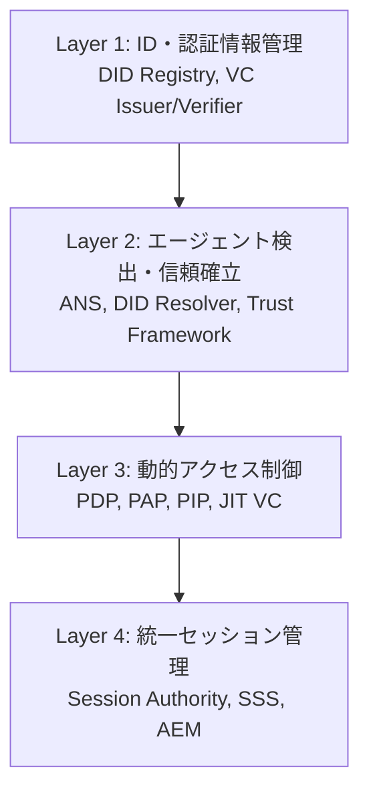

## 論文概要（Abstract）

本記事は [A Novel Zero-Trust Identity Framework for Agentic AI: Decentralized Authentication and Fine-Grained Access Control](https://arxiv.org/abs/2505.19301)（arXiv: 2505.19301、2025年5月公開）の解説記事です。

本論文は、従来のIAMプロトコル（OAuth 2.0、OIDC、SAML）がマルチエージェントシステムに対して根本的に不適切である問題を指摘し、Decentralized Identifiers（DID）とVerifiable Credentials（VC）に基づく4層ゼロトラストアーキテクチャを提案している。Agent Naming Service（ANS）による能力認識型のエージェント検出、Just-In-Time（JIT）認証情報発行、統一グローバルセッション管理による即時失効が主要な技術的貢献として報告されている。

この記事は [Zenn記事: Bedrock AgentCore Runtime×Gatewayで顧客サポートエージェントを構築しツール認証を設計する](https://zenn.dev/0h_n0/articles/391fc1f0476f7a) の深掘りです。

## 情報源

- **arXiv ID**: 2505.19301
- **URL**: [https://arxiv.org/abs/2505.19301](https://arxiv.org/abs/2505.19301)
- **著者**: Ken Huang, Vineeth Sai Narajala, John Yeoh, Jason Ross, Ramesh Raskar, Youssef Harkati, Jerry Huang, Idan Habler, Chris Hughes
- **発表年**: 2025
- **分野**: cs.CR（暗号とセキュリティ）, cs.AI, cs.MA（マルチエージェントシステム）

## 背景と動機（Background & Motivation）

AIエージェントが外部ツールやAPIを呼び出す際、認証・認可の仕組みが不可欠である。Zenn記事で解説されているAgentCore Gatewayの3層認証（JWT → Cedar Policy → OAuth 3LO）は、AWS固有の実装としてこの課題に対応している。しかし、著者らは既存のIAMプロトコルがエージェントシステムに対して以下の根本的な限界を持つと指摘している。

1. **単一エンティティ前提**: OAuth/OIDCは1セッション=1プリンシパルを前提としており、エージェントが別のエージェントに権限を委譲するチェーン構造を扱えない
2. **粗粒度のスコープ**: `read_all`のようなスコープでは、エージェントのツール呼び出しに必要なきめ細かい制御（「このテーブルのこの列のみ読み取り可」）が実現できない
3. **コンテキスト非対応**: 静的なロールベースアクセス制御（RBAC）は、エージェントの動的な行動パターン（リスクスコアの変動、異常行動の検出）を考慮できない
4. **失効の非協調性**: トークン失効がサービスごとに独立しており、1つのエージェントが侵害された場合に関連する全セッションを即座に無効化できない

## 主要な貢献（Key Contributions）

- **貢献1**: DID/VCに基づくリッチなAgent IDの提案。暗号的に検証可能なエージェント身元証明とモデルハッシュ（SHA-3）による完全性検証を統合
- **貢献2**: Agent Naming Service（ANS）による能力認識型エージェント検出。DNSの名前解決にVCベースの能力証明を統合し、検出と認可を一体化
- **貢献3**: 統一グローバルセッション管理（Session Authority + Session State Synchronizer）による、プロトコル横断的な即時失効メカニズム
- **貢献4**: Zero-Knowledge Proofs（ZKP）による、プライバシー保護型のポリシー準拠証明

## 技術的詳細（Technical Details）

### 4層ゼロトラストアーキテクチャ

著者らが提案するフレームワークは4つの層で構成されている。



| 層 | コンポーネント | 責務 |
|---|---|---|
| **Layer 1** | DID Registry, VC Issuer, Agent Wallet | エージェントの身元証明と暗号鍵管理 |
| **Layer 2** | ANS, DID Resolver, Trust Framework | 能力証明付きエージェント検出 |
| **Layer 3** | PDP, PAP, PIP | 属性ベースのきめ細かいアクセス制御 |
| **Layer 4** | Session Authority (SA), Session State Synchronizer (SSS) | プロトコル横断的セッション管理と即時失効 |

### Agent IDの構造

著者らが提案するリッチなAgent IDは、以下のコンポーネントで構成される。

| コンポーネント | 用途 | 例 |
|---|---|---|
| DID + 暗号鍵ペア | 検証可能な身元証明 | `did:web:agentcore:support-agent-001` |
| Creator/Owner メタデータ | 責任追跡 | 作成者のDID、組織情報 |
| モデルハッシュ（SHA-3） | ソフトウェア完全性検証 | エージェントコードのハッシュ値 |
| scopeOfBehavior | 行動境界の定義 | 「チケット管理と顧客データ参照のみ」 |
| Toolset仕様 | 許可リソースアクセスリスト | 使用許可ツールのDIDリスト |
| ライフサイクル状態 | 現在の運用状態 | active / suspended / revoked |

Zenn記事のAgentCore Gatewayでは、JWTクレーム（username、department等）がエージェントのコンテキストとして機能しているが、本論文のAgent IDはそれをより構造化・暗号化した形で提供している。

### Agent Naming Service（ANS）

ANSは従来のDNSを拡張し、エージェントの能力証明を名前解決に統合するサービスである。命名規則は以下の形式をとる。

```
protocol://AgentFunction.CapabilityDomain.Provider.Version[.extension]
```

DNSとの決定的な違いは、ANSの名前解決がエンドポイントだけでなく「暗号的に署名された能力証明（VC）」も返す点である。これにより、エージェント検出の段階で「このエージェントは本当にその能力を持つか」を検証できる。

### 動的アクセス制御（ABAC）

Layer 3のアクセス制御は、属性ベースアクセス制御（ABAC）をエージェント向けに拡張したものである。Policy Decision Point（PDP）は以下の4つのコンテキストを入力として認可判定を行う。

$$
\text{Decision} = \text{PDP}(\text{Agent}_{\text{ctx}}, \text{Resource}_{\text{attr}}, \text{Action}, \text{Context}_{\text{env}})
$$

ここで、
- $\text{Agent}_{\text{ctx}}$: 解決済みDID Document、提示されたVC、宣言済みToolset
- $\text{Resource}_{\text{attr}}$: リソースの機密レベル、スキーマ分類
- $\text{Action}$: 粒度の細かい操作（例: `QUERY_TABLE` vs 汎用的な `READ`）
- $\text{Context}_{\text{env}}$: リクエスト時刻、ネットワークセグメント、協調コンテキスト

論文では、ポリシーの記述にRego（OPA）形式が用いられている例が示されている。Zenn記事のCedarポリシーと比較すると、Cedarが宣言的で形式検証可能な言語であるのに対し、Regoはチューリング完全でより柔軟な記述が可能だが、形式検証が困難という差異がある。

### Just-In-Time（JIT）認証情報

一時的なエージェントに対して、時間制限付きのVCを発行するJITメカニズムが提案されている。JIT VCには以下の情報が含まれる。

- 使用許可ツールのDIDリスト
- 許可アクションセット（例: `executeTransform`のみ）
- データハンドル参照（入出力のBlob URI）
- 有効期間（著者らは15-30分を推奨）

Zenn記事のOAuth 3LOフローでは、`force_authentication=False`でトークンキャッシュを活用する設計が紹介されているが、JIT VCはより短い有効期間で認証情報の露出リスクを低減するアプローチである。

### 統一グローバルセッション管理

Layer 4は本論文の最も独創的な技術的貢献である。3つのコンポーネントで構成される。

1. **Session Authority（SA）**: 論理的に集中化されたセッションライフサイクル管理コンポーネント
2. **Session State Synchronizer（SSS）**: 高可用性分散台帳。アクティブセッションのコンテキストと能力マッピングをリアルタイムに保持
3. **Adapter Enforcement Middleware（AEM）**: プロトコル固有のプラグイン。MCP、A2A、gRPC等のプロトコルに対応し、リクエストをインターセプトしてSAの決定をローカルに適用

著者らは「グローバルログアウト」シナリオを例示している。Agent Alphaが侵害された場合、SAがSSSのステータスを`terminated`に更新し、関連するすべてのAEM（MCP、A2A等）に通知することで、プロトコルを横断した即時セッション無効化が実現される。

## アルゴリズム

### MCP Tool呼び出し時の認証フロー

```python
def mcp_tool_invocation(agent_did: str, tool_did: str, action: str) -> dict:
    """MCP Tool呼び出し時のZero-Trust認証フロー（論文の記述に基づく擬似コード）"""
    # Step 1: DID解決とVC検証
    did_doc = did_resolver.resolve(agent_did)
    vcs = agent_wallet.present_credentials(required_types=["CapabilityVC"])

    # Step 2: JIT VC発行（一時エージェントの場合）
    if agent_did.startswith("did:ephemeral:"):
        jit_vc = vc_issuer.issue(
            subject=agent_did,
            tools=[tool_did],
            actions=[action],
            validity_minutes=15,
        )
        vcs.append(jit_vc)

    # Step 3: PDP評価（ABAC）
    decision = pdp.evaluate(
        agent_ctx={"did": did_doc, "vcs": vcs, "toolset": did_doc.toolset},
        resource_attr={"tool_did": tool_did, "sensitivity": "high"},
        action=action,
        env_ctx={"timestamp": now(), "network": request.source_ip},
    )

    if decision != "ALLOW":
        raise AuthorizationError(f"Denied: {decision.reason}")

    # Step 4: セッション記録（SSS更新）
    session_authority.record_access(agent_did, tool_did, action)

    return execute_tool(tool_did, action)
```

## 実験結果（Results）

著者らは本論文で定量的なベンチマーク実験は実施していない（フレームワーク提案論文のため）。ただし、Table 1において既存プロトコル（OAuth 2.0、OIDC、SAML）との比較分析を提供しており、以下の差異を報告している。

| 評価軸 | OAuth/OIDC/SAML | 提案フレームワーク |
|---|---|---|
| 権限粒度 | 粗い（`read_all`等） | 属性ベース、タスク固有 |
| エンティティ | 単一プリンシパル/セッション | 委譲チェーン付きマルチエージェント |
| コンテキスト認識 | 静的RBAC | リアルタイム行動監視・リスクスコアリング |
| 失効協調 | サービスごとに独立 | Session Authorityによる統一失効 |
| クロスドメイン信頼 | 階層型（user→IdP→SP） | P2P DID相互認証 |

## 実運用への応用（Practical Applications）

### Zenn記事のアーキテクチャとの対応

本論文のフレームワークとZenn記事のAgentCore認証アーキテクチャは、以下のように対応する。

| 論文の概念 | AgentCore対応 | 差異 |
|---|---|---|
| DID/VC | JWT（Cognito） | AgentCoreはJWTベース、論文はDIDベース |
| ANS | Gateway Target Discovery | AgentCoreはGateway内蔵の検出機能 |
| PDP (ABAC) | Cedar Policy | AgentCoreはCedar、論文はRego |
| JIT VC | OAuth Refresh Token | AgentCoreはOAuthキャッシュで類似機能 |
| Session Authority | Runtime Session管理 | AgentCoreはmicroVM単位のセッション管理 |

AgentCoreのアーキテクチャは、本論文の提案と思想を共有しつつ、AWS固有のサービス（Cognito、Cedar、IAM）で実装している。本論文はより汎用的な標準アーキテクチャを提案しており、マルチクラウドやハイブリッド環境での適用を想定している。

### 制約と課題

- **DID基盤の未成熟**: W3C DID仕様は標準化されているが、大規模なプロダクション環境での実装実績は限定的
- **パフォーマンスオーバーヘッド**: DID解決、VC検証、ZKP生成は暗号演算を伴うため、低レイテンシが要求されるリアルタイムエージェントにはオーバーヘッドとなる可能性がある
- **実装の複雑性**: 4層アーキテクチャの完全な実装は、既存のIAMインフラからの大規模な移行を必要とする

## 関連研究（Related Work）

- **Progent** (Shi et al., 2025, arXiv: 2504.11703): SMTソルバーを用いたエージェント権限の動的制御。著者ら提案のABAC型PDP評価と補完的な関係にある
- **Cedar** (Cutler et al., 2024, arXiv: 2403.04651): 形式検証可能な認可言語。論文のPDPレイヤーのポリシー言語としてCedarの適用が考えられる
- **ETDI** (2025): MCPにおけるOAuth強化ツール定義とポリシーベースアクセス制御。著者らのMCP統合層（AEM）と関連

## まとめと今後の展望

本論文は、既存のIAMプロトコルがマルチエージェントシステムに根本的に不適切であることを示し、DID/VCに基づく4層ゼロトラストアーキテクチャを提案している。特にAgent Naming Serviceによる能力認識型検出と、Session Authorityによるプロトコル横断的即時失効は、エージェントセキュリティの新しい設計パラダイムを提示するものとして注目される。AgentCoreのようなクラウドネイティブ実装との統合や、DID基盤のパフォーマンス検証が今後の研究課題として挙げられる。

## 参考文献

- **arXiv**: [https://arxiv.org/abs/2505.19301](https://arxiv.org/abs/2505.19301)
- **Progent**: [https://arxiv.org/abs/2504.11703](https://arxiv.org/abs/2504.11703)
- **Cedar**: [https://arxiv.org/abs/2403.04651](https://arxiv.org/abs/2403.04651)
- **Related Zenn article**: [https://zenn.dev/0h_n0/articles/391fc1f0476f7a](https://zenn.dev/0h_n0/articles/391fc1f0476f7a)
