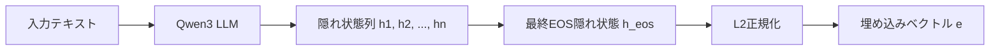
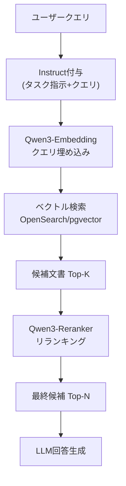

## 論文概要（Abstract）

本記事は [arXiv:2506.05176 "Qwen3 Embedding: Advancing Text Embedding and Reranking Through Foundation Models"](https://arxiv.org/abs/2506.05176) の解説記事です。

Qwen3 Embeddingは、Qwen3基盤モデルをバックボーンとし、テキスト埋め込みとリランキングの両タスクを統合的に扱うモデルシリーズである。著者らは、弱教師あり事前学習、教師あり微調整、SLERP（球面線形補間）によるモデルマージの3段階学習パイプラインを提案している。0.6B / 4B / 8Bの3サイズで展開され、8Bモデルは2025年6月時点でMTEB Multilingual リーダーボードにおいて70.58を達成し1位を獲得したと報告されている。Apache 2.0ライセンスで公開されており、100以上の言語とプログラミング言語をサポートする。

この記事は [Zenn記事: Instruction-Aware Embeddingの精度評価：タスク指示で変わる検索精度を定量検証する](https://zenn.dev/0h_n0/articles/9ca7ef23663c81) の深掘りです。

## 情報源

- **arXiv ID**: 2506.05176
- **URL**: [arXiv:2506.05176](https://arxiv.org/abs/2506.05176)
- **著者**: Yanzhao Zhang, Mingxin Li, Dingkun Long et al.（Alibaba Group）
- **発表年**: 2025年6月
- **分野**: cs.CL（Computation and Language）, cs.IR（Information Retrieval）

## 背景と動機（Background & Motivation）

テキスト埋め込みモデルは、検索拡張生成（RAG）、セマンティック検索、クラスタリングなど多くのNLPタスクの基盤となる技術である。従来のGTE-Qwenシリーズをはじめとする埋め込みモデルには、以下の課題が存在していた。

第一に、多言語対応の不十分さである。英語中心のベンチマークでは高性能を示すモデルでも、多言語・クロスリンガル検索では精度が大幅に低下する傾向があった。第二に、タスク汎化性の限界である。検索に特化したモデルは分類やクラスタリングで性能が落ち、その逆も同様であった。第三に、学習データの質と量のトレードオフである。大規模な弱教師データで事前学習すると汎化性は向上するが、特定タスクの精度が不足し、少量の高品質データのみでは汎化性を欠く。

著者らは、Qwen3 LLM自体をデータ合成エンジンとして活用し、多タスク・多言語の学習データを大規模に生成するアプローチでこれらの課題に取り組んでいる。

## 主要な貢献（Key Contributions）

- **3段階学習パイプラインの確立**: 弱教師あり事前学習（約1.5億ペア）、教師あり微調整（約1900万ペア）、SLERPモデルマージの統合的学習手法
- **基盤モデルの二重活用**: Qwen3 LLMをバックボーンとしてだけでなく、学習データの合成エンジンとしても利用する設計
- **スケーラブルなモデルファミリー**: 0.6B / 4B / 8Bの3サイズ展開により、エッジデバイスからサーバーまで幅広いデプロイシナリオに対応
- **埋め込みとリランキングの統合**: 同一アーキテクチャ基盤で双方のタスクをサポートし、パイプライン構築を簡素化
- **MTEB Multilingual 1位**: 8Bモデルが2025年6月時点で多言語ベンチマーク1位を達成（論文Table 2より）

## 技術的詳細（Technical Details）

### アーキテクチャ

Qwen3 Embeddingは、Qwen3 LLMのデコーダアーキテクチャをそのまま活用する。従来のBERT系モデルが`[CLS]`トークンの隠れ状態を埋め込みとして使用するのに対し、本モデルはオートリグレッシブモデルの特性を活かし、最終`[EOS]`トークンの隠れ状態を埋め込みベクトルとして抽出する（last token pooling）。因果的注意マスクにより、`[EOS]`トークンには系列全体の情報が集約されるためである。



各モデルサイズの仕様は以下の通りである（論文Table 1より）。

| モデル | パラメータ数 | レイヤー数 | 埋め込み次元 | コンテキスト長 | MRLサポート |
|--------|-------------|-----------|-------------|--------------|------------|
| Qwen3-Embedding-0.6B | 596M | 28 | 1024 | 32K | 32-1024 |
| Qwen3-Embedding-4B | 4.0B | 36 | 2560 | 32K | 32-2560 |
| Qwen3-Embedding-8B | 8.0B | 36 | 4096 | 32K | 32-4096 |

### Matryoshka Representation Learning（MRL）

MRLは、埋め込みベクトルの先頭次元にもっとも重要な意味情報を集中させる学習手法である。学習時に複数の次元数（例: 512, 1024, 2048）で同時に損失関数を計算することで、ベクトルを任意の短い次元に切り詰めても一定の品質を維持できる。これにより、ストレージ容量とのトレードオフを柔軟に調整できる。

### Instruction-Aware埋め込み

本モデルはInstruction-Aware方式を採用しており、クエリ側にタスク指示を付加することで、同一モデルで検索・分類・クラスタリングなど異なるタスクに対応する。フォーマットは非対称構造をとる。

**クエリ側**:

```
Instruct: {タスクの説明}
Query: {クエリテキスト}
```

**ドキュメント側**: 指示なし（テキストをそのまま入力）

著者らは、タスク指示の付加により検索精度が1-5%向上すると報告している。英語以外のコーパスに対しても、指示文は英語で記述することが推奨されている。

### 3段階学習パイプライン

#### Stage 1: 弱教師あり事前学習

Qwen3-32Bを用いて約1.5億ペアの多タスク弱教師データを合成する。著者らは「マルチタスク適応型プロンプトシステム」を開発し、以下のタスクカテゴリを動的に生成する。

- **検索（Retrieval）**: クエリ-ドキュメントペア
- **対訳マイニング（Bitext Mining）**: 多言語翻訳ペア
- **分類（Classification）**: テキスト-ラベルペア
- **意味類似度（STS）**: 類似度スコア付きペア

この段階で使用する損失関数は改良版InfoNCE損失である。

$$
\mathcal{L}_{\text{embedding}} = -\frac{1}{N} \sum_{i=1}^{N} \log \frac{\exp(s(q_i, d_i^{+}) / \tau)}{Z_i}
$$

ここで、
- $q_i$: $i$番目のクエリの埋め込み
- $d_i^{+}$: $q_i$に対応する正例ドキュメントの埋め込み
- $s(\cdot, \cdot)$: コサイン類似度
- $\tau$: 温度パラメータ
- $Z_i$: 正規化項

正規化項$Z_i$は、(1) 正例ペア、(2) $K$個のハードネガティブ、(3) バッチ内の他のクエリ、(4) バッチ内の他のドキュメント（正例・負例）から構成される。さらに、偽陰性（false negative）を軽減するため、類似度が正例ペアのスコアに0.1を加えた値を超える場合にマスクする仕組み（マスク係数$m_{ij}$）が導入されている。

#### Stage 2: 教師あり微調整

以下の高品質データを用いた微調整を行う。

- **ラベル付きデータ**: MS MARCO、Natural Questions（NQ）、HotpotQA等から約700万ペア
- **高品質合成データ**: Qwen3-32Bで生成し、コサイン類似度0.7以上でフィルタリングした約1200万ペア

合計約1900万ペアによる教師あり学習で、タスク固有の精度を向上させる。

#### Stage 3: SLERPモデルマージ

教師あり微調整中に保存した複数のチェックポイントを、SLERP（Spherical Linear Interpolation: 球面線形補間）で統合する。SLERPは、パラメータ空間の超球面上の測地線に沿って補間する手法であり、以下の特性を持つ。

$$
\text{SLERP}(\theta_1, \theta_2; t) = \frac{\sin((1-t)\Omega)}{\sin(\Omega)} \theta_1 + \frac{\sin(t\Omega)}{\sin(\Omega)} \theta_2
$$

ここで、
- $\theta_1, \theta_2$: 2つのチェックポイントのパラメータベクトル
- $t \in [0, 1]$: 補間係数
- $\Omega$: $\theta_1$と$\theta_2$のなす角（$\cos\Omega = \frac{\theta_1 \cdot \theta_2}{\|\theta_1\| \|\theta_2\|}$）

単純なパラメータ平均（線形補間）が埋め込み空間の等方性（isotropy）を歪める可能性があるのに対し、SLERPは角度関係を保存しながら補間するため、類似度ベースの検索において重要な性質を維持できる。著者らは、この手法により汎化性が大幅に向上したと報告している。

### リランカーの学習

リランカー（Qwen3-Reranker）はクロスエンコーダ構造を採用し、クエリとドキュメントを連結して入力する。関連度スコアは、LLMのチャットテンプレートを用いた二値分類として定式化される。

$$
\text{score}(q, d) = \frac{\exp(P(\text{yes} \mid I, q, d))}{\exp(P(\text{yes} \mid I, q, d)) + \exp(P(\text{no} \mid I, q, d))}
$$

ここで、
- $P(\text{yes} \mid I, q, d)$: 指示$I$、クエリ$q$、ドキュメント$d$が与えられたとき「yes」トークンが生成される対数確率
- $P(\text{no} \mid I, q, d)$: 同様に「no」トークンの対数確率

リランカーの損失関数はSFT損失（教師あり微調整損失）である。

$$
\mathcal{L}_{\text{reranking}} = -\log p(l \mid P(q, d))
$$

ここで、$l$は関連ドキュメントに対しては「yes」、非関連に対しては「no」のラベルである。

## 実装のポイント（Implementation）

### 埋め込み生成の実装例

```python
import torch
import torch.nn.functional as F
from transformers import AutoTokenizer, AutoModel


def last_token_pool(
    last_hidden_states: torch.Tensor,
    attention_mask: torch.Tensor,
) -> torch.Tensor:
    """最終トークンの隠れ状態を抽出する

    Args:
        last_hidden_states: モデルの最終層出力 (batch, seq_len, hidden)
        attention_mask: アテンションマスク (batch, seq_len)

    Returns:
        最終トークンの隠れ状態 (batch, hidden)
    """
    left_padding = attention_mask[:, -1].sum() == attention_mask.shape[0]
    if left_padding:
        return last_hidden_states[:, -1]
    sequence_lengths = attention_mask.sum(dim=1) - 1
    batch_size = last_hidden_states.shape[0]
    return last_hidden_states[
        torch.arange(batch_size, device=last_hidden_states.device),
        sequence_lengths,
    ]


def encode_with_instruction(
    model: AutoModel,
    tokenizer: AutoTokenizer,
    texts: list[str],
    instruction: str | None = None,
    max_length: int = 8192,
) -> torch.Tensor:
    """Instruction-Aware方式で埋め込みを生成する

    Args:
        model: Qwen3-Embedding モデル
        tokenizer: 対応するトークナイザ
        texts: 入力テキストのリスト
        instruction: タスク指示（クエリ側のみ指定）
        max_length: 最大トークン長

    Returns:
        L2正規化済み埋め込みベクトル (batch, hidden)
    """
    if instruction:
        texts = [f"Instruct: {instruction}\nQuery: {t}" for t in texts]

    batch_dict = tokenizer(
        texts,
        max_length=max_length,
        padding=True,
        truncation=True,
        return_tensors="pt",
    ).to(model.device)

    with torch.no_grad():
        outputs = model(**batch_dict)

    embeddings = last_token_pool(
        outputs.last_hidden_state, batch_dict["attention_mask"]
    )
    return F.normalize(embeddings, p=2, dim=1)
```

### 利用時の注意点

- **依存ライブラリ**: `transformers>=4.51.0`、推奨で`flash-attn>=2.0`
- **左パディング対応**: last token poolingはパディング方向に依存するため、バッチ推論時にはパディング方向の確認が必要
- **MRL次元の選択**: ストレージ制約に応じて出力次元を調整可能だが、次元削減による品質低下は自身のデータで検証すべきである
- **指示文の言語**: 多言語コーパスに対しても、指示文は英語で記述することが推奨されている
- **vLLM対応**: `vllm>=0.8.5`でバッチ推論が可能（`task="embed"`を指定）

```python
# vLLMでのバッチ推論例
from vllm import LLM

model = LLM(
    model="Qwen/Qwen3-Embedding-0.6B",
    task="embed",
    dtype="float16",
)
outputs = model.embed(texts)
```

## Production Deployment Guide

本セクションでは、Qwen3 Embeddingをプロダクション環境にデプロイするためのAWS構成パターンを解説する。

> **注記**: 以下のコスト試算は2026年9月時点のAWS ap-northeast-1（東京）リージョンの概算値です。実際のコストはトラフィックパターン、リージョン、バースト使用量により変動します。最新料金は [AWS料金計算ツール](https://calculator.aws/) で確認してください。

### AWS実装パターン（コスト最適化重視）

#### Small構成（~100 req/日）: Serverless

| サービス | 用途 | 月額概算 |
|----------|------|---------|
| Lambda (ARM64) | 推論エンドポイント | $5-15 |
| S3 | モデルアーティファクト保存 | $3-5 |
| DynamoDB (On-Demand) | 埋め込みキャッシュ | $5-10 |
| API Gateway | REST API | $3-5 |
| CloudWatch | ログ・監視 | $5-10 |
| **合計** | | **$21-45** |

0.6Bモデルを量子化（INT8）してLambda上で動作させる構成。コールドスタート対策としてProvisioned Concurrencyを1に設定（+$15-20/月）することも検討する。リクエスト頻度が低いため、モデルをS3に保存しLambda起動時にロードする。

#### Medium構成（~1,000 req/日）: ECS Fargate

| サービス | 用途 | 月額概算 |
|----------|------|---------|
| ECS Fargate (2vCPU, 8GB) | 推論コンテナ | $150-250 |
| ElastiCache (Redis) | 埋め込みキャッシュ | $50-80 |
| ALB | ロードバランサー | $25-30 |
| ECR | コンテナイメージ | $5-10 |
| CloudWatch | ログ・監視 | $10-20 |
| **合計** | | **$240-390** |

4Bモデルをvllmコンテナで稼働させる構成。Fargate Spotを活用すれば最大70%のコスト削減が可能（中断耐性が必要）。Redisキャッシュにより同一クエリの再計算を回避する。

#### Large構成（10,000+ req/日）: EKS + GPU

| サービス | 用途 | 月額概算 |
|----------|------|---------|
| EKS (コントロールプレーン) | クラスタ管理 | $73 |
| GPU Nodes (g5.xlarge Spot) | 推論ワーカー | $400-800 |
| OpenSearch Serverless | ベクトルストア | $300-500 |
| Karpenter | オートスケーリング | $0（OSS） |
| CloudWatch + X-Ray | 監視・トレーシング | $30-50 |
| **合計** | | **$803-1,423** |

8Bモデルをフルサイズでデプロイし、vLLMによるバッチ推論を活用する。Karpenterでg5.xlarge Spotインスタンスを自動スケーリングし、最大90%のコスト削減を実現する。ピーク時にはオンデマンドへのフォールバックを設定する。

### Terraformインフラコード

#### Small構成（Serverless）

```hcl
# Qwen3 Embedding - Small構成 (Lambda + S3 + DynamoDB)
# コスト最適化: Serverless構成で月額$21-45

terraform {
  required_version = ">= 1.9.0"
  required_providers {
    aws = {
      source  = "hashicorp/aws"
      version = "~> 5.70"
    }
  }
}

provider "aws" {
  region = "ap-northeast-1"
}

# IAMロール（最小権限原則）
resource "aws_iam_role" "lambda_embedding" {
  name = "qwen3-embedding-lambda-role"
  assume_role_policy = jsonencode({
    Version = "2012-10-17"
    Statement = [{
      Action = "sts:AssumeRole"
      Effect = "Allow"
      Principal = { Service = "lambda.amazonaws.com" }
    }]
  })
}

resource "aws_iam_role_policy" "lambda_embedding" {
  name = "qwen3-embedding-lambda-policy"
  role = aws_iam_role.lambda_embedding.id
  policy = jsonencode({
    Version = "2012-10-17"
    Statement = [
      {
        Effect   = "Allow"
        Action   = ["s3:GetObject"]
        Resource = "${aws_s3_bucket.model.arn}/*"
      },
      {
        Effect = "Allow"
        Action = [
          "dynamodb:GetItem",
          "dynamodb:PutItem",
          "dynamodb:Query"
        ]
        Resource = aws_dynamodb_table.cache.arn
      },
      {
        Effect = "Allow"
        Action = [
          "logs:CreateLogGroup",
          "logs:CreateLogStream",
          "logs:PutLogEvents"
        ]
        Resource = "arn:aws:logs:*:*:*"
      }
    ]
  })
}

# S3バケット（モデルアーティファクト保存・KMS暗号化）
resource "aws_s3_bucket" "model" {
  bucket = "qwen3-embedding-model-artifacts"
}

resource "aws_s3_bucket_server_side_encryption_configuration" "model" {
  bucket = aws_s3_bucket.model.id
  rule {
    apply_server_side_encryption_by_default {
      sse_algorithm = "aws:kms"
    }
  }
}

resource "aws_s3_bucket_public_access_block" "model" {
  bucket                  = aws_s3_bucket.model.id
  block_public_acls       = true
  block_public_policy     = true
  ignore_public_acls      = true
  restrict_public_buckets = true
}

# DynamoDB（埋め込みキャッシュ・On-Demandでコスト最適化）
resource "aws_dynamodb_table" "cache" {
  name         = "qwen3-embedding-cache"
  billing_mode = "PAY_PER_REQUEST"
  hash_key     = "text_hash"

  attribute {
    name = "text_hash"
    type = "S"
  }

  ttl {
    attribute_name = "expires_at"
    enabled        = true
  }

  server_side_encryption {
    enabled = true
  }
}

# Lambda関数
resource "aws_lambda_function" "embedding" {
  function_name = "qwen3-embedding-inference"
  role          = aws_iam_role.lambda_embedding.arn
  package_type  = "Image"
  image_uri     = "${aws_ecr_repository.embedding.repository_url}:latest"
  memory_size   = 4096  # 0.6Bモデルに十分なメモリ
  timeout       = 60
  architectures = ["arm64"]  # Graviton3でコスト削減

  environment {
    variables = {
      MODEL_BUCKET   = aws_s3_bucket.model.bucket
      CACHE_TABLE    = aws_dynamodb_table.cache.name
      MODEL_SIZE     = "0.6B"
      MAX_SEQ_LENGTH = "8192"
    }
  }

  tracing_config {
    mode = "Active"  # X-Ray有効化
  }
}

# ECRリポジトリ
resource "aws_ecr_repository" "embedding" {
  name                 = "qwen3-embedding"
  image_tag_mutability = "IMMUTABLE"

  encryption_configuration {
    encryption_type = "KMS"
  }

  image_scanning_configuration {
    scan_on_push = true
  }
}

# CloudWatchアラーム（コスト監視）
resource "aws_cloudwatch_metric_alarm" "lambda_duration" {
  alarm_name          = "qwen3-embedding-high-duration"
  comparison_operator = "GreaterThanThreshold"
  evaluation_periods  = 3
  metric_name         = "Duration"
  namespace           = "AWS/Lambda"
  period              = 300
  statistic           = "Average"
  threshold           = 30000  # 30秒
  alarm_description   = "Lambda実行時間が閾値を超過"

  dimensions = {
    FunctionName = aws_lambda_function.embedding.function_name
  }
}
```

#### Large構成（EKS + Karpenter + Spot）

```hcl
# Qwen3 Embedding - Large構成 (EKS + Karpenter + Spot)
# コスト最適化: Spot Instancesで最大90%削減

module "eks" {
  source  = "terraform-aws-modules/eks/aws"
  version = "~> 20.24"

  cluster_name    = "qwen3-embedding-cluster"
  cluster_version = "1.31"

  vpc_id     = module.vpc.vpc_id
  subnet_ids = module.vpc.private_subnets

  cluster_endpoint_public_access = false  # セキュリティ: プライベートのみ

  eks_managed_node_groups = {
    system = {
      instance_types = ["m7g.medium"]  # Gravitonでコスト削減
      capacity_type  = "ON_DEMAND"
      min_size       = 1
      max_size       = 2
      desired_size   = 1
    }
  }
}

# Karpenter NodePool（Spot優先・GPU自動スケーリング）
resource "kubectl_manifest" "karpenter_nodepool" {
  yaml_body = yamlencode({
    apiVersion = "karpenter.sh/v1"
    kind       = "NodePool"
    metadata   = { name = "gpu-embedding" }
    spec = {
      template = {
        spec = {
          requirements = [
            {
              key      = "karpenter.sh/capacity-type"
              operator = "In"
              values   = ["spot", "on-demand"]  # Spot優先
            },
            {
              key      = "node.kubernetes.io/instance-type"
              operator = "In"
              values   = ["g5.xlarge", "g5.2xlarge", "g6.xlarge"]
            }
          ]
          nodeClassRef = {
            group = "karpenter.k8s.aws"
            kind  = "EC2NodeClass"
            name  = "gpu-default"
          }
        }
      }
      limits = {
        cpu    = "64"
        memory = "256Gi"
      }
      disruption = {
        consolidationPolicy = "WhenEmptyOrUnderutilized"
        consolidateAfter    = "30s"
      }
    }
  })
}

# Secrets Manager（モデル設定）
resource "aws_secretsmanager_secret" "model_config" {
  name       = "qwen3-embedding/model-config"
  kms_key_id = aws_kms_key.embedding.arn
}

resource "aws_secretsmanager_secret_version" "model_config" {
  secret_id = aws_secretsmanager_secret.model_config.id
  secret_string = jsonencode({
    model_name     = "Qwen/Qwen3-Embedding-8B"
    max_seq_length = 32768
    dtype          = "float16"
    batch_size     = 32
  })
}

# KMS暗号化キー
resource "aws_kms_key" "embedding" {
  description             = "Qwen3 Embedding encryption key"
  deletion_window_in_days = 7
  enable_key_rotation     = true
}

# AWS Budgets（予算アラート）
resource "aws_budgets_budget" "embedding" {
  name         = "qwen3-embedding-monthly"
  budget_type  = "COST"
  limit_amount = "1500"
  limit_unit   = "USD"
  time_unit    = "MONTHLY"

  notification {
    comparison_operator       = "GREATER_THAN"
    threshold                 = 80
    threshold_type            = "PERCENTAGE"
    notification_type         = "ACTUAL"
    subscriber_email_addresses = ["team@example.com"]
  }

  notification {
    comparison_operator       = "GREATER_THAN"
    threshold                 = 100
    threshold_type            = "PERCENTAGE"
    notification_type         = "FORECASTED"
    subscriber_email_addresses = ["team@example.com"]
  }
}
```

### 運用・監視設定

#### CloudWatch Logs Insightsクエリ

```
# 1時間あたりの埋め込み生成リクエスト数とレイテンシ分析
fields @timestamp, @message
| filter @message like /embedding_request/
| stats count() as request_count,
        avg(duration_ms) as avg_latency,
        pct(duration_ms, 95) as p95_latency,
        pct(duration_ms, 99) as p99_latency
  by bin(1h) as time_bucket
| sort time_bucket desc

# トークン使用量のコスト異常検知
fields @timestamp, token_count, model_size
| stats sum(token_count) as total_tokens by bin(1h)
| filter total_tokens > 1000000
| sort @timestamp desc
```

#### CloudWatchアラーム設定

```python
import boto3


def create_embedding_alarms(function_name: str, sns_topic_arn: str) -> None:
    """Qwen3 Embedding用のCloudWatchアラームを作成する

    Args:
        function_name: Lambda関数名
        sns_topic_arn: 通知先SNSトピックのARN
    """
    cw = boto3.client("cloudwatch", region_name="ap-northeast-1")

    # Lambda実行時間異常検知
    cw.put_metric_alarm(
        AlarmName=f"{function_name}-high-duration",
        MetricName="Duration",
        Namespace="AWS/Lambda",
        Statistic="p95",
        Period=300,
        EvaluationPeriods=3,
        Threshold=45000,  # 45秒
        ComparisonOperator="GreaterThanThreshold",
        Dimensions=[{"Name": "FunctionName", "Value": function_name}],
        AlarmActions=[sns_topic_arn],
    )

    # エラー率監視
    cw.put_metric_alarm(
        AlarmName=f"{function_name}-error-rate",
        MetricName="Errors",
        Namespace="AWS/Lambda",
        Statistic="Sum",
        Period=300,
        EvaluationPeriods=2,
        Threshold=5,
        ComparisonOperator="GreaterThanThreshold",
        Dimensions=[{"Name": "FunctionName", "Value": function_name}],
        AlarmActions=[sns_topic_arn],
    )
```

#### X-Rayトレーシング設定

```python
from aws_xray_sdk.core import xray_recorder, patch_all


# boto3の自動計装
patch_all()


@xray_recorder.capture("generate_embedding")
def generate_embedding(text: str, model_name: str) -> list[float]:
    """X-Rayトレーシング付き埋め込み生成

    Args:
        text: 入力テキスト
        model_name: モデル名

    Returns:
        埋め込みベクトル
    """
    subsegment = xray_recorder.current_subsegment()
    subsegment.put_annotation("model", model_name)
    subsegment.put_metadata("input_length", len(text))

    # 埋め込み生成処理（省略）
    embedding = _run_inference(text, model_name)

    subsegment.put_metadata("output_dim", len(embedding))
    return embedding
```

#### Cost Explorer自動レポート

```python
import boto3
from datetime import datetime, timedelta


def get_daily_cost_report() -> dict:
    """日次コストレポートを取得する

    Returns:
        サービス別コスト情報
    """
    ce = boto3.client("ce", region_name="us-east-1")
    today = datetime.utcnow().date()
    yesterday = today - timedelta(days=1)

    response = ce.get_cost_and_usage(
        TimePeriod={
            "Start": yesterday.isoformat(),
            "End": today.isoformat(),
        },
        Granularity="DAILY",
        Metrics=["UnblendedCost"],
        GroupBy=[{"Type": "DIMENSION", "Key": "SERVICE"}],
        Filter={
            "Tags": {
                "Key": "project",
                "Values": ["qwen3-embedding"],
            }
        },
    )

    costs = {}
    for group in response["ResultsByTime"][0]["Groups"]:
        service = group["Keys"][0]
        amount = float(group["Metrics"]["UnblendedCost"]["Amount"])
        if amount > 0:
            costs[service] = amount

    total = sum(costs.values())
    if total > 100:
        _send_sns_alert(
            f"Qwen3 Embedding daily cost: ${total:.2f} (threshold: $100)"
        )

    return costs
```

### コスト最適化チェックリスト

**アーキテクチャ選択**:

- [ ] トラフィック100 req/日以下ならServerless（Lambda）を選択
- [ ] 1,000 req/日前後ならECS Fargate + Spotを選択
- [ ] 10,000 req/日以上ならEKS + Karpenter + GPUを選択
- [ ] バッチ処理が中心ならAWS Batchも検討

**リソース最適化**:

- [ ] GPU: g5.xlarge Spot Instancesで最大90%削減
- [ ] CPU: Graviton3（ARM64）で同性能比約20%安価
- [ ] Reserved Instances: 1年コミットで最大40%削減
- [ ] Savings Plans: Compute Savings Plansで最大17%削減
- [ ] Lambda: メモリサイズを実測に基づき最適化（Power Tuning）
- [ ] ECS/EKS: Karpenterで未使用ノード自動削除（consolidateAfter: 30s）

**埋め込みコスト削減**:

- [ ] キャッシュ戦略: DynamoDB/Redisで同一テキストの再計算回避
- [ ] バッチ推論: vLLMによるバッチ処理で単位時間あたりスループット向上
- [ ] モデル選択ロジック: 短文は0.6B、長文・高精度要求は8Bと使い分け
- [ ] MRL次元削減: ストレージコスト削減（4096→1024で75%削減）
- [ ] 量子化: INT8量子化でメモリ使用量を半減

**監視・アラート**:

- [ ] AWS Budgets: 月額予算を設定し80%/100%で通知
- [ ] CloudWatch: Lambda実行時間・エラー率のアラーム設定
- [ ] Cost Anomaly Detection: 自動的な異常検知を有効化
- [ ] 日次コストレポート: Cost Explorerの自動レポートをSNS通知

**リソース管理**:

- [ ] 未使用リソース: 定期的にTrusted Advisorで未使用EBS/EIP確認
- [ ] タグ戦略: `project:qwen3-embedding`タグで全リソースを追跡
- [ ] ライフサイクルポリシー: ECRイメージ・S3オブジェクトに保持期間設定
- [ ] 開発環境夜間停止: EventBridgeスケジュールで平日夜間・休日停止
- [ ] ログ保持期間: CloudWatch Logsの保持期間を30日に設定

## 実験結果（Results）

### MTEB Multilingual ベンチマーク

論文Table 2より、主要モデルとの比較を示す。Qwen3-Embedding-8Bは2025年6月時点でMTEB Multilingual リーダーボードにおいて1位を達成したと報告されている。

| モデル | MTEB Multilingual (Task Mean) | MTEB English v2 | Code |
|--------|------------------------------|-----------------|------|
| Qwen3-Embedding-8B | **70.58** | **75.22** | **80.68** |
| Gemini Embedding | 68.37 | 73.30 | 74.66 |
| gte-Qwen2-7B-instruct | - | 70.72 | 56.41 |
| NV-Embed-v2 | 56.29 | 69.81 | - |

### タスクカテゴリ別性能

論文のベンチマーク結果（Table 2-3より）によると、Qwen3-Embedding-8Bの各タスクカテゴリの性能は以下の通りである。

| タスクカテゴリ | スコア |
|---------------|--------|
| Instruction Retrieval | 86.40 |
| STS（意味テキスト類似度） | 81.08 |
| Bitext Mining（対訳マイニング） | 80.89 |
| Code Retrieval | 80.68 |
| Classification（分類） | 74.00 |
| Retrieval（検索） | 70.88 |
| Reranking（リランキング） | 65.63 |
| Clustering（クラスタリング） | 57.65 |

### リランカー性能

論文Table 4より、Qwen3-Rerankerの性能を示す。

| モデル | MTEB-R | CMTEB-R | MMTEB-R | Code | FollowIR |
|--------|--------|---------|---------|------|----------|
| Qwen3-Reranker-8B | 69.02 | 77.45 | 69.76 | 81.22 | 8.05 |

### Ablation Study

論文Table 5より、Qwen3-Embedding-0.6Bにおける各コンポーネントの貢献度を示す。

| 構成 | MMTEB |
|------|-------|
| 合成データのみ（Stage 1） | 58.49 |
| 合成データなし（Stage 2のみ） | 61.21 |
| モデルマージなし | 62.56 |
| **最終モデル（全段階）** | **64.33** |

このアブレーション結果から、3段階全てが性能に貢献していることが確認できる。特にモデルマージ（Stage 3）により+1.77ポイント、合成データの追加により+3.12ポイントの改善が得られている。著者らは、合成データとモデルマージの組み合わせが汎化性の向上に重要な役割を果たしていると報告している。

### モデルサイズ別比較

論文Table 2-3より、C-MTEB（中国語ベンチマーク）を含む主要ベンチマークでのサイズ別比較を示す。

| モデル | MTEB Multilingual | MTEB English | C-MTEB |
|--------|-------------------|-------------|--------|
| Qwen3-Embedding-0.6B | 64.33 | 70.70 | 66.33 |
| Qwen3-Embedding-4B | 69.45 | 74.26 | 73.05 |
| Qwen3-Embedding-8B | 70.58 | 75.22 | 73.84 |

0.6Bから4Bへのスケールアップで大きな性能向上（MTEB Multilingual +5.12）が見られるが、4Bから8Bへは+1.13と漸進的な改善にとどまる。コストパフォーマンスの観点からは、4Bモデルが効率的な選択肢となる可能性がある。

## 実運用への応用（Practical Applications）

### RAGパイプラインへの統合

Zenn記事で検証されたInstruction-Aware Embeddingの手法を、Qwen3 Embeddingで実践する場合の構成を示す。



**多言語RAGでの活用**: Qwen3 Embeddingは100以上の言語をサポートするため、日英混在ドキュメントに対するクロスリンガル検索にそのまま適用できる。Instruction-Aware方式により、検索・FAQ・分類など異なるユースケースを単一モデルでカバーできる点が運用面でのメリットとなる。

**デプロイ戦略**: リクエスト量に応じた段階的スケーリングが現実的である。初期は0.6Bモデルで検証を行い、精度要件に応じて4B/8Bへ移行する。4Bから8Bへの精度向上は限定的（+1.13ポイント）であるため、4Bモデルがコストパフォーマンスのバランスが良い選択肢となりうる。

**レイテンシ考慮**: 8BモデルをGPU上で稼働させた場合、単一クエリの推論は数十ミリ秒程度で完了する（バッチサイズ・系列長に依存）。リランカーはクロスエンコーダのため埋め込みモデルより遅延が大きいが、候補数をTop-Kに絞ることで実用的なレイテンシに収められる。

## 関連研究（Related Work）

- **GTE-Qwen2**（Zhang et al., 2024）: Qwen3 Embeddingの前身。Qwen2ベースの埋め込みモデルで、MTEB English 70.72を達成。Qwen3 Embeddingはこのアーキテクチャを継承しつつ、学習パイプラインとデータ合成を大幅に改善している。
- **NV-Embed-v2**（Lee et al., 2024）: NVIDIAが開発した埋め込みモデル。MTEB English v2で69.81を達成したが、多言語対応が限定的（MTEB Multilingual 56.29）であった。
- **Gemini Embedding**（Google, 2025）: Geminiモデルベースの埋め込み。MTEB Multilingual 68.37と強力な多言語性能を示すが、Qwen3-8Bには及ばない。API提供のみでオンプレミスデプロイは不可。
- **E5-Mistral-7B-Instruct**（Wang et al., 2024）: Instruction-Aware埋め込みの先行研究。Mistral-7BをバックボーンにGPT-4合成データで学習。Qwen3 Embeddingでも同様のInstruction-Aware方式を採用している。
- **Matryoshka Representation Learning**（Kusupati et al., 2022）: MRLの原論文。埋め込みベクトルの先頭次元に重要情報を集中させる手法で、Qwen3 Embeddingにも組み込まれている。

## まとめと今後の展望

Qwen3 Embeddingは、弱教師あり事前学習、教師あり微調整、SLERPモデルマージの3段階パイプラインにより、2025年6月時点でMTEB Multilingual 1位（70.58）を達成した埋め込みモデルシリーズである。基盤モデルを学習データ合成とバックボーンの両面で活用するアプローチ、MRLによる柔軟な次元調整、Instruction-Aware方式による多タスク対応が主要な技術的特徴となっている。

一方で、論文には計算コストの詳細な分析や、特定の言語・ドメインでの性能限界に関する議論が含まれていない点は留意すべきである。また、Ablation Studyが0.6Bモデルのみで実施されており、8Bモデルでの各コンポーネントの貢献度は明示されていない。

Apache 2.0ライセンスで公開されているため、商用利用を含む自由なデプロイが可能である。RAGパイプラインの検索品質向上を検討する場合、まず0.6Bモデルで検証を行い、精度要件に応じて段階的にスケールアップする運用が推奨される。

## 参考文献

- **arXiv**: [https://arxiv.org/abs/2506.05176](https://arxiv.org/abs/2506.05176)
- **GitHub**: [https://github.com/QwenLM/Qwen3-Embedding](https://github.com/QwenLM/Qwen3-Embedding)
- **HuggingFace**: [https://huggingface.co/Qwen/Qwen3-Embedding-0.6B](https://huggingface.co/Qwen/Qwen3-Embedding-0.6B)
- **公式ブログ**: [https://qwenlm.github.io/blog/qwen3-embedding/](https://qwenlm.github.io/blog/qwen3-embedding/)
- **Related Zenn article**: [https://zenn.dev/0h_n0/articles/9ca7ef23663c81](https://zenn.dev/0h_n0/articles/9ca7ef23663c81)
