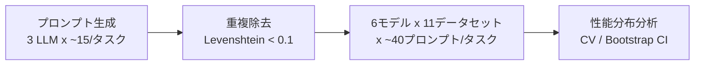

本記事は [arXiv:2605.22544 "One prompt is not enough: Instruction Sensitivity Undermines Embedding Model Evaluation"](https://arxiv.org/abs/2605.22544) の解説記事です。

## 論文概要（Abstract）

指示ベース（instruction-based）埋め込みモデルは、タスクごとに自然言語の指示文（プロンプト）を付与して埋め込みを生成する手法として広く普及している。しかし、現在の評価基盤はタスクあたり単一のプロンプトでモデル性能を測定しており、指示文の表現揺れに対する脆弱性を見過ごしている。著者らは6つの埋め込みモデルを11データセットで評価し、単一プロンプト評価が性能を系統的に過大/過小評価しうること、リーダーボードランキングがプロンプト選択に対してロバストでないこと、戦略的プロンプト選択により任意のモデルをトップランクに押し上げられることを実証している。

この記事は [Zenn記事: Instruction-Aware Embeddingの精度評価：タスク指示で変わる検索精度を定量検証する](https://zenn.dev/0h_n0/articles/9ca7ef23663c81) の深掘りです。

## 情報源

- **arXiv ID**: 2605.22544
- **URL**: [https://arxiv.org/abs/2605.22544](https://arxiv.org/abs/2605.22544)
- **著者**: Yevhen Kostiuk, Kenneth Enevoldsen
- **発表年**: 2026年（初版: 2026年5月、v2: 2026年8月）
- **分野**: cs.CL（Computation and Language）, cs.IR（Information Retrieval）
- **コード**: [https://github.com/centre-for-humanities-computing/one-prompt-is-not-enough](https://github.com/centre-for-humanities-computing/one-prompt-is-not-enough)
- **ライセンス**: CC BY 4.0

## 背景と動機（Background & Motivation）

Su et al. (2023) が提唱したinstruction-based embedding以降、タスク記述を自然言語プロンプトとしてモデルに与える手法が標準的なアプローチとなっている。MTEBやMMTEBといった大規模ベンチマークでは、モデル提出者が各タスクに対してカスタムプロンプトを指定でき、そのプロンプトによる単一スコアがリーダーボード上のランキングを決定する。

しかし、この評価方式には根本的な問題がある。生成型LLMの分野ではプロンプトの表現揺れが出力を大きく変動させることが広く知られている（Wahle et al. 2024, Romanou et al. 2026）にもかかわらず、埋め込みモデルの評価においてはこの問題がほとんど検討されてこなかった。モデル提出者が開発段階で最も性能の高いプロンプトを選択して報告する行為は、ベンチマークのポリシーに違反しないにもかかわらず、報告スコアの信頼性を損なう可能性がある。著者らはこの状況を、科学研究におけるp-hacking（Simmons et al. 2011）になぞらえ、「prompt hacking」と呼んでいる。

## 主要な貢献（Key Contributions）

著者らは以下の3つのリサーチクエスチョンに対して実証的な回答を与えている。

- **RQ1: 性能の誤表現（Performance Misrepresentation）** --- デフォルトプロンプトで報告されるスコアは、プロンプト空間全体にわたるスコア分布を正しく反映していない。多くのモデルで報告スコアが分布の中央値を上回っており、系統的な上方バイアスが存在することが示されている。
- **RQ2: ランキングの非ロバスト性（Ranking Instability）** --- リーダーボードランキングはプロンプト選択に対してロバストではない。タスク集合とプロンプトのリサンプリングによるブートストラップ分析の結果、モデル間のランキングが大きく変動しうることが報告されている。
- **RQ3: 敵対的脆弱性（Adversarial Vulnerability）** --- 敵対的なプロンプト選択シナリオでは、最下位のモデル（bge-small）を含む全てのモデルが1位を獲得可能であることが示されている。

## 技術的詳細（Technical Details）

### 実験設計

著者らの実験は、以下の3段階で構成されている。



#### プロンプトバリエーション生成

各タスクに対して、3つの生成LLM（GPT-oss-120b, Qwen3.6-35B-A3B, Gemma 4 26B）を用いてタスク固有のプロンプトを生成している。生成されたプロンプトはLevenshtein距離による重複除去（閾値0.1）を経て、タスクあたり平均約40個のプロンプトが得られている。

論文によると、プロンプトの平均長は7.78語（標準偏差3.2）であり、手動検証では100プロンプト全てが「許容可能（acceptable）」と判定されている。

#### 評価対象

**モデル（6種）**:

| モデル名 | パラメータ規模 | 特徴 |
|----------|---------------|------|
| Qwen3-Embedding-0.6B | 0.6B | 最新のinstruction-tuned |
| multilingual-e5-large-instruct | - | 多言語対応 |
| KaLM-embedding-multilingual-mini-instruct-v2.5 | - | 多言語小規模 |
| bge-small-en-v1.5 | - | BGEファミリー（小） |
| bge-base-en-v1.5 | - | BGEファミリー（中） |
| bge-large-en-v1.5 | - | BGEファミリー（大） |

**データセット（11種、4カテゴリ）**:

| カテゴリ | データセット |
|----------|------------|
| Retrieval | MIRACL Hard Negatives, Touche2020, FEVER Hard Negatives |
| Classification | Tweet Sentiment, IMDB, Amazon Counterfactual |
| Clustering | Medrxiv P2P, Stack Exchange |
| STS | STS14, STS15, STS22.v2 |

### 性能分散の定量化

著者らはプロンプト間の性能変動を定量化するために、変動係数（Coefficient of Variance; CV）を使用している。CVは単位に依存しない指標であり、異なるタスク・メトリクス間の比較を可能にする。

$$
\text{CV} = \frac{\sigma}{\mu}
$$

ここで、
- $\sigma$: 同一モデル・同一タスクにおけるプロンプト間のスコアの標準偏差
- $\mu$: 同一モデル・同一タスクにおけるプロンプト間のスコアの平均値

論文によると、CVの中央値は2--6%であるが、特定のモデル-タスクの組み合わせではCVが30--45%に達するケースが報告されている。

### ランキングロバスト性の検証

リーダーボードの安定性を評価するため、著者らはBorda Count法による集約ランキングを採用し、ブートストラップ信頼区間を算出している。

$$
\text{BordaScore}(m) = \sum_{t \in \mathcal{T}} \text{rank}(m, t)
$$

ここで、
- $m$: 対象モデル
- $\mathcal{T}$: タスク集合
- $\text{rank}(m, t)$: タスク$t$におけるモデル$m$の順位

ブートストラップ法では、以下の2軸でリサンプリングを行い、90%信頼区間を算出している。

1. **タスク集合のリサンプリング**: 11タスクから復元抽出（$B = 1000$回）
2. **プロンプトのリサンプリング**: 各モデル-タスクペアに対するプロンプトの復元抽出

この2段階リサンプリングにより、タスク選択のランダム性とプロンプト選択のランダム性の両方がランキングに与える影響を同時に評価できる。

### 敵対的プロンプト選択

敵対的シナリオでは、対象モデルに対して最も高いスコアを与えるプロンプトを選択し、他の全モデルに対しては最も低いスコアを与えるプロンプトを選択する。具体的には、各タスク$t$に対して以下の最適化を行う。

$$
p^*_t = \arg\max_{p \in \mathcal{P}_t} \left[ s(m_{\text{target}}, t, p) - \frac{1}{|\mathcal{M} \setminus \{m_{\text{target}}\}|} \sum_{m' \in \mathcal{M} \setminus \{m_{\text{target}}\}} s(m', t, p) \right]
$$

ここで、
- $\mathcal{P}_t$: タスク$t$に対するプロンプト集合
- $s(m, t, p)$: モデル$m$のタスク$t$におけるプロンプト$p$でのスコア
- $m_{\text{target}}$: 敵対的に優遇する対象モデル
- $\mathcal{M}$: 全モデル集合

この定式化は、対象モデルのスコアを最大化しつつ競合モデルのスコアを最小化するプロンプトを各タスクで選択するものである。

## 実装のポイント（Implementation）

自社の埋め込みモデル選定においてプロンプト感度分析を実施する場合、以下のようなアプローチが考えられる。著者らが公開しているコードはMTEBフレームワーク（v2.12.30）とvLLMを用いた構成であるが、ここではsentence-transformersを用いたより簡潔な実装例を示す。

### プロンプトバリエーション生成と評価

```python
from __future__ import annotations

import itertools
from dataclasses import dataclass

import numpy as np
from sentence_transformers import SentenceTransformer


@dataclass
class SensitivityReport:
    """プロンプト感度分析の結果を保持するデータクラス。

    Attributes:
        model_name: 評価対象モデル名
        prompt_scores: プロンプトごとのスコア辞書
        mean: スコアの平均値
        std: スコアの標準偏差
        cv: 変動係数（Coefficient of Variance）
        median: スコアの中央値
        min_prompt: 最低スコアのプロンプト
        max_prompt: 最高スコアのプロンプト
    """

    model_name: str
    prompt_scores: dict[str, float]
    mean: float
    std: float
    cv: float
    median: float
    min_prompt: str
    max_prompt: str


def generate_prompt_variations(base_task: str, n_variations: int = 10) -> list[str]:
    """タスク記述からプロンプトバリエーションを生成する。

    本論文ではLLMによる生成を行っているが、ここでは手動テンプレートの例を示す。
    実運用ではLLM APIを用いた生成とLevenshtein距離による重複除去を推奨する。

    Args:
        base_task: 基本タスク記述（例: "Retrieve relevant documents"）
        n_variations: 生成するバリエーション数

    Returns:
        プロンプトバリエーションのリスト
    """
    templates: list[str] = [
        "Represent the {task_type} for retrieval:",
        "Encode this {task_type} to find relevant documents:",
        "Given the following {task_type}, generate an embedding for search:",
        "Convert this {task_type} into a vector representation:",
        "Embed the {task_type} for semantic search:",
        "{task_type} embedding for document retrieval:",
        "Generate a dense representation of this {task_type}:",
        "Transform this {task_type} for similarity matching:",
        "Create a searchable embedding from this {task_type}:",
        "Produce a vector for the following {task_type}:",
    ]
    task_type: str = base_task.lower().strip()
    return [t.format(task_type=task_type) for t in templates[:n_variations]]


def evaluate_prompt_sensitivity(
    model_name: str,
    queries: list[str],
    documents: list[str],
    relevance_labels: list[list[int]],
    prompts: list[str],
) -> SensitivityReport:
    """複数プロンプトでモデルを評価し、感度レポートを生成する。

    Args:
        model_name: HuggingFaceモデル名
        queries: クエリテキストのリスト
        documents: ドキュメントテキストのリスト
        relevance_labels: クエリごとの関連度ラベル（各クエリに対する全ドキュメントの関連度）
        prompts: 評価に使用するプロンプトバリエーション

    Returns:
        SensitivityReport: 感度分析結果
    """
    model: SentenceTransformer = SentenceTransformer(model_name)
    prompt_scores: dict[str, float] = {}

    for prompt in prompts:
        q_embeddings: np.ndarray = model.encode(
            queries, prompt=prompt, normalize_embeddings=True
        )
        d_embeddings: np.ndarray = model.encode(
            documents, normalize_embeddings=True
        )
        # コサイン類似度による簡易的なnDCG@10計算
        similarities: np.ndarray = q_embeddings @ d_embeddings.T
        ndcg: float = _compute_ndcg_at_k(similarities, relevance_labels, k=10)
        prompt_scores[prompt] = ndcg

    scores: np.ndarray = np.array(list(prompt_scores.values()))
    mean_score: float = float(np.mean(scores))
    std_score: float = float(np.std(scores))
    cv: float = std_score / mean_score if mean_score > 0 else 0.0

    min_prompt: str = min(prompt_scores, key=prompt_scores.get)  # type: ignore[arg-type]
    max_prompt: str = max(prompt_scores, key=prompt_scores.get)  # type: ignore[arg-type]

    return SensitivityReport(
        model_name=model_name,
        prompt_scores=prompt_scores,
        mean=mean_score,
        std=std_score,
        cv=cv,
        median=float(np.median(scores)),
        min_prompt=min_prompt,
        max_prompt=max_prompt,
    )


def _compute_ndcg_at_k(
    similarities: np.ndarray,
    relevance_labels: list[list[int]],
    k: int = 10,
) -> float:
    """コサイン類似度と関連度ラベルからnDCG@kを計算する。

    Args:
        similarities: クエリ x ドキュメントの類似度行列
        relevance_labels: クエリごとの関連度ラベル
        k: 上位k件で評価

    Returns:
        平均nDCG@kスコア
    """
    ndcg_scores: list[float] = []
    for i, labels in enumerate(relevance_labels):
        ranked_indices: np.ndarray = np.argsort(-similarities[i])[:k]
        dcg: float = sum(
            labels[idx] / np.log2(rank + 2)
            for rank, idx in enumerate(ranked_indices)
        )
        ideal_labels: list[int] = sorted(labels, reverse=True)[:k]
        idcg: float = sum(
            label / np.log2(rank + 2)
            for rank, label in enumerate(ideal_labels)
        )
        ndcg_scores.append(dcg / idcg if idcg > 0 else 0.0)
    return float(np.mean(ndcg_scores))
```

### 使用例

```python
# 使用例: 複数モデルの感度比較
model_names: list[str] = [
    "BAAI/bge-small-en-v1.5",
    "BAAI/bge-large-en-v1.5",
    "intfloat/multilingual-e5-large-instruct",
]
prompts: list[str] = generate_prompt_variations("query", n_variations=10)

for name in model_names:
    report: SensitivityReport = evaluate_prompt_sensitivity(
        model_name=name,
        queries=["What is machine learning?", "How does attention work?"],
        documents=["ML is a subset of AI...", "Attention computes weighted..."],
        relevance_labels=[[1, 0], [0, 1]],
        prompts=prompts,
    )
    print(f"Model: {report.model_name}")
    print(f"  Mean: {report.mean:.4f}, Std: {report.std:.4f}, CV: {report.cv:.4f}")
    print(f"  Best prompt: {report.max_prompt}")
    print(f"  Worst prompt: {report.min_prompt}")
    print()
```

上記のコードは論文の手法を簡略化した実装であり、実際の実験では著者らはMTEBフレームワーク（v2.12.30）を通じてタスク固有の評価パイプラインを使用している。本番での活用時には、MTEBの公式評価関数を用いることで、タスクごとに適切なメトリクス（nDCG, Accuracy, V-measure等）が自動選択される。

## 実験結果（Results）

### プロンプト間の性能分散（RQ1）

著者らの実験結果によると、プロンプト間のスコア変動は決して無視できない水準にある。CVの中央値は2--6%であるが、特定の組み合わせでは30--45%に達している（論文Section 4より）。

特に注目すべき傾向として、以下が報告されている。

- **BGEモデルの「プロンプト・デフレーション」**: bge-small/base/largeは、Twitter Sentiment, Amazon Counterfactual, STS22の各タスクで、デフォルトプロンプトのスコアがプロンプト空間の分布の下方に位置している。すなわち、公式報告スコアがモデルの実力を過小評価している。
- **Qwen3の「プロンプト・インフレーション」**: Qwen3-Embedding-0.6BはMIRACLデータセットにおいて、デフォルトプロンプトのスコアが分布の上端に位置しており、公式スコアが実力を過大評価している。

著者らはFigure 6において、各モデルの報告スコアが観測されたプロンプト分布の中央値を超える確率を可視化しており、多くのモデルで報告スコアが中央値を系統的に上回る傾向（上方バイアス）が確認されている。

### リーダーボードランキングの変動（RQ2）

デフォルトプロンプトによるランキングは以下の通りである（論文のBorda Count集計より）。

| ランク | モデル |
|--------|--------|
| 1-2 | KaLM, Qwen3 |
| 3 | multilingual-e5-large |
| 4-6 | bge-large, bge-base, bge-small |

しかし、ブートストラップ法（$B = 1000$回、タスク集合とプロンプトの両方をリサンプリング）による90%信頼区間を算出すると、上位モデル間のランキングには大きな重複が見られ、順位の確定的な決定が困難であることが示されている。

### 敵対的プロンプト選択（RQ3）

最も衝撃的な結果として、敵対的プロンプト選択シナリオでは全6モデルが1位を獲得可能であることが報告されている。デフォルトランキングで最下位のbge-smallですら、戦略的なプロンプト選択により1位に到達できる。また、bge-largeはランク5からランク3に上昇し、e5-largeを逆転するケースも確認されている。

この結果は、現在のベンチマークシステムがプロンプト選択に対して極めて脆弱であり、モデル開発者が意図的にランキングを操作しうることを意味している。

### タスクカテゴリ別の感度傾向

論文の結果から、タスクカテゴリによってプロンプト感度の傾向が異なることが読み取れる。

| カテゴリ | 感度の傾向 | 主な要因 |
|----------|-----------|---------|
| Retrieval | 中〜高 | クエリ表現の多様性がスコアに直結 |
| Classification | 中程度 | タスク記述の抽象度に依存 |
| Clustering | 低〜中 | クラスタ構造が支配的 |
| STS | タスク依存 | STS22（多言語）で高感度 |

## 実運用への応用（Practical Applications）

本論文の知見は、埋め込みモデルを実プロダクトに組み込む際のモデル選定プロセスに直接的な示唆を与える。

### モデル選定時のプロンプト感度評価

リーダーボード上の単一スコアだけでモデルを選定することのリスクが実証されている。実運用では以下の手順が推奨される。

1. **候補モデルに対して5--10個のプロンプトバリエーションで評価する** --- 自社のユースケースに近いプロンプトを複数用意し、スコアの分散を確認する
2. **CVが10%を超えるモデル-タスクの組み合わせには注意する** --- 本論文の結果から、CVの中央値は2--6%であるため、10%を超える場合はプロンプト選択が性能に過度な影響を与えている可能性がある
3. **最良プロンプトのスコアではなく中央値で比較する** --- 開発段階で得られた最良スコアは運用時に再現されない可能性が高い

### RAGパイプラインへの影響

RAG（Retrieval-Augmented Generation）パイプラインでは、クエリをエンコードする際のプロンプトが検索精度に直接影響する。本論文の知見に基づけば、以下の点を考慮すべきである。

- **プロンプトの固定**: 開発時と運用時で同一のプロンプトを使用する。プロンプトの微修正がスコアを大きく変動させうる
- **ロバスト性テスト**: デプロイ前に、想定されるクエリパターンに対して複数プロンプトでの検索精度を測定する
- **モデル更新時の再評価**: モデルをアップデートする際は、既存プロンプトとの互換性を確認する。同じプロンプトでもモデルバージョンによって感度特性が異なる可能性がある

### ベンチマーク設計への提言

著者らは、評価基盤の改善として以下を提言している。

- 単一プロンプト評価から**複数プロンプト評価**への移行
- スコアの**分布レポート**の義務化（平均値だけでなく標準偏差やCVも報告）
- **ロバスト性メトリクス**のベンチマークへの組み込み
- Jina v5シリーズが採用している**限定プロンプト方式**（モデル側でプロンプトテンプレートを固定し、ユーザーの自由度を制限する）の検討

## 関連研究（Related Work）

- **MTEB (Muennighoff et al. 2023)**: Massive Text Embedding Benchmarkとして、埋め込みモデルの包括的評価基盤を提供している。本論文はMTEB v2.12.30を用いており、MTEBの評価方式に内在するプロンプト依存性の問題を指摘している。
- **FollowIR (Weller et al. 2024)**: 情報検索モデルが指示に従う能力を評価するベンチマークである。FollowIRはTREC narrativesを制約として再利用し、指示追従能力をバイナリ関連度で評価する。本論文が扱う「プロンプトの表現揺れへの感度」とは相補的な関係にある。
- **Promptriever (Weller et al. 2025, ICLR 2025)**: 検索モデルをLLMのようにプロンプトで制御可能にする手法であり、RepLLaMAをクエリレベルの指示データでfine-tuneしている。本論文の知見は、Promptrieverのような指示追従モデルの評価においてもプロンプト感度を考慮すべきことを示唆している。
- **HTEB (2026)**: Harder Text Embedding Benchmarkは、埋め込みモデルのロバスト性を語彙/文体、長さ、言語の3軸で動的に評価するフレームワークであり、本論文の問題意識と共通する方向性を持つ。
- **Benchmark hacking (Qiu et al. 2026)**: MLコンテストにおけるベンチマーク操作の問題を分析しており、本論文のprompt hackingはその埋め込みモデル版と位置づけられる。

## まとめと今後の展望

本論文は、指示ベース埋め込みモデルの評価が単一プロンプトに依存していることの危険性を、6モデル×11データセットの大規模実験で実証した研究である。

主な成果として、(1) デフォルトプロンプトによるスコアがモデルの真の性能分布を反映していないこと、(2) リーダーボードランキングがプロンプト選択に対してロバストでないこと、(3) 敵対的プロンプト選択により任意のモデルがトップランクを獲得しうることが報告されている。

今後の研究方向としては、著者ら自身が認めている限界点 --- 0.6Bパラメータ以下の6モデルのみの検証、英語のみの分析、合成プロンプトの多様性の限界 --- を克服する拡張研究が期待される。特に、大規模モデルやクローズドソースモデル（OpenAI, Cohere等）、多言語設定でのプロンプト感度分析は実務上の重要性が高い。また、プロンプト感度を**最適化対象**として組み込む訓練手法（プロンプトに対してロバストな埋め込みモデルの構築）は、有望な研究方向として挙げられている。

## 参考文献

- **arXiv**: [https://arxiv.org/abs/2605.22544](https://arxiv.org/abs/2605.22544)
- **Code**: [https://github.com/centre-for-humanities-computing/one-prompt-is-not-enough](https://github.com/centre-for-humanities-computing/one-prompt-is-not-enough)
- **Related Zenn article**: [https://zenn.dev/0h_n0/articles/9ca7ef23663c81](https://zenn.dev/0h_n0/articles/9ca7ef23663c81)
- Su et al. (2023). "One Embedder, Any Task: Instruction-Finetuned Text Embeddings." Findings of ACL.
- Muennighoff et al. (2023). "MTEB: Massive Text Embedding Benchmark." EACL.
- Weller et al. (2024). "FollowIR: Evaluating and Teaching Information Retrieval Models to Follow Instructions."
- Weller et al. (2025). "Promptriever: Instruction-Trained Retrievers Can Be Prompted Like Language Models." ICLR 2025.
- Wahle et al. (2024). Prompt sensitivity in generative LLMs.
- Simmons et al. (2011). "False-Positive Psychology."
- Qiu et al. (2026). Benchmark hacking in ML contests.

---

*本記事はAIによって生成されました。内容の正確性については原論文を参照してください。*
