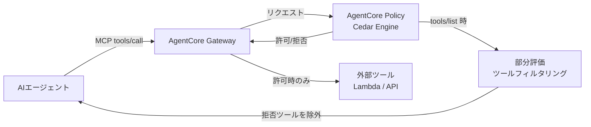
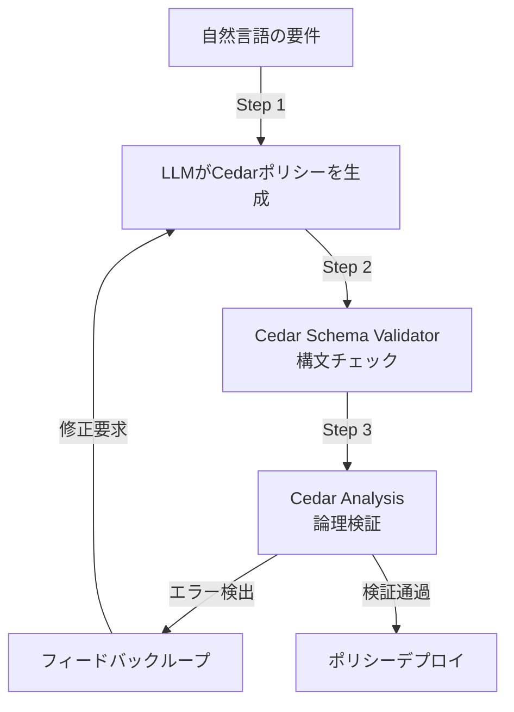

## ブログ概要（Summary）

本記事は [Why Policy in Amazon Bedrock AgentCore chose Cedar for securing agentic workflows](https://aws.amazon.com/blogs/security/why-policy-in-amazon-bedrock-agentcore-chose-cedar-for-securing-agentic-workflows/)（AWS Security Blog、2026年5月20日公開、著者: Liana Hadarean、Jean-Baptiste Tristan）の解説記事です。

AWS Security Blogの本ブログ記事では、Amazon Bedrock AgentCoreがエージェントのツール認可にCedar言語を採用した技術的理由が解説されている。LLMは非決定的であり、セキュリティゲートキーパーとして信頼できないという前提のもと、ツール呼び出し境界で決定論的な認可制御を適用するアーキテクチャが提示されている。Cedarの可読性・$O(n)$評価性能・形式検証可能性という3つの特性が、エージェント認可という新しいドメインに適している理由が詳述されている。

この記事は [Zenn記事: Bedrock AgentCore Runtime×Gatewayで顧客サポートエージェントを構築しツール認証を設計する](https://zenn.dev/0h_n0/articles/391fc1f0476f7a) の深掘りです。

## 情報源

- **種別**: 企業テックブログ（AWS Security Blog）
- **URL**: [https://aws.amazon.com/blogs/security/why-policy-in-amazon-bedrock-agentcore-chose-cedar-for-securing-agentic-workflows/](https://aws.amazon.com/blogs/security/why-policy-in-amazon-bedrock-agentcore-chose-cedar-for-securing-agentic-workflows/)
- **組織**: Amazon Web Services, Security Blog
- **著者**: Liana Hadarean、Jean-Baptiste Tristan
- **発表日**: 2026年5月20日

## 技術的背景（Technical Background）

### なぜLLMを信頼できないのか

AIエージェントが外部ツール（API呼び出し、データベース操作、ファイル操作など）を実行する際、セキュリティ上の根本的な問題が生じる。著者らは「LLMは外部世界に直接影響を与えることはできない。LLMの出力に基づいてツールを呼び出すオーケストレーターを経由する必要がある」と述べている。この構造こそが、ツール呼び出しの境界にポリシーエンジンを配置する設計の根拠となっている。

従来のアプローチでは、エージェントのシステムプロンプトに「このツールは使わないでください」と記述する方法がとられることがある。しかし、LLMの出力は非決定的であり、プロンプトインジェクション攻撃に対して脆弱である。ブログ著者らは、LLMをセキュリティ境界として扱うことの危険性を明確に指摘している。

### 学術研究との関連

Cedarは、AWSの研究チームが開発した認可ポリシー言語であり、2024年にOOPSLA（ACM SIGPLAN Conference on Object-Oriented Programming, Systems, Languages, and Applications）で論文として発表されている（arXiv: 2403.04651）。形式検証の手法をポリシー言語に組み込んだ点が学術的な貢献であり、Lean定理証明器によるモデル検証とRustによるリファレンス実装が提供されている。さらに2026年には、CedarがCloud Native Computing Foundation（CNCF）に参加したことで、クラウドネイティブ認可の標準技術としての地位を固めつつある。

## 実装アーキテクチャ（Architecture）

### AgentCore Gateway × Policy × Runtimeの3層構成

ブログで解説されているアーキテクチャは、3つのコンポーネントで構成される。



| コンポーネント | 責務 | ブログでの説明 |
|---|---|---|
| **AgentCore Runtime** | エージェントコードのホスティング | microVM内でエージェントを隔離実行 |
| **AgentCore Gateway** | エージェント⇔ツール間のMCP接続管理 | 全トラフィックをインターセプト |
| **Policy in AgentCore** | Cedar評価エンジンによるリクエスト認可 | ツール呼び出しの許可/拒否を決定論的に判定 |

### MCP トラフィックのインターセプト

ブログによると、Gatewayはエージェントからの全MCP通信（`tools/list`と`tools/call`の両方）をインターセプトし、Cedarポリシーエンジンで評価する。これは従来のAPI Gatewayにおけるリクエスト認可と類似しているが、以下の点でエージェント固有の課題に対応している。

1. **ツール一覧のフィルタリング**: `tools/list`リクエスト時にCedarの部分評価（Partial Evaluation）機能を使い、現在のポリシーセットで常に拒否されるアクションを特定する。該当するツールはレスポンスから除外されるため、LLMはそのツールの存在すら認識しない
2. **引数レベルの制御**: `tools/call`リクエスト時に、ツール名だけでなく引数の値に基づいた認可判定が可能

著者らはこのアプローチについて「LLMと基盤モデルがそれらのツールアクションを決して見ないため、リスクのクラス全体を排除する」と述べている。

## Cedarが選ばれた3つの技術的理由

### 1. 可読性（Readability）

ブログで示されているCedarポリシーの例を以下に示す。

```
permit (
    principal,
    action == Action::"BulkDiscount___apply",
    resource
)
when {
    principal.customer_tier == "platinum" &&
    context.order_quantity >= 50
}
unless {
    resource.product_category in ["limited_edition", "seasonal"]
};
```

著者らは「ポリシーは構造化された英語に似ており、監査人が理解できる」と述べている。このポリシーはプラチナ顧客が50個以上注文した場合にバルクディスカウントを許可するが、限定版・季節商品は除外するという意味を持つ。セキュリティ監査において、非エンジニアのコンプライアンス担当者がポリシーの意図を確認できることは、エンタープライズ運用では重要な要件である。

### 2. 評価性能（Performance）

Cedarの評価は$O(n)$時間（$n$はポリシー数）で完了する。これは、Cedarがループや状態保持を持たない純粋な宣言型言語として設計されているためである。ブログでは以下の比較が暗示されている。

| 言語 | 評価複雑度 | ループ | 状態保持 |
|---|---|---|---|
| **Cedar** | $O(n)$ | なし | なし |
| Rego (OPA) | チューリング完全 | あり | あり |
| OpenFGA | 関係グラフ依存 | なし | あり |

エージェントのツール呼び出しはリアルタイム性が求められるため、ポリシー評価のレイテンシが低いことは実用上の重要な要件である。

### 3. 形式検証可能性（Analyzability）

ブログの中で最も技術的に深い部分がこの形式検証機能である。Cedar Analysisは以下の論理的エラーを数学的に検出できると著者らは述べている。

- **矛盾する制約**: いかなるリクエストも許可できないポリシー（空集合ポリシー）
- **過剰に許可的なポリシー**: 意図せず全リクエストを許可する条件
- **ポリシー間の競合**: ポリシーセット全体にわたる論理的矛盾
- **変更影響分析**: ポリシー変更前後の比較分析

形式手法としては、Cedarのセマンティクスをソルバー（SMTソルバー）で解析可能な論理式にエンコードし、充足可能性を検証する手法が用いられている。これにより「このポリシーセットのもとで、あるリクエストが許可される入力が存在するか？」という問いに数学的に回答できる。

## ニューロシンボリックポリシー生成

### LLM×形式検証のハイブリッドワークフロー

ブログで紹介されているポリシー生成ワークフローは、機械学習と記号推論を組み合わせた「ニューロシンボリック」アプローチである。



1. **LLMによる初期生成**: 自然言語の要件（例：「サポート部門のユーザーのみチケット管理ツールを使用可」）をCedarポリシーに変換
2. **スキーマ検証**: MCPツール定義と照合し、ポリシーの構文的正当性を確認
3. **論理検証**: Cedar Analysisで矛盾や過剰許可を数学的に検出
4. **フィードバックループ**: エラーが検出された場合、LLMに修正を要求

このアプローチにより、LLMの生成能力と形式検証の厳密性を両立している。ただし著者らは、最終的なポリシーの承認はセキュリティチームによるレビューが必須であると述べている。

## 決定論的セマンティクスと安全性保証

### Cedarの3つの基本原則

ブログでは、Cedarが以下の3つの決定論的原則に基づくことが強調されている。

1. **Default Deny（デフォルト拒否）**: 明示的に許可するポリシーがない限り、すべてのリクエストは拒否される
2. **Forbid Wins（禁止優先）**: `forbid`ステートメントは常に`permit`に優先する。これにより「このアクションは絶対に許可しない」というハードバウンダリを設定できる
3. **No Ordering（順序非依存）**: ポリシーの評価順序に関わらず、同一のリクエストに対して常に同一の認可結果を返す

これらの原則により、ポリシー数が増加しても予測可能な動作が保証される。特にForbid Winsの原則は、エージェントが予期しない操作を行うリスクを根本的に排除する設計思想として重要である。

### 部分評価によるツール隠蔽

ブログで特に注目すべき技術的詳細が、Cedarの部分評価（Partial Evaluation）機能である。エージェントが`tools/list`コマンドを発行すると、AgentCore Gatewayは各ツールアクションに対してCedarポリシーを部分評価し、現在のポリシーセットのもとで「常に拒否される」アクションを特定する。

$$
\text{visible\_tools} = \{ t \in \text{all\_tools} \mid \exists \, \text{ctx} : \text{Cedar}(t, \text{ctx}) = \text{ALLOW} \}
$$

ここで、$t$はツールアクション、$\text{ctx}$はリクエストコンテキスト（JWTクレーム等）、$\text{Cedar}(t, \text{ctx})$はCedarポリシーの評価結果である。部分評価では$\text{ctx}$の一部を束縛せずに評価し、すべてのコンテキストで拒否されるツールを除外する。

この仕組みにより、LLMがプロンプトインジェクション等で拒否対象のツールを呼び出そうとしても、そもそもツール一覧にそのツールが含まれないため、呼び出しが不可能になる。

## パフォーマンス最適化（Performance）

### 実測値と設計上の特性

ブログでは具体的なベンチマーク数値は示されていないが、以下の設計上の特性がパフォーマンスに寄与すると述べられている。

- **$O(n)$評価時間**: ポリシー数に対して線形時間で評価が完了
- **ステートレス評価**: 各リクエストの評価が独立しているため、水平スケーリングが容易
- **キャッシュ親和性**: 部分評価結果のキャッシュにより、`tools/list`の繰り返し呼び出しを最適化

AWS公式の料金ページによると、Policy in AgentCoreのAPI呼び出しコストは$0.005/1,000呼び出しであり、大規模なエージェントシステムでもコスト効率が高い設計となっている。

### チューニングのポイント

- **ポリシー数の管理**: $n$増加で評価時間も線形増加するため、定期的なクリーンアップが推奨
- **部分評価キャッシュ**: `tools/list`結果をキャッシュし、同一セッション内の評価回数を削減
- **Cedar Analysis**: ポリシー変更時（CI/CD内）にのみ実行し、リクエストパス上では実行しない

## 運用での学び（Production Lessons）

### IAM Access Analyzerとの類似性

ブログでは、Cedarベースの認可がAWSの既存の自動推論技術（IAM Access Analyzer、ネットワークアクセス分析、S3バケットポリシー分析）の延長線上にあることが示されている。AWSは長年にわたり形式検証を本番システムに適用してきた実績があり、その知見がエージェント認可にも応用されている。

### ガバナンスフロー

著者らは以下のガバナンスフローを推奨している。

1. **ポリシー変更はPull Request経由**: すべてのCedarポリシー変更にセキュリティチームのレビューを必須とする
2. **Cedar Analysisの自動実行**: CI/CDパイプラインでポリシーの論理検証を自動実行し、矛盾や過剰許可を検出
3. **監査ログの保持**: CloudTrailでツール呼び出しの許可/拒否ログを記録し、事後分析に活用

### 制約と限界

- **動的コンテキストの限界**: Cedarはリクエスト時のコンテキスト（JWTクレーム等）に基づく評価は可能だが、時系列コンテキスト（「過去1時間の呼び出し回数」）は直接扱えない。レート制限にはGatewayの別機能が必要
- **LLM生成ポリシーの品質**: 自然言語要件が曖昧な場合、生成ポリシーの品質にばらつきが生じうる

## 学術研究との関連（Academic Connection）

### Cedarの学術的位置づけ

Cedarの設計はOOPSLA 2024で発表された論文（Cutler et al., 2024, arXiv: 2403.04651）に基づいている。この論文では、Lean定理証明器を用いたCedarセマンティクスの形式モデルが提示され、Rustリファレンス実装との等価性が証明されている。

関連研究として、AutoCedar（arXiv: 2607.03656）はLLMを用いてCedarポリシーを自動合成するフレームワークを提案しており、ブログで紹介されているニューロシンボリックアプローチと密接に関連している。また、Progent（arXiv: 2504.11703）はSMTソルバーを用いたエージェント権限制御フレームワークを提案しており、Cedarの形式検証アプローチと思想を共有している。

## まとめと実践への示唆

AWS Security Blogの本記事は、AIエージェントのツール認可において「LLMを信頼しない」という設計原則を明確にし、Cedarの形式検証可能性がその原則を技術的に裏付けることを示している。特にMCPトラフィックの部分評価によるツール隠蔽は、プロンプトインジェクション攻撃への構造的な防御として注目に値する。AgentCore Gatewayを用いたエージェントシステムの設計にあたっては、Cedarポリシーの形式検証をCI/CDに組み込み、ポリシー変更のガバナンスフローを確立することが、本番運用における安全性の鍵となる。

## Production Deployment Guide

### AWS実装パターン（コスト最適化重視）

AgentCore Policy（Cedar）をベースとしたエージェント認可システムのAWS構成を、トラフィック量別に示す。

| 規模 | 月間リクエスト | 推奨構成 | 月額コスト | 主要サービス |
|------|--------------|---------|-----------|------------|
| **Small** | ~3,000 (100/日) | Serverless | $50-150 | Lambda + Bedrock + AgentCore Policy |
| **Medium** | ~30,000 (1,000/日) | Hybrid | $300-800 | Lambda + ECS Fargate + ElastiCache |
| **Large** | 300,000+ (10,000/日) | Container | $2,000-5,000 | EKS + Karpenter + EC2 Spot |

**Small構成の詳細**（月額$50-150）:
- **AgentCore Runtime**: 消費ベース課金 $0.0895/vCPU-h、I/O待機中は非課金（$20/月）
- **AgentCore Gateway**: $0.005/1,000呼び出し（$5/月）
- **AgentCore Policy**: $0.025/1,000ポリシー評価（$5/月）
- **Bedrock**: Claude 3.5 Haiku、Prompt Caching有効（$80/月）
- **Cognito**: JWTトークン発行、50,000MAUまで無料（$0/月）
- **CloudWatch**: 基本監視（$5/月）

**コスト削減テクニック**:
- AgentCore RuntimeのI/O待機非課金を活用し、LLMレスポンス待ちの間はCPUコストゼロ
- Cedarの部分評価結果をキャッシュし、`tools/list`の評価回数を削減
- Bedrock Batch APIで非リアルタイム処理を50%割引
- Prompt Caching有効化で30-90%のトークンコスト削減

**コスト試算の注意事項**:
- 上記は2026年9月時点のAWS ap-northeast-1（東京）リージョン料金に基づく概算値
- 実際のコストはトラフィックパターン、リージョン、バースト使用量により変動
- 最新料金は [AWS料金計算ツール](https://calculator.aws/) で確認のこと

### Terraformインフラコード

**Small構成 (Serverless): AgentCore + Cognito + CloudWatch**

```hcl
module "vpc" {
  source  = "terraform-aws-modules/vpc/aws"
  version = "~> 5.0"

  name = "agentcore-vpc"
  cidr = "10.0.0.0/16"
  azs  = ["ap-northeast-1a", "ap-northeast-1c"]
  private_subnets = ["10.0.1.0/24", "10.0.2.0/24"]

  enable_nat_gateway   = false
  enable_dns_hostnames = true
}

resource "aws_iam_role" "agentcore_runtime" {
  name = "agentcore-runtime-role"

  assume_role_policy = jsonencode({
    Version = "2012-10-17"
    Statement = [{
      Action = "sts:AssumeRole"
      Effect = "Allow"
      Principal = { Service = "bedrock-agentcore.amazonaws.com" }
    }]
  })
}

resource "aws_iam_role_policy" "bedrock_invoke" {
  role = aws_iam_role.agentcore_runtime.id
  policy = jsonencode({
    Version = "2012-10-17"
    Statement = [{
      Effect   = "Allow"
      Action   = ["bedrock:InvokeModel", "bedrock:InvokeModelWithResponseStream"]
      Resource = "arn:aws:bedrock:ap-northeast-1::foundation-model/anthropic.claude-3-5-haiku*"
    }]
  })
}

resource "aws_cognito_user_pool" "agents" {
  name = "agentcore-user-pool"

  password_policy {
    minimum_length    = 12
    require_uppercase = true
    require_numbers   = true
    require_symbols   = true
  }

  mfa_configuration = "ON"
  software_token_mfa_configuration {
    enabled = true
  }
}

resource "aws_cognito_user_pool_client" "agent_client" {
  name         = "agentcore-client"
  user_pool_id = aws_cognito_user_pool.agents.id

  explicit_auth_flows = ["ALLOW_USER_PASSWORD_AUTH", "ALLOW_REFRESH_TOKEN_AUTH"]
  generate_secret     = false

  access_token_validity  = 1
  id_token_validity      = 1
  refresh_token_validity = 30
}

resource "aws_cloudwatch_metric_alarm" "policy_denial_spike" {
  alarm_name          = "cedar-policy-denial-spike"
  comparison_operator = "GreaterThanThreshold"
  evaluation_periods  = 1
  metric_name         = "PolicyDenials"
  namespace           = "AWS/BedrockAgentCore"
  period              = 300
  statistic           = "Sum"
  threshold           = 50
  alarm_description   = "Cedarポリシー拒否数スパイク（攻撃試行の可能性）"
}
```

**Large構成 (Container)**: EKS v1.31 + Karpenter NodePool（Spot優先、m7i.xlarge/2xlarge、CPU 64・Memory 256Gi上限）+ AWS Budgets（月額$5,000、80%閾値でアラート）で構成する。Karpenterの`consolidationPolicy: WhenEmptyOrUnderutilized`によりアイドルノードを30秒で回収し、Spotの最大90%割引を活用する。

### セキュリティベストプラクティス

1. **ネットワーク**: EKSの`cluster_endpoint_public_access = false`設定（VPN経由アクセス）、セキュリティグループは443のみ開放
2. **認証・認可**: IAMロール最小権限、MFA必須、IRSA（IAM Roles for Service Accounts）
3. **シークレット**: Secrets Manager使用、環境変数ハードコード禁止、90日ローテーション
4. **監査**: CloudTrail全リージョン有効化、Config・GuardDuty有効化
5. **暗号化**: TLS 1.2以上、S3/DynamoDB/EBS全てKMS暗号化

### 運用・監視設定

**CloudWatch Logs Insights クエリ**:

```sql
-- Cedar ポリシー拒否の傾向分析
fields @timestamp, principal, action, decision
| filter decision = "DENY"
| stats count() as denial_count by bin(1h), action
| sort denial_count desc

-- ツール呼び出しレイテンシ P95, P99
fields @timestamp, duration_ms
| stats pct(duration_ms, 95) as p95, pct(duration_ms, 99) as p99 by bin(5m)
```

**CloudWatch アラーム（コスト重視）**:

```python
import boto3

cloudwatch = boto3.client('cloudwatch')

cloudwatch.put_metric_alarm(
    AlarmName='agentcore-token-spike',
    ComparisonOperator='GreaterThanThreshold',
    EvaluationPeriods=1,
    MetricName='TokenUsage',
    Namespace='AWS/Bedrock',
    Period=3600,
    Statistic='Sum',
    Threshold=500000,
    ActionsEnabled=True,
    AlarmActions=['arn:aws:sns:ap-northeast-1:123456789:cost-alerts'],
    AlarmDescription='Bedrockトークン使用量異常（コスト急増）'
)
```

**X-Ray**: `aws_xray_sdk`の`patch_all()`でboto3を自動計装し、Cedar評価のアノテーション（action、principal_tier）とメタデータ（decision）を記録する。

### コスト最適化チェックリスト

**アーキテクチャ選択**:
- [ ] ~100 req/日 → AgentCore Runtime (Serverless) - $50-150/月
- [ ] ~1,000 req/日 → ECS Fargate + AgentCore Gateway - $300-800/月
- [ ] 10,000+ req/日 → EKS + Spot Instances - $2,000-5,000/月

**リソース最適化**:
- [ ] EC2 Spot Instances優先（最大90%削減、Karpenter管理）
- [ ] Reserved Instances 1年コミット（72%削減）
- [ ] Savings Plans検討（柔軟性重視）
- [ ] Lambda メモリサイズ最適化（CloudWatch Insights分析）
- [ ] ECS/EKS アイドルタイムのスケールダウン（夜間0台）

**LLMコスト削減**:
- [ ] Bedrock Batch API（50%割引、非リアルタイム処理）
- [ ] Prompt Caching有効化（30-90%削減）
- [ ] モデル選択ロジック（簡易タスク: Haiku $0.25/MTok、複雑: Sonnet $3/MTok）
- [ ] max_tokens設定で過剰生成防止

**監視・アラート**:
- [ ] AWS Budgets 月額予算設定（80%警告、100%アラート）
- [ ] CloudWatch アラーム（トークン使用量スパイク検知）
- [ ] Cost Anomaly Detection（ML自動異常検知）
- [ ] 日次コストレポート SNS/Slack送信

**リソース管理**:
- [ ] 未使用リソース削除（Lambda Insights、Trusted Advisor）
- [ ] タグ戦略（環境別dev/staging/prod、プロジェクト別）
- [ ] S3ライフサイクルポリシー（30日で古いキャッシュ削除）
- [ ] 開発環境の夜間停止（Auto Start/Stop）

## 参考文献

- **Blog URL**: [Why Policy in Amazon Bedrock AgentCore chose Cedar for securing agentic workflows](https://aws.amazon.com/blogs/security/why-policy-in-amazon-bedrock-agentcore-chose-cedar-for-securing-agentic-workflows/)
- **Cedar論文**: [arXiv: 2403.04651](https://arxiv.org/abs/2403.04651) - Cedar: A New Language for Expressive, Fast, Safe, and Analyzable Authorization (OOPSLA 2024)
- **AutoCedar**: [arXiv: 2607.03656](https://arxiv.org/abs/2607.03656) - An Agentic Framework for Verifier-Guided Access Control Policy Synthesis
- **AgentCore料金ページ**: [https://aws.amazon.com/bedrock/agentcore/pricing/](https://aws.amazon.com/bedrock/agentcore/pricing/)
- **Related Zenn article**: [https://zenn.dev/0h_n0/articles/391fc1f0476f7a](https://zenn.dev/0h_n0/articles/391fc1f0476f7a)
