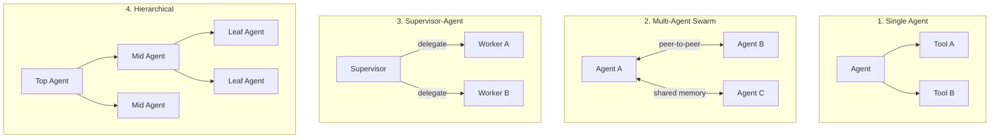

## ブログ概要（Summary）

本記事は [Strands Agents SDK: A technical deep dive into agent architectures and observability](https://aws.amazon.com/blogs/machine-learning/strands-agents-sdk-a-technical-deep-dive-into-agent-architectures-and-observability/)（AWS Machine Learning Blog、2025年7月31日公開、著者: Jin Tan Ruan）の解説記事です。

本ブログでは、AWSがオープンソースで公開しているStrands Agents SDKの内部アーキテクチャが解説されている。Strands SDKは「モデル駆動型（model-driven）」アプローチを採用し、LLMの推論能力にタスク計画とツール選択を委ねる設計思想を持つ。単一エージェント、マルチエージェントスウォーム、スーパーバイザー・エージェント、階層型アーキテクチャの4つのパターンと、OpenTelemetryベースのオブザーバビリティ機構が紹介されている。

この記事は [Zenn記事: Bedrock AgentCore Runtime×Gatewayで顧客サポートエージェントを構築しツール認証を設計する](https://zenn.dev/0h_n0/articles/391fc1f0476f7a) の深掘りです。

## 情報源

- **種別**: 企業テックブログ（AWS Machine Learning Blog）
- **URL**: [https://aws.amazon.com/blogs/machine-learning/strands-agents-sdk-a-technical-deep-dive-into-agent-architectures-and-observability/](https://aws.amazon.com/blogs/machine-learning/strands-agents-sdk-a-technical-deep-dive-into-agent-architectures-and-observability/)
- **組織**: Amazon Web Services, Machine Learning Blog
- **著者**: Jin Tan Ruan
- **発表日**: 2025年7月31日

## 技術的背景（Technical Background）

### なぜモデル駆動型なのか

従来のエージェントフレームワーク（LangChainのChain、LlamaIndexのPipeline等）は、開発者がタスクの実行フローを明示的にコーディングする「ワークフロー駆動型」が主流であった。ブログ著者はこれに対し、Strands SDKが「モデル駆動型」を採用した理由を以下のように述べている。

- **タスクフローのハードコード不要**: LLMの推論能力が向上した現在、タスクの分解・計画・ツール選択をモデルに委ねることで、より柔軟なエージェントが構築可能
- **最小構成**: エージェントの構成要素は「LLMモデル」「システムプロンプト」「ツールセット」の3つのみ
- **モデル非依存**: Amazon Bedrock、Anthropic API、OpenAI、Gemini、Ollama等、プロバイダーを切り替えてもエージェントコードの書き換えが不要

この設計は、Zenn記事で紹介されているAgentCore Runtime上でのエージェントデプロイにおいて、フレームワークの選択がインフラ構成に影響しないという利点をもたらしている。

### 学術研究との関連

モデル駆動型エージェントの設計は、ReAct（Yao et al., 2023）パターンの延長線上に位置する。ReActはLLMに「推論（Reasoning）」と「行動（Acting）」を交互に実行させるパラダイムであり、Strands SDKのエージェントループはこのパターンを実装したものとして理解できる。ブログでは直接言及されていないが、SDKの内部ループは以下の流れを取る。

$$
\text{Loop}: \text{Prompt} \xrightarrow{\text{LLM}} \text{Reasoning} \xrightarrow{\text{Tool Call?}} \begin{cases} \text{Yes} \rightarrow \text{Execute Tool} \rightarrow \text{Loop} \\ \text{No} \rightarrow \text{Final Answer} \end{cases}
$$

## 実装アーキテクチャ（Architecture）

### 4つのエージェントアーキテクチャパターン

ブログでは4つの代表的なエージェント構成パターンが紹介されている。



| パターン | 適用場面 | 通信方式 | 複雑度 |
|---|---|---|---|
| **Single Agent** | 単一タスク、FAQ応答 | なし（単一プロセス） | 低 |
| **Multi-Agent Swarm** | 探索的タスク、ブレインストーミング | ピアツーピア、共有メモリ | 高 |
| **Supervisor-Agent** | タスク分担が明確な場合 | 一方向（上→下） | 中 |
| **Hierarchical** | 大規模・多段階タスク | ツリー構造（上→下→集約） | 高 |

Zenn記事の顧客サポートエージェントは「Single Agent」パターンに該当する。システムプロンプトでツール使用方針を定義し、1つのエージェントが複数のMCPツール（チケット管理、FAQ検索、Salesforce連携）を呼び出す構成である。

### Single Agentの実装

ブログで示されている最小構成のエージェント実装を以下に示す。

```python
from strands import Agent
from strands_tools import calculator

agent = Agent(tools=[calculator])
result = agent("What is the square root of 1764?")
print(result)
```

この3行のコードで、LLMがプロンプトを推論し、`calculator`ツールの呼び出しが必要と判断し、ツールを実行し、結果を統合して応答を生成する。ワークフローの定義やステートマシンの構築は不要である。

### Supervisor-Agentパターン

ブログでは、専門エージェントをツールとしてラップするパターンが紹介されている。

```python
from strands import Agent, tool

@tool
def research_assistant(query: str) -> str:
    """Tool using specialized agent for research queries."""
    research_agent = Agent(
        system_prompt="You are a specialized research assistant...",
        tools=[retrieve, http_request]
    )
    return research_agent(query)

orchestrator_agent = Agent(tools=[research_assistant, math_assistant])
response = orchestrator_agent(
    "What are latest NASA findings on Mars, and travel time at 20km/s?"
)
```

`@tool`デコレータにより、子エージェント（`research_agent`）が親エージェント（`orchestrator_agent`）のツールとして機能する。親エージェントはタスクの性質を推論し、適切な子エージェントに委譲する。

## MCP統合とA2Aプロトコル

### MCPクライアント統合

ブログでは、Model Context Protocol（MCP）がStrands SDKに統合されていることが述べられている。MCPは「モデルに数千の外部ツールへのアクセスを提供するオープン標準」として位置づけられている。

Zenn記事のアーキテクチャでは、AgentCore Gateway がMCPサーバーとして機能し、Strands Agentが`MCPClient`を通じてGateway上のツール（Lambda関数、外部API）を呼び出す。ブログの技術的詳細により、この統合は以下のように実現されている。

1. **ツール検出**: `MCPClient.list_tools_sync()`でGateway上の利用可能なツールを動的に取得
2. **ツール実行**: エージェントのループ内でLLMがツール呼び出しを決定すると、MCPプロトコル経由でGatewayに`tools/call`リクエストを送信
3. **認証統合**: Bearer Token付きのMCPセッションにより、Cedarポリシーによるアクセス制御がツール呼び出しごとに適用される

### A2A（Agent-to-Agent）プロトコル

ブログでは、Strands 1.0で追加されたA2Aプロトコルのサポートも紹介されている。A2Aは複数のエージェント間の通信を標準化するプロトコルであり、MCPがエージェント⇔ツール間の通信を標準化するのに対し、A2Aはエージェント⇔エージェント間の通信を標準化する。

## オブザーバビリティ設計

### OpenTelemetryベースの分散トレーシング

ブログで最も技術的に詳細な部分が、オブザーバビリティ機構の設計である。Strands SDKはOpenTelemetry（OTEL）標準に準拠したトレースを生成し、以下のバックエンドに出力可能である。

| バックエンド | 用途 | AWS統合 |
|---|---|---|
| **AWS X-Ray** | 分散トレーシング | CloudWatch連携 |
| **CloudWatch Logs** | 構造化ログ | メトリクスフィルター |
| **Jaeger** | ローカル開発用トレーシング | なし（OSS） |

トレースには以下の情報が含まれる。

1. **エージェント推論シーケンス**: LLMの各推論ステップ（ReActループの各イテレーション）
2. **ツール呼び出し**: ツール名、入力引数、出力、実行時間
3. **モデル呼び出し**: モデルID、入力/出力トークン数、レイテンシ

### メトリクス収集

ブログでは以下のメトリクスが収集可能であると述べられている。

- **ツール呼び出し回数**: ツールごとの呼び出し頻度
- **エラー率**: ツール呼び出し失敗率
- **レスポンスレイテンシ**: エンドツーエンドの応答時間
- **推論ループ回数**: 1リクエストあたりのReActループ反復数
- **トークン消費パターン**: 入力/出力トークンの時系列推移

顧客サポートエージェントの運用では、推論ループ回数とトークン消費パターンが特に重要である。ループ回数が異常に多い場合、エージェントがタスクを完了できずに堂々巡りしている可能性がある。

### 構造化ログとセンシティブデータ保護

ブログでは、ログの構造化出力と機密データの自動秘匿機能が紹介されている。顧客サポートでは、ユーザーの個人情報（PII）がエージェントのコンテキストに含まれる可能性があるため、ログ出力時のPII秘匿は本番運用の必須要件である。

## デプロイパターンとAgentCore統合

### 4つのデプロイオプション

ブログでは以下の4つのデプロイパターンが紹介されている。

| パターン | 適用場面 | スケーリング | 状態管理 |
|---|---|---|---|
| **Lambda** | イベント駆動、短時間タスク | 自動 | ステートレス |
| **Fargate/ECS** | 長時間実行、ストリーミング | タスク数 | コンテナ内 |
| **EKS** | 大規模、カスタムインフラ | Pod数 | PV/PVC |
| **AgentCore Runtime** | マネージド、本番推奨 | 自動（microVM） | セッション管理 |

Zenn記事のアーキテクチャでは「AgentCore Runtime」パターンが採用されている。ブログの技術的詳細により、AgentCore Runtimeは以下の機能をマネージドで提供する。

- **microVMセッション隔離**: 各ユーザーセッションが専用microVM内で実行され、CPU・メモリ・ファイルシステムが隔離される
- **自動スケーリング**: 同時リクエスト数とワークロード強度に基づく水平スケーリング
- **組み込みIdentity**: Cognitoや外部IdP（Okta、Entra ID）との統合認証
- **組み込みObservability**: OpenTelemetryトレースの自動収集・X-Ray/CloudWatch連携

### AgentCore統合のコード例

Zenn記事で示されている`BedrockAgentCoreApp`を用いたエントリポイント定義は、ブログの以下の記述と対応する。

```python
from bedrock_agentcore.runtime import BedrockAgentCoreApp
from strands import Agent
from strands.models.bedrock import BedrockModel

app = BedrockAgentCoreApp()

@app.entrypoint
def invoke(payload: dict, context) -> dict:
    model = BedrockModel(model_id="us.anthropic.claude-sonnet-4-6")
    agent = Agent(model=model, system_prompt="...", tools=[...])
    result = agent(payload.get("prompt", ""))
    return {"response": str(result)}
```

`@app.entrypoint`デコレータにより、AgentCore Runtimeからのリクエストハンドリングが宣言的に定義される。デプロイは`agentcore deploy`コマンドで、Dockerビルド→ECRプッシュ→Runtime作成が自動実行される。

## パフォーマンス最適化（Performance）

### エージェントループの効率性

ブログでは具体的なベンチマーク数値は示されていないが、以下の設計上の特性がパフォーマンスに寄与すると述べられている。

- **軽量ループ**: エージェントの反復サイクルは最小限のオーバーヘッドで設計されている
- **ホットリロード**: 開発中のツール変更が自動的に反映され、再起動不要
- **ストリーミング**: LLMの出力をストリーミングでユーザーに返すことで、体感レイテンシを低減

### セキュリティ対策

ブログでは本番環境での以下のセキュリティ対策が推奨されている。

- **きめ細かいツールアクセス制御**: Cedarポリシーとの統合（Zenn記事の3層認証に対応）
- **機密データ暗号化**: トランジット中およびストレージ上のデータ暗号化
- **入出力サニタイズ**: プロンプトインジェクション防御
- **多層認証**: IAM、Cognito、OAuthの組み合わせ

## 運用での学び（Production Lessons）

### Strands 1.0の到達点

ブログ公開時点（2025年7月）からStrands 1.0のリリース（2026年）までの間に、Strands SDKはGitHubで6,500以上のスター、PyPIで150,000以上のダウンロードを達成している。SmartsheetやSwisscomなどの企業が本番環境で使用しているとAWS公式ブログで報告されている。

### 制約と考慮事項

- **モデル依存性**: モデル駆動型アプローチはLLMの推論品質に強く依存するため、小規模モデルではツール選択の精度が低下する可能性がある
- **デバッグの難しさ**: ワークフロー駆動型と異なり、エージェントの行動が非決定的であるため、再現性のあるデバッグが困難。OpenTelemetryトレースの活用が必須
- **コスト予測の不確実性**: エージェントが何回ツールを呼び出すかが事前に予測困難なため、トークン消費量にばらつきが生じる

## 学術研究との関連（Academic Connection）

Strands SDKの設計は以下の学術研究と関連がある。

- **ReAct** (Yao et al., 2023): 推論と行動の交互実行パターン。Strands SDKのエージェントループの基盤
- **Toolformer** (Schick et al., 2023): LLMが自律的にツール使用を学習するアプローチ。Strands SDKのモデル駆動型ツール選択と思想を共有
- **MRKL Systems** (Karpas et al., 2022): モジュラー推論と知識言語システム。Strands SDKのツール統合アーキテクチャに影響

## まとめと実践への示唆

AWS公式ブログの本記事は、Strands Agents SDKが「モデル駆動型」という設計思想のもと、エージェントの構築を最小3要素（モデル・プロンプト・ツール）に単純化しつつ、OpenTelemetryベースのオブザーバビリティで本番運用の信頼性を確保するアーキテクチャであることを示している。AgentCore Runtimeとの統合により、microVMによるセッション隔離、自動スケーリング、組み込み認証がマネージドで提供され、エージェント開発者はビジネスロジックに集中できる。

## Production Deployment Guide

### AWS実装パターン（コスト最適化重視）

Strands Agents SDKベースのエージェントシステムのAWS構成を示す。

| 規模 | 月間リクエスト | 推奨構成 | 月額コスト | 主要サービス |
|------|--------------|---------|-----------|------------|
| **Small** | ~3,000 (100/日) | Serverless | $50-150 | Lambda + Bedrock + DynamoDB |
| **Medium** | ~30,000 (1,000/日) | Hybrid | $300-800 | AgentCore Runtime + ElastiCache |
| **Large** | 300,000+ (10,000/日) | Container | $2,000-5,000 | EKS + Karpenter + EC2 Spot |

**Small構成の詳細**（月額$50-150）:
- **Lambda**: 1GB RAM, 60秒タイムアウト（$20/月）
- **Bedrock**: Claude 3.5 Haiku, Prompt Caching有効（$80/月）
- **DynamoDB**: On-Demand、セッション管理用（$10/月）
- **CloudWatch + X-Ray**: OTEL統合（$10/月）

**コスト削減テクニック**:
- AgentCore RuntimeのI/O待機非課金を活用（LLM応答待ち中はCPUコスト$0）
- Bedrock Batch APIで非リアルタイム処理を50%割引
- エージェントの`max_turns`パラメータでループ回数を制限し、暴走時のトークン消費を防止
- Prompt Caching有効化で30-90%削減

**コスト試算の注意事項**: 上記は2026年9月時点のAWS ap-northeast-1料金に基づく概算値。最新料金は [AWS料金計算ツール](https://calculator.aws/) で確認のこと。

### Terraformインフラコード

**Small構成 (Serverless): Lambda + Bedrock + DynamoDB**

```hcl
module "vpc" {
  source  = "terraform-aws-modules/vpc/aws"
  version = "~> 5.0"

  name = "strands-agent-vpc"
  cidr = "10.0.0.0/16"
  azs  = ["ap-northeast-1a", "ap-northeast-1c"]
  private_subnets = ["10.0.1.0/24", "10.0.2.0/24"]
  enable_nat_gateway   = false
  enable_dns_hostnames = true
}

resource "aws_iam_role" "lambda_agent" {
  name = "strands-agent-lambda-role"
  assume_role_policy = jsonencode({
    Version = "2012-10-17"
    Statement = [{
      Action = "sts:AssumeRole"
      Effect = "Allow"
      Principal = { Service = "lambda.amazonaws.com" }
    }]
  })
}

resource "aws_iam_role_policy" "bedrock_invoke" {
  role = aws_iam_role.lambda_agent.id
  policy = jsonencode({
    Version = "2012-10-17"
    Statement = [{
      Effect   = "Allow"
      Action   = ["bedrock:InvokeModel", "bedrock:InvokeModelWithResponseStream"]
      Resource = "arn:aws:bedrock:ap-northeast-1::foundation-model/anthropic.claude-3-5-haiku*"
    }]
  })
}

resource "aws_lambda_function" "strands_agent" {
  filename      = "agent.zip"
  function_name = "strands-agent-handler"
  role          = aws_iam_role.lambda_agent.arn
  handler       = "main.handler"
  runtime       = "python3.12"
  timeout       = 120
  memory_size   = 1024

  environment {
    variables = {
      BEDROCK_MODEL_ID = "anthropic.claude-3-5-haiku-20241022-v1:0"
      OTEL_EXPORTER    = "xray"
    }
  }

  tracing_config { mode = "Active" }
}

resource "aws_dynamodb_table" "sessions" {
  name         = "strands-agent-sessions"
  billing_mode = "PAY_PER_REQUEST"
  hash_key     = "session_id"

  attribute {
    name = "session_id"
    type = "S"
  }

  ttl {
    attribute_name = "expire_at"
    enabled        = true
  }
}
```

**Large構成**: EKS v1.31 + Karpenter NodePool（Spot優先）+ AWS Budgets（月額$5,000上限）で構成する。OTELコレクターをDaemonSetとしてデプロイし、各PodのStrandsエージェントからトレースを収集してX-Rayに転送する。

### 運用・監視設定

**CloudWatch Logs Insights クエリ**:

```sql
-- エージェントループ回数の異常検知
fields @timestamp, agent_id, loop_count, total_tokens
| filter loop_count > 10
| stats count() as anomaly_count by bin(1h)

-- ツール別呼び出し頻度と成功率
fields @timestamp, tool_name, success
| stats count() as total, sum(success) as ok by tool_name
| sort total desc
```

**CloudWatch アラーム**: Bedrockトークン使用量が500,000/hを超過した場合にSNS通知。Lambda実行時間が平均60秒を超過した場合にアラート。

**X-Ray**: `aws_xray_sdk`の`patch_all()`でboto3を自動計装し、エージェントの各ループイテレーション、ツール呼び出し、モデル呼び出しをセグメントとして記録する。

### コスト最適化チェックリスト

**アーキテクチャ選択**:
- [ ] ~100 req/日 → Lambda + Bedrock - $50-150/月
- [ ] ~1,000 req/日 → AgentCore Runtime - $300-800/月
- [ ] 10,000+ req/日 → EKS + Spot - $2,000-5,000/月

**リソース最適化**:
- [ ] EC2 Spot優先（Karpenter管理、最大90%削減）
- [ ] Reserved Instances 1年コミット（72%削減）
- [ ] Lambda メモリ最適化（CloudWatch Insights分析）
- [ ] ECS/EKS アイドルタイムスケールダウン
- [ ] エージェントの`max_turns`設定でループ暴走防止

**LLMコスト削減**:
- [ ] Bedrock Batch API（50%割引）
- [ ] Prompt Caching有効化（30-90%削減）
- [ ] モデル選択（Haiku $0.25/MTok vs Sonnet $3/MTok）
- [ ] max_tokens設定で過剰生成防止

**監視・アラート**:
- [ ] AWS Budgets 月額予算（80%警告）
- [ ] CloudWatch トークンスパイク検知
- [ ] Cost Anomaly Detection
- [ ] OTEL分散トレーシング有効化

**リソース管理**:
- [ ] 未使用リソース削除（Trusted Advisor）
- [ ] タグ戦略（env/project別）
- [ ] DynamoDB TTLでセッション自動削除
- [ ] 開発環境の夜間停止

## 参考文献

- **Blog URL**: [Strands Agents SDK: A technical deep dive into agent architectures and observability](https://aws.amazon.com/blogs/machine-learning/strands-agents-sdk-a-technical-deep-dive-into-agent-architectures-and-observability/)
- **Strands Agents公式サイト**: [https://strandsagents.com/](https://strandsagents.com/)
- **GitHub**: [https://github.com/strands-agents/harness-sdk](https://github.com/strands-agents/harness-sdk)
- **Strands 1.0リリースブログ**: [Introducing Strands Agents 1.0](https://aws.amazon.com/blogs/opensource/introducing-strands-agents-1-0-production-ready-multi-agent-orchestration-made-simple/)
- **Related Zenn article**: [https://zenn.dev/0h_n0/articles/391fc1f0476f7a](https://zenn.dev/0h_n0/articles/391fc1f0476f7a)
