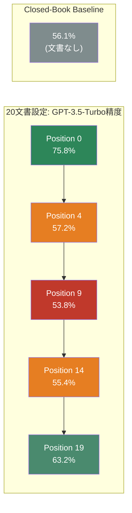

## 論文概要（Abstract）

本記事は [Lost in the Middle: How Language Models Use Long Contexts](https://arxiv.org/abs/2307.03172) の解説記事です。著者ら（Nelson F. Liu, Kevin Lin, John Hewitt, Ashwin Paranjape, Michele Bevilacqua, Fabio Petroni, Percy Liang）は、LLMが長いコンテキストを入力として受け取れるにもかかわらず、コンテキスト内の情報位置によって性能が大幅に変動することを体系的に実証した。Multi-Document QAとKey-Value Retrievalの2タスクにおいて、関連情報がコンテキストの先頭または末尾にある場合は高い性能を示すが、中間に位置する場合は性能が著しく低下する「U字型性能カーブ」を発見した。

この記事は [Zenn記事: 長いコンテキストの精度劣化を定量評価する：NIAHテストと本番モニタリング実装](https://zenn.dev/0h_n0/articles/d91b468bd34566) の深掘りです。

## 情報源

- **arXiv ID**: 2307.03172
- **URL**: [https://arxiv.org/abs/2307.03172](https://arxiv.org/abs/2307.03172)
- **著者**: Nelson F. Liu (Stanford University), Kevin Lin (UC Berkeley), John Hewitt (Stanford University) et al.
- **発表年**: 2023年（TACL 2024に採録、Volume 12, Pages 157-173）
- **分野**: cs.CL（Computation and Language）
- **コード**: [https://github.com/nelson-liu/lost-in-the-middle](https://github.com/nelson-liu/lost-in-the-middle)

## 背景と動機（Background & Motivation）

2023年時点でLLMのコンテキストウィンドウは急速に拡大していた。GPT-3.5-Turboが4K/16Kトークン、Claude-1.3が8K/100Kトークンに対応し、LongChat-13B-16Kなどの拡張コンテキストモデルも登場した。FlashAttention（Dao et al., 2022）やALiBi（Press et al., 2022）といったアルゴリズム的進歩がこの拡大を支えている。

しかし、「長いコンテキストを入力として処理できること」と「長いコンテキスト内の情報をロバストに活用できること」は本質的に異なる問題である。従来の研究ではrecency bias（直近の情報を重視する傾向）が小規模モデルで報告されていたが（Khandelwal et al., 2018）、大規模Transformerモデルにおけるprimacy bias（先頭情報を重視する傾向）との複合効果は十分に調査されていなかった。

著者らは、コンテキスト内の情報位置がモデル性能にどのような影響を与えるかを制御実験で系統的に調査することで、「コンテキスト長の拡張がそのまま実効的な情報活用に繋がるわけではない」という重要な知見を明らかにした。

## 主要な貢献（Key Contributions）

- **U字型性能カーブの発見と体系的実証**: 関連情報がコンテキストの先頭・末尾にある場合は高精度で活用されるが、中間に位置すると最大20ポイント以上精度が低下するパターンを、6モデル・2タスクにわたって一貫して確認した
- **拡張コンテキストモデルの限界の定量化**: GPT-3.5-Turbo（4K）とGPT-3.5-Turbo（16K）の位置別性能カーブがほぼ一致することを示し、コンテキストウィンドウの拡張が情報活用効率の改善に直結しないことを実証した
- **RAGパイプライン設計への実践的指針**: 検索文書数を20から50に増やしても性能改善はGPT-3.5-Turboで約1.5%にとどまること、中間位置の文書精度がClosed-Bookベースライン以下に低下するケースがあることを定量的に示し、情報配置戦略の重要性を明確にした

## 技術的詳細（Technical Details）

### Multi-Document QA実験設計

著者らの第一の実験はMulti-Document QAタスクである。NaturalQuestions-Open（Kwiatkowski et al., 2019）から、回答が段落形式である2,655件のクエリを使用した。各クエリに対して、回答を含む1件のゴールド文書と$k-1$件のdistractor文書を入力コンテキストとして構成する。distractor文書はContriever（Izacard et al., 2021）をMS-MARCOでfine-tuningした検索システムにより取得された、クエリに関連度の高いWikipediaチャンク（最大100トークン）である。

ゴールド文書の位置を先頭から末尾まで系統的に変化させ、文書総数$k$を10, 20, 30と制御することで、それぞれ約2K, 4K, 6Kトークンの入力コンテキストを生成した。

$$
\text{Accuracy}(p) = \frac{1}{|\mathcal{Q}|} \sum_{q \in \mathcal{Q}} \mathbb{1}[\text{model}(q, D_1, \ldots, D_p^*, \ldots, D_k) = a_q]
$$

ここで、$\mathcal{Q}$はクエリ集合（2,655件）、$D_p^*$は位置$p$に配置されたゴールド文書、$a_q$はクエリ$q$の正解である。

### Key-Value Retrieval実験設計

第二の実験は合成的なKey-Value Retrievalタスクである。$k$個のJSONフォーマットのキー値ペア（キー・値ともにランダム生成の128ビットUUID）を入力し、指定されたキーに対応する値の出力を求める。自然言語の意味的要素を排除し、純粋な情報検索能力を測定する設計である。

キー値ペア数を75（約4Kトークン）、140（約8Kトークン）、300（約16Kトークン）と変化させ、各条件で500例を評価した。

### U字型カーブのメカニズム分析

著者らはU字型バイアスの原因を以下の3つの観点から調査した。

**Decoder-only vs. Encoder-decoder**: Flan-UL2（encoder-decoderモデル）は訓練時最大シーケンス長（2,048トークン）以下の入力ではU字型バイアスが軽減され、ベストケースとワーストケースの差が1.9%に収まった（論文Figure 8より）。双方向エンコーダが各文書を後続文書のコンテキストで処理できるため、文書間の相対的重要度の推定が改善されると著者らは仮説を述べている。

$$
\text{Encoder-decoder:} \quad h_i = \text{BiAttn}(x_i, x_{1:n}) \quad \text{vs.} \quad \text{Decoder-only:} \quad h_i = \text{CausalAttn}(x_i, x_{1:i})
$$

Decoder-onlyモデルでは各トークンが先行トークンにのみ注意を向けるため、クエリのトークンが文書トークンを文脈化する際に参照できないことが位置バイアスの一因である可能性がある。

**Query-aware contextualization**: クエリを文書の前後両方に配置する手法では、Key-Value Retrievalタスクで劇的な改善が見られた。GPT-3.5-Turbo（16K）は300ペア条件で完全な性能を達成した（通常の最悪ケースでは45.6%）。しかしMulti-Document QAでは効果が限定的であり、自然言語の意味理解が絡むタスクでは位置バイアスの解消が困難であることが示された。

**Instruction fine-tuning**: MPT-30BとMPT-30B-Instructの比較では、instruction fine-tuningによりベストケースとワーストケースの差が約10%から約4%に縮小したが、U字型パターン自体は解消されなかった。

### 概念図: 文書位置と精度の関係



### 位置ごとの精度データ

#### GPT-3.5-Turbo: Multi-Document QA精度（論文Figure 5より）

| 文書数 | Position 0（先頭） | Position 4 | Position 9（中間） | Position 14 | 末尾 | Closed-Book |
|--------|-------------------|------------|-------------------|-------------|------|-------------|
| 10文書 | 76.8% | 61.2% | -- | -- | 62.4% (Pos 9) | 56.1% |
| 20文書 | 75.8% | 57.2% | 53.8% | 55.4% | 63.2% (Pos 19) | 56.1% |
| 30文書 | 73.4% | -- | 50.5% (Pos 9) | -- | 63.7% (Pos 29) | 56.1% |

20文書・30文書設定では、中間位置の精度がClosed-Book（56.1%）を下回る。すなわち、関連文書を中間に配置した場合、文書を一切与えない場合よりも性能が低いことを意味する。

#### Claude-1.3: Multi-Document QA精度（論文Figure 5より）

| 文書数 | Position 0 | 中間付近 | 末尾 | Closed-Book |
|--------|-----------|---------|------|-------------|
| 10文書 | 62.9% | 58.3% (Pos 4) | 59.7% (Pos 9) | 48.3% |
| 20文書 | 59.9% | 56.8% (Pos 9) | 60.1% (Pos 19) | 48.3% |
| 30文書 | 59.1% | 54.8% (Pos 9) | 59.9% (Pos 29) | 48.3% |

Claude-1.3はGPT-3.5-Turboと比較して全体の精度は低いが、U字型の振幅（先頭と中間の差）は小さい。一方、Key-Value Retrievalでは75/140/300ペアのすべての条件でほぼ完全な性能（約99%）を維持したと著者らは報告している。

## 実装のポイント（Implementation）

### エッジ配置戦略

論文の知見から、RAGパイプラインにおける情報配置の最適化が直接的に導かれる。最も関連度の高い文書をコンテキストの先頭（primacy活用）または末尾（recency活用）に配置し、関連度の低い文書を中間に配置する戦略が有効である。

```python
from dataclasses import dataclass


@dataclass
class RankedDocument:
    """検索結果の文書を表すデータクラス。

    Attributes:
        content: 文書のテキスト内容
        relevance_score: リランカーによる関連度スコア（0.0-1.0）
        source_id: 文書の識別子
    """
    content: str
    relevance_score: float
    source_id: str


def reorder_documents_edge_priority(
    documents: list[RankedDocument],
    strategy: str = "alternating",
) -> list[RankedDocument]:
    """Lost in the Middleの知見に基づき、重要文書をエッジに配置する。

    U字型バイアスを考慮し、関連度の高い文書をコンテキストの
    先頭と末尾に、関連度の低い文書を中間に配置する。

    Args:
        documents: 関連度スコア降順でソート済みの文書リスト
        strategy: 配置戦略。
            "alternating" - 先頭と末尾に交互配置（デフォルト）
            "top_first" - 上位を先頭に集中配置

    Returns:
        エッジ優先で並び替えた文書リスト

    Raises:
        ValueError: 未知のstrategyが指定された場合
    """
    if strategy not in ("alternating", "top_first"):
        raise ValueError(f"Unknown strategy: {strategy}")

    if len(documents) <= 2:
        return documents

    sorted_docs = sorted(
        documents, key=lambda d: d.relevance_score, reverse=True
    )

    if strategy == "top_first":
        # 上位半分を先頭、下位半分を末尾（逆順）に配置
        mid = len(sorted_docs) // 2
        return sorted_docs[:mid] + sorted_docs[mid:][::-1]

    # alternating: 1位->先頭, 2位->末尾, 3位->先頭側, 4位->末尾側, ...
    reordered: list[RankedDocument] = []
    head: list[RankedDocument] = []
    tail: list[RankedDocument] = []

    for i, doc in enumerate(sorted_docs):
        if i % 2 == 0:
            head.append(doc)
        else:
            tail.append(doc)

    reordered = head + tail[::-1]
    return reordered
```

### リトリーバー結果の最適配置

論文Section 5で報告された飽和効果（20文書から50文書への増加で精度改善が約1.5%にとどまる）を踏まえると、検索文書数を闇雲に増やすよりも、適切な文書数で品質の高い配置を行うことが重要である。

```python
def truncate_and_reorder(
    documents: list[RankedDocument],
    max_documents: int = 20,
    min_relevance: float = 0.3,
) -> list[RankedDocument]:
    """検索結果を論文の知見に基づいてフィルタリング・並び替える。

    Args:
        documents: 関連度スコア降順でソート済みの文書リスト
        max_documents: 最大文書数（論文のk=20飽和点に基づく）
        min_relevance: 最低関連度閾値

    Returns:
        フィルタリング・並び替え済みの文書リスト
    """
    # 関連度閾値でフィルタリング
    filtered = [d for d in documents if d.relevance_score >= min_relevance]

    # 飽和点に基づく文書数制限
    truncated = filtered[:max_documents]

    # エッジ優先配置
    return reorder_documents_edge_priority(truncated, strategy="alternating")
```

## Production Deployment Guide

### AWS実装パターン（コスト最適化重視）

Lost in the Middleの知見をRAGパイプラインに組み込む際のAWS構成を、トラフィック量別に整理する。

| 構成 | トラフィック | 主要サービス | 月額概算 |
|------|------------|------------|---------|
| Small | ~100 req/日 | Lambda + Bedrock + DynamoDB | $50-150 |
| Medium | ~1,000 req/日 | ECS Fargate + Bedrock + OpenSearch Serverless | $300-800 |
| Large | 10,000+ req/日 | EKS + Karpenter (Spot) + Bedrock + OpenSearch | $2,000-5,000 |

**Small構成の詳細**: Lambda（256MB, 30秒タイムアウト）でリクエストを処理し、Bedrockで推論を実行する。DynamoDBにクエリログとリランキング結果をキャッシュし、同一クエリの再処理を回避する。文書並び替えロジックはLambda内で実行するため追加コストは発生しない。

**Medium構成の詳細**: ECS Fargate（0.5vCPU, 1GB RAM）でアプリケーションを常駐させ、OpenSearch Serverlessでベクトル検索を実行する。リランキング後のエッジ配置をアプリケーション層で行う。

**Large構成の詳細**: EKS上でKarpenterによるSpot Instances自動スケーリングを活用し、推論コストを最大90%削減する。OpenSearchのマネージドクラスタでベクトル検索を高速化し、Bedrock Batch APIで非リアルタイム処理のコストを50%削減する。

**コスト削減テクニック**:
- Spot Instances活用: Karpenter Provisioner設定でSpot優先（On-Demand fallback）により最大90%削減
- Bedrock Batch API: 非同期処理可能なワークロードで50%削減
- Prompt Caching: 同一プロンプトプレフィックスの再利用で30-90%削減
- 文書数制限: 論文の飽和点（k=20）に基づく文書数制限でトークンコストを削減

**コスト試算の注意事項**: 上記は2026年9月時点のAWS ap-northeast-1（東京）リージョン料金に基づく概算値である。実際のコストはトラフィックパターン、リージョン、バースト使用量により変動する。最新料金はAWS料金計算ツールで確認を推奨する。

### Terraformインフラコード

#### Small構成（Serverless）

```hcl
# Lost in the Middle対策を組み込んだRAG Serverless構成
# Lambda + Bedrock + DynamoDB

terraform {
  required_version = ">= 1.9"
  required_providers {
    aws = {
      source  = "hashicorp/aws"
      version = "~> 5.60"
    }
  }
}

provider "aws" {
  region = "ap-northeast-1"
}

# IAMロール（最小権限）
resource "aws_iam_role" "rag_lambda" {
  name = "rag-litm-lambda-role"
  assume_role_policy = jsonencode({
    Version = "2012-10-17"
    Statement = [{
      Action = "sts:AssumeRole"
      Effect = "Allow"
      Principal = { Service = "lambda.amazonaws.com" }
    }]
  })
}

resource "aws_iam_role_policy" "rag_lambda" {
  name = "rag-litm-lambda-policy"
  role = aws_iam_role.rag_lambda.id
  policy = jsonencode({
    Version = "2012-10-17"
    Statement = [
      {
        Effect = "Allow"
        Action = [
          "bedrock:InvokeModel",
          "bedrock:InvokeModelWithResponseStream"
        ]
        Resource = "arn:aws:bedrock:ap-northeast-1::foundation-model/*"
      },
      {
        Effect = "Allow"
        Action = [
          "dynamodb:GetItem",
          "dynamodb:PutItem",
          "dynamodb:Query"
        ]
        Resource = aws_dynamodb_table.query_cache.arn
      },
      {
        Effect = "Allow"
        Action = [
          "logs:CreateLogGroup",
          "logs:CreateLogStream",
          "logs:PutLogEvents"
        ]
        Resource = "arn:aws:logs:*:*:*"
      }
    ]
  })
}

# DynamoDBキャッシュテーブル（On-Demandでコスト最適化）
resource "aws_dynamodb_table" "query_cache" {
  name         = "rag-litm-query-cache"
  billing_mode = "PAY_PER_REQUEST"
  hash_key     = "query_hash"

  attribute {
    name = "query_hash"
    type = "S"
  }

  # KMS暗号化
  server_side_encryption {
    enabled = true
  }

  ttl {
    attribute_name = "ttl"
    enabled        = true
  }
}

# Lambda関数
resource "aws_lambda_function" "rag_handler" {
  function_name = "rag-litm-handler"
  runtime       = "python3.12"
  handler       = "handler.lambda_handler"
  role          = aws_iam_role.rag_lambda.arn
  timeout       = 30
  memory_size   = 256

  # エッジ配置パラメータ
  environment {
    variables = {
      MAX_DOCUMENTS       = "20"   # 論文の飽和点
      REORDER_STRATEGY    = "alternating"
      MIN_RELEVANCE_SCORE = "0.3"
      DYNAMODB_TABLE      = aws_dynamodb_table.query_cache.name
    }
  }

  tracing_config {
    mode = "Active"  # X-Ray有効化
  }
}

# CloudWatchアラーム（コスト監視）
resource "aws_cloudwatch_metric_alarm" "lambda_duration" {
  alarm_name          = "rag-litm-lambda-duration-high"
  comparison_operator = "GreaterThanThreshold"
  evaluation_periods  = 3
  metric_name         = "Duration"
  namespace           = "AWS/Lambda"
  period              = 300
  statistic           = "p95"
  threshold           = 25000  # 25秒（タイムアウト30秒の83%）
  alarm_description   = "Lambda実行時間がタイムアウトに接近"

  dimensions = {
    FunctionName = aws_lambda_function.rag_handler.function_name
  }
}
```

#### Large構成（Container）

```hcl
# EKS + Karpenter + Spot Instances構成
module "eks" {
  source  = "terraform-aws-modules/eks/aws"
  version = "~> 20.24"

  cluster_name    = "rag-litm-cluster"
  cluster_version = "1.30"

  vpc_id     = module.vpc.vpc_id
  subnet_ids = module.vpc.private_subnets

  # コントロールプレーンのみ（ノードはKarpenterで管理）
  cluster_endpoint_public_access = false

  # Secrets Manager統合
  cluster_encryption_config = {
    provider_key_arn = aws_kms_key.eks.arn
    resources        = ["secrets"]
  }
}

# Karpenter Provisioner（Spot優先）
resource "kubectl_manifest" "karpenter_provisioner" {
  yaml_body = yamlencode({
    apiVersion = "karpenter.sh/v1beta1"
    kind       = "NodePool"
    metadata   = { name = "rag-litm-pool" }
    spec = {
      template = {
        spec = {
          requirements = [
            {
              key      = "karpenter.sh/capacity-type"
              operator = "In"
              values   = ["spot", "on-demand"]  # Spot優先
            },
            {
              key      = "node.kubernetes.io/instance-type"
              operator = "In"
              values   = ["m6i.xlarge", "m6i.2xlarge", "m7i.xlarge"]
            }
          ]
        }
      }
      limits = {
        cpu    = "100"
        memory = "400Gi"
      }
      disruption = {
        consolidationPolicy = "WhenUnderutilized"
      }
    }
  })
}

# AWS Budgets予算アラート
resource "aws_budgets_budget" "monthly" {
  name         = "rag-litm-monthly"
  budget_type  = "COST"
  limit_amount = "5000"
  limit_unit   = "USD"
  time_unit    = "MONTHLY"

  notification {
    comparison_operator       = "GREATER_THAN"
    threshold                 = 80
    threshold_type            = "PERCENTAGE"
    notification_type         = "ACTUAL"
    subscriber_email_addresses = ["ops-team@example.com"]
  }
}
```

### 運用・監視設定

**CloudWatch Logs Insightsクエリ: コスト異常検知**

```
fields @timestamp, @message
| filter @message like /bedrock/
| stats sum(input_tokens) as total_input, sum(output_tokens) as total_output by bin(1h)
| sort @timestamp desc
| limit 24
```

**CloudWatch Logs Insightsクエリ: レイテンシ分析**

```
fields @timestamp, duration_ms, document_count, reorder_strategy
| stats avg(duration_ms) as avg_latency,
        pct(duration_ms, 95) as p95_latency,
        pct(duration_ms, 99) as p99_latency
  by bin(1h)
| sort @timestamp desc
```

**CloudWatchアラーム設定（Python）**:

```python
import boto3


def create_bedrock_token_alarm(
    sns_topic_arn: str,
    threshold_tokens: int = 1_000_000,
) -> dict:
    """Bedrockトークン使用量のスパイク検知アラームを作成する。

    Args:
        sns_topic_arn: 通知先SNSトピックのARN
        threshold_tokens: 1時間あたりの閾値トークン数

    Returns:
        作成されたアラームのレスポンス
    """
    client = boto3.client("cloudwatch", region_name="ap-northeast-1")
    return client.put_metric_alarm(
        AlarmName="rag-litm-bedrock-token-spike",
        MetricName="InputTokenCount",
        Namespace="AWS/Bedrock",
        Statistic="Sum",
        Period=3600,
        EvaluationPeriods=1,
        Threshold=threshold_tokens,
        ComparisonOperator="GreaterThanThreshold",
        AlarmActions=[sns_topic_arn],
    )
```

**X-Rayトレーシング設定（Python）**:

```python
from aws_xray_sdk.core import xray_recorder, patch_all


def configure_xray_tracing() -> None:
    """X-Rayトレーシングを初期化し、boto3を自動計装する。"""
    xray_recorder.configure(
        service="rag-litm-service",
        sampling=True,
        context_missing="LOG_ERROR",
    )
    patch_all()  # boto3, requests等を自動計装


def trace_reorder_operation(
    document_count: int,
    strategy: str,
    duration_ms: float,
) -> None:
    """文書並び替え操作をX-Rayサブセグメントとして記録する。

    Args:
        document_count: 処理した文書数
        strategy: 使用した配置戦略
        duration_ms: 処理時間（ミリ秒）
    """
    subsegment = xray_recorder.begin_subsegment("reorder_documents")
    subsegment.put_annotation("document_count", document_count)
    subsegment.put_annotation("strategy", strategy)
    subsegment.put_metadata("duration_ms", duration_ms)
    xray_recorder.end_subsegment()
```

**Cost Explorer自動レポート（Python）**:

```python
import datetime

import boto3


def get_daily_cost_report() -> dict:
    """日次コストレポートを取得し、Bedrock/Lambdaコストを抽出する。

    Returns:
        サービス別コストの辞書
    """
    client = boto3.client("ce", region_name="us-east-1")
    today = datetime.date.today()
    yesterday = today - datetime.timedelta(days=1)

    response = client.get_cost_and_usage(
        TimePeriod={
            "Start": yesterday.isoformat(),
            "End": today.isoformat(),
        },
        Granularity="DAILY",
        Metrics=["UnblendedCost"],
        GroupBy=[{"Type": "DIMENSION", "Key": "SERVICE"}],
    )

    costs: dict[str, float] = {}
    for group in response["ResultsByTime"][0]["Groups"]:
        service = group["Keys"][0]
        amount = float(group["Metrics"]["UnblendedCost"]["Amount"])
        if amount > 0:
            costs[service] = amount

    # $100/日超過でアラート
    total = sum(costs.values())
    if total > 100:
        sns = boto3.client("sns", region_name="ap-northeast-1")
        sns.publish(
            TopicArn="arn:aws:sns:ap-northeast-1:ACCOUNT:cost-alert",
            Subject=f"RAG LitM Daily Cost Alert: ${total:.2f}",
            Message=f"Daily cost exceeded $100: ${total:.2f}\n{costs}",
        )
    return costs
```

### コスト最適化チェックリスト

**アーキテクチャ選択**:
- [ ] トラフィック量に応じた構成選択（~100 req/日: Serverless、~1,000: Hybrid、10,000+: Container）
- [ ] 文書数制限（k=20）によるトークンコスト最適化

**リソース最適化**:
- [ ] EC2/EKS: Spot Instances優先（Karpenter `capacity-type: spot`）
- [ ] Reserved Instances: 1年コミットで最大72%削減
- [ ] Savings Plans: Compute Savings Plansの検討
- [ ] Lambda: メモリサイズ最適化（256MB推奨、Power Tuningで検証）
- [ ] ECS/EKS: アイドル時スケールダウン（Karpenter consolidation）
- [ ] DynamoDB: On-Demandモード（低トラフィック時のコスト最適化）

**LLMコスト削減**:
- [ ] Bedrock Batch API: 非同期処理で50%削減
- [ ] Prompt Caching: 共通プレフィックス再利用で30-90%削減
- [ ] モデル選択ロジック: 複雑度に応じたモデル切替（Haiku/Sonnet/Opus）
- [ ] トークン数制限: MAX_DOCUMENTS=20で入力トークン上限管理
- [ ] レスポンスキャッシュ: DynamoDB TTL付きキャッシュで重複推論回避

**監視・アラート**:
- [ ] AWS Budgets: 月額予算上限設定
- [ ] CloudWatch アラーム: Bedrockトークン使用量・Lambda実行時間
- [ ] Cost Anomaly Detection: 異常コスト自動検知
- [ ] 日次コストレポート: Cost Explorer APIで自動取得・SNS通知

**リソース管理**:
- [ ] 未使用リソース削除: 定期的なリソース棚卸し
- [ ] タグ戦略: `project:rag-litm`タグで全リソースコスト追跡
- [ ] ライフサイクルポリシー: DynamoDB TTL、S3ライフサイクルルール
- [ ] 開発環境夜間停止: EKSノード0台スケールダウン
- [ ] ログ保持期間: CloudWatch Logs保持期間を30日に制限

## 実験結果（Results）

### モデル別精度テーブル

論文Table 1に基づく各モデルのベースライン・Oracle性能を以下に示す。

| モデル | コンテキスト長 | Closed-Book | Oracle | 差分 |
|--------|-------------|-------------|--------|------|
| GPT-3.5-Turbo | 4,096 | 56.1% | 88.3% | +32.2pt |
| GPT-3.5-Turbo (16K) | 16,384 | 56.0% | 88.6% | +32.6pt |
| Claude-1.3 | 8,192 | 48.3% | 76.1% | +27.8pt |
| Claude-1.3 (100K) | 100,000 | 48.2% | 76.4% | +28.2pt |
| LongChat-13B (16K) | 16,384 | 35.0% | 83.4% | +48.4pt |
| MPT-30B-Instruct | 8,192 | 31.5% | 81.9% | +50.4pt |

GPT-3.5-TurboとGPT-3.5-Turbo（16K）のClosed-Book性能（56.1% vs. 56.0%）およびOracle性能（88.3% vs. 88.6%）がほぼ同一であることが確認できる。コンテキストウィンドウの拡張はこれらの基本性能に影響を与えていない。

### 位置別精度データ

20文書設定における主要モデルの位置別精度をまとめる（論文Figure 5より）。

| 指標 | GPT-3.5-Turbo | Claude-1.3 | LongChat-13B | MPT-30B-Instruct |
|------|--------------|-----------|-------------|-----------------|
| 先頭（最良） | 75.8% | 59.9% | 68.6% | ~63% |
| 中間（最悪） | 53.8% | 55.9% | 55.3% | ~55% |
| 末尾 | 63.2% | 60.1% | 55.0% | ~62% |
| 性能低下幅 | 22.0pt | 4.2pt | 13.3pt | ~8pt |

GPT-3.5-Turboは先頭と中間の性能差が22ポイントと最大であり、かつ中間位置の精度（53.8%）がClosed-Book（56.1%）を下回る。著者らはこの現象について「中間位置の無関係文書がモデルの注意を分散させ、パラメトリック記憶からの正しい回答を阻害している可能性がある」と考察している。

### モデルサイズの影響

著者らはAppendix EでLlama-2の7B, 13B, 70Bモデルを用いた追加実験を報告している。

- **7Bモデル**: recency biasのみを示し、primacy biasは観察されなかった
- **13B以上**: primacy biasとrecency biasの両方が出現し、典型的なU字型カーブが形成された

著者らは、先行研究（Khandelwal et al., 2018; Sun et al., 2021）がprimacy biasを報告しなかったのは、研究対象のモデルが1Bパラメータ未満と小規模であったためではないかと推測している。この結果は、モデルスケールの拡大に伴い新たなバイアスパターンが出現する可能性を示唆する。

## 実運用への応用（Practical Applications）

### RAGパイプラインでの情報配置最適化

本論文の知見は、RAGシステム設計において以下の3つの実践的指針を提供する。

**1. リランキング後のエッジ配置**: 検索された文書をrerankerでスコアリングし、最も関連度の高い文書をコンテキストの先頭（または末尾）に配置する。著者らも結論部で「effective reranking of retrieved documents（pushing relevant information closer to the start of the input context）」を改善策として挙げている。

**2. 文書数の適切な制限**: 検索文書数を20から50に増やしても、GPT-3.5-Turboで約1.5%、Claude-1.3で約1%の改善にとどまることが論文Figure 11で報告されている。レイテンシとトークンコストの増加を考慮すると、k=20程度が実用的な上限である。

**3. チャンク分割と反復処理**: 長いコンテキストを複数の短いチャンクに分割し、各チャンクに対して推論を行った後に結果を統合するmap-reduceアプローチにより、中間部バイアスの影響を軽減できる。ただし、この手法はレイテンシとコストが増加するため、精度要件とのトレードオフを検討する必要がある。

Zenn記事で解説されているNIAHテストは、本論文のKey-Value Retrievalタスクと同様に、コンテキスト内の特定位置にある情報の検索能力を評価する手法である。本番環境でのモニタリングにおいて、位置別の精度を継続的に計測することで、モデル更新やプロンプト変更がU字型バイアスに与える影響を定量的に把握できる。

## 関連研究（Related Work）

- **Found in the Middle（Ratner et al., 2024, ACL Findings）**: 位置注意バイアスをキャリブレーションすることで「calibrated attention」を生成し、位置に依存しない文書関連度推定を実現した。RAGタスクで既存手法を最大15ポイント上回ると報告されている（arXiv:2406.16008）
- **RULER（Hsieh et al., 2024）**: Lost in the Middleの位置スイープを拡張し、検索・変数追跡・集約・マルチホップの4カテゴリにわたる合成ベンチマークを提案。コンテキスト長とタスク複雑度の両方を制御可能な評価フレームワークを構築した
- **Never Lost in the Middle（He et al., 2024, ACL）**: Position-Agnostic Multi-step QA（PAM QA）による位置非依存の分解訓練を提案し、シャッフル設定で13.7%、パッセージ検索タスクで21.5%の絶対精度改善を達成したと報告されている（arXiv:2311.09198）
- **U-NIAH（2025）**: LLMとRAGの統合的なNeedle-in-a-Haystack評価フレームワーク。より複雑なneedleタイプ、柔軟な挿入方法、distractorを含む背景テキスト、RAG固有の設定を組み込んだ評価を実現した（arXiv:2503.00353）

## まとめと今後の展望

本論文は、LLMが長いコンテキスト内の情報を位置に依存して不均一に活用していることを、制御実験により体系的に実証した。U字型性能カーブ（primacy biasとrecency biasの複合効果）は、オープンモデル・クローズドモデルの双方で、Multi-Document QAとKey-Value Retrievalの2タスクにわたって一貫して観察された。

実務的には、RAGパイプラインにおけるリランキング後のエッジ配置戦略、検索文書数の適切な制限（k=20付近が飽和点）、NIAHテストによる位置別精度の継続モニタリングが直接的に応用可能である。2023年以降、Found in the MiddleやNever Lost in the Middleなどの後続研究により位置バイアスの軽減手法が提案されているが、本論文が提示した「コンテキスト長の拡張は情報活用効率の改善を保証しない」という知見は、2026年現在のモデル評価においても依然として重要な基準であり続けている。

## 参考文献

- **arXiv**: [https://arxiv.org/abs/2307.03172](https://arxiv.org/abs/2307.03172)
- **TACL掲載版**: [https://aclanthology.org/2024.tacl-1.9/](https://aclanthology.org/2024.tacl-1.9/)
- **Code**: [https://github.com/nelson-liu/lost-in-the-middle](https://github.com/nelson-liu/lost-in-the-middle)
- **Related Zenn article**: [https://zenn.dev/0h_n0/articles/d91b468bd34566](https://zenn.dev/0h_n0/articles/d91b468bd34566)
