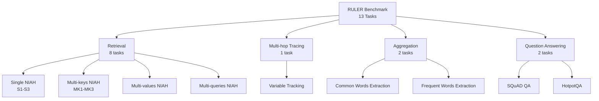

## 論文概要（Abstract）

本記事は [RULER: What's the Real Context Size of Your Long-Context Language Models?](https://arxiv.org/abs/2404.06654)（arXiv: 2404.06654、2024年4月公開、8月改訂）の解説記事です。

RULERは、長コンテキストLLMの能力を4カテゴリ13タスクの合成ベンチマークで評価するフレームワークである。著者らは17モデルを4K-128Kトークンの範囲で評価し、公称コンテキスト長32K以上を謳うモデルの約半数が32Kで既に性能劣化を起こすことを定量的に示した。バニラNeedle-in-a-Haystack（NIAH）では検出できない7つの失敗モードを特定し、Gemini-1.5-Proのみが128Kを超える実効コンテキストサイズを維持したと報告されている。

この記事は [Zenn記事: 長いコンテキストの精度劣化を定量評価する：NIAHテストと本番モニタリング実装](https://zenn.dev/0h_n0/articles/d91b468bd34566) の深掘りです。

## 情報源

- **arXiv ID**: 2404.06654
- **URL**: [https://arxiv.org/abs/2404.06654](https://arxiv.org/abs/2404.06654)
- **著者**: Cheng-Ping Hsieh, Simeng Sun, Samuel Kriman et al.（NVIDIA）
- **発表年**: 2024（4月初版、8月改訂版v2）
- **分野**: cs.CL（計算言語学）
- **コード**: [https://github.com/NVIDIA/RULER](https://github.com/NVIDIA/RULER)

## 背景と動機（Background & Motivation）

長コンテキストLLMの評価において、バニラNIAH（Needle-in-a-Haystack）テストが広く用いられている。このテストは長い文脈中に埋め込まれた単一の情報を正しく取得できるかを測定するものであるが、著者らは以下の限界を指摘している。

第一に、バニラNIAHは単一の短い事実の検索のみを測定するため、実際のLLM利用で求められるマルチホップ推論、情報の集約、長文QAといった複雑なタスクの能力を評価できない。第二に、ほぼ全てのモデルがバニラNIAHでは公称コンテキスト長までほぼ完璧な性能を達成しており、モデル間の差異が見えない。著者らの実験でも、RULER全体で大幅に劣化するモデルがバニラNIAHでは100%近い正答率を示している（論文Table 1より）。

この問題を解決するため、著者らは検索・追跡・集約・QAの4カテゴリにまたがる13タスクの合成ベンチマークRULERを設計し、タスクの複雑度やコンテキスト長を柔軟に制御できる評価フレームワークを構築した。

## 主要な貢献（Key Contributions）

- **多角的評価フレームワーク**: 検索、マルチホップ追跡、集約、QAの4カテゴリ13タスクからなる合成ベンチマークを設計し、バニラNIAHでは検出できない能力不足を可視化
- **実効コンテキストサイズの定量化**: Llama2-7Bの4K時性能（85.6%）をベースラインとし、各モデルの実効コンテキストサイズ（性能がベースラインを下回らない最大長）を定義・測定
- **7つの失敗モードの特定**: Yi-34Bを対象としたタスクパラメータ拡張実験により、ディストラクタ感受性（256Kで約40ポイント低下）、コンテキストコピー傾向（128Kで80%超）など7つの系統的失敗パターンを同定

## 技術的詳細（Technical Details）

### 4カテゴリ13タスクの構成

RULERは以下の4カテゴリに分類される13のタスクで構成されている。各タスクは合成データで生成されるため、コンテキスト長やタスク難易度を自由に制御できる。



各タスクの詳細を以下に示す。

| カテゴリ | タスク | 内容 | パラメータ例 |
|---|---|---|---|
| **Retrieval** | S-NIAH (S1-S3) | 単一キーバリューペアの検索。needle型（word-number / word-UUID）とhaystack型（反復文 / エッセイ）の組み合わせ | needle型 x haystack型で3バリアント |
| **Retrieval** | MK-NIAH (MK1-MK3) | 複数のディストラクタneedleが存在する中で正しいキーの値を検索 | ディストラクタ数: 1-3本 |
| **Retrieval** | MV-NIAH | 1つのキーに対し複数の値が紐づく場合に全値を検索 | 値数: 4 |
| **Retrieval** | MQ-NIAH | 複数の独立したキーバリューペアを同時に検索 | クエリ数: 4 |
| **Multi-hop** | Variable Tracking | 変数の代入連鎖（X1=val, X2=X1, X3=X2...）を追跡し、元の値を持つ全変数名を回答 | 1チェーン、4ホップ、計5変数 |
| **Aggregation** | CWE | 単語リストから出現頻度上位10語を抽出 | 共通語: 30回出現、非共通語: 3回出現 |
| **Aggregation** | FWE | Zeta分布に従う頻度の単語リストから上位3語を抽出 | $\alpha = 2.0$ |
| **QA** | SQuAD QA | SQuADデータセットのコンテキストにディストラクタ文書を挿入した単一ホップQA | ディストラクタ数はコンテキスト長に比例 |
| **QA** | HotpotQA | HotpotQAデータセットにディストラクタ文書を挿入したマルチホップQA | ディストラクタ数はコンテキスト長に比例 |

バニラNIAHはS-NIAHの最も単純なバリアント（word-number needle + repeat haystack）に相当し、RULERはこれを多軸に拡張した位置づけである。

### 実効コンテキストサイズの定義

著者らは「実効コンテキストサイズ（Effective Context Size）」を以下のように定義している。

$$
L_{\text{eff}}(M) = \max \{ L \mid \text{Avg}_{13}(M, L) \geq \text{Avg}_{13}(\text{Llama2-7B}, 4\text{K}) \}
$$

ここで、
- $L_{\text{eff}}(M)$: モデル$M$の実効コンテキストサイズ
- $\text{Avg}_{13}(M, L)$: モデル$M$のコンテキスト長$L$における13タスク平均スコア
- $\text{Avg}_{13}(\text{Llama2-7B}, 4\text{K})$: Llama2-7B（チャットモデル）の4Kトークンにおける13タスク平均スコア = **85.6%**

つまり、Llama2-7Bが4Kトークンで達成するベースライン性能を各モデルが維持できる最大コンテキスト長を実効サイズとする。公称128Kのモデルでも実効サイズが32Kや16Kにとどまるケースが多数報告されている。

### Zeta分布を用いたFWEタスク

Frequent Words Extraction（FWE）タスクでは、単語の出現頻度にZeta分布（Zipf分布の離散版）を用いている。$k$番目にランクされた単語の出現頻度$f(k)$は以下の式で決定される。

$$
f(k) = \frac{k^{-\alpha} \cdot N}{\zeta(\alpha)}
$$

ここで、
- $k$: 単語の頻度ランク（1が最高頻度）
- $\alpha$: 分布の形状パラメータ（論文では$\alpha = 2.0$を使用）
- $N$: コンテキスト中の総単語数（コンテキスト長に依存）
- $\zeta(\alpha) = \sum_{n=1}^{\infty} n^{-\alpha}$: リーマンゼータ関数

$\alpha = 2.0$では上位ランクの単語に頻度が集中し、ランクが下がると急激に頻度が減少する。さらに著者らは、最高頻度の単語をノイズ語（集約不要な語）に設定しており、単純な頻度カウントでは正解できない設計となっている。この仕組みにより、モデルが長いコンテキスト全体にわたる正確な集約能力を持つかを評価できる。

## 実装のポイント（Implementation）

### 合成ベンチマーク設計のコツ

RULERの設計から得られる合成ベンチマーク構築の実践的知見を以下にまとめる。

1. **パラメータの段階的制御**: needle型、ディストラクタ数、ホップ数、クエリ数をパラメータ化し、タスク複雑度を連続的に変化させることで、モデルの限界点を精密に特定できる
2. **ベースラインの設定**: Llama2-7Bの4K性能のような客観的閾値を設けることで、実効サイズを定量比較可能にしている
3. **needle型の多様化**: word-number型（簡単）とword-UUID型（32桁の16進文字列、難しい）の両方を用いることで、モデルの検索ロバスト性を評価できる

### vLLM推論設定

著者らは推論にvLLMを使用し、以下の設定で評価を実施している。

```python
# vLLM推論設定（論文の実験環境に基づく）
from vllm import LLM, SamplingParams

llm = LLM(
    model="model_path",
    dtype="bfloat16",              # BFloat16精度
    tensor_parallel_size=8,        # 8x NVIDIA A100 GPU
    max_model_len=131072,          # 最大128Kトークン
    trust_remote_code=True,
)

sampling_params = SamplingParams(
    temperature=0.0,               # greedy decoding
    max_tokens=512,                # 最大出力トークン数
)

# 各タスク・各コンテキスト長で500サンプルを評価
results = llm.generate(prompts, sampling_params)
```

**実装上の注意点**: (1) 128Kトークンの推論には8x A100 GPUが必要（KVキャッシュのメモリ消費が支配的）、(2) greedy decodingを使用することで再現性を確保、(3) チャットテンプレートはモデルごとに適切に設定する必要がある、(4) 評価スクリプトとタスク生成コードは[NVIDIA/RULER](https://github.com/NVIDIA/RULER)リポジトリで公開されている。

## Production Deployment Guide

RULERの知見を活用した長コンテキストLLM評価パイプラインのプロダクション運用を想定する。以下のコスト試算は2026年9月時点のAWS ap-northeast-1（東京リージョン）料金に基づく概算値であり、実際のコストはトラフィックパターン、リージョン、バースト使用量により変動する。

### AWS実装パターン（コスト最適化重視）

| 構成 | トラフィック | アーキテクチャ | 月額概算 |
|---|---|---|---|
| **Small** | ~100 eval/日 | Lambda + Bedrock (Claude) | $50-150 |
| **Medium** | ~1,000 eval/日 | ECS Fargate + Bedrock Batch | $300-800 |
| **Large** | 10,000+ eval/日 | EKS + vLLM on Spot GPU | $2,000-5,000 |

**Small構成**: Lambda関数でRULERタスクを合成生成し、Bedrock APIで推論・評価を実行。DynamoDBに評価結果を記録。月額内訳: Lambda $5 + Bedrock $30-120（トークン量依存） + DynamoDB $5 + CloudWatch $5。

**Medium構成**: ECS Fargate上でバッチ評価パイプラインを実行。Bedrock Batch APIで50%コスト削減。Step Functionsでワークフロー管理。S3にタスクデータと結果を保存。

**Large構成**: EKS上にvLLMサーバーをデプロイし、自社モデルの長コンテキスト性能を継続的に評価。Karpenter + Spot GPU（g5.48xlarge, A10G x 8）で推論コストを最大70%削減。

**コスト削減テクニック**: Spot Instances（最大70%削減）、Bedrock Batch API（50%削減）、Prompt Caching（同一テンプレート部分のキャッシュで30-90%削減）、評価結果キャッシュ（同一モデル・同一タスクの再評価回避）。

### Terraformインフラコード

**Small構成（Serverless）** -- 主要リソースの抜粋:

```hcl
resource "aws_lambda_function" "ruler_evaluator" {
  function_name = "ruler-eval-pipeline"
  runtime       = "python3.12"
  handler       = "handler.evaluate"
  memory_size   = 1024
  timeout       = 900  # 15分（長コンテキスト評価は時間がかかる）

  environment {
    variables = {
      BEDROCK_MODEL_ID = "anthropic.claude-sonnet-4-20250514"
      DYNAMODB_TABLE   = aws_dynamodb_table.eval_results.name
      MAX_CONTEXT_LEN  = "131072"
    }
  }
}

resource "aws_dynamodb_table" "eval_results" {
  name         = "ruler-eval-results"
  billing_mode = "PAY_PER_REQUEST"  # On-Demand: 低トラフィック最適
  hash_key     = "model_id"
  range_key    = "eval_timestamp"

  attribute {
    name = "model_id"
    type = "S"
  }
  attribute {
    name = "eval_timestamp"
    type = "S"
  }

  server_side_encryption { enabled = true }  # KMS暗号化
}

resource "aws_iam_role" "lambda_exec" {
  name = "ruler-eval-lambda-role"
  assume_role_policy = jsonencode({
    Version = "2012-10-17"
    Statement = [{ Effect = "Allow", Principal = { Service = "lambda.amazonaws.com" }
                    Action = "sts:AssumeRole" }]
  })
}

resource "aws_iam_role_policy" "bedrock_invoke" {
  name = "bedrock-invoke"
  role = aws_iam_role.lambda_exec.id
  policy = jsonencode({
    Version = "2012-10-17"
    Statement = [{ Effect = "Allow", Action = ["bedrock:InvokeModel"]
                    Resource = "arn:aws:bedrock:ap-northeast-1::foundation-model/*" }]
  })
}
```

**Large構成（EKS + vLLM）** -- Spot GPU自動スケーリングの抜粋:

```hcl
module "eks" {
  source  = "terraform-aws-modules/eks/aws"
  version = "~> 20.24"
  cluster_name    = "ruler-eval-cluster"
  cluster_version = "1.31"
  cluster_endpoint_public_access = false
}

resource "kubectl_manifest" "karpenter_nodepool" {
  yaml_body = yamlencode({
    apiVersion = "karpenter.sh/v1", kind = "NodePool"
    metadata   = { name = "gpu-spot-eval" }
    spec = {
      template = { spec = {
        requirements = [
          { key = "karpenter.sh/capacity-type", operator = "In", values = ["spot", "on-demand"] },
          { key = "node.kubernetes.io/instance-type", operator = "In"
            values = ["g5.12xlarge", "g5.48xlarge"] },
        ]
      } }
      limits     = { cpu = "128", "nvidia.com/gpu" = "16" }
      disruption = { consolidationPolicy = "WhenEmptyOrUnderutilized", consolidateAfter = "120s" }
    }
  })
}
```

### 運用・監視設定

**CloudWatch Logs Insights: 評価レイテンシ分析**:

```
fields @timestamp, model_id, context_length, task_name, latency_ms
| filter task_name like /niah|vt|cwe|fwe|squad|hotpot/
| stats avg(latency_ms) as avg_ms,
    percentile(latency_ms, 95) as p95_ms,
    percentile(latency_ms, 99) as p99_ms
  by model_id, context_length
| sort context_length asc
```

**X-Ray + Cost Explorer監視（Python）**:

```python
from aws_xray_sdk.core import xray_recorder, patch_all
import boto3, json
from datetime import datetime, timedelta

patch_all()  # boto3自動計装
xray_recorder.configure(service="ruler-eval-service")

def evaluate_with_tracing(
    model_id: str, task: str, context_length: int, prompt: str
) -> dict:
    """X-Rayトレーシング付きRULER評価"""
    segment = xray_recorder.begin_subsegment("ruler_evaluation")
    segment.put_annotation("model_id", model_id)
    segment.put_annotation("task", task)
    segment.put_metadata("context_length", context_length)
    try:
        response = boto3.client("bedrock-runtime").invoke_model(
            modelId=model_id, contentType="application/json",
            body=json.dumps({"prompt": prompt, "max_tokens": 512, "temperature": 0.0}),
        )
        return json.loads(response["body"].read())
    finally:
        xray_recorder.end_subsegment()

def daily_cost_report() -> None:
    """日次コストレポート。$100/日超過でSNS通知"""
    end = datetime.utcnow().strftime("%Y-%m-%d")
    start = (datetime.utcnow() - timedelta(days=1)).strftime("%Y-%m-%d")
    resp = boto3.client("ce", region_name="us-east-1").get_cost_and_usage(
        TimePeriod={"Start": start, "End": end}, Granularity="DAILY",
        Metrics=["BlendedCost"],
        Filter={"Tags": {"Key": "Project", "Values": ["ruler-eval"]}},
        GroupBy=[{"Type": "DIMENSION", "Key": "SERVICE"}],
    )
    total = sum(
        float(g["Metrics"]["BlendedCost"]["Amount"])
        for r in resp["ResultsByTime"] for g in r["Groups"]
    )
    if total > 100.0:
        boto3.client("sns", region_name="ap-northeast-1").publish(
            TopicArn="arn:aws:sns:ap-northeast-1:123456789012:cost-alerts",
            Subject=f"RULER Eval Cost: ${total:.2f}",
            Message=f"日次コスト$100超過: ${total:.2f}",
        )
```

### コスト最適化チェックリスト

**アーキテクチャ選択**:
- [ ] トラフィック量に応じた構成選択（~100: Serverless、~1000: Fargate、10000+: EKS）
- [ ] 評価頻度に基づくバッチ実行戦略（CI/CDトリガー vs 定期実行）
- [ ] Bedrock vs 自前vLLMの費用対効果比較

**リソース最適化**:
- [ ] GPU Spot Instances優先（g5.12xlarge Spot: 最大70%削減）
- [ ] Reserved Instances: 1年コミットで常時評価環境のGPUコスト削減
- [ ] Savings Plans: Compute Savings Plansで柔軟な割引適用
- [ ] Lambda: メモリサイズ最適化（タスク生成は512MB、API呼び出しは1024MB）
- [ ] Karpenter: Spot中断時の自動フォールバックとアイドル時consolidation

**LLMコスト削減**:
- [ ] Bedrock Batch API使用（非リアルタイム評価で50%削減）
- [ ] Prompt Caching有効化（RULERタスクテンプレートの共通部分キャッシュ）
- [ ] 段階的評価: 4K-32Kで失敗したモデルは64K-128K評価をスキップ
- [ ] 出力トークン制限: タスク特性に応じたmax_tokens最適化

**監視・アラート**:
- [ ] AWS Budgets: 月次予算アラート（80%/100%閾値）
- [ ] CloudWatch Alarm: Bedrock ThrottlingException、Lambda Duration異常検知
- [ ] Cost Anomaly Detection: 機械学習ベースの異常コスト検知
- [ ] 日次コストレポート: Cost Explorer APIで自動取得・SNS通知
- [ ] X-Ray: 評価パイプライン全体のレイテンシとボトルネック特定

**リソース管理**:
- [ ] 未使用EKSノード: 評価終了後のGPUノード自動停止
- [ ] タグ戦略: Project/Environment/Model/Taskタグを全リソースに付与
- [ ] S3ライフサイクル: 古い評価データの自動アーカイブ（90日でGlacier）
- [ ] 開発環境夜間停止: GPU Endpointの業務時間外自動停止
- [ ] CloudWatch Logs保持期間: 90日でexpire設定

## 実験結果（Results）

### モデル比較: 公称コンテキスト長 vs 実効コンテキストサイズ

著者らは17のアラインメント済みモデルを4K-128Kの範囲で評価している。以下に主要モデルの結果を示す（論文Table 3より）。

| モデル | 公称長 | 実効長 | 4K | 8K | 16K | 32K | 64K | 128K | 平均 |
|---|---|---|---|---|---|---|---|---|---|
| **Gemini-1.5-Pro** | 1M | >128K | 96.7 | 95.8 | 96.0 | 95.9 | 95.9 | 94.4 | **95.8** |
| **GPT-4-1106** | 128K | 64K | 96.6 | 96.3 | 95.2 | 93.2 | 87.0 | 81.2 | **91.6** |
| **GLM4-9B** | 1M | 64K | 94.7 | 92.8 | 92.1 | 89.9 | 86.7 | 83.1 | **89.9** |
| **Llama3.1-70B** | 128K | 64K | 96.5 | 95.8 | 95.4 | 94.8 | 88.4 | 66.6 | **89.6** |
| **Llama3.1-8B** | 128K | 32K | 95.5 | 93.8 | 91.6 | 87.4 | 84.7 | 77.0 | **88.3** |
| **Yi-34B** | 200K | 32K | 93.3 | 92.2 | 91.3 | 87.5 | 83.2 | 77.3 | **87.5** |
| **Qwen2-72B** | 128K | 32K | 96.9 | 96.1 | 94.9 | 94.1 | 79.8 | 53.7 | **85.9** |
| **Mixtral-8x22B** | 64K | 32K | 95.6 | 94.9 | 93.4 | 90.9 | 84.7 | 31.7 | **81.9** |
| **Mistral-7B** | 32K | 16K | 93.6 | 91.2 | 87.2 | 75.4 | 49.0 | 13.8 | **68.4** |
| **LWM-7B** | 1M | <4K | 82.3 | 78.4 | 73.7 | 69.1 | 68.1 | 65.0 | **72.8** |
| **Together-7B** | 32K | 4K | 88.2 | 81.1 | 69.4 | 63.0 | 0.0 | 0.0 | **50.3** |
| **LongAlpaca-13B** | 32K | <4K | 60.6 | 57.0 | 56.6 | 43.6 | 0.0 | 0.0 | **36.3** |

ベースライン閾値: Llama2-7B 4K = **85.6%**

この結果から、公称コンテキスト長と実効コンテキストサイズの間に大きな乖離があることが明らかとなっている。公称128Kを謳うモデルの多くが実効32K-64Kにとどまり、Gemini-1.5-Proのみが128K以上の実効サイズを維持している。特にQwen2-72Bは4Kで96.9%とトップクラスだが、128Kでは53.7%まで急落する点が注目に値する。

### 7つの失敗モード

著者らはYi-34Bを対象にタスクパラメータを拡張した詳細分析を行い、以下の7つの系統的失敗モードを特定している。

**1. Needle型に対する非ロバスト性**: word-number型ではほぼ完璧な性能を示すが、word-UUID型（32桁の16進文字列）では128K以上で大幅に劣化する。モデルは短い事実情報の検索には対応できるが、長い文字列の正確な検索が困難であることを示している。

**2. ディストラクタ感受性**: ディストラクタneedleの増加に伴い性能が急激に低下する。特に256Kトークンでディストラクタをコンテキスト全体に配置した場合、約40ポイントの性能低下が報告されている（論文Figure 4より）。ターゲットneedleがディストラクタと同じ分布に属する場合、精密な位置特定が困難になる。

**3. 不完全な情報検索**: 複数クエリの同時検索（MQ-NIAH）でクエリ数を1から8に増加させると約15ポイントの性能劣化が発生する。複数値の検索（MV-NIAH）では、全値を返す代わりに重複した値を出力する傾向がある。

**4. コンテキストコピー傾向**: Common Words Extraction（CWE）タスクにおいて、128Kトークンではモデル出力の80%以上がone-shotプロンプト例の文字列をそのままコピーしたものであった。短いコンテキストではこの現象は発生せず、長コンテキスト特有の失敗モードである。

**5. コンテキスト内追跡の不安定性**: Variable Tracking（VT）タスクで、チェーン数とホップ数の両方が性能劣化に寄与する。コンテキスト長の増加に伴い、変数代入の連鎖追跡が一貫して不安定になる。

**6. 集約精度の低下**: FWEタスクで2つの失敗パターンが観察されている。(1) 不正確なパラメトリック知識の使用（コンテキストを無視して事前学習知識で回答）、(2) 集約自体の不正確さ（頻度カウントの誤り）。Zeta分布パラメータ$\alpha$の減少に伴い性能が劣化する。

**7. 長コンテキストQAにおけるハルシネーション**: ディストラクタ段落の増加に伴い、QAタスクの性能がコンテキストなしのベースラインに近づく。モデルはコンテキスト情報への依存度を低下させ、ハルシネーションに基づく回答を生成する傾向を示す。

### 訓練コンテキスト長の影響

著者らはLWMモデルファミリー（7Bパラメータ固定、訓練コンテキスト長を128K-1Mで変化）を用いた分析を行っている。

- LWM-128Kは256Kで急激な性能低下を示す（訓練長を超える外挿の失敗）
- LWM-1Mは128Kで約85%、256Kで約75%の性能を維持
- 訓練コンテキスト長の対数スケールに対してほぼ線形に性能が劣化する
- ただしLWM-1MがLWM-512Kに対して常に優位というわけではなく、長い系列ではランキングが逆転する場合がある

この結果は、訓練コンテキスト長を単純に増やすことが性能改善を保証しないことを示唆している。

### モデルサイズの影響

Yiモデルファミリー（訓練コンテキスト200K固定、サイズを6B-34Bで変化）の分析では、以下が報告されている。

- Yi-34Bは4Kで93.3%、Yi-6Bは4Kで大幅に低い性能
- 34Bモデルは6Bモデルに対し、絶対性能と相対的な劣化率の両方で優位
- モデルサイズの増加は長コンテキスト性能の維持に重要な要因であることが示されている

### 非Transformerアーキテクチャの結果

RWKV-v5（7B）とMamba（2.8B）について、著者らは以下のように報告している。両モデルとも、コンテキストサイズを8Kに拡張した時点で大幅な劣化を示し、4KにおいてもTransformerベースラインのLlama2-7Bを大きく下回る。線形アテンション系アーキテクチャは、長コンテキストの情報検索・追跡・集約タスクにおいて現状ではTransformerに劣ることが示唆されている。

## 実運用への応用（Practical Applications）

RULERの知見は、長コンテキストLLMを本番システムで運用する際の実践的な指針を提供する。Zenn記事で解説されているNIAHテストと本番モニタリングの実装を補完する形で、以下の応用が考えられる。

**モデル選定指針**: 公称コンテキスト長ではなく実効コンテキストサイズに基づいてモデルを選定すべきである。例えば128Kの入力が必要なRAGシステムでは、RULERの結果からGemini-1.5-ProまたはGLM4-9Bが有力な候補となる。Qwen2-72Bは4Kでの性能は最高だが、128Kでは急激に劣化するため長コンテキスト用途には不向きである。

**失敗モード対応**: ディストラクタ感受性（失敗モード2）はRAGシステムで特に深刻である。検索結果に無関係な文書が混入した場合、モデルの回答精度が大幅に低下するため、リトリーバー側での精度向上とチャンクサイズの最適化が重要となる。コンテキストコピー傾向（失敗モード4）は、few-shotプロンプトの設計時に注意が必要であり、長コンテキストではzero-shotの方が安定する場合がある。

**継続的品質モニタリング**: RULERのタスク設計を参考に、本番環境でカナリアタスク（合成データによる品質チェック）を定期的に実行することで、モデル更新やAPIバージョン変更に伴う長コンテキスト性能の劣化を早期検出できる。

## 関連研究（Related Work）

- **NIAH (Kamradt, 2023)**: 単一needle検索による長コンテキスト評価の先駆。RULERはこれを4カテゴリ13タスクに拡張し、バニラNIAHでは検出できない失敗モードを可視化
- **LongBench (Bai et al., 2023)**: 自然言語タスクベースの長コンテキストベンチマーク。RULERは合成データによりコンテキスト長を自由に制御できる点で差別化
- **L-Eval (An et al., 2023)**: 長文要約・QAに特化した評価セット。RULERは検索・追跡・集約を含むより多角的な評価を提供
- **InfiniteBench (Zhang et al., 2024)**: 100K+トークンの超長文評価。RULERはタスクパラメータの制御性に優れ、失敗モード分析が可能

## まとめと今後の展望

RULERは、バニラNIAHを超える13タスクの合成ベンチマークにより、長コンテキストLLMの実効サイズと失敗モードを定量的に明らかにした。公称32K以上を謳うモデルの約半数が32Kで性能劣化を起こし、128K以上で実効性能を維持できるのはGemini-1.5-Proのみであった。7つの失敗モード（ディストラクタ感受性、コンテキストコピー、集約失敗など）は、長コンテキストLLMの本番運用におけるリスク評価に直結する知見である。

今後の展望として、著者らが示唆するように、(1) 長コンテキスト学習手法の改善（訓練長の単純増加では不十分）、(2) 非Transformerアーキテクチャの長コンテキスト性能向上、(3) タスク複雑度とコンテキスト長の交互作用の更なる分析が重要な研究方向と考えられる。RULERの合成ベンチマーク設計手法自体も、新しいモデルの長コンテキスト能力評価に継続的に活用できるフレームワークである。

## 参考文献

- **arXiv**: [https://arxiv.org/abs/2404.06654](https://arxiv.org/abs/2404.06654)
- **Code**: [https://github.com/NVIDIA/RULER](https://github.com/NVIDIA/RULER)
- **Related Zenn article**: [https://zenn.dev/0h_n0/articles/d91b468bd34566](https://zenn.dev/0h_n0/articles/d91b468bd34566)
