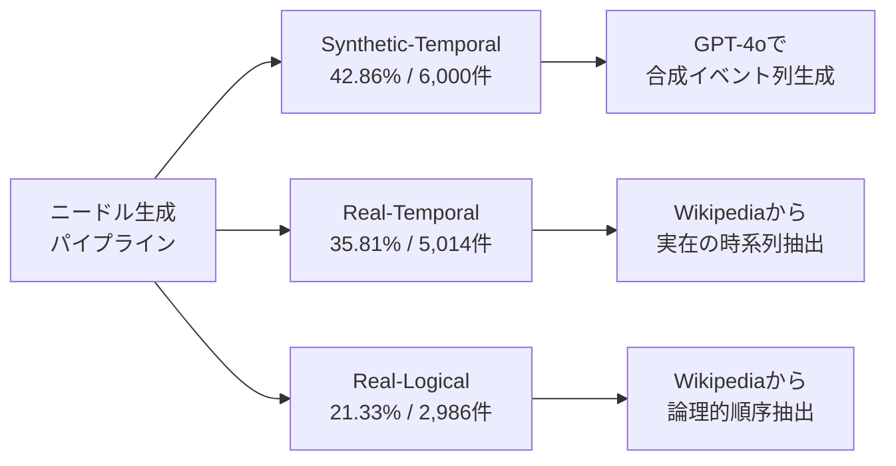

## 論文概要（Abstract）

本記事は [Sequential-NIAH: A Needle-In-A-Haystack Benchmark for Extracting Sequential Needles from Long Contexts](https://arxiv.org/abs/2504.04713)（arXiv: 2504.04713、2025年4月公開、EMNLP 2025採択）の解説記事です。

本論文は、従来のバニラNeedle-In-A-Haystack（NIAH）テストが「単一のニードルを見つける」タスクに限定されている問題を指摘し、長文コンテキストから**複数の順序付き情報（3-15個のニードル）**を正しい順序で抽出するベンチマーク「Sequential-NIAH」を提案している。14,000サンプル（英語・中国語バランス）、8K-128Kトークンのコンテキスト長で6つの主要LLMを評価した結果、最高精度のGemini-1.5でも63.50%にとどまり、現行LLMの長コンテキスト処理能力に依然として大きな改善余地があることを示している。

この記事は [Zenn記事: 長いコンテキストの精度劣化を定量評価する：NIAHテストと本番モニタリング実装](https://zenn.dev/0h_n0/articles/d91b468bd34566) の深掘りです。

## 情報源

- **arXiv ID**: 2504.04713
- **URL**: [https://arxiv.org/abs/2504.04713](https://arxiv.org/abs/2504.04713)
- **著者**: Yifei Yu, Qian-Wen Zhang, Lingfeng Qiao, Di Yin, Fang Li et al.
- **発表年**: 2025
- **採択会議**: EMNLP 2025
- **分野**: cs.CL（計算言語学）, cs.IR（情報検索）

## 背景と動機（Background & Motivation）

LLMのコンテキストウィンドウが128Kトークン以上に拡大するにつれ、長文理解能力の評価が重要な課題となっている。従来のバニラNIAHテストは、長い文書中に1つのキーフレーズを埋め込み、それを検索できるかを評価するもので、GPT-4やClaude-3.5などの主要モデルが100%に近いスコアを達成している。

しかし、著者らはバニラNIAHの以下の限界を指摘している。

1. **単一ニードルの制約**: 現実の情報抽出では、複数の関連情報を正しい順序で取得する必要があるが、バニラNIAHは1つの情報の発見のみを評価している
2. **タスクの単純性**: 単一のキーフレーズの完全一致検索は、実務での情報統合タスク（時系列イベントの整理、論理的推論の連鎖など）を反映していない
3. **評価の天井効果**: 主要LLMがほぼ満点を達成しており、モデル間の差異を識別できない

これらの問題に対し、Sequential-NIAHは「複数のニードルを順序付きで抽出する」タスクを設計し、現行LLMの真の長コンテキスト能力を測定するベンチマークとして提案されている。

## 主要な貢献（Key Contributions）

- **貢献1**: 3種類のニードル生成パイプライン（Synthetic-Temporal、Real-Temporal、Real-Logical）を持つ14,000サンプルのベンチマーク構築。英語・中国語のバイリンガル構成で、8K-128Kトークン、3-15個のニードルに対応
- **貢献2**: 6つの主要LLM（Gemini-1.5、Qwen-2.5-72B、LLaMA-3.3-70Bなど）の体系的評価と、5つのエラータイプに基づく詳細な障害モード分析
- **貢献3**: Qwen2.5-Instruct-32Bをファインチューニングした専用評価モデルの構築。GPT-4oの96.07%、Claude-3.5の87.09%を上回る99.49%の評価精度を達成

## 技術的詳細（Technical Details）

### 3つのニードル生成パイプライン

著者らは、異なる認知タスクを反映する3種類のパイプラインでニードルを生成している。



**Synthetic-Temporal（合成時系列）**: GPT-4oを用いて架空の時系列イベント列を生成する。モデルの事前学習データに含まれない情報であるため、純粋な文脈内抽出能力を測定できる。全サンプルの42.86%（6,000件）を占める。

**Real-Temporal（実在時系列）**: Wikipediaの記事から実在の時系列情報（歴史的イベントの年表、人物の経歴など）を抽出する。モデルの事前知識が補助的に機能する可能性があり、5,014件（35.81%）を構成する。

**Real-Logical（実在論理順序）**: Wikipediaの記事から論理的な順序関係（因果関係、手順など）を持つ情報を抽出する。時系列ではなく論理的推論に基づく順序付けが必要であり、2,986件（21.33%）を占める。

### データセット構成

| コンテキスト長 | サンプル数 | 割合 |
|---|---|---|
| 8K-16K | 1,750 | 12.50% |
| 16K-32K | 3,750 | 26.79% |
| 32K-64K | 3,750 | 26.79% |
| 64K-128K | 4,750 | 33.92% |
| **合計** | **14,000** | **100%** |

データセットは10,000件の訓練セット、2,000件の開発セット、2,000件のテストセットに分割されている。英語と中国語がバランスよく含まれており、各質問に対して3-15個のニードルが設定されている。

### 評価モデルの設計

Sequential-NIAHの回答評価では、単純な文字列一致では不十分である。モデルの回答が「正しい項目を正しい順序で含んでいるか」を判定する必要があるため、著者らは専用の評価モデルを訓練している。

評価モデルの訓練は以下の目的関数に基づく。

$$
\mathcal{L}(\theta) = \arg\max_\theta \sum_{i=1}^{N} \log P(Y_i \mid X_i; \theta)
$$

ここで、
- $X_i = T_{\text{eval}}(Q_i, A_i, B_i)$: 評価テンプレートに質問$Q_i$、正解$A_i$、モデル回答$B_i$を入力したもの
- $Y_i = T_{\text{res}}(y_i, R_i)$: 判定結果$y_i$（正解/不正解）と理由$R_i$を含む出力
- $\theta$: 評価モデルのパラメータ

Qwen2.5-Instruct-32Bをベースに6,000件の合成データでファインチューニングし、1,960件のテストデータで評価した結果が以下の通りである。

| 評価モデル | 全体精度 | Temporal（正解）| Logical（正解）|
|---|---|---|---|
| Claude-3.5 | 87.09% | 85.06% | 86.03% |
| GPT-4o | 96.07% | 90.87% | 99.13% |
| **Custom Model** | **99.49%** | **95.85%** | **100%** |

著者らは、GPT-4oが96.07%、Claude-3.5が87.09%にとどまるのに対し、専用モデルが99.49%の精度を達成したと報告している。特にLogicalカテゴリでは100%の精度を達成している。

### 5つのエラータイプ分類

著者らは、モデルの誤答を以下の5つのカテゴリに分類している。

1. **Missing Items（欠落）**: 正解に含まれるべき項目が回答から欠落している
2. **Redundant Items（冗長）**: 正解に含まれない余分な項目が回答に含まれている
3. **Incorrect Items（誤答）**: 正解と異なる誤った項目が回答に含まれている
4. **Wrong Ordering（順序誤り）**: 正しい項目が含まれているが順序が誤っている
5. **Other（その他）**: 上記に分類できないエラー

## 実装のポイント（Implementation）

### 評価パイプラインの構築

Sequential-NIAHの評価を自社システムに適用する場合、以下の実装上の考慮点がある。

**ニードル埋め込み戦略**: ニードルはコンテキスト全体に均等に分散配置される。各ニードルの位置はコンテキスト長に対する相対位置（0%-100%）で管理し、再現可能性を確保する。

**評価モデルのファインチューニング**: 著者らは6,000件の合成データでQwen2.5-Instruct-32Bをファインチューニングしている。合成データの生成にはGPT-4oを使用し、質問・正解・モデル回答の組と判定結果のペアを作成している。

```python
from dataclasses import dataclass


@dataclass
class NeedleEvalSample:
    """Sequential-NIAH評価サンプルの構造"""
    question: str
    ground_truth: list[str]  # 正解のニードル列（順序付き）
    model_answer: list[str]  # モデルの回答列
    context_length: int      # コンテキスト長（トークン数）
    needle_count: int        # ニードル数（3-15）
    pipeline_type: str       # synthetic_temporal / real_temporal / real_logical


def classify_errors(
    ground_truth: list[str],
    model_answer: list[str],
) -> dict[str, int]:
    """エラータイプの分類

    Args:
        ground_truth: 正解のニードル列
        model_answer: モデルの回答列

    Returns:
        エラータイプごとのカウント
    """
    gt_set = set(ground_truth)
    ans_set = set(model_answer)

    missing = len(gt_set - ans_set)
    redundant = len(ans_set - gt_set)
    # 共通項目の順序チェック
    common = [item for item in model_answer if item in gt_set]
    gt_order = [item for item in ground_truth if item in ans_set]
    wrong_order = 1 if common != gt_order else 0

    return {
        "missing_items": missing,
        "redundant_items": redundant,
        "wrong_ordering": wrong_order,
    }
```

**ノイズ耐性テスト**: 著者らは4種類のノイズ（Tiny Movement、Significant Movement、Reorder、Semantic Noise）を導入してモデルのロバスト性を検証している。自社評価でもこれらのノイズパターンを適用することで、モデルの安定性を測定できる。

## Production Deployment Guide

Sequential-NIAHベンチマークを自社のLLM品質監視パイプラインに組み込む構成を以下に示す。定期的にベンチマークを実行し、モデル更新時やプロンプト変更時の精度劣化を検知する。

### AWS実装パターン（コスト最適化重視）

**トラフィック量別の推奨構成**:

| 構成 | ユースケース | 主要サービス | 月額目安 |
|---|---|---|---|
| Small (~100回/日) | 週次ベンチマーク実行 | Lambda + Bedrock + S3 | $80-200 |
| Medium (~1,000回/日) | 日次ベンチマーク + CI/CD統合 | ECS Fargate + Bedrock + DynamoDB | $400-900 |
| Large (10,000+回/日) | リアルタイム品質監視 + 複数モデル並列評価 | EKS + Spot + Bedrock Batch | $2,500-6,000 |

上記のコスト試算は2026年9月時点のAWS ap-northeast-1（東京）リージョン料金に基づく概算値である。実際のコストはトラフィックパターン、リージョン、バースト使用量により変動するため、最新料金はAWS料金計算ツールで確認を推奨する。

**Small構成の詳細**: Lambda（1024MB、タイムアウト300秒）でベンチマーク実行ジョブを管理し、Bedrock経由でLLMを呼び出す。結果はS3に保存し、CloudWatch Metricsでスコアの推移を可視化する。EventBridgeで週次スケジュール実行を設定する。

**コスト削減テクニック**:
- Bedrock Batch APIの利用で推論コストを50%削減（大量サンプル評価時）
- Prompt Cachingの有効化で同一プレフィックスの繰り返し呼び出しを30-90%削減
- S3 Intelligent-Tieringで結果データのストレージコストを自動最適化
- Lambda Provisioned Concurrencyを使わず、コールドスタートを許容してコスト抑制

### Terraformインフラコード

**Small構成（Serverless）: Lambda + Bedrock + S3**

```hcl
# Sequential-NIAH ベンチマーク評価基盤 (Small構成)
terraform {
  required_version = ">= 1.9"
  required_providers {
    aws = {
      source  = "hashicorp/aws"
      version = "~> 5.60"
    }
  }
}

provider "aws" {
  region = "ap-northeast-1"
}

# S3: ベンチマーク結果保存
resource "aws_s3_bucket" "benchmark_results" {
  bucket = "sequential-niah-results-${data.aws_caller_identity.current.account_id}"
}

resource "aws_s3_bucket_server_side_encryption_configuration" "benchmark_results" {
  bucket = aws_s3_bucket.benchmark_results.id
  rule {
    apply_server_side_encryption_by_default {
      sse_algorithm = "aws:kms"
    }
  }
}

resource "aws_s3_bucket_lifecycle_configuration" "benchmark_results" {
  bucket = aws_s3_bucket.benchmark_results.id
  rule {
    id     = "archive-old-results"
    status = "Enabled"
    transition {
      days          = 90
      storage_class = "INTELLIGENT_TIERING"
    }
  }
}

data "aws_caller_identity" "current" {}

# IAM: Lambda実行ロール（最小権限）
resource "aws_iam_role" "benchmark_lambda" {
  name = "sequential-niah-benchmark-role"
  assume_role_policy = jsonencode({
    Version = "2012-10-17"
    Statement = [{
      Action = "sts:AssumeRole"
      Effect = "Allow"
      Principal = { Service = "lambda.amazonaws.com" }
    }]
  })
}

resource "aws_iam_role_policy" "benchmark_lambda" {
  name = "sequential-niah-benchmark-policy"
  role = aws_iam_role.benchmark_lambda.id
  policy = jsonencode({
    Version = "2012-10-17"
    Statement = [
      {
        Effect   = "Allow"
        Action   = ["bedrock:InvokeModel", "bedrock:InvokeModelWithResponseStream"]
        Resource = "arn:aws:bedrock:ap-northeast-1::foundation-model/*"
      },
      {
        Effect   = "Allow"
        Action   = ["s3:PutObject", "s3:GetObject"]
        Resource = "${aws_s3_bucket.benchmark_results.arn}/*"
      },
      {
        Effect   = "Allow"
        Action   = ["logs:CreateLogGroup", "logs:CreateLogStream", "logs:PutLogEvents"]
        Resource = "arn:aws:logs:ap-northeast-1:*:*"
      },
      {
        Effect   = "Allow"
        Action   = ["cloudwatch:PutMetricData"]
        Resource = "*"
        Condition = {
          StringEquals = { "cloudwatch:namespace" = "SequentialNIAH" }
        }
      }
    ]
  })
}

# Lambda: ベンチマーク実行
resource "aws_lambda_function" "benchmark_runner" {
  function_name = "sequential-niah-benchmark"
  runtime       = "python3.12"
  handler       = "handler.lambda_handler"
  role          = aws_iam_role.benchmark_lambda.arn
  timeout       = 300
  memory_size   = 1024
  filename      = "lambda_package.zip"

  environment {
    variables = {
      RESULTS_BUCKET = aws_s3_bucket.benchmark_results.id
      METRIC_NAMESPACE = "SequentialNIAH"
    }
  }
}

# EventBridge: 週次スケジュール実行（毎週月曜 09:00 JST）
resource "aws_scheduler_schedule" "weekly_benchmark" {
  name = "sequential-niah-weekly"
  schedule_expression = "cron(0 0 ? * MON *)"  # UTC 00:00 = JST 09:00
  flexible_time_window { mode = "OFF" }
  target {
    arn      = aws_lambda_function.benchmark_runner.arn
    role_arn = aws_iam_role.benchmark_lambda.arn
  }
}

# CloudWatch: 精度低下アラーム
resource "aws_cloudwatch_metric_alarm" "accuracy_drop" {
  alarm_name          = "sequential-niah-accuracy-drop"
  comparison_operator = "LessThanThreshold"
  evaluation_periods  = 1
  metric_name         = "BenchmarkAccuracy"
  namespace           = "SequentialNIAH"
  period              = 604800  # 1週間
  statistic           = "Average"
  threshold           = 50.0    # 精度50%未満でアラート
  alarm_actions       = []      # SNSトピックARNを設定
}
```

**Large構成（Container）: EKS + Spot + 並列評価**

```hcl
# Sequential-NIAH 大規模評価基盤 (Large構成)
module "eks" {
  source  = "terraform-aws-modules/eks/aws"
  version = "~> 20.24"

  cluster_name    = "sequential-niah-eval"
  cluster_version = "1.31"

  vpc_id     = module.vpc.vpc_id
  subnet_ids = module.vpc.private_subnets

  eks_managed_node_groups = {
    # Spot優先でコスト最大90%削減
    spot_workers = {
      instance_types = ["m6i.xlarge", "m6a.xlarge", "m5.xlarge"]
      capacity_type  = "SPOT"
      min_size       = 2
      max_size       = 10
      desired_size   = 3
    }
    # On-Demand（評価コントローラ用、最小限）
    ondemand_controller = {
      instance_types = ["t3.medium"]
      capacity_type  = "ON_DEMAND"
      min_size       = 1
      max_size       = 1
      desired_size   = 1
    }
  }
}

# Secrets Manager: Bedrock設定
resource "aws_secretsmanager_secret" "bedrock_config" {
  name = "sequential-niah/bedrock-config"
}

# AWS Budgets: 月額$6,000超過アラート
resource "aws_budgets_budget" "niah_eval" {
  name         = "sequential-niah-monthly"
  budget_type  = "COST"
  limit_amount = "6000"
  limit_unit   = "USD"
  time_unit    = "MONTHLY"

  notification {
    comparison_operator       = "GREATER_THAN"
    threshold                 = 80
    threshold_type            = "PERCENTAGE"
    notification_type         = "ACTUAL"
    subscriber_email_addresses = ["alerts@example.com"]
  }
}
```

### 運用・監視設定

**CloudWatch Logs Insights クエリ（コスト異常検知）**:

```
# 1時間あたりのBedrock推論トークン使用量
fields @timestamp, @message
| filter @message like /bedrock/
| stats sum(input_tokens) as total_input, sum(output_tokens) as total_output by bin(1h)
| sort @timestamp desc
| limit 24
```

**CloudWatch アラーム設定（Python）**:

```python
import boto3


def create_niah_alarms(sns_topic_arn: str) -> None:
    """Sequential-NIAH監視用CloudWatchアラームを作成

    Args:
        sns_topic_arn: 通知先SNSトピックARN
    """
    cw = boto3.client("cloudwatch", region_name="ap-northeast-1")

    # ベンチマーク精度低下アラーム
    cw.put_metric_alarm(
        AlarmName="SequentialNIAH-AccuracyDrop",
        MetricName="BenchmarkAccuracy",
        Namespace="SequentialNIAH",
        Statistic="Average",
        Period=604800,  # 1週間
        EvaluationPeriods=1,
        Threshold=50.0,
        ComparisonOperator="LessThanThreshold",
        AlarmActions=[sns_topic_arn],
        AlarmDescription="Sequential-NIAHベンチマーク精度が50%未満に低下",
    )

    # Bedrock推論レイテンシ異常検知
    cw.put_metric_alarm(
        AlarmName="SequentialNIAH-LatencySpike",
        MetricName="InvocationLatency",
        Namespace="AWS/Bedrock",
        Statistic="p95",
        Period=3600,
        EvaluationPeriods=2,
        Threshold=30000,  # 30秒
        ComparisonOperator="GreaterThanThreshold",
        AlarmActions=[sns_topic_arn],
        AlarmDescription="Bedrock推論P95レイテンシが30秒超過",
    )
```

**X-Ray トレーシング設定（Python）**:

```python
from aws_xray_sdk.core import xray_recorder, patch_all

# boto3自動計装
patch_all()


@xray_recorder.capture("run_niah_benchmark")
def run_benchmark(model_id: str, context_length: int, needle_count: int) -> dict:
    """ベンチマーク実行にX-Rayトレーシングを付与

    Args:
        model_id: Bedrockモデル識別子
        context_length: コンテキスト長
        needle_count: ニードル数

    Returns:
        ベンチマーク結果
    """
    subsegment = xray_recorder.current_subsegment()
    subsegment.put_annotation("model_id", model_id)
    subsegment.put_annotation("context_length", context_length)
    subsegment.put_metadata("needle_count", needle_count)
    # ベンチマーク実行ロジック
    return {"accuracy": 0.0, "errors": {}}
```

**Cost Explorer自動レポート（Python）**:

```python
import datetime

import boto3


def get_daily_niah_cost() -> dict:
    """直近7日間のSequential-NIAH関連AWSコストを取得

    Returns:
        日別コスト辞書
    """
    ce = boto3.client("ce", region_name="us-east-1")
    end = datetime.date.today()
    start = end - datetime.timedelta(days=7)

    response = ce.get_cost_and_usage(
        TimePeriod={"Start": start.isoformat(), "End": end.isoformat()},
        Granularity="DAILY",
        Metrics=["UnblendedCost"],
        Filter={
            "Tags": {
                "Key": "Project",
                "Values": ["sequential-niah"],
            }
        },
        GroupBy=[{"Type": "DIMENSION", "Key": "SERVICE"}],
    )

    daily_costs: dict[str, float] = {}
    for result in response["ResultsByTime"]:
        date = result["TimePeriod"]["Start"]
        total = sum(
            float(g["Metrics"]["UnblendedCost"]["Amount"])
            for g in result["Groups"]
        )
        daily_costs[date] = total
        if total > 100.0:
            # SNS通知トリガー（$100/日超過）
            _send_cost_alert(date, total)

    return daily_costs


def _send_cost_alert(date: str, cost: float) -> None:
    """コスト超過アラートをSNSで送信"""
    sns = boto3.client("sns", region_name="ap-northeast-1")
    sns.publish(
        TopicArn="arn:aws:sns:ap-northeast-1:ACCOUNT_ID:niah-cost-alerts",
        Subject=f"Sequential-NIAH コスト警告: {date}",
        Message=f"日次コストが${cost:.2f}に達しました（閾値: $100/日）",
    )
```

### コスト最適化チェックリスト

**アーキテクチャ選択**:
- [ ] トラフィック量に応じた構成選択（Small: Serverless / Medium: Hybrid / Large: Container）
- [ ] バッチ評価はLambda + EventBridge、リアルタイム監視はEKS

**リソース最適化**:
- [ ] EC2/EKS: Spot Instances優先（最大90%削減）
- [ ] Reserved Instances: 1年コミットで最大72%削減
- [ ] Savings Plans: Compute Savings Plansでの柔軟な割引
- [ ] Lambda: メモリサイズ1024MBでコスト/性能バランス最適化
- [ ] EKS: Karpenterによるアイドル時自動スケールダウン

**LLMコスト削減**:
- [ ] Bedrock Batch APIで大量サンプル評価時50%削減
- [ ] Prompt Cachingで同一プレフィックス呼び出し30-90%削減
- [ ] モデル選択: 予備評価はHaiku/Nova Lite、本評価のみSonnet/Nova Pro
- [ ] トークン数制限: 回答長を最大1,024トークンに制限

**監視・アラート**:
- [ ] AWS Budgets: 月額上限設定と80%到達時アラート
- [ ] CloudWatch: ベンチマーク精度低下アラーム
- [ ] Cost Anomaly Detection: 自動異常検知有効化
- [ ] 日次コストレポート: Cost Explorer APIで自動取得

**リソース管理**:
- [ ] 未使用S3オブジェクト: Intelligent-Tieringで自動移行
- [ ] タグ戦略: `Project=sequential-niah` で全リソースにタグ付け
- [ ] ライフサイクルポリシー: 90日超の結果データをGlacierへ
- [ ] 開発環境: 夜間・週末はEKSノード数を最小に
- [ ] ECRイメージ: 未使用イメージの自動削除ポリシー

## 実験結果（Results）

### モデル比較

著者らは2,000件のテストセットで6つの主要LLMを評価している。以下の結果は論文のTable 3に基づく。

| モデル | テスト精度 | 備考 |
|---|---|---|
| **Gemini-1.5** | **63.50%** | 最高精度 |
| Qwen-2.5-72B | 50.05% | オープンソース最高 |
| LLaMA-3.3-70B | ~39% | -- |
| Qwen-3-32B | ~37% | -- |
| Claude-3.5 | ~37% | -- |
| GPT-4o | ~25% | -- |
| GPT-4o-mini | ~20% | 最低精度 |

最も注目すべき点は、最高精度のGemini-1.5でも63.50%にとどまり、約37%のサンプルで誤答している事実である。バニラNIAHで100%近いスコアを達成する同じモデルが、順序付き複数ニードル抽出では大幅に性能が低下することが示されている。

### エラー分析

著者らのエラータイプ分析では、**Missing Items（欠落）が全モデルで最も支配的なエラータイプ**であると報告されている。

| エラータイプ | 発生割合 |
|---|---|
| Missing Items（欠落） | 63-79% |
| Wrong Ordering（順序誤り） | 13-32% |
| Incorrect Items（誤答） | 15-38% |
| Redundant Items（冗長） | 9-28% |
| Other（その他） | 1-65% |

Missing Itemsが63-79%を占めることは、LLMが長文コンテキスト中の情報を「見落とす」傾向が最大の課題であることを示している。これはバニラNIAHの「Lost in the Middle」現象と一致する知見である。

### ニードル数・コンテキスト長との関係

著者らは、ニードル数が10を超えると精度が顕著に低下し、コンテキスト長が長くなるほど精度が下がる傾向を報告している。特に64K-128Kの長コンテキストでは、全モデルで大幅な精度低下が観測されている。

### ノイズ耐性実験

200件のテストサンプルに4種類のノイズを適用した結果が以下である（論文のTable 5に基づく）。

| モデル | 基準精度 | TM | SM | RO | SN | 全ノイズ |
|---|---|---|---|---|---|---|
| Gemini-1.5 | 62.50% | 65.00% | 63.12% | 64.12% | 53.88% | 61.31% |
| Qwen-2.5-72B | 51.50% | 48.50% | 48.25% | 48.00% | 43.00% | 45.88% |
| LLaMA-3.3-70B | 38.00% | 38.00% | 36.50% | 42.00% | 29.88% | 36.27% |

ノイズの種類は以下の通り:
- **TM（Tiny Movement）**: ニードルの位置を微小に移動
- **SM（Significant Movement）**: ニードルの位置を大きく移動
- **RO（Reorder）**: ニードルの順序を入れ替え
- **SN（Semantic Noise）**: 意味的に類似した偽ニードルを追加

著者らは、ほとんどのモデルでTM・SM・ROによる精度偏差は6%未満であるが、**Semantic Noise（SN）がGemini-1.5で8.62ポイント、Qwen-2.5で8.50ポイントの精度低下**を引き起こすと報告している。意味的に類似した情報がノイズとして存在する場合、モデルの識別能力が低下することを示唆している。

## 実運用への応用（Practical Applications）

### 自社データでのNIAH評価拡張

Zenn記事で解説されているバニラNIAHテストに加えて、Sequential-NIAHの手法を自社のLLM品質評価パイプラインに組み込むことが考えられる。

**RAGシステムへの適用**: RAG（Retrieval-Augmented Generation）で複数のチャンクを取得し、時系列順や論理順でまとめる必要があるユースケース（例: 顧客の問い合わせ履歴の要約、法的文書の時系列整理）では、Sequential-NIAHの評価手法が直接適用できる。

**カスタムベンチマークの構築**: 自社ドメインのデータ（社内文書、ナレッジベース）を使い、Synthetic-Temporalパイプラインの手法でニードルを生成することで、ドメイン固有の長コンテキスト評価ベンチマークを構築できる。GPT-4oを使って合成ニードルを生成し、実際の文書に埋め込む手法は、論文のアプローチをそのまま再利用できる。

**モデル選定の判断材料**: 著者らの結果から、順序付き情報抽出タスクではGemini-1.5が他モデルを10ポイント以上上回っている。ただし、63.50%という精度は本番利用には不十分な場合が多く、後処理やチェーン・オブ・ソート（Chain-of-Thought）プロンプティングによる精度向上策の検討が必要である。

## 関連研究（Related Work）

- **バニラNIAH** (Kamradt, 2023): 単一ニードルの検索タスク。主要LLMが100%近い精度を達成しており、現在のモデル能力を区別する力が低い。Sequential-NIAHはこの限界を直接的に解消している
- **RULER** (Hsieh et al., 2024): 長コンテキスト評価の統合ベンチマーク。Multi-Key NIAH、Multi-Value NIAH、Multi-Query NIAHなど複数のサブタスクを含むが、順序付き抽出は対象外である
- **NoLiMa** (Vodrahalli et al., 2025): 長文書内の「微細な事実」の検索精度を評価するベンチマーク。Claude-3.5が25%のポイントで不正解という結果を報告しており、Sequential-NIAHの知見と整合する
- **Lost in the Middle** (Liu et al., 2024): コンテキスト中央部の情報が特に見落とされやすい現象を報告。Sequential-NIAHのMissing Itemsが最大エラータイプであるという知見と関連する

## まとめと今後の展望

Sequential-NIAHは、バニラNIAHの限界を克服し、LLMの長コンテキスト処理における実質的な課題を明らかにしたベンチマークである。最高精度のGemini-1.5でも63.50%にとどまるという結果は、現行LLMが複数の順序付き情報の抽出において未成熟であることを示している。

著者らは今後の方向性として、ニードル数のさらなる拡大（15個以上）、より長いコンテキスト（256K-1Mトークン）での評価、およびマルチモーダルコンテキストへの拡張を挙げている。実務的には、Sequential-NIAHの評価パイプラインを自社のCI/CDに組み込むことで、モデル更新時の精度劣化を早期に検知できる体制を構築することが有用である。

## 参考文献

- **arXiv**: [https://arxiv.org/abs/2504.04713](https://arxiv.org/abs/2504.04713)
- **ACL Anthology (EMNLP 2025)**: [https://aclanthology.org/2025.emnlp-main.1497.pdf](https://aclanthology.org/2025.emnlp-main.1497.pdf)
- **Related Zenn article**: [https://zenn.dev/0h_n0/articles/d91b468bd34566](https://zenn.dev/0h_n0/articles/d91b468bd34566)
