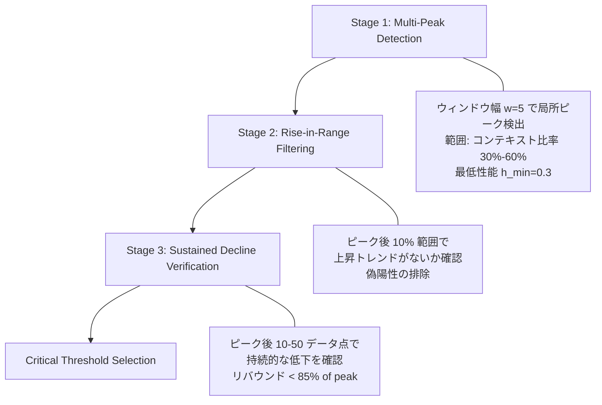

## 論文概要（Abstract）

本記事は [Intelligence Degradation in Long-Context LLMs: Critical Threshold Determination via Natural Length Distribution Analysis](https://arxiv.org/abs/2601.15300)（arXiv: 2601.15300、2026年1月公開）の解説記事です。

本論文は、Qwen2.5-7Bモデルが最大コンテキスト長（128Kトークン）の40-50%地点で性能が崩壊する現象を、Natural Length Distribution Analysisと5手法クロスバリデーションにより定量的に特定した研究である。著者らは、臨界閾値の中央値が43.2%（標準偏差1.2%）であり、F1スコアが0.556から0.302へ45.5%低下することを報告している（p < 0.001、Cohen's d = 8.2）。さらに、情報理論・Attention機構・RoPE外挿の3つの理論的観点から崩壊メカニズムを分析し、統一公式 $L_c = \min\{L_{\text{RoPE}}, L_{\text{attention}}, L_{\text{info}}\}$ を提案している。

この記事は [Zenn記事: 長いコンテキストの精度劣化を定量評価する](https://zenn.dev/0h_n0/articles/d91b468bd34566) の深掘りです。

## 情報源

- **arXiv ID**: 2601.15300
- **URL**: [https://arxiv.org/abs/2601.15300](https://arxiv.org/abs/2601.15300)
- **著者**: Weiwei Wang, Jiyong Min, Weijie Zou
- **発表年**: 2026
- **分野**: cs.CL（計算言語学）
- **コード**: [https://github.com/charles-wang888/intelligence-degradation-in-llm](https://github.com/charles-wang888/intelligence-degradation-in-llm)

## 背景と動機（Background & Motivation）

2026年時点で主要なLLMのコンテキストウィンドウは1Mトークンに到達しているが、公称コンテキスト長と実効精度の間には大きな乖離がある。Zenn記事で解説されている通り、RULERベンチマーク（Hsieh et al., 2024）ではバニラNIAHテストで完璧な精度を示すモデルでも、複合タスクでは性能が大幅に低下すると報告されている。

しかし、従来の評価手法には以下の問題があると著者らは指摘している。第一に、NIAHテストは「干し草の山から針を見つける」単純なパターンマッチであり、実際のタスク遂行能力の劣化を検出できない。第二に、既存研究の多くは人工的な切り詰め（truncation）やパディングによりコンテキスト長を操作しており、コンテキスト長そのものが性能劣化の原因であるという因果関係を立証しにくい。第三に、閾値の特定が視覚的な検査（グラフを目視で確認）に依存しており、定量的で再現可能な方法が確立されていない。

著者らはこれらの課題に対し、サンプルの自然なトークン長をそのまま利用するNatural Length Distribution Analysisと、5手法クロスバリデーションによる頑健な閾値特定フレームワークを提案している。

## 主要な貢献（Key Contributions）

- **貢献1**: Natural Length Distribution Analysis手法の提案。切り詰めやパディングを使わず、サンプルの自然なトークン長を利用することで、コンテキスト長と性能劣化の因果関係をより強く示す評価手法を確立した（分散1.2% vs 切り詰め手法3.2%、論文Table 9）
- **貢献2**: 5手法クロスバリデーションフレームワークの開発。Gradient Analysis、Second Derivative、Binned Statistics、Percentile Threshold、Sliding Windowの5手法を組み合わせ、臨界閾値43.2%（標準偏差1.2%）を高信頼度で特定した（論文Table 5）
- **貢献3**: 統一的な臨界閾値予測公式 $L_c = \min\{L_{\text{RoPE}}, L_{\text{attention}}, L_{\text{info}}\}$ の提案。情報理論的ボトルネック、Attention分散、RoPE外挿エイリアシングの3つの理論的観点を統合し、性能崩壊の発生メカニズムを説明する枠組みを構築した

## 技術的詳細（Technical Details）

### Natural Length Distribution Analysis

著者らが提案するNatural Length Distribution Analysisは、以下のアルゴリズムで動作する（論文Algorithm 1より）。

データセット $\mathcal{D} = \{s_1, s_2, \ldots, s_n\}$ の各サンプル $s_i$ に対して、自然なトークン数 $t_i$ を計算し、最大コンテキスト長 $T_{\max}$ に対する比率 $r_i = t_i / T_{\max}$ を求める。モデルの出力 $p_i = M(s_i)$ は切り詰めもパディングも行わずに取得する。

この手法の要点は、従来の切り詰め手法が人工的にコンテキスト長を操作するのに対し、SQuAD（短文、平均約1Kトークン）とNarrativeQA（長文、平均約85Kトークン）を混合した1,000サンプルで5%-95%の範囲を自然にカバーする点にある。著者らは、各10%ビンに20サンプル以上を確保している。

論文Table 9によると、Natural Length手法の閾値分散は1.2%であり、固定切り詰め手法の3.2%と比較して因果関係の証拠がより明確であると報告されている。

### 5手法クロスバリデーション

著者らは5つの独立した手法で臨界閾値を検出し、その一致度を検証している（論文Table 5より）。

| 手法 | 閾値 | 劣化率 | F1変化 | 信頼度 |
|------|------|--------|--------|--------|
| Gradient Analysis | 42.5% | 45.8% | 0.556 → 0.301 | High |
| Second Derivative | 43.2% | 46.2% | 0.558 → 0.300 | High |
| Binned Statistics | 45.0% | 44.1% | 0.552 → 0.308 | Medium |
| Percentile Threshold | 41.8% | 45.3% | 0.555 → 0.304 | High |
| Sliding Window | 44.5% | 45.7% | 0.557 → 0.303 | High |
| **中央値（最終結果）** | **43.2%** | **45.5%** | **0.556 → 0.302** | **High** |

5手法の平均は43.4%、標準偏差は1.2%であり、著者らは標準偏差が5%未満であることから信頼度を「High」と分類している（論文Algorithm 4より）。

### 3段階Multi-Peak Detection Strategy

閾値検出の中核となるMulti-Peak Gradient Analysis（論文Algorithm 3）は、3段階のフィルタリングで構成される。



**Stage 1**では、コンテキスト比率30%-60%の範囲でウィンドウ幅 $w = 5$ の局所ピークを検出する。ピーク $P_i$ は、前後 $w$ 個のデータ点の最大値以上であり、かつ $P_i \geq h_{\min} = 0.3$ を満たす点として定義される。

**Stage 2**では、検出されたピーク後の10%範囲で上昇トレンドが存在しないかを確認する。3連続以上の勾配上昇、線形回帰の正の傾き、ピーク値を超えるデータ点のいずれかが検出された場合、そのピークは偽陽性として除外される。

**Stage 3**では、ピーク後10-50データ点で持続的な低下を確認する。リバウンドの最大値がピークの85%未満であること、線形回帰の傾きが負であること、3連続以上の上昇がないことの3条件すべてを満たす場合に、持続的低下と判定する。

### 統一的な臨界閾値公式

著者らは3つの理論的観点から性能崩壊メカニズムを分析し、以下の統一公式を提案している（論文Theorem 1）。

$$
L_c = \min\{L_{\text{RoPE}}, L_{\text{attention}}, L_{\text{info}}\}
$$

ここで、各項は以下のように定義される。

**RoPE外挿閾値** $L_{\text{RoPE}}$:

$$
L_{\text{RoPE}} = \alpha \cdot P = \alpha \cdot \frac{2\pi}{\theta_{\text{RoPE}}}
$$

- $\alpha$: スケーリング係数（$\approx 0.4$-$0.5$）
- $P$: RoPEの周期（$\approx 62{,}832$ トークン）
- $\theta_{\text{RoPE}}$: 基本周波数（Qwen2.5-7Bでは $\approx 1.0 \times 10^{-4}$）

RoPEの位置エンコーディングは回転行列 $R_i$ で定義される。

$$
R_i = \begin{bmatrix} \cos(i\theta) & -\sin(i\theta) \\ \sin(i\theta) & \cos(i\theta) \end{bmatrix}
$$

コンテキスト長 $L$ がRoPEの有効範囲を超えると、遠い位置が区別不能になる位置エイリアシングが発生する。Qwen2.5-7Bでは理論予測値が128Kの約49%であるのに対し、実測値は43.2%であり、相対誤差は13.4%であったと報告されている。

**Attention集中度閾値** $L_{\text{attention}}$:

$$
C(A, L) = \frac{1}{L} \sum_{i=1}^{L} \max_j A_{ij}(L)
$$

$$
H(A \mid L) = -\sum A_{ij}(L) \log A_{ij}(L)
$$

- $C(A, L)$: コンテキスト長 $L$ でのAttention集中度
- $A_{ij}(L)$: 位置 $i$ から位置 $j$ へのAttention重み
- $H(A \mid L)$: Attentionエントロピー

コンテキスト長が増加すると、Attention重みがより均一に分散し（$C(A, L)$ が減少、$H(A \mid L)$ が増加）、関連情報への集中能力が低下する。

**情報伝達効率閾値** $L_{\text{info}}$:

$$
\eta(L) = \frac{I(X; Y \mid L)}{H(X \mid L)}
$$

- $\eta(L)$: コンテキスト長 $L$ での情報伝達効率
- $I(X; Y \mid L)$: 入力 $X$ と出力 $Y$ の相互情報量（コンテキスト長 $L$ 条件付き）
- $H(X \mid L)$: 入力のエントロピー

著者らは、RoPE理論予測（$\approx 49\%$）と実測値（$\approx 43.2\%$）の6ポイントの差が、Attention分散（$L_{\text{attention}} \approx 42$-$43\%$）または情報ボトルネック（$L_{\text{info}} \approx 42$-$44\%$）がRoPE位置エイリアシングよりも先に制約因子となることを示していると述べている。

### Dual-Level F1スコア

著者らは評価指標として、トークンレベルと文字レベルのF1スコアの最大値を採用している（論文Algorithm 2）。

$$
F1 = \max(F1_{\text{token}}, F1_{\text{char}})
$$

トークンレベルのF1が0の場合にのみ文字レベルのF1にフォールバックする設計であり、部分一致や表現のゆらぎに対する頑健性を確保している。

## 実装のポイント（Implementation）

### 混合データセットの必要性

著者らは、SQuAD（500サンプル、平均約1Kトークン）とNarrativeQA（500サンプル、平均約85Kトークン）の混合データセットが必要であると述べている。SQuADのみでは短いコンテキスト長（5%-10%）しかカバーできず、NarrativeQAのみでは安定領域のベースライン測定が困難になる。各10%ビンに20サンプル以上を確保することで、統計的に信頼できる分析が可能になると報告されている。

### 自然長分布 vs 切り詰め手法

論文Table 9の比較結果によると、Natural Length手法は切り詰め手法と比較して以下の優位性がある。

| 手法 | 閾値 | 分散 | 因果関係の強度 |
|------|------|------|---------------|
| 固定切り詰め | 38-48% | 高 (3.2%) | 弱 |
| ランダム切り詰め | 40-50% | 中 | 中 |
| パディング | 35-45% | 高 | 弱 |
| **Natural Length** | **43.2%** | **低 (1.2%)** | **強** |

### 臨界閾値検出の実装例

以下は、論文Algorithm 4に基づくクロスバリデーション閾値検出の実装例である。

```python
from dataclasses import dataclass
from statistics import median, mean, stdev
from typing import Literal


@dataclass
class ThresholdResult:
    """臨界閾値検出の結果を格納するデータクラス。

    Attributes:
        threshold: 検出された臨界閾値（コンテキスト比率）
        confidence: 信頼度レベル
        methods_agreed: 一致した手法数
        std_dev: 手法間の標準偏差
    """
    threshold: float
    confidence: Literal["high", "medium", "low"]
    methods_agreed: int
    std_dev: float


def cross_validate_threshold(
    ratios: list[float],
    scores: list[float],
) -> ThresholdResult:
    """5手法クロスバリデーションで臨界閾値を検出する。

    論文Algorithm 4に基づき、Gradient Analysis・Second Derivative・
    Binned Statistics・Percentile Threshold・Sliding Windowの5手法で
    閾値を検出し、中央値を最終閾値とする。

    Args:
        ratios: コンテキスト比率のリスト（0.0-1.0）
        scores: 各サンプルのF1スコアのリスト

    Returns:
        ThresholdResult: 臨界閾値と信頼度情報

    Raises:
        ValueError: 有効な閾値が検出されなかった場合
    """
    detected: list[float] = []

    # 各手法で閾値を検出
    methods = [
        _gradient_analysis,
        _second_derivative_analysis,
        _binned_statistics,
        _percentile_threshold,
        _sliding_window_analysis,
    ]

    for method in methods:
        result = method(ratios, scores)
        if result is not None:
            detected.append(result)

    if not detected:
        raise ValueError("No threshold detected by any method")

    final_threshold = median(detected)
    std = stdev(detected) if len(detected) > 1 else 0.0

    # 信頼度分類（論文Algorithm 4の基準）
    if std < 0.05:
        confidence: Literal["high", "medium", "low"] = "high"
    elif std < 0.10:
        confidence = "medium"
    else:
        confidence = "low"

    return ThresholdResult(
        threshold=final_threshold,
        confidence=confidence,
        methods_agreed=len(detected),
        std_dev=std,
    )
```

## Production Deployment Guide

本論文の臨界閾値検出手法は、LLMを活用するプロダクション環境で重要な意味を持つ。モデルに送信するコンテキスト長を臨界閾値以下に制御することで、不要なトークン消費の削減と回答精度の維持を両立できる。以下では、AWS上での実装パターンを示す。

### AWS実装パターン（コスト最適化重視）

コンテキスト長監視・制御システムのトラフィック量別推奨構成を以下に示す。コスト試算は2026年9月時点のAWS ap-northeast-1（東京）リージョン料金に基づく概算値であり、実際のコストはトラフィックパターン、バースト使用量により変動する。最新料金は[AWS料金計算ツール](https://calculator.aws/)で確認を推奨する。

| 構成 | トラフィック | 主要サービス | 月額概算 |
|------|------------|-------------|---------|
| **Small** | ~100 req/日 | Lambda + Bedrock + DynamoDB | $50-150 |
| **Medium** | ~1,000 req/日 | ECS Fargate + Bedrock + ElastiCache | $300-800 |
| **Large** | 10,000+ req/日 | EKS + Karpenter + Spot Instances | $2,000-5,000 |

**Small構成の内訳**: Lambda（$5-10）、Bedrock API呼び出し（$30-100、モデル・トークン量依存）、DynamoDB On-Demand（$5-15）、CloudWatch（$5-10）。Bedrockのコストが支配的であり、Batch API使用で50%削減、Prompt Caching有効化で30-90%削減が可能である。

**Medium構成の内訳**: ECS Fargate（$80-200、0.5vCPU/1GB RAM x 2タスク）、Bedrock（$150-400）、ElastiCache（$50-100、cache.t3.small）、ALB（$20-30）。ElastiCacheによるプロンプトキャッシュでBedrock呼び出し回数を削減する。

**Large構成の内訳**: EKS コントロールプレーン（$73）、EC2 Spot Instances（$500-1,500、m5.xlarge相当）、Bedrock（$1,000-3,000）、Karpenter自動スケーリング、Reserved Instances併用で最大72%削減。

**コスト削減テクニック**:
- **Spot Instances**: オンデマンド比で最大90%削減（Large構成）
- **Reserved Instances**: 1年コミットで最大72%削減
- **Bedrock Batch API**: 非リアルタイム処理で50%削減
- **Prompt Caching**: 繰り返しプロンプトで30-90%削減

### Terraformインフラコード

#### Small構成（Serverless）: Lambda + Bedrock + DynamoDB

```hcl
# small_context_monitor/main.tf
# コンテキスト長監視 — Serverless構成（~100 req/日）

terraform {
  required_version = ">= 1.9"
  required_providers {
    aws = {
      source  = "hashicorp/aws"
      version = "~> 5.60"
    }
  }
}

provider "aws" {
  region = "ap-northeast-1"
}

# --- IAMロール（最小権限） ---
resource "aws_iam_role" "lambda_role" {
  name = "context-monitor-lambda-role"
  assume_role_policy = jsonencode({
    Version = "2012-10-17"
    Statement = [{
      Action = "sts:AssumeRole"
      Effect = "Allow"
      Principal = { Service = "lambda.amazonaws.com" }
    }]
  })
}

resource "aws_iam_role_policy" "lambda_policy" {
  name = "context-monitor-policy"
  role = aws_iam_role.lambda_role.id
  policy = jsonencode({
    Version = "2012-10-17"
    Statement = [
      {
        Effect   = "Allow"
        Action   = ["logs:CreateLogGroup", "logs:CreateLogStream", "logs:PutLogEvents"]
        Resource = "arn:aws:logs:ap-northeast-1:*:*"
      },
      {
        Effect   = "Allow"
        Action   = ["bedrock:InvokeModel"]
        Resource = "arn:aws:bedrock:ap-northeast-1::foundation-model/*"
      },
      {
        Effect   = "Allow"
        Action   = ["dynamodb:PutItem", "dynamodb:GetItem", "dynamodb:Query"]
        Resource = aws_dynamodb_table.context_metrics.arn
      }
    ]
  })
}

# --- DynamoDB（On-Demand、コスト最適化） ---
resource "aws_dynamodb_table" "context_metrics" {
  name         = "context-length-metrics"
  billing_mode = "PAY_PER_REQUEST" # On-Demand: 低トラフィック向け
  hash_key     = "request_id"
  range_key    = "timestamp"

  attribute {
    name = "request_id"
    type = "S"
  }
  attribute {
    name = "timestamp"
    type = "S"
  }

  server_side_encryption {
    enabled = true # KMS暗号化
  }

  point_in_time_recovery {
    enabled = true
  }

  tags = {
    Project = "context-monitor"
    Env     = "production"
  }
}

# --- Lambda関数 ---
resource "aws_lambda_function" "context_monitor" {
  function_name = "context-length-monitor"
  runtime       = "python3.12"
  handler       = "handler.lambda_handler"
  role          = aws_iam_role.lambda_role.arn
  timeout       = 60
  memory_size   = 256 # コスト最適化: 最小限のメモリ

  filename         = "lambda.zip"
  source_code_hash = filebase64sha256("lambda.zip")

  environment {
    variables = {
      DYNAMODB_TABLE       = aws_dynamodb_table.context_metrics.name
      CRITICAL_THRESHOLD   = "0.40" # 論文推奨: 40%以下で運用
      MAX_CONTEXT_TOKENS   = "131072"
    }
  }

  tracing_config {
    mode = "Active" # X-Ray有効化
  }
}

# --- CloudWatchアラーム（コスト監視） ---
resource "aws_cloudwatch_metric_alarm" "high_token_usage" {
  alarm_name          = "context-monitor-high-tokens"
  comparison_operator = "GreaterThanThreshold"
  evaluation_periods  = 2
  metric_name         = "TokensProcessed"
  namespace           = "ContextMonitor"
  period              = 3600
  statistic           = "Sum"
  threshold           = 1000000 # 1M tokens/hour
  alarm_description   = "Token usage exceeds threshold"
  alarm_actions       = [] # SNS ARNを指定
}
```

#### Large構成（Container）: EKS + Karpenter + Spot Instances

```hcl
# large_context_monitor/main.tf
# コンテキスト長監視 — Container構成（10,000+ req/日）

module "eks" {
  source  = "terraform-aws-modules/eks/aws"
  version = "~> 20.24"

  cluster_name    = "context-monitor-cluster"
  cluster_version = "1.31"

  vpc_id     = module.vpc.vpc_id
  subnet_ids = module.vpc.private_subnets

  cluster_endpoint_public_access = false # セキュリティ: プライベートのみ

  eks_managed_node_groups = {
    system = {
      instance_types = ["m5.large"]
      min_size       = 1
      max_size       = 2
      desired_size   = 1
      capacity_type  = "ON_DEMAND" # システムノードはオンデマンド
    }
  }

  tags = {
    Project = "context-monitor"
    Env     = "production"
  }
}

# --- Karpenter Provisioner（Spot優先） ---
resource "kubectl_manifest" "karpenter_provisioner" {
  yaml_body = <<-YAML
    apiVersion: karpenter.sh/v1
    kind: NodePool
    metadata:
      name: context-monitor-pool
    spec:
      template:
        spec:
          requirements:
            - key: karpenter.sh/capacity-type
              operator: In
              values: ["spot", "on-demand"]  # Spot優先
            - key: node.kubernetes.io/instance-type
              operator: In
              values: ["m5.xlarge", "m5.2xlarge", "m6i.xlarge", "m6i.2xlarge"]
          nodeClassRef:
            group: karpenter.k8s.aws
            kind: EC2NodeClass
            name: default
      limits:
        cpu: "64"
        memory: 256Gi
      disruption:
        consolidationPolicy: WhenEmptyOrUnderutilized
        consolidateAfter: 30s
  YAML
}

# --- Secrets Manager（Bedrock設定） ---
resource "aws_secretsmanager_secret" "bedrock_config" {
  name       = "context-monitor/bedrock-config"
  kms_key_id = aws_kms_key.app_key.arn
}

# --- AWS Budgets（予算アラート） ---
resource "aws_budgets_budget" "monthly" {
  name         = "context-monitor-monthly"
  budget_type  = "COST"
  limit_amount = "5000"
  limit_unit   = "USD"
  time_unit    = "MONTHLY"

  notification {
    comparison_operator       = "GREATER_THAN"
    threshold                 = 80
    threshold_type            = "PERCENTAGE"
    notification_type         = "ACTUAL"
    subscriber_email_addresses = ["ops-team@example.com"]
  }
}
```

### セキュリティベストプラクティス

- **IAMロール**: 最小権限の原則を適用。Lambda/ECSタスクごとに専用ロールを作成し、必要なリソースARNのみを許可する
- **ネットワーク**: EKSクラスタはプライベートサブネットに配置し、パブリックエンドポイントを無効化する。VPCエンドポイントでBedrock・DynamoDB・CloudWatch Logsにアクセスする
- **シークレット管理**: APIキー・接続文字列はSecrets Managerに格納し、KMSカスタマーマネージドキーで暗号化する
- **暗号化**: DynamoDBのサーバーサイド暗号化、S3バケットのデフォルト暗号化、EBSボリュームの暗号化をすべて有効化する
- **監査**: CloudTrailを有効化し、全API呼び出しを記録する。AWS Configで構成変更を追跡する

### 運用・監視設定

#### CloudWatch Logs Insights クエリ

```
# コスト異常検知: 1時間あたりのトークン使用量
fields @timestamp, context_tokens, model_id
| filter context_tokens > 0
| stats sum(context_tokens) as total_tokens,
        count(*) as request_count,
        avg(context_tokens) as avg_tokens
  by bin(1h) as hour
| filter total_tokens > 500000
| sort hour desc

# レイテンシ分析: P95, P99
fields @timestamp, duration_ms
| stats percentile(duration_ms, 95) as p95,
        percentile(duration_ms, 99) as p99,
        avg(duration_ms) as avg_ms
  by bin(5m)
| filter p99 > 5000
```

#### CloudWatchアラーム設定

```python
import boto3


def create_token_usage_alarm(sns_topic_arn: str) -> dict:
    """Bedrockトークン使用量スパイク検知アラームを作成する。

    Args:
        sns_topic_arn: 通知先SNSトピックのARN

    Returns:
        CloudWatch APIのレスポンス
    """
    cw = boto3.client("cloudwatch", region_name="ap-northeast-1")
    return cw.put_metric_alarm(
        AlarmName="bedrock-token-spike",
        MetricName="InputTokenCount",
        Namespace="AWS/Bedrock",
        Statistic="Sum",
        Period=3600,
        EvaluationPeriods=2,
        Threshold=1_000_000,
        ComparisonOperator="GreaterThanThreshold",
        AlarmActions=[sns_topic_arn],
        TreatMissingData="notBreaching",
    )
```

#### X-Rayトレーシング設定

```python
from aws_xray_sdk.core import xray_recorder, patch_all


def configure_xray() -> None:
    """X-Rayトレーシングを設定し、boto3を自動計装する。"""
    xray_recorder.configure(service="context-monitor")
    patch_all()  # boto3, requests等を自動計装


@xray_recorder.capture("check_context_threshold")
def check_context_threshold(
    token_count: int,
    max_tokens: int = 131_072,
    threshold_ratio: float = 0.40,
) -> dict:
    """コンテキスト長が臨界閾値以下かチェックする。

    Args:
        token_count: 入力トークン数
        max_tokens: モデルの最大コンテキスト長
        threshold_ratio: 臨界閾値比率（論文推奨: 0.40）

    Returns:
        チェック結果を含む辞書
    """
    ratio = token_count / max_tokens
    is_safe = ratio <= threshold_ratio
    subsegment = xray_recorder.current_subsegment()
    if subsegment:
        subsegment.put_annotation("context_ratio", round(ratio, 4))
        subsegment.put_annotation("is_safe", is_safe)
        subsegment.put_metadata("details", {
            "token_count": token_count,
            "max_tokens": max_tokens,
            "threshold": threshold_ratio,
        })
    return {"ratio": ratio, "is_safe": is_safe, "token_count": token_count}
```

#### Cost Explorer自動レポート

```python
import boto3
from datetime import date, timedelta


def get_daily_cost_report() -> dict:
    """日次コストレポートを取得し、異常を検知する。

    Bedrock・Lambda・EKSのコストを抽出し、
    $100/日を超過した場合にアラート情報を返す。

    Returns:
        コストレポートと異常検知結果を含む辞書
    """
    ce = boto3.client("ce", region_name="us-east-1")
    today = date.today()
    yesterday = today - timedelta(days=1)
    response = ce.get_cost_and_usage(
        TimePeriod={
            "Start": yesterday.isoformat(),
            "End": today.isoformat(),
        },
        Granularity="DAILY",
        Metrics=["UnblendedCost"],
        GroupBy=[{"Type": "DIMENSION", "Key": "SERVICE"}],
    )
    target_services = {
        "Amazon Bedrock", "AWS Lambda", "Amazon Elastic Kubernetes Service"
    }
    costs = {}
    total = 0.0
    for group in response["ResultsByTime"][0]["Groups"]:
        service = group["Keys"][0]
        amount = float(group["Metrics"]["UnblendedCost"]["Amount"])
        if service in target_services:
            costs[service] = amount
            total += amount
    return {
        "date": yesterday.isoformat(),
        "costs": costs,
        "total": round(total, 2),
        "alert": total > 100.0,
    }
```

### コスト最適化チェックリスト

#### アーキテクチャ選択

- [ ] トラフィック量でServerless / Hybrid / Container構成を判断したか
- [ ] NAT Gateway不使用でコスト削減できるか検討したか（VPCエンドポイント代替）
- [ ] マルチAZ構成の必要性を検討したか

#### リソース最適化

- [ ] EC2: Spot Instances優先で設定したか（最大90%削減）
- [ ] Reserved Instances: 1年コミットで購入検討したか（最大72%削減）
- [ ] Savings Plans: コンピュート全体での検討をしたか
- [ ] Lambda: メモリサイズをPower Tuningで最適化したか
- [ ] ECS/EKS: アイドル時のスケールダウン設定があるか
- [ ] Karpenter: consolidationPolicyを設定したか

#### LLMコスト削減

- [ ] Bedrock Batch API: 非リアルタイム処理に適用したか（50%削減）
- [ ] Prompt Caching: 繰り返しプロンプトに有効化したか（30-90%削減）
- [ ] モデル選択ロジック: タスク複雑度に応じたモデル切り替えを実装したか
- [ ] トークン数制限: 臨界閾値（40%）に基づく上限を設定したか
- [ ] コンテキスト長の事前チェック: 閾値超過時の分割・要約戦略があるか

#### 監視・アラート

- [ ] AWS Budgets: 月次予算アラート（80%/100%）を設定したか
- [ ] CloudWatch アラーム: トークン使用量スパイクを検知するか
- [ ] Cost Anomaly Detection: 異常検知を有効化したか
- [ ] 日次コストレポート: 自動取得とSNS通知を設定したか
- [ ] X-Ray: レイテンシ異常のトレーシングを有効化したか

#### リソース管理

- [ ] 未使用リソース: 定期的な棚卸しスケジュールがあるか
- [ ] タグ戦略: Project/Env/Ownerタグを全リソースに適用したか
- [ ] ライフサイクルポリシー: CloudWatch Logsの保持期間を設定したか（30日推奨）
- [ ] 開発環境: 夜間・週末の自動停止を設定したか
- [ ] DynamoDB: TTL設定で古いメトリクスを自動削除しているか

## 実験結果（Results）

### 3つの性能領域

著者らは、Qwen2.5-7Bの性能を3つの領域に分類している（論文Table 7より）。

| 領域 | コンテキスト比率 | トークン範囲 | 平均F1 | 標準偏差 | F1範囲 |
|------|---------------|-------------|--------|---------|--------|
| **Stable** | 0-40% | 0-51,200 | 0.565 | 0.021 | 0.512-0.598 |
| **Critical Transition** | 40-50% | 51,200-64,000 | 0.429 | 0.089 | 0.245-0.556 |
| **Degraded** | 50-95% | 64,000-124,595 | 0.278 | 0.034 | 0.201-0.345 |

Stable領域では分散が小さく安定した性能を示す一方、Critical Transition領域ではわずか10%の範囲（約12,800トークン）でF1が0.556から約0.30まで崩壊すると報告されている。Degraded領域では性能が回復せず、低水準で推移する。

### 統計的有意性

Stable領域とDegraded領域の比較において、2標本t検定でp < 0.001、Cohen's d = 8.2（非常に大きい効果量）が得られたと報告されている。Critical Transition領域ではコンテキスト長とF1スコアの相関係数がr = -0.68（p < 0.001）であり、この領域で急激な性能低下が生じていることが統計的に裏付けられている。

一方、Stable領域（r = -0.12、p = 0.15）とDegraded領域（r = -0.08、p = 0.32）ではコンテキスト長との有意な相関は認められず、性能の低下はCritical Transition領域に集中していることがわかる。

## 実運用への応用（Practical Applications）

本論文の知見をプロダクション環境に適用する場合、以下の戦略が考えられる。

**コンテキスト長の上限設定**: 著者らの推奨に基づき、最大コンテキスト長の40%以下で運用することで安定した精度を維持できる。Qwen2.5-7B（128Kトークン）の場合、約51,200トークンが実用上の上限となる。Zenn記事で解説されている通り、この「40-50%ルール」は他のモデルにも適用可能な可能性がある。

**動的コンテキスト制御**: リクエストごとにトークン数を計測し、臨界閾値に近づいた場合に自動的にコンテキストを要約・分割する戦略が有効である。RAGパイプラインでは、検索結果のチャンク数を臨界閾値以下に制限する設計が求められる。

**モデル選択の最適化**: コンテキスト長が長いリクエストに対しては、より大きなモデル（32B以上）やコンテキスト拡張が施されたモデルを動的に選択することで、精度劣化を回避できる可能性がある。ただし、論文の検証はQwen2.5-7Bに限定されており、他モデルでの臨界閾値は異なる可能性がある。

**精度モニタリング**: Zenn記事で実装されているNIAHテストベースの本番監視に加え、本論文の手法を用いてモデル更新時に臨界閾値を再測定することが推奨される。

## 関連研究（Related Work）

- **RULER** (Hsieh et al., 2024): NIAHテストを拡張した長コンテキスト評価ベンチマーク。複合タスクでの性能劣化を体系的に評価するが、臨界閾値の定量的特定は行っていない。本論文はRULERが示した問題を更に深掘りし、閾値検出の手法を確立した位置づけにある
- **Lost in the Middle** (Liu et al., 2023): コンテキスト中間部に配置された情報の検索精度が低下する位置依存性を報告。本論文の対象はコンテキスト長全体の性能崩壊であり、位置依存性とは異なる現象を扱っている
- **LongLoRA** (Chen et al., 2024): 効率的なファインチューニングによるコンテキスト拡張手法。本論文の知見は、こうした拡張手法の実効性を検証する際の評価基準として活用できる
- **Mamba** (Gu and Dao, 2024): 線形時間の系列モデリング。Transformerとは異なるアーキテクチャであり、RoPEベースの閾値予測は直接適用できないが、同様の性能劣化パターンが存在するかは今後の研究課題として著者らが挙げている

## まとめと今後の展望

本論文は、長コンテキストLLMが最大コンテキスト長の43.2%付近で性能が崩壊するという「浅い長コンテキスト適応」現象を定量的に示した。5手法クロスバリデーションによる閾値特定は標準偏差1.2%と高い一致度を示しており、統一公式 $L_c = \min\{L_{\text{RoPE}}, L_{\text{attention}}, L_{\text{info}}\}$ は崩壊メカニズムの理論的な枠組みを提供している。

一方で、著者らはいくつかの限界を明示している。実験がQwen2.5-7Bに限定されていること、読解タスク以外への一般化が未検証であること、内部表現の分析（Attention可視化等）が十分でないことが挙げられている。今後は、異なるモデルスケール（3B、32B）やアーキテクチャへの拡張、要約・推論タスクへの適用、そして閾値を改善するための緩和戦略の開発が研究課題として示されている。

## 参考文献

- **arXiv**: [https://arxiv.org/abs/2601.15300](https://arxiv.org/abs/2601.15300)
- **Code**: [https://github.com/charles-wang888/intelligence-degradation-in-llm](https://github.com/charles-wang888/intelligence-degradation-in-llm)
- **Related Zenn article**: [https://zenn.dev/0h_n0/articles/d91b468bd34566](https://zenn.dev/0h_n0/articles/d91b468bd34566)
- Hsieh, C.-P., et al. (2024). "RULER: What's the Real Context Size of Your Long-Context Language Models?" [arXiv:2404.06654](https://arxiv.org/abs/2404.06654)
- Liu, N. F., et al. (2023). "Lost in the Middle: How Language Models Use Long Contexts." [arXiv:2307.03172](https://arxiv.org/abs/2307.03172)
