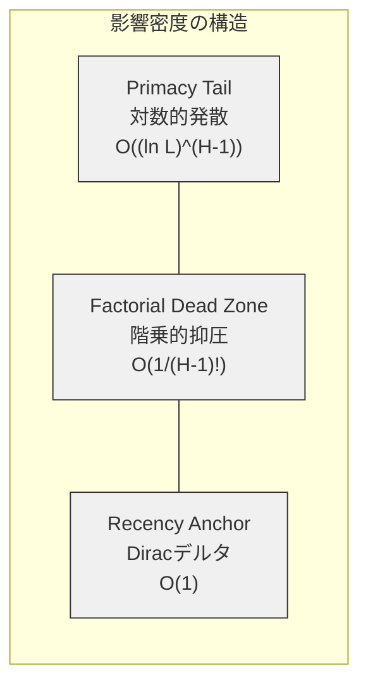

## 論文概要（Abstract）

本記事は [arXiv:2603.10123 "Lost in the Middle at Birth: An Exact Theory of Transformer Position Bias"](https://arxiv.org/abs/2603.10123) の解説記事です。

LLMが長いコンテキストの先頭と末尾の情報を優先し、中間部分の情報を取りこぼす「Lost in the Middle」現象は広く知られている。しかし、この現象が学習過程で獲得されるものなのか、それともアーキテクチャに内在する構造的特性なのかは未解決であった。著者は、因果的マスキングと残差接続という2つの構造要素だけで、ランダム初期化時点（Step 0）において既にU字型の位置バイアスが存在することを数学的に証明している。Cesàro行列の反復べき乗として多層因果注意をモデル化し、連続極限における閉じた形の影響密度を導出することで、先頭トークンへの対数的発散（Primacy Tail）、末尾トークンへのDiracデルタ的集中（Recency Anchor）、そしてその間の階乗的に抑圧された不感帯（Factorial Dead Zone）の3構造を明らかにしている。

この記事は [Zenn記事: 長いコンテキストの精度劣化を定量評価する：NIAHテストと本番モニタリング実装](https://zenn.dev/0h_n0/articles/d91b468bd34566) の深掘りです。

## 情報源

- **arXiv ID**: 2603.10123
- **URL**: [arXiv:2603.10123](https://arxiv.org/abs/2603.10123)
- **著者**: Borun D Chowdhury
- **発表年**: 2026年3月
- **分野**: cs.LG（Machine Learning）, cs.AI（Artificial Intelligence）, cs.CL（Computation and Language）
- **論文規模**: 11ページ、7図

## 背景と動機（Background & Motivation）

Lost in the Middleは、2023年にLiu et al.が報告した現象であり、LLMが長いコンテキストにおいて先頭と末尾に配置された情報を正確に検索できる一方で、中間部分の情報を著しく取りこぼすことを示した。この問題は、RAG（Retrieval-Augmented Generation）やマルチドキュメント質問応答など、長いコンテキストを扱う実用的タスクにおいて深刻な障壁となっている。

従来の研究では、この現象を学習データの分布やPositional Encodingの影響によるアーティファクトとして捉える見方が主流であった。すなわち、モデルが訓練中に先頭と末尾の情報を優先するパターンを「学習」するという理解である。しかし、この見方には根本的な疑問が残っていた。なぜ異なるアーキテクチャ、異なる訓練データ、異なるPositional Encodingを用いても、同じU字型のパターンが普遍的に出現するのか。

著者は、この問いに対してアーキテクチャの観点から回答を与えている。因果的マスキング（各トークンが過去のトークンのみ参照可能）と残差接続（各層の入力がスキップ接続で出力に加算される）という、デコーダ型Transformerの2つの基本構造だけで、訓練前の初期化時点においてU字型バイアスが数学的に不可避であることを証明している。

## 主要な貢献（Key Contributions）

- **初期化時点でのU字型バイアスの数学的証明**: 訓練もPositional Encodingも関与しない、純粋にアーキテクチャ由来の位置バイアスの存在を初めて厳密に示した
- **Cesàro行列を用いた多層注意の解析的モデル**: 因果的注意をCesàro行列の反復べき乗として定式化し、連続極限で閉じた形の影響密度を導出した。これにより3つの構造成分（Primacy Tail、Recency Anchor、Factorial Dead Zone）を分離して理解できる
- **スケールフリー性の発見**: U字型バイアスが因果的マスキングを持つ任意の階層レベルで再帰的に出現する「スケールフリー」な性質を持つことを示した

## 技術的詳細（Technical Details）

### Cesàro行列と均一注意分布

ランダム初期化時点では、クエリベクトルとキーベクトルの内積はほぼゼロとなる。これにより、Softmax出力は均一分布に近づく。因果的マスキングの制約下では、位置$i$のトークンは位置$1$から$i$までのトークンにのみ注意を向けることができるため、注意重みは以下のようになる。

$$
A_{ij} = \frac{1}{i} \quad (j \leq i), \quad A_{ij} = 0 \quad (j > i)
$$

ここで、
- $A_{ij}$: 位置$i$から位置$j$への注意重み
- $i$: クエリトークンの位置（$1 \leq i \leq L$、$L$はシーケンス長）

この行列$M$はCesàro行列として知られており、数列の平均操作を表現する古典的な線形代数の対象である。著者は、この行列の反復べき乗$M^H$（$H$は層数）を解析することで、多層因果注意の影響構造を導出している。

残差接続を考慮する場合、各層の更新は以下のように定式化される。

$$
N = (1 - \alpha) I + \alpha M
$$

ここで、
- $N$: 残差接続を含む1層の遷移行列
- $\alpha \in [0, 1]$: 残差接続の混合パラメータ（$\alpha = 1$で純粋な注意、$\alpha = 0$で完全なスキップ）
- $I$: 単位行列
- $M$: Cesàro行列

### H層の影響密度公式の導出

著者は、$H$層のCesàro行列のべき乗について、最終位置$L$から位置$j$への影響を以下の閉じた形で与えている。

$$
(M^H)_{L,j} = \binom{L-1}{j-1} \sum_{m=j}^{L} (-1)^{m-j} \binom{L-j}{m-j} \left(\frac{1}{m}\right)^H
$$

ここで、
- $(M^H)_{L,j}$: $H$層を経た後の最終位置$L$から位置$j$への累積影響
- $\binom{n}{k}$: 二項係数
- $H$: Transformer層の総数

残差接続を含む場合、完全な遷移行列$N^H$は二項展開により以下のように表される。

$$
(N^H)_{L,j} = (1-\alpha)^H \delta_{L,j} + \sum_{r=1}^{H} \binom{H}{r} \alpha^r (1-\alpha)^{H-r} (M^r)_{L,j}
$$

ここで、
- $\delta_{L,j}$: クロネッカーデルタ（$L = j$のとき1、それ以外は0）
- $r$: 二項展開の項数（実質的に「何回注意層を通過するか」を表す）

この式の第1項$(1-\alpha)^H \delta_{L,j}$が後述するRecency Anchorに対応し、総和の部分がPrimacy Tailおよび中間領域の影響に対応する。

### Primacy Tail: 先頭トークンへの対数的発散

シーケンス長$L \to \infty$の連続極限において、正規化された位置$x = j/L \in (0, 1]$を導入すると、純粋な因果注意（残差接続なし）の影響密度は以下の閉じた形で表される。

$$
\rho_H^{(M)}(x) = \frac{1}{(H-1)!} \left(\ln \frac{1}{x}\right)^{H-1}
$$

ここで、
- $\rho_H^{(M)}(x)$: $H$層における位置$x$の影響密度
- $x = j/L$: 正規化された位置（0に近いほど先頭、1に近いほど末尾）
- $H$: Transformer層の総数

$x \to 0$（先頭トークン）において$\ln(1/x) \to \infty$であるため、影響密度は対数的に発散する。これがPrimacy Tailと呼ばれる構造であり、因果的マスキングによる「複利効果」を反映している。各層で先頭トークンの影響が指数関数的に経路数を増やし、$H$層を経ると$(H-1)$乗の対数的な蓄積が生じる。

重要な点として、この発散は層数$H$に対して組み合わせ論的に増大する。$H = 12$のモデルでは$(\ln(1/x))^{11}$、$H = 24$のモデルでは$(\ln(1/x))^{23}$となり、深いネットワークほど先頭バイアスが強まることが数学的に保証される。

### Recency Anchor: 末尾トークンへのDiracデルタ集中

残差接続を含む完全な影響密度は以下のように表される。

$$
\rho_H^{(N)}(x) = (1-\alpha)^H \delta(1-x) + \sum_{r=1}^{H} \binom{H}{r} (1-\alpha)^{H-r} \alpha^r \frac{1}{(r-1)!} \left(\ln \frac{1}{x}\right)^{r-1}
$$

ここで、
- $(1-\alpha)^H \delta(1-x)$: Recency Anchorの項
- $\delta(1-x)$: $x = 1$（最終トークン）におけるDiracデルタ関数
- $(1-\alpha)^H$: $H$層すべてで残差パスを経由する確率

第1項のRecency Anchorは、残差接続による純粋なスキップ経路を表現している。最終トークンの情報は、$H$層すべてで注意層をバイパスし、残差接続のみを通じて直接出力に伝播できる。この経路の強度は$(1-\alpha)^H$であり、$O(1)$のオーダーを持つ。因果的注意を一切経由しないため、位置バイアスの影響を受けず、末尾位置に孤立したスパイクを形成する。

### Factorial Dead Zone: 階乗的に抑圧された中間領域

Primacy Tailの強度は$x \to 0$付近で$O((\ln L)^{H-1})$のオーダーを持ち、Recency Anchorの強度は$O(1)$である。一方、中間位置（$x \sim 0.5$）での影響密度は以下のオーダーに落ち込む。

$$
\rho_H^{(M)}(0.5) = \frac{(\ln 2)^{H-1}}{(H-1)!}
$$

$H$が増大すると、分母の$(H-1)!$（階乗）が分子の$(\ln 2)^{H-1}$を圧倒的に上回る。例えば$H = 12$のモデルでは、中間部分の影響密度は以下のように極めて小さくなる。

$$
\frac{(\ln 2)^{11}}{11!} \approx \frac{0.693^{11}}{39916800} \approx 1.2 \times 10^{-9}
$$

これにより、先頭と末尾の影響密度に対して$O(1/(H-1)!)$の桁違いの差（Factorial Dead Zone）が生じる。著者は、この階乗的抑圧が深いネットワークほど悪化するため、中間コンテキストの検索が「構造的に敵対的」であると述べている。



### Score Pathwayの消滅

Jacobian（出力のトークン位置に対する勾配）は、Value PathwayとScore Pathwayの2つの経路に分解できる。

- **Value Pathway**: 注意重みを通じた直接的な情報伝播。初期化時点で活性化しており、Cesàro行列の解析が対応する
- **Score Pathway**: 注意重みの勾配を通じた間接的な影響。Softmax温度に依存する

初期化時点では、Score Pathwayの寄与はFrobeniusノルムで$O(d_k^{-1/2})$のオーダーしかない。

$$
\|J_{\text{Score}}\|_F = O(d_k^{-1/2})
$$

ここで、$d_k$は注意ヘッドの次元数であり、典型的には64-128程度の値をとる。したがって、初期化時点ではScore Pathwayは事実上消滅しており、Value Pathwayのみが支配的となる。訓練が進むにつれてScore Pathwayが活性化し、コンテンツ依存の注意パターンが出現するが、マクロなU字型構造は維持される。

### RoPEが初期化時に無関係な理由

Rotary Position Embedding（RoPE）は、クエリ・キーベクトルに位置依存の直交回転を適用する手法であり、以下のように定式化される。

$$
S_{ij} = \frac{q_i^T R(\theta, i-j) k_j}{\sqrt{d_k}}
$$

ここで、
- $S_{ij}$: 位置$i$から位置$j$への注意スコア
- $q_i, k_j$: クエリおよびキーベクトル
- $R(\theta, i-j)$: 位置差$i-j$に依存する直交回転行列
- $d_k$: ヘッド次元数

初期化時点では、$q_i$と$k_j$は等方的ガウス分布（isotropic Gaussian）に従う。等方的ガウス分布は直交変換に対して不変であるため、$R(\theta, i-j)$による回転は注意スコアの分布を変化させない。

$$
q_i \sim \mathcal{N}(0, \sigma^2 I) \implies R(\theta, m) q_i \sim \mathcal{N}(0, \sigma^2 I)
$$

したがって、RoPEの有無にかかわらず、初期化時点での注意分布は均一なCesàro行列に一致する。この理論的予測は、実験でRoPEありとなしの未訓練Qwen2-0.5BモデルでSpearman相関$\rho = 0.99$、Wasserstein距離$W = 0.02$という高い一致を示すことで裏付けられている。

## 実装のポイント（Implementation）

本論文は理論的解析が主体であり、実装コードの提供はない。ただし、著者が用いた未訓練モデルでの検証手法は再現可能である。以下にJacobian計算による影響密度の測定方法を示す。

```python
import torch
from transformers import AutoModelForCausalLM, AutoTokenizer


def compute_jacobian_influence(
    model_name: str,
    seq_length: int = 512,
    target_position: int = -1,
) -> torch.Tensor:
    """未訓練モデルのJacobianを計算し位置ごとの影響密度を測定する

    Args:
        model_name: HuggingFaceモデル名
        seq_length: 入力シーケンス長
        target_position: 出力側の注目位置（-1で最終位置）

    Returns:
        各入力位置の影響密度を表すテンソル (seq_length,)
    """
    tokenizer = AutoTokenizer.from_pretrained(model_name)
    model = AutoModelForCausalLM.from_pretrained(
        model_name,
        torch_dtype=torch.float32,
    )
    model.eval()

    # ランダムトークン列を生成（内容に依存しないことを確認するため）
    input_ids = torch.randint(
        low=100,
        high=tokenizer.vocab_size,
        size=(1, seq_length),
    )

    # 埋め込み層の出力に対してJacobianを計算
    embeddings = model.get_input_embeddings()(input_ids)
    embeddings.requires_grad_(True)

    # フォワードパス
    outputs = model(inputs_embeds=embeddings)
    logits = outputs.logits

    # 最終位置のlogitに対する各位置の勾配を計算
    target_logits = logits[0, target_position, :]
    influence = torch.zeros(seq_length)

    for dim_idx in range(min(target_logits.shape[0], 100)):
        target_logits[dim_idx].backward(retain_graph=True)
        grad = embeddings.grad[0]  # (seq_length, hidden_dim)
        influence += grad.norm(dim=-1).detach()
        embeddings.grad.zero_()

    # 正規化
    influence = influence / influence.sum()
    return influence
```

上記のコードでは、未訓練モデルの出力logitに対する入力埋め込みのJacobian（勾配のFrobeniusノルム）を位置ごとに計算している。著者の理論が正しければ、得られる影響密度はU字型を示し、Cesàro行列モデルの予測と高い相関を持つはずである。

## 実験結果（Experimental Results）

### Qwen2-0.5Bでの検証

著者は24層のQwen2-0.5Bモデル（シーケンス長$L = 2048$）を用いて、初期化時点（Step 0）でのJacobian影響密度を測定している。

- **RoPEあり vs RoPEなし**: Spearman順位相関$\rho = 0.99$、Wasserstein距離$W = 0.02$で事実上同一の分布を示した
- **理論予測との一致**: 測定された影響密度はCesàro行列モデルの解析的予測と高い一致を示した
- **U字型の非対称性**: 先頭側は対数的なテイル（なだらかな減衰）、末尾側は孤立したスパイク（急峻なピーク）という非対称なプロファイルが観測された

### GPT-2での検証

GPT-2 SmallおよびMediumモデルでも同様の実験が行われている。GPT-2は絶対位置エンコーディング（learned absolute positional embeddings）を使用しており、RoPEとは根本的に異なるPositional Encoding方式である。にもかかわらず、初期化時点で同一のU字型トポロジーが観測された。著者は、この結果がU字型バイアスの普遍性を裏付ける証拠であると主張している。

### 訓練中の変化

著者は、Natural Questions（NQ）データセット上で100ステップの訓練を行い、U字型バイアスの変化を追跡している。

| 訓練段階 | 特徴 | ピーク対トラフ比 |
|----------|------|-----------------|
| Step 0（初期化） | 滑らかなCesàro幾何。コンテンツ感度なし | $\sim 10^2$ |
| ~50 Steps | 鋭いスパイクが出現。Score Pathwayが活性化 | 増大中 |
| 100 Steps | マクロU字型が維持。中間部のフロアは上昇しない | $\sim 10^3$ |

注目すべき点として、訓練によりピーク対トラフ比が$10^2$から$10^3$に増大している。これは、標準的な次トークン予測の目的関数が中間コンテキストの検索を明示的に報酬しないため、オプティマイザが「最小抵抗経路」として幾何学的な極値（先頭と末尾）に依存する傾向を強めることを示唆している。著者は、この知見から、訓練がU字型バイアスを緩和するどころか増幅する可能性があると指摘している。

## 実運用への応用（Production Deployment Guide）

### U字型バイアスの軽減戦略

本論文の理論的知見は、LLMを用いたシステムの設計に対して直接的な示唆を与える。以下に主要な軽減戦略を整理する。

#### 情報配置の最適化

U字型バイアスがアーキテクチャ由来であるという知見は、プロンプト設計における情報配置戦略の理論的根拠を提供する。

- **重要情報の先頭・末尾配置**: Primacy TailとRecency Anchorの影響密度が高い領域に重要な情報を配置する。RAGにおいて検索されたドキュメントを関連度順に配置する場合、最も関連性の高いドキュメントをコンテキストの先頭と末尾に分散配置する戦略が有効と考えられる
- **チャンク分割による階層的処理**: 長いコンテキストを複数のチャンクに分割し、各チャンク内でU字型の影響密度が有利に働くよう設計する。スケールフリー性により、各チャンク内でもU字型が再帰的に出現するため、チャンクサイズの選定が重要となる

#### 注意メカニズムへの介入

著者の解析は、介入ポイントの同定にも有用である。

- **注意重みの再キャリブレーション**: 初期化時点のCesàro行列$A_{ij} = 1/i$を補正するバイアス項を注意層に追加する。例えば、中間位置の注意重みを人為的に増幅する補正係数を導入する手法が考えられる
- **残差接続の強度調整**: Recency Anchorの強度は$(1-\alpha)^H$に比例するため、混合パラメータ$\alpha$の調整により先頭・末尾バイアスのバランスを制御できる可能性がある
- **非因果的注意の部分的導入**: Factorial Dead Zoneは因果的マスキングに起因するため、特定の層で双方向注意を許容するハイブリッドアーキテクチャは理論的にU字型を緩和できる

#### モニタリングと評価

Zenn記事で解説したNIAH（Needle in a Haystack）テストの設計において、本論文の理論は定量的な基準を提供する。

- **位置別性能の理論的ベースライン**: Cesàro行列モデルの予測を基準として、訓練後のモデルがどの程度U字型を改善しているかを定量評価できる
- **Factorial Dead Zoneの深さ監視**: 層数$H$から$O(1/(H-1)!)$の理論的最悪値を算出し、実測値との乖離を追跡する指標として活用できる

## 関連研究（Related Work）

- **Lost in the Middle**（Liu et al., 2023）: 長いコンテキストにおけるU字型性能劣化を実験的に報告した先駆的研究。本論文はこの現象の理論的基盤を与えるものである
- **Found in the Middle**（Li et al., 2024）: 特定の条件下でモデルが中間情報を活用できることを示した研究。著者は、これがScore Pathwayの訓練中の活性化によるものであり、アーキテクチャ由来のバイアスを完全には克服していないと位置づけている
- **Attention Sinks**（Xiao et al., 2024）: StreamingLLMにおいて先頭トークンに注意が集中する「Attention Sink」現象を報告。著者のPrimacy Tail解析は、この現象の数学的根拠を提供している。先頭トークンへの注意集中は学習のアーティファクトではなく、Cesàro行列の対数的発散に起因する構造的性質である

## まとめと今後の展望（Conclusion & Future Work）

本論文の最大の貢献は、Lost in the Middleが学習の結果ではなくアーキテクチャの帰結であるという認識の転換を数学的に裏付けたことにある。Cesàro行列モデルにより、因果的マスキング（Primacy Tail）、残差接続（Recency Anchor）、そしてその相互作用（Factorial Dead Zone）が初期化時点で既にU字型バイアスを形成することが厳密に証明された。

一方で、著者自身が明記しているように、本解析にはいくつかの制約がある。

- **初期化時点のみの解析**: 訓練後の挙動は、Score Pathwayの活性化によりコンテンツ依存の注意パターンが出現するため、経験的な測定（Softmaxの直接観測）が必要となる
- **均一注意の仮定**: 実際のモデルでは初期化直後でも完全に均一な注意分布にはならず、有限次元効果による微小な偏りが存在する
- **単一入力解析**: バッチ間の相互作用やマルチヘッド注意のヘッド間分業は本解析の範囲外である

今後の展望として、著者の理論を踏まえた介入手法の開発が期待される。具体的には、因果的マスキングの部分的緩和、残差接続の適応的制御、中間位置の影響密度を明示的に向上させる訓練目的関数の設計などが考えられる。本論文が提供したCesàro行列フレームワークは、これらの介入の効果を事前に理論的に予測するためのツールとしても有用である。

## 参考文献

1. Chowdhury, B. D. (2026). Lost in the Middle at Birth: An Exact Theory of Transformer Position Bias. arXiv:2603.10123
2. Liu, N. F. et al. (2023). Lost in the Middle: How Language Models Use Long Contexts. arXiv:2307.03172
3. Xiao, G. et al. (2024). Efficient Streaming Language Models with Attention Sinks. arXiv:2309.17453
4. Li, Y. et al. (2024). Found in the Middle: Calibrating Positional Attention Bias Improves Long Context Utilization. arXiv:2406.16008

---

*本記事はAIによって生成されました。内容の正確性については原論文を参照してください。*
